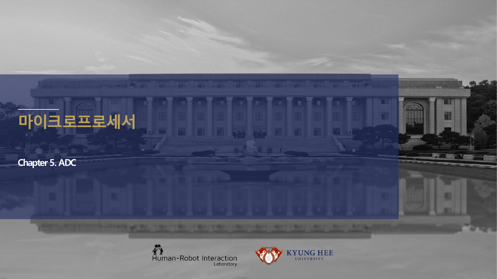
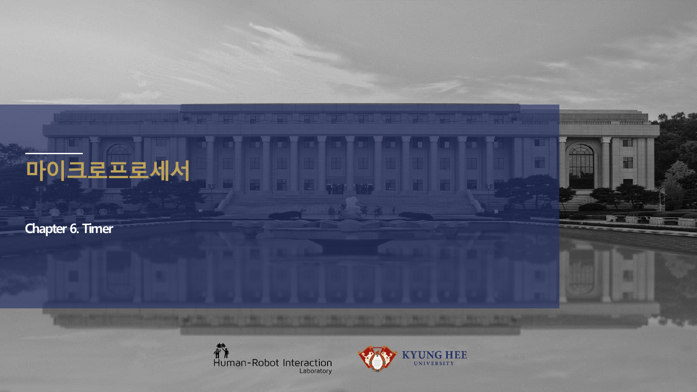
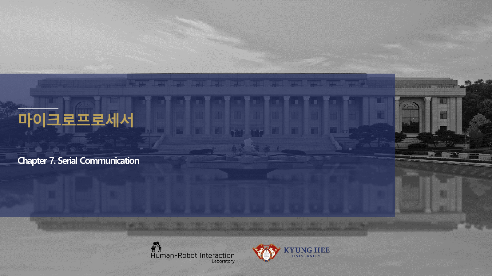

# 10주차 실습 코칭노트 · ADC·Timer·UART

> 10주차 실습은 `ADC, Timer, UART 통합`를 학생 손으로 확인하게 만드는 운영 자료다.

## 실습에서 바로 띄울 이미지

## 오늘의 실습 미션

- 미션 1: 전압분배 출력값을 ADC 코드로 예측하고 실제 측정값과 비교한다.
- 미션 2: Timer PWM 듀티를 바꾸며 오실로스코프 듀티와 코드 값을 맞춘다.
- 미션 3: UART 보레이트를 일부러 틀리게 설정해 깨진 문자를 관찰한 뒤 복구한다.
- 사용할 자료: `stm32-adc-updated.pdf / stm32-tim.pdf / stm32-serial-communication-updated.pdf`
- 제출 증거: 계산식, 캡처, 사진, 로그 중 `ADC, Timer, UART 통합`를 입증하는 자료 하나 이상.

## 실습 전 확인

### 장비와 배선
ADC·Timer·UART 실습 전에는 전원, 커넥터 방향, 공통 그라운드, 시리얼 포트를 오늘 주제에 맞춰 확인한다.

### 예측값 작성
보드에 손대기 전에 `ADC, Timer, UART 통합`와 관련된 예상 전압, 전류, 주파수, RPM, 또는 로그 형식을 먼저 쓴다.

### 안전 조건
실패했을 때 어떤 출력을 즉시 끄고 어떤 로그를 남길지 팀별로 한 줄씩 합의한다.

## 코칭 질문

1. ADC, Timer, UART 통합에서 지금 조작하는 값은 입력인가, 처리 결과인가, 보호 조건인가?
2. 전압분배 출력값을 ADC 코드로 예측하고 실제 측정값과 비교한다. 결과가 예상과 다르면 어떤 측정점부터 확인할 것인가?
3. Timer PWM 듀티를 바꾸며 오실로스코프 듀티와 코드 값을 맞춘다. 과정에서 하드웨어 원인과 펌웨어 원인을 어떻게 분리할 것인가?
4. UART 보레이트를 일부러 틀리게 설정해 깨진 문자를 관찰한 뒤 복구한다. 결과를 다음 주차 설계에 어떻게 반영할 것인가?

## 팀 활동 절차

1. 첨부자료 이미지에 `ADC, Timer, UART 통합` 위치를 표시한다.
2. 예측값을 적고 교수자에게 단위와 기준값을 확인받는다.
3. 실습을 수행하되 위험한 전원 조건이나 무부하 고속 회전을 피한다.
4. 결과 파일명을 `week10_team_result` 형식으로 저장한다.
5. 실패 원인을 하드웨어, 펌웨어, 측정 조건 중 하나로 먼저 분류한다.

## 평가 루브릭

### A 수준
ADC 코드에서 실제 전압으로 환산하는 식을 쓰게 한다. 또한 실험 증거와 `ADC, Timer, UART 통합`의 시스템 위치를 함께 설명한다.

### B 수준
Timer 클럭, PSC, ARR로 주파수를 계산하게 한다. 다만 최악 조건이나 안전 여유 설명이 일부 부족하다.

### C 수준
UART 로그 형식을 정하고 Teleplot에 표시될 변수명을 설계하게 한다. 하지만 재현 절차나 측정 조건이 빠져 있다.

### D 수준
ADC·Timer·UART의 실행 여부만 적고 수치, 그림, 로그 증거가 없다.

## 보강 과제

- 배터리 전압분배가 틀리면 저전압 Fault가 너무 늦거나 너무 빨리 걸린다.
- PWM 주파수가 낮으면 모터 소음이 커지고 너무 높으면 스위칭 손실이 늘어난다.
- 시리얼 로그가 없으면 현장 고장을 재현해도 원인을 설명하기 어렵다.
- AI 도구를 사용했다면 질문, 답변 요약, 사람이 검증한 항목을 함께 제출한다.
