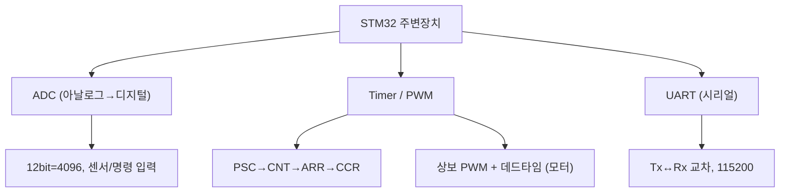

# 10주차 · STM32 주변장치 — ADC·Timer·UART

> 🔗 **강의 흐름** — 지난주 인터럽트에 이어, 이번 주는 로봇의 감각·구동·통신인 **ADC·Timer·UART**. 다음 주부터 이걸 담을 하드웨어를 설계한다.

> **학습목표** — 명령/센서 ADC 입력, 타이머/상보 PWM, UART 시리얼 통신을 구현하고 주기 태스크를 설계한다.

> 💡 **기초 다지기 (쉽게 이해하기)** — **ADC·타이머·UART?** ADC는 센서의 아날로그 전압을 숫자로 바꾸고, 타이머는 정확한 시간·PWM을 만들며, UART는 선 2개로 컴퓨터와 문자를 주고받는다(디버깅·원격 명령). 로봇이 "보고·움직이고·말하는" 3대 기능이다.


## 🗺️ 한눈에 보는 개념도



## 📈 ADC — 샘플링과 양자화


`ADC_out = (2^N−1)·Vin/Vref`. 12bit=4096단계(3.3V/스텝 0.8mV). 오차: 양자화/오프셋/이득. 다채널은 DMA 권장.

## ⏲️ Timer/PWM 로 평균전압


레지스터 `PSC→CNT→ARR(주파수)→CCR(듀티)`. **TIM1/8=상보출력+데드타임(모터용)**. 엔코더 모드로 휠 속도 측정도 가능.

**UART** — Start+Data+Parity+Stop, Tx↔Rx 교차, 115200. printf 리타게팅(`__io_putchar`). 원격 명령·Teleplot에 사용.

## 🧠 핵심 이론 보강

!!! info "이미지로 설명하기"
    

    

    첫 화면에서는 첨부자료 이미지를 보여 주고, 바로 아래 도해로 원리를 단순화한다. 학생에게 “사진 속 실제 부품/단자”와 “도해 속 기능 블록”을 서로 연결하게 하면 추상 개념이 실습 대상으로 바뀐다.

### 1. 이번 주 이론을 어디에 쓰는가

- ADC는 연속값을 샘플링하고 양자화해 디지털 수치로 바꾼다.
- Timer는 PWM 생성, 주기 이벤트, 입력 캡처처럼 시간 기준이 필요한 기능을 맡는다.
- UART 로그는 제어기가 왜 그런 출력을 냈는지 사후 분석하게 해 주는 최소 진단 채널이다.

### 2. 강의 중 반드시 남길 판서

| 판서 항목 | 설명 | 실습 연결 |
|---|---|---|
| 핵심 관계식 | `ADC LSB=Vref/(2^N-1), fpwm=fclk/(PSC+1)/(ARR+1)` | 계산값을 먼저 예측하고 측정값으로 검증한다. |
| 입력 조건 | 전압, 전류, 주파수, RPM, 핀 상태 중 이번 주 주제에 해당하는 값을 정한다. | 조건이 빠지면 결과 비교가 불가능하다는 점을 강조한다. |
| 정상/비정상 판단 | 정상 범위와 즉시 정지해야 할 조건을 분리한다. | 최종 프로젝트의 안전 상태와 로그 항목으로 이어진다. |

### 3. 학생 눈높이 설명 순서

1. **현상 관찰**: 첨부 이미지에서 실제 부품, 커넥터, 파형, 코드 위치를 먼저 찾는다.
2. **모델 단순화**: 핵심 도해와 공식으로 “왜 그런 값이 나오는지”를 설명한다.
3. **설계 판단**: 부품값, 듀티, 샘플링 주기, 보호 기준처럼 학생이 직접 정해야 하는 값을 고른다.
4. **검증 증거**: 사진, 계산표, 오실로스코프 캡처, UART 로그 중 하나 이상으로 결과를 남긴다.

!!! warning "학생들이 자주 헷갈리는 지점"
    이번 주제는 암기보다 조건 확인이 중요하다. 회로·펌웨어·제어 문제는 같은 증상으로 보일 수 있으므로, 전원 조건 → 신호 조건 → 코드 조건 순서로 좁혀 가게 한다.

!!! tip "최신 기술 연결"
    현대 ECU는 센서 샘플링, PWM 타이밍, 시리얼 로그를 동기화해 현장 고장을 재현 가능한 데이터로 남긴다. SDV, Adaptive AUTOSAR, 엣지 AI MCU, 차량 사이버보안, ISO 26262 기능안전은 서로 다른 주제처럼 보이지만 모두 '측정 가능한 요구사항과 검증 가능한 로그'를 요구한다.

### 4. 실습 전환 포인트

ADC 샘플링 주기와 PWM 주기를 표로 정리하고, UART 로그가 제어 루프를 방해하지 않는지 확인한다. 이 활동은 확장 강의자료의 심화노트, 실습 코칭노트, 평가팩, 사례노트와 이어지며, 한 주차 안에서 “이론 설명 → 손으로 확인 → 평가 → 현장 사례”가 끊기지 않도록 구성한다.

## 🎞️ 통합 강의 슬라이드
> 통합 근거: STM32 펌웨어 기술노트 10주차 + ADC/TIM/UART 첨부자료.

!!! note "슬라이드 1 · ADC는 현실 전압을 숫자로 바꾼다"
    샘플링, 양자화, 부호화 순서로 설명한다. 12bit와 3.3V 기준이면 한 단계(LSB)가 약 0.8mV라는 감각을 만든다.

!!! note "슬라이드 2 · Timer는 시간과 PWM의 공통 기반이다"
    PSC, CNT, ARR, CCR을 하나의 흐름으로 이해하면 주기, 듀티, 입력캡처, 엔코더 모드가 같은 구조로 보인다.

!!! note "슬라이드 3 · UART는 디버깅과 데이터 수집의 입구다"
    Tx/Rx 교차, baudrate, 프레임 구조를 확인한 뒤 printf 리타게팅과 Teleplot 포맷으로 연결한다.

!!! note "슬라이드 4 · 세 주변장치를 하나의 루프로 통합한다"
    ADC로 명령을 읽고 Timer로 PWM을 만들며 UART로 로그를 보낸다. 이 작은 루프가 15주차 모터 펌웨어의 축소판이다.

!!! note "슬라이드 5 · DMA와 주기 태스크를 소개한다"
    다채널 ADC는 DMA가 유리하고, SysTick이나 Timer 기반 주기 태스크가 로그/제어 주기를 분리한다.

## 📦 용어 박스
!!! abstract "이번 주 꼭 설명할 용어"
    - **ADC**: 아날로그 전압을 디지털 숫자로 변환하는 주변장치.
    - **샘플링**: 연속 신호를 일정 시간 간격으로 읽는 과정.
    - **ARR/CCR**: 타이머 주기와 비교값을 정해 PWM 주파수와 듀티를 만든다.
    - **UART**: 비동기 직렬 통신. 디버그 로그와 원격 명령에 사용한다.
    - **DMA**: CPU 개입을 줄이고 주변장치 데이터를 메모리로 자동 이동하는 기능.

!!! tip "최신 기술 연결"
    UART/Teleplot 로그를 CSV로 남기면 실시간 제어 실험이 데이터 기반 진단과 ML 학습 파이프라인으로 확장된다.

## 📚 확장 강의자료

- [10주차 심화 강의노트](week10-deep-dive.md): 첨부자료 대표 이미지, 판서 흐름, 오개념 교정, 최신 기술 연결을 포함한 이론 확장 자료.
- [10주차 실습 코칭노트](week10-lab-coach.md): 팀 실습 절차, 코칭 질문, 평가 루브릭, 보강 과제를 포함한 수업 운영 자료.
- [10주차 평가·문제팩](week10-assessment-pack.md): 10분 퀴즈, 계산·해석 문제, 구두 발표 질문, 채점 루브릭.
- [10주차 현장 사례노트](week10-case-note.md): 실제 고장 시나리오, 진단 절차, 보고서 연결 문장.

!!! success "메인 자료와 확장 자료를 함께 쓰는 순서"
    1. 메인 페이지의 개념도와 핵심 이론 보강으로 `ADC, Timer, UART 통합`의 큰 그림을 설명한다.
    2. 심화 강의노트에서 첨부자료 이미지를 확대해 판서와 계산을 진행한다.
    3. 실습 코칭노트로 팀별 측정·로그·사진 증거를 만들게 한다.
    4. 평가·문제팩과 사례노트로 이해 확인, 고장 진단, 최종 보고서 문장을 연결한다.
## ⏱️ 3시간 수업 운영안

| 시간 | 활동 | 학생 산출물 |
|---|---|---|
| 0:00-0:25 | 센서·시간·통신 주변장치가 제어루프에 들어가는 위치 확인 | 주변장치 블록도 |
| 0:25-1:15 | ADC, Timer/PWM, UART 핵심 레지스터와 HAL 사용 흐름 | 설정 순서표 |
| 1:25-2:25 | ADC 값을 UART/Teleplot으로 보내고 PWM 듀티를 바꾸는 통합 실습 | 시리얼 로그와 파형 |
| 2:25-3:00 | 센서 데이터셋화와 제어/AI 확장 토의 | CSV 로그 샘플 |

## 📎 수업자료 활용

| 자료 | 수업 중 쓰는 장면 |
|---|---|
| [stm32-adc-updated.pdf](attachments/stm32-adc-updated.pdf) | ADC 샘플링·양자화와 입력 회로 설명 |
| [stm32-tim.pdf](attachments/stm32-tim.pdf) | Timer, PWM, 주기 태스크 자료 |
| [stm32-serial-communication-updated.pdf](attachments/stm32-serial-communication-updated.pdf) | UART 디버깅과 통신 자료 |
| figures/adc.svg | ADC 샘플링 개념 설명 |

## ✅ 이해 확인 질문

1. 12bit ADC에서 3.3V 기준 1스텝 전압을 계산한다.
2. ARR/CCR/PSC가 PWM 주파수와 듀티를 어떻게 결정하는지 설명한다.
3. UART 로그가 디버깅과 데이터 수집에 동시에 쓰이는 이유를 말한다.

## 💻 실습 코드 (주석 포함) — `code/week10_adc_timer_uart.c`

센서 읽기(ADC)·모터 속도(PWM)·통신(UART)을 한 루프에 묶은 핵심 예제. [⬇ 전체 코드](code/week10_adc_timer_uart.c)

```c
/*
 * [10주차] 주변장치 3종 — ADC(센서) · Timer PWM(모터) · UART(통신)
 * ---------------------------------------------------------------
 * 로봇의 "보고(ADC) · 움직이고(PWM) · 말하는(UART)" 기본기.
 * (교육용 간략 예제 — 실제는 클럭/핀 설정을 CubeMX나 레퍼런스매뉴얼로 맞춘다)
 */
#include "stm32f767xx.h"
#include <stdio.h>

/* ---------------- ADC: 아날로그 전압 → 12비트 숫자(0~4095) ---------------- */
uint16_t adc_read(void)
{
    ADC1->CR2 |= ADC_CR2_SWSTART;                 /* 변환 시작 */
    while (!(ADC1->SR & ADC_SR_EOC)) { }          /* EOC(변환완료) 플래그 대기(폴링) */
    return (uint16_t)ADC1->DR;                    /* 결과 읽기 → 플래그 자동 클리어 */
}
/* 변환식: 전압 = ADC값 / 4095 * Vref(3.3V). 예: 쓰로틀/배터리 분압 전압 계산 */
float adc_to_voltage(uint16_t raw){ return (float)raw * 3.3f / 4095.0f; }

/* ---------------- Timer PWM: 모터 속도(듀티) 만들기 ---------------- */
/* TIM_CCR 값이 듀티를 결정. duty(0.0~1.0) → CCR = ARR * duty */
void pwm_set_duty(float duty)
{
    if (duty < 0) duty = 0; if (duty > 1) duty = 1;   /* 안전 클램프 */
    TIM3->CCR1 = (uint32_t)((float)TIM3->ARR * duty); /* 좌모터 채널 예시 */
}

/* ---------------- UART: 문자 1개 송신(디버깅/원격 명령) ---------------- */
void uart_putc(char c)
{
    while (!(USART2->ISR & USART_ISR_TXE)) { }   /* 송신버퍼 빌 때까지 대기 */
    USART2->TDR = (uint8_t)c;
}
/* printf 리타게팅: 이 함수를 정의하면 printf가 UART로 나간다(Teleplot 등) */
int __io_putchar(int ch){ uart_putc((char)ch); return ch; }

int main(void)
{
    /* (init 생략) 아래는 10주차 통합 실습의 핵심 루프 개념 */
    while (1) {
        uint16_t raw = adc_read();               /* 1) 쓰로틀/센서 읽기 */
        float v = adc_to_voltage(raw);
        float duty = v / 3.3f;                    /* 2) 전압을 듀티로 매핑(예시) */
        pwm_set_duty(duty);                       /* 3) 모터 PWM 출력 */
        printf(">throttle:%.2f\n", v);           /* 4) Teleplot 포맷으로 UART 출력 */
    }
}
```

## 🧪 실습·과제

- [ ] ADC값 UART 출력, 1초 주기 LED 태스크, 시리얼 모니터 캡처
- [ ] 타이머 PWM으로 모터 듀티 제어, 엔코더 모드로 속도 읽기
- [ ] ADC·Timer·UART 통합 실습 결과 제출

> **🤖 AX 연계** — ADC/UART로 수집한 센서 데이터를 Teleplot·CSV로 데이터셋화하여 ML 학습 파이프라인을 준비한다.
