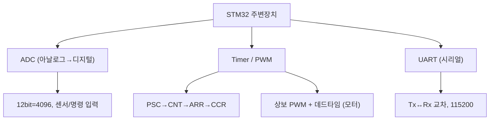
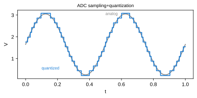
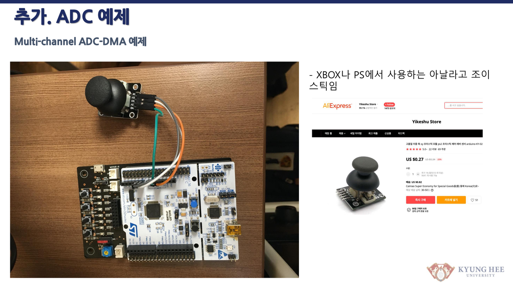
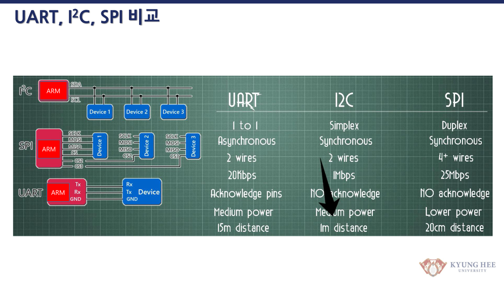
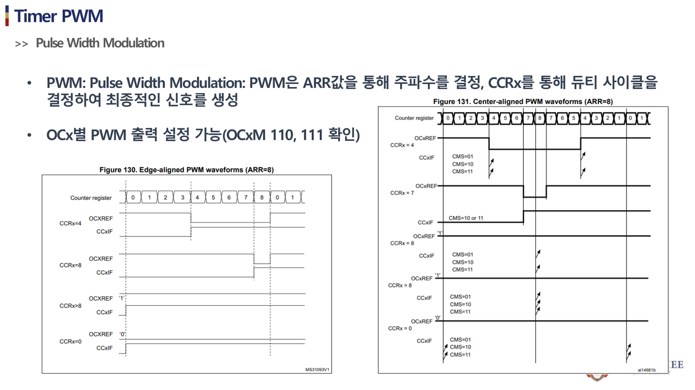

# 10주차 · STM32 주변장치 — ADC·Timer·UART

> 🔗 **강의 흐름** — 지난주 인터럽트에 이어, 이번 주는 로봇의 감각·구동·통신인 **ADC·Timer·UART**. 다음 주부터 이걸 담을 하드웨어를 설계한다.

> **학습목표** — 명령/센서 ADC 입력, 타이머/상보 PWM, UART 시리얼 통신을 구현하고 주기 태스크를 설계한다.

> 💡 **기초 다지기 (쉽게 이해하기)** — **ADC·타이머·UART?** ADC는 센서의 아날로그 전압을 숫자로 바꾸고, 타이머는 정확한 시간·PWM을 만들며, UART는 선 2개로 컴퓨터와 문자를 주고받는다(디버깅·원격 명령). 로봇이 "보고·움직이고·말하는" 3대 기능이다.

!!! danger "🔴 (변경 필요) — 저작권 검토 대상"
    이 주차의 **원본 첨부 PDF 링크·슬라이드 미리보기 이미지**(chcbaram 원본 자료)는 저작권상 공개 배포 전 **자작 자료로 교체하거나 인용 허가**가 필요하다. 정식 공개 시 반드시 변경한다.


## 🗺️ 한눈에 보는 개념도



## 📈 ADC — 샘플링과 양자화



`ADC_out = (2^N−1)·Vin/Vref`. 12bit=4096단계(3.3V/스텝 0.8mV). 오차: 양자화/오프셋/이득. 다채널은 DMA 권장.

## ⏲️ Timer/PWM 로 평균전압


레지스터 `PSC→CNT→ARR(주파수)→CCR(듀티)`. **TIM1/8=상보출력+데드타임(모터용)**. 엔코더 모드로 휠 속도 측정도 가능.

**UART** — Start+Data+Parity+Stop, Tx↔Rx 교차, 115200. printf 리타게팅(`__io_putchar`). 원격 명령·Teleplot에 사용.

!!! note "🔗 여기서부터 확장 자료 — 흐름 이어보기"
    아래는 위 핵심 개념(개념도·공식·그림)을 더 깊이 파는 **심화·실습·평가·사례** 자료다. 처음 보는 학생은 페이지 맨 위 「💡 기초 다지기」로 큰 그림을 먼저 잡고, 심화 → 실습 → 평가 → 사례 순으로 읽으면 이번 주 흐름이 자연스럽게 이어진다.


## 🧠 핵심 이론 보강

!!! info "이미지로 설명하기"
    

    

    첫 화면에서는 첨부자료 이미지를 보여 주고, 바로 아래 도해로 원리를 단순화한다. 학생에게 “사진 속 실제 부품/단자”와 “도해 속 기능 블록”을 서로 연결하게 하면 추상 개념이 실습 대상으로 바뀐다.

### 1. 이번 주 이론을 어디에 쓰는가

- ADC는 연속값을 샘플링하고 양자화해 디지털 수치로 바꾼다.
- Timer는 PWM 생성, 주기 이벤트, 입력 캡처처럼 시간 기준이 필요한 기능을 맡는다.
- UART 로그는 제어기가 왜 그런 출력을 냈는지 사후 분석하게 해 주는 최소 진단 채널이다.

### 2. 강의 중 반드시 남길 판서

| 판서 항목 | 설명 | 실습 연결 |
|---|---|---|
| 핵심 관계식 | `ADC LSB=Vref/(2^N-1), fpwm=fclk/(PSC+1)/(ARR+1)` | 계산값을 먼저 예측하고 측정값으로 검증한다. |
| 입력 조건 | 전압, 전류, 주파수, RPM, 핀 상태 중 이번 주 주제에 해당하는 값을 정한다. | 조건이 빠지면 결과 비교가 불가능하다는 점을 강조한다. |
| 정상/비정상 판단 | 정상 범위와 즉시 정지해야 할 조건을 분리한다. | 최종 프로젝트의 안전 상태와 로그 항목으로 이어진다. |

### 3. 학생 눈높이 설명 순서

1. **현상 관찰**: 첨부 이미지에서 실제 부품, 커넥터, 파형, 코드 위치를 먼저 찾는다.
2. **모델 단순화**: 핵심 도해와 공식으로 “왜 그런 값이 나오는지”를 설명한다.
3. **설계 판단**: 부품값, 듀티, 샘플링 주기, 보호 기준처럼 학생이 직접 정해야 하는 값을 고른다.
4. **검증 증거**: 사진, 계산표, 오실로스코프 캡처, UART 로그 중 하나 이상으로 결과를 남긴다.

!!! warning "학생들이 자주 헷갈리는 지점"
    이번 주제는 암기보다 조건 확인이 중요하다. 회로·펌웨어·제어 문제는 같은 증상으로 보일 수 있으므로, 전원 조건 → 신호 조건 → 코드 조건 순서로 좁혀 가게 한다.

!!! tip "최신 기술 연결"
    현대 ECU는 센서 샘플링, PWM 타이밍, 시리얼 로그를 동기화해 현장 고장을 재현 가능한 데이터로 남긴다. SDV, Adaptive AUTOSAR, 엣지 AI MCU, 차량 사이버보안, ISO 26262 기능안전은 서로 다른 주제처럼 보이지만 모두 '측정 가능한 요구사항과 검증 가능한 로그'를 요구한다.

### 4. 실습 전환 포인트

ADC 샘플링 주기와 PWM 주기를 표로 정리하고, UART 로그가 제어 루프를 방해하지 않는지 확인한다. 이 활동은 확장 강의자료의 심화노트, 실습 코칭노트, 평가팩, 사례노트와 이어지며, 한 주차 안에서 “이론 설명 → 손으로 확인 → 평가 → 현장 사례”가 끊기지 않도록 구성한다.

## 🖼️ 슬라이드 이미지

!!! quote "슬라이드 이미지 1 · 첨부자료 대표 이미지"
    

    아날로그 조이스틱과 STM32 보드 연결을 보며 센서 전압이 ADC 코드와 UART 로그로 변환되는 흐름을 짚는다.

!!! quote "슬라이드 이미지 2 · 핵심 도해"
    

    UART·I2C·SPI의 배선 수, 동기/비동기, 거리·속도 차이를 비교해 디버깅 통신 선택 기준을 세운다.

!!! quote "슬라이드 이미지 3 · 실습 보조 도해"
    

    TIM PWM 모드 파형과 OC 동작을 보며 ARR·CCR·듀티 계산을 실제 레지스터 설정과 연결한다.

!!! quote "슬라이드 이미지 4 · 평가·사례 도해"
    

    샘플링, 양자화, 기준전압, 필터링 개념을 ADC 변환 흐름으로 묶어 센서값 신뢰도를 판단하게 한다.

## 🎞️ 통합 강의 슬라이드
> 통합 근거: STM32 펌웨어 기술노트 10주차 + ADC/TIM/UART 첨부자료.

!!! note "슬라이드 1 · ADC는 현실 전압을 숫자로 바꾼다"
    샘플링, 양자화, 부호화 순서로 설명한다. 12bit와 3.3V 기준이면 한 단계(LSB)가 약 0.8mV라는 감각을 만든다.

!!! note "슬라이드 2 · Timer는 시간과 PWM의 공통 기반이다"
    PSC, CNT, ARR, CCR을 하나의 흐름으로 이해하면 주기, 듀티, 입력캡처, 엔코더 모드가 같은 구조로 보인다.

!!! note "슬라이드 3 · UART는 디버깅과 데이터 수집의 입구다"
    Tx/Rx 교차, baudrate, 프레임 구조를 확인한 뒤 printf 리타게팅과 Teleplot 포맷으로 연결한다.

!!! note "슬라이드 4 · 세 주변장치를 하나의 루프로 통합한다"
    ADC로 명령을 읽고 Timer로 PWM을 만들며 UART로 로그를 보낸다. 이 작은 루프가 15주차 모터 펌웨어의 축소판이다.

!!! note "슬라이드 5 · DMA와 주기 태스크를 소개한다"
    다채널 ADC는 DMA가 유리하고, SysTick이나 Timer 기반 주기 태스크가 로그/제어 주기를 분리한다.

## 📦 용어 박스
!!! abstract "이번 주 꼭 설명할 용어"
    - **ADC**: 아날로그 전압을 디지털 숫자로 변환하는 주변장치.
    - **샘플링**: 연속 신호를 일정 시간 간격으로 읽는 과정.
    - **ARR/CCR**: 타이머 주기와 비교값을 정해 PWM 주파수와 듀티를 만든다.
    - **UART**: 비동기 직렬 통신. 디버그 로그와 원격 명령에 사용한다.
    - **DMA**: CPU 개입을 줄이고 주변장치 데이터를 메모리로 자동 이동하는 기능.

!!! tip "최신 기술 연결"
    UART/Teleplot 로그를 CSV로 남기면 실시간 제어 실험이 데이터 기반 진단과 ML 학습 파이프라인으로 확장된다.

## 📚 통합 확장 강의자료

!!! info "확장 자료 통합 안내"
    기존의 10주차 심화·실습·평가·사례 확장 페이지를 이 주차 메인 자료 안으로 합쳤다. 교수자는 이 섹션을 필요한 만큼 접어 읽히거나, 수업 후 과제·보충자료로 배정하면 된다.

### 심화 강의노트

> 10주차 심화노트는 `ADC, Timer, UART 통합`를 3시간 강의에서 설명하기 위한 교수자용 자료다.

###### 수업에서 바로 보여줄 이미지


###### 강의 핵심 초점

- ADC·Timer·UART의 중심 질문은 "ADC, Timer, UART 통합이 최종 AMR ECU에서 어떤 문제를 해결하는가"이다.
- 연결할 첨부자료는 `stm32-adc-updated.pdf / stm32-tim.pdf / stm32-serial-communication-updated.pdf`이며, 학생은 그림 위에 입력·처리·출력·위험요소를 직접 표시한다.
- 이번 주 설명은 이전 주 산출물과 다음 주 실습으로 이어지는 설계 판단을 남기는 데 초점을 둔다.

###### 교수자 설명 스크립트

1. ADC는 연속 전압을 기준전압과 비트 수에 따라 디지털 코드로 바꾼다.
2. Timer는 PWM 출력, 주기 인터럽트, 입력캡처를 모두 만드는 시간 기준이다.
3. UART는 디버깅 문자열을 넘어서 Teleplot과 무선 모듈 상태 전송에 쓰인다.

###### 판서 흐름

##### 도입 판서
3.3V, 12bit ADC에서 1 LSB가 몇 mV인지 계산한다.

##### 원리 판서
PSC와 ARR로 1kHz PWM을 만든 뒤 같은 타이머가 인터럽트도 만들 수 있음을 보인다.

##### 검증 판서
Teleplot 형식 `>rpm:123`을 실제 문자열과 그래프 표시로 연결한다.

###### 이론 보강 슬라이드 세트

!!! note "슬라이드 A · 실제 자료에서 출발"
    `stm32-adc-updated.pdf / stm32-tim.pdf / stm32-serial-communication-updated.pdf`의 대표 이미지를 먼저 띄우고, 학생이 부품명보다 기능을 말하게 한다. “이 부분은 입력인가, 처리인가, 출력인가, 보호인가”를 묻는다.

!!! note "슬라이드 B · 핵심 원리 압축"
    - ADC는 연속값을 샘플링하고 양자화해 디지털 수치로 바꾼다.
    - Timer는 PWM 생성, 주기 이벤트, 입력 캡처처럼 시간 기준이 필요한 기능을 맡는다.
    - UART 로그는 제어기가 왜 그런 출력을 냈는지 사후 분석하게 해 주는 최소 진단 채널이다.

!!! note "슬라이드 C · 공식은 조건과 함께"
    `ADC LSB=Vref/(2^N-1), fpwm=fclk/(PSC+1)/(ARR+1)`를 판서하되, 공식 자체보다 어떤 조건에서 쓸 수 있는지 먼저 확인한다. 조건을 빼고 숫자만 넣는 풀이를 피하게 한다.

!!! note "슬라이드 D · 최종 프로젝트 연결"
    이번 주 산출물은 최종 AMR ECU의 요구사항, HSI, 회로도, 펌웨어 로그 중 하나로 반드시 재사용된다. 학생에게 “15주차 발표에서 이 결과가 어디에 들어가는가”를 한 줄로 쓰게 한다.

##### 교수자 보충 설명

- 3학년 수준에서는 수식을 과도하게 깊게 밀기보다, 수식의 입력값을 실제 회로·코드·로그에서 찾는 능력을 우선한다.
- 설명은 `현상 → 모델 → 설계값 → 검증` 순서로 반복한다. 이 순서를 고정하면 모터, 전원, 펌웨어, PCB 주제가 서로 다른 과목처럼 흩어지지 않는다.
- 오류가 나면 정답을 바로 주기보다 전원, 기준전위, 신호 방향, 시간 기준, 보호 조건 중 어느 축의 문제인지 분류하게 한다.

###### 3시간 수업 확장안

##### 0:00-0:20 · 이전 산출물 연결
ADC·Timer·UART 수업은 지난 주 결과 중 오늘의 `ADC, Timer, UART 통합`와 직접 연결되는 오류 하나를 골라 시작한다.

##### 0:20-0:55 · 첨부자료 해설
`stm32-adc-updated.pdf / stm32-tim.pdf / stm32-serial-communication-updated.pdf`의 대표 이미지를 띄우고, 학생에게 어느 선이 전원·센서·제어·진단 신호인지 표시하게 한다.

##### 1:05-1:40 · 핵심 계산과 판단
ADC 코드에서 실제 전압으로 환산하는 식을 쓰게 한다.

##### 1:40-2:25 · 팀별 적용
전압분배 출력값을 ADC 코드로 예측하고 실제 측정값과 비교한다. 이어서 Timer PWM 듀티를 바꾸며 오실로스코프 듀티와 코드 값을 맞춘다.

##### 2:25-3:00 · 결과 공유
UART 로그 형식을 정하고 Teleplot에 표시될 변수명을 설계하게 한다.

###### 오개념 교정

##### 첫 번째 오개념
ADC 값이 곧 실제 전압이라는 오해를 기준전압, 분해능, 센서 환산식으로 교정한다.

##### 두 번째 오개념
Timer는 delay 함수용이라는 생각을 PWM과 입력캡처까지 확장한다.

##### 세 번째 오개념
UART가 연결되면 항상 읽힌다는 믿음을 보레이트와 공통 그라운드 조건으로 바로잡는다.

###### 최신 기술 연결

- ADC·Timer·UART에서 남긴 로그와 계산값은 SDV 관점에서 ECU 진단 데이터의 출발점이 된다.
- `ADC, Timer, UART 통합`를 안전 요구사항으로 바꾸면 정상 동작뿐 아니라 고장 시 안전 상태도 함께 정의해야 한다.
- AI 도구는 설명과 가설 생성을 돕지만, 최종 판단은 학생이 만든 측정값과 회로 근거로 검증한다.

###### 마무리 질문

1. ADC, Timer, UART 통합을 설명할 때 가장 먼저 확인할 입력 조건은 무엇인가?
2. ADC·Timer·UART 실습 결과를 어떤 로그나 측정값으로 증명할 수 있는가?
3. 실제 차량 ECU에 적용한다면 어떤 진단 코드나 보호 동작을 추가해야 하는가?

### 실습 코칭노트

!!! tip "📌 실전 팁·주의점 (현장에서 자주 하는 실수)"
    ADC는 **기준전압(Vref)**·샘플링 시간을 확인하고 노이즈는 평균/필터. UART는 **보드레이트 일치** + Tx↔Rx 교차.


> 10주차 실습은 `ADC, Timer, UART 통합`를 학생 손으로 확인하게 만드는 운영 자료다.

###### 실습에서 바로 띄울 이미지


###### 오늘의 실습 미션

- 미션 1: 전압분배 출력값을 ADC 코드로 예측하고 실제 측정값과 비교한다.
- 미션 2: Timer PWM 듀티를 바꾸며 오실로스코프 듀티와 코드 값을 맞춘다.
- 미션 3: UART 보레이트를 일부러 틀리게 설정해 깨진 문자를 관찰한 뒤 복구한다.
- 사용할 자료: `stm32-adc-updated.pdf / stm32-tim.pdf / stm32-serial-communication-updated.pdf`
- 제출 증거: 계산식, 캡처, 사진, 로그 중 `ADC, Timer, UART 통합`를 입증하는 자료 하나 이상.

###### 실습 전 확인

##### 장비와 배선
ADC·Timer·UART 실습 전에는 전원, 커넥터 방향, 공통 그라운드, 시리얼 포트를 오늘 주제에 맞춰 확인한다.

##### 예측값 작성
보드에 손대기 전에 `ADC, Timer, UART 통합`와 관련된 예상 전압, 전류, 주파수, RPM, 또는 로그 형식을 먼저 쓴다.

##### 안전 조건
실패했을 때 어떤 출력을 즉시 끄고 어떤 로그를 남길지 팀별로 한 줄씩 합의한다.

###### 코칭 질문

1. ADC, Timer, UART 통합에서 지금 조작하는 값은 입력인가, 처리 결과인가, 보호 조건인가?
2. 전압분배 출력값을 ADC 코드로 예측하고 실제 측정값과 비교한다. 결과가 예상과 다르면 어떤 측정점부터 확인할 것인가?
3. Timer PWM 듀티를 바꾸며 오실로스코프 듀티와 코드 값을 맞춘다. 과정에서 하드웨어 원인과 펌웨어 원인을 어떻게 분리할 것인가?
4. UART 보레이트를 일부러 틀리게 설정해 깨진 문자를 관찰한 뒤 복구한다. 결과를 다음 주차 설계에 어떻게 반영할 것인가?

###### 강의자료-실습 통합 절차

##### 수업 전 5분 준비

- 메인 페이지의 핵심 도해와 `figures/attachment-previews/stm32-adc-sensor-demo-p34.png` 이미지를 같은 화면에 열어 둔다.
- 팀별로 오늘 확인할 입력 조건, 예상값, 위험 조건을 한 줄씩 적게 한다.
- 측정 장비가 없거나 시간이 부족한 팀은 첨부자료 이미지 위에 신호 흐름을 표시하는 대체 활동을 수행한다.

##### 실습 중 코칭 기준

| 관찰 상황 | 교수자 질문 | 기대되는 학생 반응 |
|---|---|---|
| 값은 나왔지만 근거가 없음 | 어떤 조건에서 측정했는가? | 전압, 주파수, 부하, 코드 버전을 함께 기록한다. |
| 회로 문제와 코드 문제가 섞임 | 하드웨어만 바꿔도 증상이 남는가? | 전원·배선·공통 GND를 먼저 분리한다. |
| 결과가 예상과 다름 | 예상식과 실제 로그 중 어느 쪽을 먼저 의심할까? | 단위, 기준값, 측정 위치를 재확인한다. |

##### 실습 후 정리

ADC 샘플링 주기와 PWM 주기를 표로 정리하고, UART 로그가 제어 루프를 방해하지 않는지 확인한다. 제출물에는 원본 사진이나 로그뿐 아니라, 왜 그 증거가 `ADC, Timer, UART 통합`를 설명하는지 한 문장 해석을 붙인다.

###### 팀 활동 절차

1. 첨부자료 이미지에 `ADC, Timer, UART 통합` 위치를 표시한다.
2. 예측값을 적고 교수자에게 단위와 기준값을 확인받는다.
3. 실습을 수행하되 위험한 전원 조건이나 무부하 고속 회전을 피한다.
4. 결과 파일명을 `week10_team_result` 형식으로 저장한다.
5. 실패 원인을 하드웨어, 펌웨어, 측정 조건 중 하나로 먼저 분류한다.

###### 평가 루브릭

##### A 수준
ADC 코드에서 실제 전압으로 환산하는 식을 쓰게 한다. 또한 실험 증거와 `ADC, Timer, UART 통합`의 시스템 위치를 함께 설명한다.

##### B 수준
Timer 클럭, PSC, ARR로 주파수를 계산하게 한다. 다만 최악 조건이나 안전 여유 설명이 일부 부족하다.

##### C 수준
UART 로그 형식을 정하고 Teleplot에 표시될 변수명을 설계하게 한다. 하지만 재현 절차나 측정 조건이 빠져 있다.

##### D 수준
ADC·Timer·UART의 실행 여부만 적고 수치, 그림, 로그 증거가 없다.

###### 보강 과제

- 배터리 전압분배가 틀리면 저전압 Fault가 너무 늦거나 너무 빨리 걸린다.
- PWM 주파수가 낮으면 모터 소음이 커지고 너무 높으면 스위칭 손실이 늘어난다.
- 시리얼 로그가 없으면 현장 고장을 재현해도 원인을 설명하기 어렵다.
- AI 도구를 사용했다면 질문, 답변 요약, 사람이 검증한 항목을 함께 제출한다.

### 평가·문제팩

> 이 문제팩은 `ADC, Timer, UART 통합` 이해도를 계산, 설명, 진단, 발표 네 관점에서 확인한다.

###### 평가 기준 이미지


###### 10분 퀴즈

1. ADC 코드에서 실제 전압으로 환산하는 식을 쓰게 한다.
2. Timer 클럭, PSC, ARR로 주파수를 계산하게 한다.
3. UART 로그 형식을 정하고 Teleplot에 표시될 변수명을 설계하게 한다.
4. `ADC, Timer, UART 통합`를 SDV 진단 데이터와 연결해 한 문장으로 설명하라.

###### 계산·해석 문제

##### 문제 1 · 입력 조건 정리
ADC·Timer·UART에서 필요한 입력 조건을 세 개 쓰고, 각 조건의 단위를 붙인다.

##### 문제 2 · 결과 예측
3.3V, 12bit ADC에서 1 LSB가 몇 mV인지 계산한다. 이때 학생 답안에는 식, 대입값, 단위, 결론이 들어가야 한다.

##### 문제 3 · 실패 원인 분류
배터리 전압분배가 틀리면 저전압 Fault가 너무 늦거나 너무 빨리 걸린다. 이 상황을 하드웨어, 펌웨어, 측정 조건으로 나누어 원인을 추정한다.

##### 문제 4 · 보호 기능 제안
PWM 주파수가 낮으면 모터 소음이 커지고 너무 높으면 스위칭 손실이 늘어난다. 이 문제를 줄이기 위한 감지 조건, 안전 상태, 로그 항목을 제안한다.

###### 구두 발표 질문

- `ADC, Timer, UART 통합`에서 학생이 실제로 측정한 값은 무엇인가?
- ADC 값이 곧 실제 전압이라는 오해를 기준전압, 분해능, 센서 환산식으로 교정한다.
- Timer는 delay 함수용이라는 생각을 PWM과 입력캡처까지 확장한다.
- UART가 연결되면 항상 읽힌다는 믿음을 보레이트와 공통 그라운드 조건으로 바로잡는다.

###### 채점 루브릭

##### 5점
ADC·Timer·UART의 시스템 위치, 수치 근거, 실험 증거, 안전 고려가 모두 명확하다.

##### 4점
핵심 원리는 맞고 `ADC, Timer, UART 통합` 증거도 있으나 최악 조건 설명이 약하다.

##### 3점
동작 결과는 있으나 ADC 코드에서 실제 전압으로 환산하는 식을 쓰게 한는 충분히 설명하지 못한다.

##### 2점
용어 설명은 있으나 실제 회로, 코드, 로그와 `ADC, Timer, UART 통합`를 연결하지 못한다.

##### 1점
결과만 제출하고 ADC·Timer·UART 판단 근거가 없다.

###### 슬라이드 기반 평가 문항 설계

##### 즉답형 확인

1. `ADC, Timer, UART 통합`를 설명할 때 가장 먼저 확인해야 할 입력 조건을 하나 쓰시오.
2. `ADC LSB=Vref/(2^N-1), fpwm=fclk/(PSC+1)/(ARR+1)`에서 학생이 직접 측정하거나 정해야 하는 값을 표시하시오.
3. 첨부자료 이미지에서 이번 주 주제와 연결되는 실제 부품, 단자, 파형, 코드 위치 중 하나를 지목하시오.

##### 서술형 확인

- 정상 동작과 비정상 동작을 구분하는 기준값을 정하고, 그 기준값을 어떻게 검증할지 쓰게 한다.
- 계산 결과와 측정 결과가 다를 때 가능한 원인을 하드웨어, 펌웨어, 측정 조건으로 나누어 설명하게 한다.

##### 발표 평가 포인트

- 발표자는 그림을 읽는 수준에서 멈추지 않고, 그림 속 요소가 최종 AMR ECU의 어떤 요구사항을 만족시키는지 말해야 한다.
- AI 도구를 사용한 경우, AI가 제안한 내용과 학생이 실제 자료로 검증한 내용을 분리해 적게 한다.

###### 보충 문제

1. 시리얼 로그가 없으면 현장 고장을 재현해도 원인을 설명하기 어렵다.
2. `stm32-adc-updated.pdf / stm32-tim.pdf / stm32-serial-communication-updated.pdf`의 대표 이미지에서 추가 측정 포인트 두 곳을 제안하라.
3. 팀 보고서 결론을 `ADC, Timer, UART 통합` 중심으로 한 문장 작성하라.

### 현장 사례노트

> 이 사례노트는 `ADC, Timer, UART 통합`를 실제 AMR, 전동킥보드, 로버, 차량 ECU 문제로 연결한다.

###### 사례 연결 이미지


###### 현장 맥락

- 사례 주제: ADC, Timer, UART 통합
- 학생 실습은 작은 보드에서 진행하지만, 판단 구조는 실제 모빌리티 ECU의 고장 분석과 같다.
- 현장에서는 정상 동작보다 고장 재현, 로그 확보, 안전 정지가 더 중요하다.

###### 사례 시나리오

##### 사례 1 · 초기 증상
배터리 전압분배가 틀리면 저전압 Fault가 너무 늦거나 너무 빨리 걸린다.

##### 사례 2 · 반복 증상
PWM 주파수가 낮으면 모터 소음이 커지고 너무 높으면 스위칭 손실이 늘어난다.

##### 사례 3 · 현장 진단
시리얼 로그가 없으면 현장 고장을 재현해도 원인을 설명하기 어렵다.

##### 사례 4 · 팀 프로젝트 연결
UART 보레이트를 일부러 틀리게 설정해 깨진 문자를 관찰한 뒤 복구한다. 이 결과를 팀 보고서의 개선 항목으로 남긴다.

###### 교수자 설명 포인트

1. ADC는 연속 전압을 기준전압과 비트 수에 따라 디지털 코드로 바꾼다.
2. Timer는 PWM 출력, 주기 인터럽트, 입력캡처를 모두 만드는 시간 기준이다.
3. UART는 디버깅 문자열을 넘어서 Teleplot과 무선 모듈 상태 전송에 쓰인다.
4. `ADC, Timer, UART 통합` 사례를 안전, 진단, 업데이트 관점 중 하나로 반드시 확장한다.

###### 토론 질문

- ADC·Timer·UART 문제가 주행 중 발생하면 즉시 정지해야 하는가, 제한 동작이 가능한가?
- 사용자가 볼 수 있는 오류 메시지는 `ADC, Timer, UART 통합`를 어떻게 표현해야 하는가?
- OTA로 고칠 수 있는 문제와 하드웨어 수정이 필요한 문제를 어떻게 구분할 것인가?
- 다음 설계에서는 어떤 센서, 보호회로, 로그 항목을 추가할 것인가?

###### 보고서 연결 문장

- "본 실험은 ADC, Timer, UART 통합을 AMR ECU 관점에서 검증하기 위해 수행하였다."
- "측정 결과는 ADC·Timer·UART 설계값과 비교해 하드웨어, 펌웨어, 제어 파라미터 원인으로 나누었다."
- "최종 시스템에서는 ADC, Timer, UART 통합 관련 고장 감지 후 안전 상태로 전이하고 로그를 남겨야 한다."

###### 사례 분석 보강

##### 현장 진단 프레임

1. **증상 정의**: 움직이지 않음, 과열, 노이즈, 통신 실패, 속도 불안정처럼 관찰 가능한 말로 시작한다.
2. **경로 분리**: 전력 경로, 신호 경로, 소프트웨어 경로 중 어느 쪽에서 증상이 시작되는지 구분한다.
3. **측정 우선순위**: 가장 위험한 전원 조건을 먼저 배제하고, 그 다음 신호와 코드 로그를 본다.
4. **재발 방지**: 부품값, 배선, 펌웨어 보호, 시험 절차 중 무엇을 바꿀지 정한다.

##### 이번 주 사례 연결

`ADC, Timer, UART 통합` 문제는 작은 실습 오류처럼 보이지만 실제 모빌리티 ECU에서는 안전 정지, 진단 코드, 정비 절차로 이어진다. 사례 토론에서는 “원인 하나 찾기”보다 “다시 발생하지 않게 만드는 설계 변경”을 답으로 요구한다.

##### 최신 기술 관점 질문

- SDV/존 아키텍처 차량이라면 이 증상을 어느 ECU 로그에서 먼저 찾을까?
- 기능안전 관점에서 즉시 안전 상태로 전환해야 하는 조건은 무엇인가?
- 사이버보안 관점에서 외부 통신이나 업데이트가 이 고장 진단에 어떤 위험을 추가할 수 있는가?

###### 다음 단계

- ADC 코드에서 실제 전압으로 환산하는 식을 쓰게 한다.
- Timer 클럭, PSC, ARR로 주파수를 계산하게 한다.
- UART 로그 형식을 정하고 Teleplot에 표시될 변수명을 설계하게 한다.

## ⏱️ 3시간 수업 운영안

| 시간 | 활동 | 학생 산출물 |
|---|---|---|
| 0:00-0:25 | 센서·시간·통신 주변장치가 제어루프에 들어가는 위치 확인 | 주변장치 블록도 |
| 0:25-1:15 | ADC, Timer/PWM, UART 핵심 레지스터와 HAL 사용 흐름 | 설정 순서표 |
| 1:25-2:25 | ADC 값을 UART/Teleplot으로 보내고 PWM 듀티를 바꾸는 통합 실습 | 시리얼 로그와 파형 |
| 2:25-3:00 | 센서 데이터셋화와 제어/AI 확장 토의 | CSV 로그 샘플 |

## 📎 수업자료 활용

| 자료 | 수업 중 쓰는 장면 |
|---|---|
| [stm32-adc-updated.pdf](attachments/stm32-adc-updated.pdf) **(변경 필요)** | ADC 샘플링·양자화와 입력 회로 설명 |
| [stm32-tim.pdf](attachments/stm32-tim.pdf) **(변경 필요)** | Timer, PWM, 주기 태스크 자료 |
| [stm32-serial-communication-updated.pdf](attachments/stm32-serial-communication-updated.pdf) **(변경 필요)** | UART 디버깅과 통신 자료 |
| figures/adc.svg | ADC 샘플링 개념 설명 |

## ✅ 이해 확인 질문

1. 12bit ADC에서 3.3V 기준 1스텝 전압을 계산한다.
2. ARR/CCR/PSC가 PWM 주파수와 듀티를 어떻게 결정하는지 설명한다.
3. UART 로그가 디버깅과 데이터 수집에 동시에 쓰이는 이유를 말한다.

## 💻 실습 코드 (주석 포함) — `code/week10_adc_timer_uart.c`

센서 읽기(ADC)·모터 속도(PWM)·통신(UART)을 한 루프에 묶은 핵심 예제. [⬇ 전체 코드](code/week10_adc_timer_uart.c)

```c
/*
 * [10주차] 주변장치 3종 — ADC(센서) · Timer PWM(모터) · UART(통신)
 * ---------------------------------------------------------------
 * 로봇의 "보고(ADC) · 움직이고(PWM) · 말하는(UART)" 기본기.
 * (교육용 간략 예제 — 실제는 클럭/핀 설정을 CubeMX나 레퍼런스매뉴얼로 맞춘다)
 */
#include "stm32f767xx.h"
#include <stdio.h>

/* ---------------- ADC: 아날로그 전압 → 12비트 숫자(0~4095) ---------------- */
uint16_t adc_read(void)
{
    ADC1->CR2 |= ADC_CR2_SWSTART;                 /* 변환 시작 */
    while (!(ADC1->SR & ADC_SR_EOC)) { }          /* EOC(변환완료) 플래그 대기(폴링) */
    return (uint16_t)ADC1->DR;                    /* 결과 읽기 → 플래그 자동 클리어 */
}
/* 변환식: 전압 = ADC값 / 4095 * Vref(3.3V). 예: 쓰로틀/배터리 분압 전압 계산 */
float adc_to_voltage(uint16_t raw){ return (float)raw * 3.3f / 4095.0f; }

/* ---------------- Timer PWM: 모터 속도(듀티) 만들기 ---------------- */
/* TIM_CCR 값이 듀티를 결정. duty(0.0~1.0) → CCR = ARR * duty */
void pwm_set_duty(float duty)
{
    if (duty < 0) duty = 0; if (duty > 1) duty = 1;   /* 안전 클램프 */
    TIM3->CCR1 = (uint32_t)((float)TIM3->ARR * duty); /* 좌모터 채널 예시 */
}

/* ---------------- UART: 문자 1개 송신(디버깅/원격 명령) ---------------- */
void uart_putc(char c)
{
    while (!(USART2->ISR & USART_ISR_TXE)) { }   /* 송신버퍼 빌 때까지 대기 */
    USART2->TDR = (uint8_t)c;
}
/* printf 리타게팅: 이 함수를 정의하면 printf가 UART로 나간다(Teleplot 등) */
int __io_putchar(int ch){ uart_putc((char)ch); return ch; }

int main(void)
{
    /* (init 생략) 아래는 10주차 통합 실습의 핵심 루프 개념 */
    while (1) {
        uint16_t raw = adc_read();               /* 1) 쓰로틀/센서 읽기 */
        float v = adc_to_voltage(raw);
        float duty = v / 3.3f;                    /* 2) 전압을 듀티로 매핑(예시) */
        pwm_set_duty(duty);                       /* 3) 모터 PWM 출력 */
        printf(">throttle:%.2f\n", v);           /* 4) Teleplot 포맷으로 UART 출력 */
    }
}
```

!!! tip "📌 보충 설명 — 실전 팁·주의점"
    ADC는 **기준전압(Vref)**과 샘플링 시간을 확인하고 노이즈는 평균/필터. UART는 **양쪽 보드레이트 일치** + Tx↔Rx 교차.

## 🧪 실습·과제

- [ ] ADC값 UART 출력, 1초 주기 LED 태스크, 시리얼 모니터 캡처
- [ ] 타이머 PWM으로 모터 듀티 제어, 엔코더 모드로 속도 읽기
- [ ] ADC·Timer·UART 통합 실습 결과 제출

> **🤖 AX 연계** — ADC/UART로 수집한 센서 데이터를 Teleplot·CSV로 데이터셋화하여 ML 학습 파이프라인을 준비한다.
