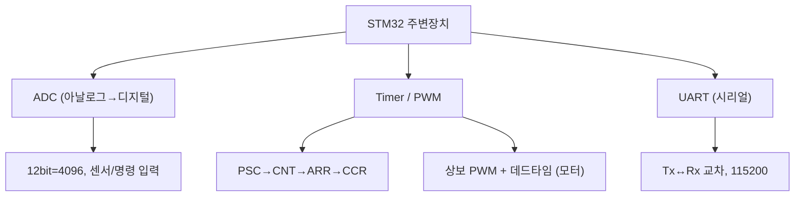

# 10주차 · STM32 주변장치 — ADC·Timer·UART

> **학습목표** — 명령/센서 ADC 입력, 타이머/상보 PWM, UART 시리얼 통신을 구현하고 주기 태스크를 설계한다.

> 💡 **기초 다지기 (쉽게 이해하기)** — **ADC·타이머·UART?** ADC는 센서의 아날로그 전압을 숫자로 바꾸고, 타이머는 정확한 시간·PWM을 만들며, UART는 선 2개로 컴퓨터와 문자를 주고받는다(디버깅·원격 명령). 로봇이 "보고·움직이고·말하는" 3대 기능이다.

## 🗺️ 한눈에 보는 개념도

## 📈 ADC — 샘플링과 양자화

`ADC_out = (2^N−1)·Vin/Vref`. 12bit=4096단계(3.3V/스텝 0.8mV). 오차: 양자화/오프셋/이득. 다채널은 DMA 권장.

## ⏲️ Timer/PWM 로 평균전압

레지스터 `PSC→CNT→ARR(주파수)→CCR(듀티)`. **TIM1/8=상보출력+데드타임(모터용)**. 엔코더 모드로 휠 속도 측정도 가능.

**UART** — Start+Data+Parity+Stop, Tx↔Rx 교차, 115200. printf 리타게팅(`__io_putchar`). 원격 명령·Teleplot에 사용.

## 용어·도해·트렌드 연결

| 항목 | 수업 중 연결 |
|---|---|
| 먼저 볼 용어 | [ADC](glossary.md#adc), [PWM](glossary.md#pwm), [Teleplot](glossary.md#teleplot) |
| 도해 |  |
| 최신 기술 연결 | UART/Teleplot 로그를 ROS 2 또는 클라우드 분석으로 보내기 전, MCU에서 의미 있는 데이터 구조로 만든다. |

## ⏱️ 3시간 수업 운영안

| 시간 | 활동 | 학생 산출물 |
|---|---|---|
| 0:00-0:25 | 센서·시간·통신 주변장치가 제어루프에 들어가는 위치 확인 | 주변장치 블록도 |
| 0:25-1:15 | ADC, Timer/PWM, UART 핵심 레지스터와 HAL 사용 흐름 | 설정 순서표 |
| 1:25-2:25 | ADC 값을 UART/Teleplot으로 보내고 PWM 듀티를 바꾸는 통합 실습 | 시리얼 로그와 파형 |
| 2:25-3:00 | 센서 데이터셋화와 제어/AI 확장 토의 | CSV 로그 샘플 |

## 📎 수업자료 활용

| 자료 | 수업 중 쓰는 장면 |
|---|---|
| [stm32-adc-updated.pdf](attachments/stm32-adc-updated.pdf) | ADC 샘플링·양자화와 입력 회로 설명 |
| [stm32-tim.pdf](attachments/stm32-tim.pdf) | Timer, PWM, 주기 태스크 자료 |
| [stm32-serial-communication-updated.pdf](attachments/stm32-serial-communication-updated.pdf) | UART 디버깅과 통신 자료 |
| figures/adc.svg | ADC 샘플링 개념 설명 |

## ✅ 이해 확인 질문

1. 12bit ADC에서 3.3V 기준 1스텝 전압을 계산한다.
2. ARR/CCR/PSC가 PWM 주파수와 듀티를 어떻게 결정하는지 설명한다.
3. UART 로그가 디버깅과 데이터 수집에 동시에 쓰이는 이유를 말한다.

## 🧪 실습·과제

- [ ] ADC값 UART 출력, 1초 주기 LED 태스크, 시리얼 모니터 캡처
- [ ] 타이머 PWM으로 모터 듀티 제어, 엔코더 모드로 속도 읽기
- [ ] ADC·Timer·UART 통합 실습 결과 제출

> **🤖 AX 연계** — ADC/UART로 수집한 센서 데이터를 Teleplot·CSV로 데이터셋화하여 ML 학습 파이프라인을 준비한다.
