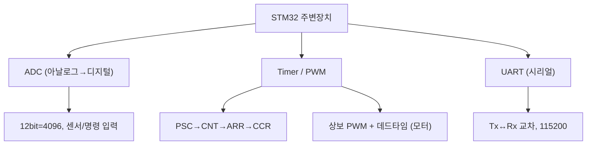

# 10주차 · STM32 주변장치 — ADC·Timer·UART

> **학습목표** — 명령/센서 ADC 입력, 타이머/상보 PWM, UART 시리얼 통신을 구현하고 주기 태스크를 설계한다.

> 💡 **기초 다지기 (쉽게 이해하기)** — **ADC·타이머·UART?** ADC는 센서의 아날로그 전압을 숫자로 바꾸고, 타이머는 정확한 시간·PWM을 만들며, UART는 선 2개로 컴퓨터와 문자를 주고받는다(디버깅·원격 명령). 로봇이 "보고·움직이고·말하는" 3대 기능이다.

## 🗺️ 한눈에 보는 개념도

## 📈 ADC — 샘플링과 양자화

`ADC_out = (2^N−1)·Vin/Vref`. 12bit=4096단계(3.3V/스텝 0.8mV). 오차: 양자화/오프셋/이득. 다채널은 DMA 권장.

## ⏲️ Timer/PWM 로 평균전압

레지스터 `PSC→CNT→ARR(주파수)→CCR(듀티)`. **TIM1/8=상보출력+데드타임(모터용)**. 엔코더 모드로 휠 속도 측정도 가능.

**UART** — Start+Data+Parity+Stop, Tx↔Rx 교차, 115200. printf 리타게팅(`__io_putchar`). 원격 명령·Teleplot에 사용.

## 🧪 실습·과제

- [ ] ADC값 UART 출력, 1초 주기 LED 태스크, 시리얼 모니터 캡처
- [ ] 타이머 PWM으로 모터 듀티 제어, 엔코더 모드로 속도 읽기
- [ ] ADC·Timer·UART 통합 실습 결과 제출

> **🤖 AX 연계** — ADC/UART로 수집한 센서 데이터를 Teleplot·CSV로 데이터셋화하여 ML 학습 파이프라인을 준비한다.
