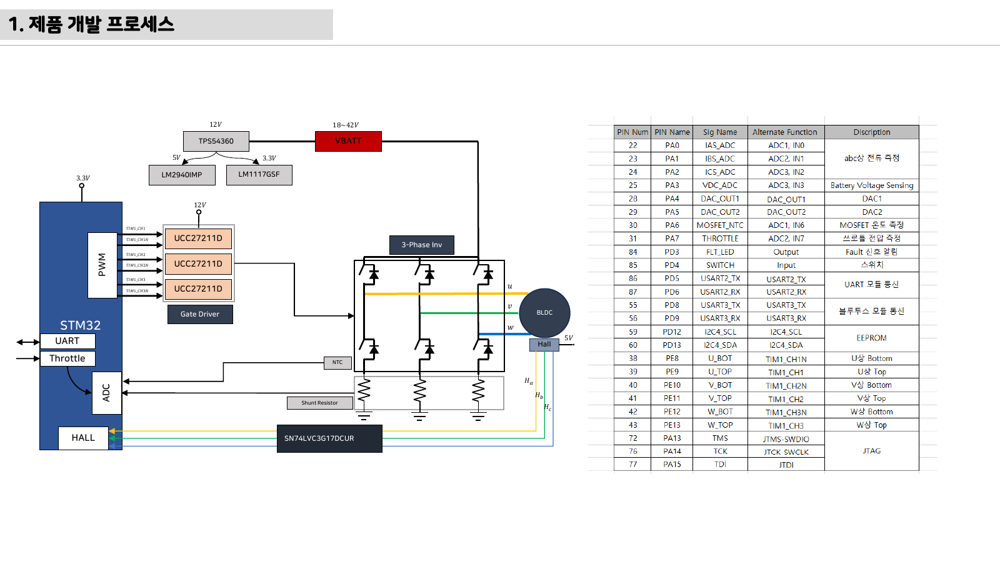

# 11주차 평가·문제팩 · 요구사항·HSI·시스템 블록도

> 이 문제팩은 `요구사항과 HSI` 이해도를 계산, 설명, 진단, 발표 네 관점에서 확인한다.

## 평가 기준 이미지

## 10분 퀴즈

1. 모호한 요구사항 하나를 수치 조건이 있는 문장으로 고치게 한다.
2. HSI에 들어갈 열 이름 다섯 개를 쓰게 한다.
3. 시스템 블록도에서 전원과 정보 흐름을 분리해 설명하게 한다.
4. `요구사항과 HSI`를 SDV 진단 데이터와 연결해 한 문장으로 설명하라.

## 계산·해석 문제

### 문제 1 · 입력 조건 정리
요구사항·HSI·시스템 블록도에서 필요한 입력 조건을 세 개 쓰고, 각 조건의 단위를 붙인다.

### 문제 2 · 결과 예측
막연한 문장 `잘 달린다`를 `1m/s 명령에서 ±10% 속도 유지`로 바꾼다. 이때 학생 답안에는 식, 대입값, 단위, 결론이 들어가야 한다.

### 문제 3 · 실패 원인 분류
요구사항에 전류 제한이 없으면 보호 동작을 성공인지 실패인지 판단할 수 없다. 이 상황을 하드웨어, 펌웨어, 측정 조건으로 나누어 원인을 추정한다.

### 문제 4 · 보호 기능 제안
핀 방향이 문서와 코드에서 다르면 드라이버 enable이 충돌할 수 있다. 이 문제를 줄이기 위한 감지 조건, 안전 상태, 로그 항목을 제안한다.

## 구두 발표 질문

- `요구사항과 HSI`에서 학생이 실제로 측정한 값은 무엇인가?
- 요구사항은 보고서 장식이라는 오해를 최종 검증 체크리스트로 교정한다.
- 블록도에 모든 부품을 넣을수록 좋다는 생각을 계층과 인터페이스 중심으로 바로잡는다.
- HSI가 하드웨어 팀 문서라는 생각을 펌웨어 변수와 예외처리까지 확장한다.

## 채점 루브릭

### 5점
요구사항·HSI·시스템 블록도의 시스템 위치, 수치 근거, 실험 증거, 안전 고려가 모두 명확하다.

### 4점
핵심 원리는 맞고 `요구사항과 HSI` 증거도 있으나 최악 조건 설명이 약하다.

### 3점
동작 결과는 있으나 모호한 요구사항 하나를 수치 조건이 있는 문장으로 고치게 한는 충분히 설명하지 못한다.

### 2점
용어 설명은 있으나 실제 회로, 코드, 로그와 `요구사항과 HSI`를 연결하지 못한다.

### 1점
결과만 제출하고 요구사항·HSI·시스템 블록도 판단 근거가 없다.

## 보충 문제

1. 업데이트 후 Fault 코드 의미가 바뀌면 현장 로그 해석이 불가능해진다.
2. `inverter-hardware-design-v0.1.pdf / electric-scooter-v2-spec-circuit-cost.xlsx`의 대표 이미지에서 추가 측정 포인트 두 곳을 제안하라.
3. 팀 보고서 결론을 `요구사항과 HSI` 중심으로 한 문장 작성하라.
