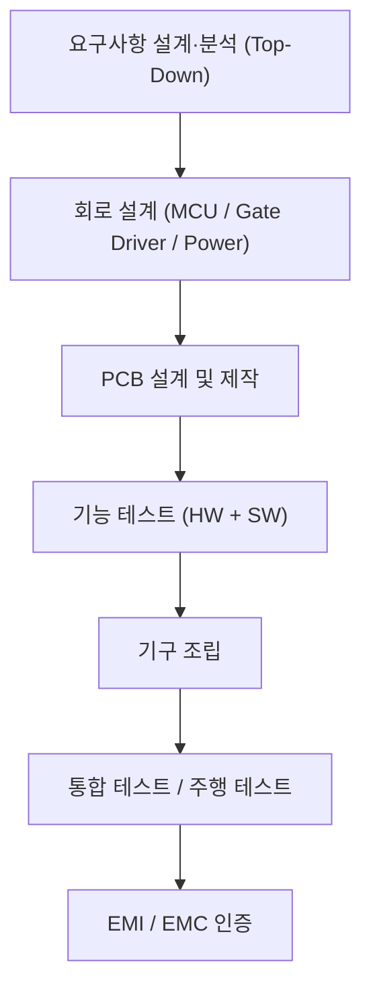
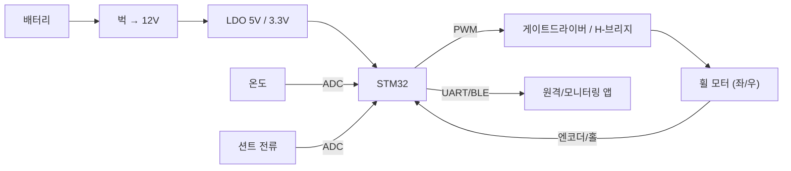

# 11주차 · 제어유닛 요구사항 및 HSI 설계

> **학습목표** — 전자제품 개발 프로세스 전체 흐름을 이해하고, Top-Down 요구사항·AMR 구동보드 사양서·HSI(핀 정의)·시스템 블록도를 직접 작성한다.

> 💡 **기초 다지기 (쉽게 이해하기)** — **요구사항·설계란?** 만들기 전에 "무엇을, 어떤 성능으로" 정하는 단계다. HSI는 MCU 핀마다 역할을 적은 계약서, 블록도는 전체 그림이다. 좋은 제품은 코딩이 아니라 여기서 시작한다.

## 🗺️ 개발 프로세스

## 📋 구동보드 사양서 (예: 3상 인버터 기준)

| 사양 | 값 |
|---|---|
| 입력 DC 전압 범위 | 18~42V (정격 36V) |
| 최대 출력 전력 | 350W |
| Continuous Current | 15A RMS |
| Peak Current | 27A RMS |
| Switching Frequency | 10~20kHz |

> AMR 실물 사양(배터리 전압·모터 정격)에 맞게 조정. 소형 2륜 브러시DC는 더 낮은 전압·전류로 설계.

## 🔌 HSI (Hardware-Software Interface)

**MCU 각 핀의 동작을 정의**한 문서 = 하드웨어와 펌웨어의 계약서.

| 핀 | 기능 | 방향 |
|---|---|---|
| PE8~PE13 | 3상 상보 PWM (`TIM1_CH1~3 / CH1N~3N`) | 출력 |
| PD0/PD1/PD2 | 홀센서 Ha/Hb/Hc (EXTI) | 입력 |
| PA0/PA1/PA2 | 상전류 ias/ibs/ics (ADC) | 입력 |
| PA3 / PA6 / PA7 | Vdc / NTC / 명령 (ADC) | 입력 |
| PC6 | 상태·Fault LED | 출력 |
| USART2 / USART3 / I2C4 | 디버그 / 무선통신 / EEPROM | 양방향 |

## 🗺️ 시스템 블록도

> 💡 **실무 방법론(chcbaram WIZnet 사례)** — 목표 단순화 → 요구사항 정리 → 시스템 블록도 → To-do → **WBS로 일정 관리**. 업체·Tool: JLCPCB + EasyEDA, 회로 3분할(MCU/게이트드라이버/파워), `EMC = EMS + EMI`.

## 🧪 실습·과제

- [ ] AMR 2륜 구동 제어유닛 요구사항 명세서 작성
- [ ] HSI 초안(핀 배정표) + 시스템 블록도 작성
- [ ] 프로젝트 WBS·To-do 리스트 작성

> **🤖 AX 연계** — AI로 요구사항을 분석·정리하고, 디지털 트윈 블록도로 SIL(Software-in-the-Loop) 검증 개념을 도입한다.
