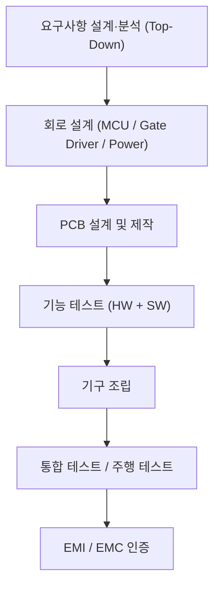
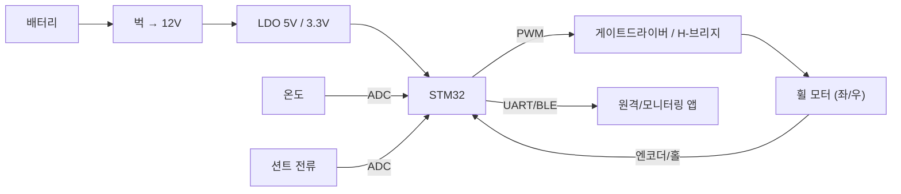

# 11주차 · 제어유닛 요구사항 및 HSI 설계

> 🔗 **강의 흐름** — 펌웨어 기본기(8~10주차)를 익혔으니, 이번 주는 만들기 전 **요구사항·HSI·블록도**. 다음 주 실제 하드웨어 설계로 이어진다.

> **학습목표** — 전자제품 개발 프로세스 전체 흐름을 이해하고, Top-Down 요구사항·AMR 구동보드 사양서·HSI(핀 정의)·시스템 블록도를 직접 작성한다.

> 💡 **기초 다지기 (쉽게 이해하기)** — **요구사항·설계란?** 만들기 전에 "무엇을, 어떤 성능으로" 정하는 단계다. HSI는 MCU 핀마다 역할을 적은 계약서, 블록도는 전체 그림이다. 좋은 제품은 코딩이 아니라 여기서 시작한다.

## 🗺️ 개발 프로세스

## 📋 구동보드 사양서 (예: 3상 인버터 기준)

| 사양 | 값 |
|---|---|
| 입력 DC 전압 범위 | 18~42V (정격 36V) |
| 최대 출력 전력 | 350W |
| Continuous Current | 15A RMS |
| Peak Current | 27A RMS |
| Switching Frequency | 10~20kHz |

> AMR 실물 사양(배터리 전압·모터 정격)에 맞게 조정. 소형 2륜 브러시DC는 더 낮은 전압·전류로 설계.

## 🔌 HSI (Hardware-Software Interface)

**MCU 각 핀의 동작을 정의**한 문서 = 하드웨어와 펌웨어의 계약서.

| 핀 | 기능 | 방향 |
|---|---|---|
| PE8~PE13 | 3상 상보 PWM (`TIM1_CH1~3 / CH1N~3N`) | 출력 |
| PD0/PD1/PD2 | 홀센서 Ha/Hb/Hc (EXTI) | 입력 |
| PA0/PA1/PA2 | 상전류 ias/ibs/ics (ADC) | 입력 |
| PA3 / PA6 / PA7 | Vdc / NTC / 명령 (ADC) | 입력 |
| PC6 | 상태·Fault LED | 출력 |
| USART2 / USART3 / I2C4 | 디버그 / 무선통신 / EEPROM | 양방향 |

## 🗺️ 시스템 블록도

> 💡 **실무 방법론(chcbaram WIZnet 사례)** — 목표 단순화 → 요구사항 정리 → 시스템 블록도 → To-do → **WBS로 일정 관리**. 업체·Tool: JLCPCB + EasyEDA, 회로 3분할(MCU/게이트드라이버/파워), `EMC = EMS + EMI`.

## 🧠 핵심 이론 보강

!!! info "이미지로 설명하기"
    

    

    첫 화면에서는 첨부자료 이미지를 보여 주고, 바로 아래 도해로 원리를 단순화한다. 학생에게 “사진 속 실제 부품/단자”와 “도해 속 기능 블록”을 서로 연결하게 하면 추상 개념이 실습 대상으로 바뀐다.

### 1. 이번 주 이론을 어디에 쓰는가

- 요구사항은 “잘 돈다”가 아니라 전압, 전류, 속도, 보호 시간처럼 검증 가능한 문장이어야 한다.
- HSI는 하드웨어 핀과 소프트웨어 신호명을 연결하는 계약서로, 회로 변경과 코드 변경의 충돌을 줄인다.
- V-model은 요구사항에서 시험까지의 추적을 보여주며, 최종 발표의 검증 근거가 된다.

### 2. 강의 중 반드시 남길 판서

| 판서 항목 | 설명 | 실습 연결 |
|---|---|---|
| 핵심 관계식 | `요구사항 문장 = 조건 + 동작 + 기준값 + 검증방법` | 계산값을 먼저 예측하고 측정값으로 검증한다. |
| 입력 조건 | 전압, 전류, 주파수, RPM, 핀 상태 중 이번 주 주제에 해당하는 값을 정한다. | 조건이 빠지면 결과 비교가 불가능하다는 점을 강조한다. |
| 정상/비정상 판단 | 정상 범위와 즉시 정지해야 할 조건을 분리한다. | 최종 프로젝트의 안전 상태와 로그 항목으로 이어진다. |

### 3. 학생 눈높이 설명 순서

1. **현상 관찰**: 첨부 이미지에서 실제 부품, 커넥터, 파형, 코드 위치를 먼저 찾는다.
2. **모델 단순화**: 핵심 도해와 공식으로 “왜 그런 값이 나오는지”를 설명한다.
3. **설계 판단**: 부품값, 듀티, 샘플링 주기, 보호 기준처럼 학생이 직접 정해야 하는 값을 고른다.
4. **검증 증거**: 사진, 계산표, 오실로스코프 캡처, UART 로그 중 하나 이상으로 결과를 남긴다.

!!! warning "학생들이 자주 헷갈리는 지점"
    이번 주제는 암기보다 조건 확인이 중요하다. 회로·펌웨어·제어 문제는 같은 증상으로 보일 수 있으므로, 전원 조건 → 신호 조건 → 코드 조건 순서로 좁혀 가게 한다.

!!! tip "최신 기술 연결"
    차량 개발은 기능 구현보다 요구사항 추적성, HSI 계약, 안전·보안 요구를 함께 관리하는 프로세스 역량을 요구한다. SDV, Adaptive AUTOSAR, 엣지 AI MCU, 차량 사이버보안, ISO 26262 기능안전은 서로 다른 주제처럼 보이지만 모두 '측정 가능한 요구사항과 검증 가능한 로그'를 요구한다.

### 4. 실습 전환 포인트

팀별 HSI 표에 핀명, 방향, 전압 범위, 정상값, 오류값, 담당자를 넣어 서로 리뷰한다. 이 활동은 확장 강의자료의 심화노트, 실습 코칭노트, 평가팩, 사례노트와 이어지며, 한 주차 안에서 “이론 설명 → 손으로 확인 → 평가 → 현장 사례”가 끊기지 않도록 구성한다.

## 🎞️ 통합 강의 슬라이드
> 통합 근거: PCB·펌웨어 통합 기술노트 11주차 + 인버터 하드웨어 개발 프로세스.

!!! note "슬라이드 1 · 제품은 요구사항에서 시작한다"
    코드나 회로를 그리기 전에 입력전압, 출력전력, 전류, PWM 주파수, 보호조건을 수치로 정한다. 수치 없는 목표는 시험할 수 없다.

!!! note "슬라이드 2 · Top-Down으로 기능을 분해한다"
    주행 기능을 전원, 구동, 센싱, 통신, 보호, 진단으로 나누고 각 블록의 입출력을 정한다. 이 분해가 회로도와 코드 구조가 된다.

!!! note "슬라이드 3 · HSI는 HW-SW 계약서다"
    PE8~PE13 PWM, PD0~2 홀, PA0~2 상전류처럼 핀별 기능과 방향을 합의한다. 핀 충돌은 통합 단계에서 가장 비싼 오류다.

!!! note "슬라이드 4 · 블록도는 리뷰 언어다"
    팀원이 회로를 몰라도 배터리, 전원, MCU, 드라이버, 모터, 센서의 연결을 검토할 수 있어야 한다. 빠진 보호회로도 블록도에서 찾는다.

!!! note "슬라이드 5 · WBS로 남은 주차를 관리한다"
    PCB, 펌웨어, 테스트, 발표 산출물을 작업 단위로 쪼개고 책임자를 정한다. 최종 발표의 증거 자료를 지금부터 쌓는다.

## 📦 용어 박스
!!! abstract "이번 주 꼭 설명할 용어"
    - **요구사항**: 제품이 만족해야 하는 기능, 성능, 환경, 안전 조건.
    - **사양서**: 전압, 전류, 전력, 주파수 같은 설계 기준 수치 문서.
    - **HSI**: 하드웨어 핀과 펌웨어 기능을 연결하는 인터페이스 문서.
    - **블록도**: 시스템 구성요소와 신호/전력 흐름을 추상화한 그림.
    - **WBS**: 작업을 작은 단위로 나누어 일정과 책임을 관리하는 구조.

!!! tip "최신 기술 연결"
    SDV, OTA, 기능안전은 모두 요구사항 추적성에서 시작한다. 작은 AMR 프로젝트에도 같은 문서 습관을 적용한다.

## 📚 확장 강의자료

- [11주차 심화 강의노트](week11-deep-dive.md): 첨부자료 대표 이미지, 판서 흐름, 오개념 교정, 최신 기술 연결을 포함한 이론 확장 자료.
- [11주차 실습 코칭노트](week11-lab-coach.md): 팀 실습 절차, 코칭 질문, 평가 루브릭, 보강 과제를 포함한 수업 운영 자료.
- [11주차 평가·문제팩](week11-assessment-pack.md): 10분 퀴즈, 계산·해석 문제, 구두 발표 질문, 채점 루브릭.
- [11주차 현장 사례노트](week11-case-note.md): 실제 고장 시나리오, 진단 절차, 보고서 연결 문장.

!!! success "메인 자료와 확장 자료를 함께 쓰는 순서"
    1. 메인 페이지의 개념도와 핵심 이론 보강으로 `요구사항과 HSI`의 큰 그림을 설명한다.
    2. 심화 강의노트에서 첨부자료 이미지를 확대해 판서와 계산을 진행한다.
    3. 실습 코칭노트로 팀별 측정·로그·사진 증거를 만들게 한다.
    4. 평가·문제팩과 사례노트로 이해 확인, 고장 진단, 최종 보고서 문장을 연결한다.
## ⏱️ 3시간 수업 운영안

| 시간 | 활동 | 학생 산출물 |
|---|---|---|
| 0:00-0:25 | 1~10주차 기능을 제품 개발 문서로 재정렬 | 기능 목록 |
| 0:25-1:15 | 요구사항, 사양서, HSI, 시스템 블록도 작성법 해설 | 문서 템플릿 초안 |
| 1:25-2:25 | 팀별 AMR 2륜 구동 ECU 요구사항·핀맵 작성 | HSI 표와 블록도 |
| 2:25-3:00 | 설계 리뷰: 누락 센서, 보호 기능, 시험 항목 찾기 | 리뷰 코멘트 |

## 📎 수업자료 활용

| 자료 | 수업 중 쓰는 장면 |
|---|---|
| [inverter-hardware-design-v0.1.pdf](attachments/inverter-hardware-design-v0.1.pdf) | 요구사항에서 인버터 하드웨어로 내려가는 설계 흐름 |
| [electric-scooter-v2-spec-circuit-cost.xlsx](attachments/electric-scooter-v2-spec-circuit-cost.xlsx) | 사양·부품·가격을 요구사항으로 변환하는 연습 |
| figures/diffdrive.svg | AMR 2륜 구동 요구사항 설명 |

## ✅ 이해 확인 질문

1. 요구사항과 구현 방법을 구분해 작성한다.
2. HSI 표가 하드웨어와 펌웨어의 계약서인 이유를 설명한다.
3. 최종 시연을 검증 가능한 시험 항목으로 바꾼다.

## 🧪 실습·과제

- [ ] AMR 2륜 구동 제어유닛 요구사항 명세서 작성
- [ ] HSI 초안(핀 배정표) + 시스템 블록도 작성
- [ ] 프로젝트 WBS·To-do 리스트 작성

> **🤖 AX 연계** — AI로 요구사항을 분석·정리하고, 디지털 트윈 블록도로 SIL(Software-in-the-Loop) 검증 개념을 도입한다.
