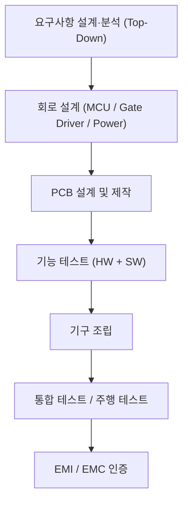
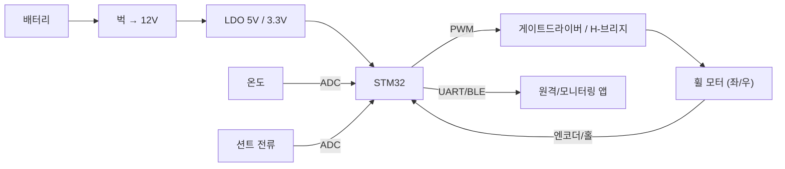
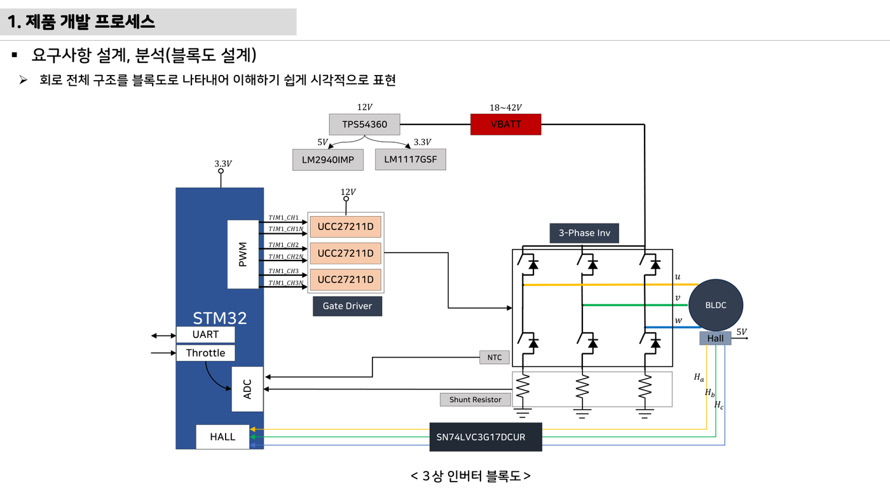
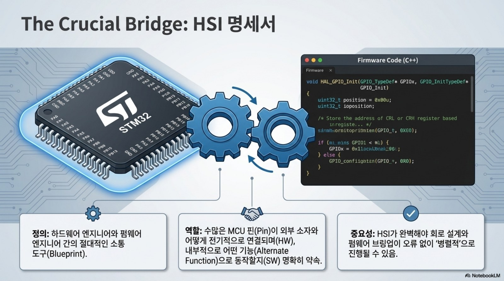
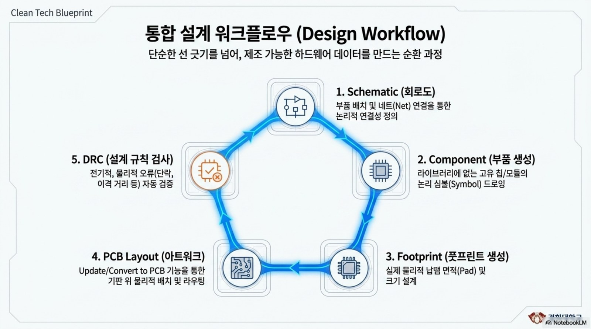

# 11주차 · 제어유닛 요구사항 및 HSI 설계

> 🔗 **강의 흐름** — 펌웨어 기본기(8~10주차)를 익혔으니, 이번 주는 만들기 전 **요구사항·HSI·블록도**. 다음 주 실제 하드웨어 설계로 이어진다.

> **학습목표** — 전자제품 개발 프로세스 전체 흐름을 이해하고, Top-Down 요구사항·로버 구동보드 사양서·HSI(핀 정의)·시스템 블록도를 직접 작성한다.

> 💡 **기초 다지기 (쉽게 이해하기)** — **요구사항·설계란?** 만들기 전에 "무엇을, 어떤 성능으로" 정하는 단계다. HSI는 MCU 핀마다 역할을 적은 계약서, 블록도는 전체 그림이다. 좋은 제품은 코딩이 아니라 여기서 시작한다.

!!! warning "저작권 유의 — 원본 자료 사용 범위 확인"
    이 주차의 **원본 첨부 PDF 링크·슬라이드 미리보기 이미지**(chcbaram 원본 자료)는 수업 활용 범위와 외부 배포 가능 여부를 확인해 사용한다. 공개 배포 전에는 인용 허가, 출처 표기, 자작 대체 자료 여부를 점검한다.


## 🗺️ 개발 프로세스



## 📋 구동보드 사양서 (예: 3상 인버터 기준)

| 사양 | 값 |
|---|---|
| 입력 DC 전압 범위 | 18~42V (정격 36V) |
| 최대 출력 전력 | 350W |
| Continuous Current | 15A RMS |
| Peak Current | 27A RMS |
| Switching Frequency | 10~20kHz |

> 로버 실물 사양(배터리 전압·모터 정격)에 맞게 조정. 소형 2륜 브러시DC는 더 낮은 전압·전류로 설계.

## 🔌 HSI (Hardware-Software Interface)

**MCU 각 핀의 동작을 정의**한 문서 = 하드웨어와 펌웨어의 계약서.

| 핀 | 기능 | 방향 |
|---|---|---|
| PE8~PE13 | 3상 상보 PWM (`TIM1_CH1~3 / CH1N~3N`) | 출력 |
| PD0/PD1/PD2 | 홀센서 Ha/Hb/Hc (EXTI) | 입력 |
| PA0/PA1/PA2 | 상전류 ias/ibs/ics (ADC) | 입력 |
| PA3 / PA6 / PA7 | Vdc / NTC / 명령 (ADC) | 입력 |
| PC6 | 상태·Fault LED | 출력 |
| USART2 / USART3 / I2C4 | 디버그 / 무선통신 / EEPROM | 양방향 |

## 🗺️ 시스템 블록도



> 💡 **실무 방법론(chcbaram WIZnet 사례)** — 목표 단순화 → 요구사항 정리 → 시스템 블록도 → To-do → **WBS로 일정 관리**. 업체·Tool: JLCPCB + EasyEDA, 회로 3분할(MCU/게이트드라이버/파워), `EMC = EMS + EMI`.

!!! note "🔗 여기서부터 확장 자료 — 흐름 이어보기"
    아래는 위 핵심 개념(개념도·공식·그림)을 더 깊이 파는 **심화·실습·평가·사례** 자료다. 처음 보는 학생은 페이지 맨 위 「💡 기초 다지기」로 큰 그림을 먼저 잡고, 심화 → 실습 → 평가 → 사례 순으로 읽으면 이번 주 흐름이 자연스럽게 이어진다.


## 🧠 핵심 이론 보강

!!! info "이미지로 설명하기"
    

    

    첫 화면에서는 첨부자료 이미지를 보여 주고, 바로 아래 도해로 원리를 단순화한다. 학생에게 “사진 속 실제 부품/단자”와 “도해 속 기능 블록”을 서로 연결하게 하면 추상 개념이 실습 대상으로 바뀐다.

### 1. 이번 주 이론을 어디에 쓰는가

- 요구사항은 “잘 돈다”가 아니라 전압, 전류, 속도, 보호 시간처럼 검증 가능한 문장이어야 한다.
- HSI는 하드웨어 핀과 소프트웨어 신호명을 연결하는 계약서로, 회로 변경과 코드 변경의 충돌을 줄인다.
- V-model은 요구사항에서 시험까지의 추적을 보여주며, 최종 발표의 검증 근거가 된다.

### 2. 강의 중 반드시 남길 판서

| 판서 항목 | 설명 | 실습 연결 |
|---|---|---|
| 핵심 관계식 | `요구사항 문장 = 조건 + 동작 + 기준값 + 검증방법` | 계산값을 먼저 예측하고 측정값으로 검증한다. |
| 입력 조건 | 전압, 전류, 주파수, RPM, 핀 상태 중 이번 주 주제에 해당하는 값을 정한다. | 조건이 빠지면 결과 비교가 불가능하다는 점을 강조한다. |
| 정상/비정상 판단 | 정상 범위와 즉시 정지해야 할 조건을 분리한다. | 최종 프로젝트의 안전 상태와 로그 항목으로 이어진다. |

### 3. 학생 눈높이 설명 순서

1. **현상 관찰**: 첨부 이미지에서 실제 부품, 커넥터, 파형, 코드 위치를 먼저 찾는다.
2. **모델 단순화**: 핵심 도해와 공식으로 “왜 그런 값이 나오는지”를 설명한다.
3. **설계 판단**: 부품값, 듀티, 샘플링 주기, 보호 기준처럼 학생이 직접 정해야 하는 값을 고른다.
4. **검증 증거**: 사진, 계산표, 오실로스코프 캡처, UART 로그 중 하나 이상으로 결과를 남긴다.

!!! warning "학생들이 자주 헷갈리는 지점"
    이번 주제는 암기보다 조건 확인이 중요하다. 회로·펌웨어·제어 문제는 같은 증상으로 보일 수 있으므로, 전원 조건 → 신호 조건 → 코드 조건 순서로 좁혀 가게 한다.

!!! tip "최신 기술 연결"
    차량 개발은 기능 구현보다 요구사항 추적성, HSI 계약, 안전·보안 요구를 함께 관리하는 프로세스 역량을 요구한다. SDV, Adaptive AUTOSAR, 엣지 AI MCU, 차량 사이버보안, ISO 26262 기능안전은 서로 다른 주제처럼 보이지만 모두 '측정 가능한 요구사항과 검증 가능한 로그'를 요구한다.

### 4. 실습 전환 포인트

팀별 HSI 표에 핀명, 방향, 전압 범위, 정상값, 오류값, 담당자를 넣어 서로 리뷰한다. 이 활동은 확장 강의자료의 심화노트, 실습 코칭노트, 평가팩, 사례노트와 이어지며, 한 주차 안에서 “이론 설명 → 손으로 확인 → 평가 → 현장 사례”가 끊기지 않도록 구성한다.

## 🖼️ 슬라이드 이미지

!!! quote "슬라이드 이미지 1 · 첨부자료 대표 이미지"
    

    하드웨어 블록도를 요구사항·HSI 관점으로 읽어 PWM, ADC, Hall, UART 신호 방향을 계약처럼 정리한다.

!!! quote "슬라이드 이미지 2 · 핵심 도해"
    

    요구사항, 설계, 구현, 검증이 V-모델에서 서로 대응되는 지점을 기능안전·보안 관점으로 설명한다.

!!! quote "슬라이드 이미지 3 · 실습 보조 도해"
    

    SDV·존 아키텍처 흐름 속에서 소형 ECU 실습이 차량 전장 구조의 축소 모델임을 연결한다.

## 🚀 AX·우주로버 적용 슬라이드

!!! info "NotebookLM 기반 시각자료 활용"
    아래 이미지는 새로 첨부된 우주 로버·AX·Physical AI 자료에서 강의 주제와 직접 연결되는 페이지를 선별한 것이다. 교수자는 기존 개념도 다음에 이 이미지를 보여 주고, 학생에게 실제 로버 ECU에서 같은 개념이 어디에 쓰이는지 말하게 한다.

!!! quote "적용 이미지 1 · HSI 브리지"
    

    HSI 문서가 하드웨어 핀, 펌웨어 코드, 디버깅 관측점을 연결하는 계약서임을 설계 리뷰 관점으로 보여 준다.

    출처: `Space_Rover_ECU_Design_and_Debugging.pdf p.3`

!!! quote "적용 이미지 2 · 설계 워크플로우"
    

    Schematic, footprint, PCB layout, DRC, export가 요구사항에서 제작 파일까지 이어지는 전체 흐름임을 정리한다.

    출처: `Space_Rover_Systems_Blueprint.pdf p.9`

## 🎞️ 통합 강의 슬라이드
> 통합 근거: PCB·펌웨어 통합 기술노트 11주차 + 인버터 하드웨어 개발 프로세스.

!!! note "슬라이드 1 · 제품은 요구사항에서 시작한다"
    코드나 회로를 그리기 전에 입력전압, 출력전력, 전류, PWM 주파수, 보호조건을 수치로 정한다. 수치 없는 목표는 시험할 수 없다.

!!! note "슬라이드 2 · Top-Down으로 기능을 분해한다"
    주행 기능을 전원, 구동, 센싱, 통신, 보호, 진단으로 나누고 각 블록의 입출력을 정한다. 이 분해가 회로도와 코드 구조가 된다.

!!! note "슬라이드 3 · HSI는 HW-SW 계약서다"
    PE8~PE13 PWM, PD0~2 홀, PA0~2 상전류처럼 핀별 기능과 방향을 합의한다. 핀 충돌은 통합 단계에서 가장 비싼 오류다.

!!! note "슬라이드 4 · 블록도는 리뷰 언어다"
    팀원이 회로를 몰라도 배터리, 전원, MCU, 드라이버, 모터, 센서의 연결을 검토할 수 있어야 한다. 빠진 보호회로도 블록도에서 찾는다.

!!! note "슬라이드 5 · WBS로 남은 주차를 관리한다"
    PCB, 펌웨어, 테스트, 발표 산출물을 작업 단위로 쪼개고 책임자를 정한다. 최종 발표의 증거 자료를 지금부터 쌓는다.

## 📦 용어 박스
!!! abstract "이번 주 꼭 설명할 용어"
    - **요구사항**: 제품이 만족해야 하는 기능, 성능, 환경, 안전 조건.
    - **사양서**: 전압, 전류, 전력, 주파수 같은 설계 기준 수치 문서.
    - **HSI**: 하드웨어 핀과 펌웨어 기능을 연결하는 인터페이스 문서.
    - **블록도**: 시스템 구성요소와 신호/전력 흐름을 추상화한 그림.
    - **WBS**: 작업을 작은 단위로 나누어 일정과 책임을 관리하는 구조.

!!! tip "최신 기술 연결"
    SDV, OTA, 기능안전은 모두 요구사항 추적성에서 시작한다. 작은 로버 프로젝트에도 같은 문서 습관을 적용한다.

## 📚 통합 확장 강의자료

!!! info "확장 자료 통합 안내"
    기존의 11주차 심화·실습·평가·사례 확장 페이지를 이 주차 메인 자료 안으로 합쳤다. 교수자는 이 섹션을 필요한 만큼 접어 읽히거나, 수업 후 과제·보충자료로 배정하면 된다.

### 심화 강의노트

> 11주차 심화노트는 `요구사항과 HSI`를 3시간 강의에서 설명하기 위한 교수자용 자료다.

###### 수업에서 바로 보여줄 이미지


###### 강의 핵심 초점

- 요구사항·HSI·시스템 블록도의 중심 질문은 "요구사항과 HSI가 최종 로버 ECU에서 어떤 문제를 해결하는가"이다.
- 연결할 첨부자료는 `inverter-hardware-design-v0.1.pdf / electric-scooter-v2-spec-circuit-cost.xlsx`이며, 학생은 그림 위에 입력·처리·출력·위험요소를 직접 표시한다.
- 이번 주 설명은 이전 주 산출물과 다음 주 실습으로 이어지는 설계 판단을 남기는 데 초점을 둔다.

###### 교수자 설명 스크립트

1. 요구사항은 하고 싶은 기능을 검증 가능한 문장으로 바꾸는 작업이다.
2. HSI는 하드웨어와 소프트웨어가 주고받는 핀, 전압, 주기, Fault 조건의 계약서다.
3. 작은 로버 ECU도 SDV 관점에서는 데이터와 진단 인터페이스를 가진 노드로 볼 수 있다.

###### 판서 흐름

##### 도입 판서
막연한 문장 `잘 달린다`를 `1m/s 명령에서 ±10% 속도 유지`로 바꾼다.

##### 원리 판서
HSI 표에 PWM, ADC, UART, Fault 핀을 넣고 방향과 전압범위를 적는다.

##### 검증 판서
시스템 블록도에서 전원선과 신호선을 서로 다른 선 스타일로 구분한다.

###### 이론 보강 슬라이드 세트

!!! note "슬라이드 A · 실제 자료에서 출발"
    `inverter-hardware-design-v0.1.pdf / electric-scooter-v2-spec-circuit-cost.xlsx`의 대표 이미지를 먼저 띄우고, 학생이 부품명보다 기능을 말하게 한다. “이 부분은 입력인가, 처리인가, 출력인가, 보호인가”를 묻는다.

!!! note "슬라이드 B · 핵심 원리 압축"
    - 요구사항은 “잘 돈다”가 아니라 전압, 전류, 속도, 보호 시간처럼 검증 가능한 문장이어야 한다.
    - HSI는 하드웨어 핀과 소프트웨어 신호명을 연결하는 계약서로, 회로 변경과 코드 변경의 충돌을 줄인다.
    - V-model은 요구사항에서 시험까지의 추적을 보여주며, 최종 발표의 검증 근거가 된다.

!!! note "슬라이드 C · 공식은 조건과 함께"
    `요구사항 문장 = 조건 + 동작 + 기준값 + 검증방법`를 판서하되, 공식 자체보다 어떤 조건에서 쓸 수 있는지 먼저 확인한다. 조건을 빼고 숫자만 넣는 풀이를 피하게 한다.

!!! note "슬라이드 D · 최종 프로젝트 연결"
    이번 주 산출물은 최종 로버 ECU의 요구사항, HSI, 회로도, 펌웨어 로그 중 하나로 반드시 재사용된다. 학생에게 “15주차 발표에서 이 결과가 어디에 들어가는가”를 한 줄로 쓰게 한다.

##### 교수자 보충 설명

- 3학년 수준에서는 수식을 과도하게 깊게 밀기보다, 수식의 입력값을 실제 회로·코드·로그에서 찾는 능력을 우선한다.
- 설명은 `현상 → 모델 → 설계값 → 검증` 순서로 반복한다. 이 순서를 고정하면 모터, 전원, 펌웨어, PCB 주제가 서로 다른 과목처럼 흩어지지 않는다.
- 오류가 나면 정답을 바로 주기보다 전원, 기준전위, 신호 방향, 시간 기준, 보호 조건 중 어느 축의 문제인지 분류하게 한다.

###### 3시간 수업 확장안

##### 0:00-0:20 · 이전 산출물 연결
요구사항·HSI·시스템 블록도 수업은 지난 주 결과 중 오늘의 `요구사항과 HSI`와 직접 연결되는 오류 하나를 골라 시작한다.

##### 0:20-0:55 · 첨부자료 해설
`inverter-hardware-design-v0.1.pdf / electric-scooter-v2-spec-circuit-cost.xlsx`의 대표 이미지를 띄우고, 학생에게 어느 선이 전원·센서·제어·진단 신호인지 표시하게 한다.

##### 1:05-1:40 · 핵심 계산과 판단
모호한 요구사항 하나를 수치 조건이 있는 문장으로 고치게 한다.

##### 1:40-2:25 · 팀별 적용
팀 프로젝트 요구사항을 주행, 보호, 통신, 진단으로 분류한다. 이어서 요구사항마다 검증 방법을 로그, 측정, 시연, 리뷰 중 하나로 지정한다.

##### 2:25-3:00 · 결과 공유
시스템 블록도에서 전원과 정보 흐름을 분리해 설명하게 한다.

###### 오개념 교정

##### 첫 번째 오개념
요구사항은 보고서 장식이라는 오해를 최종 검증 체크리스트로 교정한다.

##### 두 번째 오개념
블록도에 모든 부품을 넣을수록 좋다는 생각을 계층과 인터페이스 중심으로 바로잡는다.

##### 세 번째 오개념
HSI가 하드웨어 팀 문서라는 생각을 펌웨어 변수와 예외처리까지 확장한다.

###### 최신 기술 연결

- 요구사항·HSI·시스템 블록도에서 남긴 로그와 계산값은 SDV 관점에서 ECU 진단 데이터의 출발점이 된다.
- `요구사항과 HSI`를 안전 요구사항으로 바꾸면 정상 동작뿐 아니라 고장 시 안전 상태도 함께 정의해야 한다.
- AI 도구는 설명과 가설 생성을 돕지만, 최종 판단은 학생이 만든 측정값과 회로 근거로 검증한다.

###### 마무리 질문

1. 요구사항과 HSI를 설명할 때 가장 먼저 확인할 입력 조건은 무엇인가?
2. 요구사항·HSI·시스템 블록도 실습 결과를 어떤 로그나 측정값으로 증명할 수 있는가?
3. 실제 차량 ECU에 적용한다면 어떤 진단 코드나 보호 동작을 추가해야 하는가?

### 실습 코칭노트

!!! tip "📌 실전 팁·주의점 (현장에서 자주 하는 실수)"
    요구사항은 **측정 가능한 숫자**로 쓴다. HSI 핀 충돌은 CubeMX로 미리 점검한다.


> 11주차 실습은 `요구사항과 HSI`를 학생 손으로 확인하게 만드는 운영 자료다.

###### 실습에서 바로 띄울 이미지


###### 오늘의 실습 미션

- 미션 1: 팀 프로젝트 요구사항을 주행, 보호, 통신, 진단으로 분류한다.
- 미션 2: 요구사항마다 검증 방법을 로그, 측정, 시연, 리뷰 중 하나로 지정한다.
- 미션 3: HSI의 핀명과 펌웨어 변수명을 서로 대응시킨다.
- 사용할 자료: `inverter-hardware-design-v0.1.pdf / electric-scooter-v2-spec-circuit-cost.xlsx`
- 제출 증거: 계산식, 캡처, 사진, 로그 중 `요구사항과 HSI`를 입증하는 자료 하나 이상.

###### 실습 전 확인

##### 장비와 배선
요구사항·HSI·시스템 블록도 실습 전에는 전원, 커넥터 방향, 공통 그라운드, 시리얼 포트를 오늘 주제에 맞춰 확인한다.

##### 예측값 작성
보드에 손대기 전에 `요구사항과 HSI`와 관련된 예상 전압, 전류, 주파수, RPM, 또는 로그 형식을 먼저 쓴다.

##### 안전 조건
실패했을 때 어떤 출력을 즉시 끄고 어떤 로그를 남길지 팀별로 한 줄씩 합의한다.

###### 코칭 질문

1. 요구사항과 HSI에서 지금 조작하는 값은 입력인가, 처리 결과인가, 보호 조건인가?
2. 팀 프로젝트 요구사항을 주행, 보호, 통신, 진단으로 분류한다. 결과가 예상과 다르면 어떤 측정점부터 확인할 것인가?
3. 요구사항마다 검증 방법을 로그, 측정, 시연, 리뷰 중 하나로 지정한다. 과정에서 하드웨어 원인과 펌웨어 원인을 어떻게 분리할 것인가?
4. HSI의 핀명과 펌웨어 변수명을 서로 대응시킨다. 결과를 다음 주차 산출물에 어떻게 반영할 것인가?

###### 강의자료-실습 통합 절차

##### 수업 전 5분 준비

- 메인 페이지의 핵심 도해와 `figures/attachment-previews/inverter-hardware-system-block-p05.png` 이미지를 같은 화면에 열어 둔다.
- 팀별로 오늘 확인할 입력 조건, 예상값, 위험 조건을 한 줄씩 적게 한다.
- 측정 장비가 없거나 시간이 부족한 팀은 첨부자료 이미지 위에 신호 흐름을 표시하는 대체 활동을 수행한다.

##### 실습 중 코칭 기준

| 관찰 상황 | 교수자 질문 | 기대되는 학생 반응 |
|---|---|---|
| 값은 나왔지만 근거가 없음 | 어떤 조건에서 측정했는가? | 전압, 주파수, 부하, 코드 버전을 함께 기록한다. |
| 회로 문제와 코드 문제가 섞임 | 하드웨어만 바꿔도 증상이 남는가? | 전원·배선·공통 GND를 먼저 분리한다. |
| 결과가 예상과 다름 | 예상식과 실제 로그 중 어느 쪽을 먼저 의심할까? | 단위, 기준값, 측정 위치를 재확인한다. |

##### 실습 후 정리

팀별 HSI 표에 핀명, 방향, 전압 범위, 정상값, 오류값, 담당자를 넣어 서로 리뷰한다. 제출물에는 원본 사진이나 로그뿐 아니라, 왜 그 증거가 `요구사항과 HSI`를 설명하는지 한 문장 해석을 붙인다.

###### 팀 활동 절차

1. 첨부자료 이미지에 `요구사항과 HSI` 위치를 표시한다.
2. 예측값을 적고 교수자에게 단위와 기준값을 확인받는다.
3. 실습을 수행하되 위험한 전원 조건이나 무부하 고속 회전을 피한다.
4. 결과 파일명을 `week11_team_result` 형식으로 저장한다.
5. 실패 원인을 하드웨어, 펌웨어, 측정 조건 중 하나로 먼저 분류한다.

###### 평가 루브릭

##### A 수준
모호한 요구사항 하나를 수치 조건이 있는 문장으로 고치게 한다. 또한 실험 증거와 `요구사항과 HSI`의 시스템 위치를 함께 설명한다.

##### B 수준
HSI에 들어갈 열 이름 다섯 개를 쓰게 한다. 다만 최악 조건이나 안전 여유 설명이 일부 부족하다.

##### C 수준
시스템 블록도에서 전원과 정보 흐름을 분리해 설명하게 한다. 하지만 재현 절차나 측정 조건이 빠져 있다.

##### D 수준
요구사항·HSI·시스템 블록도의 실행 여부만 적고 수치, 그림, 로그 증거가 없다.

###### 보강 과제

- 요구사항에 전류 제한이 없으면 보호 동작을 성공인지 실패인지 판단할 수 없다.
- 핀 방향이 문서와 코드에서 다르면 드라이버 enable이 충돌할 수 있다.
- 업데이트 후 Fault 코드 의미가 바뀌면 현장 로그 해석이 불가능해진다.
- AI 도구를 사용했다면 질문, 답변 요약, 사람이 검증한 항목을 함께 제출한다.

### 평가·문제팩

> 이 문제팩은 `요구사항과 HSI` 이해도를 계산, 설명, 진단, 발표 네 관점에서 확인한다.

###### 평가 기준 이미지


###### 10분 퀴즈

1. 모호한 요구사항 하나를 수치 조건이 있는 문장으로 고치게 한다.
2. HSI에 들어갈 열 이름 다섯 개를 쓰게 한다.
3. 시스템 블록도에서 전원과 정보 흐름을 분리해 설명하게 한다.
4. `요구사항과 HSI`를 SDV 진단 데이터와 연결해 한 문장으로 설명하라.

###### 계산·해석 문제

##### 문제 1 · 입력 조건 정리
요구사항·HSI·시스템 블록도에서 필요한 입력 조건을 세 개 쓰고, 각 조건의 단위를 붙인다.

##### 문제 2 · 결과 예측
막연한 문장 `잘 달린다`를 `1m/s 명령에서 ±10% 속도 유지`로 바꾼다. 이때 학생 답안에는 식, 대입값, 단위, 결론이 들어가야 한다.

##### 문제 3 · 실패 원인 분류
요구사항에 전류 제한이 없으면 보호 동작을 성공인지 실패인지 판단할 수 없다. 이 상황을 하드웨어, 펌웨어, 측정 조건으로 나누어 원인을 추정한다.

##### 문제 4 · 보호 기능 제안
핀 방향이 문서와 코드에서 다르면 드라이버 enable이 충돌할 수 있다. 이 문제를 줄이기 위한 감지 조건, 안전 상태, 로그 항목을 제안한다.

###### 구두 발표 질문

- `요구사항과 HSI`에서 학생이 실제로 측정한 값은 무엇인가?
- 요구사항은 보고서 장식이라는 오해를 최종 검증 체크리스트로 교정한다.
- 블록도에 모든 부품을 넣을수록 좋다는 생각을 계층과 인터페이스 중심으로 바로잡는다.
- HSI가 하드웨어 팀 문서라는 생각을 펌웨어 변수와 예외처리까지 확장한다.

###### 채점 루브릭

##### 5점
요구사항·HSI·시스템 블록도의 시스템 위치, 수치 근거, 실험 증거, 안전 고려가 모두 명확하다.

##### 4점
핵심 원리는 맞고 `요구사항과 HSI` 증거도 있으나 최악 조건 설명이 약하다.

##### 3점
동작 결과는 있으나 모호한 요구사항 하나를 수치 조건이 있는 문장으로 고치게 한는 충분히 설명하지 못한다.

##### 2점
용어 설명은 있으나 실제 회로, 코드, 로그와 `요구사항과 HSI`를 연결하지 못한다.

##### 1점
결과만 제출하고 요구사항·HSI·시스템 블록도 판단 근거가 없다.

###### 슬라이드 기반 평가 문항 설계

##### 즉답형 확인

1. `요구사항과 HSI`를 설명할 때 가장 먼저 확인해야 할 입력 조건을 하나 쓰시오.
2. `요구사항 문장 = 조건 + 동작 + 기준값 + 검증방법`에서 학생이 직접 측정하거나 정해야 하는 값을 표시하시오.
3. 첨부자료 이미지에서 이번 주 주제와 연결되는 실제 부품, 단자, 파형, 코드 위치 중 하나를 지목하시오.

##### 서술형 확인

- 정상 동작과 비정상 동작을 구분하는 기준값을 정하고, 그 기준값을 어떻게 검증할지 쓰게 한다.
- 계산 결과와 측정 결과가 다를 때 가능한 원인을 하드웨어, 펌웨어, 측정 조건으로 나누어 설명하게 한다.

##### 발표 평가 포인트

- 발표자는 그림을 읽는 수준에서 멈추지 않고, 그림 속 요소가 최종 로버 ECU의 어떤 요구사항을 만족시키는지 말해야 한다.
- AI 도구를 사용한 경우, AI가 제안한 내용과 학생이 실제 자료로 검증한 내용을 분리해 적게 한다.

###### 보충 문제

1. 업데이트 후 Fault 코드 의미가 바뀌면 현장 로그 해석이 불가능해진다.
2. `inverter-hardware-design-v0.1.pdf / electric-scooter-v2-spec-circuit-cost.xlsx`의 대표 이미지에서 추가 측정 포인트 두 곳을 제안하라.
3. 팀 보고서 결론을 `요구사항과 HSI` 중심으로 한 문장 작성하라.

### 현장 사례노트

> 이 사례노트는 `요구사항과 HSI`를 실제 로버, 전동킥보드, 로버, 차량 ECU 문제로 연결한다.

###### 사례 연결 이미지


###### 현장 맥락

- 사례 주제: 요구사항과 HSI
- 학생 실습은 작은 보드에서 진행하지만, 판단 구조는 실제 모빌리티 ECU의 고장 분석과 같다.
- 현장에서는 정상 동작보다 고장 재현, 로그 확보, 안전 정지가 더 중요하다.

###### 사례 시나리오

##### 사례 1 · 초기 증상
요구사항에 전류 제한이 없으면 보호 동작을 성공인지 실패인지 판단할 수 없다.

##### 사례 2 · 반복 증상
핀 방향이 문서와 코드에서 다르면 드라이버 enable이 충돌할 수 있다.

##### 사례 3 · 현장 진단
업데이트 후 Fault 코드 의미가 바뀌면 현장 로그 해석이 불가능해진다.

##### 사례 4 · 팀 프로젝트 연결
HSI의 핀명과 펌웨어 변수명을 서로 대응시킨다. 이 결과를 팀 보고서의 개선 항목으로 남긴다.

###### 교수자 설명 포인트

1. 요구사항은 하고 싶은 기능을 검증 가능한 문장으로 바꾸는 작업이다.
2. HSI는 하드웨어와 소프트웨어가 주고받는 핀, 전압, 주기, Fault 조건의 계약서다.
3. 작은 로버 ECU도 SDV 관점에서는 데이터와 진단 인터페이스를 가진 노드로 볼 수 있다.
4. `요구사항과 HSI` 사례를 안전, 진단, 업데이트 관점 중 하나로 반드시 확장한다.

###### 토론 질문

- 요구사항·HSI·시스템 블록도 문제가 주행 중 발생하면 즉시 정지해야 하는가, 제한 동작이 가능한가?
- 사용자가 볼 수 있는 오류 메시지는 `요구사항과 HSI`를 어떻게 표현해야 하는가?
- OTA로 고칠 수 있는 문제와 하드웨어 수정이 필요한 문제를 어떻게 구분할 것인가?
- 다음 설계에서는 어떤 센서, 보호회로, 로그 항목을 추가할 것인가?

###### 보고서 연결 문장

- "본 실험은 요구사항과 HSI를 로버 ECU 관점에서 검증하기 위해 수행하였다."
- "측정 결과는 요구사항·HSI·시스템 블록도 설계값과 비교해 하드웨어, 펌웨어, 제어 파라미터 원인으로 나누었다."
- "최종 시스템에서는 요구사항과 HSI 관련 고장 감지 후 안전 상태로 전이하고 로그를 남겨야 한다."

###### 사례 분석 보강

##### 현장 진단 프레임

1. **증상 정의**: 움직이지 않음, 과열, 노이즈, 통신 실패, 속도 불안정처럼 관찰 가능한 말로 시작한다.
2. **경로 분리**: 전력 경로, 신호 경로, 소프트웨어 경로 중 어느 쪽에서 증상이 시작되는지 구분한다.
3. **측정 우선순위**: 가장 위험한 전원 조건을 먼저 배제하고, 그 다음 신호와 코드 로그를 본다.
4. **재발 방지**: 부품값, 배선, 펌웨어 보호, 시험 절차 중 무엇을 바꿀지 정한다.

##### 이번 주 사례 연결

`요구사항과 HSI` 문제는 작은 실습 오류처럼 보이지만 실제 모빌리티 ECU에서는 안전 정지, 진단 코드, 정비 절차로 이어진다. 사례 토론에서는 “원인 하나 찾기”보다 “다시 발생하지 않게 만드는 설계 변경”을 답으로 요구한다.

##### 최신 기술 관점 질문

- SDV/존 아키텍처 차량이라면 이 증상을 어느 ECU 로그에서 먼저 찾을까?
- 기능안전 관점에서 즉시 안전 상태로 전환해야 하는 조건은 무엇인가?
- 사이버보안 관점에서 외부 통신이나 업데이트가 이 고장 진단에 어떤 위험을 추가할 수 있는가?

###### 다음 단계

- 모호한 요구사항 하나를 수치 조건이 있는 문장으로 고치게 한다.
- HSI에 들어갈 열 이름 다섯 개를 쓰게 한다.
- 시스템 블록도에서 전원과 정보 흐름을 분리해 설명하게 한다.

## 설계·검증 심화

### 요구사항 계층과 양방향 추적

```text
MIS-001 경사 15° 주행
 ├─ SYS-DRV-001 바퀴 토크 6N·m 이상
 ├─ HW-PWR-003 상전류 30A peak 허용
 └─ SW-SAFE-004 과전류 감지 후 PWM 차단
```

각 하위 요구사항에는 부모 ID, 설계 요소, 시험 ID를 연결한다. 정방향으로 요구사항에서 회로·코드·시험까지 내려간다. 역방향 추적도 가능해야 한다. 임의의 pin·function·test에서 관련 요구사항으로 올라간다.

### HSI는 interface contract다

pin 번호뿐 아니라 다음을 기록한다.

- 정상·고장 voltage range와 logic polarity
- pull-up/down, source impedance, input filter
- reset 중·초기화 전·정상 운전 상태
- sample period 또는 최대 허용 latency
- open/short 탐지와 safe state
- schematic net, firmware symbol, test point

스로틀이 0~3.3V 입력이라는 설명만으로는 부족하다. 정상범위가 0.8~2.8V라면 밖의 값은 단선·단락 fault로 정의하고 PWM을 금지한다.

### 상태와 fault 복구

```text
POWER_OFF → INIT → READY → RUN
               └→ FAULT ←─┘
FAULT → 원인 제거 + 명시적 재시작 → READY
```

각 상태의 PWM, LED, UART, sensor validity, fault latch 값을 표로 정한다. MCU reset 중에도 gate driver가 켜지지 않도록 hardware default state를 함께 확인한다.

### 리뷰 결함 관리

- **Critical**: 장비·인명 손상 가능 또는 차단 경로 없음
- **Major**: 요구사항 미충족·interface 충돌
- **Minor**: 문서 불일치·근거·시험조건 부족

각 결함은 담당자, 기한, 수정 증거, 재검토 결과와 함께 관리한다.

## ⏱️ 3시간 수업 운영안

| 시간 | 활동 | 학생 산출물 |
|---|---|---|
| 0:00-0:25 | 1~10주차 기능을 제품 개발 문서로 재정렬 | 기능 목록 |
| 0:25-1:15 | 요구사항, 사양서, HSI, 시스템 블록도 작성법 해설 | 문서 템플릿 초안 |
| 1:25-2:25 | 팀별 로버 구동 ECU 요구사항·핀맵 작성 | HSI 표와 블록도 |
| 2:25-3:00 | 설계 리뷰: 누락 센서, 보호 기능, 시험 항목 찾기 | 리뷰 코멘트 |

## 📎 수업자료 활용

| 자료 | 수업 중 쓰는 장면 |
|---|---|
| [inverter-hardware-design-v0.1.pdf](attachments/inverter-hardware-design-v0.1.pdf) **(원본 자료)** | 요구사항에서 인버터 하드웨어로 내려가는 설계 흐름 |
| [electric-scooter-v2-spec-circuit-cost.xlsx](attachments/electric-scooter-v2-spec-circuit-cost.xlsx) | 사양·부품·가격을 요구사항으로 변환하는 연습 |
| figures/diffdrive.svg | 로버 구동 요구사항 설명 |

## ✅ 이해 확인 질문

1. 요구사항과 구현 방법을 구분해 작성한다.
2. HSI 표가 하드웨어와 펌웨어의 계약서인 이유를 설명한다.
3. 최종 시연을 검증 가능한 시험 항목으로 바꾼다.

!!! tip "📌 보충 설명 — 실전 팁·주의점"
    요구사항은 **측정 가능한 숫자**로 쓴다. HSI 핀 충돌은 CubeMX로 미리 점검한다.

## 🧪 실습·과제

- [ ] 로버 구동 제어유닛 요구사항 명세서 작성
- [ ] HSI 초안(핀 배정표) + 시스템 블록도 작성
- [ ] 프로젝트 WBS·To-do 리스트 작성

> **🤖 AX 연계** — AI로 요구사항을 분석·정리하고, 디지털 트윈 블록도로 SIL(Software-in-the-Loop) 검증 개념을 도입한다.
