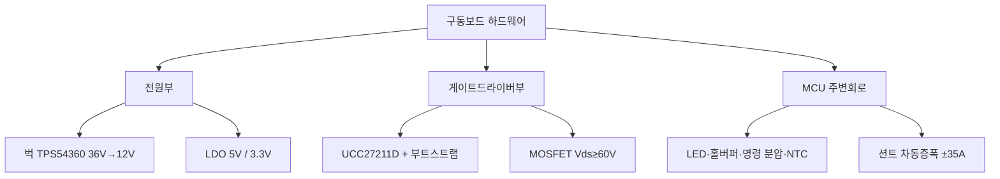

# 12주차 · 인버터 하드웨어 설계 — MCU 주변회로와 게이트드라이버

> 🔗 **강의 흐름** — 지난주 요구사항·블록도를 이번 주 **실제 부품값(하드웨어 설계)**으로 확정한다. 다음 주엔 이 회로를 PCB로.

> **학습목표** — MCU 주변회로와 벅컨버터·게이트드라이버 설계를 부품값 수준으로 이해한다. 6·7주차 이론을 하드웨어로 통합하는 주차.

> 💡 **기초 다지기 (쉽게 이해하기)** — **하드웨어 설계란?** 이론(PWM·전원)을 실제 부품값(저항·인덕터·IC)으로 확정하는 단계다. 게이트드라이버는 MCU의 약한 3.3V 신호를 MOSFET을 확실히 켤 만큼(12~15V) 증폭해 주는 부품이다.

## 🗺️ 한눈에 보는 개념도

## 🔧 MCU 주변회로 요약

| 회로 | 핵심 값 |
|---|---|
| LED | `Vf 2.85V`, 5mA 이하 |
| 명령(쓰로틀) | 5V → 분압 `≈ 3.20V` |
| NTC | `MOSFET_NTC = NTC/(R13+NTC)·3.3V` |
| 홀센서 | 풀업+바이패스+슈미트버퍼(SN74LVC3G17) |

### 벅컨버터·게이트드라이버 설계값

- **벅 (TPS54360, 36V→12V)**: `fsw≈544kHz`, `L=33µH`, `Iripple≈0.58A`, `FB≈0.8V`, 보상 위상여유 `≈30°`
- **게이트드라이버/MOSFET**: `Vds≥60V`, 정션온도 `T=Ta+ID²·Ron·RthJA`, 부트스트랩 11.3V, 게이트저항 On 10Ω/Off 5Ω, Self turn-on 방지 G-S 1nF, 션트 ±35A 차동증폭 22배

> ⚠️ 게이트드라이버 부품 표기 불일치 — 슬라이드 UCC27211D vs 실물 회로도 IR2101. 실물 기준으로 통일.

## 용어·도해·트렌드 연결

| 항목 | 수업 중 연결 |
|---|---|
| 먼저 볼 용어 | [Dead Time](glossary.md#deadtime), [FOC](glossary.md#foc), [Functional Safety](glossary.md#functional-safety) |
| 도해 |  |
| 최신 기술 연결 | 게이트드라이버·전류센싱 설계는 6-step 이후 FOC/고효율 구동으로 넘어가는 하드웨어 기반이다. |

## 📚 확장 강의자료

- [12주차 심화 강의노트](week12-deep-dive.md): 첨부자료 대표 이미지, 판서 흐름, 오개념 교정, 최신 기술 연결을 포함한 이론 확장 자료.
- [12주차 실습 코칭노트](week12-lab-coach.md): 팀 실습 절차, 코칭 질문, 평가 루브릭, 보강 과제를 포함한 수업 운영 자료.
- [12주차 평가·문제팩](week12-assessment-pack.md): 10분 퀴즈, 계산·해석 문제, 구두 발표 질문, 채점 루브릭.
- [12주차 현장 사례노트](week12-case-note.md): 실제 고장 시나리오, 진단 절차, 보고서 연결 문장.

## ⏱️ 3시간 수업 운영안

| 시간 | 활동 | 학생 산출물 |
|---|---|---|
| 0:00-0:20 | 요구사항 사양이 실제 부품값으로 내려가는 흐름 복습 | 부품 선정 기준표 |
| 0:20-1:15 | MCU 주변회로, 벅, 게이트드라이버, 션트 증폭 회로 해설 | 회로 블록별 체크리스트 |
| 1:25-2:25 | MOSFET 열, 벅 인덕터, 분압/NTC 계산 실습 | 설계 계산서 |
| 2:25-3:00 | 인버터 보드 회로 리뷰와 위험요소 표시 | 리뷰 보드마크업 |

## 📎 수업자료 활용

| 자료 | 수업 중 쓰는 장면 |
|---|---|
| [inverter-hardware-design-v0.1.pdf](attachments/inverter-hardware-design-v0.1.pdf) | 인버터 하드웨어 설계의 주교재 |
| [motor-control-inverter-theory.pdf](attachments/motor-control-inverter-theory.pdf) | 6~7주차 이론을 회로 설계로 연결 |
| figures/inverter3ph.svg | 게이트드라이버와 MOSFET 배치 설명 |

## ✅ 이해 확인 질문

1. MCU 3.3V PWM이 직접 MOSFET을 구동하기 어려운 이유를 말한다.
2. 부트스트랩 회로가 하이사이드 구동에 필요한 이유를 설명한다.
3. 션트 증폭 회로의 입력 범위와 ADC 범위를 함께 확인한다.

## 🧪 실습·과제

- [ ] 사양서 → 부품 선정(MOSFET Vds, 인덕터 L, Cout) 계산 재현
- [ ] LED/명령 분압 저항 설계, MOSFET 정션온도 계산
- [ ] MCU 주변회로·게이트드라이버 회로 리뷰 자료 제출

> **🤖 AX 연계** — AI 기반으로 부품 선정·설계를 검토하고, 열·손실을 예측해 설계 리스크를 사전 진단한다.
