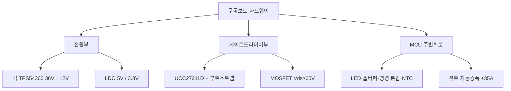
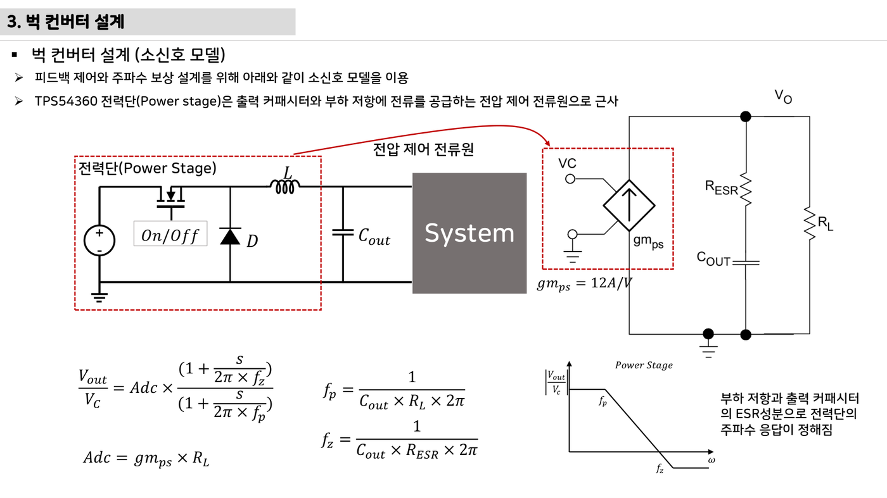
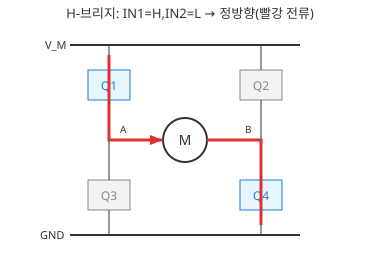

# 12주차 · 인버터 하드웨어 설계 — MCU 주변회로와 게이트드라이버

> 🔗 **강의 흐름** — 지난주 요구사항·블록도를 이번 주 **실제 부품값(하드웨어 설계)**으로 확정한다. 다음 주엔 이 회로를 PCB로.

> **학습목표** — MCU 주변회로와 벅컨버터·게이트드라이버 설계를 부품값 수준으로 이해한다. 6·7주차 이론을 하드웨어로 통합하는 주차.

> 💡 **기초 다지기 (쉽게 이해하기)** — **하드웨어 설계란?** 이론(PWM·전원)을 실제 부품값(저항·인덕터·IC)으로 확정하는 단계다. 게이트드라이버는 MCU의 약한 3.3V 신호를 MOSFET을 확실히 켤 만큼(12~15V) 증폭해 주는 부품이다.

!!! danger "🔴 (변경 필요) — 저작권 검토 대상"
    이 주차의 **원본 첨부 PDF 링크·슬라이드 미리보기 이미지**(chcbaram 원본 자료)는 저작권상 공개 배포 전 **자작 자료로 교체하거나 인용 허가**가 필요하다. 정식 공개 시 반드시 변경한다.

## 🗺️ 한눈에 보는 개념도

## 🔧 MCU 주변회로 요약

| 회로 | 핵심 값 |
|---|---|
| LED | `Vf 2.85V`, 5mA 이하 |
| 명령(쓰로틀) | 5V → 분압 `≈ 3.20V` |
| NTC | `MOSFET_NTC = NTC/(R13+NTC)·3.3V` |
| 홀센서 | 풀업+바이패스+슈미트버퍼(SN74LVC3G17) |

### 벅컨버터·게이트드라이버 설계값

- **벅 (TPS54360, 36V→12V)**: `fsw≈544kHz`, `L=33µH`, `Iripple≈0.58A`, `FB≈0.8V`, 보상 위상여유 `≈30°`
- **게이트드라이버/MOSFET**: `Vds≥60V`, 정션온도 `T=Ta+ID²·Ron·RthJA`, 부트스트랩 11.3V, 게이트저항 On 10Ω/Off 5Ω, Self turn-on 방지 G-S 1nF, 션트 ±35A 차동증폭 22배

> ⚠️ 게이트드라이버 부품 표기 불일치 — 슬라이드 UCC27211D vs 실물 회로도 IR2101. 실물 기준으로 통일.

!!! note "🔗 여기서부터 확장 자료 — 흐름 이어보기"
    아래는 위 핵심 개념(개념도·공식·그림)을 더 깊이 파는 **심화·실습·평가·사례** 자료다. 처음 보는 학생은 페이지 맨 위 「💡 기초 다지기」로 큰 그림을 먼저 잡고, 심화 → 실습 → 평가 → 사례 순으로 읽으면 이번 주 흐름이 자연스럽게 이어진다.

## 🧠 핵심 이론 보강

!!! info "이미지로 설명하기"
    

    

    첫 화면에서는 첨부자료 이미지를 보여 주고, 바로 아래 도해로 원리를 단순화한다. 학생에게 “사진 속 실제 부품/단자”와 “도해 속 기능 블록”을 서로 연결하게 하면 추상 개념이 실습 대상으로 바뀐다.

### 1. 이번 주 이론을 어디에 쓰는가

- 전력부는 정상 동작 전류보다 시동, 락드로터, 회생, 단락 조건에서 더 큰 스트레스를 받는다.
- 게이트 드라이버는 MCU의 논리 신호를 MOSFET을 빠르고 안전하게 켜는 구동 에너지로 바꾼다.
- 하드웨어 보호는 빠르게 차단하고, 소프트웨어 보호는 원인 기록과 재시도 정책을 담당한다.

### 2. 강의 중 반드시 남길 판서

| 판서 항목 | 설명 | 실습 연결 |
|---|---|---|
| 핵심 관계식 | `MOSFET 여유율: Vds_rating > Vbus+spike, Id_rating > Ipeak, Tj<Tjmax` | 계산값을 먼저 예측하고 측정값으로 검증한다. |
| 입력 조건 | 전압, 전류, 주파수, RPM, 핀 상태 중 이번 주 주제에 해당하는 값을 정한다. | 조건이 빠지면 결과 비교가 불가능하다는 점을 강조한다. |
| 정상/비정상 판단 | 정상 범위와 즉시 정지해야 할 조건을 분리한다. | 최종 프로젝트의 안전 상태와 로그 항목으로 이어진다. |

### 3. 학생 눈높이 설명 순서

1. **현상 관찰**: 첨부 이미지에서 실제 부품, 커넥터, 파형, 코드 위치를 먼저 찾는다.
2. **모델 단순화**: 핵심 도해와 공식으로 “왜 그런 값이 나오는지”를 설명한다.
3. **설계 판단**: 부품값, 듀티, 샘플링 주기, 보호 기준처럼 학생이 직접 정해야 하는 값을 고른다.
4. **검증 증거**: 사진, 계산표, 오실로스코프 캡처, UART 로그 중 하나 이상으로 결과를 남긴다.

!!! warning "학생들이 자주 헷갈리는 지점"
    이번 주제는 암기보다 조건 확인이 중요하다. 회로·펌웨어·제어 문제는 같은 증상으로 보일 수 있으므로, 전원 조건 → 신호 조건 → 코드 조건 순서로 좁혀 가게 한다.

!!! tip "최신 기술 연결"
    전력 인버터 설계는 고전류 소자 선정만이 아니라 게이트 드라이버, 보호 비교기, 온도 감시, 펌웨어 차단 로직의 공동 설계로 이동하고 있다. SDV, Adaptive AUTOSAR, 엣지 AI MCU, 차량 사이버보안, ISO 26262 기능안전은 서로 다른 주제처럼 보이지만 모두 '측정 가능한 요구사항과 검증 가능한 로그'를 요구한다.

### 4. 실습 전환 포인트

전류 션트, 부트스트랩 커패시터, 게이트 저항, TVS 위치를 회로도에서 찾아 보호 흐름을 그린다. 이 활동은 확장 강의자료의 심화노트, 실습 코칭노트, 평가팩, 사례노트와 이어지며, 한 주차 안에서 “이론 설명 → 손으로 확인 → 평가 → 현장 사례”가 끊기지 않도록 구성한다.

## 🖼️ 슬라이드 이미지

!!! quote "슬라이드 이미지 1 · 첨부자료 대표 이미지"
    

    인버터 전류 루프와 출력 필터·부하 경로를 따라가며 션트 위치, 전류 측정 가능 구간, 보호 판단을 연결한다.

!!! quote "슬라이드 이미지 2 · 핵심 도해"
    

    하프브리지 전류 방향을 기준으로 게이트 시퀀스, 데드타임, 보호 조건을 점검한다.

## 🎞️ 통합 강의 슬라이드
> 통합 근거: 모터·인버터·제어 기술노트 12주차 + inverter-hardware-design 자료.

!!! note "슬라이드 1 · 이론을 부품값으로 변환한다"
    6주차 PWM과 4주차 전원 이론은 실제 보드에서 MOSFET, 게이트 저항, 부트스트랩, 벅 인덕터 값으로 구체화된다.

!!! note "슬라이드 2 · 게이트드라이버 블록을 따로 본다"
    하이사이드 MOSFET을 켜려면 소스보다 높은 게이트 전압이 필요하다. 부트스트랩 캡 충전 조건과 하단 스위치 ON 시간이 중요하다.

!!! note "슬라이드 3 · 전류센싱은 증폭과 오프셋 문제다"
    션트 전압은 작으므로 차동증폭과 1.65V 오프셋을 사용한다. ±전류 범위가 ADC 0~3.3V에 들어오는지 계산한다.

!!! note "슬라이드 4 · 열 설계는 정격 선택의 핵심이다"
    MOSFET 온도는 Ta+I²RDS(on)Rth로 추정한다. 데이터시트의 200A 같은 숫자를 그대로 믿지 않고 보드 조건으로 환산한다.

!!! note "슬라이드 5 · 부품 불일치는 수업 중 명시한다"
    슬라이드와 실물 회로도의 게이트드라이버 표기가 다를 수 있으므로 학생에게 실물 BOM/회로 기준으로 검증하게 한다.

## 📦 용어 박스
!!! abstract "이번 주 꼭 설명할 용어"
    - **부트스트랩**: 하이사이드 게이트를 소스보다 높게 구동하기 위해 충전해 쓰는 회로.
    - **게이트저항**: MOSFET 켜짐/꺼짐 속도와 링잉을 조절하는 저항.
    - **NTC**: 온도가 오르면 저항이 감소하는 온도 센서.
    - **차동증폭**: 두 입력의 차이만 증폭해 션트 전압을 읽는 회로.
    - **정션온도**: 반도체 내부 접합부 온도. 신뢰성과 정격을 결정한다.

!!! tip "최신 기술 연결"
    하드웨어 설계 자동검토와 열/손실 예측은 AI 보조 설계의 현실적인 적용 지점이다.

## 📚 통합 확장 강의자료

!!! info "확장 자료 통합 안내"
    기존의 12주차 심화·실습·평가·사례 확장 페이지를 이 주차 메인 자료 안으로 합쳤다. 교수자는 이 섹션을 필요한 만큼 접어 읽히거나, 수업 후 과제·보충자료로 배정하면 된다.

### 심화 강의노트

> 12주차 심화노트는 `전력부 부품 선정과 보호`를 3시간 강의에서 설명하기 위한 교수자용 자료다.

###### 수업에서 바로 보여줄 이미지

###### 강의 핵심 초점

- 인버터 하드웨어 설계의 중심 질문은 "전력부 부품 선정과 보호가 최종 AMR ECU에서 어떤 문제를 해결하는가"이다.
- 연결할 첨부자료는 `inverter-hardware-design-v0.1.pdf`이며, 학생은 그림 위에 입력·처리·출력·위험요소를 직접 표시한다.
- 이번 주 설명은 이전 주 산출물과 다음 주 실습으로 이어지는 설계 판단을 남기는 데 초점을 둔다.

###### 교수자 설명 스크립트

1. 인버터 설계는 MOSFET 정격, 게이트구동, 전류센싱, 방열, 보호회로를 함께 보는 작업이다.
2. 게이트저항은 스위칭 속도, EMI, 손실 사이의 조정점이다.
3. 전류센싱은 제어 성능뿐 아니라 과전류 차단의 첫 증거가 된다.

###### 판서 흐름

##### 도입 판서
모터 피크전류를 정하고 MOSFET 전류 정격과 Rds(on) 여유율을 계산한다.

##### 원리 판서
게이트드라이버 부트스트랩 커패시터가 하이사이드 구동에 필요한 이유를 설명한다.

##### 검증 판서
션트저항의 전압강하와 전력손실을 동시에 계산한다.

###### 이론 보강 슬라이드 세트

!!! note "슬라이드 A · 실제 자료에서 출발"
    `inverter-hardware-design-v0.1.pdf / motor-control-inverter-theory.pdf`의 대표 이미지를 먼저 띄우고, 학생이 부품명보다 기능을 말하게 한다. “이 부분은 입력인가, 처리인가, 출력인가, 보호인가”를 묻는다.

!!! note "슬라이드 B · 핵심 원리 압축"
    - 전력부는 정상 동작 전류보다 시동, 락드로터, 회생, 단락 조건에서 더 큰 스트레스를 받는다.
    - 게이트 드라이버는 MCU의 논리 신호를 MOSFET을 빠르고 안전하게 켜는 구동 에너지로 바꾼다.
    - 하드웨어 보호는 빠르게 차단하고, 소프트웨어 보호는 원인 기록과 재시도 정책을 담당한다.

!!! note "슬라이드 C · 공식은 조건과 함께"
    `MOSFET 여유율: Vds_rating > Vbus+spike, Id_rating > Ipeak, Tj<Tjmax`를 판서하되, 공식 자체보다 어떤 조건에서 쓸 수 있는지 먼저 확인한다. 조건을 빼고 숫자만 넣는 풀이를 피하게 한다.

!!! note "슬라이드 D · 최종 프로젝트 연결"
    이번 주 산출물은 최종 AMR ECU의 요구사항, HSI, 회로도, 펌웨어 로그 중 하나로 반드시 재사용된다. 학생에게 “15주차 발표에서 이 결과가 어디에 들어가는가”를 한 줄로 쓰게 한다.

##### 교수자 보충 설명

- 3학년 수준에서는 수식을 과도하게 깊게 밀기보다, 수식의 입력값을 실제 회로·코드·로그에서 찾는 능력을 우선한다.
- 설명은 `현상 → 모델 → 설계값 → 검증` 순서로 반복한다. 이 순서를 고정하면 모터, 전원, 펌웨어, PCB 주제가 서로 다른 과목처럼 흩어지지 않는다.
- 오류가 나면 정답을 바로 주기보다 전원, 기준전위, 신호 방향, 시간 기준, 보호 조건 중 어느 축의 문제인지 분류하게 한다.

###### 3시간 수업 확장안

##### 0:00-0:20 · 이전 산출물 연결
인버터 하드웨어 설계 수업은 지난 주 결과 중 오늘의 `전력부 부품 선정과 보호`와 직접 연결되는 오류 하나를 골라 시작한다.

##### 0:20-0:55 · 첨부자료 해설
`inverter-hardware-design-v0.1.pdf`의 대표 이미지를 띄우고, 학생에게 어느 선이 전원·센서·제어·진단 신호인지 표시하게 한다.

##### 1:05-1:40 · 핵심 계산과 판단
MOSFET 선정표에 최소 세 개 데이터시트 수치를 넣게 한다.

##### 1:40-2:25 · 팀별 적용
후보 MOSFET 두 개를 골라 Rds(on), Qg, 열저항을 비교한다. 이어서 게이트저항 값을 바꾸면 상승시간과 링잉이 어떻게 달라질지 예측한다.

##### 2:25-3:00 · 결과 공유
하드웨어 보호와 소프트웨어 보호의 역할 차이를 설명하게 한다.

###### 오개념 교정

##### 첫 번째 오개념
정격전류가 큰 MOSFET이면 무조건 안전하다는 오해를 패키지 열저항으로 교정한다.

##### 두 번째 오개념
게이트드라이버는 단순 증폭기라는 생각을 UVLO와 부트스트랩 조건으로 확장한다.

##### 세 번째 오개념
전류센싱 저항은 작을수록 좋다는 말을 신호대잡음비와 손실의 균형으로 고친다.

###### 최신 기술 연결

- 인버터 하드웨어 설계에서 남긴 로그와 계산값은 SDV 관점에서 ECU 진단 데이터의 출발점이 된다.
- `전력부 부품 선정과 보호`를 안전 요구사항으로 바꾸면 정상 동작뿐 아니라 고장 시 안전 상태도 함께 정의해야 한다.
- AI 도구는 설명과 가설 생성을 돕지만, 최종 판단은 학생이 만든 측정값과 회로 근거로 검증한다.

###### 마무리 질문

1. 전력부 부품 선정과 보호를 설명할 때 가장 먼저 확인할 입력 조건은 무엇인가?
2. 인버터 하드웨어 설계 실습 결과를 어떤 로그나 측정값으로 증명할 수 있는가?
3. 실제 차량 ECU에 적용한다면 어떤 진단 코드나 보호 동작을 추가해야 하는가?

### 실습 코칭노트

!!! tip "📌 실전 팁·주의점 (현장에서 자주 하는 실수)"
    게이트드라이버 **부트스트랩 커패시터·다이오드** 값을 확인하고 MOSFET **정션온도 여유**를 둔다.

> 12주차 실습은 `전력부 부품 선정과 보호`를 학생 손으로 확인하게 만드는 운영 자료다.

###### 실습에서 바로 띄울 이미지

###### 오늘의 실습 미션

- 미션 1: 후보 MOSFET 두 개를 골라 Rds(on), Qg, 열저항을 비교한다.
- 미션 2: 게이트저항 값을 바꾸면 상승시간과 링잉이 어떻게 달라질지 예측한다.
- 미션 3: 과전류 비교기 임계값을 션트 전압 기준으로 계산한다.
- 사용할 자료: `inverter-hardware-design-v0.1.pdf`
- 제출 증거: 계산식, 캡처, 사진, 로그 중 `전력부 부품 선정과 보호`를 입증하는 자료 하나 이상.

###### 실습 전 확인

##### 장비와 배선
인버터 하드웨어 설계 실습 전에는 전원, 커넥터 방향, 공통 그라운드, 시리얼 포트를 오늘 주제에 맞춰 확인한다.

##### 예측값 작성
보드에 손대기 전에 `전력부 부품 선정과 보호`와 관련된 예상 전압, 전류, 주파수, RPM, 또는 로그 형식을 먼저 쓴다.

##### 안전 조건
실패했을 때 어떤 출력을 즉시 끄고 어떤 로그를 남길지 팀별로 한 줄씩 합의한다.

###### 코칭 질문

1. 전력부 부품 선정과 보호에서 지금 조작하는 값은 입력인가, 처리 결과인가, 보호 조건인가?
2. 후보 MOSFET 두 개를 골라 Rds(on), Qg, 열저항을 비교한다. 결과가 예상과 다르면 어떤 측정점부터 확인할 것인가?
3. 게이트저항 값을 바꾸면 상승시간과 링잉이 어떻게 달라질지 예측한다. 과정에서 하드웨어 원인과 펌웨어 원인을 어떻게 분리할 것인가?
4. 과전류 비교기 임계값을 션트 전압 기준으로 계산한다. 결과를 다음 주차 설계에 어떻게 반영할 것인가?

###### 강의자료-실습 통합 절차

##### 수업 전 5분 준비

- 메인 페이지의 핵심 도해와 `figures/attachment-previews/inverter-hardware-current-loop-p41.png` 이미지를 같은 화면에 열어 둔다.
- 팀별로 오늘 확인할 입력 조건, 예상값, 위험 조건을 한 줄씩 적게 한다.
- 측정 장비가 없거나 시간이 부족한 팀은 첨부자료 이미지 위에 신호 흐름을 표시하는 대체 활동을 수행한다.

##### 실습 중 코칭 기준

| 관찰 상황 | 교수자 질문 | 기대되는 학생 반응 |
|---|---|---|
| 값은 나왔지만 근거가 없음 | 어떤 조건에서 측정했는가? | 전압, 주파수, 부하, 코드 버전을 함께 기록한다. |
| 회로 문제와 코드 문제가 섞임 | 하드웨어만 바꿔도 증상이 남는가? | 전원·배선·공통 GND를 먼저 분리한다. |
| 결과가 예상과 다름 | 예상식과 실제 로그 중 어느 쪽을 먼저 의심할까? | 단위, 기준값, 측정 위치를 재확인한다. |

##### 실습 후 정리

전류 션트, 부트스트랩 커패시터, 게이트 저항, TVS 위치를 회로도에서 찾아 보호 흐름을 그린다. 제출물에는 원본 사진이나 로그뿐 아니라, 왜 그 증거가 `전력부 부품 선정과 보호`를 설명하는지 한 문장 해석을 붙인다.

###### 팀 활동 절차

1. 첨부자료 이미지에 `전력부 부품 선정과 보호` 위치를 표시한다.
2. 예측값을 적고 교수자에게 단위와 기준값을 확인받는다.
3. 실습을 수행하되 위험한 전원 조건이나 무부하 고속 회전을 피한다.
4. 결과 파일명을 `week12_team_result` 형식으로 저장한다.
5. 실패 원인을 하드웨어, 펌웨어, 측정 조건 중 하나로 먼저 분류한다.

###### 평가 루브릭

##### A 수준
MOSFET 선정표에 최소 세 개 데이터시트 수치를 넣게 한다. 또한 실험 증거와 `전력부 부품 선정과 보호`의 시스템 위치를 함께 설명한다.

##### B 수준
션트저항 손실과 ADC 입력전압을 동시에 계산하게 한다. 다만 최악 조건이나 안전 여유 설명이 일부 부족하다.

##### C 수준
하드웨어 보호와 소프트웨어 보호의 역할 차이를 설명하게 한다. 하지만 재현 절차나 측정 조건이 빠져 있다.

##### D 수준
인버터 하드웨어 설계의 실행 여부만 적고 수치, 그림, 로그 증거가 없다.

###### 보강 과제

- MOSFET 방열 면적이 부족하면 짧은 벤치 테스트는 통과해도 장시간 주행에서 실패한다.
- 부트스트랩 충전 시간이 부족하면 하이사이드가 완전히 켜지지 않는다.
- 과전류 차단이 소프트웨어만 의존하면 인터럽트 지연 동안 전력부가 손상될 수 있다.
- AI 도구를 사용했다면 질문, 답변 요약, 사람이 검증한 항목을 함께 제출한다.

### 평가·문제팩

> 이 문제팩은 `전력부 부품 선정과 보호` 이해도를 계산, 설명, 진단, 발표 네 관점에서 확인한다.

###### 평가 기준 이미지

###### 10분 퀴즈

1. MOSFET 선정표에 최소 세 개 데이터시트 수치를 넣게 한다.
2. 션트저항 손실과 ADC 입력전압을 동시에 계산하게 한다.
3. 하드웨어 보호와 소프트웨어 보호의 역할 차이를 설명하게 한다.
4. `전력부 부품 선정과 보호`를 SDV 진단 데이터와 연결해 한 문장으로 설명하라.

###### 계산·해석 문제

##### 문제 1 · 입력 조건 정리
인버터 하드웨어 설계에서 필요한 입력 조건을 세 개 쓰고, 각 조건의 단위를 붙인다.

##### 문제 2 · 결과 예측
모터 피크전류를 정하고 MOSFET 전류 정격과 Rds(on) 여유율을 계산한다. 이때 학생 답안에는 식, 대입값, 단위, 결론이 들어가야 한다.

##### 문제 3 · 실패 원인 분류
MOSFET 방열 면적이 부족하면 짧은 벤치 테스트는 통과해도 장시간 주행에서 실패한다. 이 상황을 하드웨어, 펌웨어, 측정 조건으로 나누어 원인을 추정한다.

##### 문제 4 · 보호 기능 제안
부트스트랩 충전 시간이 부족하면 하이사이드가 완전히 켜지지 않는다. 이 문제를 줄이기 위한 감지 조건, 안전 상태, 로그 항목을 제안한다.

###### 구두 발표 질문

- `전력부 부품 선정과 보호`에서 학생이 실제로 측정한 값은 무엇인가?
- 정격전류가 큰 MOSFET이면 무조건 안전하다는 오해를 패키지 열저항으로 교정한다.
- 게이트드라이버는 단순 증폭기라는 생각을 UVLO와 부트스트랩 조건으로 확장한다.
- 전류센싱 저항은 작을수록 좋다는 말을 신호대잡음비와 손실의 균형으로 고친다.

###### 채점 루브릭

##### 5점
인버터 하드웨어 설계의 시스템 위치, 수치 근거, 실험 증거, 안전 고려가 모두 명확하다.

##### 4점
핵심 원리는 맞고 `전력부 부품 선정과 보호` 증거도 있으나 최악 조건 설명이 약하다.

##### 3점
동작 결과는 있으나 MOSFET 선정표에 최소 세 개 데이터시트 수치를 넣게 한는 충분히 설명하지 못한다.

##### 2점
용어 설명은 있으나 실제 회로, 코드, 로그와 `전력부 부품 선정과 보호`를 연결하지 못한다.

##### 1점
결과만 제출하고 인버터 하드웨어 설계 판단 근거가 없다.

###### 슬라이드 기반 평가 문항 설계

##### 즉답형 확인

1. `전력부 부품 선정과 보호`를 설명할 때 가장 먼저 확인해야 할 입력 조건을 하나 쓰시오.
2. `MOSFET 여유율: Vds_rating > Vbus+spike, Id_rating > Ipeak, Tj<Tjmax`에서 학생이 직접 측정하거나 정해야 하는 값을 표시하시오.
3. 첨부자료 이미지에서 이번 주 주제와 연결되는 실제 부품, 단자, 파형, 코드 위치 중 하나를 지목하시오.

##### 서술형 확인

- 정상 동작과 비정상 동작을 구분하는 기준값을 정하고, 그 기준값을 어떻게 검증할지 쓰게 한다.
- 계산 결과와 측정 결과가 다를 때 가능한 원인을 하드웨어, 펌웨어, 측정 조건으로 나누어 설명하게 한다.

##### 발표 평가 포인트

- 발표자는 그림을 읽는 수준에서 멈추지 않고, 그림 속 요소가 최종 AMR ECU의 어떤 요구사항을 만족시키는지 말해야 한다.
- AI 도구를 사용한 경우, AI가 제안한 내용과 학생이 실제 자료로 검증한 내용을 분리해 적게 한다.

###### 보충 문제

1. 과전류 차단이 소프트웨어만 의존하면 인터럽트 지연 동안 전력부가 손상될 수 있다.
2. `inverter-hardware-design-v0.1.pdf`의 대표 이미지에서 추가 측정 포인트 두 곳을 제안하라.
3. 팀 보고서 결론을 `전력부 부품 선정과 보호` 중심으로 한 문장 작성하라.

### 현장 사례노트

> 이 사례노트는 `전력부 부품 선정과 보호`를 실제 AMR, 전동킥보드, 로버, 차량 ECU 문제로 연결한다.

###### 사례 연결 이미지

###### 현장 맥락

- 사례 주제: 전력부 부품 선정과 보호
- 학생 실습은 작은 보드에서 진행하지만, 판단 구조는 실제 모빌리티 ECU의 고장 분석과 같다.
- 현장에서는 정상 동작보다 고장 재현, 로그 확보, 안전 정지가 더 중요하다.

###### 사례 시나리오

##### 사례 1 · 초기 증상
MOSFET 방열 면적이 부족하면 짧은 벤치 테스트는 통과해도 장시간 주행에서 실패한다.

##### 사례 2 · 반복 증상
부트스트랩 충전 시간이 부족하면 하이사이드가 완전히 켜지지 않는다.

##### 사례 3 · 현장 진단
과전류 차단이 소프트웨어만 의존하면 인터럽트 지연 동안 전력부가 손상될 수 있다.

##### 사례 4 · 팀 프로젝트 연결
과전류 비교기 임계값을 션트 전압 기준으로 계산한다. 이 결과를 팀 보고서의 개선 항목으로 남긴다.

###### 교수자 설명 포인트

1. 인버터 설계는 MOSFET 정격, 게이트구동, 전류센싱, 방열, 보호회로를 함께 보는 작업이다.
2. 게이트저항은 스위칭 속도, EMI, 손실 사이의 조정점이다.
3. 전류센싱은 제어 성능뿐 아니라 과전류 차단의 첫 증거가 된다.
4. `전력부 부품 선정과 보호` 사례를 안전, 진단, 업데이트 관점 중 하나로 반드시 확장한다.

###### 토론 질문

- 인버터 하드웨어 설계 문제가 주행 중 발생하면 즉시 정지해야 하는가, 제한 동작이 가능한가?
- 사용자가 볼 수 있는 오류 메시지는 `전력부 부품 선정과 보호`를 어떻게 표현해야 하는가?
- OTA로 고칠 수 있는 문제와 하드웨어 수정이 필요한 문제를 어떻게 구분할 것인가?
- 다음 설계에서는 어떤 센서, 보호회로, 로그 항목을 추가할 것인가?

###### 보고서 연결 문장

- "본 실험은 전력부 부품 선정과 보호를 AMR ECU 관점에서 검증하기 위해 수행하였다."
- "측정 결과는 인버터 하드웨어 설계 설계값과 비교해 하드웨어, 펌웨어, 제어 파라미터 원인으로 나누었다."
- "최종 시스템에서는 전력부 부품 선정과 보호 관련 고장 감지 후 안전 상태로 전이하고 로그를 남겨야 한다."

###### 사례 분석 보강

##### 현장 진단 프레임

1. **증상 정의**: 움직이지 않음, 과열, 노이즈, 통신 실패, 속도 불안정처럼 관찰 가능한 말로 시작한다.
2. **경로 분리**: 전력 경로, 신호 경로, 소프트웨어 경로 중 어느 쪽에서 증상이 시작되는지 구분한다.
3. **측정 우선순위**: 가장 위험한 전원 조건을 먼저 배제하고, 그 다음 신호와 코드 로그를 본다.
4. **재발 방지**: 부품값, 배선, 펌웨어 보호, 시험 절차 중 무엇을 바꿀지 정한다.

##### 이번 주 사례 연결

`전력부 부품 선정과 보호` 문제는 작은 실습 오류처럼 보이지만 실제 모빌리티 ECU에서는 안전 정지, 진단 코드, 정비 절차로 이어진다. 사례 토론에서는 “원인 하나 찾기”보다 “다시 발생하지 않게 만드는 설계 변경”을 답으로 요구한다.

##### 최신 기술 관점 질문

- SDV/존 아키텍처 차량이라면 이 증상을 어느 ECU 로그에서 먼저 찾을까?
- 기능안전 관점에서 즉시 안전 상태로 전환해야 하는 조건은 무엇인가?
- 사이버보안 관점에서 외부 통신이나 업데이트가 이 고장 진단에 어떤 위험을 추가할 수 있는가?

###### 다음 단계

- MOSFET 선정표에 최소 세 개 데이터시트 수치를 넣게 한다.
- 션트저항 손실과 ADC 입력전압을 동시에 계산하게 한다.
- 하드웨어 보호와 소프트웨어 보호의 역할 차이를 설명하게 한다.

## ⏱️ 3시간 수업 운영안

| 시간 | 활동 | 학생 산출물 |
|---|---|---|
| 0:00-0:20 | 요구사항 사양이 실제 부품값으로 내려가는 흐름 복습 | 부품 선정 기준표 |
| 0:20-1:15 | MCU 주변회로, 벅, 게이트드라이버, 션트 증폭 회로 해설 | 회로 블록별 체크리스트 |
| 1:25-2:25 | MOSFET 열, 벅 인덕터, 분압/NTC 계산 실습 | 설계 계산서 |
| 2:25-3:00 | 인버터 보드 회로 리뷰와 위험요소 표시 | 리뷰 보드마크업 |

## 📎 수업자료 활용

| 자료 | 수업 중 쓰는 장면 |
|---|---|
| [inverter-hardware-design-v0.1.pdf](attachments/inverter-hardware-design-v0.1.pdf) **(변경 필요)** | 인버터 하드웨어 설계의 주교재 |
| [motor-control-inverter-theory.pdf](attachments/motor-control-inverter-theory.pdf) **(변경 필요)** | 6~7주차 이론을 회로 설계로 연결 |
| figures/inverter3ph.svg | 게이트드라이버와 MOSFET 배치 설명 |

## ✅ 이해 확인 질문

1. MCU 3.3V PWM이 직접 MOSFET을 구동하기 어려운 이유를 말한다.
2. 부트스트랩 회로가 하이사이드 구동에 필요한 이유를 설명한다.
3. 션트 증폭 회로의 입력 범위와 ADC 범위를 함께 확인한다.

!!! tip "📌 보충 설명 — 실전 팁·주의점"
    게이트드라이버 **부트스트랩 커패시터·다이오드** 값을 확인하고 MOSFET **정션온도 여유**를 둔다.

## 🧪 실습·과제

- [ ] 사양서 → 부품 선정(MOSFET Vds, 인덕터 L, Cout) 계산 재현
- [ ] LED/명령 분압 저항 설계, MOSFET 정션온도 계산
- [ ] MCU 주변회로·게이트드라이버 회로 리뷰 자료 제출

> **🤖 AX 연계** — AI 기반으로 부품 선정·설계를 검토하고, 열·손실을 예측해 설계 리스크를 사전 진단한다.
