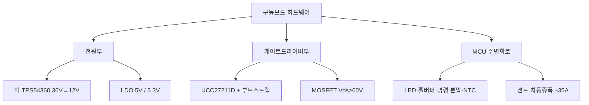

# 12주차 · 인버터 하드웨어 설계 — MCU 주변회로와 게이트드라이버

> **학습목표** — MCU 주변회로와 벅컨버터·게이트드라이버 설계를 부품값 수준으로 이해한다. 6·7주차 이론을 하드웨어로 통합하는 주차.

## 🗺️ 한눈에 보는 개념도

## 🔧 MCU 주변회로 요약

| 회로 | 핵심 값 |
|---|---|
| LED | `Vf 2.85V`, 5mA 이하 |
| 명령(쓰로틀) | 5V → 분압 `≈ 3.20V` |
| NTC | `MOSFET_NTC = NTC/(R13+NTC)·3.3V` |
| 홀센서 | 풀업+바이패스+슈미트버퍼(SN74LVC3G17) |

### 벅컨버터·게이트드라이버 설계값

- **벅 (TPS54360, 36V→12V)**: `fsw≈544kHz`, `L=33µH`, `Iripple≈0.58A`, `FB≈0.8V`, 보상 위상여유 `≈30°`
- **게이트드라이버/MOSFET**: `Vds≥60V`, 정션온도 `T=Ta+ID²·Ron·RthJA`, 부트스트랩 11.3V, 게이트저항 On 10Ω/Off 5Ω, Self turn-on 방지 G-S 1nF, 션트 ±35A 차동증폭 22배

> ⚠️ 게이트드라이버 부품 표기 불일치 — 슬라이드 UCC27211D vs 실물 회로도 IR2101. 실물 기준으로 통일.

## 🧪 실습·과제

- [ ] 사양서 → 부품 선정(MOSFET Vds, 인덕터 L, Cout) 계산 재현
- [ ] LED/명령 분압 저항 설계, MOSFET 정션온도 계산
- [ ] MCU 주변회로·게이트드라이버 회로 리뷰 자료 제출

> **🤖 AX 연계** — AI 기반으로 부품 선정·설계를 검토하고, 열·손실을 예측해 설계 리스크를 사전 진단한다.
