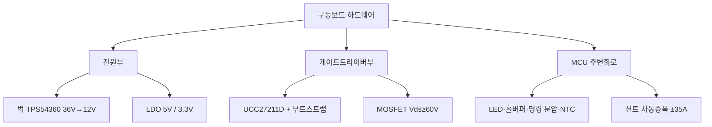

# 12주차 · 인버터 하드웨어 설계 — MCU 주변회로와 게이트드라이버

> 🔗 **강의 흐름** — 지난주 요구사항·블록도를 이번 주 **실제 부품값(하드웨어 설계)**으로 확정한다. 다음 주엔 이 회로를 PCB로.

> **학습목표** — MCU 주변회로와 벅컨버터·게이트드라이버 설계를 부품값 수준으로 이해한다. 6·7주차 이론을 하드웨어로 통합하는 주차.

> 💡 **기초 다지기 (쉽게 이해하기)** — **하드웨어 설계란?** 이론(PWM·전원)을 실제 부품값(저항·인덕터·IC)으로 확정하는 단계다. 게이트드라이버는 MCU의 약한 3.3V 신호를 MOSFET을 확실히 켤 만큼(12~15V) 증폭해 주는 부품이다.

## 🗺️ 한눈에 보는 개념도

## 🔧 MCU 주변회로 요약

| 회로 | 핵심 값 |
|---|---|
| LED | `Vf 2.85V`, 5mA 이하 |
| 명령(쓰로틀) | 5V → 분압 `≈ 3.20V` |
| NTC | `MOSFET_NTC = NTC/(R13+NTC)·3.3V` |
| 홀센서 | 풀업+바이패스+슈미트버퍼(SN74LVC3G17) |

### 벅컨버터·게이트드라이버 설계값

- **벅 (TPS54360, 36V→12V)**: `fsw≈544kHz`, `L=33µH`, `Iripple≈0.58A`, `FB≈0.8V`, 보상 위상여유 `≈30°`
- **게이트드라이버/MOSFET**: `Vds≥60V`, 정션온도 `T=Ta+ID²·Ron·RthJA`, 부트스트랩 11.3V, 게이트저항 On 10Ω/Off 5Ω, Self turn-on 방지 G-S 1nF, 션트 ±35A 차동증폭 22배

> ⚠️ 게이트드라이버 부품 표기 불일치 — 슬라이드 UCC27211D vs 실물 회로도 IR2101. 실물 기준으로 통일.

## 🧠 핵심 이론 보강

!!! info "이미지로 설명하기"
    

    

    첫 화면에서는 첨부자료 이미지를 보여 주고, 바로 아래 도해로 원리를 단순화한다. 학생에게 “사진 속 실제 부품/단자”와 “도해 속 기능 블록”을 서로 연결하게 하면 추상 개념이 실습 대상으로 바뀐다.

### 1. 이번 주 이론을 어디에 쓰는가

- 전력부는 정상 동작 전류보다 시동, 락드로터, 회생, 단락 조건에서 더 큰 스트레스를 받는다.
- 게이트 드라이버는 MCU의 논리 신호를 MOSFET을 빠르고 안전하게 켜는 구동 에너지로 바꾼다.
- 하드웨어 보호는 빠르게 차단하고, 소프트웨어 보호는 원인 기록과 재시도 정책을 담당한다.

### 2. 강의 중 반드시 남길 판서

| 판서 항목 | 설명 | 실습 연결 |
|---|---|---|
| 핵심 관계식 | `MOSFET 여유율: Vds_rating > Vbus+spike, Id_rating > Ipeak, Tj<Tjmax` | 계산값을 먼저 예측하고 측정값으로 검증한다. |
| 입력 조건 | 전압, 전류, 주파수, RPM, 핀 상태 중 이번 주 주제에 해당하는 값을 정한다. | 조건이 빠지면 결과 비교가 불가능하다는 점을 강조한다. |
| 정상/비정상 판단 | 정상 범위와 즉시 정지해야 할 조건을 분리한다. | 최종 프로젝트의 안전 상태와 로그 항목으로 이어진다. |

### 3. 학생 눈높이 설명 순서

1. **현상 관찰**: 첨부 이미지에서 실제 부품, 커넥터, 파형, 코드 위치를 먼저 찾는다.
2. **모델 단순화**: 핵심 도해와 공식으로 “왜 그런 값이 나오는지”를 설명한다.
3. **설계 판단**: 부품값, 듀티, 샘플링 주기, 보호 기준처럼 학생이 직접 정해야 하는 값을 고른다.
4. **검증 증거**: 사진, 계산표, 오실로스코프 캡처, UART 로그 중 하나 이상으로 결과를 남긴다.

!!! warning "학생들이 자주 헷갈리는 지점"
    이번 주제는 암기보다 조건 확인이 중요하다. 회로·펌웨어·제어 문제는 같은 증상으로 보일 수 있으므로, 전원 조건 → 신호 조건 → 코드 조건 순서로 좁혀 가게 한다.

!!! tip "최신 기술 연결"
    전력 인버터 설계는 고전류 소자 선정만이 아니라 게이트 드라이버, 보호 비교기, 온도 감시, 펌웨어 차단 로직의 공동 설계로 이동하고 있다. SDV, Adaptive AUTOSAR, 엣지 AI MCU, 차량 사이버보안, ISO 26262 기능안전은 서로 다른 주제처럼 보이지만 모두 '측정 가능한 요구사항과 검증 가능한 로그'를 요구한다.

### 4. 실습 전환 포인트

전류 션트, 부트스트랩 커패시터, 게이트 저항, TVS 위치를 회로도에서 찾아 보호 흐름을 그린다. 이 활동은 확장 강의자료의 심화노트, 실습 코칭노트, 평가팩, 사례노트와 이어지며, 한 주차 안에서 “이론 설명 → 손으로 확인 → 평가 → 현장 사례”가 끊기지 않도록 구성한다.

## 🎞️ 통합 강의 슬라이드
> 통합 근거: 모터·인버터·제어 기술노트 12주차 + inverter-hardware-design 자료.

!!! note "슬라이드 1 · 이론을 부품값으로 변환한다"
    6주차 PWM과 4주차 전원 이론은 실제 보드에서 MOSFET, 게이트 저항, 부트스트랩, 벅 인덕터 값으로 구체화된다.

!!! note "슬라이드 2 · 게이트드라이버 블록을 따로 본다"
    하이사이드 MOSFET을 켜려면 소스보다 높은 게이트 전압이 필요하다. 부트스트랩 캡 충전 조건과 하단 스위치 ON 시간이 중요하다.

!!! note "슬라이드 3 · 전류센싱은 증폭과 오프셋 문제다"
    션트 전압은 작으므로 차동증폭과 1.65V 오프셋을 사용한다. ±전류 범위가 ADC 0~3.3V에 들어오는지 계산한다.

!!! note "슬라이드 4 · 열 설계는 정격 선택의 핵심이다"
    MOSFET 온도는 Ta+I²RDS(on)Rth로 추정한다. 데이터시트의 200A 같은 숫자를 그대로 믿지 않고 보드 조건으로 환산한다.

!!! note "슬라이드 5 · 부품 불일치는 수업 중 명시한다"
    슬라이드와 실물 회로도의 게이트드라이버 표기가 다를 수 있으므로 학생에게 실물 BOM/회로 기준으로 검증하게 한다.

## 📦 용어 박스
!!! abstract "이번 주 꼭 설명할 용어"
    - **부트스트랩**: 하이사이드 게이트를 소스보다 높게 구동하기 위해 충전해 쓰는 회로.
    - **게이트저항**: MOSFET 켜짐/꺼짐 속도와 링잉을 조절하는 저항.
    - **NTC**: 온도가 오르면 저항이 감소하는 온도 센서.
    - **차동증폭**: 두 입력의 차이만 증폭해 션트 전압을 읽는 회로.
    - **정션온도**: 반도체 내부 접합부 온도. 신뢰성과 정격을 결정한다.

!!! tip "최신 기술 연결"
    하드웨어 설계 자동검토와 열/손실 예측은 AI 보조 설계의 현실적인 적용 지점이다.

## 📚 확장 강의자료

- [12주차 심화 강의노트](week12-deep-dive.md): 첨부자료 대표 이미지, 판서 흐름, 오개념 교정, 최신 기술 연결을 포함한 이론 확장 자료.
- [12주차 실습 코칭노트](week12-lab-coach.md): 팀 실습 절차, 코칭 질문, 평가 루브릭, 보강 과제를 포함한 수업 운영 자료.
- [12주차 평가·문제팩](week12-assessment-pack.md): 10분 퀴즈, 계산·해석 문제, 구두 발표 질문, 채점 루브릭.
- [12주차 현장 사례노트](week12-case-note.md): 실제 고장 시나리오, 진단 절차, 보고서 연결 문장.

!!! success "메인 자료와 확장 자료를 함께 쓰는 순서"
    1. 메인 페이지의 개념도와 핵심 이론 보강으로 `전력부 부품 선정과 보호`의 큰 그림을 설명한다.
    2. 심화 강의노트에서 첨부자료 이미지를 확대해 판서와 계산을 진행한다.
    3. 실습 코칭노트로 팀별 측정·로그·사진 증거를 만들게 한다.
    4. 평가·문제팩과 사례노트로 이해 확인, 고장 진단, 최종 보고서 문장을 연결한다.
## ⏱️ 3시간 수업 운영안

| 시간 | 활동 | 학생 산출물 |
|---|---|---|
| 0:00-0:20 | 요구사항 사양이 실제 부품값으로 내려가는 흐름 복습 | 부품 선정 기준표 |
| 0:20-1:15 | MCU 주변회로, 벅, 게이트드라이버, 션트 증폭 회로 해설 | 회로 블록별 체크리스트 |
| 1:25-2:25 | MOSFET 열, 벅 인덕터, 분압/NTC 계산 실습 | 설계 계산서 |
| 2:25-3:00 | 인버터 보드 회로 리뷰와 위험요소 표시 | 리뷰 보드마크업 |

## 📎 수업자료 활용

| 자료 | 수업 중 쓰는 장면 |
|---|---|
| [inverter-hardware-design-v0.1.pdf](attachments/inverter-hardware-design-v0.1.pdf) | 인버터 하드웨어 설계의 주교재 |
| [motor-control-inverter-theory.pdf](attachments/motor-control-inverter-theory.pdf) | 6~7주차 이론을 회로 설계로 연결 |
| figures/inverter3ph.svg | 게이트드라이버와 MOSFET 배치 설명 |

## ✅ 이해 확인 질문

1. MCU 3.3V PWM이 직접 MOSFET을 구동하기 어려운 이유를 말한다.
2. 부트스트랩 회로가 하이사이드 구동에 필요한 이유를 설명한다.
3. 션트 증폭 회로의 입력 범위와 ADC 범위를 함께 확인한다.

## 🧪 실습·과제

- [ ] 사양서 → 부품 선정(MOSFET Vds, 인덕터 L, Cout) 계산 재현
- [ ] LED/명령 분압 저항 설계, MOSFET 정션온도 계산
- [ ] MCU 주변회로·게이트드라이버 회로 리뷰 자료 제출

> **🤖 AX 연계** — AI 기반으로 부품 선정·설계를 검토하고, 열·손실을 예측해 설계 리스크를 사전 진단한다.
