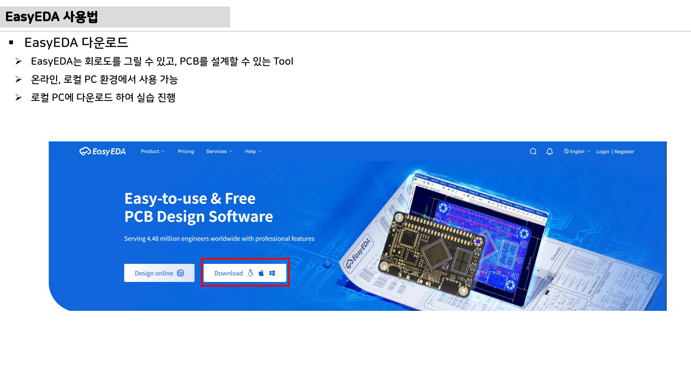

# 13주차 심화 강의노트 · 회로도·PCB 설계 기초

> 기존 주차 페이지를 실제 3시간 강의용 설명 자료로 확장한 노트다. 첨부 PDF 이미지, 사이트 도해, 판서 흐름, 학생 질문을 함께 사용한다.

## 첨부자료 대표 이미지

## 강의 핵심 초점

- 오늘의 중심 주제: 회로도 의도, PCB 물리 경로, 부품배치, 테스트포인트, DRC
- 연결할 첨부자료: `pcb-design-lecture-v0.1.pdf`
- 최종 AMR ECU에서의 위치: 전원, 제어, 구동, 센싱, 통신, 진단 중 어디에 속하는지 먼저 표시한다.
- 학생 목표: 용어 암기보다 입력, 처리, 출력, 위험요소를 자기 말로 설명하게 한다.

## 교수자 설명 흐름

1. 큰 시스템 그림에서 시작한다. 배터리, MCU, 드라이버, 모터, 센서, 통신을 먼저 연결한다.
2. 첨부 PDF의 대표 이미지를 열어 오늘 다룰 회로, 코드, 파형이 전체 시스템의 어느 위치인지 묻는다.
3. 핵심 공식이나 코드가 나오면 기호를 바로 외우게 하지 말고 물리량, 단위, 측정 방법을 함께 적는다.
4. 학생이 실습 중 틀릴 가능성이 높은 기준점, 극성, 단위, 클럭, 그라운드를 먼저 경고한다.
5. 최신 모빌리티 관점으로 확장한다. 작은 실습 ECU도 SDV, 진단, OTA, 안전 요구사항의 일부가 될 수 있음을 설명한다.

## 판서용 상세 스크립트

| 단계 | 판서 내용 | 학생에게 던질 질문 |
|---|---|---|
| 시스템 위치 | 오늘 주제를 ECU 블록도 안에 표시 | 이 신호는 에너지 흐름인가, 정보 흐름인가 |
| 입력 조건 | 전압, 전류, 클럭, 센서값, 명령값을 정리 | 최악 조건은 무엇인가 |
| 처리 원리 | 회로식, 타이머식, 제어식, 상태전이를 한 줄로 작성 | 어떤 가정이 들어갔는가 |
| 출력 결과 | PWM, 로그, 전압, 속도, Fault 중 결과를 연결 | 결과를 어떻게 측정할 것인가 |
| 위험요소 | 과전류, 발열, 노이즈, 타이밍 오류, 오배선을 표시 | 안전하게 멈추는 조건은 무엇인가 |

## 3시간 수업 확장안

| 시간 | 강의 운영 | 학생 산출물 |
|---|---|---|
| 0:00-0:20 | 지난 주 산출물 2개를 화면에 띄워 오류와 좋은 점을 비교 | 개인 수정 메모 |
| 0:20-0:50 | 첨부 PDF 이미지와 사이트 도해로 오늘 시스템 위치 설명 | 이미지 위 입력/출력 표시 |
| 1:00-1:35 | 핵심 계산 또는 코드 흐름을 교수자가 판서 | 빈칸 계산식 완성 |
| 1:35-2:20 | 팀별 실습 미션 수행 | 캡처, 로그, 계산표 중 1개 |
| 2:20-2:45 | 팀별 결과 비교와 실패 원인 분류 | 원인-해결 표 |
| 2:45-3:00 | 다음 주 자료와 연결 | 다음 주 준비 체크리스트 |

## 오개념 교정

| 자주 나오는 오개념 | 교정 설명 | 확인 질문 |
|---|---|---|
| 부품명이나 함수명을 외우면 이해한 것이다 | 이름보다 어떤 물리량을 바꾸는지 설명해야 한다 | 입력과 출력은 무엇인가 |
| 계산값 하나가 정답이다 | 허용오차, 온도, 부하, 노이즈, 안전 여유가 함께 필요하다 | 최악 조건에서 값은 어떻게 변하는가 |
| 코드 문제는 코드만 보면 된다 | 전원, 배선, 센서, 클럭 문제가 코드 오류처럼 보인다 | 같은 현상을 하드웨어 원인으로 설명할 수 있는가 |

## 수업 중 강조할 최신 기술 연결

- SDV에서는 ECU 기능이 소프트웨어 서비스, 데이터 로그, 진단 코드로 표현된다.
- 전력전자와 모터제어는 여전히 물리 기반 제어가 중심이며, AI는 로그 분석과 예지보전에서 보조 역할을 한다.
- 보안과 OTA를 고려하면 펌웨어 변경 이력, 요구사항, 검증 로그를 남기는 습관이 중요하다.
- 기능안전 관점에서는 정상 동작보다 고장 시 안전 상태가 더 중요하다.

## 마무리 질문

1. 오늘 주제의 입력, 처리, 출력은 각각 무엇인가?
2. 오늘 실습 결과를 어떤 측정값이나 로그로 증명할 수 있는가?
3. 실제 차량 ECU라면 어떤 진단 또는 안전 기능을 추가해야 하는가?
