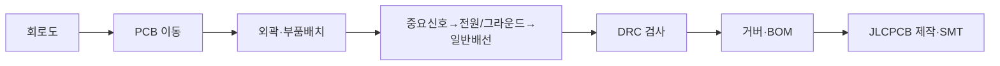

# 13주차 · 회로도 작성 및 PCB 설계 기초

> 🔗 **강의 흐름** — 지난주 하드웨어 설계를 이번 주 **PCB**에 올린다. 다음 주는 고전류 보드의 노이즈·그라운드.

> **학습목표** — EasyEDA 설계 흐름과 PCB 용어·레이어·배선 규칙(트레이스폭·3W룰)을 이해하고 LED 회로로 전 과정을 실습한다.

> 💡 **기초 다지기 (쉽게 이해하기)** — **PCB란?** 부품을 올리고 구리 선로(트레이스)로 연결하는 기판이다. 같은 회로도라도 배선 방식(레이아웃)에 따라 성능이 달라진다. 3W룰은 신호선끼리 간섭을 줄이려 간격을 넓히는 규칙이다.

## 🗺️ 한눈에 보는 개념도

## 📏 핵심 설계 규칙

- **3W 룰** — 신호 중심간격 ≥ 트레이스폭 3배 → 크로스토크(오버슈트·링잉) 방지
- **트레이스폭** — 전류+동박두께(1oz/2oz). 외부배선이 더 큰 전류 허용
- **배선** — 짧고 굵게, 직각 금지(45°/원호), 양면 상하층 수직
- **비아·켈빈** — 고전류부 Via 결합, 션트는 4접점(켈빈) 센싱

같은 회로도라도 **레이아웃에 따라 성능이 달라진다.** 8대 용어(PAD·트레이스·실크·카파푸어·솔더마스크)와 레이어 스택업(모터제어기 예: SIG/GND/POWER/SIG)을 이해할 것.

## 🧠 핵심 이론 보강

!!! info "이미지로 설명하기"
    

    

    첫 화면에서는 첨부자료 이미지를 보여 주고, 바로 아래 도해로 원리를 단순화한다. 학생에게 “사진 속 실제 부품/단자”와 “도해 속 기능 블록”을 서로 연결하게 하면 추상 개념이 실습 대상으로 바뀐다.

### 1. 이번 주 이론을 어디에 쓰는가

- 회로도는 전기적 연결을 설명하고, PCB는 그 연결을 실제 공간과 전류 경로로 구현한다.
- 전력 경로는 넓고 짧게, 센서 경로는 기준 전위를 안정적으로 유지하도록 분리해 배치한다.
- 풋프린트, 커넥터 핀맵, 테스트 포인트 오류는 펌웨어로 고치기 어려운 하드웨어 결함이 된다.

### 2. 강의 중 반드시 남길 판서

| 판서 항목 | 설명 | 실습 연결 |
|---|---|---|
| 핵심 관계식 | `기본 설계 기준: 전류 경로 폭, 절연거리, 열 방출, 테스트 포인트 접근성` | 계산값을 먼저 예측하고 측정값으로 검증한다. |
| 입력 조건 | 전압, 전류, 주파수, RPM, 핀 상태 중 이번 주 주제에 해당하는 값을 정한다. | 조건이 빠지면 결과 비교가 불가능하다는 점을 강조한다. |
| 정상/비정상 판단 | 정상 범위와 즉시 정지해야 할 조건을 분리한다. | 최종 프로젝트의 안전 상태와 로그 항목으로 이어진다. |

### 3. 학생 눈높이 설명 순서

1. **현상 관찰**: 첨부 이미지에서 실제 부품, 커넥터, 파형, 코드 위치를 먼저 찾는다.
2. **모델 단순화**: 핵심 도해와 공식으로 “왜 그런 값이 나오는지”를 설명한다.
3. **설계 판단**: 부품값, 듀티, 샘플링 주기, 보호 기준처럼 학생이 직접 정해야 하는 값을 고른다.
4. **검증 증거**: 사진, 계산표, 오실로스코프 캡처, UART 로그 중 하나 이상으로 결과를 남긴다.

!!! warning "학생들이 자주 헷갈리는 지점"
    이번 주제는 암기보다 조건 확인이 중요하다. 회로·펌웨어·제어 문제는 같은 증상으로 보일 수 있으므로, 전원 조건 → 신호 조건 → 코드 조건 순서로 좁혀 가게 한다.

!!! tip "최신 기술 연결"
    소형 모빌리티 제어보드는 기능 회로도보다 전류 루프, 커넥터 방향, 테스트 포인트, 제조 가능성까지 포함한 PCB 설계 품질이 중요해진다. SDV, Adaptive AUTOSAR, 엣지 AI MCU, 차량 사이버보안, ISO 26262 기능안전은 서로 다른 주제처럼 보이지만 모두 '측정 가능한 요구사항과 검증 가능한 로그'를 요구한다.

### 4. 실습 전환 포인트

회로도 한 블록을 골라 전원 루프, 신호 루프, 디버그 포인트를 PCB 위에 색으로 표시한다. 이 활동은 확장 강의자료의 심화노트, 실습 코칭노트, 평가팩, 사례노트와 이어지며, 한 주차 안에서 “이론 설명 → 손으로 확인 → 평가 → 현장 사례”가 끊기지 않도록 구성한다.

## 🎞️ 통합 강의 슬라이드
> 통합 근거: PCB·펌웨어 통합 기술노트 13주차 + pcb-design-lecture 자료.

!!! note "슬라이드 1 · 회로도와 PCB는 다른 산출물이다"
    회로도는 논리 연결, PCB는 물리 배치와 전류 경로다. 같은 회로도라도 PCB가 나쁘면 노이즈, 발열, 오동작이 생긴다.

!!! note "슬라이드 2 · EasyEDA 흐름을 작업 순서로 익힌다"
    회로도 작성, footprint 확인, PCB 이동, 외곽, 부품배치, 중요 신호, 전원/그라운드, 일반 배선, DRC, 거버/BOM 순서로 진행한다.

!!! note "슬라이드 3 · 부품 배치가 배선보다 먼저다"
    커넥터, 전원부, MCU, 게이트드라이버, 고전류 MOSFET을 기능별로 묶는다. 나쁜 배치는 아무리 라우팅해도 좋아지기 어렵다.

!!! note "슬라이드 4 · 트레이스폭과 3W룰을 숫자로 본다"
    전류가 큰 선은 굵게, 고속/민감 신호는 간격을 확보한다. 3W룰은 크로스토크를 줄이기 위한 기본 설계 기준이다.

!!! note "슬라이드 5 · DRC와 사람 검토를 구분한다"
    DRC는 간격/미연결 같은 규칙 위반을 잡지만 전류 루프, 디커플링 위치, 커넥터 방향은 사람이 판단해야 한다.

## 📦 용어 박스
!!! abstract "이번 주 꼭 설명할 용어"
    - **Footprint**: PCB 위 부품 패드와 외형 정보.
    - **Trace**: PCB에서 전류가 흐르는 구리 배선.
    - **Copper Pour**: 넓은 구리 영역으로 GND나 전원 면을 만드는 기능.
    - **DRC**: Design Rule Check. 설계 규칙 위반을 자동 검사한다.
    - **Gerber**: PCB 제조사에 전달하는 표준 제작 파일.

!!! tip "최신 기술 연결"
    AI 배치·라우팅 보조 도구가 늘고 있지만, 전류 루프와 기준 전위 판단은 설계자가 직접 설명할 수 있어야 한다.

## 📚 확장 강의자료

- [13주차 심화 강의노트](week13-deep-dive.md): 첨부자료 대표 이미지, 판서 흐름, 오개념 교정, 최신 기술 연결을 포함한 이론 확장 자료.
- [13주차 실습 코칭노트](week13-lab-coach.md): 팀 실습 절차, 코칭 질문, 평가 루브릭, 보강 과제를 포함한 수업 운영 자료.
- [13주차 평가·문제팩](week13-assessment-pack.md): 10분 퀴즈, 계산·해석 문제, 구두 발표 질문, 채점 루브릭.
- [13주차 현장 사례노트](week13-case-note.md): 실제 고장 시나리오, 진단 절차, 보고서 연결 문장.

!!! success "메인 자료와 확장 자료를 함께 쓰는 순서"
    1. 메인 페이지의 개념도와 핵심 이론 보강으로 `회로도와 PCB 배치`의 큰 그림을 설명한다.
    2. 심화 강의노트에서 첨부자료 이미지를 확대해 판서와 계산을 진행한다.
    3. 실습 코칭노트로 팀별 측정·로그·사진 증거를 만들게 한다.
    4. 평가·문제팩과 사례노트로 이해 확인, 고장 진단, 최종 보고서 문장을 연결한다.
## ⏱️ 3시간 수업 운영안

| 시간 | 활동 | 학생 산출물 |
|---|---|---|
| 0:00-0:20 | 회로도와 PCB 레이아웃의 역할 차이 정리 | 용어 카드 |
| 0:20-1:10 | EasyEDA 흐름, 부품 배치, 레이어, 트레이스폭, 3W룰 해설 | 설계 규칙 요약 |
| 1:20-2:25 | LED 회로 또는 구동보드 일부를 PCB로 옮겨 DRC 수행 | 회로도/PCB 캡처 |
| 2:25-3:00 | 팀별 PCB 초안 리뷰: 전원, 신호, 커넥터, 실크 | DRC와 개선 목록 |

## 📎 수업자료 활용

| 자료 | 수업 중 쓰는 장면 |
|---|---|
| [pcb-design-lecture-v0.1.pdf](attachments/pcb-design-lecture-v0.1.pdf) | EasyEDA, 레이어, 배선 규칙의 주교재 |
| [inverter-hardware-design-v0.1.pdf](attachments/inverter-hardware-design-v0.1.pdf) | 구동보드 회로 블록을 PCB로 옮기는 참고 자료 |

## ✅ 이해 확인 질문

1. 회로도가 맞아도 PCB에서 문제가 생길 수 있는 이유를 예로 든다.
2. 트레이스폭과 전류용량을 연결해 설명한다.
3. DRC가 잡아주는 오류와 사람이 검토해야 하는 오류를 구분한다.

## 🧪 실습·과제

- [ ] LED 회로(2층)로 EasyEDA 전 과정 완주 + 구동보드 PCB Import
- [ ] 정격 상전류 기준 트레이스폭 계산(1oz vs 2oz)
- [ ] EasyEDA 회로도 및 PCB 초안 제출

> **🤖 AX 연계** — AI PCB 배치·자동 DRC 보조 도구를 활용해 설계 시간을 단축하고 오류를 줄인다.
