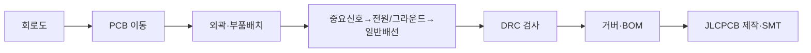

# 13주차 · 회로도 작성 및 PCB 설계 기초

> **학습목표** — EasyEDA 설계 흐름과 PCB 용어·레이어·배선 규칙(트레이스폭·3W룰)을 이해하고 LED 회로로 전 과정을 실습한다.

> 💡 **기초 다지기 (쉽게 이해하기)** — **PCB란?** 부품을 올리고 구리 선로(트레이스)로 연결하는 기판이다. 같은 회로도라도 배선 방식(레이아웃)에 따라 성능이 달라진다. 3W룰은 신호선끼리 간섭을 줄이려 간격을 넓히는 규칙이다.

## 🗺️ 한눈에 보는 개념도

## 📏 핵심 설계 규칙

- **3W 룰** — 신호 중심간격 ≥ 트레이스폭 3배 → 크로스토크(오버슈트·링잉) 방지
- **트레이스폭** — 전류+동박두께(1oz/2oz). 외부배선이 더 큰 전류 허용
- **배선** — 짧고 굵게, 직각 금지(45°/원호), 양면 상하층 수직
- **비아·켈빈** — 고전류부 Via 결합, 션트는 4접점(켈빈) 센싱

같은 회로도라도 **레이아웃에 따라 성능이 달라진다.** 8대 용어(PAD·트레이스·실크·카파푸어·솔더마스크)와 레이어 스택업(모터제어기 예: SIG/GND/POWER/SIG)을 이해할 것.

## 용어·도해·트렌드 연결

| 항목 | 수업 중 연결 |
|---|---|
| 먼저 볼 용어 | [HSI](glossary.md#hsi), [Zonal Architecture](glossary.md#zonal), [Cybersecurity](glossary.md#cybersecurity) |
| 도해 |  |
| 최신 기술 연결 | PCB 커넥터·배선 설계는 존 컨트롤러와 액추에이터 ECU를 연결하는 실제 인터페이스 설계로 확장된다. |

## 📚 확장 강의자료

- [13주차 심화 강의노트](week13-deep-dive.md): 첨부자료 대표 이미지, 판서 흐름, 오개념 교정, 최신 기술 연결을 포함한 이론 확장 자료.
- [13주차 실습 코칭노트](week13-lab-coach.md): 팀 실습 절차, 코칭 질문, 평가 루브릭, 보강 과제를 포함한 수업 운영 자료.
- [13주차 평가·문제팩](week13-assessment-pack.md): 10분 퀴즈, 계산·해석 문제, 구두 발표 질문, 채점 루브릭.
- [13주차 현장 사례노트](week13-case-note.md): 실제 고장 시나리오, 진단 절차, 보고서 연결 문장.

## ⏱️ 3시간 수업 운영안

| 시간 | 활동 | 학생 산출물 |
|---|---|---|
| 0:00-0:20 | 회로도와 PCB 레이아웃의 역할 차이 정리 | 용어 카드 |
| 0:20-1:10 | EasyEDA 흐름, 부품 배치, 레이어, 트레이스폭, 3W룰 해설 | 설계 규칙 요약 |
| 1:20-2:25 | LED 회로 또는 구동보드 일부를 PCB로 옮겨 DRC 수행 | 회로도/PCB 캡처 |
| 2:25-3:00 | 팀별 PCB 초안 리뷰: 전원, 신호, 커넥터, 실크 | DRC와 개선 목록 |

## 📎 수업자료 활용

| 자료 | 수업 중 쓰는 장면 |
|---|---|
| [pcb-design-lecture-v0.1.pdf](attachments/pcb-design-lecture-v0.1.pdf) | EasyEDA, 레이어, 배선 규칙의 주교재 |
| [inverter-hardware-design-v0.1.pdf](attachments/inverter-hardware-design-v0.1.pdf) | 구동보드 회로 블록을 PCB로 옮기는 참고 자료 |

## ✅ 이해 확인 질문

1. 회로도가 맞아도 PCB에서 문제가 생길 수 있는 이유를 예로 든다.
2. 트레이스폭과 전류용량을 연결해 설명한다.
3. DRC가 잡아주는 오류와 사람이 검토해야 하는 오류를 구분한다.

## 🧪 실습·과제

- [ ] LED 회로(2층)로 EasyEDA 전 과정 완주 + 구동보드 PCB Import
- [ ] 정격 상전류 기준 트레이스폭 계산(1oz vs 2oz)
- [ ] EasyEDA 회로도 및 PCB 초안 제출

> **🤖 AX 연계** — AI PCB 배치·자동 DRC 보조 도구를 활용해 설계 시간을 단축하고 오류를 줄인다.
