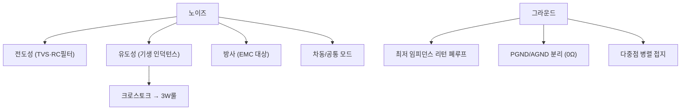
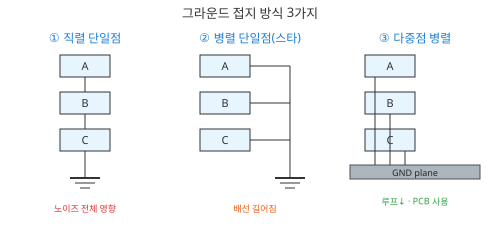
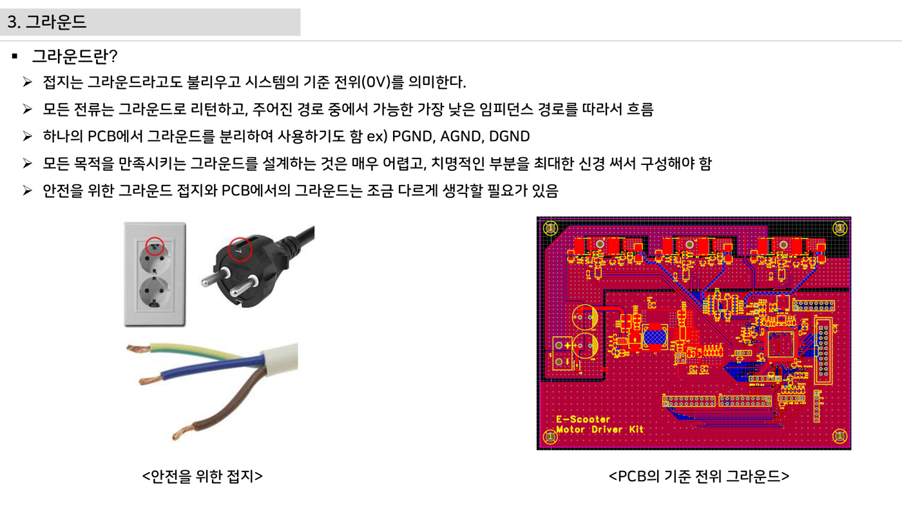
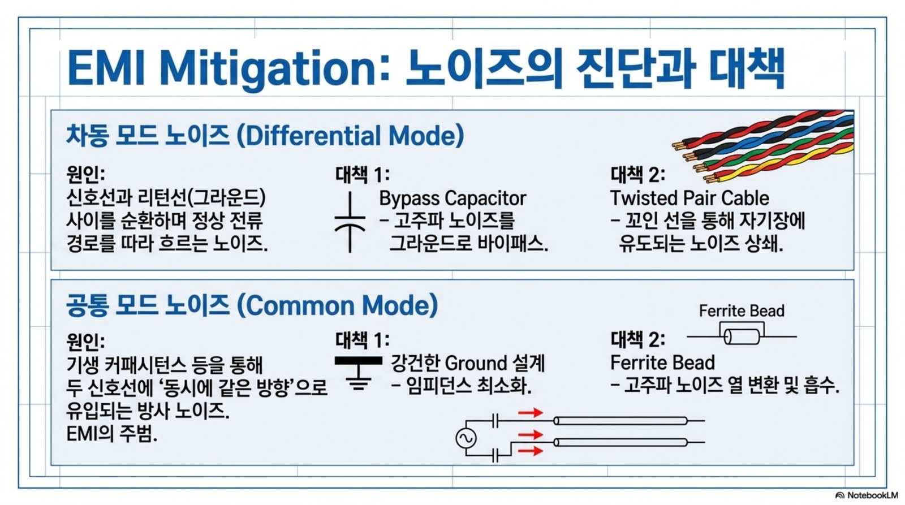
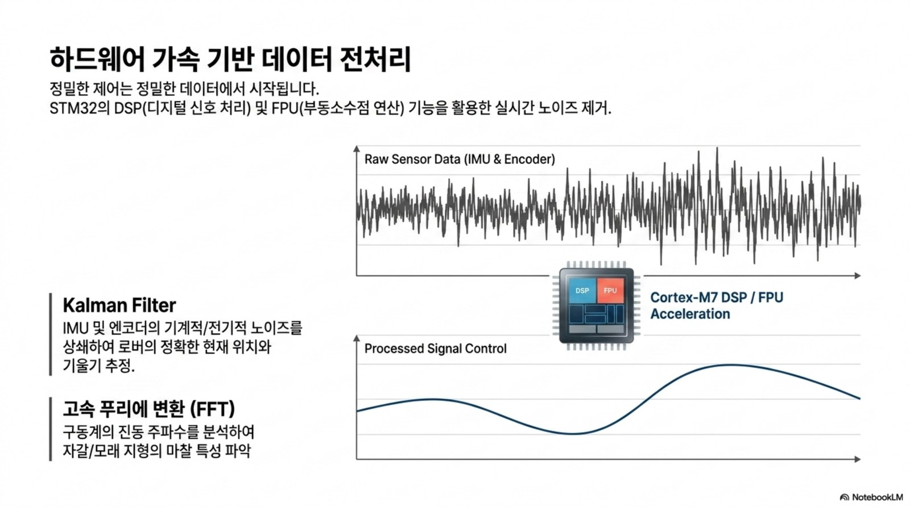

# 14주차 · PCB 노이즈·그라운드·파워 배선 설계

> 🔗 **강의 흐름** — 지난주 PCB 기초에 이어, 이번 주는 오동작을 막는 **노이즈·그라운드** 설계. 다음 주 모든 것을 펌웨어로 통합한다.

> **학습목표** — 노이즈 3종과 그라운드 이론·접지방식을 이해하고, 고전류 스위칭 구동보드 PCB의 파워/그라운드 배선을 개선한다.

> 💡 **기초 다지기 (쉽게 이해하기)** — **노이즈·그라운드란?** 원치 않는 전기 잡음이 오동작·고장을 일으킨다. 그라운드(0V 기준)를 잘 설계하면 잡음이 줄어든다. 핵심은 고전류·스위칭부와 예민한 신호부의 그라운드를 분리하는 것이다.

!!! warning "저작권 유의 — 원본 자료 사용 범위 확인"
    이 주차의 **원본 첨부 PDF 링크·슬라이드 미리보기 이미지**(chcbaram 원본 자료)는 수업 활용 범위와 외부 배포 가능 여부를 확인해 사용한다. 공개 배포 전에는 인용 허가, 출처 표기, 자작 대체 자료 여부를 점검한다.

## 🗺️ 한눈에 보는 개념도

## 📡 노이즈 3종과 대책

| 종류 | 원인 | 대책 |
|---|---|---|
| 전도성 | 커넥터·통신선 유입 | TVS, RC 필터 |
| 유도성 | 기생 인덕턴스 자기장 | 루프면적↓, 배선 짧게 |
| 차동/공통모드 | 기준전위차(EMI 주원인) | 바이패스캡·트위스트, 그라운드 설계 |

**낮은 임피던스 그라운드** — `L ≈ μ0·(l/w)·(ln(2h/w)+0.5)` → 길이 짧게·폭 넓게. 접지 3방식: 직렬단일점 / 병렬단일점 / **다중점 병렬(PCB 사용)**.

> **로버 구동부 연결** — SMPS+모터 고전류가 그라운드 바운싱 유발 → PGND/AGND를 0Ω 저항 단일점으로 분리. 부품 배치(고전류/스위칭부 vs 예민 신호부)가 가장 중요.

## 🌐 접지 방식 3가지

> 직렬 단일점(간단·전체 영향) / 병렬 단일점(스타·배선↑) / **다중점 병렬(PCB 사용·루프↓)**.

!!! note "🔗 여기서부터 확장 자료 — 흐름 이어보기"
    아래는 위 핵심 개념(개념도·공식·그림)을 더 깊이 파는 **심화·실습·평가·사례** 자료다. 처음 보는 학생은 페이지 맨 위 「💡 기초 다지기」로 큰 그림을 먼저 잡고, 심화 → 실습 → 평가 → 사례 순으로 읽으면 이번 주 흐름이 자연스럽게 이어진다.

## 🧠 핵심 이론 보강

!!! info "이미지로 설명하기"
    

    

    첫 화면에서는 첨부자료 이미지를 보여 주고, 바로 아래 도해로 원리를 단순화한다. 학생에게 “사진 속 실제 부품/단자”와 “도해 속 기능 블록”을 서로 연결하게 하면 추상 개념이 실습 대상으로 바뀐다.

### 1. 이번 주 이론을 어디에 쓰는가

- 노이즈는 전원 변동, 스위칭 dv/dt·di/dt, 접지 전위 차이, 측정 방법에서 발생한다.
- 전류는 반드시 돌아오는 길을 가지므로, 리턴 전류 경로를 설계하지 않으면 의도치 않은 신호선이 노이즈 경로가 된다.
- 오실로스코프 접지 리드와 프로브 설정도 측정 결과를 바꾸므로, 측정 자체를 설계해야 한다.

### 2. 강의 중 반드시 남길 판서

| 판서 항목 | 설명 | 실습 연결 |
|---|---|---|
| 핵심 관계식 | `노이즈 저감 원칙: 루프 면적↓, 임피던스↓, 기준면 연속성↑, 필터 위치 최적화` | 계산값을 먼저 예측하고 측정값으로 검증한다. |
| 입력 조건 | 전압, 전류, 주파수, RPM, 핀 상태 중 이번 주 주제에 해당하는 값을 정한다. | 조건이 빠지면 결과 비교가 불가능하다는 점을 강조한다. |
| 정상/비정상 판단 | 정상 범위와 즉시 정지해야 할 조건을 분리한다. | 최종 프로젝트의 안전 상태와 로그 항목으로 이어진다. |

### 3. 학생 눈높이 설명 순서

1. **현상 관찰**: 첨부 이미지에서 실제 부품, 커넥터, 파형, 코드 위치를 먼저 찾는다.
2. **모델 단순화**: 핵심 도해와 공식으로 “왜 그런 값이 나오는지”를 설명한다.
3. **설계 판단**: 부품값, 듀티, 샘플링 주기, 보호 기준처럼 학생이 직접 정해야 하는 값을 고른다.
4. **검증 증거**: 사진, 계산표, 오실로스코프 캡처, UART 로그 중 하나 이상으로 결과를 남긴다.

!!! warning "학생들이 자주 헷갈리는 지점"
    이번 주제는 암기보다 조건 확인이 중요하다. 회로·펌웨어·제어 문제는 같은 증상으로 보일 수 있으므로, 전원 조건 → 신호 조건 → 코드 조건 순서로 좁혀 가게 한다.

!!! tip "최신 기술 연결"
    고속 통신과 전동화 구동이 동시에 들어가는 모빌리티에서는 EMC, 접지, 실드, 필터 설계가 기능 안전과 신뢰성의 일부가 된다. SDV, Adaptive AUTOSAR, 엣지 AI MCU, 차량 사이버보안, ISO 26262 기능안전은 서로 다른 주제처럼 보이지만 모두 '측정 가능한 요구사항과 검증 가능한 로그'를 요구한다.

### 4. 실습 전환 포인트

스위칭 노드, 전류 루프, 아날로그 GND를 표시하고 프로브 접지 길이에 따른 링잉 차이를 비교한다. 이 활동은 확장 강의자료의 심화노트, 실습 코칭노트, 평가팩, 사례노트와 이어지며, 한 주차 안에서 “이론 설명 → 손으로 확인 → 평가 → 현장 사례”가 끊기지 않도록 구성한다.

## 🖼️ 슬라이드 이미지

!!! quote "슬라이드 이미지 1 · 첨부자료 대표 이미지"
    

    커넥터·PCB 열화상·레이아웃 예시를 함께 보며 노이즈, 발열, 접지 경로가 보드 품질에 미치는 영향을 찾게 한다.

!!! quote "슬라이드 이미지 2 · 핵심 도해"
    

    스타 접지, 전류 루프 면적, 센서 기준점을 비교해 측정 노이즈를 줄이는 배치 원칙을 정리한다.

## 🚀 AX·우주로버 적용 슬라이드

!!! info "NotebookLM 기반 시각자료 활용"
    아래 이미지는 새로 첨부된 우주 로버·AX·Physical AI 자료에서 강의 주제와 직접 연결되는 페이지를 선별한 것이다. 교수자는 기존 개념도 다음에 이 이미지를 보여 주고, 학생에게 실제 로버 ECU에서 같은 개념이 어디에 쓰이는지 말하게 한다.

!!! quote "적용 이미지 1 · EMI 대책"
    

    차동모드/공통모드 노이즈를 구분하고 커패시터, 트위스트 페어, 페라이트 비드 같은 억제 수단을 비교한다.

    출처: `Mobility_ECU_Blueprint.pdf p.8`

!!! quote "적용 이미지 2 · Edge AI 현장 데이터"
    

    PCB 노이즈와 센서 데이터 품질이 Edge AI 학습/추론 성능까지 영향을 준다는 점을 데이터 전처리 관점으로 연결한다.

    출처: `Edge_AI_Rover_Integration.pdf p.7`

## 🎞️ 통합 강의 슬라이드
> 통합 근거: PCB·펌웨어 통합 기술노트 14주차 + 노이즈/그라운드 도해.

!!! note "슬라이드 1 · 노이즈는 원치 않는 에너지 경로다"
    전도성, 유도성, 방사 노이즈를 구분하고 각각 어떤 경로로 MCU와 센서에 들어오는지 그린다.

!!! note "슬라이드 2 · 모든 전류는 돌아간다"
    신호 전류도 리턴 경로를 가진다. 리턴 경로가 길거나 끊기면 루프 면적이 커지고 유도성 노이즈가 증가한다.

!!! note "슬라이드 3 · 그라운드는 0V 선이 아니라 기준면이다"
    PGND, AGND, DGND를 분리하는 이유는 전류 크기와 민감도가 다르기 때문이다. 단일점 또는 면 연결 전략을 설계 의도로 설명한다.

!!! note "슬라이드 4 · 디커플링 위치는 PCB에서 중요하다"
    커패시터 값이 맞아도 IC 핀에서 멀면 고주파 전류가 긴 루프를 돈다. 전원핀과 리턴패스를 함께 본다.

!!! note "슬라이드 5 · 수정 전후 레이아웃을 증거로 남긴다"
    고전류 루프 축소, 션트 켈빈 배선, 0Ω 연결점, 45도 배선, 트레이스폭 변경을 캡처로 비교한다.

## 📦 용어 박스
!!! abstract "이번 주 꼭 설명할 용어"
    - **EMI/EMC**: 전자파 방출 문제와 전자파 환경에서 견디는 능력.
    - **리턴 전류**: 부하를 지나 다시 전원으로 돌아가는 전류 경로.
    - **그라운드 바운스**: 기생 임피던스 때문에 기준전위가 순간적으로 흔들리는 현상.
    - **PGND/AGND**: 전력 그라운드와 아날로그 그라운드.
    - **크로스토크**: 한 신호선 변화가 인접 신호선에 잡음으로 전달되는 현상.

!!! tip "최신 기술 연결"
    존 아키텍처와 고속 통신이 확대될수록 전원 분배, 접지 기준, EMC 설계가 소프트웨어 기능만큼 중요해진다.

## 📚 통합 확장 강의자료

!!! info "확장 자료 통합 안내"
    기존의 14주차 심화·실습·평가·사례 확장 페이지를 이 주차 메인 자료 안으로 합쳤다. 교수자는 이 섹션을 필요한 만큼 접어 읽히거나, 수업 후 과제·보충자료로 배정하면 된다.

### 심화 강의노트

> 14주차 심화노트는 `노이즈와 리턴 전류`를 3시간 강의에서 설명하기 위한 교수자용 자료다.

###### 수업에서 바로 보여줄 이미지

###### 강의 핵심 초점

- PCB 노이즈·그라운드의 중심 질문은 "노이즈와 리턴 전류가 최종 로버 ECU에서 어떤 문제를 해결하는가"이다.
- 연결할 첨부자료는 `pcb-design-lecture-v0.1.pdf`이며, 학생은 그림 위에 입력·처리·출력·위험요소를 직접 표시한다.
- 이번 주 설명은 이전 주 산출물과 다음 주 실습으로 이어지는 설계 판단을 남기는 데 초점을 둔다.

###### 교수자 설명 스크립트

1. 노이즈는 추상적 방해가 아니라 큰 di/dt와 dv/dt 루프가 주변 회로에 주는 영향이다.
2. 그라운드는 0V 기호가 아니라 리턴 전류가 실제로 흐르는 경로다.
3. ADC와 션트 주변의 배치가 펌웨어 필터보다 먼저 측정 품질을 결정할 수 있다.

###### 판서 흐름

##### 도입 판서
스위칭 루프를 빨간색으로, 센서 리턴 경로를 파란색으로 표시한다.

##### 원리 판서
그라운드 플레인이 끊기면 리턴 전류가 돌아가는 경로가 길어지는 모습을 그린다.

##### 검증 판서
오실로스코프 접지 리드가 길 때 링잉이 커져 보이는 측정 오류를 설명한다.

###### 이론 보강 슬라이드 세트

!!! note "슬라이드 A · 실제 자료에서 출발"
    `pcb-design-lecture-v0.1.pdf / practical-circuits.pdf`의 대표 이미지를 먼저 띄우고, 학생이 부품명보다 기능을 말하게 한다. “이 부분은 입력인가, 처리인가, 출력인가, 보호인가”를 묻는다.

!!! note "슬라이드 B · 핵심 원리 압축"
    - 노이즈는 전원 변동, 스위칭 dv/dt·di/dt, 접지 전위 차이, 측정 방법에서 발생한다.
    - 전류는 반드시 돌아오는 길을 가지므로, 리턴 전류 경로를 설계하지 않으면 의도치 않은 신호선이 노이즈 경로가 된다.
    - 오실로스코프 접지 리드와 프로브 설정도 측정 결과를 바꾸므로, 측정 자체를 설계해야 한다.

!!! note "슬라이드 C · 공식은 조건과 함께"
    `노이즈 저감 원칙: 루프 면적↓, 임피던스↓, 기준면 연속성↑, 필터 위치 최적화`를 판서하되, 공식 자체보다 어떤 조건에서 쓸 수 있는지 먼저 확인한다. 조건을 빼고 숫자만 넣는 풀이를 피하게 한다.

!!! note "슬라이드 D · 최종 프로젝트 연결"
    이번 주 산출물은 최종 로버 ECU의 요구사항, HSI, 회로도, 펌웨어 로그 중 하나로 반드시 재사용된다. 학생에게 “15주차 발표에서 이 결과가 어디에 들어가는가”를 한 줄로 쓰게 한다.

##### 교수자 보충 설명

- 3학년 수준에서는 수식을 과도하게 깊게 밀기보다, 수식의 입력값을 실제 회로·코드·로그에서 찾는 능력을 우선한다.
- 설명은 `현상 → 모델 → 설계값 → 검증` 순서로 반복한다. 이 순서를 고정하면 모터, 전원, 펌웨어, PCB 주제가 서로 다른 과목처럼 흩어지지 않는다.
- 오류가 나면 정답을 바로 주기보다 전원, 기준전위, 신호 방향, 시간 기준, 보호 조건 중 어느 축의 문제인지 분류하게 한다.

###### 3시간 수업 확장안

##### 0:00-0:20 · 이전 산출물 연결
PCB 노이즈·그라운드 수업은 지난 주 결과 중 오늘의 `노이즈와 리턴 전류`와 직접 연결되는 오류 하나를 골라 시작한다.

##### 0:20-0:55 · 첨부자료 해설
`pcb-design-lecture-v0.1.pdf`의 대표 이미지를 띄우고, 학생에게 어느 선이 전원·센서·제어·진단 신호인지 표시하게 한다.

##### 1:05-1:40 · 핵심 계산과 판단
리턴 전류 경로를 PCB 그림에 표시하게 한다.

##### 1:40-2:25 · 팀별 적용
PCB 화면에서 고전류 루프와 ADC 신호선을 서로 다른 색으로 표시한다. 이어서 3W룰을 적용할 수 있는 신호선과 적용보다 짧은 루프가 더 중요한 구간을 구분한다.

##### 2:25-3:00 · 결과 공유
노이즈 개선안을 커패시터 추가 외에 두 가지 제안하게 한다.

###### 오개념 교정

##### 첫 번째 오개념
그라운드는 어디나 같은 전압이라는 오해를 전류가 흐르는 구리의 임피던스로 교정한다.

##### 두 번째 오개념
노이즈는 커패시터를 많이 넣으면 해결된다는 생각을 배치와 루프 면적으로 확장한다.

##### 세 번째 오개념
ADC 필터를 소프트웨어로 세게 넣으면 끝난다는 말을 응답지연과 원인 제거로 바로잡는다.

###### 최신 기술 연결

- PCB 노이즈·그라운드에서 남긴 로그와 계산값은 SDV 관점에서 ECU 진단 데이터의 출발점이 된다.
- `노이즈와 리턴 전류`를 안전 요구사항으로 바꾸면 정상 동작뿐 아니라 고장 시 안전 상태도 함께 정의해야 한다.
- AI 도구는 설명과 가설 생성을 돕지만, 최종 판단은 학생이 만든 측정값과 회로 근거로 검증한다.

###### 마무리 질문

1. 노이즈와 리턴 전류를 설명할 때 가장 먼저 확인할 입력 조건은 무엇인가?
2. PCB 노이즈·그라운드 실습 결과를 어떤 로그나 측정값으로 증명할 수 있는가?
3. 실제 차량 ECU에 적용한다면 어떤 진단 코드나 보호 동작을 추가해야 하는가?

### 실습 코칭노트

!!! tip "📌 실전 팁·주의점 (현장에서 자주 하는 실수)"
    그라운드를 나눌 땐 **리턴 경로**를 먼저 그린다. 오실로스코프 **GND 클립 위치**에 주의(단락 위험).

> 14주차 실습은 `노이즈와 리턴 전류`를 학생 손으로 확인하게 만드는 운영 자료다.

###### 실습에서 바로 띄울 이미지

###### 오늘의 실습 미션

- 미션 1: PCB 화면에서 고전류 루프와 ADC 신호선을 서로 다른 색으로 표시한다.
- 미션 2: 3W룰을 적용할 수 있는 신호선과 적용보다 짧은 루프가 더 중요한 구간을 구분한다.
- 미션 3: 오실로스코프 측정 지점과 접지 위치를 캡처에 함께 남긴다.
- 사용할 자료: `pcb-design-lecture-v0.1.pdf`
- 제출 증거: 계산식, 캡처, 사진, 로그 중 `노이즈와 리턴 전류`를 입증하는 자료 하나 이상.

###### 실습 전 확인

##### 장비와 배선
PCB 노이즈·그라운드 실습 전에는 전원, 커넥터 방향, 공통 그라운드, 시리얼 포트를 오늘 주제에 맞춰 확인한다.

##### 예측값 작성
보드에 손대기 전에 `노이즈와 리턴 전류`와 관련된 예상 전압, 전류, 주파수, RPM, 또는 로그 형식을 먼저 쓴다.

##### 안전 조건
실패했을 때 어떤 출력을 즉시 끄고 어떤 로그를 남길지 팀별로 한 줄씩 합의한다.

###### 코칭 질문

1. 노이즈와 리턴 전류에서 지금 조작하는 값은 입력인가, 처리 결과인가, 보호 조건인가?
2. PCB 화면에서 고전류 루프와 ADC 신호선을 서로 다른 색으로 표시한다. 결과가 예상과 다르면 어떤 측정점부터 확인할 것인가?
3. 3W룰을 적용할 수 있는 신호선과 적용보다 짧은 루프가 더 중요한 구간을 구분한다. 과정에서 하드웨어 원인과 펌웨어 원인을 어떻게 분리할 것인가?
4. 오실로스코프 측정 지점과 접지 위치를 캡처에 함께 남긴다. 결과를 다음 주차 산출물에 어떻게 반영할 것인가?

###### 강의자료-실습 통합 절차

##### 수업 전 5분 준비

- 메인 페이지의 핵심 도해와 `figures/attachment-previews/pcb-design-noise-thermal-p57.png` 이미지를 같은 화면에 열어 둔다.
- 팀별로 오늘 확인할 입력 조건, 예상값, 위험 조건을 한 줄씩 적게 한다.
- 측정 장비가 없거나 시간이 부족한 팀은 첨부자료 이미지 위에 신호 흐름을 표시하는 대체 활동을 수행한다.

##### 실습 중 코칭 기준

| 관찰 상황 | 교수자 질문 | 기대되는 학생 반응 |
|---|---|---|
| 값은 나왔지만 근거가 없음 | 어떤 조건에서 측정했는가? | 전압, 주파수, 부하, 코드 버전을 함께 기록한다. |
| 회로 문제와 코드 문제가 섞임 | 하드웨어만 바꿔도 증상이 남는가? | 전원·배선·공통 GND를 먼저 분리한다. |
| 결과가 예상과 다름 | 예상식과 실제 로그 중 어느 쪽을 먼저 의심할까? | 단위, 기준값, 측정 위치를 재확인한다. |

##### 실습 후 정리

스위칭 노드, 전류 루프, 아날로그 GND를 표시하고 프로브 접지 길이에 따른 링잉 차이를 비교한다. 제출물에는 원본 사진이나 로그뿐 아니라, 왜 그 증거가 `노이즈와 리턴 전류`를 설명하는지 한 문장 해석을 붙인다.

###### 팀 활동 절차

1. 첨부자료 이미지에 `노이즈와 리턴 전류` 위치를 표시한다.
2. 예측값을 적고 교수자에게 단위와 기준값을 확인받는다.
3. 실습을 수행하되 위험한 전원 조건이나 무부하 고속 회전을 피한다.
4. 결과 파일명을 `week14_team_result` 형식으로 저장한다.
5. 실패 원인을 하드웨어, 펌웨어, 측정 조건 중 하나로 먼저 분류한다.

###### 평가 루브릭

##### A 수준
리턴 전류 경로를 PCB 그림에 표시하게 한다. 또한 실험 증거와 `노이즈와 리턴 전류`의 시스템 위치를 함께 설명한다.

##### B 수준
ADC 값 튐을 배치, 샘플링, 필터 세 관점으로 분류하게 한다. 다만 최악 조건이나 안전 여유 설명이 일부 부족하다.

##### C 수준
노이즈 개선안을 커패시터 추가 외에 두 가지 제안하게 한다. 하지만 재현 절차나 측정 조건이 빠져 있다.

##### D 수준
PCB 노이즈·그라운드의 실행 여부만 적고 수치, 그림, 로그 증거가 없다.

###### 보강 과제

- 션트 증폭기 입력선이 스위칭 노드 옆을 지나가면 전류값이 순간적으로 튄다.
- 그라운드 플레인에 슬롯이 생기면 리턴 전류가 돌아가며 EMI가 커질 수 있다.
- 잘못된 스코프 접지는 실제보다 큰 노이즈를 보여 잘못된 설계 결정을 만든다.
- AI 도구를 사용했다면 질문, 답변 요약, 사람이 검증한 항목을 함께 제출한다.

### 평가·문제팩

> 이 문제팩은 `노이즈와 리턴 전류` 이해도를 계산, 설명, 진단, 발표 네 관점에서 확인한다.

###### 평가 기준 이미지

###### 10분 퀴즈

1. 리턴 전류 경로를 PCB 그림에 표시하게 한다.
2. ADC 값 튐을 배치, 샘플링, 필터 세 관점으로 분류하게 한다.
3. 노이즈 개선안을 커패시터 추가 외에 두 가지 제안하게 한다.
4. `노이즈와 리턴 전류`를 SDV 진단 데이터와 연결해 한 문장으로 설명하라.

###### 계산·해석 문제

##### 문제 1 · 입력 조건 정리
PCB 노이즈·그라운드에서 필요한 입력 조건을 세 개 쓰고, 각 조건의 단위를 붙인다.

##### 문제 2 · 결과 예측
스위칭 루프를 빨간색으로, 센서 리턴 경로를 파란색으로 표시한다. 이때 학생 답안에는 식, 대입값, 단위, 결론이 들어가야 한다.

##### 문제 3 · 실패 원인 분류
션트 증폭기 입력선이 스위칭 노드 옆을 지나가면 전류값이 순간적으로 튄다. 이 상황을 하드웨어, 펌웨어, 측정 조건으로 나누어 원인을 추정한다.

##### 문제 4 · 보호 기능 제안
그라운드 플레인에 슬롯이 생기면 리턴 전류가 돌아가며 EMI가 커질 수 있다. 이 문제를 줄이기 위한 감지 조건, 안전 상태, 로그 항목을 제안한다.

###### 구두 발표 질문

- `노이즈와 리턴 전류`에서 학생이 실제로 측정한 값은 무엇인가?
- 그라운드는 어디나 같은 전압이라는 오해를 전류가 흐르는 구리의 임피던스로 교정한다.
- 노이즈는 커패시터를 많이 넣으면 해결된다는 생각을 배치와 루프 면적으로 확장한다.
- ADC 필터를 소프트웨어로 세게 넣으면 끝난다는 말을 응답지연과 원인 제거로 바로잡는다.

###### 채점 루브릭

##### 5점
PCB 노이즈·그라운드의 시스템 위치, 수치 근거, 실험 증거, 안전 고려가 모두 명확하다.

##### 4점
핵심 원리는 맞고 `노이즈와 리턴 전류` 증거도 있으나 최악 조건 설명이 약하다.

##### 3점
동작 결과는 있으나 리턴 전류 경로를 PCB 그림에 표시하게 한는 충분히 설명하지 못한다.

##### 2점
용어 설명은 있으나 실제 회로, 코드, 로그와 `노이즈와 리턴 전류`를 연결하지 못한다.

##### 1점
결과만 제출하고 PCB 노이즈·그라운드 판단 근거가 없다.

###### 슬라이드 기반 평가 문항 설계

##### 즉답형 확인

1. `노이즈와 리턴 전류`를 설명할 때 가장 먼저 확인해야 할 입력 조건을 하나 쓰시오.
2. `노이즈 저감 원칙: 루프 면적↓, 임피던스↓, 기준면 연속성↑, 필터 위치 최적화`에서 학생이 직접 측정하거나 정해야 하는 값을 표시하시오.
3. 첨부자료 이미지에서 이번 주 주제와 연결되는 실제 부품, 단자, 파형, 코드 위치 중 하나를 지목하시오.

##### 서술형 확인

- 정상 동작과 비정상 동작을 구분하는 기준값을 정하고, 그 기준값을 어떻게 검증할지 쓰게 한다.
- 계산 결과와 측정 결과가 다를 때 가능한 원인을 하드웨어, 펌웨어, 측정 조건으로 나누어 설명하게 한다.

##### 발표 평가 포인트

- 발표자는 그림을 읽는 수준에서 멈추지 않고, 그림 속 요소가 최종 로버 ECU의 어떤 요구사항을 만족시키는지 말해야 한다.
- AI 도구를 사용한 경우, AI가 제안한 내용과 학생이 실제 자료로 검증한 내용을 분리해 적게 한다.

###### 보충 문제

1. 잘못된 스코프 접지는 실제보다 큰 노이즈를 보여 잘못된 설계 결정을 만든다.
2. `pcb-design-lecture-v0.1.pdf`의 대표 이미지에서 추가 측정 포인트 두 곳을 제안하라.
3. 팀 보고서 결론을 `노이즈와 리턴 전류` 중심으로 한 문장 작성하라.

### 현장 사례노트

> 이 사례노트는 `노이즈와 리턴 전류`를 실제 로버, 산업용 AMR, 차량 ECU 문제로 연결한다.

###### 사례 연결 이미지

###### 현장 맥락

- 사례 주제: 노이즈와 리턴 전류
- 학생 실습은 작은 보드에서 진행하지만, 판단 구조는 실제 모빌리티 ECU의 고장 분석과 같다.
- 현장에서는 정상 동작보다 고장 재현, 로그 확보, 안전 정지가 더 중요하다.

###### 사례 시나리오

##### 사례 1 · 초기 증상
션트 증폭기 입력선이 스위칭 노드 옆을 지나가면 전류값이 순간적으로 튄다.

##### 사례 2 · 반복 증상
그라운드 플레인에 슬롯이 생기면 리턴 전류가 돌아가며 EMI가 커질 수 있다.

##### 사례 3 · 현장 진단
잘못된 스코프 접지는 실제보다 큰 노이즈를 보여 잘못된 설계 결정을 만든다.

##### 사례 4 · 팀 프로젝트 연결
오실로스코프 측정 지점과 접지 위치를 캡처에 함께 남긴다. 이 결과를 팀 보고서의 개선 항목으로 남긴다.

###### 교수자 설명 포인트

1. 노이즈는 추상적 방해가 아니라 큰 di/dt와 dv/dt 루프가 주변 회로에 주는 영향이다.
2. 그라운드는 0V 기호가 아니라 리턴 전류가 실제로 흐르는 경로다.
3. ADC와 션트 주변의 배치가 펌웨어 필터보다 먼저 측정 품질을 결정할 수 있다.
4. `노이즈와 리턴 전류` 사례를 안전, 진단, 업데이트 관점 중 하나로 반드시 확장한다.

###### 토론 질문

- PCB 노이즈·그라운드 문제가 주행 중 발생하면 즉시 정지해야 하는가, 제한 동작이 가능한가?
- 사용자가 볼 수 있는 오류 메시지는 `노이즈와 리턴 전류`를 어떻게 표현해야 하는가?
- OTA로 고칠 수 있는 문제와 하드웨어 수정이 필요한 문제를 어떻게 구분할 것인가?
- 다음 설계에서는 어떤 센서, 보호회로, 로그 항목을 추가할 것인가?

###### 보고서 연결 문장

- "본 실험은 노이즈와 리턴 전류를 로버 ECU 관점에서 검증하기 위해 수행하였다."
- "측정 결과는 PCB 노이즈·그라운드 설계값과 비교해 하드웨어, 펌웨어, 제어 파라미터 원인으로 나누었다."
- "최종 시스템에서는 노이즈와 리턴 전류 관련 고장 감지 후 안전 상태로 전이하고 로그를 남겨야 한다."

###### 사례 분석 보강

##### 현장 진단 프레임

1. **증상 정의**: 움직이지 않음, 과열, 노이즈, 통신 실패, 속도 불안정처럼 관찰 가능한 말로 시작한다.
2. **경로 분리**: 전력 경로, 신호 경로, 소프트웨어 경로 중 어느 쪽에서 증상이 시작되는지 구분한다.
3. **측정 우선순위**: 가장 위험한 전원 조건을 먼저 배제하고, 그 다음 신호와 코드 로그를 본다.
4. **재발 방지**: 부품값, 배선, 펌웨어 보호, 시험 절차 중 무엇을 바꿀지 정한다.

##### 이번 주 사례 연결

`노이즈와 리턴 전류` 문제는 작은 실습 오류처럼 보이지만 실제 모빌리티 ECU에서는 안전 정지, 진단 코드, 정비 절차로 이어진다. 사례 토론에서는 “원인 하나 찾기”보다 “다시 발생하지 않게 만드는 설계 변경”을 답으로 요구한다.

##### 최신 기술 관점 질문

- SDV/존 아키텍처 차량이라면 이 증상을 어느 ECU 로그에서 먼저 찾을까?
- 기능안전 관점에서 즉시 안전 상태로 전환해야 하는 조건은 무엇인가?
- 사이버보안 관점에서 외부 통신이나 업데이트가 이 고장 진단에 어떤 위험을 추가할 수 있는가?

###### 다음 단계

- 리턴 전류 경로를 PCB 그림에 표시하게 한다.
- ADC 값 튐을 배치, 샘플링, 필터 세 관점으로 분류하게 한다.
- 노이즈 개선안을 커패시터 추가 외에 두 가지 제안하게 한다.

## 설계·검증 심화

### source-path-victim으로 원인 분리

noise 문제를 source(빠른 voltage/current 변화), coupling path(common impedance·parasitic C/L), victim(ADC·Hall·UART)으로 나눈다. 대책은 source edge를 완화하는지, 결합 경로를 줄이는지, victim 내성을 높이는지 명확히 설명한다.

### 레퍼런스 보드 6층으로 확인하기

[FM_SmartDriver V1](reference-board.md)은 6층 보드이고 각 층의 동박 이미지가 공개돼 있다. Layer 1에서 `LEFT_U/V/W`·`RIGHT_U/V/W` 대형 상 동박과 `+DC_LINK` 면, 그리고 가운데 MCU에서 뻗는 가는 신호선이 바로 보인다. 층을 하나씩 겹쳐 보며 스위칭 루프가 어느 층에서 닫히는지, 션트–INA240 배선이 전력 패드와 분리돼 있는지, 홀·엔코더 신호가 3상 동박 밑을 지나는지 추적한다.

### EMC — 같은 모델을 보드 밖으로 확장하기

내 보드가 만들어 내보내는 것이 **emission**, 밖에서 들어오는 것을 견디는 능력이 **immunity**다. 둘 다 전도(conducted, 전원·신호선 경로)와 방사(radiated, 공간 결합)로 나뉜다. 이 수업에서 규격 시험을 하지는 않지만, 인버터는 대표적인 노이즈원이므로 설계 단계에서 다음은 판단할 수 있어야 한다.

- 스위칭 루프(DC-link capacitor → half-bridge → GND) 면적이 곧 방사 안테나 면적이다. 이 루프를 가장 먼저 줄인다.
- 배터리로 나가는 전원선이 전도 노이즈의 주 경로다. 입력단 필터(common-mode choke, X/Y capacitor) 자리를 처음부터 남겨 둔다.
- 모터 3상 케이블은 길고 dv/dt가 크다. 꼬거나 차폐하고, 홀센서·통신 케이블과 나란히 묶지 않는다.
- 대책을 나중에 붙이려면 자리가 필요하다. 시제품 PCB에는 필터·스너버·페라이트 자리를 미리 두고, 쓰지 않으면 0Ω으로 채운다.

### 공통 임피던스와 return path

power current와 sensor current가 같은 좁은 GND를 공유하면 `Vnoise=I×Zcommon`이 측정 기준 전압을 흔든다. GND plane을 무조건 분리하면 고주파 귀환 전류가 우회해 loop area가 커질 수 있다. 기능별 current가 어디에서 흐르고 합류하는지 먼저 표시한다.

### 민감 신호 배선

- shunt는 전력 패드와 분리된 Kelvin pair로 amplifier에 연결한다.
- differential pair는 가깝게, 같은 환경을 지나도록 배선한다.
- ADC RC filter와 protection은 MCU pin 옆에 배치한다.
- gate loop의 driver-gate-source 경로를 줄인다. common-source inductance도 최소화한다.
- switch-node copper는 전류·열 요구를 만족하는 범위에서 면적을 최소화한다.

### 대책 A/B 시험

1. PWM off에서 ADC variance와 UART error를 기준값으로 측정한다.
2. low·medium·maximum allowed duty에서 같은 값을 기록한다.
3. gate resistor 또는 snubber 한 요소만 변경한다.
4. switch-node overshoot, ADC standard deviation, MOSFET temperature, efficiency를 비교한다.

접지형 oscilloscope GND를 phase node나 상측 MOSFET source에 연결하지 않는다. probe 종류, 배율, bandwidth limit, load condition을 파형과 함께 기록한다.

## ⏱️ 3시간 수업 운영안

| 시간 | 활동 | 학생 산출물 |
|---|---|---|
| 0:00-0:20 | 지난 주 PCB 초안의 노이즈 위험 위치 표시 | 위험 위치 마킹 |
| 0:20-1:10 | 전도성·유도성·방사 노이즈와 리턴 전류 경로 해설 | 노이즈-대책표 |
| 1:20-2:20 | PGND/AGND, 고전류 루프, 디커플링 위치 개선 실습 | 수정 전후 레이아웃 |
| 2:20-3:00 | 최종 발표 전 하드웨어 안전 점검표 작성 | 안전 점검표 |

## 📎 수업자료 활용

| 자료 | 수업 중 쓰는 장면 |
|---|---|
| [pcb-design-lecture-v0.1.pdf](attachments/pcb-design-lecture-v0.1.pdf) **(원본 자료)** | PCB 노이즈, 접지, 배선 개선의 주교재 |
| figures/grounding.svg | 접지 방식 비교 설명 |
| figures/deadtime.svg | 스위칭 노이즈와 암단락 안전 연결 |

## ✅ 이해 확인 질문

1. 리턴 전류가 지나가는 경로를 PCB 그림 위에서 찾는다.
2. PGND와 AGND를 분리하되 어디서 연결해야 하는지 설명한다.
3. 루프 면적을 줄이면 유도성 노이즈가 줄어드는 이유를 말한다.

!!! tip "📌 보충 설명 — 실전 팁·주의점"
    그라운드를 나눌 땐 **리턴 경로**를 먼저 그린다. 오실로스코프 **GND 클립 위치**에 주의(단락 위험).

## 🧪 실습·과제

> 📝 제출 형식·채점 배점·제출 예시는 [과제집](assignments.md)의 해당 주차를 참조한다.

- [ ] 구동보드 PCB에서 PGND↔AGND 0Ω 연결점 찾기
- [ ] 트레이스 인덕턴스 식으로 폭 2배 시 L 변화 계산
- [ ] PCB 노이즈·그라운드 개선 보고서 제출

> **🤖 AX 연계** — 측정 데이터로 EMI를 예측하고, 데이터 기반으로 노이즈 원인을 진단한다.
