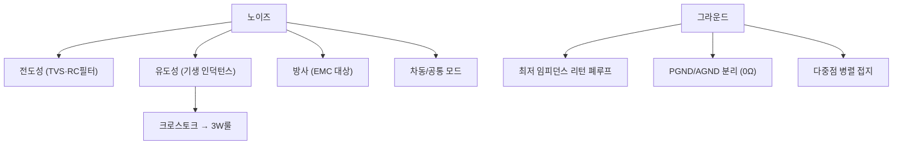

# 14주차 · PCB 노이즈·그라운드·파워 배선 설계

> 🔗 **강의 흐름** — 지난주 PCB 기초에 이어, 이번 주는 오동작을 막는 **노이즈·그라운드** 설계. 다음 주 모든 것을 펌웨어로 통합한다.

> **학습목표** — 노이즈 3종과 그라운드 이론·접지방식을 이해하고, 고전류 스위칭 구동보드 PCB의 파워/그라운드 배선을 개선한다.

> 💡 **기초 다지기 (쉽게 이해하기)** — **노이즈·그라운드란?** 원치 않는 전기 잡음이 오동작·고장을 일으킨다. 그라운드(0V 기준)를 잘 설계하면 잡음이 줄어든다. 핵심은 고전류·스위칭부와 예민한 신호부의 그라운드를 분리하는 것이다.

## 🗺️ 한눈에 보는 개념도

## 📡 노이즈 3종과 대책

| 종류 | 원인 | 대책 |
|---|---|---|
| 전도성 | 커넥터·통신선 유입 | TVS, RC 필터 |
| 유도성 | 기생 인덕턴스 자기장 | 루프면적↓, 배선 짧게 |
| 차동/공통모드 | 기준전위차(EMI 주원인) | 바이패스캡·트위스트, 그라운드 설계 |

**낮은 임피던스 그라운드** — `L ≈ μ0·(l/w)·(ln(2h/w)+0.5)` → 길이 짧게·폭 넓게. 접지 3방식: 직렬단일점 / 병렬단일점 / **다중점 병렬(PCB 사용)**.

> **AMR·로버 구동부 연결** — SMPS+모터 고전류가 그라운드 바운싱 유발 → PGND/AGND를 0Ω 저항 단일점으로 분리. 부품 배치(고전류/스위칭부 vs 예민 신호부)가 가장 중요.

## 🌐 접지 방식 3가지

> 직렬 단일점(간단·전체 영향) / 병렬 단일점(스타·배선↑) / **다중점 병렬(PCB 사용·루프↓)**.

## 🧠 핵심 이론 보강

!!! info "이미지로 설명하기"
    

    

    첫 화면에서는 첨부자료 이미지를 보여 주고, 바로 아래 도해로 원리를 단순화한다. 학생에게 “사진 속 실제 부품/단자”와 “도해 속 기능 블록”을 서로 연결하게 하면 추상 개념이 실습 대상으로 바뀐다.

### 1. 이번 주 이론을 어디에 쓰는가

- 노이즈는 전원 변동, 스위칭 dv/dt·di/dt, 접지 전위 차이, 측정 방법에서 발생한다.
- 전류는 반드시 돌아오는 길을 가지므로, 리턴 전류 경로를 설계하지 않으면 의도치 않은 신호선이 노이즈 경로가 된다.
- 오실로스코프 접지 리드와 프로브 설정도 측정 결과를 바꾸므로, 측정 자체를 설계해야 한다.

### 2. 강의 중 반드시 남길 판서

| 판서 항목 | 설명 | 실습 연결 |
|---|---|---|
| 핵심 관계식 | `노이즈 저감 원칙: 루프 면적↓, 임피던스↓, 기준면 연속성↑, 필터 위치 최적화` | 계산값을 먼저 예측하고 측정값으로 검증한다. |
| 입력 조건 | 전압, 전류, 주파수, RPM, 핀 상태 중 이번 주 주제에 해당하는 값을 정한다. | 조건이 빠지면 결과 비교가 불가능하다는 점을 강조한다. |
| 정상/비정상 판단 | 정상 범위와 즉시 정지해야 할 조건을 분리한다. | 최종 프로젝트의 안전 상태와 로그 항목으로 이어진다. |

### 3. 학생 눈높이 설명 순서

1. **현상 관찰**: 첨부 이미지에서 실제 부품, 커넥터, 파형, 코드 위치를 먼저 찾는다.
2. **모델 단순화**: 핵심 도해와 공식으로 “왜 그런 값이 나오는지”를 설명한다.
3. **설계 판단**: 부품값, 듀티, 샘플링 주기, 보호 기준처럼 학생이 직접 정해야 하는 값을 고른다.
4. **검증 증거**: 사진, 계산표, 오실로스코프 캡처, UART 로그 중 하나 이상으로 결과를 남긴다.

!!! warning "학생들이 자주 헷갈리는 지점"
    이번 주제는 암기보다 조건 확인이 중요하다. 회로·펌웨어·제어 문제는 같은 증상으로 보일 수 있으므로, 전원 조건 → 신호 조건 → 코드 조건 순서로 좁혀 가게 한다.

!!! tip "최신 기술 연결"
    고속 통신과 전동화 구동이 동시에 들어가는 모빌리티에서는 EMC, 접지, 실드, 필터 설계가 기능 안전과 신뢰성의 일부가 된다. SDV, Adaptive AUTOSAR, 엣지 AI MCU, 차량 사이버보안, ISO 26262 기능안전은 서로 다른 주제처럼 보이지만 모두 '측정 가능한 요구사항과 검증 가능한 로그'를 요구한다.

### 4. 실습 전환 포인트

스위칭 노드, 전류 루프, 아날로그 GND를 표시하고 프로브 접지 길이에 따른 링잉 차이를 비교한다. 이 활동은 확장 강의자료의 심화노트, 실습 코칭노트, 평가팩, 사례노트와 이어지며, 한 주차 안에서 “이론 설명 → 손으로 확인 → 평가 → 현장 사례”가 끊기지 않도록 구성한다.

## 🎞️ 통합 강의 슬라이드
> 통합 근거: PCB·펌웨어 통합 기술노트 14주차 + 노이즈/그라운드 도해.

!!! note "슬라이드 1 · 노이즈는 원치 않는 에너지 경로다"
    전도성, 유도성, 방사 노이즈를 구분하고 각각 어떤 경로로 MCU와 센서에 들어오는지 그린다.

!!! note "슬라이드 2 · 모든 전류는 돌아간다"
    신호 전류도 리턴 경로를 가진다. 리턴 경로가 길거나 끊기면 루프 면적이 커지고 유도성 노이즈가 증가한다.

!!! note "슬라이드 3 · 그라운드는 0V 선이 아니라 기준면이다"
    PGND, AGND, DGND를 분리하는 이유는 전류 크기와 민감도가 다르기 때문이다. 단일점 또는 면 연결 전략을 설계 의도로 설명한다.

!!! note "슬라이드 4 · 디커플링 위치는 PCB에서 중요하다"
    커패시터 값이 맞아도 IC 핀에서 멀면 고주파 전류가 긴 루프를 돈다. 전원핀과 리턴패스를 함께 본다.

!!! note "슬라이드 5 · 수정 전후 레이아웃을 증거로 남긴다"
    고전류 루프 축소, 션트 켈빈 배선, 0Ω 연결점, 45도 배선, 트레이스폭 변경을 캡처로 비교한다.

## 📦 용어 박스
!!! abstract "이번 주 꼭 설명할 용어"
    - **EMI/EMC**: 전자파 방출 문제와 전자파 환경에서 견디는 능력.
    - **리턴 전류**: 부하를 지나 다시 전원으로 돌아가는 전류 경로.
    - **그라운드 바운스**: 기생 임피던스 때문에 기준전위가 순간적으로 흔들리는 현상.
    - **PGND/AGND**: 전력 그라운드와 아날로그 그라운드.
    - **크로스토크**: 한 신호선 변화가 인접 신호선에 잡음으로 전달되는 현상.

!!! tip "최신 기술 연결"
    존 아키텍처와 고속 통신이 확대될수록 전원 분배, 접지 기준, EMC 설계가 소프트웨어 기능만큼 중요해진다.

## 📚 확장 강의자료

- [14주차 심화 강의노트](week14-deep-dive.md): 첨부자료 대표 이미지, 판서 흐름, 오개념 교정, 최신 기술 연결을 포함한 이론 확장 자료.
- [14주차 실습 코칭노트](week14-lab-coach.md): 팀 실습 절차, 코칭 질문, 평가 루브릭, 보강 과제를 포함한 수업 운영 자료.
- [14주차 평가·문제팩](week14-assessment-pack.md): 10분 퀴즈, 계산·해석 문제, 구두 발표 질문, 채점 루브릭.
- [14주차 현장 사례노트](week14-case-note.md): 실제 고장 시나리오, 진단 절차, 보고서 연결 문장.

!!! success "메인 자료와 확장 자료를 함께 쓰는 순서"
    1. 메인 페이지의 개념도와 핵심 이론 보강으로 `노이즈와 리턴 전류`의 큰 그림을 설명한다.
    2. 심화 강의노트에서 첨부자료 이미지를 확대해 판서와 계산을 진행한다.
    3. 실습 코칭노트로 팀별 측정·로그·사진 증거를 만들게 한다.
    4. 평가·문제팩과 사례노트로 이해 확인, 고장 진단, 최종 보고서 문장을 연결한다.
## ⏱️ 3시간 수업 운영안

| 시간 | 활동 | 학생 산출물 |
|---|---|---|
| 0:00-0:20 | 지난 주 PCB 초안의 노이즈 위험 위치 표시 | 위험 위치 마킹 |
| 0:20-1:10 | 전도성·유도성·방사 노이즈와 리턴 전류 경로 해설 | 노이즈-대책표 |
| 1:20-2:20 | PGND/AGND, 고전류 루프, 디커플링 위치 개선 실습 | 수정 전후 레이아웃 |
| 2:20-3:00 | 최종 발표 전 하드웨어 안전 점검표 작성 | 안전 점검표 |

## 📎 수업자료 활용

| 자료 | 수업 중 쓰는 장면 |
|---|---|
| [pcb-design-lecture-v0.1.pdf](attachments/pcb-design-lecture-v0.1.pdf) | PCB 노이즈, 접지, 배선 개선의 주교재 |
| figures/grounding.svg | 접지 방식 비교 설명 |
| figures/deadtime.svg | 스위칭 노이즈와 암단락 안전 연결 |

## ✅ 이해 확인 질문

1. 리턴 전류가 지나가는 경로를 PCB 그림 위에서 찾는다.
2. PGND와 AGND를 분리하되 어디서 연결해야 하는지 설명한다.
3. 루프 면적을 줄이면 유도성 노이즈가 줄어드는 이유를 말한다.

## 🧪 실습·과제

- [ ] 구동보드 PCB에서 PGND↔AGND 0Ω 연결점 찾기
- [ ] 트레이스 인덕턴스 식으로 폭 2배 시 L 변화 계산
- [ ] PCB 노이즈·그라운드 개선 보고서 제출

> **🤖 AX 연계** — 측정 데이터로 EMI를 예측하고, 데이터 기반으로 노이즈 원인을 진단한다.
