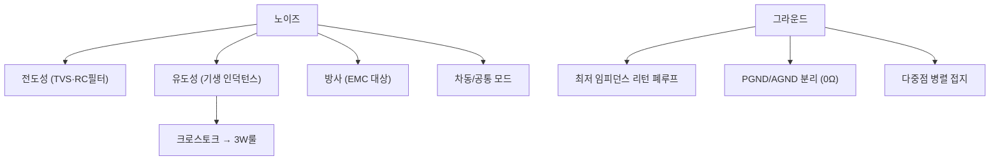

# 14주차 · PCB 노이즈·그라운드·파워 배선 설계

> **학습목표** — 노이즈 3종과 그라운드 이론·접지방식을 이해하고, 고전류 스위칭 구동보드 PCB의 파워/그라운드 배선을 개선한다.

> 💡 **기초 다지기 (쉽게 이해하기)** — **노이즈·그라운드란?** 원치 않는 전기 잡음이 오동작·고장을 일으킨다. 그라운드(0V 기준)를 잘 설계하면 잡음이 줄어든다. 핵심은 고전류·스위칭부와 예민한 신호부의 그라운드를 분리하는 것이다.

## 🗺️ 한눈에 보는 개념도

## 📡 노이즈 3종과 대책

| 종류 | 원인 | 대책 |
|---|---|---|
| 전도성 | 커넥터·통신선 유입 | TVS, RC 필터 |
| 유도성 | 기생 인덕턴스 자기장 | 루프면적↓, 배선 짧게 |
| 차동/공통모드 | 기준전위차(EMI 주원인) | 바이패스캡·트위스트, 그라운드 설계 |

**낮은 임피던스 그라운드** — `L ≈ μ0·(l/w)·(ln(2h/w)+0.5)` → 길이 짧게·폭 넓게. 접지 3방식: 직렬단일점 / 병렬단일점 / **다중점 병렬(PCB 사용)**.

> **AMR·로버 구동부 연결** — SMPS+모터 고전류가 그라운드 바운싱 유발 → PGND/AGND를 0Ω 저항 단일점으로 분리. 부품 배치(고전류/스위칭부 vs 예민 신호부)가 가장 중요.

## 🌐 접지 방식 3가지

> 직렬 단일점(간단·전체 영향) / 병렬 단일점(스타·배선↑) / **다중점 병렬(PCB 사용·루프↓)**.

## 용어·도해·트렌드 연결

| 항목 | 수업 중 연결 |
|---|---|
| 먼저 볼 용어 | [Zonal Architecture](glossary.md#zonal), [Cybersecurity](glossary.md#cybersecurity), [Functional Safety](glossary.md#functional-safety) |
| 도해 |  |
| 최신 기술 연결 | 존 구조에서 배선은 줄어도 고속 통신·전원 분배·접지 기준이 더 중요해진다. |

## ⏱️ 3시간 수업 운영안

| 시간 | 활동 | 학생 산출물 |
|---|---|---|
| 0:00-0:20 | 지난 주 PCB 초안의 노이즈 위험 위치 표시 | 위험 위치 마킹 |
| 0:20-1:10 | 전도성·유도성·방사 노이즈와 리턴 전류 경로 해설 | 노이즈-대책표 |
| 1:20-2:20 | PGND/AGND, 고전류 루프, 디커플링 위치 개선 실습 | 수정 전후 레이아웃 |
| 2:20-3:00 | 최종 발표 전 하드웨어 안전 점검표 작성 | 안전 점검표 |

## 📎 수업자료 활용

| 자료 | 수업 중 쓰는 장면 |
|---|---|
| [pcb-design-lecture-v0.1.pdf](attachments/pcb-design-lecture-v0.1.pdf) | PCB 노이즈, 접지, 배선 개선의 주교재 |
| figures/grounding.svg | 접지 방식 비교 설명 |
| figures/deadtime.svg | 스위칭 노이즈와 암단락 안전 연결 |

## ✅ 이해 확인 질문

1. 리턴 전류가 지나가는 경로를 PCB 그림 위에서 찾는다.
2. PGND와 AGND를 분리하되 어디서 연결해야 하는지 설명한다.
3. 루프 면적을 줄이면 유도성 노이즈가 줄어드는 이유를 말한다.

## 🧪 실습·과제

- [ ] 구동보드 PCB에서 PGND↔AGND 0Ω 연결점 찾기
- [ ] 트레이스 인덕턴스 식으로 폭 2배 시 L 변화 계산
- [ ] PCB 노이즈·그라운드 개선 보고서 제출

> **🤖 AX 연계** — 측정 데이터로 EMI를 예측하고, 데이터 기반으로 노이즈 원인을 진단한다.
