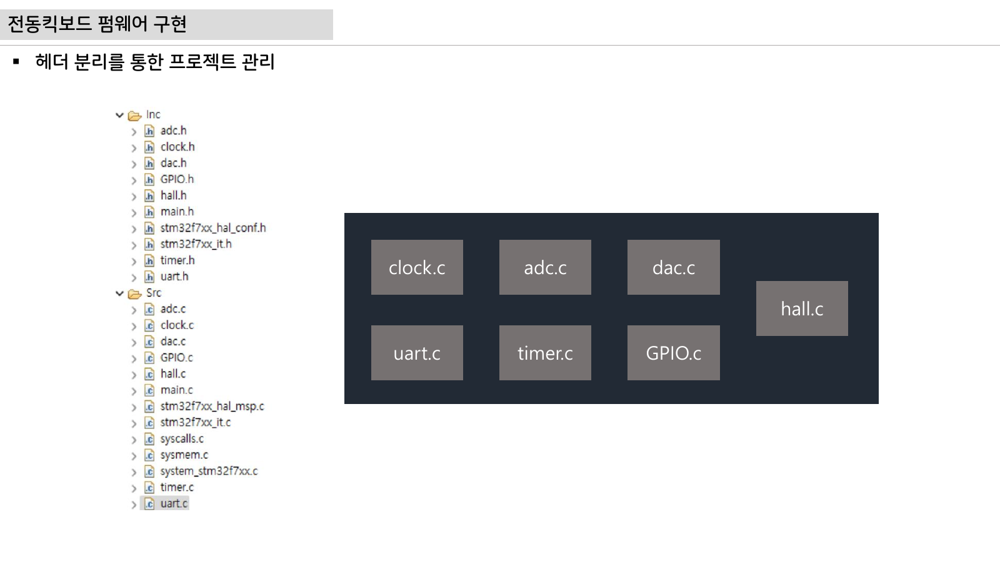

# 15주차 평가·문제팩 · 구동 펌웨어 통합 및 최종 프로젝트 발표

> 이 자료는 수업 후 이해 확인, 팀별 발표 피드백, 과제 채점에 바로 쓰는 문제 은행이다. 단순 암기보다 계산, 판단, 설명, 증거 제출을 평가한다.

## 평가 기준 이미지

## 핵심 평가 초점

- 평가 주제: 통합 펌웨어와 최종 검증
- 학생은 그림에서 입력, 처리, 출력, 위험요소를 표시해야 한다.
- 답안에는 수치, 단위, 캡처, 로그, 회로 표시 중 최소 하나가 포함되어야 한다.

## 10분 퀴즈

1. 오늘 주제를 최종 AMR ECU 블록도에서 어디에 배치할 수 있는가?
2. 이 주제에서 가장 위험한 오배선, 오설정, 오해는 무엇인가?
3. 측정값이 예상과 다를 때 가장 먼저 확인할 기준값은 무엇인가?
4. 오늘 배운 내용을 SDV, 진단, 안전, OTA 중 하나와 연결해 한 문장으로 설명하라.

## 계산·해석 문제

### 문제 1 · 출력값 예측
대표 회로 또는 코드의 입력값을 정하고 출력값을 예측한다. 답안에는 식, 대입값, 단위, 결론이 들어가야 한다.

### 문제 2 · 신호 흐름 표시
첨부 이미지 위에 신호 흐름을 표시한다. 전원선, 신호선, 리턴 경로를 구분해야 한다.

### 문제 3 · 실패 원인 제시
실습 결과가 실패한 상황을 가정하고 원인을 3개 제시한다. 하드웨어, 펌웨어, 측정장비로 나누어 쓴다.

### 문제 4 · 보호 기능 제안
실제 차량 ECU라면 추가해야 할 보호 기능을 제안한다. 감지 조건, 안전 상태, 로그 항목을 포함한다.

## 구두 발표 질문

- 이 값은 어디서 측정했는가?
- 기준전압, 클럭, 전류제한은 얼마인가?
- 같은 실험을 다른 팀이 재현하려면 무엇을 알려줘야 하는가?
- 실패했을 때 안전하게 멈추는 조건은 무엇인가?

## 채점 루브릭

### 5점
시스템 위치, 수치 근거, 실험 증거, 안전 고려가 모두 명확하다.

### 4점
핵심 원리는 맞고 증거도 있으나 최악 조건 설명이 약하다.

### 3점
동작 결과는 있으나 계산 또는 재현 절차가 부족하다.

### 2점
용어 설명은 있으나 실제 회로, 코드, 로그와 연결되지 않는다.

### 1점
결과만 제출하고 근거가 없다.

## 보충 문제

1. 오늘 주제에서 학생들이 가장 자주 틀릴 단위를 하나 고르고 이유를 설명하라.
2. 첨부 PDF 그림을 기준으로 추가 측정 포인트 2개를 제안하라.
3. 팀 프로젝트 보고서에 넣을 한 문장 결론을 작성하라.
