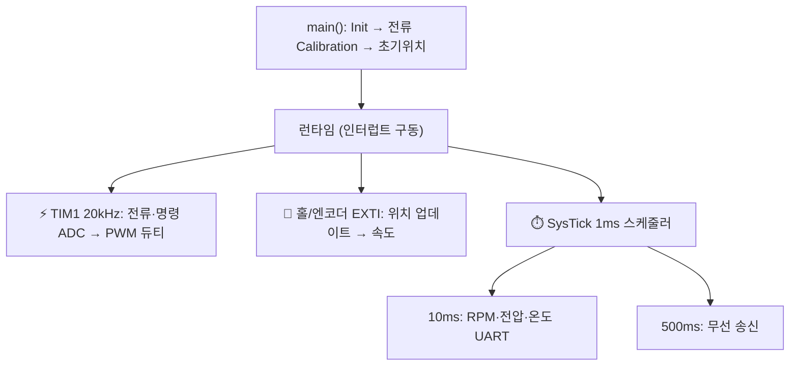

# 15주차 · 구동 펌웨어 통합 및 최종 프로젝트 발표

> 🔗 **강의 흐름** — 1~14주차의 부품·모터·펌웨어·설계를 이번 주 **하나의 펌웨어로 통합**해 AMR을 실제로 주행시킨다. 최종 프로젝트로 마무리.

> **학습목표** — STM32 모터 구동 펌웨어의 전체 구조(정류·Center PWM·스케줄러·센싱·통신·속도계산)를 분석하고 AMR 주행으로 통합 시연한다.

> 💡 **기초 다지기 (쉽게 이해하기)** — **펌웨어 통합이란?** 앞의 모든 내용을 코드로 묶어 실제로 로봇을 움직이는 단계다. 인터럽트로 20kHz마다 전류를 읽어 PWM을 조정하고, 홀/엔코더로 속도를 계산하며, 무선으로 상태를 보내고, 고장을 감지해 멈추는 안전장치까지 포함한다.


## 🗺️ 한눈에 보는 개념도 — 펌웨어 런타임



## 🧩 핵심 코드·수치 (실제 코드 검증)

| 항목 | 설정 |
|---|---|
| Center Align PWM | `CNT_MAX=5400, 216MHz/5400/2 = 20kHz`, 데드타임 180 |
| 명령→듀티 | `DutyA = CNT_MAX − VoltageRef` (반전) |
| SysTick | `LOAD = 216M/1000 − 1 = 215999` → 1ms |
| NTC 온도 | 3차 다항식 `−11.48x³+63.23x²−149.02x+181.97` |
| T방식 RPM | `(60·54000000)/(Edges_per_Rev · delta_time)` |
| 무선(AT-09 BLE) | UART3, 9600bps, 500ms 송신 |

**고장 코드 FltFlg** — 0 정상 / 1 과전류 / 2 과열(>100°C) / 3 저전압 / 4 과전압

PI 속도제어 초기값 `Kp = J·ωc²/KT`, `Ki = J·ωc²/(5·KT)`. Teleplot(`>변수:값`)으로 실시간 그래프.

## 🏁 최종 프로젝트 산출물

요구사항명세서 · HSI · 시스템블록도 · 회로도/부품선정 · PCB 배치 검토 · 펌웨어 구조도 · **AMR 2륜 구동코드 분석/주행 시연** · 안전검토 보고서


## 용어·도해·트렌드 연결

| 항목 | 수업 중 연결 |
|---|---|
| 먼저 볼 용어 | [OTA/FOTA](glossary.md#ota), [Edge AI/TinyML](glossary.md#edge-ai), [Functional Safety](glossary.md#functional-safety) |
| 도해 |  |
| 최신 기술 연결 | 최종 통합은 [보안·소프트웨어 업데이트 규제](trends.md#security-software-update), 예지보전, 안전 상태 전이를 함께 설명하는 발표로 마무리한다. |

## 📚 확장 강의자료

- [15주차 심화 강의노트](week15-deep-dive.md): 첨부자료 대표 이미지, 판서 흐름, 오개념 교정, 최신 기술 연결을 포함한 이론 확장 자료.
- [15주차 실습 코칭노트](week15-lab-coach.md): 팀 실습 절차, 코칭 질문, 평가 루브릭, 보강 과제를 포함한 수업 운영 자료.
- [15주차 평가·문제팩](week15-assessment-pack.md): 10분 퀴즈, 계산·해석 문제, 구두 발표 질문, 채점 루브릭.
- [15주차 현장 사례노트](week15-case-note.md): 실제 고장 시나리오, 진단 절차, 보고서 연결 문장.

## ⏱️ 3시간 수업 운영안

| 시간 | 활동 | 학생 산출물 |
|---|---|---|
| 0:00-0:25 | 최종 시연 안전 브리핑과 제출물 확인 | 체크리스트 서명 |
| 0:25-1:10 | 펌웨어 통합 구조: PWM, 센싱, 홀/엔코더, SysTick, 통신, Fault | 구조도 최종본 |
| 1:20-2:25 | 팀별 주행/벤치 시연과 Teleplot 로그 확인 | 시연 영상과 로그 |
| 2:25-3:00 | 최종 발표, 회고, 개선 로드맵 정리 | 발표자료와 개선안 |

## 📎 수업자료 활용

| 자료 | 수업 중 쓰는 장면 |
|---|---|
| [electric-scooter-firmware-v0.2.pdf](attachments/electric-scooter-firmware-v0.2.pdf) | 통합 펌웨어 구조와 핵심 수치의 주교재 |
| [speed-control-teleplot.pdf](attachments/speed-control-teleplot.pdf) | 속도제어 로그와 그래프 시연 |
| [stm32-lecture-v0.2.pdf](attachments/stm32-lecture-v0.2.pdf) | STM32 초기화와 주변장치 코드 복습 |

## ✅ 이해 확인 질문

1. 20kHz PWM 인터럽트, 1ms SysTick, 500ms 통신 태스크가 각각 맡는 일을 구분한다.
2. Fault code가 발생했을 때 펌웨어가 어떤 순서로 멈춰야 하는지 설명한다.
3. 최종 프로젝트의 실패 원인을 하드웨어, 펌웨어, 제어 파라미터로 나누어 진단한다.

## 💻 실습 코드 (주석 포함) — `code/week15_scheduler.c`

인터럽트(빠른 제어)와 스케줄러(느린 작업)로 전체 펌웨어를 통합하는 골격. 페일세이프 포함. [⬇ 전체 코드](code/week15_scheduler.c)

```c
/*
 * [15주차] 펌웨어 통합 골격 — SysTick 스케줄러 + 인터럽트 구조
 * ----------------------------------------------------------
 * 여러 주기의 작업을 하나의 프로그램으로 묶는다. 정밀 제어는 인터럽트에서,
 * 느린 작업(모니터링 등)은 스케줄러 플래그로 main 루프에서 처리한다.
 *   - TIM1 20kHz 인터럽트 : 전류/센서 ADC 읽고 PWM 듀티 갱신(가장 빠른 제어)
 *   - 홀/엔코더 EXTI       : 위치 변화 → 속도 계산
 *   - SysTick 1ms          : 10ms/100ms/1s 주기 태스크 플래그 세팅
 */
#include <stdint.h>

volatile uint32_t g_ms;                 /* 1ms마다 증가하는 시스템 시간 */
volatile uint8_t f_10ms, f_100ms, f_1s; /* 주기 태스크 실행 요청 플래그 */

/* SysTick 인터럽트: 1ms마다 자동 호출 */
void SysTick_Handler(void)
{
    g_ms++;
    if (g_ms % 10  == 0) f_10ms  = 1;   /* 나머지 연산으로 주기 판별 */
    if (g_ms % 100 == 0) f_100ms = 1;
    if (g_ms % 1000== 0) f_1s    = 1;
}

extern void read_speed_and_control(void); /* PI 제어 등(빠른 주기는 TIM 인터럽트) */
extern void send_telemetry(void);         /* 속도/전압/온도/고장코드 무선 송신 */
extern uint8_t fault_check(void);         /* 과전류·과열 감지 → 고장코드 반환 */

int main(void)
{
    /* init: 클럭, GPIO, ADC, TIM(PWM+20kHz), EXTI(홀), UART, SysTick ... */
    while (1) {
        if (f_10ms)  { f_10ms  = 0; read_speed_and_control(); }
        if (f_100ms) { f_100ms = 0; if (fault_check()) { /* 안전정지 */ } }
        if (f_1s)    { f_1s    = 0; send_telemetry(); }
        /* 페일세이프: AI/고급제어가 실패해도 여기 고전 제어·하드리밋이 항상 동작 */
    }
}
```

## 🧪 실습·과제

- [ ] 정류 → 20kHz PWM 전류센싱 → T방식 RPM → PI 튜닝 → 무선 모니터링 → 고장코드 재현
- [ ] AMR 2륜 차동구동 주행 시연 및 발표, 펌웨어 구조도·개선사항 보고서 제출

> **🤖 AX 연계** — 엣지 AI(TinyML)로 모터 전류·진동 데이터에서 고장을 진단하고 예지보전을 구현한다. 데이터로그→이상탐지 모델을 펌웨어에 통합하고, 실패 시 고전 제어로 폴백하는 페일세이프를 둔다.
