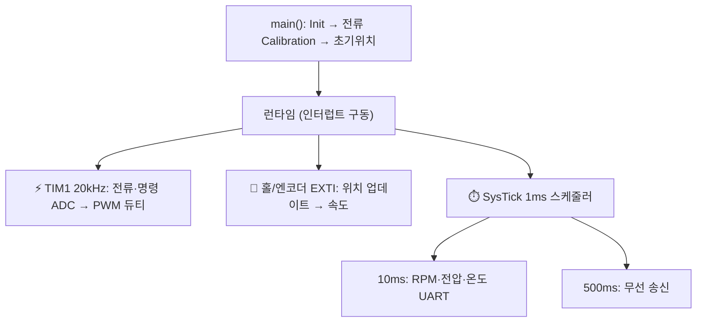
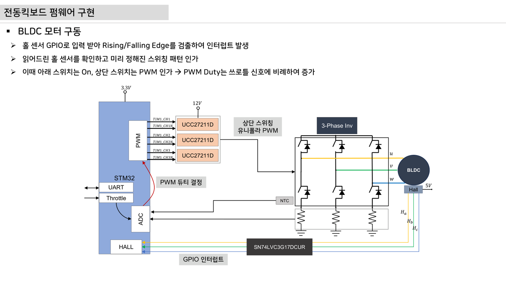
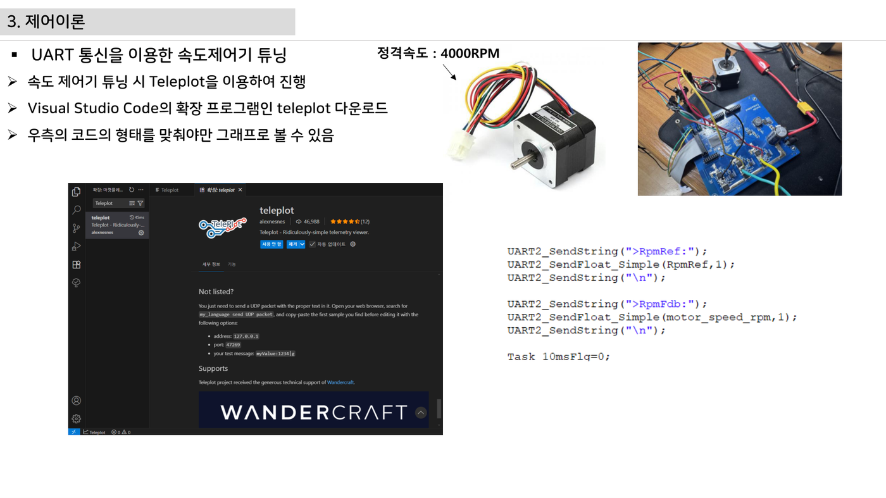
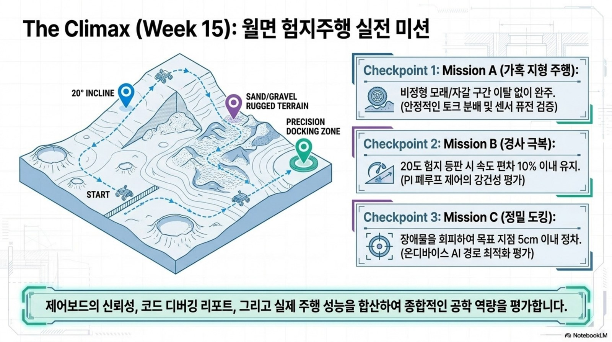
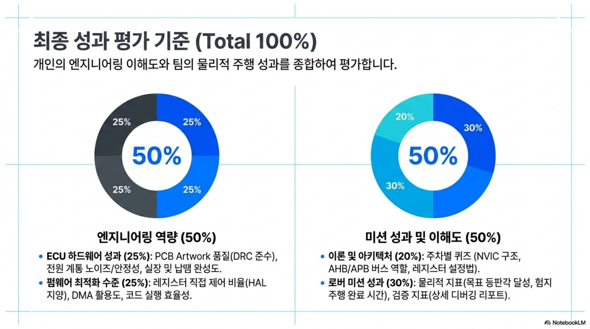
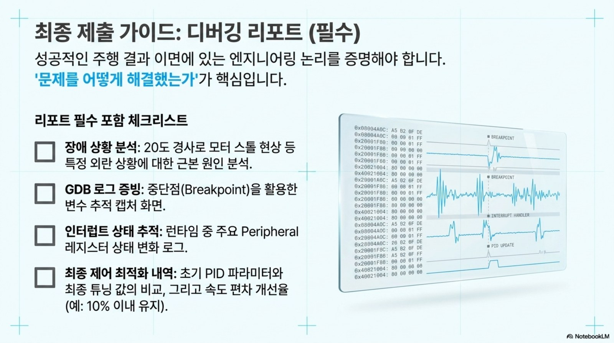

# 15주차 · 구동 펌웨어 통합 및 최종 프로젝트 발표

> 🔗 **강의 흐름** — 1~14주차의 부품·모터·펌웨어·설계를 이번 주 **하나의 펌웨어로 통합**해 로버를 실제로 주행시킨다. 최종 프로젝트로 마무리.

> **학습목표** — STM32 모터 구동 펌웨어의 전체 구조(정류·Center PWM·스케줄러·센싱·통신·속도계산)를 분석하고 로버 주행으로 통합 시연한다.

> 💡 **기초 다지기 (쉽게 이해하기)** — **펌웨어 통합이란?** 앞의 모든 내용을 코드로 묶어 실제로 로봇을 움직이는 단계다. 인터럽트로 20kHz마다 전류를 읽어 PWM을 조정하고, 홀/엔코더로 속도를 계산하며, 무선으로 상태를 보내고, 고장을 감지해 멈추는 안전장치까지 포함한다.

!!! warning "저작권 유의 — 원본 자료 사용 범위 확인"
    이 주차의 **원본 첨부 PDF 링크·슬라이드 미리보기 이미지**(chcbaram 원본 자료)는 수업 활용 범위와 외부 배포 가능 여부를 확인해 사용한다. 공개 배포 전에는 인용 허가, 출처 표기, 자작 대체 자료 여부를 점검한다.


## 🗺️ 한눈에 보는 개념도 — 펌웨어 런타임



## 🧩 핵심 코드·수치 (실제 코드 검증)

| 항목 | 설정 |
|---|---|
| Center Align PWM | `CNT_MAX=5400, 216MHz/5400/2 = 20kHz`, 데드타임 180 |
| 명령→듀티 | `DutyA = CNT_MAX − VoltageRef` (반전) |
| SysTick | `LOAD = 216M/1000 − 1 = 215999` → 1ms |
| NTC 온도 | 3차 다항식 `−11.48x³+63.23x²−149.02x+181.97` |
| T방식 RPM | `(60·54000000)/(Edges_per_Rev · delta_time)` |
| 무선(AT-09 BLE) | UART3, 9600bps, 500ms 송신 |

**고장 코드 FltFlg** — 0 정상 / 1 과전류 / 2 과열(>100°C) / 3 저전압 / 4 과전압

PI 속도제어 초기값 `Kp = J·ωc²/KT`, `Ki = J·ωc²/(5·KT)`. Teleplot(`>변수:값`)으로 실시간 그래프.

## 🏁 최종 프로젝트 산출물

요구사항명세서 · HSI · 시스템블록도 · 회로도/부품 선정 · PCB 배치 검토 · 펌웨어 구조도 · **로버 구동코드 분석/주행 시연** · 안전검토 보고서

!!! note "🔗 여기서부터 확장 자료 — 흐름 이어보기"
    아래는 위 핵심 개념(개념도·공식·그림)을 더 깊이 파는 **심화·실습·평가·사례** 자료다. 처음 보는 학생은 페이지 맨 위 「💡 기초 다지기」로 큰 그림을 먼저 잡고, 심화 → 실습 → 평가 → 사례 순으로 읽으면 이번 주 흐름이 자연스럽게 이어진다.


## 🧠 핵심 이론 보강

!!! info "이미지로 설명하기"
    

    

    첫 화면에서는 첨부자료 이미지를 보여 주고, 바로 아래 도해로 원리를 단순화한다. 학생에게 “사진 속 실제 부품/단자”와 “도해 속 기능 블록”을 서로 연결하게 하면 추상 개념이 실습 대상으로 바뀐다.

### 1. 이번 주 이론을 어디에 쓰는가

- 최종 펌웨어는 GPIO, Timer, ADC, UART, 인터럽트, 제어 루프가 같은 시간 기준 안에서 충돌 없이 동작해야 한다.
- 상태기계는 초기화, 대기, 구동, 오류, 정지 상태를 명확히 나누어 예측 가능한 안전 동작을 만든다.
- 최종 발표는 성공 주행 영상보다 요구사항, HSI, 회로 근거, 로그 분석, 실패 대응을 함께 보여줄 때 설계 발표가 된다.

### 2. 강의 중 반드시 남길 판서

| 판서 항목 | 설명 | 실습 연결 |
|---|---|---|
| 핵심 관계식 | `최종 검증 = 요구사항별 시험조건 + 측정 로그 + 합격기준 + 재현 절차` | 계산값을 먼저 예측하고 측정값으로 검증한다. |
| 입력 조건 | 전압, 전류, 주파수, RPM, 핀 상태 중 이번 주 주제에 해당하는 값을 정한다. | 조건이 빠지면 결과 비교가 불가능하다는 점을 강조한다. |
| 정상/비정상 판단 | 정상 범위와 즉시 정지해야 할 조건을 분리한다. | 최종 프로젝트의 안전 상태와 로그 항목으로 이어진다. |

### 3. 학생 눈높이 설명 순서

1. **현상 관찰**: 첨부 이미지에서 실제 부품, 커넥터, 파형, 코드 위치를 먼저 찾는다.
2. **모델 단순화**: 핵심 도해와 공식으로 “왜 그런 값이 나오는지”를 설명한다.
3. **설계 판단**: 부품값, 듀티, 샘플링 주기, 보호 기준처럼 학생이 직접 정해야 하는 값을 고른다.
4. **검증 증거**: 사진, 계산표, 오실로스코프 캡처, UART 로그 중 하나 이상으로 결과를 남긴다.

!!! warning "학생들이 자주 헷갈리는 지점"
    이번 주제는 암기보다 조건 확인이 중요하다. 회로·펌웨어·제어 문제는 같은 증상으로 보일 수 있으므로, 전원 조건 → 신호 조건 → 코드 조건 순서로 좁혀 가게 한다.

!!! tip "최신 기술 연결"
    최신 ECU 개발은 기능 시연보다 로그, 요구사항 추적, 안전 상태, OTA 가능성, 사이버보안까지 포함한 “검증 가능한 소프트웨어”를 요구한다. SDV, Adaptive AUTOSAR, 엣지 AI MCU, 차량 사이버보안, ISO 26262 기능안전은 서로 다른 주제처럼 보이지만 모두 '측정 가능한 요구사항과 검증 가능한 로그'를 요구한다.

### 4. 실습 전환 포인트

팀별로 정상 주행, 저전압, 통신 끊김, 엔코더 이상 중 하나의 실패 시나리오를 재현하고 안전 정지 로그를 제시한다. 이 활동은 확장 강의자료의 심화노트, 실습 코칭노트, 평가팩, 사례노트와 이어지며, 한 주차 안에서 “이론 설명 → 손으로 확인 → 평가 → 현장 사례”가 끊기지 않도록 구성한다.

## 🖼️ 슬라이드 이미지

!!! quote "슬라이드 이미지 1 · 첨부자료 대표 이미지"
    

    최종 펌웨어에서 PWM, Hall, ADC, UART가 하나의 구동 루프로 묶이는 구조를 표시한다.

!!! quote "슬라이드 이미지 2 · 핵심 도해"
    

    Teleplot 로그 화면으로 최종 주행 시연의 RPM·명령·오류 상태를 발표 증거로 남기는 방법을 보여 준다.

!!! quote "슬라이드 이미지 3 · 실습 보조 도해"
    

    엣지 AI 기반 이상탐지가 센서 로그와 결합해 예지보전·고장 분류로 확장되는 흐름을 소개한다.

!!! quote "슬라이드 이미지 4 · 평가·사례 도해"
    

    최종 발표에서 요구사항, 구현 결과, 검증 증거가 서로 맞물려야 함을 V-모델로 재확인한다.

## 🚀 AX·우주로버 적용 슬라이드

!!! info "NotebookLM 기반 시각자료 활용"
    아래 이미지는 새로 첨부된 우주 로버·AX·Physical AI 자료에서 강의 주제와 직접 연결되는 페이지를 선별한 것이다. 교수자는 기존 개념도 다음에 이 이미지를 보여 주고, 학생에게 실제 로버 ECU에서 같은 개념이 어디에 쓰이는지 말하게 한다.

!!! quote "적용 이미지 1 · 최종 미션 시나리오"
    

    험지, 경사, 장애물 시나리오를 최종 시연 요구사항으로 읽고, 통합 펌웨어의 상태 전이를 발표 흐름에 맞춘다.

    출처: `Physical_AI_Space_Rover_ECU_Engineering.pdf p.11`

!!! quote "적용 이미지 2 · 검증 루브릭"
    

    주행 성공만이 아니라 MCU 제어 이해도와 미션 성취도를 50:50으로 평가한다는 기준을 명확히 보여 준다.

    출처: `Space_Rover_Final_Validation.pdf p.7`

!!! quote "적용 이미지 3 · 최종 보고서"
    

    로그, 파형, 코드, 실패 분석을 최종 포트폴리오에 어떤 형식으로 남겨야 하는지 제출 가이드로 연결한다.

    출처: `Space_Rover_Final_Validation.pdf p.8`

## 🎞️ 통합 강의 슬라이드
> 통합 근거: PCB·펌웨어 통합 기술노트 15주차 + electric-scooter-firmware + speed-control-teleplot 자료.

!!! note "슬라이드 1 · 모든 블록을 시간축으로 통합한다"
    main() 초기화, TIM1 20kHz 인터럽트, 홀 EXTI, SysTick 1ms, UART/BLE 송신이 동시에 동작한다. 구조도를 시간 우선순위로 다시 그린다.

!!! note "슬라이드 2 · 6-step 정류와 PWM이 코드로 연결된다"
    HallSum으로 섹터를 판단하고 Set_Phases로 상단 PWM, 하단 스위치 ON, 상 OFF 상태를 만든다. 전기각 표가 실제 함수 호출로 바뀐다.

!!! note "슬라이드 3 · 센싱은 보정 후 제어에 들어간다"
    전류 오프셋 평균, Vdc/NTC 변환, 쓰로틀 히스테리시스, RPM T방식 계산을 거쳐 의미 있는 제어 변수로 만든다.

!!! note "슬라이드 4 · Fault는 발표의 핵심 시나리오다"
    과전류, 과열, 저전압, 과전압 플래그가 생기면 PWM을 끄고 로그를 남겨야 한다. 안전하게 멈추는 것도 성공한 제어의 일부다.

!!! note "슬라이드 5 · 최종 발표는 증거 중심으로 구성한다"
    요구사항, HSI, 회로/PCB, 코드 구조, Teleplot 로그, 주행 영상, 실패 원인 분석을 한 흐름으로 발표한다.

## 📦 용어 박스
!!! abstract "이번 주 꼭 설명할 용어"
    - **6-step 펌웨어**: 홀 상태에 따라 두 상을 선택해 PWM을 출력하는 BLDC 구동 코드.
    - **Center-aligned PWM**: 카운터가 up/down하며 중앙 정렬 펄스를 만들어 전류센싱과 EMI에 유리한 PWM.
    - **SysTick**: 1ms 같은 시스템 기준 시간을 만드는 Cortex-M 타이머.
    - **Fault Flag**: 과전류/과열/저전압 등 보호 상태를 나타내는 코드.
    - **FOTA/OTA**: 펌웨어 또는 소프트웨어를 무선으로 업데이트하는 기술.

!!! tip "최신 기술 연결"
    최종 통합 로그는 Edge AI 예지보전, OTA 업데이트 검증, 기능안전 상태전이 설계로 확장할 수 있다.

## 📚 통합 확장 강의자료

!!! info "확장 자료 통합 안내"
    기존의 15주차 심화·실습·평가·사례 확장 페이지를 이 주차 메인 자료 안으로 합쳤다. 교수자는 이 섹션을 필요한 만큼 접어 읽히거나, 수업 후 과제·보충자료로 배정하면 된다.

### 심화 강의노트

> 15주차 심화노트는 `통합 펌웨어와 최종 검증`를 3시간 강의에서 설명하기 위한 교수자용 자료다.

###### 수업에서 바로 보여줄 이미지


###### 강의 핵심 초점

- 구동 펌웨어 통합 및 최종 프로젝트 발표의 중심 질문은 "통합 펌웨어와 최종 검증이 최종 로버 ECU에서 어떤 문제를 해결하는가"이다.
- 연결할 첨부자료는 `electric-scooter-firmware-v0.2.pdf / speed-control-teleplot.pdf`이며, 학생은 그림 위에 입력·처리·출력·위험요소를 직접 표시한다.
- 이번 주 설명은 1~14주차 산출물을 최종 시연, 포트폴리오, 개선 계획으로 묶어 설계 판단의 근거를 남기는 데 초점을 둔다.

###### 교수자 설명 스크립트

1. 통합은 코드를 합치는 일이 아니라 20kHz PWM, 1ms 스케줄러, 통신 주기를 충돌 없이 맞추는 일이다.
2. Fault 상태는 실패를 숨기는 코드가 아니라 안전 상태로 전이하기 위한 명시적 경로다.
3. 최종 발표는 주행 성공 영상보다 요구사항별 증거와 개선 로드맵을 보여줘야 한다.

###### 판서 흐름

##### 도입 판서
초기화, ADC 보정, PWM 시작, 속도 계산, UART 송신을 시간축으로 배열한다.

##### 원리 판서
과전류, 과열, 저전압, 과전압 Fault가 들어왔을 때 PWM 차단 순서를 상태도로 그린다.

##### 검증 판서
Teleplot 로그와 발표 슬라이드의 수치가 같은 실험에서 나온 것인지 확인한다.

###### 이론 보강 슬라이드 세트

!!! note "슬라이드 A · 실제 자료에서 출발"
    `electric-scooter-firmware-v0.2.pdf / speed-control-teleplot.pdf`의 대표 이미지를 먼저 띄우고, 학생이 부품명보다 기능을 말하게 한다. “이 부분은 입력인가, 처리인가, 출력인가, 보호인가”를 묻는다.

!!! note "슬라이드 B · 핵심 원리 압축"
    - 최종 펌웨어는 GPIO, Timer, ADC, UART, 인터럽트, 제어 루프가 같은 시간 기준 안에서 충돌 없이 동작해야 한다.
    - 상태기계는 초기화, 대기, 구동, 오류, 정지 상태를 명확히 나누어 예측 가능한 안전 동작을 만든다.
    - 최종 발표는 성공 주행 영상보다 요구사항, HSI, 회로 근거, 로그 분석, 실패 대응을 함께 보여줄 때 설계 발표가 된다.

!!! note "슬라이드 C · 공식은 조건과 함께"
    `최종 검증 = 요구사항별 시험조건 + 측정 로그 + 합격기준 + 재현 절차`를 판서하되, 공식 자체보다 어떤 조건에서 쓸 수 있는지 먼저 확인한다. 조건을 빼고 숫자만 넣는 풀이를 피하게 한다.

!!! note "슬라이드 D · 최종 프로젝트 연결"
    이번 주 산출물은 최종 로버 ECU의 요구사항, HSI, 회로도, 펌웨어 로그 중 하나로 반드시 재사용된다. 학생에게 “15주차 발표에서 이 결과가 어디에 들어가는가”를 한 줄로 쓰게 한다.

##### 교수자 보충 설명

- 3학년 수준에서는 수식을 과도하게 깊게 밀기보다, 수식의 입력값을 실제 회로·코드·로그에서 찾는 능력을 우선한다.
- 설명은 `현상 → 모델 → 설계값 → 검증` 순서로 반복한다. 이 순서를 고정하면 모터, 전원, 펌웨어, PCB 주제가 서로 다른 과목처럼 흩어지지 않는다.
- 오류가 나면 정답을 바로 주기보다 전원, 기준전위, 신호 방향, 시간 기준, 보호 조건 중 어느 축의 문제인지 분류하게 한다.

###### 3시간 수업 확장안

##### 0:00-0:20 · 이전 산출물 연결
구동 펌웨어 통합 및 최종 프로젝트 발표 수업은 지난 주 결과 중 오늘의 `통합 펌웨어와 최종 검증`와 직접 연결되는 오류 하나를 골라 시작한다.

##### 0:20-0:55 · 첨부자료 해설
`electric-scooter-firmware-v0.2.pdf / speed-control-teleplot.pdf`의 대표 이미지를 띄우고, 학생에게 어느 선이 전원·센서·제어·진단 신호인지 표시하게 한다.

##### 1:05-1:40 · 핵심 계산과 판단
런타임 태스크를 빠른 제어, 느린 통신, 진단으로 분류하게 한다.

##### 1:40-2:25 · 팀별 적용
최종 펌웨어에서 20kHz ISR과 1ms 태스크가 하는 일을 코드 주석으로 표시한다. 이어서 Fault를 안전하게 모사하고 모터 출력 차단과 로그 송신을 확인한다.

##### 2:25-3:00 · 결과 공유
최종 보고서에 들어갈 요구사항별 검증표를 완성하게 한다.

###### 오개념 교정

##### 첫 번째 오개념
주행 영상이 있으면 통합이 끝났다는 오해를 반복성, 로그, 안전정지로 교정한다.

##### 두 번째 오개념
Fault는 예외상황이라 나중에 해도 된다는 생각을 전력부 보호와 연결해 바로잡는다.

##### 세 번째 오개념
AI 예지보전이 제어기를 대체한다는 말을 로그 분석 보조 역할로 제한한다.

###### 최신 기술 연결

- 구동 펌웨어 통합 및 최종 프로젝트 발표에서 남긴 로그와 계산값은 SDV 관점에서 ECU 진단 데이터의 출발점이 된다.
- `통합 펌웨어와 최종 검증`를 안전 요구사항으로 바꾸면 정상 동작뿐 아니라 고장 시 안전 상태도 함께 정의해야 한다.
- AI 도구는 설명과 가설 생성을 돕지만, 최종 판단은 학생이 만든 측정값과 회로 근거로 검증한다.

###### 마무리 질문

1. 통합 펌웨어와 최종 검증을 설명할 때 가장 먼저 확인할 입력 조건은 무엇인가?
2. 구동 펌웨어 통합 및 최종 프로젝트 발표 실습 결과를 어떤 로그나 측정값으로 증명할 수 있는가?
3. 실제 차량 ECU에 적용한다면 어떤 진단 코드나 보호 동작을 추가해야 하는가?

### 실습 코칭노트

!!! tip "📌 실전 팁·주의점 (현장에서 자주 하는 실수)"
    통합은 **한 기능씩 검증**(빅뱅 통합 금지). **페일세이프(고장→즉시 정지)**를 가장 먼저 구현한다.


> 15주차 실습은 `통합 펌웨어와 최종 검증`를 학생 손으로 확인하게 만드는 운영 자료다.

###### 실습에서 바로 띄울 이미지


###### 오늘의 실습 미션

- 미션 1: 최종 펌웨어에서 20kHz ISR과 1ms 태스크가 하는 일을 코드 주석으로 표시한다.
- 미션 2: Fault를 안전하게 모사하고 모터 출력 차단과 로그 송신을 확인한다.
- 미션 3: 팀별 시연 후 요구사항 검증표에 성공, 부분성공, 실패와 근거를 기록한다.
- 사용할 자료: `electric-scooter-firmware-v0.2.pdf / speed-control-teleplot.pdf`
- 제출 증거: 계산식, 캡처, 사진, 로그 중 `통합 펌웨어와 최종 검증`를 입증하는 자료 하나 이상.

###### 실습 전 확인

##### 장비와 배선
구동 펌웨어 통합 및 최종 프로젝트 발표 실습 전에는 전원, 커넥터 방향, 공통 그라운드, 시리얼 포트를 오늘 주제에 맞춰 확인한다.

##### 예측값 작성
보드에 손대기 전에 `통합 펌웨어와 최종 검증`와 관련된 예상 전압, 전류, 주파수, RPM, 또는 로그 형식을 먼저 쓴다.

##### 안전 조건
실패했을 때 어떤 출력을 즉시 끄고 어떤 로그를 남길지 팀별로 한 줄씩 합의한다.

###### 코칭 질문

1. 통합 펌웨어와 최종 검증에서 지금 조작하는 값은 입력인가, 처리 결과인가, 보호 조건인가?
2. 최종 펌웨어에서 20kHz ISR과 1ms 태스크가 하는 일을 코드 주석으로 표시한다. 결과가 예상과 다르면 어떤 측정점부터 확인할 것인가?
3. Fault를 안전하게 모사하고 모터 출력 차단과 로그 송신을 확인한다. 과정에서 하드웨어 원인과 펌웨어 원인을 어떻게 분리할 것인가?
4. 팀별 시연 후 요구사항 검증표에 성공, 부분성공, 실패와 근거를 기록한다. 결과를 최종 포트폴리오와 다음 프로젝트 개선안에 어떻게 반영할 것인가?

###### 강의자료-실습 통합 절차

##### 수업 전 5분 준비

- 메인 페이지의 핵심 도해와 `figures/attachment-previews/scooter-firmware-system-block-p05.png` 이미지를 같은 화면에 열어 둔다.
- 팀별로 오늘 확인할 입력 조건, 예상값, 위험 조건을 한 줄씩 적게 한다.
- 측정 장비가 없거나 시간이 부족한 팀은 첨부자료 이미지 위에 신호 흐름을 표시하는 대체 활동을 수행한다.

##### 실습 중 코칭 기준

| 관찰 상황 | 교수자 질문 | 기대되는 학생 반응 |
|---|---|---|
| 값은 나왔지만 근거가 없음 | 어떤 조건에서 측정했는가? | 전압, 주파수, 부하, 코드 버전을 함께 기록한다. |
| 회로 문제와 코드 문제가 섞임 | 하드웨어만 바꿔도 증상이 남는가? | 전원·배선·공통 GND를 먼저 분리한다. |
| 결과가 예상과 다름 | 예상식과 실제 로그 중 어느 쪽을 먼저 의심할까? | 단위, 기준값, 측정 위치를 재확인한다. |

##### 실습 후 정리

팀별로 정상 주행, 저전압, 통신 끊김, 엔코더 이상 중 하나의 실패 시나리오를 재현하고 안전 정지 로그를 제시한다. 제출물에는 원본 사진이나 로그뿐 아니라, 왜 그 증거가 `통합 펌웨어와 최종 검증`를 설명하는지 한 문장 해석을 붙인다.

###### 팀 활동 절차

1. 첨부자료 이미지에 `통합 펌웨어와 최종 검증` 위치를 표시한다.
2. 예측값을 적고 교수자에게 단위와 기준값을 확인받는다.
3. 실습을 수행하되 위험한 전원 조건이나 무부하 고속 회전을 피한다.
4. 결과 파일명을 `week15_team_result` 형식으로 저장한다.
5. 실패 원인을 하드웨어, 펌웨어, 측정 조건 중 하나로 먼저 분류한다.

###### 평가 루브릭

##### A 수준
런타임 태스크를 빠른 제어, 느린 통신, 진단으로 분류하게 한다. 또한 실험 증거와 `통합 펌웨어와 최종 검증`의 시스템 위치를 함께 설명한다.

##### B 수준
Fault 발생 시 첫 세 동작을 순서대로 말하게 한다. 다만 최악 조건이나 안전 여유 설명이 일부 부족하다.

##### C 수준
최종 보고서에 들어갈 요구사항별 검증표를 완성하게 한다. 하지만 재현 절차나 측정 조건이 빠져 있다.

##### D 수준
구동 펌웨어 통합 및 최종 프로젝트 발표의 실행 여부만 적고 수치, 그림, 로그 증거가 없다.

###### 보강 과제

- 통신 태스크가 길어지면 제어 주기가 흔들려 속도 응답이 나빠질 수 있다.
- 저전압 상태에서 계속 주행하면 배터리 보호와 모터 제어가 동시에 불안정해진다.
- 최종 발표에서 실패 로그를 숨기면 개선 방향을 찾을 수 없다.
- AI 도구를 사용했다면 질문, 답변 요약, 사람이 검증한 항목을 함께 제출한다.

### 평가·문제팩

> 이 문제팩은 `통합 펌웨어와 최종 검증` 이해도를 계산, 설명, 진단, 발표 네 관점에서 확인한다.

###### 평가 기준 이미지


###### 10분 퀴즈

1. 런타임 태스크를 빠른 제어, 느린 통신, 진단으로 분류하게 한다.
2. Fault 발생 시 첫 세 동작을 순서대로 말하게 한다.
3. 최종 보고서에 들어갈 요구사항별 검증표를 완성하게 한다.
4. `통합 펌웨어와 최종 검증`를 SDV 진단 데이터와 연결해 한 문장으로 설명하라.

###### 계산·해석 문제

##### 문제 1 · 입력 조건 정리
구동 펌웨어 통합 및 최종 프로젝트 발표에서 필요한 입력 조건을 세 개 쓰고, 각 조건의 단위를 붙인다.

##### 문제 2 · 결과 예측
초기화, ADC 보정, PWM 시작, 속도 계산, UART 송신을 시간축으로 배열한다. 이때 학생 답안에는 식, 대입값, 단위, 결론이 들어가야 한다.

##### 문제 3 · 실패 원인 분류
통신 태스크가 길어지면 제어 주기가 흔들려 속도 응답이 나빠질 수 있다. 이 상황을 하드웨어, 펌웨어, 측정 조건으로 나누어 원인을 추정한다.

##### 문제 4 · 보호 기능 제안
저전압 상태에서 계속 주행하면 배터리 보호와 모터 제어가 동시에 불안정해진다. 이 문제를 줄이기 위한 감지 조건, 안전 상태, 로그 항목을 제안한다.

###### 구두 발표 질문

- `통합 펌웨어와 최종 검증`에서 학생이 실제로 측정한 값은 무엇인가?
- 주행 영상이 있으면 통합이 끝났다는 오해를 반복성, 로그, 안전정지로 교정한다.
- Fault는 예외상황이라 나중에 해도 된다는 생각을 전력부 보호와 연결해 바로잡는다.
- AI 예지보전이 제어기를 대체한다는 말을 로그 분석 보조 역할로 제한한다.

###### 채점 루브릭

##### 5점
구동 펌웨어 통합 및 최종 프로젝트 발표의 시스템 위치, 수치 근거, 실험 증거, 안전 고려가 모두 명확하다.

##### 4점
핵심 원리는 맞고 `통합 펌웨어와 최종 검증` 증거도 있으나 최악 조건 설명이 약하다.

##### 3점
동작 결과는 있으나 런타임 태스크를 빠른 제어, 느린 통신, 진단으로 분류하게 한는 충분히 설명하지 못한다.

##### 2점
용어 설명은 있으나 실제 회로, 코드, 로그와 `통합 펌웨어와 최종 검증`를 연결하지 못한다.

##### 1점
결과만 제출하고 구동 펌웨어 통합 및 최종 프로젝트 발표 판단 근거가 없다.

###### 슬라이드 기반 평가 문항 설계

##### 즉답형 확인

1. `통합 펌웨어와 최종 검증`를 설명할 때 가장 먼저 확인해야 할 입력 조건을 하나 쓰시오.
2. `최종 검증 = 요구사항별 시험조건 + 측정 로그 + 합격기준 + 재현 절차`에서 학생이 직접 측정하거나 정해야 하는 값을 표시하시오.
3. 첨부자료 이미지에서 이번 주 주제와 연결되는 실제 부품, 단자, 파형, 코드 위치 중 하나를 지목하시오.

##### 서술형 확인

- 정상 동작과 비정상 동작을 구분하는 기준값을 정하고, 그 기준값을 어떻게 검증할지 쓰게 한다.
- 계산 결과와 측정 결과가 다를 때 가능한 원인을 하드웨어, 펌웨어, 측정 조건으로 나누어 설명하게 한다.

##### 발표 평가 포인트

- 발표자는 그림을 읽는 수준에서 멈추지 않고, 그림 속 요소가 최종 로버 ECU의 어떤 요구사항을 만족시키는지 말해야 한다.
- AI 도구를 사용한 경우, AI가 제안한 내용과 학생이 실제 자료로 검증한 내용을 분리해 적게 한다.

###### 보충 문제

1. 최종 발표에서 실패 로그를 숨기면 개선 방향을 찾을 수 없다.
2. `electric-scooter-firmware-v0.2.pdf / speed-control-teleplot.pdf`의 대표 이미지에서 추가 측정 포인트 두 곳을 제안하라.
3. 팀 보고서 결론을 `통합 펌웨어와 최종 검증` 중심으로 한 문장 작성하라.

### 현장 사례노트

> 이 사례노트는 `통합 펌웨어와 최종 검증`를 실제 로버, 전동킥보드, 로버, 차량 ECU 문제로 연결한다.

###### 사례 연결 이미지


###### 현장 맥락

- 사례 주제: 통합 펌웨어와 최종 검증
- 학생 실습은 작은 보드에서 진행하지만, 판단 구조는 실제 모빌리티 ECU의 고장 분석과 같다.
- 현장에서는 정상 동작보다 고장 재현, 로그 확보, 안전 정지가 더 중요하다.

###### 사례 시나리오

##### 사례 1 · 초기 증상
통신 태스크가 길어지면 제어 주기가 흔들려 속도 응답이 나빠질 수 있다.

##### 사례 2 · 반복 증상
저전압 상태에서 계속 주행하면 배터리 보호와 모터 제어가 동시에 불안정해진다.

##### 사례 3 · 현장 진단
최종 발표에서 실패 로그를 숨기면 개선 방향을 찾을 수 없다.

##### 사례 4 · 팀 프로젝트 연결
팀별 시연 후 요구사항 검증표에 성공, 부분성공, 실패와 근거를 기록한다. 이 결과를 팀 보고서의 개선 항목으로 남긴다.

###### 교수자 설명 포인트

1. 통합은 코드를 합치는 일이 아니라 20kHz PWM, 1ms 스케줄러, 통신 주기를 충돌 없이 맞추는 일이다.
2. Fault 상태는 실패를 숨기는 코드가 아니라 안전 상태로 전이하기 위한 명시적 경로다.
3. 최종 발표는 주행 성공 영상보다 요구사항별 증거와 개선 로드맵을 보여줘야 한다.
4. `통합 펌웨어와 최종 검증` 사례를 안전, 진단, 업데이트 관점 중 하나로 반드시 확장한다.

###### 토론 질문

- 구동 펌웨어 통합 및 최종 프로젝트 발표 문제가 주행 중 발생하면 즉시 정지해야 하는가, 제한 동작이 가능한가?
- 사용자가 볼 수 있는 오류 메시지는 `통합 펌웨어와 최종 검증`를 어떻게 표현해야 하는가?
- OTA로 고칠 수 있는 문제와 하드웨어 수정이 필요한 문제를 어떻게 구분할 것인가?
- 다음 설계에서는 어떤 센서, 보호회로, 로그 항목을 추가할 것인가?

###### 보고서 연결 문장

- "본 실험은 통합 펌웨어와 최종 검증을 로버 ECU 관점에서 검증하기 위해 수행하였다."
- "측정 결과는 구동 펌웨어 통합 및 최종 프로젝트 발표 설계값과 비교해 하드웨어, 펌웨어, 제어 파라미터 원인으로 나누었다."
- "최종 시스템에서는 통합 펌웨어와 최종 검증 관련 고장 감지 후 안전 상태로 전이하고 로그를 남겨야 한다."

###### 사례 분석 보강

##### 현장 진단 프레임

1. **증상 정의**: 움직이지 않음, 과열, 노이즈, 통신 실패, 속도 불안정처럼 관찰 가능한 말로 시작한다.
2. **경로 분리**: 전력 경로, 신호 경로, 소프트웨어 경로 중 어느 쪽에서 증상이 시작되는지 구분한다.
3. **측정 우선순위**: 가장 위험한 전원 조건을 먼저 배제하고, 그 다음 신호와 코드 로그를 본다.
4. **재발 방지**: 부품값, 배선, 펌웨어 보호, 시험 절차 중 무엇을 바꿀지 정한다.

##### 이번 주 사례 연결

`통합 펌웨어와 최종 검증` 문제는 작은 실습 오류처럼 보이지만 실제 모빌리티 ECU에서는 안전 정지, 진단 코드, 정비 절차로 이어진다. 사례 토론에서는 “원인 하나 찾기”보다 “다시 발생하지 않게 만드는 설계 변경”을 답으로 요구한다.

##### 최신 기술 관점 질문

- SDV/존 아키텍처 차량이라면 이 증상을 어느 ECU 로그에서 먼저 찾을까?
- 기능안전 관점에서 즉시 안전 상태로 전환해야 하는 조건은 무엇인가?
- 사이버보안 관점에서 외부 통신이나 업데이트가 이 고장 진단에 어떤 위험을 추가할 수 있는가?

###### 다음 단계

- 런타임 태스크를 빠른 제어, 느린 통신, 진단으로 분류하게 한다.
- Fault 발생 시 첫 세 동작을 순서대로 말하게 한다.
- 최종 보고서에 들어갈 요구사항별 검증표를 완성하게 한다.

## ⏱️ 3시간 수업 운영안

| 시간 | 활동 | 학생 산출물 |
|---|---|---|
| 0:00-0:25 | 최종 시연 안전 브리핑과 제출물 확인 | 체크리스트 서명 |
| 0:25-1:10 | 펌웨어 통합 구조: PWM, 센싱, 홀/엔코더, SysTick, 통신, Fault | 구조도 최종본 |
| 1:20-2:25 | 팀별 주행/벤치 시연과 Teleplot 로그 확인 | 시연 영상과 로그 |
| 2:25-3:00 | 최종 발표, 회고, 개선 로드맵 정리 | 발표자료와 개선안 |

## 📎 수업자료 활용

| 자료 | 수업 중 쓰는 장면 |
|---|---|
| [electric-scooter-firmware-v0.2.pdf](attachments/electric-scooter-firmware-v0.2.pdf) **(원본 자료)** | 통합 펌웨어 구조와 핵심 수치의 주교재 |
| [speed-control-teleplot.pdf](attachments/speed-control-teleplot.pdf) **(원본 자료)** | 속도제어 로그와 그래프 시연 |
| [stm32-lecture-v0.2.pdf](attachments/stm32-lecture-v0.2.pdf) **(원본 자료)** | STM32 초기화와 주변장치 코드 복습 |

## ✅ 이해 확인 질문

1. 20kHz PWM 인터럽트, 1ms SysTick, 500ms 통신 태스크가 각각 맡는 일을 구분한다.
2. Fault code가 발생했을 때 펌웨어가 어떤 순서로 멈춰야 하는지 설명한다.
3. 최종 프로젝트의 실패 원인을 하드웨어, 펌웨어, 제어 파라미터로 나누어 진단한다.

## 💻 실습 코드 (주석 포함) — `code/week15_scheduler.c`

인터럽트(빠른 제어)와 스케줄러(느린 작업)로 전체 펌웨어를 통합하는 골격. 페일세이프 포함. [⬇ 전체 코드](code/week15_scheduler.c)

```c
/*
 * [15주차] 펌웨어 통합 골격 — SysTick 스케줄러 + 인터럽트 구조
 * ----------------------------------------------------------
 * 여러 주기의 작업을 하나의 프로그램으로 묶는다. 정밀 제어는 인터럽트에서,
 * 느린 작업(모니터링 등)은 스케줄러 플래그로 main 루프에서 처리한다.
 *   - TIM1 20kHz 인터럽트 : 전류/센서 ADC 읽고 PWM 듀티 갱신(가장 빠른 제어)
 *   - 홀/엔코더 EXTI       : 위치 변화 → 속도 계산
 *   - SysTick 1ms          : 10ms/100ms/1s 주기 태스크 플래그 세팅
 */
#include <stdint.h>

volatile uint32_t g_ms;                 /* 1ms마다 증가하는 시스템 시간 */
volatile uint8_t f_10ms, f_100ms, f_1s; /* 주기 태스크 실행 요청 플래그 */

/* SysTick 인터럽트: 1ms마다 자동 호출 */
void SysTick_Handler(void)
{
    g_ms++;
    if (g_ms % 10  == 0) f_10ms  = 1;   /* 나머지 연산으로 주기 판별 */
    if (g_ms % 100 == 0) f_100ms = 1;
    if (g_ms % 1000== 0) f_1s    = 1;
}

extern void read_speed_and_control(void); /* PI 제어 등(빠른 주기는 TIM 인터럽트) */
extern void send_telemetry(void);         /* 속도/전압/온도/고장코드 무선 송신 */
extern uint8_t fault_check(void);         /* 과전류·과열 감지 → 고장코드 반환 */

int main(void)
{
    /* init: 클럭, GPIO, ADC, TIM(PWM+20kHz), EXTI(홀), UART, SysTick ... */
    while (1) {
        if (f_10ms)  { f_10ms  = 0; read_speed_and_control(); }
        if (f_100ms) { f_100ms = 0; if (fault_check()) { /* 안전정지 */ } }
        if (f_1s)    { f_1s    = 0; send_telemetry(); }
        /* 페일세이프: AI/고급제어가 실패해도 여기 고전 제어·하드리밋이 항상 동작 */
    }
}
```

!!! tip "📌 보충 설명 — 실전 팁·주의점"
    통합은 **한 기능씩 검증**(빅뱅 통합 금지). **페일세이프(고장→즉시 정지)**를 가장 먼저 구현한다.

## 🧪 실습·과제

- [ ] 정류 → 20kHz PWM 전류센싱 → T방식 RPM → PI 튜닝 → 무선 모니터링 → 고장코드 재현
- [ ] 로버 2륜 차동구동 주행 시연 및 발표, 펌웨어 구조도·개선사항 보고서 제출

> **🤖 AX 연계** — 엣지 AI(TinyML)로 모터 전류·진동 데이터에서 고장을 진단하고 예지보전을 구현한다. 데이터로그→이상탐지 모델을 펌웨어에 통합하고, 실패 시 고전 제어로 폴백하는 페일세이프를 둔다.
