# DLI 심화 · Isaac ROS — GPU 가속 ROS 2 워크로드

!!! abstract "학습목표"
    **ROS 2**가 무엇인지 이해하고, NVIDIA **Isaac ROS**가 어떻게 CUDA·TensorRT 등 하드웨어 가속 라이브러리와 AI 모델로 ROS 2 워크로드를 가속하는지 배운다. 가속의 핵심인 **NITROS(NVIDIA Isaac Transport for ROS)** 와 GEM(가속 ROS 2 패키지), 그리고 이를 묶은 레퍼런스 워크플로(**Isaac Perceptor / Isaac Manipulator**)를 살펴보고, 인지 기반(perception-driven) **Pick-and-Place** 실습의 전체 구조를 이해한다.

!!! quote "출처 (Source)"
    NVIDIA «Isaac for Accelerated Robotics» (GTC Paris 2025) / DLI **C-OV-05** — *Part 3: Accelerating ROS 2 Workloads With Isaac ROS* (Kartik Sachdev, Solutions Architect, Robotics & AI, NVIDIA).

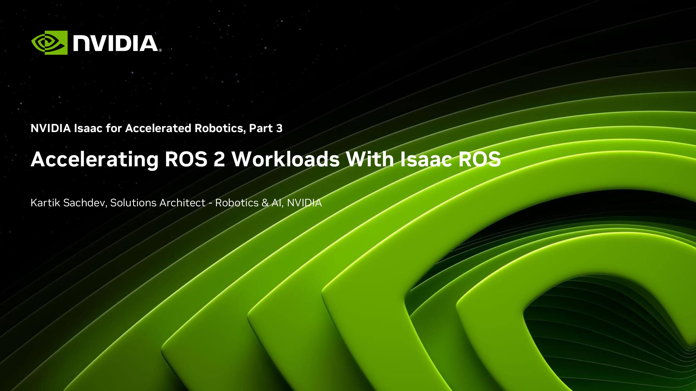{ width="720" }
/// caption
Isaac ROS — GPU 가속 ROS 2 워크로드 — 슬라이드 01 (출처: NVIDIA GTC Paris 2025)
///

## ⏱️ 구성

| 단계 | 내용 |
| --- | --- |
| 1 | ROS / ROS 2 개념과 하드웨어 가속의 필요성 |
| 2 | NVIDIA Isaac ROS — 30+ 가속 ROS 2 패키지(GEM) |
| 3 | **NITROS** — GPU 간 제로카피 전송 |
| 4 | 레퍼런스 워크플로 — Isaac Perceptor · Isaac Manipulator |
| 5 | 실습 개요 — 인지 기반 Pick-and-Place |
| 6 | 개발 환경 · 공통 명령 |

## 🤖 1. ROS란 무엇인가

**ROS(Robot Operating System)** 는 단일 운영체제가 아니라, 로봇 소프트웨어를 만들기 위한 **미들웨어 + 도구 + 생태계**입니다. 노드(node) 간 메시지를 주고받는 통신 계층 위에서 인지(Perception), 모션 플래닝(Motion Planning), 실행 행동(Executive Behavior) 등의 기능 모듈을 조합합니다.

- **미들웨어(Middleware)** — 노드 간 메시지 전달(publish/subscribe, service) 표준
- **개방형 표준(Open Standards)** — 벤더 중립적 인터페이스
- **도구(Tools)** — 시각화·디버깅·기록(rosbag) 등
- **커뮤니티(Community) / 생태계(Ecosystem)** — 재사용 가능한 패키지 자산

### 왜 하드웨어 가속이 필요한가

로봇이 점점 더 자율화될수록 **상황 인식(situational awareness)** 과 **실시간 응답성(real-time responsiveness)** 이 요구됩니다. 더 많은 센서와 고도화된 알고리즘을 쓰는 까다로운 워크로드는 CPU만으로는 실시간 처리가 어렵기 때문에, **GPU 가속**이 핵심이 됩니다.

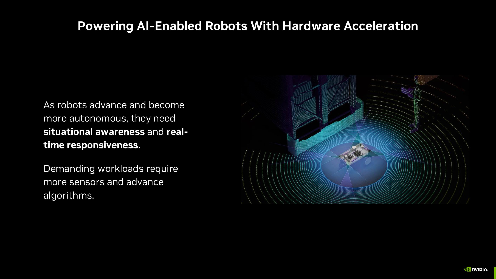{ width="720" }
/// caption
Isaac ROS — GPU 가속 ROS 2 워크로드 — 슬라이드 03 (출처: NVIDIA GTC Paris 2025)
///

## 🚀 2. NVIDIA Isaac ROS란

**NVIDIA Isaac ROS**는 **CUDA로 가속된 라이브러리와 AI 모델의 모음**으로, **30개 이상의 가속 ROS 2 패키지(GEM)** 를 제공합니다. 기존 ROS 그래프에 그대로 통합되며, 표준 ROS 인터페이스를 유지하면서 무거운 연산을 GPU로 처리합니다.

| 계층 | 구성 요소 |
| --- | --- |
| **가속 ROS 2 패키지 (30+)** | Visual SLAM, 3D Scene Reconstruction, Object Detection, Pose Estimation, Motion Planning, AprilTag Detection, Depth Segmentation, DNN Stereo Depth, Freespace Segmentation, DNN Inference |
| **통합 (Integration)** | ROS / **NITROS** |
| **가속 라이브러리 (Accelerated Libraries)** | TensorRT, VPI, CUDA, ARGUS, Drivers |

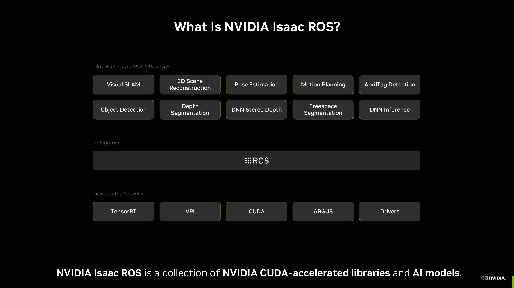{ width="720" }
/// caption
Isaac ROS — GPU 가속 ROS 2 워크로드 — 슬라이드 04 (출처: NVIDIA GTC Paris 2025)
///

## 🔗 3. NITROS — NVIDIA Isaac Transport for ROS

**NITROS(NVIDIA Isaac Transport for ROS)** 는 Isaac ROS 가속의 핵심 전송 계층입니다.

- **핸들(handle) 기반 전송**으로 데이터를 가속기(GPU) 캐시에서 CPU 메모리로 되돌리는 **불필요한 복사를 회피**합니다. 즉, GPU 노드 → GPU 노드로 데이터를 넘길 때 메모리를 다시 CPU로 내렸다 올리지 않습니다.
- 설계 철학: **"가능할 때 최적(Optimal when possible), 필요할 때 호환(compatible when necessary)"** — NITROS 비활성 노드와도 표준 ROS 메시지로 호환됩니다.
- 개발자가 직접 **NITROS 지원 노드**를 만들 수 있도록 여러 기술을 제공합니다:
    - **CUDA with NITROS**
    - **NITROS Bridge**
    - **PyNITROS**

!!! note "비효율 vs 효율 가속"
    가속이 비효율적이면 GPU 노드 사이마다 데이터가 CPU↔GPU를 왕복(CPU→GPU→CPU…)합니다. NITROS는 GPU 메모리에 데이터를 유지한 채 노드 사이를 핸들로 전달하여 이 왕복을 제거합니다.

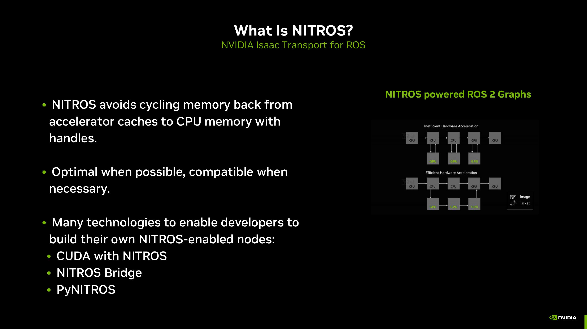{ width="720" }
/// caption
Isaac ROS — GPU 가속 ROS 2 워크로드 — 슬라이드 05 (출처: NVIDIA GTC Paris 2025)
///

## 🧩 4. 레퍼런스 워크플로

30+ 가속 패키지(GEM)와 NITROS 위에, 특정 응용을 위한 **레퍼런스 워크플로**가 제공됩니다. 대표적으로 **Isaac Perceptor**(자율주행 모바일 로봇)와 **Isaac Manipulator**(자율 매니퓰레이션)가 있으며, 다양한 타깃(로봇팔, Jetson 보드, 모바일 로봇, 워크스테이션, 휴머노이드)으로 배포(Deployments)됩니다.

### Isaac Perceptor — 자율 모바일 로봇(AMR)

자율주행 모바일 로봇 개발을 위한 레퍼런스 워크플로입니다.

- **구성 GEM**: Disparity(시차), Visual Odometry(비주얼 오도메트리), People Segmentation(사람 분할), 3D Occupancy Grid(3D 점유 격자)
- **Isaac ROS** 위에서 AI 가속 · 30+ ROS 패키지 · 완전 최적화(Fully Optimized)
- 하드웨어: **NVIDIA Nova Orin**, 최대 **4대의 스테레오 카메라** 지원

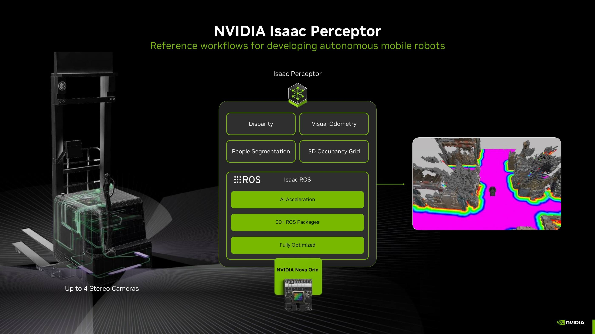{ width="720" }
/// caption
Isaac ROS — GPU 가속 ROS 2 워크로드 — 슬라이드 08 (출처: NVIDIA GTC Paris 2025)
///

### Isaac Manipulator — 자율 매니퓰레이션

자율 매니퓰레이션(로봇팔) 개발을 위한 레퍼런스 워크플로이며, 본 실습이 사용하는 워크플로입니다.

- **구성 GEM**: 6D Pose Tracking(6D 포즈 추적), Motion Planning(모션 플래닝), Grasp Identification(그래스프 식별), Manipulation & Dexterity(조작·정교성)
- **Isaac ROS** 위에서 AI 가속 · 30+ ROS 패키지 · 완전 최적화
- 하드웨어: **NVIDIA Jetson AGX Orin**

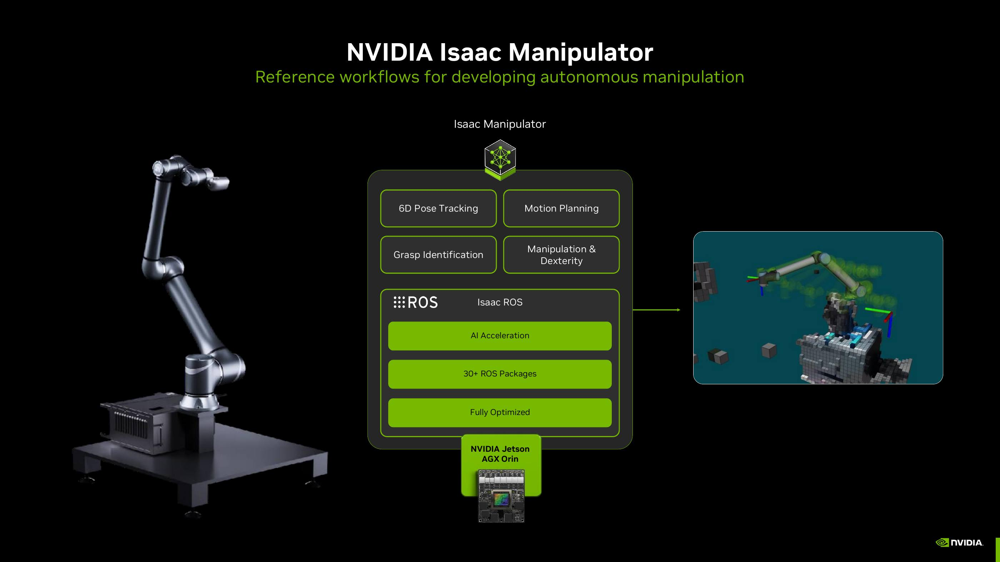{ width="720" }
/// caption
Isaac ROS — GPU 가속 ROS 2 워크로드 — 슬라이드 09 (출처: NVIDIA GTC Paris 2025)
///

## 🎯 5. 실습 — 인지 기반 Pick-and-Place

실습 목표는 다음 세 가지입니다.

1. **기본 Isaac ROS 빌딩 블록** 이해
2. **하드웨어 가속 라이브러리와 AI 모델** 학습 — `cuMotion`, `FoundationPose`, `SyntheticaDeTR`, `nvBlox`
3. **엔드투엔드 인지 기반 Pick-and-Place 워크플로** 구축 (장애물 회피 포함)

| 핵심 모델/라이브러리 | 역할 |
| --- | --- |
| **SyntheticaDeTR / RT-DETR** | 객체 검출(Object Detection) |
| **FoundationPose** | 6D 포즈 추정(Pose Estimation) |
| **cuMotion** | GPU 가속 모션 플래닝(Trajectory Planning) |
| **nvBlox** | 3D Scene Reconstruction · 장애물(ESDF) 표현 |

### Pick-and-Place 아키텍처

카메라의 RGB·Depth 입력에서 시작해 객체 검출 → 포즈 추정 → 로봇 세그멘테이션 → 충돌 환경(ESDF) 생성 → 그래스프 선택 → cuMotion 플래닝 → 로봇 관절 궤적까지 이어지는 가속 그래프입니다.

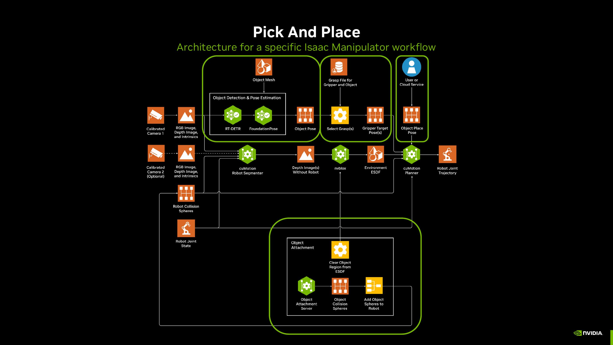{ width="720" }
/// caption
Isaac ROS — GPU 가속 ROS 2 워크로드 — 슬라이드 14 (출처: NVIDIA GTC Paris 2025)
///

### Pick-and-Place 오케스트레이션

**Orchestrator**는 Pick-and-Place 워크플로의 **상위 제어(high-level control)** 를 담당하며, 각 GEM(Object Detection·Pose Estimation·Trajectory Planning·Robot Control 등)을 순서대로 호출하고 데이터를 중계합니다. 로봇 제어는 **Pos/Vel 100Hz+** 로 이루어지며, 연산은 **AGX**와 **dGPU**에 분산됩니다.

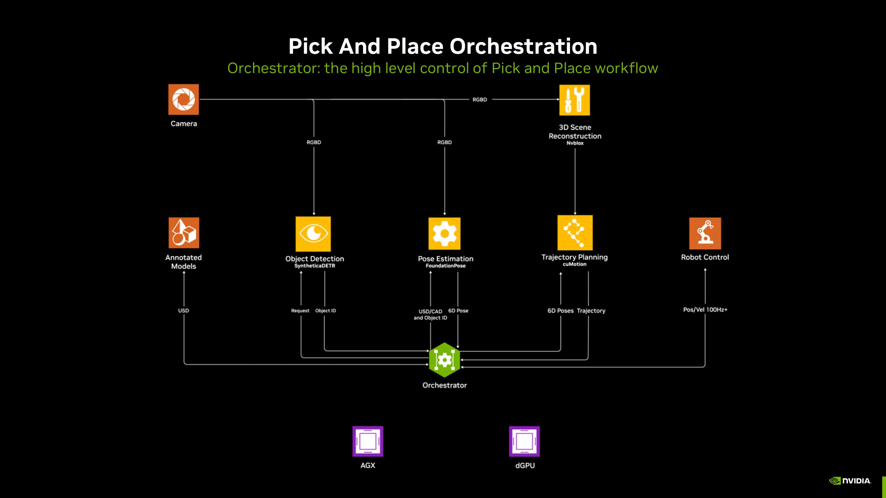{ width="720" }
/// caption
Isaac ROS — GPU 가속 ROS 2 워크로드 — 슬라이드 15 (출처: NVIDIA GTC Paris 2025)
///

## 💻 6. 개발 환경과 공통 명령

### 사전 구성 환경

실습 환경은 다음이 미리 설정되어 있습니다.

- **두 대의 시스템**
    - **Isaac Sim** 용 — GUI로 상호작용
    - **Compute stack(Isaac ROS)** 용 — 터미널로 상호작용
- **사전 학습 모델** (모두 TensorRT 실행 형태로 ONNX 모델 최적화 완료)
    - **RT_DETR** — 객체 검출
    - **Foundation Pose** — 포즈 추정

### 공통 명령

Isaac ROS 시스템에서 **새 터미널을 열 때마다** 다음을 실행합니다.

```bash
# 1) 다른 사용자와의 크로스토크 방지를 위해 본인 ID로 ROS 네트워크 격리
export ROS_DOMAIN_ID=<YOUR_ID>

# 2) ROS 워크스페이스 소싱
cd $ISAAC_ROS_WS && source install/setup.bash
```

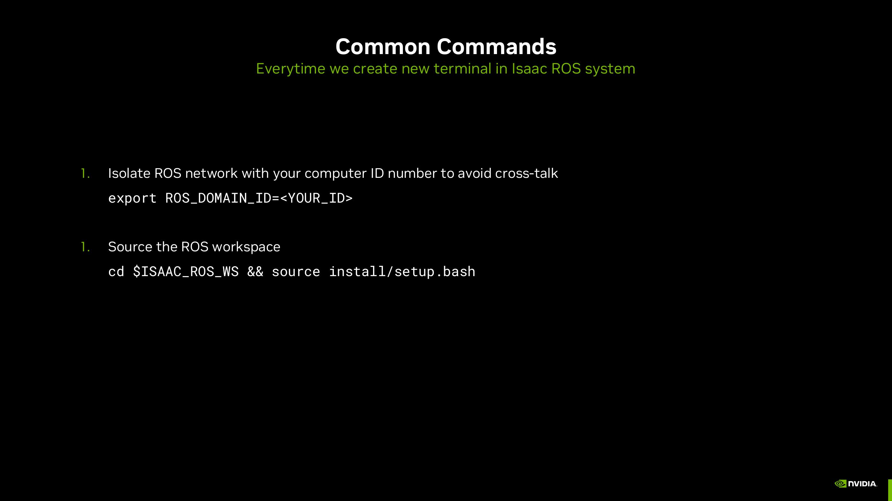{ width="720" }
/// caption
Isaac ROS — GPU 가속 ROS 2 워크로드 — 슬라이드 18 (출처: NVIDIA GTC Paris 2025)
///

!!! tip "실제 적용 사례"
    Miso Robotics의 **Flippy Fry Station**은 NVIDIA Isaac ROS와 CUDA 가속 **cuMotion**으로 주방 자동화의 모션 플래닝을 구현해, 동적인 환경에서 더 부드러운 궤적과 빠른 작업 완료를 달성했습니다. (Teradyne Robotics, Vention 등도 Isaac ROS 활용)

## ✅ 체크포인트

- ROS는 단일 OS가 아니라 **미들웨어 + 도구 + 생태계**이며, 자율 로봇은 실시간성 때문에 **하드웨어 가속**이 필요하다.
- **Isaac ROS**는 CUDA 가속 라이브러리·AI 모델의 모음으로 **30+ 가속 ROS 2 패키지(GEM)** 를 제공한다.
- **NITROS**는 핸들 기반 전송으로 **GPU↔CPU 메모리 왕복을 제거**하며, "가능할 때 최적, 필요할 때 호환" 원칙을 따른다.
- **Isaac Perceptor**(AMR)와 **Isaac Manipulator**(매니퓰레이션)는 GEM을 묶은 **레퍼런스 워크플로**다.
- Pick-and-Place는 **RT-DETR/SyntheticaDeTR → FoundationPose → nvBlox → cuMotion**을 **Orchestrator**가 묶어 장애물을 회피하며 수행한다.
- 새 터미널마다 `ROS_DOMAIN_ID` 격리와 워크스페이스 소싱이 필요하다.

## 🔗 출처 및 참고자료

- NVIDIA «Isaac for Accelerated Robotics» (GTC Paris 2025) / DLI **C-OV-05**, Part 3
- NVIDIA Isaac ROS 문서 — <https://nvidia-isaac-ros.github.io/>
- NVIDIA Isaac ROS GitHub — <https://github.com/NVIDIA-ISAAC-ROS>
- NVIDIA Isaac Perceptor · Isaac Manipulator 레퍼런스 워크플로 문서
- NVIDIA 개발자 포럼(Isaac ROS) — <https://forums.developer.nvidia.com/>

<!-- FULLDECK -->
## 🖼️ 원본 워크샵 슬라이드

??? note "원본 슬라이드 전체 (23매)"
    { width="700" }
    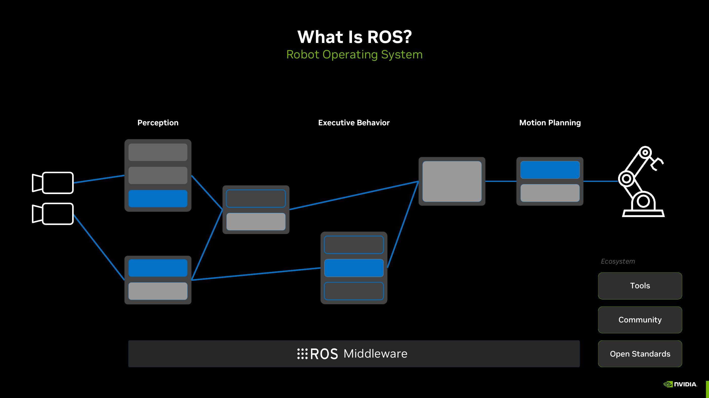{ width="700" }
    { width="700" }
    { width="700" }
    { width="700" }
    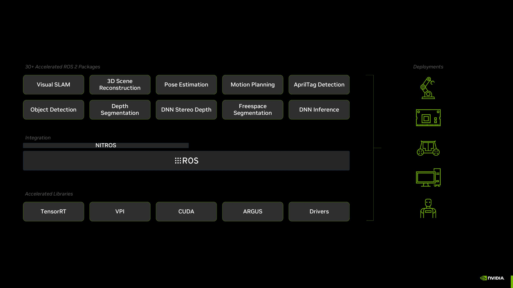{ width="700" }
    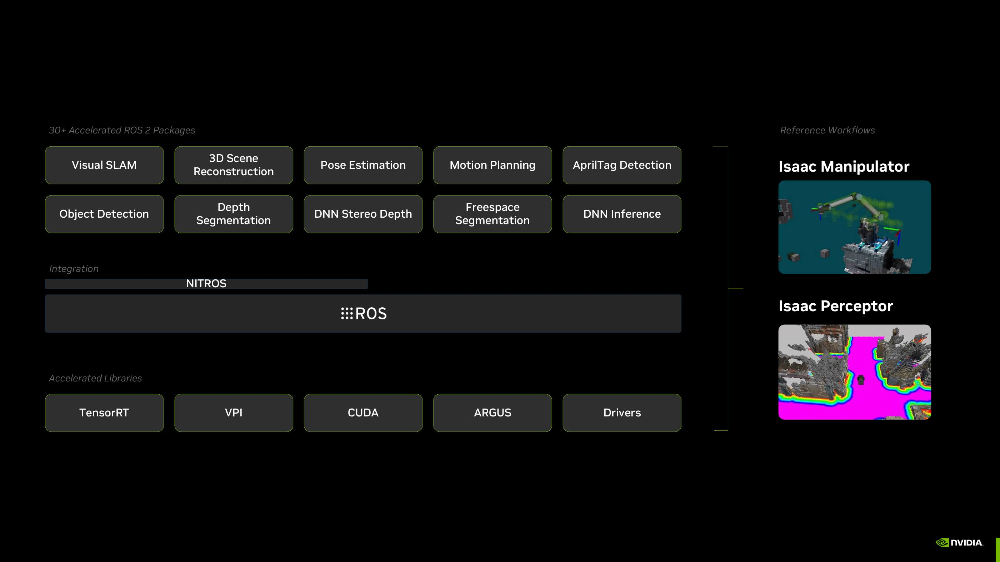{ width="700" }
    { width="700" }
    { width="700" }
    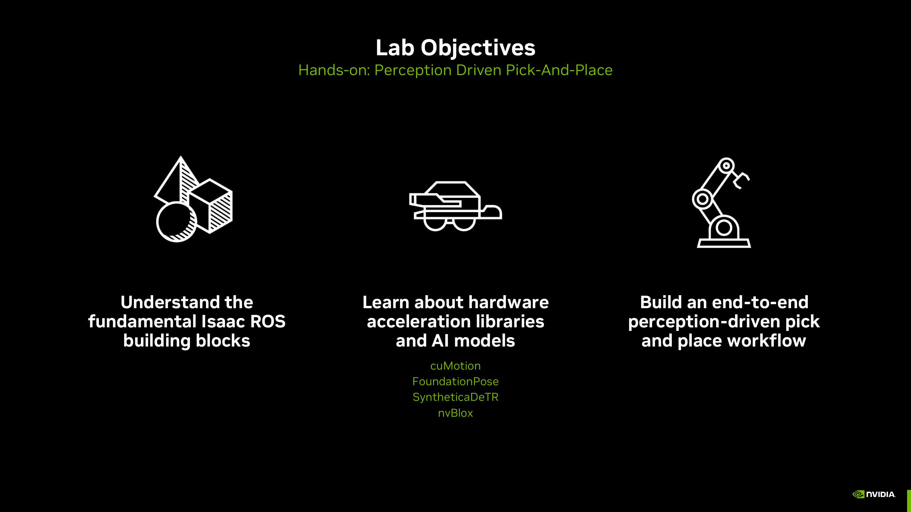{ width="700" }
    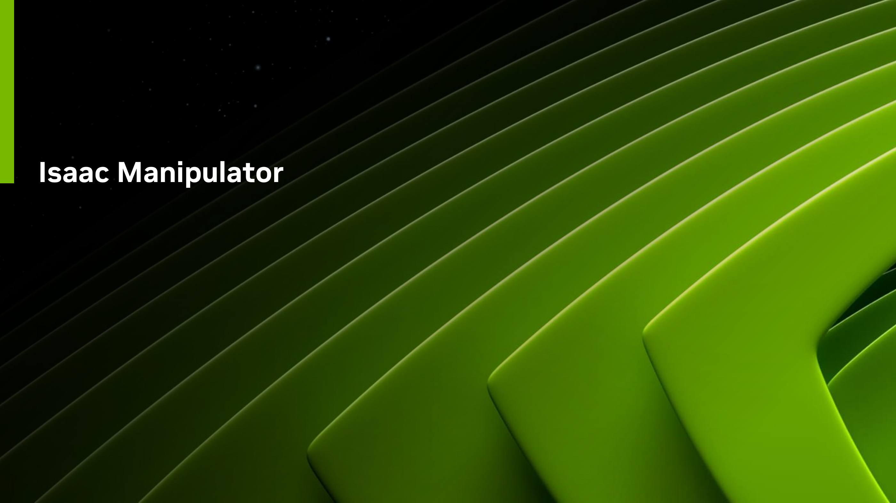{ width="700" }
    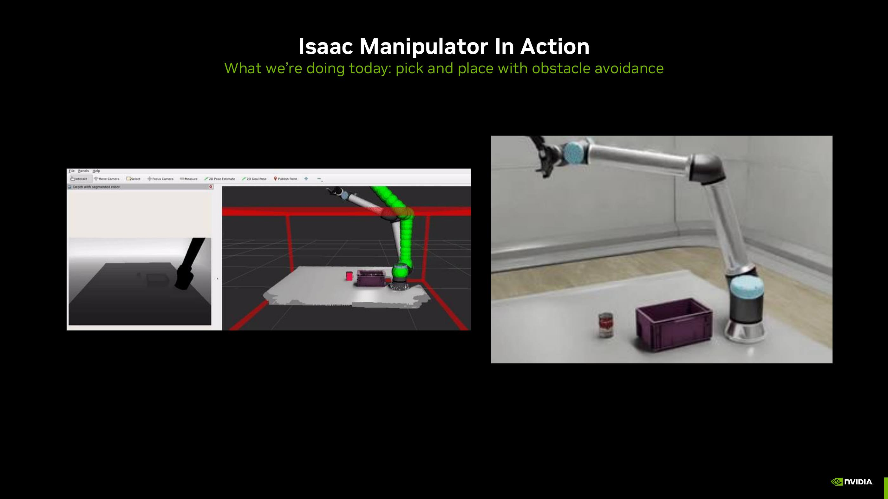{ width="700" }
    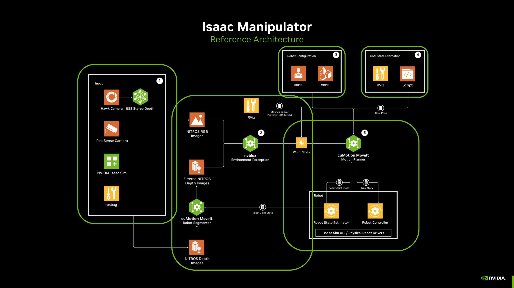{ width="700" }
    { width="700" }
    { width="700" }
    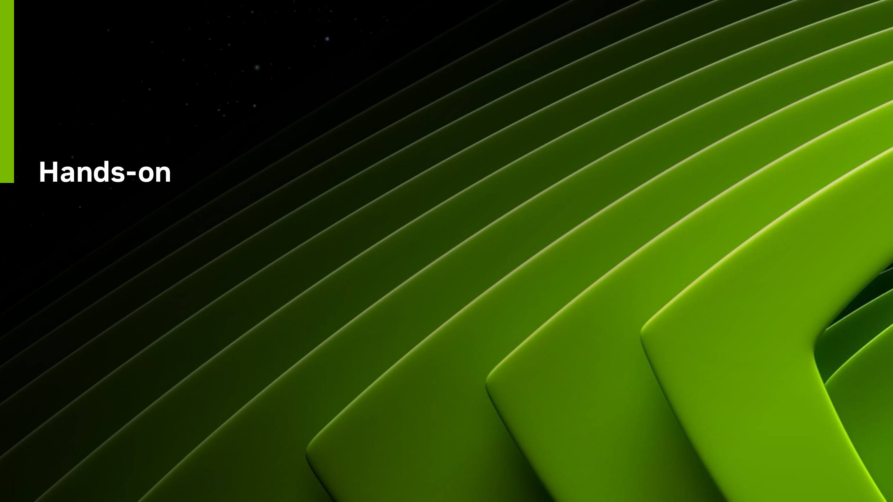{ width="700" }
    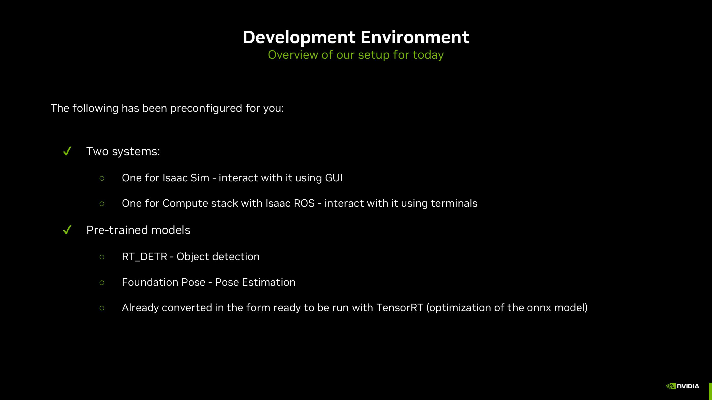{ width="700" }
    { width="700" }
    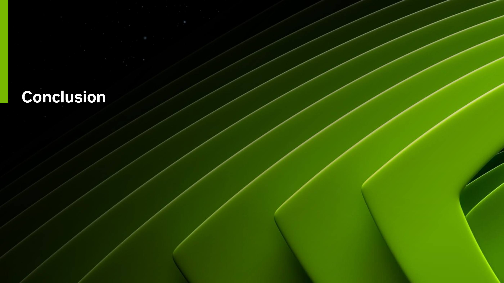{ width="700" }
    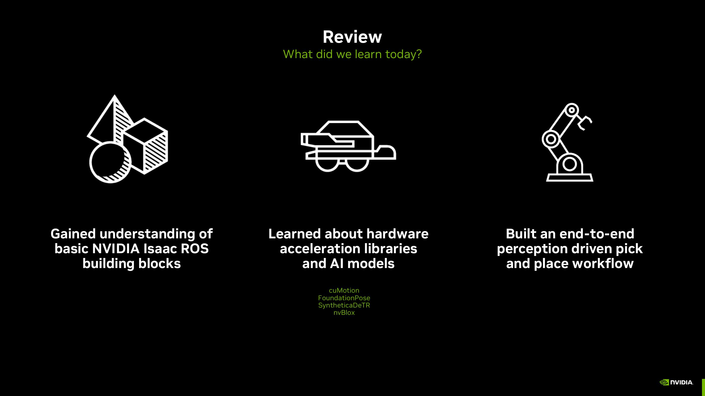{ width="700" }
    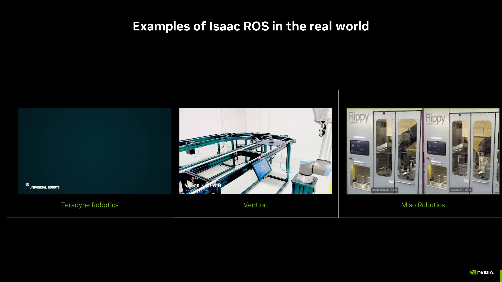{ width="700" }
    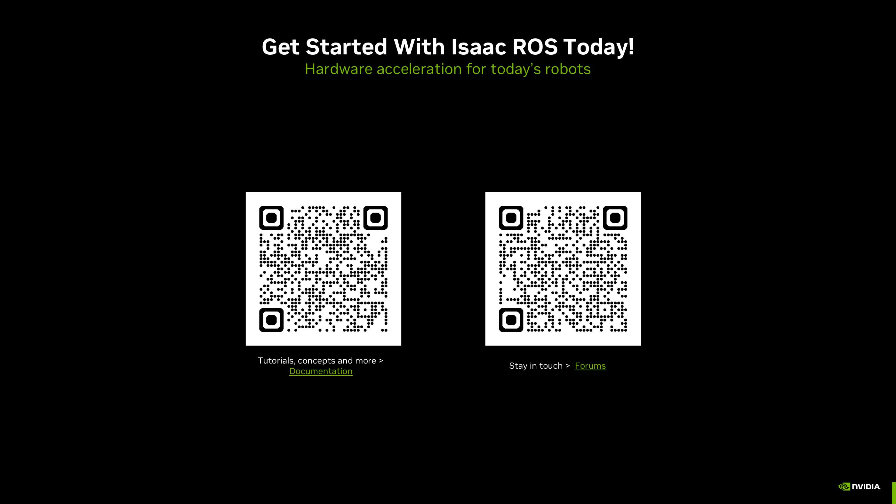{ width="700" }
    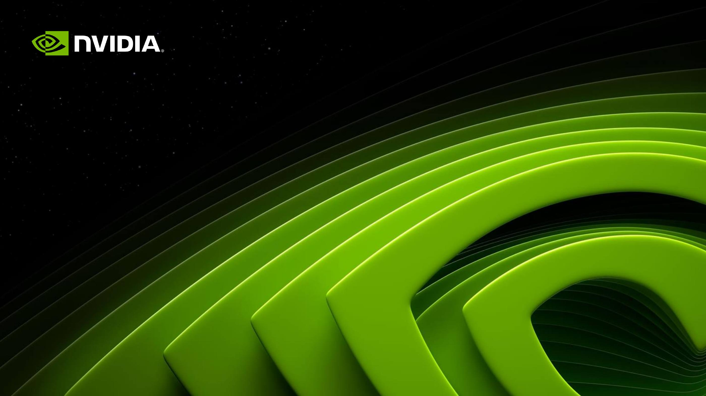{ width="700" }
