# 3주차 — Isaac Sim 센서 시뮬레이션 (IMU·LiDAR·Radar)

!!! abstract "학습목표"
    지난 강의에서 다룬 Isaac Sim의 기본 구조와 RGB/Depth 센서 시각화에 이어, 이번 강의에서는 **IMU·LiDAR·Radar** 세 가지 센서를 Isaac Sim 환경에 적용한다. 각 센서를 동적 물체에 부착하고, 센서 데이터를 획득·시각화하는 전체 실습 과정을 익혀 로봇 인지(perception)의 기초를 다진다.

!!! quote "출처 (Source)"
    본 자료의 그림·예제는 교안 **「Isaac Sim 센서 시뮬레이션 (IMU·LiDAR·Radar)」**(제작: *ENGI UNIVERSE*)를 바탕으로 재구성하였습니다. 코드는 교안의 설명을 충실히 따른 **재구성 예제**입니다.

## ⏱️ 3시간 구성

| 교시 | 시간 | 내용 | 근거 교안 |
| --- | --- | --- | --- |
| 1교시 | 50분 | Intro(센서 개요) + IMU Sensor 시뮬레이션 | §01~02 |
| 2교시 | 50분 | RTX LiDAR Sensor 시뮬레이션 | §03 |
| 3교시 | 50분 | RTX Radar Sensor 시뮬레이션 + Wrap-up | §04~05 |

---

## 🧭 1. Intro — 세 가지 센서 개요

지난 강의에서는 Isaac Sim의 기본 구조를 이해하고 **RGB / Depth 센서** 시뮬레이션 및 시각화 실습을 완료했습니다. 이번 강의의 목표는 **IMU / LiDAR / Radar** 센서를 Isaac Sim에 적용하고, 데이터 획득과 시각화까지 실습하는 것입니다.

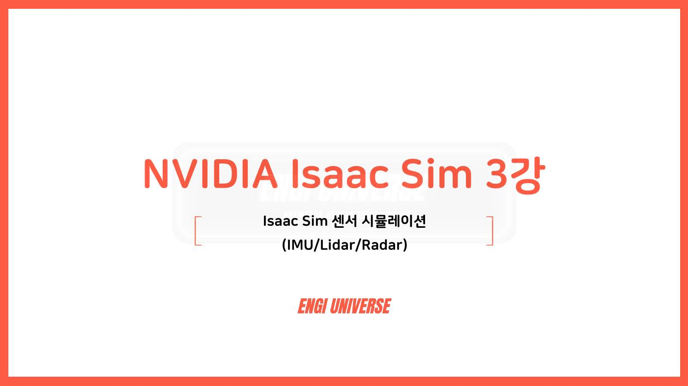{ width="720" }
/// caption
Isaac Sim 센서 시뮬레이션 (IMU·LiDAR·Radar) — 슬라이드 01 (출처: ENGI UNIVERSE)
///

| 센서 | 풀네임 | 측정 원리 | 활용 |
| --- | --- | --- | --- |
| **IMU** | Inertial Measurement Unit | 가속도·각속도·자세 측정 | 로봇의 움직임과 자세 변화 감지 |
| **LiDAR** | Light Detection and Ranging | 레이저 스캔으로 주변 구조·거리 인식 | 정밀한 3D 공간 맵 생성 |
| **Radar** | Radio Detection and Ranging | 전파 기반 거리·속도 측정 | 악천후 환경에서도 물체 감지 우수 |

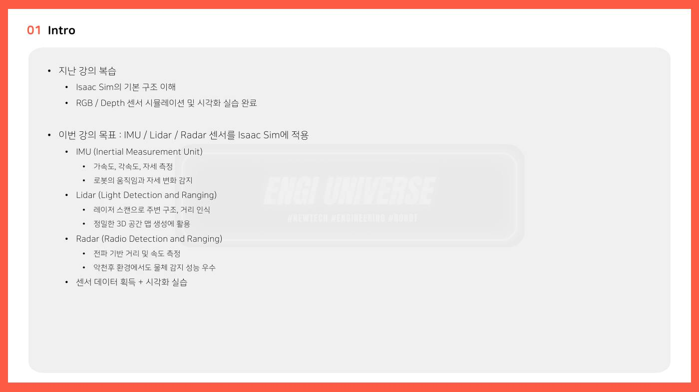{ width="720" }
/// caption
Isaac Sim 센서 시뮬레이션 (IMU·LiDAR·Radar) — 슬라이드 03 (출처: ENGI UNIVERSE)
///

!!! note "이번 강의의 흐름"
    모든 센서 실습은 **환경 구성 → 동적 물체 생성 → 센서 부착/생성 → 데이터 처리·시각화 → 시뮬레이션 루프** 라는 공통된 단계로 진행됩니다.

---

## 📐 2. IMU Sensor 시뮬레이션

### 2-1. 시뮬레이션 환경 구성

IMU 실습은 GUI 모드로 Isaac Sim을 실행하고 물리 공간과 지면을 구성하는 것에서 시작합니다.

| 코드 요소 | 설명 |
| --- | --- |
| `SimulationApp(headless=False)` | Isaac Sim을 **GUI 모드**로 실행 (`headless=True`면 백그라운드 전용) |
| `World` 객체 생성 | 물리 엔진이 적용되는 공간 생성 (단위 설정: 1단위 = 1미터) |
| `add_default_ground_plane()` | 기본 지면(Ground Plane) 추가 → 동적 물체가 중력·충돌에 반응 |
| `reset()` | 물리 엔진 초기화 |

```python
from isaacsim import SimulationApp
simulation_app = SimulationApp({"headless": False})  # GUI 모드 실행

from isaacsim.core.api import World

my_world = World(stage_units_in_meters=1.0)  # 1단위 = 1미터
my_world.scene.add_default_ground_plane()    # 기본 지면 추가
my_world.reset()                             # 물리 엔진 초기화
```

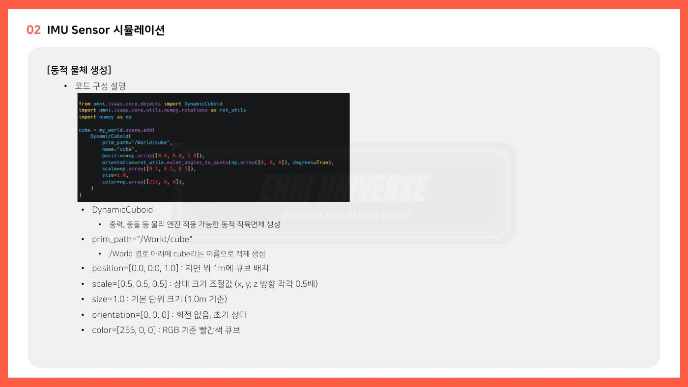{ width="720" }
/// caption
Isaac Sim 센서 시뮬레이션 (IMU·LiDAR·Radar) — 슬라이드 05 (출처: ENGI UNIVERSE)
///

### 2-2. 동적 물체 생성

`DynamicCuboid` 로 중력·충돌 등 물리 엔진이 적용되는 동적 직육면체(큐브)를 생성합니다.

```python
from isaacsim.core.api.objects import DynamicCuboid

cube = my_world.scene.add(
    DynamicCuboid(
        prim_path="/World/cube",   # /World 아래에 cube 이름으로 생성
        position=[0.0, 0.0, 1.0],  # 지면 위 1m에 배치
        scale=[0.5, 0.5, 0.5],     # x,y,z 각 방향 0.5배
        size=1.0,                  # 기본 단위 크기 (1.0m 기준)
        orientation=[0, 0, 0],     # 회전 없음, 초기 상태
        color=[255, 0, 0],         # RGB 빨간색 큐브
    )
)
```

!!! tip "파라미터 읽는 법"
    `scale` 은 `size` 에 곱해지는 **상대 크기 조절값**입니다. `size=1.0` 에 `scale=0.5` 를 주면 최종 크기는 각 축 0.5m가 됩니다.

### 2-3. IMU 센서 부착

생성한 큐브에 IMU 센서를 부착하고 주요 파라미터를 설정합니다.

| 파라미터 | 값/예시 | 의미 |
| --- | --- | --- |
| `prim_path` | `/World/cube/imu` | 센서를 큐브 아래에 생성(부착) |
| `name` | `"imu"` | 센서 객체의 참조 이름 |
| `frequency` | `60` | 60Hz 주기로 센서 데이터 수집 |
| `translation` | `[0, 0, 0.5]` | 큐브 중심 기준 z축 0.5m 위에 위치 |
| `orientation` | `[1, 0, 0, 0]` | 기본 회전 상태 (단위 쿼터니언) |
| `linear_acceleration_filter_size` | `10` | 선형 가속도 필터 (노이즈 제거) |
| `angular_velocity_filter_size` | `10` | 각속도 필터 (회전 데이터 부드럽게) |
| `orientation_filter_size` | `10` | 자세 필터 (회전 방향 안정화) |

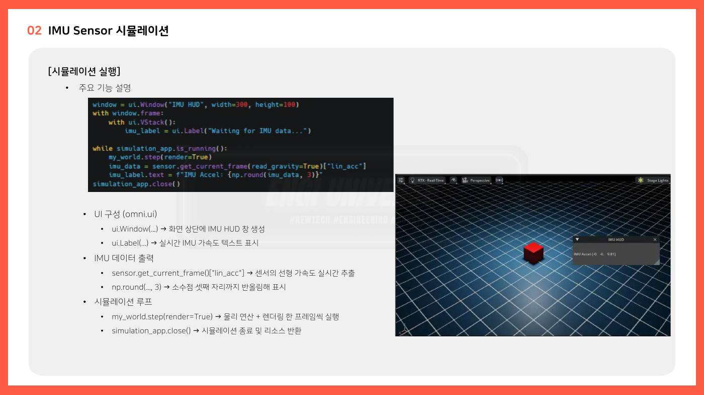{ width="720" }
/// caption
Isaac Sim 센서 시뮬레이션 (IMU·LiDAR·Radar) — 슬라이드 07 (출처: ENGI UNIVERSE)
///

### 2-4. 시뮬레이션 실행

`omni.ui` 로 IMU HUD 창을 만들어 실시간 가속도를 표시하고, 시뮬레이션 루프에서 센서 데이터를 추출합니다.

- **UI 구성 (`omni.ui`)** — `ui.Window(...)` 로 화면 상단에 IMU HUD 창 생성, `ui.Label(...)` 로 실시간 가속도 텍스트 표시
- **IMU 데이터 출력** — `sensor.get_current_frame()["lin_acc"]` 로 선형 가속도 실시간 추출, `np.round(..., 3)` 으로 소수점 셋째 자리까지 표시
- **시뮬레이션 루프** — `my_world.step(render=True)` 로 물리 연산 + 렌더링을 한 프레임씩 실행
- **종료** — `simulation_app.close()` 로 시뮬레이션 종료 및 리소스 반환

```python
import numpy as np

while simulation_app.is_running():
    my_world.step(render=True)  # 물리 연산 + 렌더링 한 프레임
    frame = imu_sensor.get_current_frame()
    lin_acc = np.round(frame["lin_acc"], 3)  # 선형 가속도 소수점 3자리
    # ui.Label 텍스트를 lin_acc 값으로 갱신

simulation_app.close()  # 종료 및 리소스 반환
```

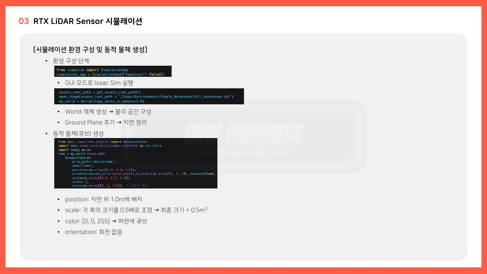{ width="720" }
/// caption
Isaac Sim 센서 시뮬레이션 (IMU·LiDAR·Radar) — 슬라이드 08 (출처: ENGI UNIVERSE)
///

---

## 🔦 3. RTX LiDAR Sensor 시뮬레이션

### 3-1. 환경 구성 및 동적 물체 생성

IMU와 동일한 단계로 환경을 구성하되, 이번에는 **파란색 큐브**를 사용합니다.

**Step 1 —** GUI 모드로 Isaac Sim 실행
**Step 2 —** `World` 객체 생성 → 물리 공간 구성
**Step 3 —** Ground Plane 추가 → 지면 정의
**Step 4 —** 동적 물체(큐브) 생성

- `position`: 지면 위 1.0m에 배치
- `scale`: 각 축 0.5배 → 최종 크기 0.5m³
- `color`: `[0, 0, 255]` → 파란색 큐브
- `orientation`: 회전 없음

### 3-2. RTX LiDAR 센서 생성

`omni.kit.commands.execute(...)` 명령어 시스템을 통해 RTX LiDAR 센서를 생성합니다.

| 파라미터 | 값/예시 | 의미 |
| --- | --- | --- |
| `path` | `"/sensor"` | 센서가 생성될 Prim 경로 |
| `config` | `"Example_Rotary"` | LiDAR 설정 프리셋 (회전식 예제 구성) |
| `translation` | `(1, 1, 0.5)` | 센서 위치 (x, y, z) |
| `orientation` | `Gf.Quatd(1, 0, 0, 0)` | 센서 회전 방향 (단위 쿼터니언) |

```python
import omni.kit.commands
from pxr import Gf

_, sensor = omni.kit.commands.execute(
    "IsaacSensorCreateRtxLidar",
    path="/sensor",
    config="Example_Rotary",          # Example_Rotary, Example_FrontFacing 등
    translation=(1, 1, 0.5),
    orientation=Gf.Quatd(1, 0, 0, 0),
)
```

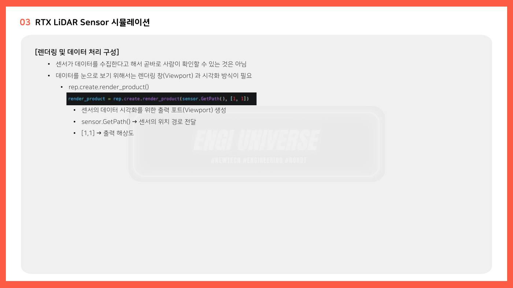{ width="720" }
/// caption
Isaac Sim 센서 시뮬레이션 (IMU·LiDAR·Radar) — 슬라이드 10 (출처: ENGI UNIVERSE)
///

### 3-3. 렌더링 및 데이터 처리 구성

센서가 데이터를 수집한다고 해서 곧바로 사람이 확인할 수 있는 것은 아닙니다. 눈으로 보기 위해서는 **렌더링 창(Viewport)** 과 시각화 방식이 필요합니다.

```python
import omni.replicator.core as rep

# 센서 데이터 시각화를 위한 출력 포트(Viewport) 생성
render_product = rep.create.render_product(sensor.GetPath(), [1, 1])
```

!!! note "여기서 잠깐! — `[1, 1]` 의 의미"
    `[1, 1]` 은 흔히 출력 해상도로 오해하기 쉽지만, **뷰포트의 해상도(width, height) 설정값이 아닙니다.**

    - 실제 의미: Replicator 내부에서 사용되는 **뷰포트 위치 또는 식별자** 역할 (렌더링 파이프라인의 고유 슬롯 지정값/기본값)
    - 왜 `[1, 1]` 을 쓰나? 센서 기반 `render_product` 생성 시 **관례적으로 `[1, 1]`** 을 사용하면 별도 조정 없이 안정적으로 작동하며, 해상도 설정은 다른 방식으로 별도 처리됩니다.

다음으로 LiDAR 데이터 어노테이터(Annotator)와 시각화용 작성기(Writer)를 연결합니다.

| 구성 요소 | 이름 | 역할 |
| --- | --- | --- |
| 어노테이터 | `RtxSensorCpuIsaacCreateRTXLidarScanBuffer` | RTX LiDAR로부터 스캔 데이터 추출 → CPU 메모리에 프레임 단위 버퍼로 저장 |
| 작성기(Writer) | `RtxLidarDebugDrawPointCloudBuffer` | 버퍼 데이터를 포인트 클라우드로 시각화 → 3D 점군 실시간 렌더링 |

```python
# 스캔 데이터 어노테이터 연결
annotator = rep.AnnotatorRegistry.get_annotator(
    "RtxSensorCpuIsaacCreateRTXLidarScanBuffer"
)
annotator.attach([render_product])

# 시각화용 포인트 클라우드 작성기 연결
writer = rep.writers.get("RtxLidarDebugDrawPointCloudBuffer")
writer.attach([render_product])
```

!!! tip "여기서 잠깐! — Annotator란?"
    Isaac Sim에서 센서 또는 시뮬레이션 중 생성된 데이터를 **추출·가공·전달·시각화** 할 수 있도록 처리하는 중간 모듈입니다. 센서/장면(Scene)에서 생성된 데이터를 분석용·연동용 포맷으로 가공하거나 시각화 구조로 변환하여, **시뮬레이션 내부 데이터 → 사용 가능한 출력 데이터** 로 바꾸는 브릿지 역할을 합니다.

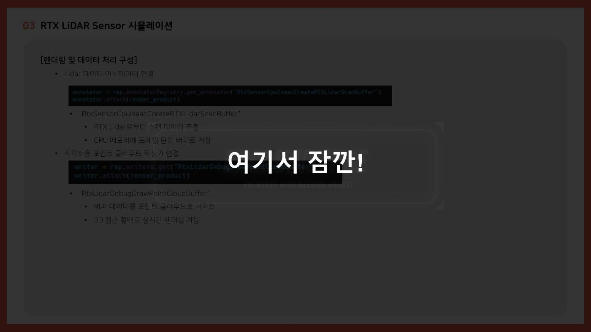{ width="720" }
/// caption
Isaac Sim 센서 시뮬레이션 (IMU·LiDAR·Radar) — 슬라이드 14 (출처: ENGI UNIVERSE)
///

### 3-4. 시뮬레이션 루프 실행 및 결과

```python
while simulation_app.is_running():
    simulation_app.update()          # 현재 프레임 갱신(물리·센서·객체 상태 반영)
    data = annotator.get_data()      # 어노테이터에서 최신 센서 데이터 습득
    print(data['distance'])          # 센서~각 포인트 사이 거리 값 출력

simulation_app.close()               # 자원 정리 및 메모리 해제
```

| 코드 | 설명 |
| --- | --- |
| `while simulation_app.is_running():` | 시뮬레이션이 종료될 때까지 반복하는 루프 |
| `simulation_app.update()` | 현재 프레임을 한 번 갱신 (물리 연산·센서 업데이트·객체 상태 변화 반영) |
| `data = annotator.get_data()` | 어노테이터로부터 최신 센서 데이터 습득 |
| `print(data['distance'])` | `distance` 필드(센서~포인트 거리)를 출력 |
| `simulation_app.close()` | 루프 종료 후 자원 정리·메모리 해제 |

### 3-5. LiDAR 출력 데이터

=== "센서 설정값"

    | 항목 | 값 | 의미 |
    | --- | --- | --- |
    | `numChannels` | 128 | 레이저 채널 수 |
    | `numEchos` | 2 | 한 빔당 수신 가능 반사 수 (예: 투명 유리·얇은 잎 반사) |
    | `numReturnsPerScan` | 921600 | 1회 스캔당 총 측정 점수 |

=== "출력 항목"

    | 필드 | 의미 |
    | --- | --- |
    | `data` | 스캔된 각 점의 위치 좌표 (x, y, z 등) |
    | `distance` | 센서로부터 측정된 거리 (m) |
    | `intensity` | 반사 강도 값 |
    | `index` | 각 점의 인덱스 번호 |
    | `beamId` / `emitterId` | 빔 인덱스 / 발사기 ID |
    | `elevation` / `azimuth` | 고도각(vertical) / 방위각(horizontal) |
    | `objectId` / `materialId` | 객체 ID / 재질 ID |
    | `normal` / `timestamp` | 표면 법선 벡터 / 측정 시간 |

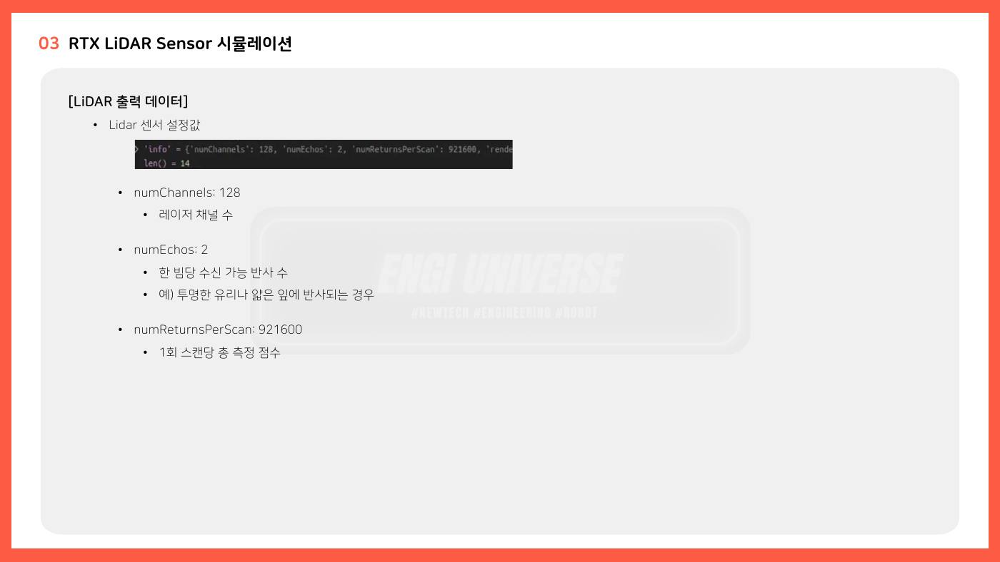{ width="720" }
/// caption
Isaac Sim 센서 시뮬레이션 (IMU·LiDAR·Radar) — 슬라이드 17 (출처: ENGI UNIVERSE)
///

---

## 📡 4. RTX Radar Sensor 시뮬레이션

!!! note "Radar란?"
    Isaac Sim은 RTX 기반으로 Radar 시뮬레이션을 지원하여, 물체와의 **거리 및 속도를 고정밀로 측정** 하는 환경을 구현할 수 있습니다. Radar는 자율주행 차량이나 실외 로봇에서 널리 사용되며, **전파** 를 활용해 주변 물체를 감지하고 방향·거리 정보를 획득합니다.

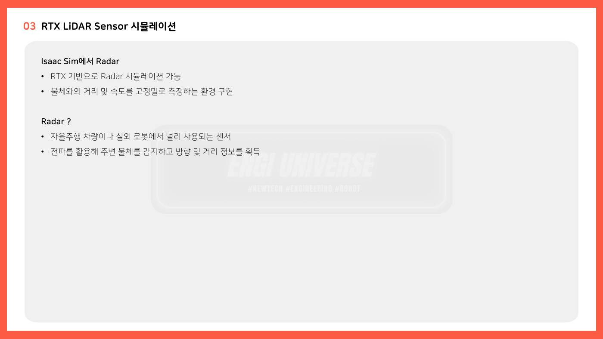{ width="720" }
/// caption
Isaac Sim 센서 시뮬레이션 (IMU·LiDAR·Radar) — 슬라이드 19 (출처: ENGI UNIVERSE)
///

### 4-1. 환경 구성 및 동적 물체 생성

LiDAR와 동일한 단계로 환경을 구성하되, 큐브의 위치를 달리합니다.

- `position`: `[0, -3.0, 1.0]` 에 배치
- `scale`: 각 축 0.5배 → 최종 크기 0.5m³
- `color`: `[0, 0, 255]` → 파란색 큐브
- `orientation`: 회전 없음

### 4-2. RTX Radar 센서 설정

| 파라미터 | 값/예시 | 의미 |
| --- | --- | --- |
| `omni.kit.commands.execute(...)` | — | 명령어 시스템을 통해 센서 생성 명령 실행 |
| `config` | `"Example"` | Radar 설정 프리셋 (예제 구성) |
| `translation` | `(0, 0, 0.25)` | 센서 위치 (x, y, z) |
| `orientation` | `Gf.Quatd(0.707, 0, 0, -0.707)` | 센서 회전 방향 (단위 쿼터니언) |

```python
import omni.kit.commands
from pxr import Gf

_, sensor = omni.kit.commands.execute(
    "IsaacSensorCreateRtxRadar",
    path="/sensor",
    config="Example",                        # Example_Rotary, Example_FrontFacing 등
    translation=(0, 0, 0.25),
    orientation=Gf.Quatd(0.707, 0, 0, -0.707),
)
```

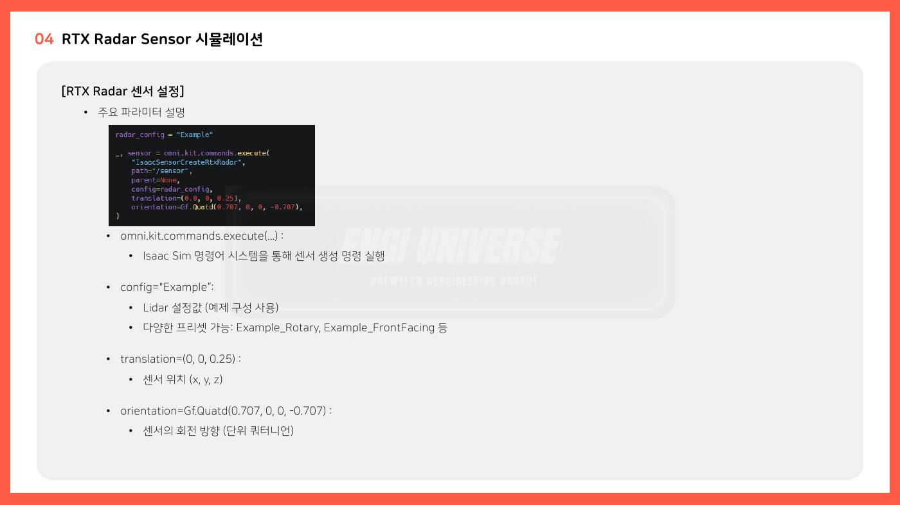{ width="720" }
/// caption
Isaac Sim 센서 시뮬레이션 (IMU·LiDAR·Radar) — 슬라이드 21 (출처: ENGI UNIVERSE)
///

### 4-3. 렌더링 및 데이터 처리 구성

- **Render Product 생성** — 센서 데이터 렌더링 결과를 출력할 뷰포트 정의 (시뮬레이션 내 센서 감지 결과를 화면에 표시하는 필수 단계). 해상도는 **최소 512×512 이상 권장**(시각화 품질에 직접 영향)
- **Annotator 등록** — 센서 데이터를 특정 포맷으로 변환. 예: `RtxSensorCpuIsaacComputeRTXRadarPointCloud` → Radar 신호를 포인트 클라우드로 변환
- **Writer 등록** — 수집된 데이터를 화면에 시각적으로 표시. 예: `RtxRadarDebugDrawPointCloud` → Radar 데이터를 포인트 클라우드 형태로 렌더링(방향 벡터·속도 정보 등도 함께 시각화 가능)

```python
import omni.replicator.core as rep

# 최소 512x512 이상 권장
render_product = rep.create.render_product(sensor.GetPath(), [512, 512])

annotator = rep.AnnotatorRegistry.get_annotator(
    "RtxSensorCpuIsaacComputeRTXRadarPointCloud"  # Radar 신호 → 포인트 클라우드
)
annotator.attach([render_product])

writer = rep.writers.get("RtxRadarDebugDrawPointCloud")  # 시각화
writer.attach([render_product])
```

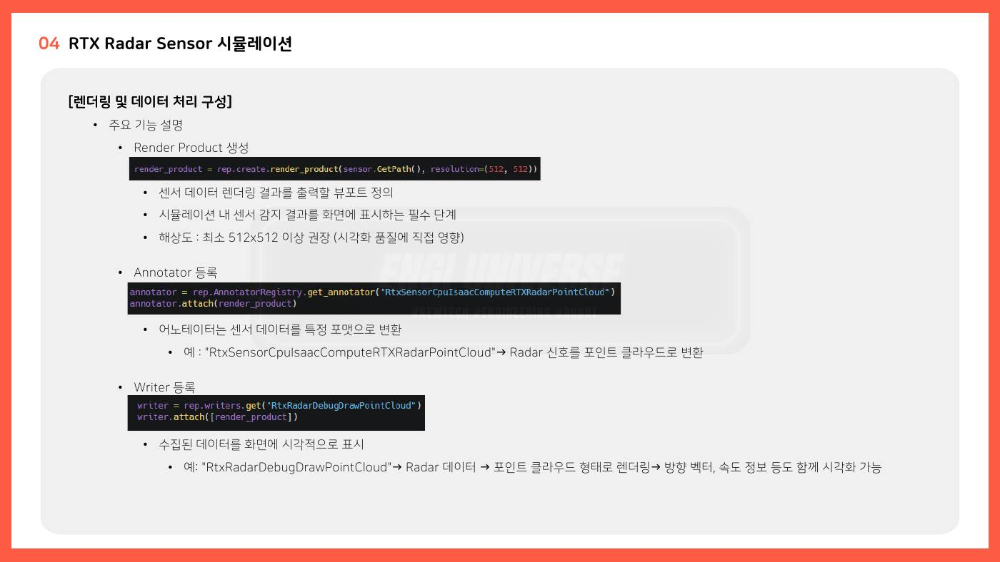{ width="720" }
/// caption
Isaac Sim 센서 시뮬레이션 (IMU·LiDAR·Radar) — 슬라이드 22 (출처: ENGI UNIVERSE)
///

### 4-4. 시뮬레이션 실행

```python
while simulation_app.is_running():
    simulation_app.update()        # 매 프레임 시뮬레이션 상태 업데이트
    data = annotator.get_data()    # 현재 프레임의 센서 데이터 습득

simulation_app.close()             # 시뮬레이션 내 자원 초기화
```

### 4-5. Radar 출력 데이터

=== "탐지·속도 범위"

    | 항목 | 의미 |
    | --- | --- |
    | `maxAzRad` / `minAzRad` | 최대 / 최소 방위각 (rad) |
    | `maxElRad` / `minElRad` | 최대 / 최소 고도각 (rad) |
    | `maxRangeM` | 최대 탐지 거리 (m) |
    | `maxVelMps` / `minVelMps` | 최대 / 최소 속도 (m/s, Doppler 기반) — 접근 시 음수, 멀어질 때 양수 |

=== "센서 출력 정보"

    | 필드 | 의미 |
    | --- | --- |
    | `Elevation` | 객체들의 고도 각도 (rad) |
    | `radialDistance` | 객체까지 거리 (m) |
    | `radialVelocity` | 레이더 방향 속도 (m/s, +는 멀어짐) |
    | `rcs` | 레이더 반사 세기 (Radar Cross Section, m²) — 금속처럼 반사율 높은 물체일수록 큰 값 |

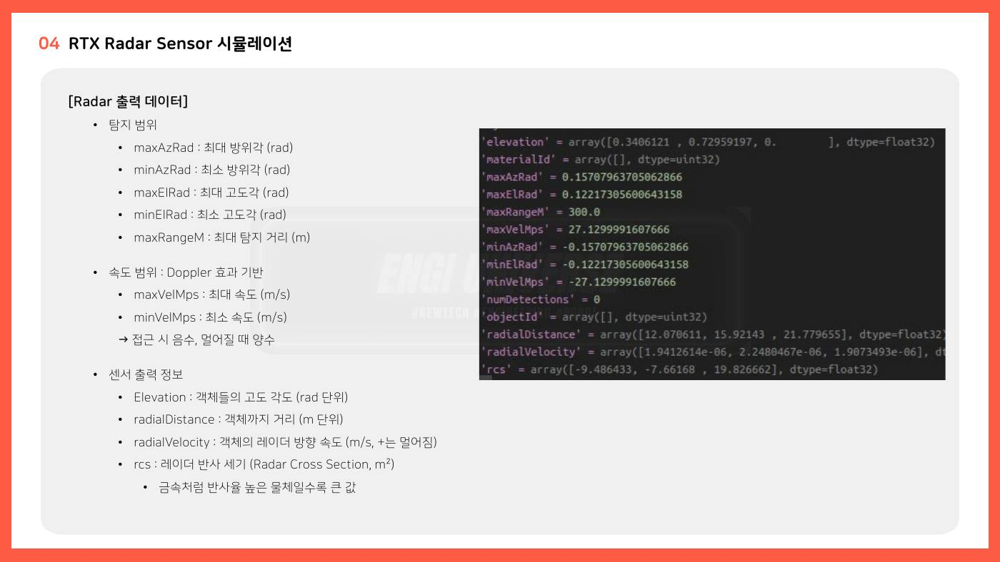{ width="720" }
/// caption
Isaac Sim 센서 시뮬레이션 (IMU·LiDAR·Radar) — 슬라이드 24 (출처: ENGI UNIVERSE)
///

---

## 🧩 5. Wrap-up

!!! success "오늘 강의 내용 요약"
    - **IMU 센서** 를 시뮬레이션 상에서 구현해보고 사용 (가속도·각속도·자세)
    - **LiDAR 센서** 를 시뮬레이션 상에서 구현해보고 사용 (포인트 클라우드·거리)
    - **Radar 센서** 를 시뮬레이션 상에서 구현해보고 사용 (거리·속도·RCS)

세 센서 모두 **환경 구성 → 동적 물체 생성 → 센서 생성·부착 → Render Product/Annotator/Writer 구성 → 시뮬레이션 루프** 라는 공통 파이프라인을 따른다는 점이 핵심입니다.

{ width="720" }
/// caption
Isaac Sim 센서 시뮬레이션 (IMU·LiDAR·Radar) — 슬라이드 26 (출처: ENGI UNIVERSE)
///

## ✅ 체크포인트

- [ ] `SimulationApp`·`World`·`add_default_ground_plane()` 로 센서 실습 환경을 구성할 수 있는가
- [ ] `DynamicCuboid` 로 동적 물체를 만들고 IMU 센서를 부착해 `lin_acc` 를 출력할 수 있는가
- [ ] RTX LiDAR 센서를 생성하고 Annotator/Writer로 포인트 클라우드를 시각화할 수 있는가
- [ ] `render_product` 의 `[1, 1]` 이 해상도가 아닌 식별자/슬롯 의미임을 설명할 수 있는가
- [ ] RTX Radar 센서의 출력(`radialDistance`·`radialVelocity`·`rcs`)을 해석할 수 있는가

## 📊 평가 루브릭

| 항목 | 배점 | 기준 |
| --- | --- | --- |
| 환경 구성 | 20 | GUI 실행·World·Ground Plane·reset 구성의 정확성 |
| IMU 시뮬레이션 | 25 | 큐브 생성·IMU 부착·`get_current_frame` 데이터 출력 |
| LiDAR 시뮬레이션 | 25 | 센서 생성·render_product·Annotator/Writer 포인트 클라우드 시각화 |
| Radar 시뮬레이션 | 20 | 센서 설정·512×512 렌더·Radar 출력 데이터 해석 |
| 개념 이해 | 10 | Annotator 역할·`[1,1]` 의미·센서별 측정 원리 설명 |

## 🔗 출처 및 참고자료

- 교안 「Isaac Sim 센서 시뮬레이션 (IMU·LiDAR·Radar)」 (제작: ENGI UNIVERSE)
- NVIDIA Isaac Sim 공식 문서 — <https://docs.isaacsim.omniverse.nvidia.com>
- Isaac Sim RTX Sensors (LiDAR/Radar) — <https://docs.isaacsim.omniverse.nvidia.com/latest/sensors/index.html>
- Omniverse Replicator — <https://docs.omniverse.nvidia.com/extensions/latest/ext_replicator.html>

## 📘 Isaac Sim 5.1.0 공식 문서

!!! note "공식 문서 (NVIDIA Isaac Sim 5.1.0)"
    본 주차의 Isaac Sim/ROS 2 API·절차는 아래 공식 문서로 보강·검증할 수 있습니다.

    - [IMU 센서](https://docs.isaacsim.omniverse.nvidia.com/5.1.0/sensors/isaacsim_sensors_physics_imu.html)
    - [RTX LiDAR](https://docs.isaacsim.omniverse.nvidia.com/5.1.0/sensors/isaacsim_sensors_rtx_lidar.html)
    - [RTX Radar](https://docs.isaacsim.omniverse.nvidia.com/5.1.0/sensors/isaacsim_sensors_rtx_radar.html)
    - [Replicator 개요](https://docs.isaacsim.omniverse.nvidia.com/5.1.0/replicator_tutorials/tutorial_replicator_overview.html)

<!-- FULLDECK -->
## 🖼️ 원본 강의 슬라이드

??? note "원본 강의 슬라이드 전체 (26매)"
    { width="700" }
    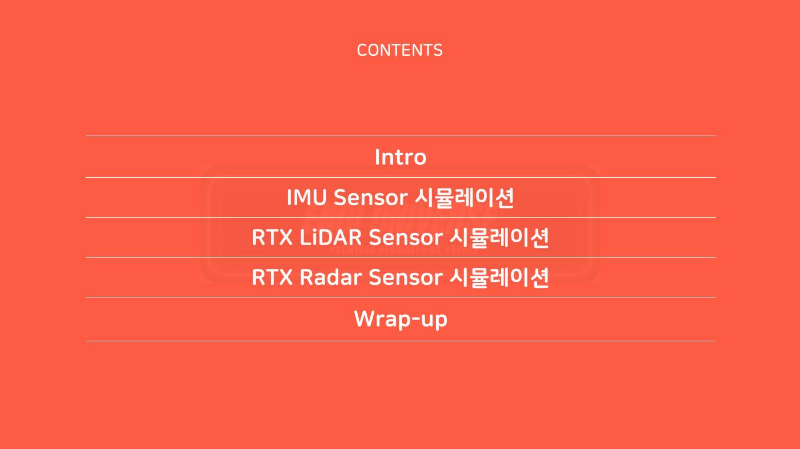{ width="700" }
    { width="700" }
    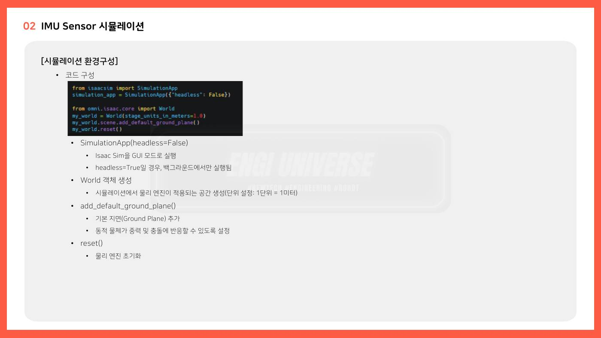{ width="700" }
    { width="700" }
    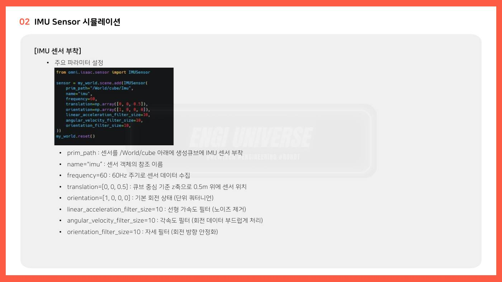{ width="700" }
    { width="700" }
    { width="700" }
    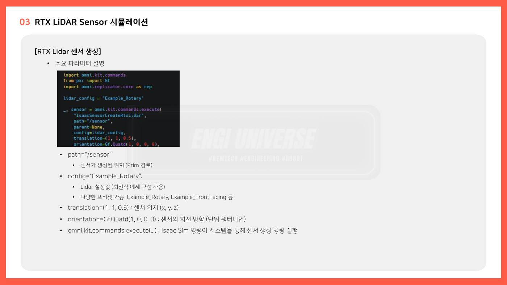{ width="700" }
    { width="700" }
    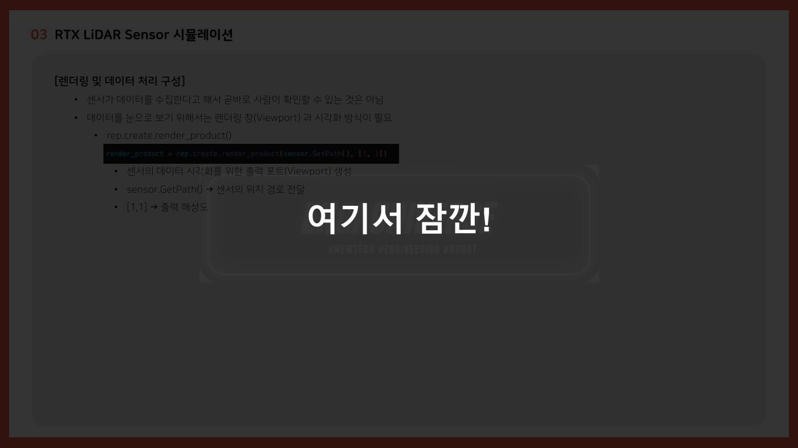{ width="700" }
    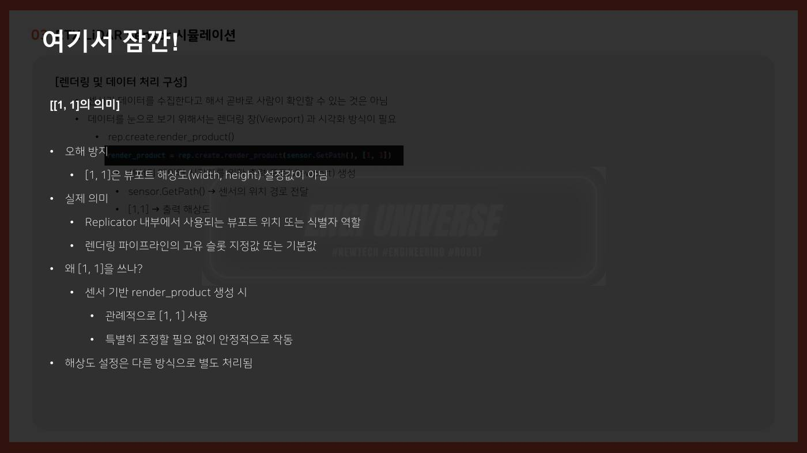{ width="700" }
    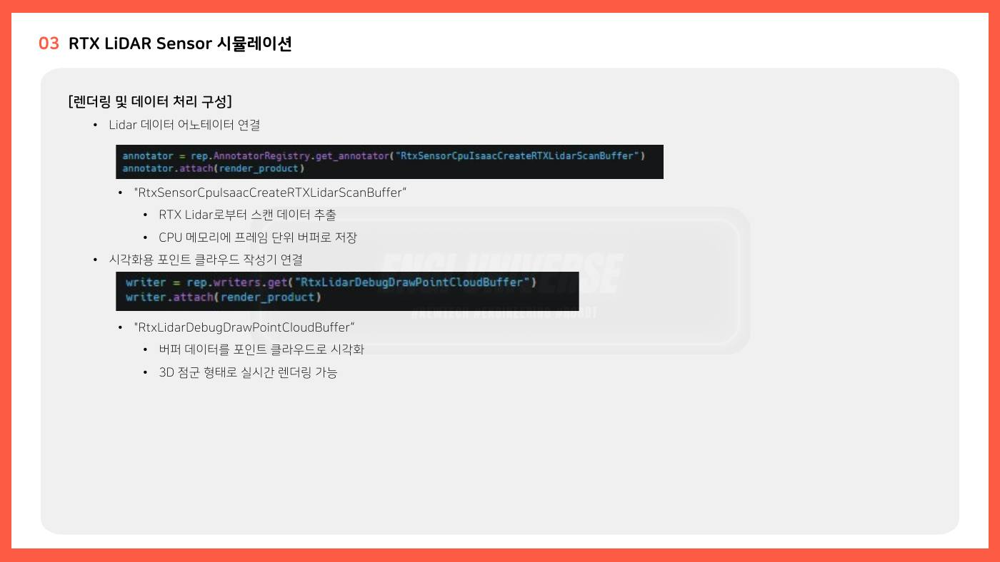{ width="700" }
    { width="700" }
    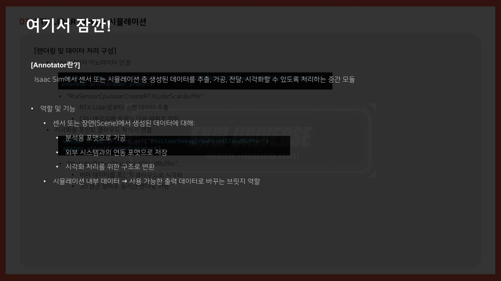{ width="700" }
    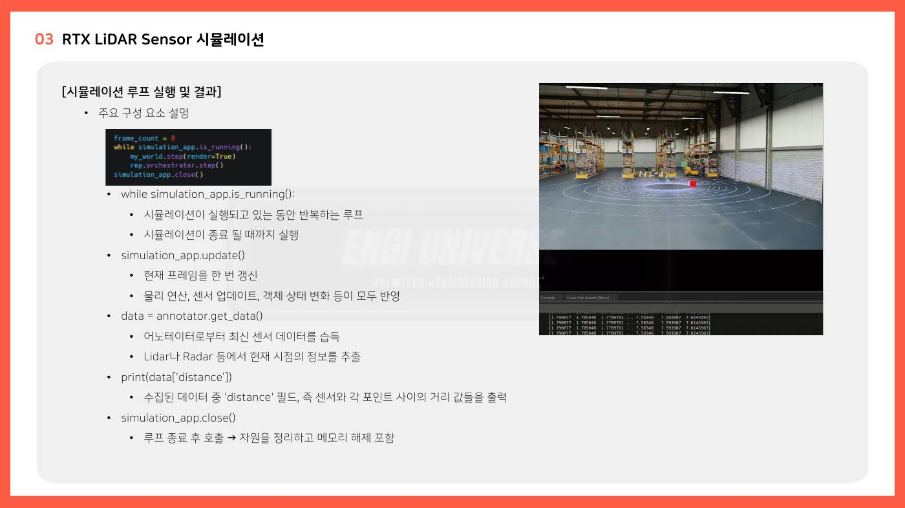{ width="700" }
    { width="700" }
    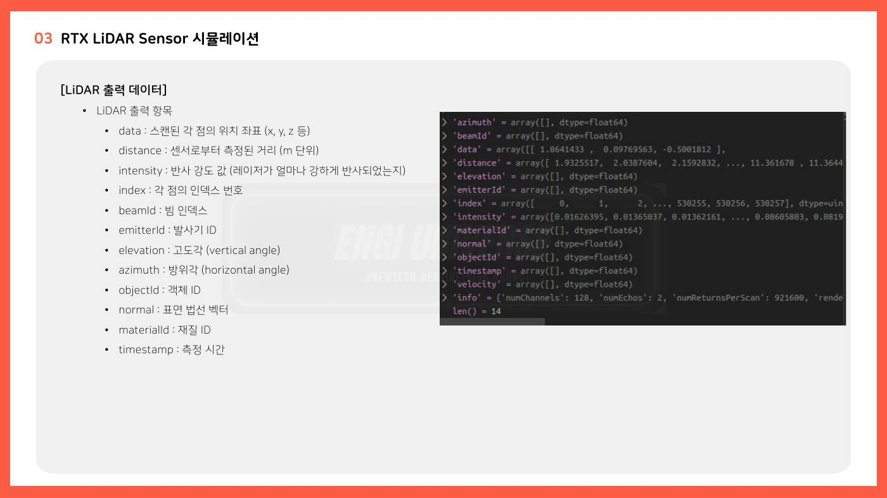{ width="700" }
    { width="700" }
    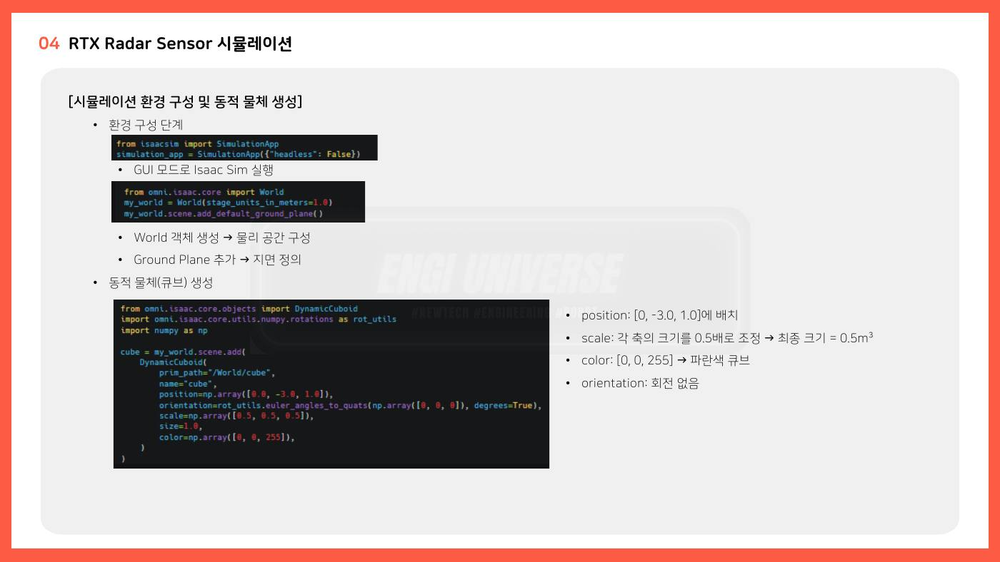{ width="700" }
    { width="700" }
    { width="700" }
    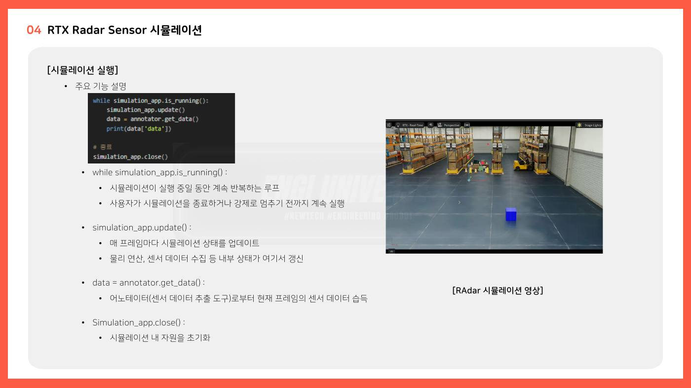{ width="700" }
    { width="700" }
    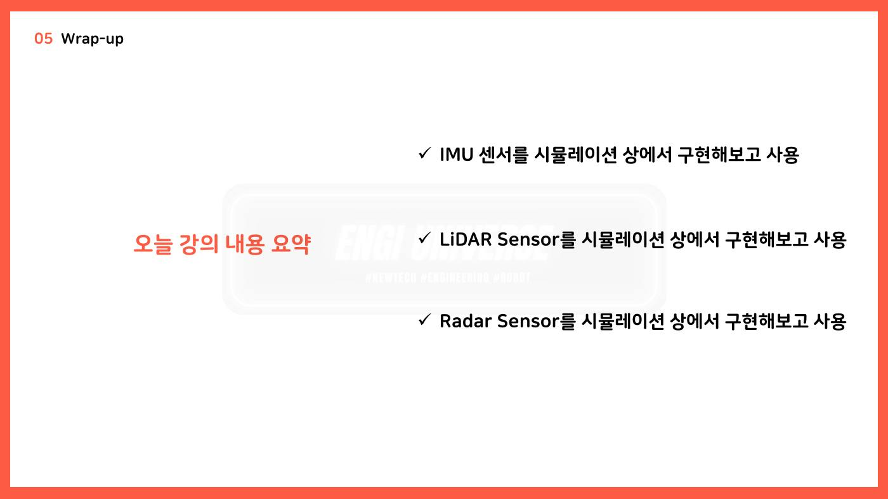{ width="700" }
    { width="700" }
