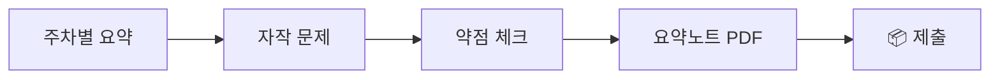

# 8주차 — 중간고사 (Isaac Sim & SLAM 종합)

!!! abstract "학습목표"
    1~7주차에서 다룬 **Isaac Sim 환경 구축·센서 시뮬레이션·Isaac Lab 강화학습·Spot+ATS 구축·SLAM/Nav2 자율주행**을 종합 평가한다. 개념 이해(이론)와 실제 시뮬레이션 구성 능력(실기)을 함께 점검한다.

!!! quote "출처 (Source)"
    평가 범위는 교안 **NVIDIA Isaac Sim 1~5강** 및 **SLAM 1~2강**(제작: ENGI UNIVERSE)에 기반한다.

!!! note "강의 흐름 (FLOW)"
    `Isaac Sim` → `센서` → `Isaac Lab` → `SLAM` → `Nav2`

## ⏱️ 3시간 구성

| 교시 | 시간 | 내용 |
| --- | --- | --- |
| 1교시 | 50분 | 이론 평가 (서술/객관식) |
| 2교시 | 50분 | 실기 평가 — Isaac Sim 환경·센서 구성 |
| 3교시 | 50분 | 실기 평가 — SLAM/Nav2 자율주행 |

## 📚 평가 범위

| 주차 | 주제 | 핵심 키워드 |
| --- | --- | --- |
| 1 | Isaac Sim 설치·활용 | 권장 사양, 시뮬레이션의 이점 |
| 2 | 물리환경·카메라 센서 | Stage/World/Prim, DynamicCuboid, RGB/Depth |
| 3 | IMU·LiDAR·Radar | RTX LiDAR, Annotator, PointCloud |
| 4 | Isaac Lab 강화학습 | MDP, Action/Observation, Height Scan |
| 5 | Spot+ATS 구축 | URDF Import, ROS2 연동, RL 재학습 |
| 6 | SLAM·Nav2 기본 | Odometry, Sensor Fusion, slam_toolbox |
| 7 | Spot+ATS SLAM 연동 | ROS2 Bridge, TF 트리, 자율주행 |

## 📝 1교시. 이론 평가 (예시 문항)

1. Isaac Sim에서 **Stage / World / Prim** 의 차이를 설명하고, `/World/Robot1/base_link` 경로가 의미하는 바를 쓰라.
2. `SimulationApp({"headless": ...})` 의 `headless` 옵션이 GUI 모드와 학습(백그라운드) 모드에서 갖는 의미를 비교하라.
3. **RGB 카메라**와 **Depth 카메라**가 생성하는 데이터와 활용 목적을 각각 설명하라.
4. RTX LiDAR 시뮬레이션에서 **Annotator** 와 **Writer(PointCloud)** 의 역할을 구분하라.
5. Isaac Lab 강화학습에서 **Action** 과 **Observation** 설계가 왜 중요한지, Height Scan 센서의 역할과 함께 설명하라.
6. **SLAM** 과 **Localization(위치추정)** 의 차이, 그리고 **Odometry + Sensor Fusion** 이 필요한 이유를 쓰라.
7. Isaac Sim과 ROS 2를 연결할 때 **TF 트리 정합**이 자율주행에 중요한 이유를 설명하라.

## 🛠️ 2교시. 실기 — Isaac Sim 환경·센서 (예시 과제)

!!! note
    제한시간 내 다음을 구성·실행하고 결과(스크린샷/로그)를 제출.

**과제 A** — Isaac Sim에서 `World` 생성 + Ground Plane + `DynamicCuboid`(빨간 큐브)를 1m 높이에 배치하고, 중력으로 낙하·충돌하는 장면을 시뮬레이션하라.

```python
from isaacsim import SimulationApp
simulation_app = SimulationApp({"headless": False})
from isaacsim.core.api import World
from isaacsim.core.api.objects import DynamicCuboid

world = World(stage_units_in_meters=1.0)
world.scene.add_default_ground_plane()
world.scene.add(DynamicCuboid(prim_path="/World/cube",
    position=[0, 0, 1.0], scale=[0.5, 0.5, 0.5], color=[255, 0, 0]))
world.reset()
while simulation_app.is_running():
    world.step(render=True)
simulation_app.close()
```

**과제 B** — 큐브에 **RGB 또는 RTX LiDAR 센서**를 부착하고, 센서 데이터를 시각화(HUD 또는 PointCloud)하라.

## 🛠️ 3교시. 실기 — SLAM/Nav2 (예시 과제)

**과제 C** — Spot+ATS(또는 제공 로봇) 시뮬레이션에서 `slam_toolbox`로 지도를 작성하고, **Nav2 2D Goal**로 목표지점까지 자율주행시켜라.

- 평가 포인트: 센서 토픽 ROS2 퍼블리시 · TF 트리 정합 · 지도 생성 · 목표 도달

## 📊 평가 기준

| 항목 | 비중 |
| --- | --- |
| 이론 서술 | 40% |
| 실기 — Isaac Sim 환경·센서(A·B) | 35% |
| 실기 — SLAM/Nav2(C) | 25% |

## 🧰 유의사항

- 시험 전 `env_isaaclab` Conda 환경과 ROS 2 워크스페이스 빌드가 정상인지 확인
- 시뮬이 무거우면 불필요한 뷰포트/디스플레이를 끄고 진행
- 시험 후 **9주차부터는 Physical AI(System-1/System-2) 파트**로 전환된다 (SLAM 후속 + LLM 고수준 제어)

## 📖 핵심 용어 설명

1~7주차를 관통하는 핵심 용어를 정리한다. 중간고사 이론 평가의 서술형 대비용으로 활용한다.

### Isaac Sim
- **정의**: NVIDIA가 만든 로봇 시뮬레이션 플랫폼으로, GPU 기반 물리 엔진(PhysX)과 RTX 렌더링으로 현실에 가까운 가상 환경을 만든다.
- **역할/왜 중요한가**: 실제 로봇 없이도 환경·센서·로봇을 가상으로 구성해 테스트할 수 있어, 1~7주차 모든 실습의 기반이 된다.
- **맥락·예시**: 1강에서 권장 사양과 설치를, 2강 이후로는 환경·센서·강화학습 구성을 다룬다.

### Stage / World / Prim
- **정의**: `Stage`는 시뮬레이션 장면 전체를 담는 컨테이너(USD 씬), `World`는 물리·시간 흐름을 관리하는 상위 객체, `Prim`(Primitive)은 그 안에 놓이는 개별 객체(로봇·큐브·조명 등)다.
- **역할/왜 중요한가**: 모든 객체는 `/World/Robot1/base_link` 처럼 계층 경로(트리)로 식별되므로, 경로 구조를 이해해야 객체를 정확히 제어할 수 있다.
- **맥락·예시**: 1교시 이론 1번에서 세 개념의 차이와 `/World/Robot1/base_link` 경로의 의미를 묻는다.

### SimulationApp / headless
- **정의**: `SimulationApp`은 Isaac Sim을 파이썬 스크립트로 띄우는 진입점이며, `headless` 옵션은 GUI 창을 띄울지(`False`) 안 띄울지(`True`)를 결정한다.
- **역할/왜 중요한가**: 사람이 보며 디버깅할 땐 `headless=False`, 대량의 강화학습을 백그라운드에서 빠르게 돌릴 땐 `headless=True`로 자원을 절약한다.
- **맥락·예시**: 과제 A 코드의 `SimulationApp({"headless": False})`, 이론 2번에서 두 모드 비교를 요구한다.

### DynamicCuboid
- **정의**: 질량·중력·충돌이 적용되는 동적(움직이는) 직육면체 Prim. 반대 개념은 움직이지 않는 정적(static) 객체다.
- **역할/왜 중요한가**: 물리 시뮬레이션이 제대로 동작하는지(낙하·충돌) 확인하는 가장 기본적인 테스트 객체다.
- **맥락·예시**: 과제 A에서 1m 높이에 빨간 큐브를 놓고 중력으로 낙하·충돌시키는 데 사용한다.

### RGB 카메라 / Depth 카메라
- **정의**: RGB 카메라는 색상(빨강·초록·파랑) 이미지를, Depth 카메라는 각 픽셀까지의 거리(깊이) 값을 생성하는 센서다.
- **역할/왜 중요한가**: RGB는 물체 인식·분류에, Depth는 거리 측정·장애물 회피·3D 복원에 쓰여 자율주행과 강화학습의 입력이 된다.
- **맥락·예시**: 2강 카메라 센서, 이론 3번에서 두 카메라가 만드는 데이터와 활용 목적을 비교한다.

### RTX LiDAR
- **정의**: RTX 레이트레이싱으로 레이저 빔의 반사를 시뮬레이션해 주변 거리 정보를 측정하는 가상 LiDAR 센서.
- **역할/왜 중요한가**: 3D 점들의 집합(PointCloud)을 만들어 SLAM 지도 작성과 장애물 감지의 핵심 입력으로 쓰인다.
- **맥락·예시**: 3강에서 IMU·Radar와 함께 다루며, 과제 B에서 큐브에 부착해 PointCloud를 시각화한다.

### Annotator / Writer (PointCloud)
- **정의**: `Annotator`는 센서가 만든 원시 데이터를 추출·가공하는 모듈이고, `Writer`는 그 데이터를 파일이나 토픽 등으로 출력(저장/퍼블리시)하는 모듈이다.
- **역할/왜 중요한가**: 데이터 "꺼내기(Annotator)"와 "내보내기(Writer)"의 역할을 분리해 센서 파이프라인을 유연하게 구성한다.
- **맥락·예시**: 3강 RTX LiDAR 파이프라인, 이론 4번에서 두 역할 구분을 요구한다.

### MDP (Markov Decision Process)
- **정의**: 강화학습 문제를 상태(State)·행동(Action)·보상(Reward)·전이로 정의하는 수학적 틀. 다음 상태가 현재 상태와 행동에만 의존한다는 마르코프 성질을 전제한다.
- **역할/왜 중요한가**: Isaac Lab에서 로봇 학습 문제를 정의하는 표준 구조로, Action/Observation/Reward 설계의 출발점이다.
- **맥락·예시**: 4강 Isaac Lab 강화학습의 핵심 개념으로 등장한다.

### Action / Observation
- **정의**: `Observation`은 로봇이 매 순간 관측하는 입력(센서값·자세 등), `Action`은 그 관측에 따라 로봇이 취하는 출력(관절 토크·속도 명령 등)이다.
- **역할/왜 중요한가**: 무엇을 보고(Observation) 무엇을 할지(Action)를 잘 설계해야 학습이 수렴하므로, 강화학습 성능을 좌우한다.
- **맥락·예시**: 4강, 이론 5번에서 둘의 설계가 왜 중요한지를 Height Scan과 함께 설명하게 한다.

### Height Scan
- **정의**: 로봇 발밑·주변 지형의 높낮이를 격자 형태로 측정하는 가상 센서.
- **역할/왜 중요한가**: 보행 로봇이 울퉁불퉁한 지형을 인지하고 발 디딜 곳을 판단하도록 Observation에 포함된다.
- **맥락·예시**: 4강 Isaac Lab 보행 학습의 관측값으로 사용된다.

### URDF Import
- **정의**: URDF(Unified Robot Description Format)는 로봇의 링크·조인트·관성·시각 정보를 기술하는 XML 표준 파일이며, Import는 이를 Isaac Sim에 불러오는 과정이다.
- **역할/왜 중요한가**: Spot 같은 실제 로봇 모델을 시뮬레이션으로 가져와 제어·학습할 수 있게 한다.
- **맥락·예시**: 5강 Spot+ATS 구축에서 로봇을 Isaac Sim으로 들여올 때 사용한다.

### SLAM vs Localization
- **정의**: SLAM(Simultaneous Localization and Mapping)은 지도가 없는 상태에서 지도를 만들면서 동시에 자기 위치를 추정하는 기술이고, Localization은 이미 만들어진 지도 안에서 자기 위치만 추정하는 것이다.
- **역할/왜 중요한가**: 자율주행 로봇은 먼저 SLAM으로 지도를 만들고, 이후 그 지도에서 Localization으로 위치를 잡는다.
- **맥락·예시**: 6강, 이론 6번에서 두 개념의 차이를 묻는다.

### Odometry / Sensor Fusion
- **정의**: `Odometry`(주행거리계)는 바퀴 회전·IMU 등으로 이동량을 누적 추정하는 것이고, `Sensor Fusion`은 여러 센서(Odometry·IMU·LiDAR 등)의 정보를 결합해 더 정확한 추정을 얻는 것이다.
- **역할/왜 중요한가**: Odometry는 시간이 지날수록 오차가 누적되므로, Sensor Fusion으로 보정해야 안정적인 위치 추정이 가능하다.
- **맥락·예시**: 6강, 이론 6번에서 둘이 필요한 이유를 설명하게 한다.

| 용어 | 설명 |
| --- | --- |
| `slam_toolbox` | ROS 2에서 2D LiDAR 기반 SLAM 지도를 작성·관리하는 대표 패키지. 과제 C에서 지도 작성에 사용한다. |
| Nav2 | ROS 2의 자율주행(내비게이션) 스택. `2D Goal`로 목표 지점을 찍으면 경로 계획·장애물 회피로 자율 이동한다. |
| ROS 2 Bridge | Isaac Sim과 ROS 2를 연결해 센서 토픽·제어 명령을 주고받게 하는 다리 역할. 5·7강에서 사용한다. |
| TF 트리 | 로봇의 각 좌표계(base_link·센서·맵 등) 간 변환 관계를 트리로 표현한 것. 정합이 어긋나면 위치·센서 데이터가 틀어져 자율주행이 실패한다(이론 7번). |
| PointCloud | LiDAR가 측정한 3D 점들의 집합. 지도 작성·장애물 감지의 입력이며 과제 B에서 시각화한다. |
| Spot + ATS | 보행 로봇 Spot에 ATS(추가 장비/짐벌 등)를 결합한 본 강의의 주력 플랫폼. 5·7강 구축·SLAM 연동 대상이다. |

## 📝 8주차 과제

!!! example "과제 8 — 중간고사 대비 — 핵심 요약 노트"
    **목표**: 1~7주차(Isaac Sim·센서·Isaac Lab·Spot+ATS·SLAM)를 스스로 요약한 시험 대비 노트를 작성·제출한다.

**과제 흐름도**



**수행 단계**

1. 주차별 핵심 개념·명령·코드 요약
2. 자주 틀리는 포인트·트러블슈팅 정리
3. 예상 문제 5개 자작 및 풀이

**제출물**

- [ ] A4 2~4쪽 요약 노트 PDF
- [ ] 자작 예상문제 5개+모범답안
- [ ] 개인 오답/약점 체크리스트

**평가 (배점 100)**

| 항목 | 배점 | 기준 |
| --- | --- | --- |
| 요약 충실도 | 50 | 개념·명령 정확·체계 |
| 자작 문제 | 30 | 난이도·정답 타당 |
| 약점 정리 | 20 | 메타인지·구체성 |

**제출 형식·마감**: 다음 주차 강의 시작 전까지 LMS 업로드 — ① 코드/설정 `zip` ② 보고서 `PDF`(표지: 학번·이름·과제명) ③ 실행 결과 스크린샷/영상. 코드는 재현 가능해야 하며, 외부 코드를 사용하면 출처를 명시한다(미표기 시 감점).

