# 10주차 — Spot + ATS Vision 연동 (YOLOv8)

!!! abstract "학습목표"
    **YOLOv8** 객체 검출 패키지를 복습하고, 검출(detector) → 추적(tracker) → 디버그(debug) 노드로 이어지는 ROS 2 파이프라인 구조를 이해한다. 이를 **Spot + ATS** 시스템에 연동하여 카메라로 대상을 인식·추적하고, 화면 중심 오차와 추종 속도를 산출하는 **비전 기반 closed-loop**의 입력 계층(Sensing/Perception)을 구축한다.

!!! quote "출처 (Source)"
    본 자료의 그림·예제는 교안 **「Spot + ATS Vision 연동 (YOLOv8)」**(제작: *ENGI UNIVERSE*)를 바탕으로 재구성하였습니다. 코드·파라미터는 교안의 설명을 충실히 따른 **재구성 예제**이며, 일부 슬라이드는 "실제 동작 코드가 아님"을 전제로 합니다.

!!! note "강의 흐름 (FLOW)"
    `카메라` → `YOLOv8 detector` → `tracker` → `debug` → `ATS 연동`

## ⏱️ 3시간 구성

| 교시 | 시간 | 내용 | 근거 교안 |
| --- | --- | --- | --- |
| 1교시 | 50분 | Intro & YOLOv8 파이프라인 런치 구조(인자/네임스페이스) | §01~02 |
| 2교시 | 50분 | YOLOv8 패키지 모듈 분석(detector·tracker·debug 노드) | §03 |
| 3교시 | 50분 | Spot + ATS Vision 연동(graph_builder·VisionContext) & Wrap-up | §04~05 |

---

## 🧭 1. Intro — 왜 Vision을 붙이는가

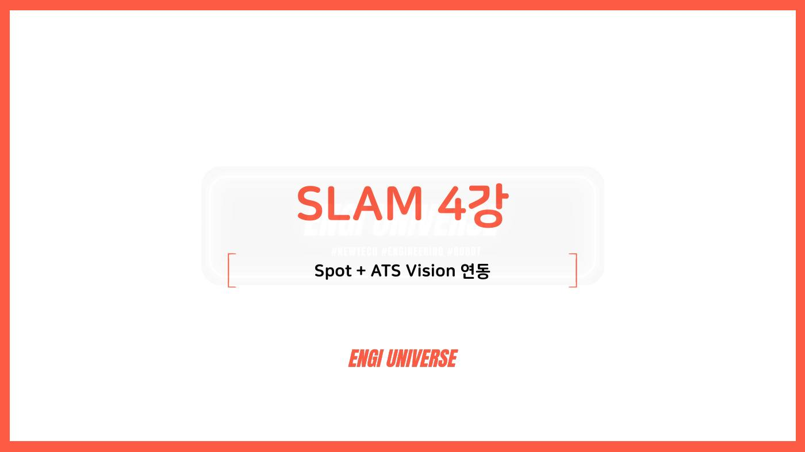{ width="720" }
/// caption
Spot + ATS Vision 연동 (YOLOv8) — 슬라이드 01 (출처: ENGI UNIVERSE)
///

- **이번 강의 목표**
    - YOLOv8을 통해 **Spot + ATS에 Vision 시스템 연동**
    - YOLOv8 패키지 **복습**
    - Spot + ATS에 맞는 YOLOv8 패키지 **연동**
- 앞서 SLAM으로 "내 위치"를 확보했다면, 이번 주차는 YOLO로 **"무엇을 봤는지"** 를 확보하는 단계입니다.

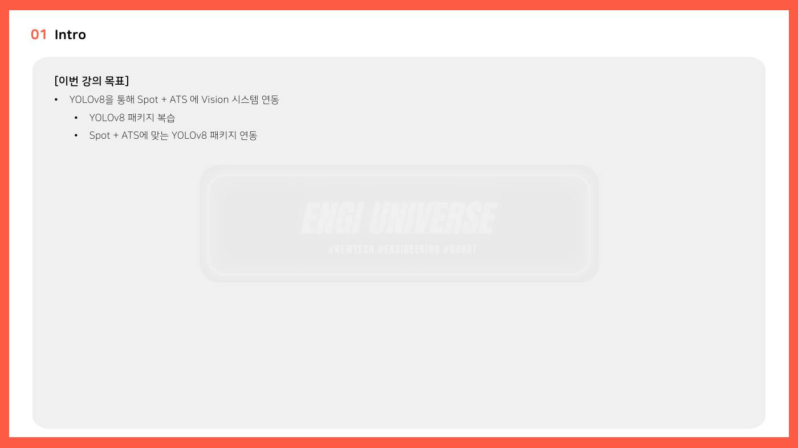{ width="720" }
/// caption
Spot + ATS Vision 연동 (YOLOv8) — 슬라이드 03 (출처: ENGI UNIVERSE)
///

---

## 🧩 2. YOLOv8 구조 — detector → tracker → debug

### 파이프라인 구성

- 검출(detector) → 추적(tracker) → 디버그(debug) 노드를 **하나의 네임스페이스(`/yolo/...`) 아래에서 일괄 실행**합니다.
- 카메라 토픽만 들어오면 즉시 **Detection → Tracking → Debug** 파이프라인이 활성화됩니다.

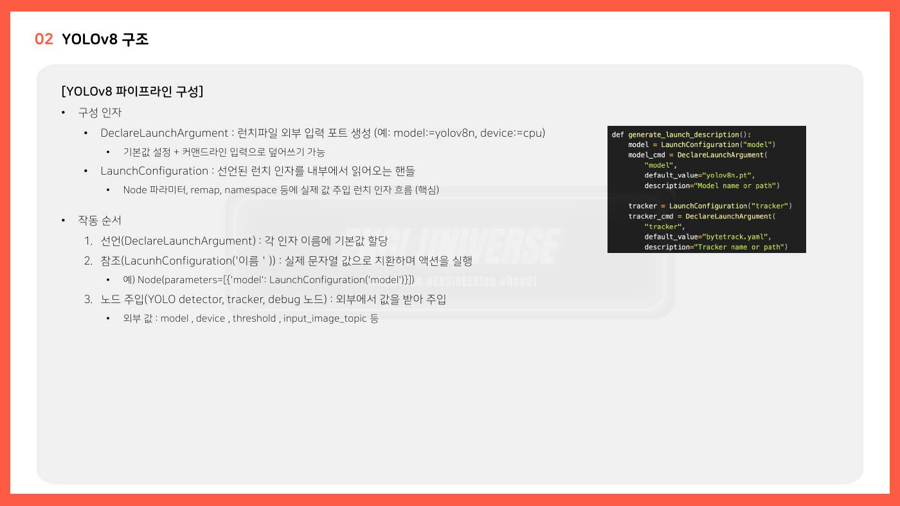{ width="720" }
/// caption
Spot + ATS Vision 연동 (YOLOv8) — 슬라이드 05 (출처: ENGI UNIVERSE)
///

### 런치 인자 흐름 (핵심)

런치 파일은 **외부 입력을 받아 노드 내부로 값을 주입**하는 구조입니다.

| 구성 인자 | 역할 |
| --- | --- |
| `DeclareLaunchArgument` | 런치파일 외부 입력 포트 생성 (예: `model:=yolov8n`, `device:=cpu`) |
| `LaunchConfiguration` | 선언된 런치 인자를 내부에서 읽어오는 핸들 |

기본값을 설정하되 커맨드라인 입력으로 덮어쓸 수 있고, 그 값을 Node 파라미터·remap·namespace 등에 실제로 주입합니다.

**작동 순서**

- **Step 1 — 선언(`DeclareLaunchArgument`)** : 각 인자 이름에 기본값 할당
- **Step 2 — 참조(`LaunchConfiguration('이름')`)** : 실제 문자열 값으로 치환하며 액션 실행
- **Step 3 — 노드 주입** : 외부에서 받은 값(`model`, `device`, `threshold`, `input_image_topic` 등)을 detector/tracker/debug 노드에 주입

```python
# 런치 인자를 노드 파라미터로 주입하는 형태 (교안 예시)
Node(parameters=[{'model': LaunchConfiguration('model')}])
```

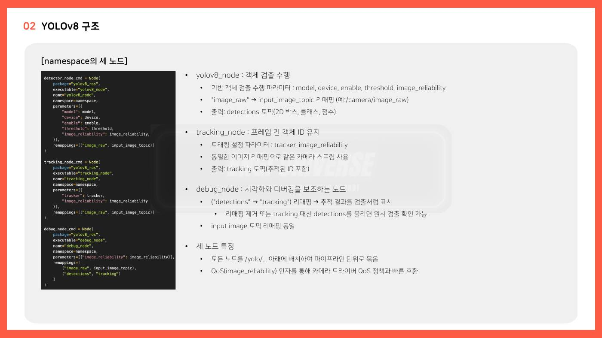{ width="720" }
/// caption
Spot + ATS Vision 연동 (YOLOv8) — 슬라이드 07 (출처: ENGI UNIVERSE)
///

!!! note "예시 파일은 실제 동작 코드가 아닙니다"
    교안의 예시 런치/노드 코드는 구조 이해를 돕기 위한 재구성으로, 그대로 실행되는 코드가 아닙니다.

### 외부화되는 구성 요소

| 인자 | 의미 |
| --- | --- |
| `model` | 모델 가중치 |
| `tracker` | 트래커 설정 (`bytetrack.yaml` / `botsort.yaml`) |
| `device` | 실행 디바이스 (기본: CPU / `device:=cuda:0` : GPU) |
| `enable` | 추론 시작 여부 |
| `threshold` | 최소 신뢰도 임계값 |
| `input_image_topic` | 이미지 토픽 이름 |
| `image_reliability` | 입력 이미지 토픽 QoS 설정 |
| `namespace` | detector / tracker / debug를 묶는 공통 네임스페이스 |

### namespace 아래의 세 노드

=== "yolov8_node (검출)"

    - 파라미터: `model`, `device`, `enable`, `threshold`, `image_reliability`
    - `"image_raw"` → `input_image_topic` 리매핑 (예: `/camera/image_raw`)
    - **출력**: `detections` 토픽(2D 박스, 클래스, 점수)

=== "tracking_node (추적)"

    - 파라미터: `tracker`, `image_reliability`
    - 동일한 이미지 리매핑으로 같은 카메라 스트림 사용
    - **출력**: `tracking` 토픽(추적된 ID 포함)

=== "debug_node (시각화)"

    - `("detections" → "tracking")` 리매핑 → 추적 결과를 검출처럼 표시
    - 리매핑을 제거하거나 `tracking` 대신 `detections`를 물리면 **원시 검출** 확인 가능

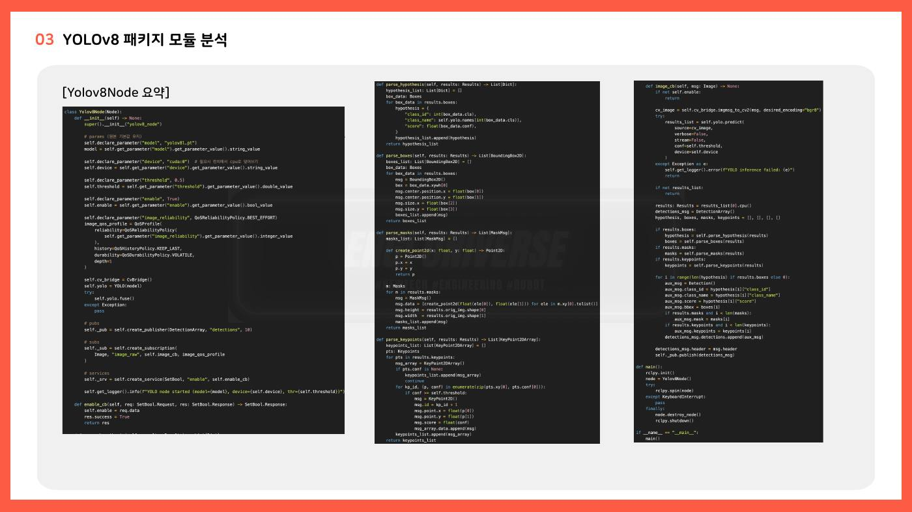{ width="720" }
/// caption
Spot + ATS Vision 연동 (YOLOv8) — 슬라이드 09 (출처: ENGI UNIVERSE)
///

!!! tip "런치 파일의 가치"
    `input_image_topic`, `image_reliability`(QoS), `model`, `device`, `threshold`, `namespace`를 런치 인자로 외부화했기 때문에, **토픽명 변경·GPU/CPU 전환·임계치 조정**이 필요해도 파일 수정 없이 실행 인자만 바꿔 재사용할 수 있습니다.

---

## 🔬 3. YOLOv8 패키지 모듈 분석

### 3-1. yolov8_node (이미지 입력 → 추론 → 퍼블리시)

- **Step 1 — 이미지 입력 처리** : `/image_raw`를 QoS 설정에 따라 구독 → `CvBridge`로 ROS Image → OpenCV BGR 배열 변환 → Ultralytics YOLO(`model`)에 전달
- **Step 2 — 추론 & 결과 파싱** : Results에서 클래스/점수/바운딩박스/마스크/키포인트 파싱 → `yolov8_msgs/DetectionArray`로 묶어 `detections` 토픽으로 퍼블리시
- **Step 3 — 설정 파라미터** : 런치 인자/파라미터 서버에서 `model`, `device`, `threshold`, `image_reliability`, `enable`을 받아 현장 환경에 맞게 추론 조건 조정
- **Step 4 — ON/OFF 제어** : `std_srvs/SetBool` 서비스 `/enable`로 추론을 실시간으로 켜고 끔

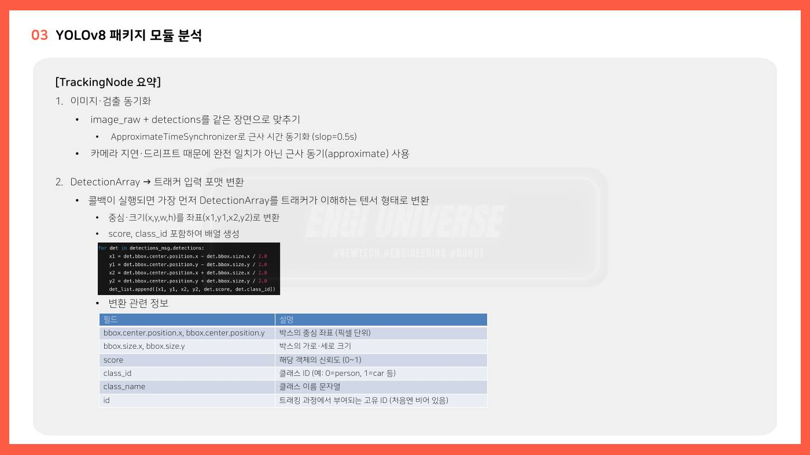{ width="720" }
/// caption
Spot + ATS Vision 연동 (YOLOv8) — 슬라이드 12 (출처: ENGI UNIVERSE)
///

### 3-2. tracking_node (프레임 간 ID 유지)

- **이미지·검출 동기화** : `image_raw` + `detections`를 `ApproximateTimeSynchronizer`로 **근사 시간 동기**(slop=0.5s) — 카메라 지연·드리프트 때문에 완전 일치가 아닌 approximate 사용
- **포맷 변환** : `DetectionArray`를 트래커 입력 텐서로 변환. 중심·크기 `(x,y,w,h)` → 좌표 `(x1,y1,x2,y2)`, `score`·`class_id` 포함

| 필드 | 설명 |
| --- | --- |
| `bbox.center.position.x/y` | 박스 중심 좌표 (픽셀) |
| `bbox.size.x/y` | 박스 가로·세로 크기 |
| `score` | 신뢰도 (0~1) |
| `class_id` | 클래스 ID (예: 0=person, 1=car) |
| `class_name` | 클래스 이름 문자열 |
| `id` | 트래킹 고유 ID (처음엔 비어 있음) |

**트래킹 수행 및 보정** — `tracker.update()`가 이전 프레임과 비교해 동일 객체를 연결(Track ID 부여)하고, 보정된 박스 `xywh`로 Detection의 `bbox.center/size`를 갱신합니다.

| frame | box_center | score | class_name | id |
| --- | --- | --- | --- | --- |
| 1 | (320,240) | 0.90 | person | — |
| 1 | (100,200) | 0.80 | person | — |
| 1 | (500,210) | 0.70 | person | — |
| 2 | (325,243) | 0.88 | person | 1 |
| 2 | (105,204) | 0.79 | person | 2 |
| 2 | (505,213) | 0.71 | person | 3 |

→ 1프레임에서는 ID가 비어 있다가, 2프레임에서 동일 객체에 일관된 ID(1·2·3)가 부여됩니다.

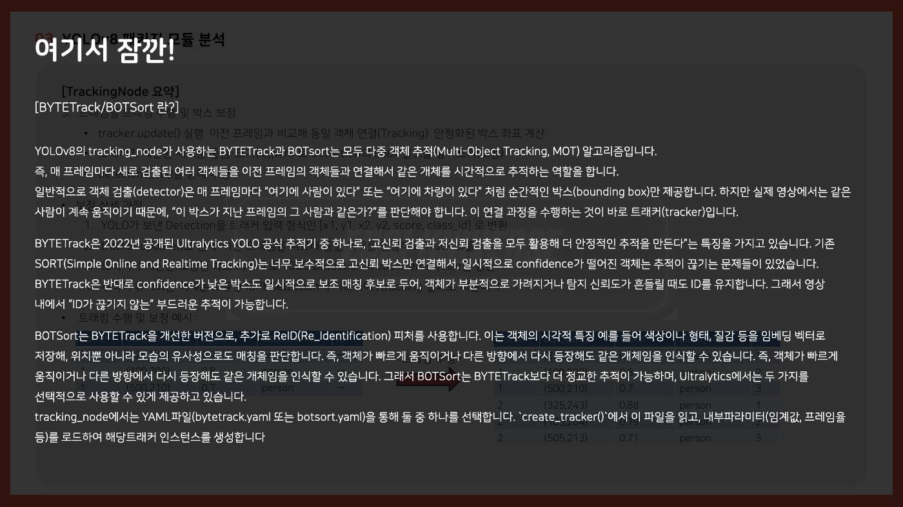{ width="720" }
/// caption
Spot + ATS Vision 연동 (YOLOv8) — 슬라이드 15 (출처: ENGI UNIVERSE)
///

!!! note "여기서 잠깐 — BYTETrack / BOTSort 란?"
    둘 다 다중 객체 추적(Multi-Object Tracking, MOT) 알고리즘으로, 매 프레임 새로 검출된 객체를 이전 프레임 객체와 연결합니다.

    - **BYTETrack** (2022, Ultralytics 공식 추적기 중 하나): **고신뢰 검출 + 저신뢰 검출을 모두 활용**해 더 안정적인 추적. 기존 SORT가 고신뢰 박스만 연결해 일시적으로 confidence가 떨어지면 추적이 끊기던 문제를 보완 → 부분 가려짐에도 ID 유지.
    - **BOTSort**: BYTETrack을 개선한 버전으로 **ReID(Re-Identification) 피처**(색상·형태·질감 등 시각 특징의 임베딩)를 추가 사용 → 위치뿐 아니라 모습 유사성으로도 매칭. 객체가 빠르게 움직이거나 다른 방향에서 재등장해도 동일 개체 인식.
    - `tracking_node`는 YAML(`bytetrack.yaml` / `botsort.yaml`)을 읽어 `create_tracker()`로 둘 중 하나의 인스턴스를 생성합니다.

**트래커 업데이트 & 트랙 매칭 (상세)**

```python
# 교안 재구성 — 트래커 업데이트와 Detection 보정 흐름
tracks = self.tracker.update(det_boxes, cv_image)  # 이전·현재 프레임 비교 → 동일 객체 연결
for t in tracks:
    src_idx = t[-1]                                # 원본 검출 인덱스 매칭
    tracked_box = Boxes(t[:-1], ...)               # 보정된 박스 객체
    cx, cy, w, h = tracked_box.xywh[0]             # 새 중심·크기
    # 원래 Detection의 bbox.center / bbox.size 에 덮어쓰기(보정)
    if tracked_box.is_track:
        detection.id = str(int(tracked_box.id))    # 동일 객체는 항상 같은 ID 유지
```

- 반환값 `tracks` = 보정된 바운딩박스 + 대응하는 **원본 Detection 인덱스**
- 원본 Detection의 클래스/신뢰도 등 메타데이터는 그대로 유지 → YOLO의 흔들리는 박스를 **안정화된 박스로 교체**

!!! tip "QoS(image_reliability) 선택"
    - 무선·시뮬레이터 환경 → **Best Effort** (드롭이 있어도 지연 최소화)
    - 로깅·재현성 중요 → **Reliable** (프레임 손실 최소화)
    - 전달된 정수값(0/1/2)을 ROS 2 QoS 프로필로 자동 매핑하며, 런치 인자로 파일 수정 없이 즉시 변경 가능합니다.

### 3-3. debug_node (시각화·디버깅)

- **입력 & 리매핑** : 기본 입력 `image_raw` + `detections`, 런치에서 `("detections", "tracking")`으로 리매핑 → **트래킹 결과**를 그려서 표시
- **화면 시각화** : 바운딩박스 + 클래스명 + 점수 + 트랙 ID 오버레이, 마스크 → 반투명 폴리곤, 키포인트 → 관절 뼈대 라인 → `/dbg_image` 퍼블리시 + 로컬 OpenCV 윈도우 실시간 확인
- **파이프라인 내 역할** : 최종 흐름은 `image_raw → YOLO(det) → Tracking → Debug(시각화)`, 네임스페이스로 `yolo/cam0`, `yolo/cam1` 식 다중 카메라 충돌 없이 확장

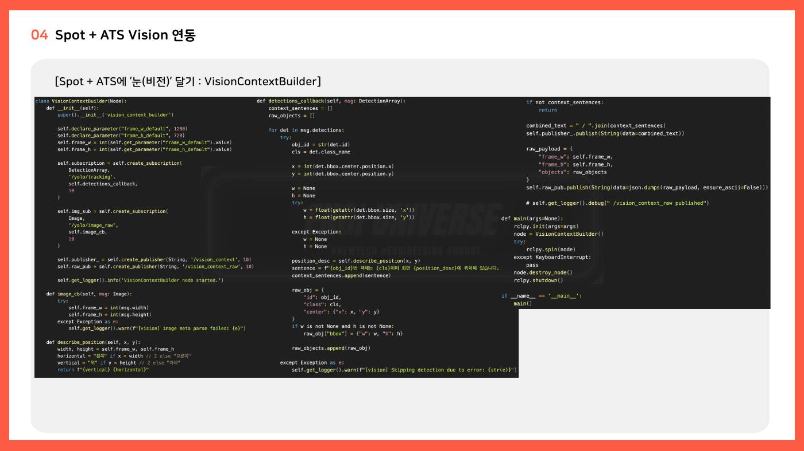{ width="720" }
/// caption
Spot + ATS Vision 연동 (YOLOv8) — 슬라이드 22 (출처: ENGI UNIVERSE)
///

---

## 🤖 4. Spot + ATS Vision 연동

### Spot + ATS에 '눈(비전)' 달기

- YOLOv8 비전 모듈 + Spot + ATS 시스템 연동 → 실제 환경에서 대상을 인식·추적·반응하는 **closed-loop** 구축
- **핵심 설계 2가지**
    - `/ats_twist` : 카메라 화면 **중심에 목표를 맞추기 위한** 제어 신호
    - `/cmd_vel` : 대상을 **일정한 거리에서 따라가기 위한** 이동 속도

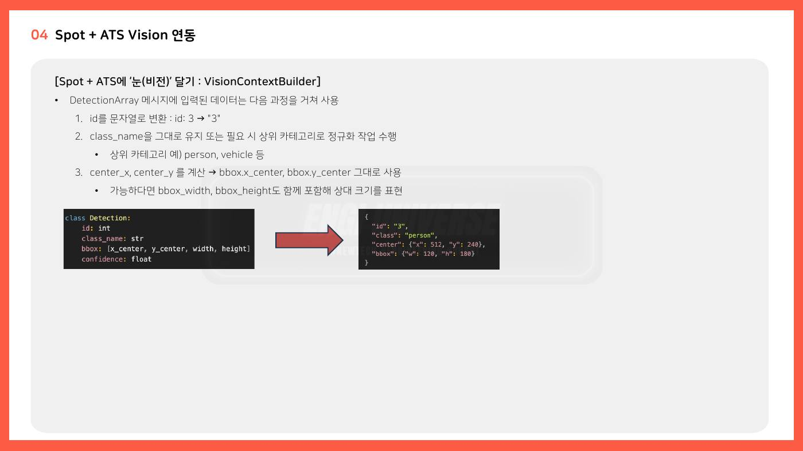{ width="720" }
/// caption
Spot + ATS Vision 연동 (YOLOv8) — 슬라이드 24 (출처: ENGI UNIVERSE)
///

### graph_builder.py — YOLO 파이프라인 입력값 생성

- `GraphBuilder.build_camera_ros_graph()`가 RGB 프레임을 ROS로 퍼블리시 → 카메라 영상은 `/yolo/image_raw`로 출력(YOLO 파이프라인의 입력)
- `yolov8_node` : `/yolo/image_raw` 구독 → Ultralytics YOLO 추론 → `yolov8_msgs/DetectionArray`를 `/yolo/detections`로 퍼블리시
- `tracking_node` : 이미지 + detections를 타임싱크로 묶어 ByteTrack/BOTSort로 추적 갱신 → 각 객체에 일관된 `id` 부여 후 `/yolo/tracking`으로 발행

### VisionContextBuilder — 트랙 결과 → 비전 컨텍스트

**역할** : `/yolo/tracking` + `/yolo/image_raw`를 함께 구독하여 **"무엇을 봤는가 + 어느 프레임에서 봤는가"** 를 한 컨텍스트로 묶습니다.

- **이미지 정보 활용** : `/yolo/image_raw` 콜백에서 매 프레임 `frame_w`, `frame_h` 자동 갱신 → 화면 중심 `(frame_w/2, frame_h/2)` 기준으로 대상 중심과의 오차 **Δx, Δy** 계산
- **동적 스케일 대응** : 해상도가 바뀌거나 리사이즈되어도 하드코딩 없이 자동 보정 → 후단 제어기가 해상도와 무관하게 같은 스케일로 오차 해석
- **검출 결과 정규화** : `/yolo/tracking` 콜백에서 각 객체 Detection을 순회하며 통일된 포맷으로 정리

**DetectionArray 입력 데이터 처리**

- **Step 1 —** `id`를 문자열로 변환 (`id: 3` → `"3"`)
- **Step 2 —** `class_name`을 그대로 유지하거나 상위 카테고리로 정규화 (예: `person`, `vehicle`)
- **Step 3 —** `center_x`, `center_y`를 `bbox.x_center`, `bbox.y_center`로 사용 (가능하면 `bbox_width`, `bbox_height`로 상대 크기 표현)

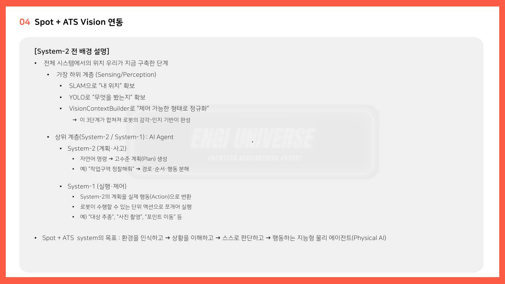{ width="720" }
/// caption
Spot + ATS Vision 연동 (YOLOv8) — 슬라이드 26 (출처: ENGI UNIVERSE)
///

**두 가지 포맷으로 퍼블리시**

=== "/vision_context (사람이 읽는 텍스트)"

    > "현재 프레임에서 2명의 사람이 감지되었습니다"
    > "가장 가까운 대상은 ID3, 중앙 기준 왼쪽 상단 방향에 위치해 있습니다"

=== "/vision_context_raw (System-1용 JSON)"

    System-1에서 사용할 수 있는 표준 JSON 포맷으로 객체별 `id`·`class`·중심좌표·크기를 정규화하여 발행

!!! success "System-2 전 배경 — 우리가 지금 구축한 단계"
    가장 하위 계층(Sensing/Perception)을 완성하는 단계입니다.

    - SLAM으로 **"내 위치"** 확보 → YOLO로 **"무엇을 봤는지"** 확보 → VisionContextBuilder로 **"제어 가능한 형태로 정규화"**
    - 이 3단계가 합쳐져 로봇의 **감각-인지 기반**이 완성되고, 그 위에 상위 계층(**System-2**: 자연어→계획, **System-1**: 계획→행동)이 올라갑니다.
    - Spot + ATS의 목표: 환경을 **인식 → 이해 → 판단 → 행동**하는 지능형 물리 에이전트(Physical AI).

---

## 🧷 5. Wrap-up

오늘 강의 요약:

1. YOLO 모듈 **패키지를 분석** (detector·tracker·debug 노드 구조)
2. **Spot + ATS 시스템과 YOLO 연동** (graph_builder → VisionContextBuilder)
3. **System 구조 분석을 통한 확장 계획** (Sensing/Perception → System-1/System-2)

{ width="720" }
/// caption
Spot + ATS Vision 연동 (YOLOv8) — 슬라이드 28 (출처: ENGI UNIVERSE)
///

## ✅ 체크포인트

- [ ] detector → tracker → debug 노드가 하나의 네임스페이스에서 어떻게 묶이는지 설명할 수 있는가
- [ ] `DeclareLaunchArgument` / `LaunchConfiguration`로 `model`·`device`·`threshold`를 외부화하는 흐름을 이해했는가
- [ ] BYTETrack과 BOTSort의 차이(저신뢰 박스 활용 vs ReID 피처)를 구분할 수 있는가
- [ ] `tracking_node`가 보정된 박스로 Detection을 갱신하고 일관된 ID를 유지하는 과정을 설명할 수 있는가
- [ ] VisionContextBuilder가 화면 중심 오차(Δx, Δy)를 계산해 `/vision_context`로 내보내는 의미를 이해했는가

## 📊 평가 루브릭

| 항목 | 배점 | 기준 |
| --- | --- | --- |
| YOLOv8 파이프라인 이해 | 25 | detector/tracker/debug 노드와 네임스페이스 구조 설명 |
| 런치 인자 외부화 | 20 | `DeclareLaunchArgument`·`LaunchConfiguration` 흐름 정확성 |
| 트래킹 원리 | 20 | ApproximateTimeSync·BYTETrack/BOTSort·ID 유지 설명 |
| Spot+ATS 연동 | 20 | graph_builder·VisionContextBuilder·`/ats_twist`·`/cmd_vel` 이해 |
| 시스템 계층 이해 | 15 | Sensing/Perception → System-1/System-2 확장 설명 |

## 🔗 출처 및 참고자료

- 교안 **「Spot + ATS Vision 연동 (YOLOv8)」** (제작: ENGI UNIVERSE)
- Ultralytics YOLOv8 — <https://docs.ultralytics.com>
- ByteTrack — <https://github.com/ifzhang/ByteTrack>
- ROS 2 QoS 설정 — <https://docs.ros.org/en/rolling/Concepts/Intermediate/About-Quality-of-Service-Settings.html>

## 📖 핵심 용어 설명

### YOLOv8 (You Only Look Once v8)
- **정의**: Ultralytics가 개발한 실시간 객체 검출(Object Detection) 딥러닝 모델로, 한 장의 이미지를 한 번만 신경망에 통과시켜 객체의 위치(바운딩박스)·클래스·신뢰도를 동시에 예측합니다.
- **역할/왜 중요한가**: 이번 주차 비전 파이프라인의 **눈** 역할을 합니다. SLAM이 "내 위치"를 알려준다면 YOLOv8은 "무엇을 봤는지"를 알려줍니다.
- **맥락·예시**: `model:=yolov8n`처럼 가중치를 런치 인자로 지정하며, `yolov8n`(nano)은 가볍고 빠른 경량 모델이라 CPU 환경에서도 동작합니다.

### detector → tracker → debug 파이프라인
- **정의**: 검출(`yolov8_node`) → 추적(`tracking_node`) → 시각화(`debug_node`) 세 노드를 순서대로 연결한 ROS 2 처리 흐름입니다.
- **역할/왜 중요한가**: 각 단계가 역할을 분담(검출=무엇을 봤나, 추적=같은 객체에 ID 부여, 디버그=화면 확인)하여 모듈화된 비전 시스템을 만듭니다.
- **맥락·예시**: 본문 2장에서 세 노드를 하나의 네임스페이스(`/yolo/...`) 아래에서 일괄 실행하며, 카메라 토픽만 들어오면 전체 파이프라인이 활성화됩니다.

### 네임스페이스 (namespace)
- **정의**: ROS 2에서 노드·토픽 이름 앞에 공통 접두어를 붙여 묶는 이름 공간입니다. 예: `/yolo/detections`, `/yolo/tracking`.
- **역할/왜 중요한가**: 같은 노드를 여러 개 띄워도 이름 충돌 없이 구분할 수 있어 **다중 카메라 확장**이 쉬워집니다.
- **맥락·예시**: 본문에서 `yolo/cam0`, `yolo/cam1` 식으로 카메라별 파이프라인을 충돌 없이 운영하는 근거가 됩니다.

### DeclareLaunchArgument / LaunchConfiguration
- **정의**: `DeclareLaunchArgument`는 런치 파일이 외부에서 값을 받는 **입력 포트**를 선언하고, `LaunchConfiguration`은 선언된 그 값을 노드 내부에서 **읽어오는 핸들**입니다.
- **역할/왜 중요한가**: 토픽명·디바이스·임계값 같은 설정을 코드에 하드코딩하지 않고 **실행 시 커맨드라인 인자**로 바꿀 수 있게 해, 파일 수정 없이 재사용 가능한 런치 구조를 만듭니다.
- **맥락·예시**: 본문 작동 순서 Step 1~3에서 `model:=yolov8n`, `device:=cuda:0` 같은 값을 선언·참조·주입하는 흐름으로 설명됩니다.

### CvBridge
- **정의**: ROS의 이미지 메시지(`sensor_msgs/Image`)와 OpenCV 이미지 배열(BGR numpy)을 서로 변환해주는 라이브러리입니다.
- **역할/왜 중요한가**: ROS로 들어온 카메라 영상을 YOLO/OpenCV가 처리할 수 있는 형식으로 바꿔주는 **다리** 역할입니다.
- **맥락·예시**: `yolov8_node`의 Step 1에서 `/image_raw`를 구독한 뒤 CvBridge로 변환해 Ultralytics YOLO에 전달합니다.

### DetectionArray (`yolov8_msgs/DetectionArray`)
- **정의**: 한 프레임에서 검출된 여러 객체의 정보(바운딩박스 중심·크기, 점수, 클래스 ID/이름, 트랙 ID 등)를 담는 ROS 2 커스텀 메시지 타입입니다.
- **역할/왜 중요한가**: 검출 결과를 표준 포맷으로 묶어 노드 간(detector→tracker→VisionContext)에 일관되게 전달합니다.
- **맥락·예시**: 본문 3-2의 필드 표(`bbox.center.position.x/y`, `score`, `class_id`, `id` 등)가 이 메시지의 구조입니다.

### ApproximateTimeSynchronizer
- **정의**: 타임스탬프가 정확히 일치하지 않는 두 개 이상의 토픽을 **근사 시간**으로 짝지어 한 콜백에서 함께 처리하게 하는 ROS 2 메시지 동기화 도구입니다.
- **역할/왜 중요한가**: 카메라 지연·드리프트 때문에 이미지와 검출 결과의 시각이 완전히 같지 않으므로, 가까운 시각끼리 묶어 추적 입력을 만듭니다.
- **맥락·예시**: `tracking_node`가 `image_raw` + `detections`를 `slop=0.5s`(허용 시간차 0.5초)로 동기화합니다.

### BYTETrack / BOTSort
- **정의**: 둘 다 다중 객체 추적(Multi-Object Tracking, MOT) 알고리즘으로, 매 프레임의 검출 결과를 이전 프레임 객체와 연결해 동일 개체에 같은 ID를 유지합니다.
- **역할/왜 중요한가**: 검출만으로는 "이 사람과 저 사람이 같은 사람인지" 알 수 없는데, 추적기가 프레임 간 **ID 일관성**을 부여해 추종 제어가 가능해집니다.
- **맥락·예시**: **BYTETrack**은 저신뢰 검출까지 활용해 가려짐에도 ID를 유지하고, **BOTSort**는 ReID 피처를 추가로 사용합니다. `tracking_node`가 `bytetrack.yaml`/`botsort.yaml`을 읽어 둘 중 하나를 생성합니다.

### ReID (Re-Identification)
- **정의**: 객체의 색상·형태·질감 같은 시각적 특징을 임베딩(숫자 벡터)으로 추출해, 위치가 아니라 **외형 유사성**으로 동일 객체를 다시 식별하는 기법입니다.
- **역할/왜 중요한가**: 객체가 빠르게 움직이거나 화면에서 사라졌다가 다른 위치에서 재등장해도 같은 ID를 유지할 수 있게 합니다.
- **맥락·예시**: BOTSort가 BYTETrack 대비 추가로 사용하는 핵심 기능으로 본문 3-2에서 설명됩니다.

### QoS / image_reliability
- **정의**: QoS(Quality of Service)는 ROS 2에서 메시지 전달 신뢰성·지연 등을 정하는 통신 정책이며, `image_reliability`는 이미지 토픽의 QoS를 런치 인자(정수 0/1/2)로 지정하는 파라미터입니다.
- **역할/왜 중요한가**: 환경에 맞춰 통신 방식을 선택할 수 있게 합니다. **Best Effort**는 드롭을 허용해 지연을 줄이고, **Reliable**은 손실을 최소화합니다.
- **맥락·예시**: 무선·시뮬레이터에서는 Best Effort, 로깅·재현이 중요하면 Reliable을 쓰며 파일 수정 없이 인자로 전환합니다.

### VisionContextBuilder
- **정의**: `/yolo/tracking`(추적 결과)과 `/yolo/image_raw`(영상)를 함께 구독해 "무엇을 봤는가 + 어느 프레임에서 봤는가"를 하나의 **비전 컨텍스트**로 묶는 모듈입니다.
- **역할/왜 중요한가**: 화면 중심 `(frame_w/2, frame_h/2)` 기준으로 대상과의 오차 **Δx, Δy**를 계산해, 후단 제어기가 해상도와 무관하게 사용할 수 있는 정규화된 정보를 만듭니다.
- **맥락·예시**: 결과를 사람이 읽는 `/vision_context`와 System-1용 JSON인 `/vision_context_raw` 두 포맷으로 발행합니다(본문 4장).

### closed-loop (`/ats_twist`, `/cmd_vel`)
- **정의**: closed-loop(폐루프)는 센서로 관측한 결과를 다시 제어 입력으로 되먹임하는 구조입니다. 여기서 `/ats_twist`는 화면 중심에 목표를 맞추는 짐벌/카메라 제어 신호, `/cmd_vel`은 대상을 일정 거리에서 따라가기 위한 로봇 이동 속도 명령입니다.
- **역할/왜 중요한가**: "보고 → 오차 계산 → 움직여서 보정 → 다시 본다"의 순환을 만들어, Spot+ATS가 대상을 능동적으로 인식·추적·추종하게 합니다.
- **맥락·예시**: VisionContextBuilder가 산출한 Δx, Δy 오차가 `/ats_twist`·`/cmd_vel` 제어의 입력 근거가 됩니다(본문 4장).

## 📝 10주차 과제

!!! example "과제 10 — YOLOv8 Vision을 Spot+ATS에 연동"
    **목표**: YOLOv8 detector→tracker→debug 파이프라인을 구성하고 카메라 토픽에 연동해 실시간 객체 탐지·추적을 확인한다.

**과제 흐름도**

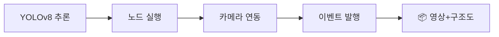
```mermaid
graph LR
  A[YOLOv8 추론] --> B[노드 실행] --> C[카메라 연동] --> D[이벤트 발행] --> E[📦 영상+구조도]
```

**수행 단계**

1. YOLOv8 단독 추론 테스트
2. detector/tracker/debug 노드 네임스페이스 일괄 실행
3. 카메라 토픽 연동 실시간 탐지 확인
4. 특정 클래스 탐지 시 이벤트(로그/토픽) 발행

**제출물**

- [ ] YOLOv8 연동 코드/런치
- [ ] 실시간 탐지·추적 영상
- [ ] 탐지 결과 토픽 echo 로그
- [ ] 파이프라인 구조도(detector→tracker→debug)

**평가 (배점 100)**

| 항목 | 배점 | 기준 |
| --- | --- | --- |
| YOLOv8 추론 | 30 | 탐지 동작 |
| ROS 연동·추적 | 45 | 실시간 파이프라인 |
| 이벤트 처리 | 25 | 클래스 조건 발행 |

**제출 형식·마감**: 다음 주차 강의 시작 전까지 LMS 업로드 — ① 코드/설정 `zip` ② 보고서 `PDF`(표지: 학번·이름·과제명) ③ 실행 결과 스크린샷/영상. 코드는 재현 가능해야 하며, 외부 코드를 사용하면 출처를 명시한다(미표기 시 감점).

<!-- FULLDECK -->
## 🖼️ 원본 강의 슬라이드

??? note "원본 강의 슬라이드 전체 (28매)"
    { width="700" }
    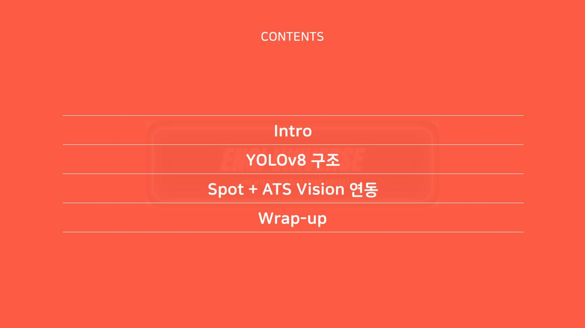{ width="700" }
    { width="700" }
    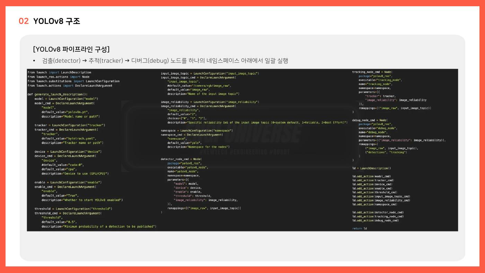{ width="700" }
    { width="700" }
    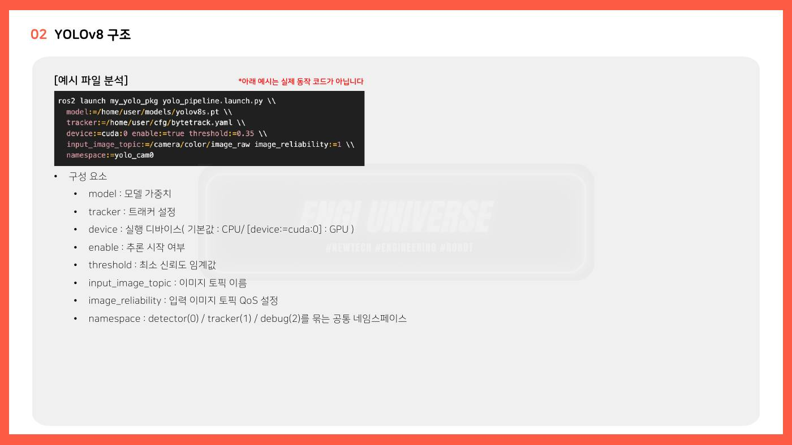{ width="700" }
    { width="700" }
    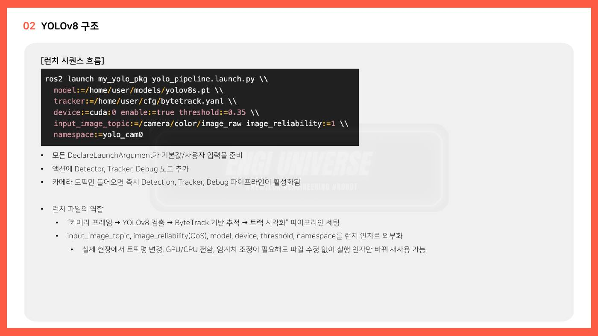{ width="700" }
    { width="700" }
    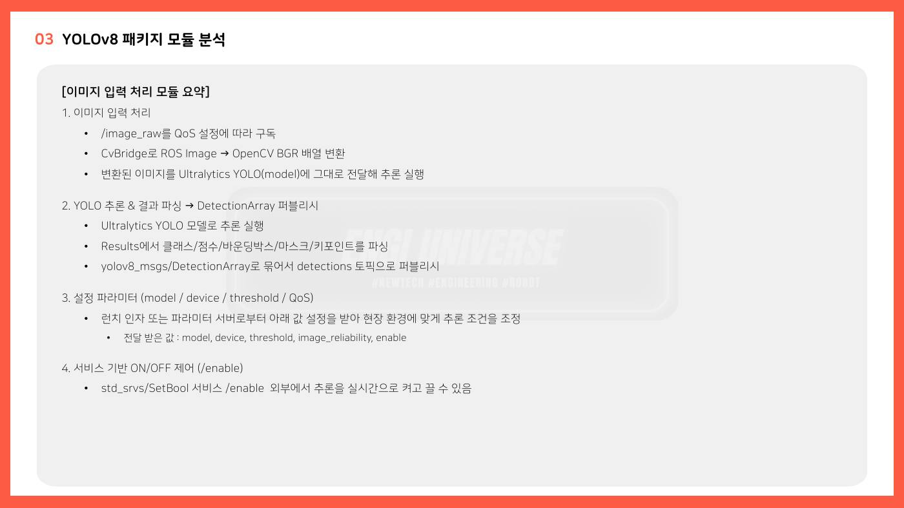{ width="700" }
    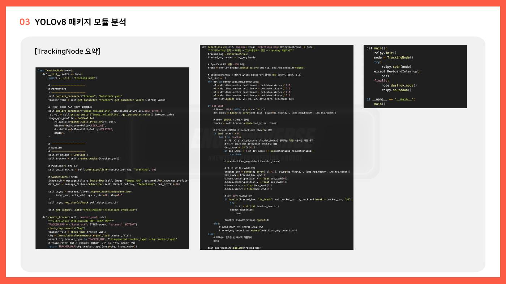{ width="700" }
    { width="700" }
    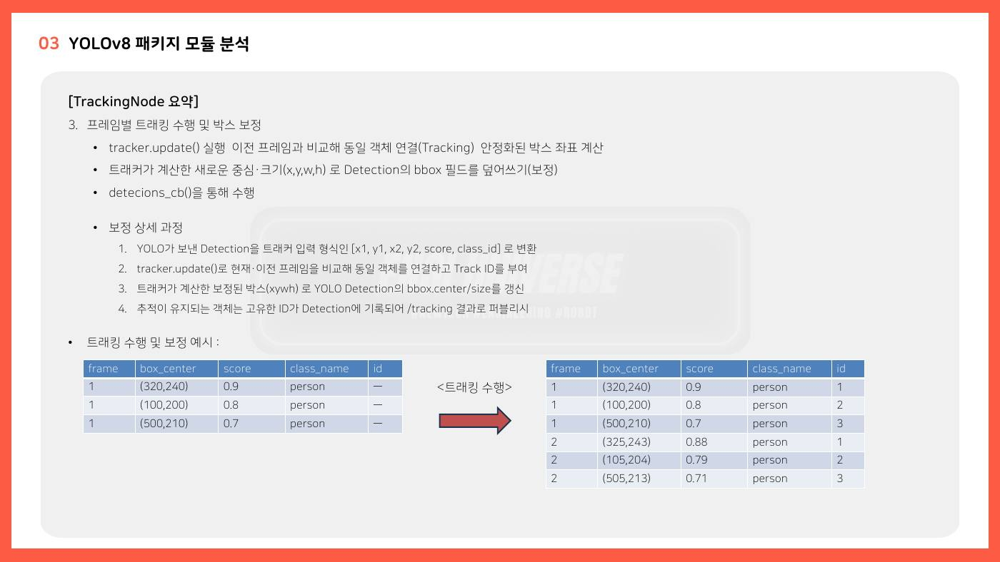{ width="700" }
    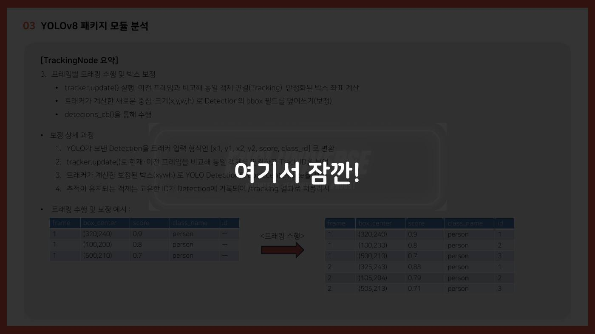{ width="700" }
    { width="700" }
    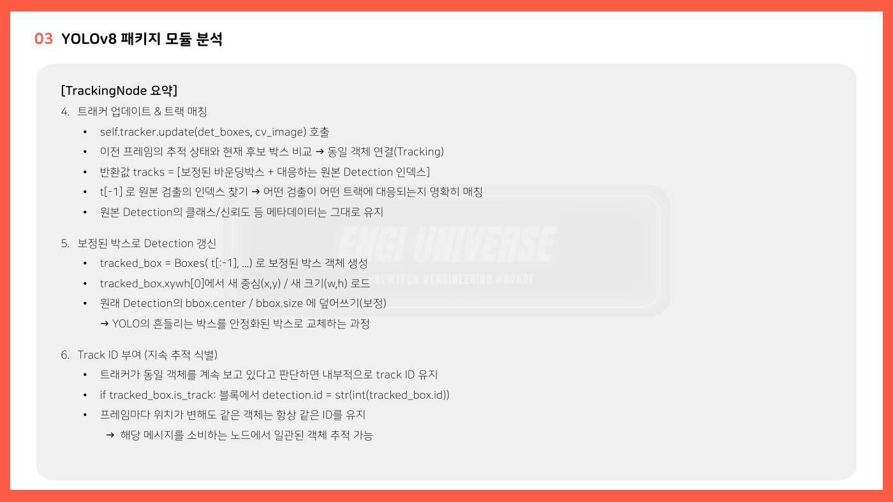{ width="700" }
    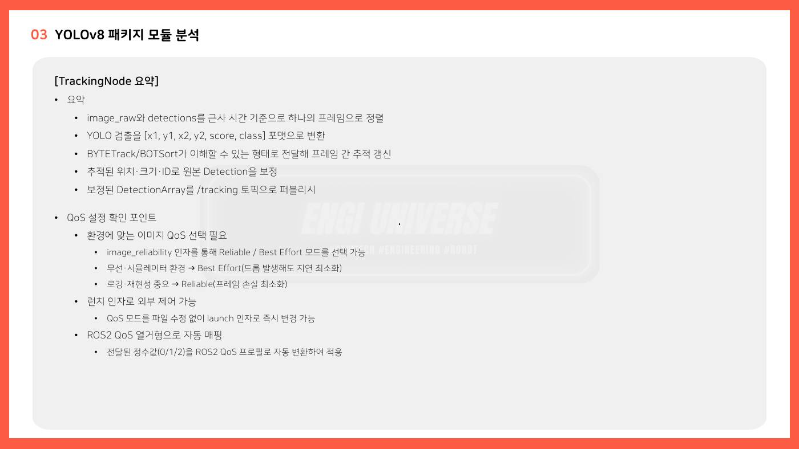{ width="700" }
    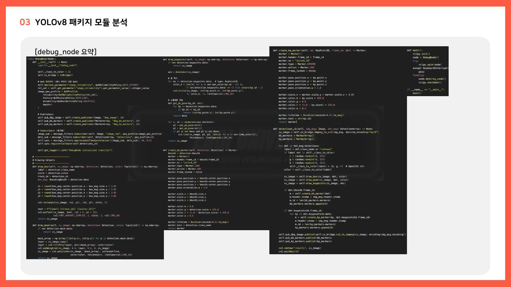{ width="700" }
    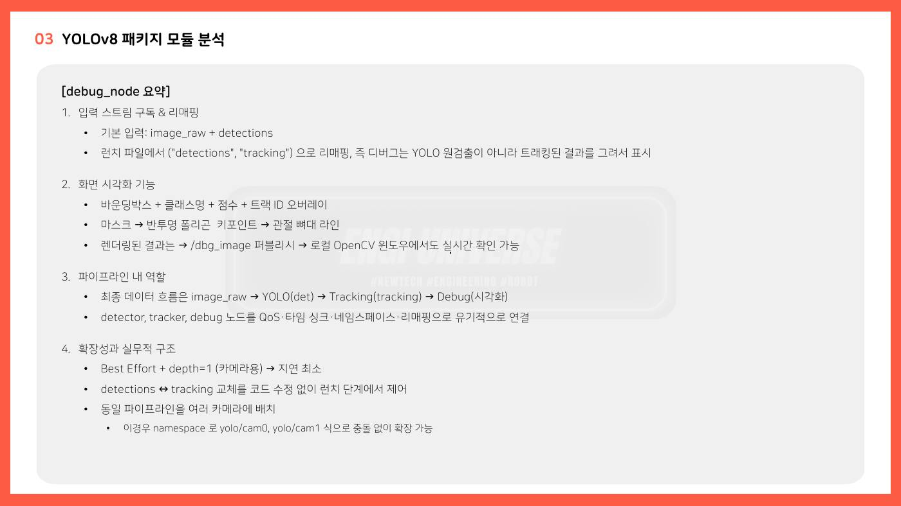{ width="700" }
    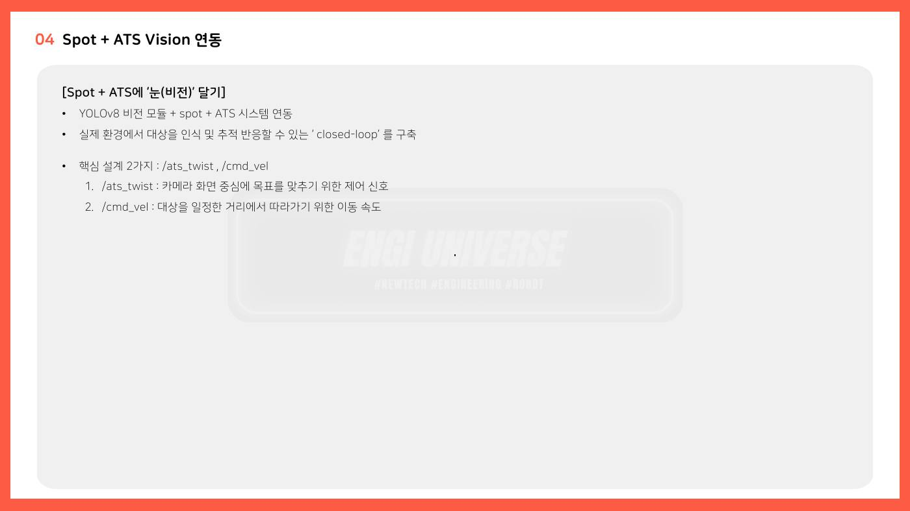{ width="700" }
    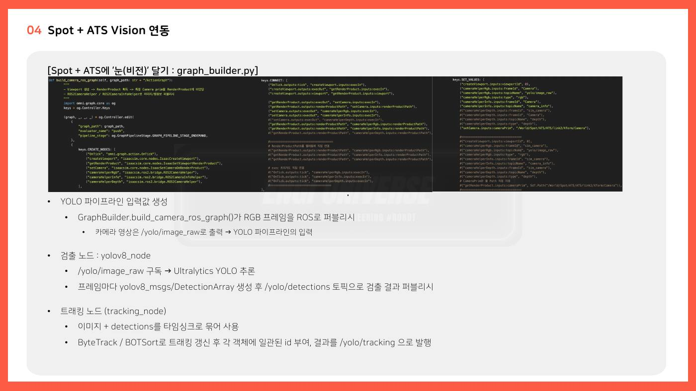{ width="700" }
    { width="700" }
    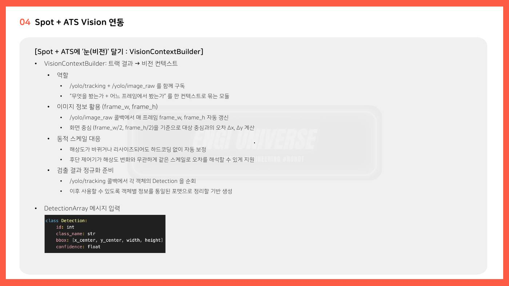{ width="700" }
    { width="700" }
    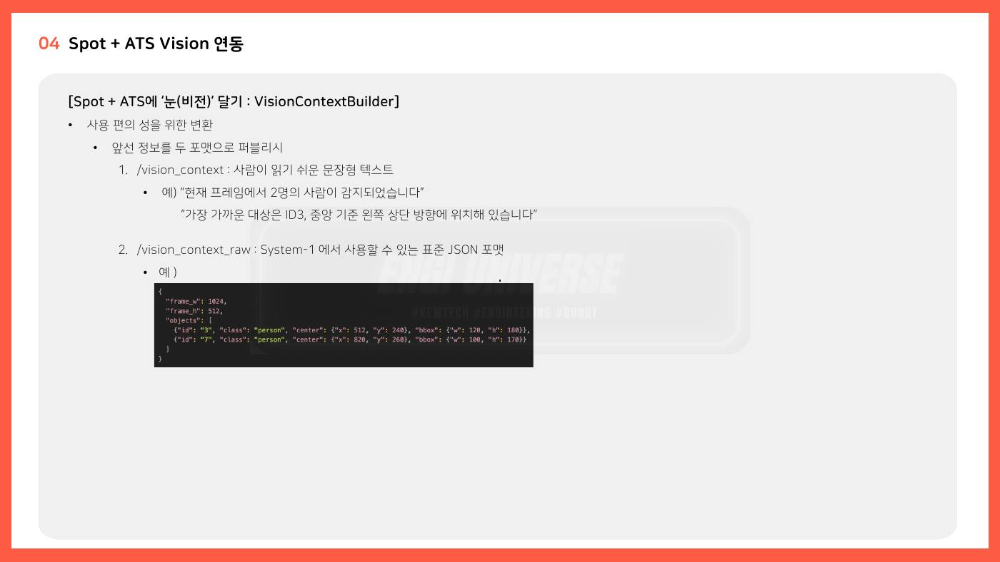{ width="700" }
    { width="700" }
    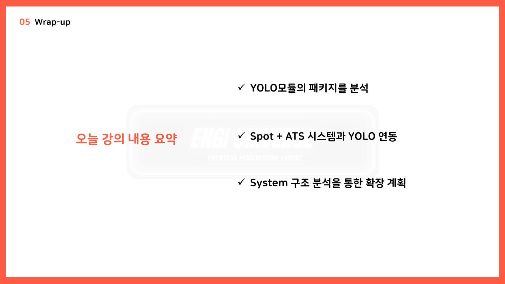{ width="700" }
    { width="700" }
