# 10주차 — Spot + ATS Vision 연동 (YOLOv8)

!!! abstract "학습목표"
    **YOLOv8** 객체 검출 패키지를 복습하고, 검출(detector) → 추적(tracker) → 디버그(debug) 노드로 이어지는 ROS 2 파이프라인 구조를 이해한다. 이를 **Spot + ATS** 시스템에 연동하여 카메라로 대상을 인식·추적하고, 화면 중심 오차와 추종 속도를 산출하는 **비전 기반 closed-loop**의 입력 계층(Sensing/Perception)을 구축한다.

!!! quote "출처 (Source)"
    본 자료의 그림·예제는 교안 **「Spot + ATS Vision 연동 (YOLOv8)」**(제작: *ENGI UNIVERSE*)를 바탕으로 재구성하였습니다. 코드·파라미터는 교안의 설명을 충실히 따른 **재구성 예제**이며, 일부 슬라이드는 "실제 동작 코드가 아님"을 전제로 합니다.

!!! note "강의 흐름 (FLOW)"
    `카메라` → `YOLOv8 detector` → `tracker` → `debug` → `ATS 연동`

## ⏱️ 3시간 구성

| 교시 | 시간 | 내용 | 근거 교안 |
| --- | --- | --- | --- |
| 1교시 | 50분 | Intro & YOLOv8 파이프라인 런치 구조(인자/네임스페이스) | §01~02 |
| 2교시 | 50분 | YOLOv8 패키지 모듈 분석(detector·tracker·debug 노드) | §03 |
| 3교시 | 50분 | Spot + ATS Vision 연동(graph_builder·VisionContext) & Wrap-up | §04~05 |

---

## 🧭 1. Intro — 왜 Vision을 붙이는가

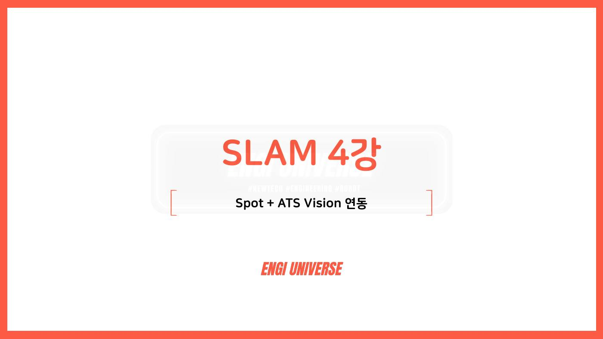{ width="720" }
/// caption
Spot + ATS Vision 연동 (YOLOv8) — 슬라이드 01 (출처: ENGI UNIVERSE)
///

- **이번 강의 목표**
    - YOLOv8을 통해 **Spot + ATS에 Vision 시스템 연동**
    - YOLOv8 패키지 **복습**
    - Spot + ATS에 맞는 YOLOv8 패키지 **연동**
- 앞서 SLAM으로 "내 위치"를 확보했다면, 이번 주차는 YOLO로 **"무엇을 봤는지"** 를 확보하는 단계입니다.

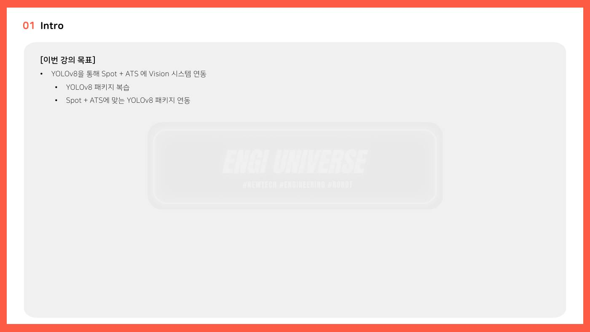{ width="720" }
/// caption
Spot + ATS Vision 연동 (YOLOv8) — 슬라이드 03 (출처: ENGI UNIVERSE)
///

### Vision 모듈은 어느 계층에 있는가

다음 주(11주차)에서 설계할 **System-1 Executor** 는 `scan`·`track` 같은 단위 액션을 수행할 때 **"지금 무엇이 보이는가"** 를 알아야 합니다. 그 정보를 만들어 내는 것이 이번 주차의 Vision 모듈입니다.

| 계층 | 역할 | 이번 주차와의 관계 |
| --- | --- | --- |
| **System-2** | 자연어 → 고수준 플랜 | Vision 요약(`vision_snapshot`)을 판단 근거로 사용 |
| **System-1 Executor** | 플랜 실행·상태 관리 | `VisionCache` 에 정규화된 비전 상태 저장 |
| **Vision 모듈(이번 주차)** | 카메라 영상 → 객체 탐지·추적 | `/vision_context_raw` 로 원시 결과 발행 |

!!! note "왜 별도 모듈로 분리하는가"
    Vision을 Executor에서 분리하면 탐지 모델을 교체(YOLOv8 → YOLOv10)해도 Executor는 그대로 둘 수 있습니다. Executor는 정규화 함수(`_normalize_raw_vision`)만 손보면 되고, Vision 모듈은 "탐지·추적 결과 발행"에만 집중합니다. → **모델 독립성(Model Independence)**

### YOLO의 출력 3요소

YOLO는 이미지를 **한 번만(one-stage)** 통과시켜 객체의 **위치(bbox)** 와 **종류(class)** 를 동시에 예측합니다. 후보 영역을 따로 뽑는 2-stage 방식보다 빨라 실시간성이 중요한 로봇에 적합합니다.

| 출력 요소 | 의미 | 이후 사용처 |
| --- | --- | --- |
| `class` | 객체 종류(예: `person`, `truck`) | System-2의 판단·시나리오 트리거 |
| `bbox` | 경계 상자 `[x, y, w, h]`(중심 기준) | `track` 의 화면 중심 정렬 기준 |
| `confidence` | 탐지 신뢰도(0~1) | `threshold` 미만은 무시 |

- **모델 크기**: `yolov8n`(nano) → `yolov8x`(xlarge). `n` 이 가장 가볍고 빠름 → 엣지/실시간용
- **device**: `cpu` 또는 `cuda:0`(GPU). 실시간 추론에는 GPU 권장

---

## 🧩 2. YOLOv8 구조 — detector → tracker → debug

### 파이프라인 구성

- 검출(detector) → 추적(tracker) → 디버그(debug) 노드를 **하나의 네임스페이스(`/yolo/...`) 아래에서 일괄 실행**합니다.
- 카메라 토픽만 들어오면 즉시 **Detection → Tracking → Debug** 파이프라인이 활성화됩니다.

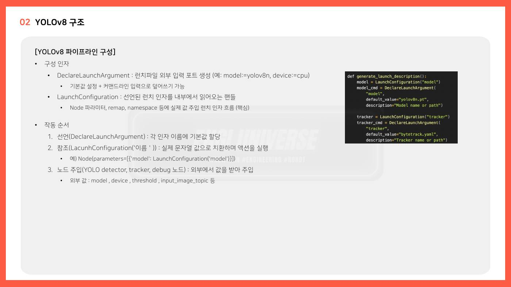{ width="720" }
/// caption
Spot + ATS Vision 연동 (YOLOv8) — 슬라이드 05 (출처: ENGI UNIVERSE)
///

### 런치 인자 흐름 (핵심)

런치 파일은 **외부 입력을 받아 노드 내부로 값을 주입**하는 구조입니다.

| 구성 인자 | 역할 |
| --- | --- |
| `DeclareLaunchArgument` | 런치파일 외부 입력 포트 생성 (예: `model:=yolov8n`, `device:=cpu`) |
| `LaunchConfiguration` | 선언된 런치 인자를 내부에서 읽어오는 핸들 |

기본값을 설정하되 커맨드라인 입력으로 덮어쓸 수 있고, 그 값을 Node 파라미터·remap·namespace 등에 실제로 주입합니다.

**작동 순서**

- **Step 1 — 선언(`DeclareLaunchArgument`)** : 각 인자 이름에 기본값 할당
- **Step 2 — 참조(`LaunchConfiguration('이름')`)** : 실제 문자열 값으로 치환하며 액션 실행
- **Step 3 — 노드 주입** : 외부에서 받은 값(`model`, `device`, `threshold`, `input_image_topic` 등)을 detector/tracker/debug 노드에 주입

```python
# 런치 인자를 노드 파라미터로 주입하는 형태 (교안 예시)
Node(parameters=[{'model': LaunchConfiguration('model')}])
```

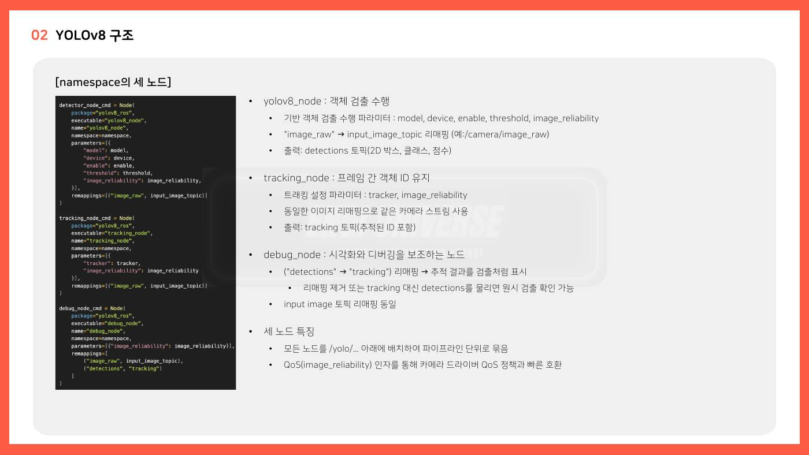{ width="720" }
/// caption
Spot + ATS Vision 연동 (YOLOv8) — 슬라이드 07 (출처: ENGI UNIVERSE)
///

!!! note "예시 파일은 실제 동작 코드가 아닙니다"
    교안의 예시 런치/노드 코드는 구조 이해를 돕기 위한 재구성으로, 그대로 실행되는 코드가 아닙니다.

### 실행해 보기 — Launch 골격과 추론 명령

위 구조를 실제로 돌려 보는 최소 형태입니다. 모델·디바이스·임계값·입력 토픽을 실행 시점에 바꿀 수 있어 재빌드가 필요 없습니다.

```python
from launch import LaunchDescription
from launch.actions import DeclareLaunchArgument
from launch.substitutions import LaunchConfiguration
from launch_ros.actions import Node

def generate_launch_description():
    model = LaunchConfiguration("model")
    device = LaunchConfiguration("device")
    threshold = LaunchConfiguration("threshold")
    input_image_topic = LaunchConfiguration("input_image_topic")

    return LaunchDescription([
        DeclareLaunchArgument("model", default_value="yolov8n.pt"),
        DeclareLaunchArgument("device", default_value="cpu"),
        DeclareLaunchArgument("threshold", default_value="0.5"),
        DeclareLaunchArgument("input_image_topic", default_value="/camera/image_raw"),
        Node(
            package="yolov8_bringup",
            executable="yolov8_node",
            name="yolov8_node",
            parameters=[{
                "model": model,
                "device": device,
                "threshold": threshold,
            }],
            remappings=[("image_raw", input_image_topic)],
        ),
    ])
```

ATS 카메라의 RGB 토픽을 입력으로 GPU 추론을 실행합니다.

```bash
ros2 launch yolov8_bringup yolov8.launch.py \
  model:=yolov8n.pt \
  device:=cuda:0 \
  threshold:=0.45 \
  input_image_topic:=/ats/rgb/image_raw
```

!!! tip "토픽 리매핑의 이점"
    `input_image_topic` 만 바꾸면 시뮬레이션(`/ats/rgb/image_raw`)과 실기(`/camera/image_raw`)를 **동일한 코드로** 전환할 수 있습니다. 토폴로지가 자주 바뀌는 로봇 환경에서 특히 유리합니다.

### 외부화되는 구성 요소

| 인자 | 의미 |
| --- | --- |
| `model` | 모델 가중치 |
| `tracker` | 트래커 설정 (`bytetrack.yaml` / `botsort.yaml`) |
| `device` | 실행 디바이스 (기본: CPU / `device:=cuda:0` : GPU) |
| `enable` | 추론 시작 여부 |
| `threshold` | 최소 신뢰도 임계값 |
| `input_image_topic` | 이미지 토픽 이름 |
| `image_reliability` | 입력 이미지 토픽 QoS 설정 |
| `namespace` | detector / tracker / debug를 묶는 공통 네임스페이스 |

### namespace 아래의 세 노드

=== "yolov8_node (검출)"

    - 파라미터: `model`, `device`, `enable`, `threshold`, `image_reliability`
    - `"image_raw"` → `input_image_topic` 리매핑 (예: `/camera/image_raw`)
    - **출력**: `detections` 토픽(2D 박스, 클래스, 점수)

=== "tracking_node (추적)"

    - 파라미터: `tracker`, `image_reliability`
    - 동일한 이미지 리매핑으로 같은 카메라 스트림 사용
    - **출력**: `tracking` 토픽(추적된 ID 포함)

=== "debug_node (시각화)"

    - `("detections" → "tracking")` 리매핑 → 추적 결과를 검출처럼 표시
    - 리매핑을 제거하거나 `tracking` 대신 `detections`를 물리면 **원시 검출** 확인 가능

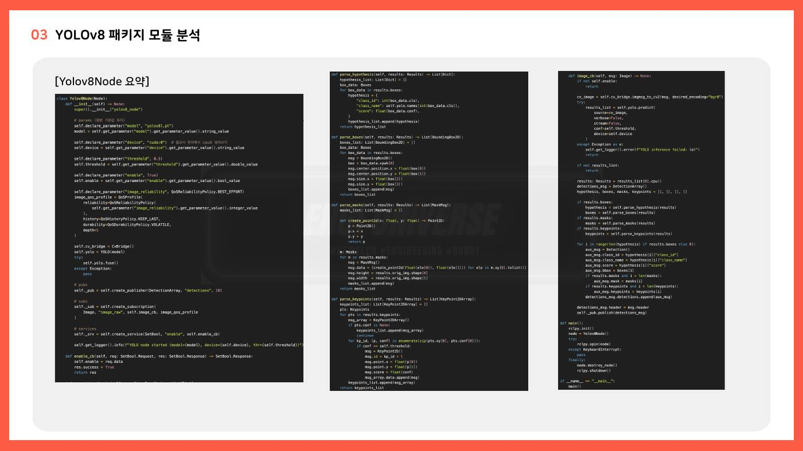{ width="720" }
/// caption
Spot + ATS Vision 연동 (YOLOv8) — 슬라이드 09 (출처: ENGI UNIVERSE)
///

!!! tip "런치 파일의 가치"
    `input_image_topic`, `image_reliability`(QoS), `model`, `device`, `threshold`, `namespace`를 런치 인자로 외부화했기 때문에, **토픽명 변경·GPU/CPU 전환·임계치 조정**이 필요해도 파일 수정 없이 실행 인자만 바꿔 재사용할 수 있습니다.

---

## 🔬 3. YOLOv8 패키지 모듈 분석

### 3-1. yolov8_node (이미지 입력 → 추론 → 퍼블리시)

- **Step 1 — 이미지 입력 처리** : `/image_raw`를 QoS 설정에 따라 구독 → `CvBridge`로 ROS Image → OpenCV BGR 배열 변환 → Ultralytics YOLO(`model`)에 전달
- **Step 2 — 추론 & 결과 파싱** : Results에서 클래스/점수/바운딩박스/마스크/키포인트 파싱 → `yolov8_msgs/DetectionArray`로 묶어 `detections` 토픽으로 퍼블리시
- **Step 3 — 설정 파라미터** : 런치 인자/파라미터 서버에서 `model`, `device`, `threshold`, `image_reliability`, `enable`을 받아 현장 환경에 맞게 추론 조건 조정
- **Step 4 — ON/OFF 제어** : `std_srvs/SetBool` 서비스 `/enable`로 추론을 실시간으로 켜고 끔

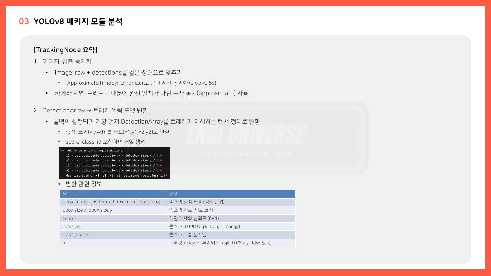{ width="720" }
/// caption
Spot + ATS Vision 연동 (YOLOv8) — 슬라이드 12 (출처: ENGI UNIVERSE)
///

### 3-2. tracking_node (프레임 간 ID 유지)

- **이미지·검출 동기화** : `image_raw` + `detections`를 `ApproximateTimeSynchronizer`로 **근사 시간 동기**(slop=0.5s) — 카메라 지연·드리프트 때문에 완전 일치가 아닌 approximate 사용
- **포맷 변환** : `DetectionArray`를 트래커 입력 텐서로 변환. 중심·크기 `(x,y,w,h)` → 좌표 `(x1,y1,x2,y2)`, `score`·`class_id` 포함

| 필드 | 설명 |
| --- | --- |
| `bbox.center.position.x/y` | 박스 중심 좌표 (픽셀) |
| `bbox.size.x/y` | 박스 가로·세로 크기 |
| `score` | 신뢰도 (0~1) |
| `class_id` | 클래스 ID (예: 0=person, 1=car) |
| `class_name` | 클래스 이름 문자열 |
| `id` | 트래킹 고유 ID (처음엔 비어 있음) |

**트래킹 수행 및 보정** — `tracker.update()`가 이전 프레임과 비교해 동일 객체를 연결(Track ID 부여)하고, 보정된 박스 `xywh`로 Detection의 `bbox.center/size`를 갱신합니다.

| frame | box_center | score | class_name | id |
| --- | --- | --- | --- | --- |
| 1 | (320,240) | 0.90 | person | — |
| 1 | (100,200) | 0.80 | person | — |
| 1 | (500,210) | 0.70 | person | — |
| 2 | (325,243) | 0.88 | person | 1 |
| 2 | (105,204) | 0.79 | person | 2 |
| 2 | (505,213) | 0.71 | person | 3 |

→ 1프레임에서는 ID가 비어 있다가, 2프레임에서 동일 객체에 일관된 ID(1·2·3)가 부여됩니다.

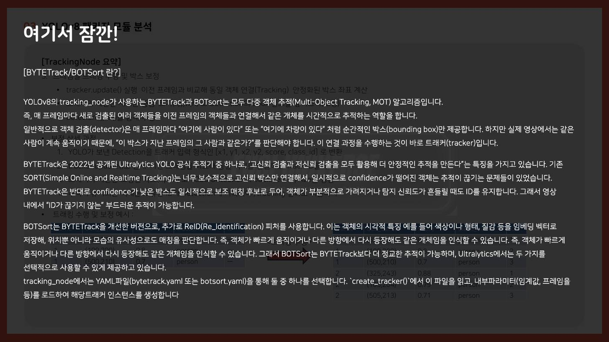{ width="720" }
/// caption
Spot + ATS Vision 연동 (YOLOv8) — 슬라이드 15 (출처: ENGI UNIVERSE)
///

!!! note "여기서 잠깐 — BYTETrack / BOTSort 란?"
    둘 다 다중 객체 추적(Multi-Object Tracking, MOT) 알고리즘으로, 매 프레임 새로 검출된 객체를 이전 프레임 객체와 연결합니다.

    - **BYTETrack** (2022, Ultralytics 공식 추적기 중 하나): **고신뢰 검출 + 저신뢰 검출을 모두 활용**해 더 안정적인 추적. 기존 SORT가 고신뢰 박스만 연결해 일시적으로 confidence가 떨어지면 추적이 끊기던 문제를 보완 → 부분 가려짐에도 ID 유지.
    - **BOTSort**: BYTETrack을 개선한 버전으로 **ReID(Re-Identification) 피처**(색상·형태·질감 등 시각 특징의 임베딩)를 추가 사용 → 위치뿐 아니라 모습 유사성으로도 매칭. 객체가 빠르게 움직이거나 다른 방향에서 재등장해도 동일 개체 인식.
    - `tracking_node`는 YAML(`bytetrack.yaml` / `botsort.yaml`)을 읽어 `create_tracker()`로 둘 중 하나의 인스턴스를 생성합니다.

**트래커 업데이트 & 트랙 매칭 (상세)**

```python
# 교안 재구성 — 트래커 업데이트와 Detection 보정 흐름
tracks = self.tracker.update(det_boxes, cv_image)  # 이전·현재 프레임 비교 → 동일 객체 연결
for t in tracks:
    src_idx = t[-1]                                # 원본 검출 인덱스 매칭
    tracked_box = Boxes(t[:-1], ...)               # 보정된 박스 객체
    cx, cy, w, h = tracked_box.xywh[0]             # 새 중심·크기
    # 원래 Detection의 bbox.center / bbox.size 에 덮어쓰기(보정)
    if tracked_box.is_track:
        detection.id = str(int(tracked_box.id))    # 동일 객체는 항상 같은 ID 유지
```

- 반환값 `tracks` = 보정된 바운딩박스 + 대응하는 **원본 Detection 인덱스**
- 원본 Detection의 클래스/신뢰도 등 메타데이터는 그대로 유지 → YOLO의 흔들리는 박스를 **안정화된 박스로 교체**

!!! tip "QoS(image_reliability) 선택"
    - 무선·시뮬레이터 환경 → **Best Effort** (드롭이 있어도 지연 최소화)
    - 로깅·재현성 중요 → **Reliable** (프레임 손실 최소화)
    - 전달된 정수값(0/1/2)을 ROS 2 QoS 프로필로 자동 매핑하며, 런치 인자로 파일 수정 없이 즉시 변경 가능합니다.

### 3-3. debug_node (시각화·디버깅)

- **입력 & 리매핑** : 기본 입력 `image_raw` + `detections`, 런치에서 `("detections", "tracking")`으로 리매핑 → **트래킹 결과**를 그려서 표시
- **화면 시각화** : 바운딩박스 + 클래스명 + 점수 + 트랙 ID 오버레이, 마스크 → 반투명 폴리곤, 키포인트 → 관절 뼈대 라인 → `/dbg_image` 퍼블리시 + 로컬 OpenCV 윈도우 실시간 확인
- **파이프라인 내 역할** : 최종 흐름은 `image_raw → YOLO(det) → Tracking → Debug(시각화)`, 네임스페이스로 `yolo/cam0`, `yolo/cam1` 식 다중 카메라 충돌 없이 확장

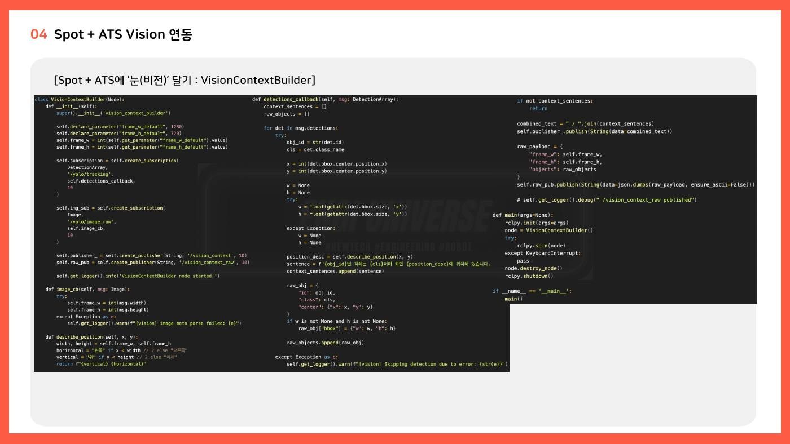{ width="720" }
/// caption
Spot + ATS Vision 연동 (YOLOv8) — 슬라이드 22 (출처: ENGI UNIVERSE)
///

---

## 🤖 4. Spot + ATS Vision 연동

### Spot + ATS에 '눈(비전)' 달기

- YOLOv8 비전 모듈 + Spot + ATS 시스템 연동 → 실제 환경에서 대상을 인식·추적·반응하는 **closed-loop** 구축
- **핵심 설계 2가지**
    - `/ats_twist` : 카메라 화면 **중심에 목표를 맞추기 위한** 제어 신호
    - `/cmd_vel` : 대상을 **일정한 거리에서 따라가기 위한** 이동 속도

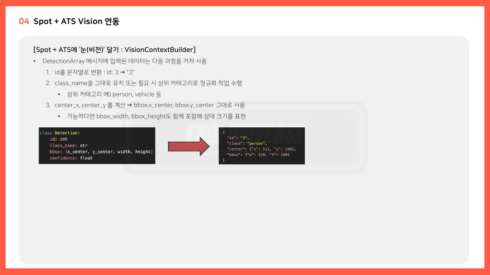{ width="720" }
/// caption
Spot + ATS Vision 연동 (YOLOv8) — 슬라이드 24 (출처: ENGI UNIVERSE)
///

### graph_builder.py — YOLO 파이프라인 입력값 생성

- `GraphBuilder.build_camera_ros_graph()`가 RGB 프레임을 ROS로 퍼블리시 → 카메라 영상은 `/yolo/image_raw`로 출력(YOLO 파이프라인의 입력)
- `yolov8_node` : `/yolo/image_raw` 구독 → Ultralytics YOLO 추론 → `yolov8_msgs/DetectionArray`를 `/yolo/detections`로 퍼블리시
- `tracking_node` : 이미지 + detections를 타임싱크로 묶어 ByteTrack/BOTSort로 추적 갱신 → 각 객체에 일관된 `id` 부여 후 `/yolo/tracking`으로 발행

### VisionContextBuilder — 트랙 결과 → 비전 컨텍스트

**역할** : `/yolo/tracking` + `/yolo/image_raw`를 함께 구독하여 **"무엇을 봤는가 + 어느 프레임에서 봤는가"** 를 한 컨텍스트로 묶습니다.

- **이미지 정보 활용** : `/yolo/image_raw` 콜백에서 매 프레임 `frame_w`, `frame_h` 자동 갱신 → 화면 중심 `(frame_w/2, frame_h/2)` 기준으로 대상 중심과의 오차 **Δx, Δy** 계산
- **동적 스케일 대응** : 해상도가 바뀌거나 리사이즈되어도 하드코딩 없이 자동 보정 → 후단 제어기가 해상도와 무관하게 같은 스케일로 오차 해석
- **검출 결과 정규화** : `/yolo/tracking` 콜백에서 각 객체 Detection을 순회하며 통일된 포맷으로 정리

**DetectionArray 입력 데이터 처리**

- **Step 1 —** `id`를 문자열로 변환 (`id: 3` → `"3"`)
- **Step 2 —** `class_name`을 그대로 유지하거나 상위 카테고리로 정규화 (예: `person`, `vehicle`)
- **Step 3 —** `center_x`, `center_y`를 `bbox.x_center`, `bbox.y_center`로 사용 (가능하면 `bbox_width`, `bbox_height`로 상대 크기 표현)

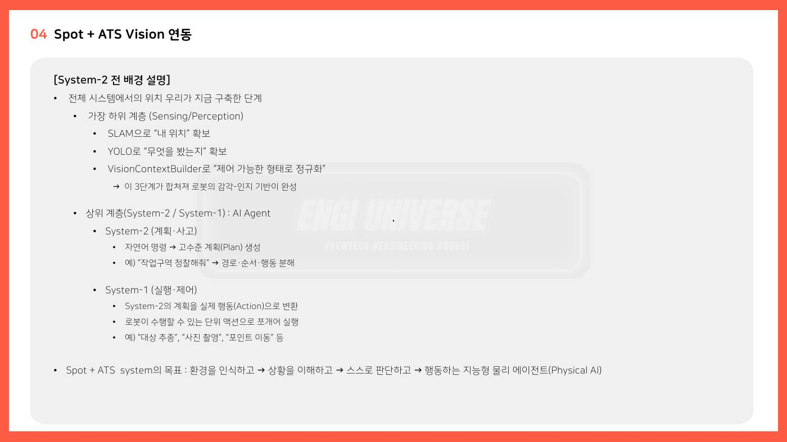{ width="720" }
/// caption
Spot + ATS Vision 연동 (YOLOv8) — 슬라이드 26 (출처: ENGI UNIVERSE)
///

**두 가지 포맷으로 퍼블리시**

=== "/vision_context (사람이 읽는 텍스트)"

    > "현재 프레임에서 2명의 사람이 감지되었습니다"
    > "가장 가까운 대상은 ID3, 중앙 기준 왼쪽 상단 방향에 위치해 있습니다"

=== "/vision_context_raw (System-1용 JSON)"

    System-1에서 사용할 수 있는 표준 JSON 포맷으로 객체별 `id`·`class`·중심좌표·크기를 정규화하여 발행

### `/vision_context_raw` → System-1 VisionCache

탐지·추적 결과를 **원시 JSON** 으로 발행하면, 다음 주(11주차)에서 설계할 System-1 Executor가 이를 받아 정규화합니다.

```text
[Vision 모듈]  --/vision_context_raw (raw JSON)-->  [System-1 Executor]
                                                     on_vision_raw()
                                                     └ _normalize_raw_vision()
                                                       └ VisionCache 반영
```

**원시 JSON 예시**

```json
{
  "targets": [
    {"id": "17", "class": "person", "bbox": [312, 240, 96, 210], "range": 4.2},
    {"id": "23", "class": "truck",  "bbox": [40, 180, 140, 120]}
  ],
  "primary_id": "17",
  "lost_sec": 0.0
}
```

정규화 후 Executor가 관리하는 **표준 구조**는 다음과 같습니다(11주차에서 상세히 다룸).

| 필드 | 의미 |
| --- | --- |
| `targets` | 감지된 객체 리스트 — `id`·`class`·`bbox([x,y,w,h])`·`range`(거리, 선택) |
| `primary_id` | 주 대상. `center(cx, cy)` 포함 → `track`·`report_and_wait` 의 기준 |
| `lost_sec` | 아무 객체도 감지되지 않은 누적 시간 → "타깃 손실" 판단 트리거 |

!!! success "System-2 전 배경 — 우리가 지금 구축한 단계"
    가장 하위 계층(Sensing/Perception)을 완성하는 단계입니다.

    - SLAM으로 **"내 위치"** 확보 → YOLO로 **"무엇을 봤는지"** 확보 → VisionContextBuilder로 **"제어 가능한 형태로 정규화"**
    - 이 3단계가 합쳐져 로봇의 **감각-인지 기반**이 완성되고, 그 위에 상위 계층(**System-2**: 자연어→계획, **System-1**: 계획→행동)이 올라갑니다.
    - Spot + ATS의 목표: 환경을 **인식 → 이해 → 판단 → 행동**하는 지능형 물리 에이전트(Physical AI).

---

## 🧷 5. Wrap-up

오늘 강의 요약:

1. YOLO 모듈 **패키지를 분석** (detector·tracker·debug 노드 구조)
2. **Spot + ATS 시스템과 YOLO 연동** (graph_builder → VisionContextBuilder)
3. **System 구조 분석을 통한 확장 계획** (Sensing/Perception → System-1/System-2)

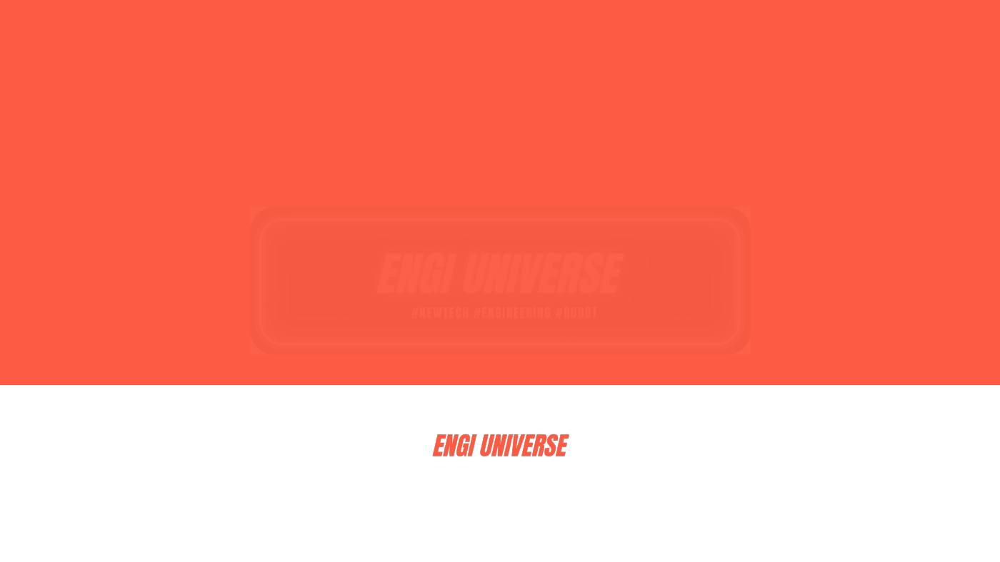{ width="720" }
/// caption
Spot + ATS Vision 연동 (YOLOv8) — 슬라이드 28 (출처: ENGI UNIVERSE)
///

## ✅ 체크포인트

- [ ] detector → tracker → debug 노드가 하나의 네임스페이스에서 어떻게 묶이는지 설명할 수 있는가
- [ ] `DeclareLaunchArgument` / `LaunchConfiguration`로 `model`·`device`·`threshold`를 외부화하는 흐름을 이해했는가
- [ ] BYTETrack과 BOTSort의 차이(저신뢰 박스 활용 vs ReID 피처)를 구분할 수 있는가
- [ ] `tracking_node`가 보정된 박스로 Detection을 갱신하고 일관된 ID를 유지하는 과정을 설명할 수 있는가
- [ ] VisionContextBuilder가 화면 중심 오차(Δx, Δy)를 계산해 `/vision_context`로 내보내는 의미를 이해했는가

## 📊 평가 루브릭

| 항목 | 배점 | 기준 |
| --- | --- | --- |
| YOLOv8 파이프라인 이해 | 25 | detector/tracker/debug 노드와 네임스페이스 구조 설명 |
| 런치 인자 외부화 | 20 | `DeclareLaunchArgument`·`LaunchConfiguration` 흐름 정확성 |
| 트래킹 원리 | 20 | ApproximateTimeSync·BYTETrack/BOTSort·ID 유지 설명 |
| Spot+ATS 연동 | 20 | graph_builder·VisionContextBuilder·`/ats_twist`·`/cmd_vel` 이해 |
| 시스템 계층 이해 | 15 | Sensing/Perception → System-1/System-2 확장 설명 |

## 🔗 출처 및 참고자료

- 교안 **「Spot + ATS Vision 연동 (YOLOv8)」** (제작: ENGI UNIVERSE)
- Ultralytics YOLOv8 — <https://docs.ultralytics.com>
- ByteTrack — <https://github.com/ifzhang/ByteTrack>
- ROS 2 QoS 설정 — <https://docs.ros.org/en/humble/Concepts/Intermediate/About-Quality-of-Service-Settings.html>

!!! note "🔬 NVIDIA Isaac 워크샵 연계 (DLI)"
    YOLOv8 외에도 **Isaac ROS**의 하드웨어 가속 인지 GEM(**Isaac Perceptor** 등)으로 GPU 가속 객체탐지·깊이추정·시각 SLAM을 구성할 수 있습니다. 엣지(Jetson)에서 고FPS 인지가 필요할 때 유리합니다.
    → 자세한 내용: [DLI · Isaac ROS](dli-ros.md)

## 📘 Isaac Sim 5.1.0 공식 문서

!!! note "공식 문서 (NVIDIA Isaac Sim 5.1.0)"
    본 주차의 카메라 토픽·ROS 2 브릿지 구성은 아래 공식 문서로 보강·검증할 수 있습니다.

    - [ROS 2 튜토리얼](https://docs.isaacsim.omniverse.nvidia.com/5.1.0/ros2_tutorials/index.html)
    - [카메라 & 센서](https://docs.isaacsim.omniverse.nvidia.com/5.1.0/sensors/index.html)

## 📖 핵심 용어 설명

### YOLOv8 (You Only Look Once v8)
- **정의**: Ultralytics가 개발한 실시간 객체 검출(Object Detection) 딥러닝 모델로, 한 장의 이미지를 한 번만 신경망에 통과시켜 객체의 위치(바운딩박스)·클래스·신뢰도를 동시에 예측합니다.
- **역할/왜 중요한가**: 이번 주차 비전 파이프라인의 **눈** 역할을 합니다. SLAM이 "내 위치"를 알려준다면 YOLOv8은 "무엇을 봤는지"를 알려줍니다.
- **맥락·예시**: `model:=yolov8n`처럼 가중치를 런치 인자로 지정하며, `yolov8n`(nano)은 가볍고 빠른 경량 모델이라 CPU 환경에서도 동작합니다.

### detector → tracker → debug 파이프라인
- **정의**: 검출(`yolov8_node`) → 추적(`tracking_node`) → 시각화(`debug_node`) 세 노드를 순서대로 연결한 ROS 2 처리 흐름입니다.
- **역할/왜 중요한가**: 각 단계가 역할을 분담(검출=무엇을 봤나, 추적=같은 객체에 ID 부여, 디버그=화면 확인)하여 모듈화된 비전 시스템을 만듭니다.
- **맥락·예시**: 본문 2장에서 세 노드를 하나의 네임스페이스(`/yolo/...`) 아래에서 일괄 실행하며, 카메라 토픽만 들어오면 전체 파이프라인이 활성화됩니다.

### 네임스페이스 (namespace)
- **정의**: ROS 2에서 노드·토픽 이름 앞에 공통 접두어를 붙여 묶는 이름 공간입니다. 예: `/yolo/detections`, `/yolo/tracking`.
- **역할/왜 중요한가**: 같은 노드를 여러 개 띄워도 이름 충돌 없이 구분할 수 있어 **다중 카메라 확장**이 쉬워집니다.
- **맥락·예시**: 본문에서 `yolo/cam0`, `yolo/cam1` 식으로 카메라별 파이프라인을 충돌 없이 운영하는 근거가 됩니다.

### DeclareLaunchArgument / LaunchConfiguration
- **정의**: `DeclareLaunchArgument`는 런치 파일이 외부에서 값을 받는 **입력 포트**를 선언하고, `LaunchConfiguration`은 선언된 그 값을 노드 내부에서 **읽어오는 핸들**입니다.
- **역할/왜 중요한가**: 토픽명·디바이스·임계값 같은 설정을 코드에 하드코딩하지 않고 **실행 시 커맨드라인 인자**로 바꿀 수 있게 해, 파일 수정 없이 재사용 가능한 런치 구조를 만듭니다.
- **맥락·예시**: 본문 작동 순서 Step 1~3에서 `model:=yolov8n`, `device:=cuda:0` 같은 값을 선언·참조·주입하는 흐름으로 설명됩니다.

### CvBridge
- **정의**: ROS의 이미지 메시지(`sensor_msgs/Image`)와 OpenCV 이미지 배열(BGR numpy)을 서로 변환해주는 라이브러리입니다.
- **역할/왜 중요한가**: ROS로 들어온 카메라 영상을 YOLO/OpenCV가 처리할 수 있는 형식으로 바꿔주는 **다리** 역할입니다.
- **맥락·예시**: `yolov8_node`의 Step 1에서 `/image_raw`를 구독한 뒤 CvBridge로 변환해 Ultralytics YOLO에 전달합니다.

### DetectionArray (`yolov8_msgs/DetectionArray`)
- **정의**: 한 프레임에서 검출된 여러 객체의 정보(바운딩박스 중심·크기, 점수, 클래스 ID/이름, 트랙 ID 등)를 담는 ROS 2 커스텀 메시지 타입입니다.
- **역할/왜 중요한가**: 검출 결과를 표준 포맷으로 묶어 노드 간(detector→tracker→VisionContext)에 일관되게 전달합니다.
- **맥락·예시**: 본문 3-2의 필드 표(`bbox.center.position.x/y`, `score`, `class_id`, `id` 등)가 이 메시지의 구조입니다.

### ApproximateTimeSynchronizer
- **정의**: 타임스탬프가 정확히 일치하지 않는 두 개 이상의 토픽을 **근사 시간**으로 짝지어 한 콜백에서 함께 처리하게 하는 ROS 2 메시지 동기화 도구입니다.
- **역할/왜 중요한가**: 카메라 지연·드리프트 때문에 이미지와 검출 결과의 시각이 완전히 같지 않으므로, 가까운 시각끼리 묶어 추적 입력을 만듭니다.
- **맥락·예시**: `tracking_node`가 `image_raw` + `detections`를 `slop=0.5s`(허용 시간차 0.5초)로 동기화합니다.

### BYTETrack / BOTSort
- **정의**: 둘 다 다중 객체 추적(Multi-Object Tracking, MOT) 알고리즘으로, 매 프레임의 검출 결과를 이전 프레임 객체와 연결해 동일 개체에 같은 ID를 유지합니다.
- **역할/왜 중요한가**: 검출만으로는 "이 사람과 저 사람이 같은 사람인지" 알 수 없는데, 추적기가 프레임 간 **ID 일관성**을 부여해 추종 제어가 가능해집니다.
- **맥락·예시**: **BYTETrack**은 저신뢰 검출까지 활용해 가려짐에도 ID를 유지하고, **BOTSort**는 ReID 피처를 추가로 사용합니다. `tracking_node`가 `bytetrack.yaml`/`botsort.yaml`을 읽어 둘 중 하나를 생성합니다.

### ReID (Re-Identification)
- **정의**: 객체의 색상·형태·질감 같은 시각적 특징을 임베딩(숫자 벡터)으로 추출해, 위치가 아니라 **외형 유사성**으로 동일 객체를 다시 식별하는 기법입니다.
- **역할/왜 중요한가**: 객체가 빠르게 움직이거나 화면에서 사라졌다가 다른 위치에서 재등장해도 같은 ID를 유지할 수 있게 합니다.
- **맥락·예시**: BOTSort가 BYTETrack 대비 추가로 사용하는 핵심 기능으로 본문 3-2에서 설명됩니다.

### QoS / image_reliability
- **정의**: QoS(Quality of Service)는 ROS 2에서 메시지 전달 신뢰성·지연 등을 정하는 통신 정책이며, `image_reliability`는 이미지 토픽의 QoS를 런치 인자(정수 0/1/2)로 지정하는 파라미터입니다.
- **역할/왜 중요한가**: 환경에 맞춰 통신 방식을 선택할 수 있게 합니다. **Best Effort**는 드롭을 허용해 지연을 줄이고, **Reliable**은 손실을 최소화합니다.
- **맥락·예시**: 무선·시뮬레이터에서는 Best Effort, 로깅·재현이 중요하면 Reliable을 쓰며 파일 수정 없이 인자로 전환합니다.

### bbox (Bounding Box) · confidence

- **정의**: `bbox` 는 탐지된 객체를 감싸는 사각형(`[x, y, w, h]`, 중심 기준)이고, `confidence` 는 그 탐지가 맞을 확률(0~1)입니다.
- **역할/왜 중요한가**: `bbox` 의 중심(`cx, cy`)은 `track` 이 카메라를 대상 쪽으로 정렬하는 기준이 되고, `confidence` 는 `threshold` 미만 탐지를 걸러 오탐을 줄입니다.
- **맥락·예시**: Tracker가 `tracked_box.xywh[0]` 로 보정한 `cx, cy, w, h` 를 `detection.bbox` 에 채워 System-1으로 전달합니다.

### Detector vs. Tracker

- **정의**: Detector는 **매 프레임 독립적으로** 객체를 찾고, Tracker는 프레임에 걸쳐 같은 객체를 연결해 **일관된 ID** 를 부여합니다.
- **역할/왜 중요한가**: 특정 대상을 계속 추종하는 `track` 액션은 "같은 사람인지"를 알아야 하므로 Tracker의 ID가 필수입니다.
- **맥락·예시**: `self.tracker.update(...)` 가 detection을 추적 트랙과 매칭하고, `tracked_box.is_track` 이 참이면 `detection.id` 에 유지 ID를 씁니다.

### VisionCache / 정규화 (Normalization)

- **정의**: 다양한 비전 모델의 서로 다른 출력을 `_normalize_raw_vision()` 으로 하나의 표준 구조(`targets`·`primary_id`·`lost_sec`)로 통합해 저장하는 System-1의 중앙 비전 저장소입니다.
- **역할/왜 중요한가**: 모델을 교체해도 정규화 함수만 고치면 되어 **모델 독립성** 을 확보하고, 비전 데이터의 일관성이 System-2 플랜 품질을 지탱합니다.
- **맥락·예시**: 이번 주차가 `/vision_context_raw` 로 발행한 원시 JSON을 다음 주(11주차) Executor의 `on_vision_raw` 가 받아 정규화합니다.

### `/vision_context_raw` (토픽)

- **정의**: Vision 모듈이 탐지·추적 결과를 **원시 JSON** 형태로 내보내는 토픽입니다.
- **역할/왜 중요한가**: Vision과 Executor를 토픽으로 분리(느슨한 결합)해, 서로의 내부 구현을 몰라도 협업할 수 있게 합니다.
- **맥락·예시**: System-1 Executor는 이 토픽을 선택적으로 구독해 정규화 후 VisionCache에 반영합니다.

### VisionContextBuilder
- **정의**: `/yolo/tracking`(추적 결과)과 `/yolo/image_raw`(영상)를 함께 구독해 "무엇을 봤는가 + 어느 프레임에서 봤는가"를 하나의 **비전 컨텍스트**로 묶는 모듈입니다.
- **역할/왜 중요한가**: 화면 중심 `(frame_w/2, frame_h/2)` 기준으로 대상과의 오차 **Δx, Δy**를 계산해, 후단 제어기가 해상도와 무관하게 사용할 수 있는 정규화된 정보를 만듭니다.
- **맥락·예시**: 결과를 사람이 읽는 `/vision_context`와 System-1용 JSON인 `/vision_context_raw` 두 포맷으로 발행합니다(본문 4장).

### closed-loop (`/ats_twist`, `/cmd_vel`)
- **정의**: closed-loop(폐루프)는 센서로 관측한 결과를 다시 제어 입력으로 되먹임하는 구조입니다. 여기서 `/ats_twist`는 화면 중심에 목표를 맞추는 짐벌/카메라 제어 신호, `/cmd_vel`은 대상을 일정 거리에서 따라가기 위한 로봇 이동 속도 명령입니다.
- **역할/왜 중요한가**: "보고 → 오차 계산 → 움직여서 보정 → 다시 본다"의 순환을 만들어, Spot+ATS가 대상을 능동적으로 인식·추적·추종하게 합니다.
- **맥락·예시**: VisionContextBuilder가 산출한 Δx, Δy 오차가 `/ats_twist`·`/cmd_vel` 제어의 입력 근거가 됩니다(본문 4장).

## 🧠 핵심 용어 암기 노트

!!! tip "이 절의 사용법"
    위 **📖 핵심 용어 설명**이 "뜻"이라면, 이 절은 **외우고 확인하는 곳**입니다. ① 암기표 오른쪽을 손으로 가리고 용어만 보며 말해 보기 → ② 그림으로 장면을 기억하기 → ③ 퀴즈로 확인하기 순서로 쓰세요.

### ① 빠른 암기표

| 용어 | 한 줄로 외우기 | 헷갈리는 지점 |
| --- | --- | --- |
| **YOLO / YOLOv8** | 이미지를 **한 번만** 통과시켜 위치와 종류를 동시에 예측 | 2-stage(후보 뽑고 분류)보다 빠르다 — 그래서 실시간용 |
| **bbox** | 객체를 감싸는 **사각형** `[x, y, w, h]` | 중심 기준 좌표 — 좌상단 기준과 헷갈리지 말 것 |
| **confidence** | 그 탐지가 맞을 **확신도** 0~1 | `threshold` 미만은 버린다. 높이면 오탐↓ 미탐↑ |
| **Detector** | **매 프레임 독립적으로** 객체를 찾음 | "이전 프레임의 그 사람"인지는 모른다 |
| **Tracker** | 프레임을 가로질러 **같은 객체에 같은 ID** 부여 | `track` 액션이 대상을 계속 쫓으려면 필수 |
| **BYTETrack / BOTSort** | 대표적인 **다중 객체 추적 알고리즘** | Detector 결과를 이어 붙이는 역할 |
| **ReID** | 가렸다 다시 나타난 객체를 **같은 사람으로 재식별** | 겉모습 특징으로 다시 잇는 것 |
| **namespace** | 노드·토픽 이름 앞에 붙는 **구역 이름표** | 같은 노드를 여러 개 띄울 때 충돌을 막는다 |
| **CvBridge** | ROS 이미지 ↔ OpenCV 이미지 **변환기** | 인코딩(bgr8 등)이 안 맞으면 여기서 터진다 |
| **리매핑(remapping)** | 코드를 안 고치고 **토픽 이름만 갈아끼우기** | 시뮬↔실기 전환을 이걸로 한다 |
| **`/vision_context_raw`** | Vision이 내보내는 **원시 JSON 결과 토픽** | Vision과 Executor를 느슨하게 분리하는 접점 |
| **VisionCache / 정규화** | 여러 모델의 출력을 **하나의 표준 구조**로 통일해 저장 | 모델을 바꿔도 정규화 함수만 고치면 된다(모델 독립성) |

### ② 그림으로 잡기


*CNN의 전형적 구조 — YOLO도 이런 합성곱 층 위에 세워진다 — 출처: Wikimedia Commons, Typical cnn.png (CC BY-SA 4.0)*


*IoU — 예측 bbox와 정답 bbox가 얼마나 겹치는가로 탐지 품질을 잰다 — 출처: Wikimedia Commons, Intersection over Union (CC BY-SA 4.0)*


*YOLOv8 파이프라인 — detector에서 tracker, debug로 이어지는 흐름 — 출처: 강의 슬라이드 SLAM 4강 05 (제작: ENGI UNIVERSE)*

### ③ 자가 점검 퀴즈

1. Detector만 있고 Tracker가 없으면 `track` 액션이 왜 곤란해지나요?
2. `threshold`를 올리면 오탐과 미탐은 각각 어떻게 되나요?
3. Vision 모듈을 Executor에서 분리해 토픽으로 잇는 설계의 이점은?
4. 토픽 리매핑이 실전에서 유용한 대표 상황은?

??? success "정답 확인"
    1. 프레임마다 독립적으로 탐지하므로 "같은 대상"이라는 보장이 없다. ID가 유지되지 않으면 추종 대상이 프레임마다 바뀔 수 있다.
    2. 오탐(없는 것을 있다고 함)은 줄고, 미탐(있는 것을 놓침)은 늘어난다. 반대로 내리면 그 반대.
    3. 느슨한 결합. 탐지 모델을 YOLOv8에서 다른 것으로 바꿔도 Executor는 정규화 함수만 고치면 되고 행동 로직은 그대로다.
    4. 시뮬레이션(`/ats/rgb/image_raw`)과 실기(`/camera/image_raw`)를 같은 코드로 전환할 때. 실행 인자만 바꾸면 된다.

## 📝 10주차 과제

!!! example "과제 10 — YOLOv8 Vision을 Spot+ATS에 연동"
    **목표**: YOLOv8 detector→tracker→debug 파이프라인을 구성하고 카메라 토픽에 연동해 실시간 객체 탐지·추적을 확인한다.

**과제 흐름도**

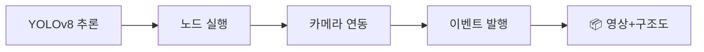
```mermaid
graph LR
  A[YOLOv8 추론] --> B[노드 실행] --> C[카메라 연동] --> D[이벤트 발행] --> E[📦 영상+구조도]
```

**수행 단계**

1. YOLOv8 단독 추론 테스트
2. detector/tracker/debug 노드 네임스페이스 일괄 실행
3. 카메라 토픽 연동 실시간 탐지 확인
4. 특정 클래스 탐지 시 이벤트(로그/토픽) 발행

**제출물**

- [ ] YOLOv8 연동 코드/런치
- [ ] 실시간 탐지·추적 영상
- [ ] 탐지 결과 토픽 echo 로그
- [ ] 파이프라인 구조도(detector→tracker→debug)

**평가 (배점 100)**

| 항목 | 배점 | 기준 |
| --- | --- | --- |
| YOLOv8 추론 | 30 | 탐지 동작 |
| ROS 연동·추적 | 45 | 실시간 파이프라인 |
| 이벤트 처리 | 25 | 클래스 조건 발행 |

**제출 형식·마감**: 다음 주차 강의 시작 전까지 LMS 업로드 — ① 코드/설정 `zip` ② 보고서 `PDF`(표지: 학번·이름·과제명) ③ 실행 결과 스크린샷/영상. 코드는 재현 가능해야 하며, 외부 코드를 사용하면 출처를 명시한다(미표기 시 감점).

<!-- FULLDECK -->
## 🖼️ 원본 강의 슬라이드

??? note "원본 강의 슬라이드 전체 (28매)"
    { width="700" }
    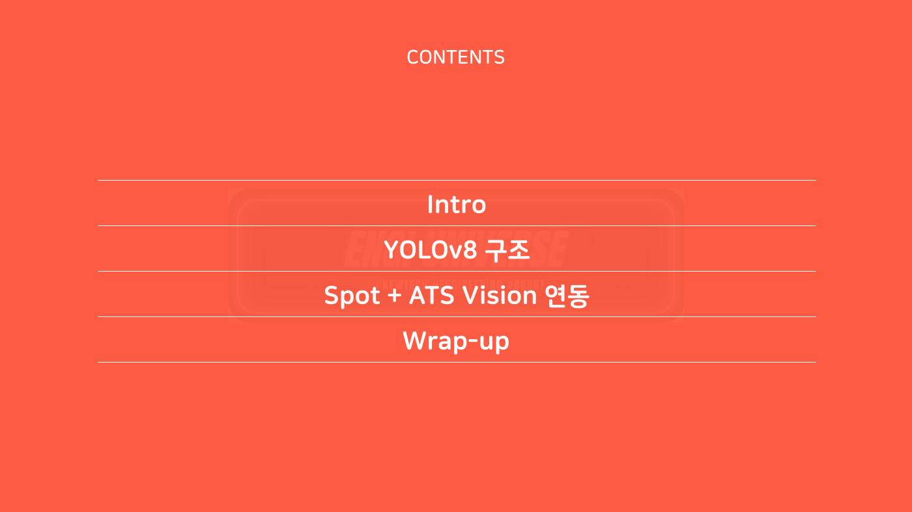{ width="700" }
    { width="700" }
    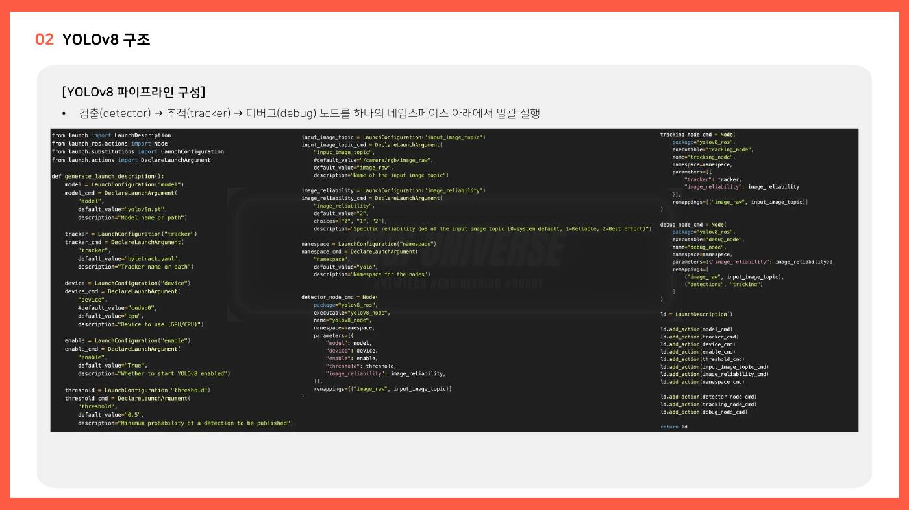{ width="700" }
    { width="700" }
    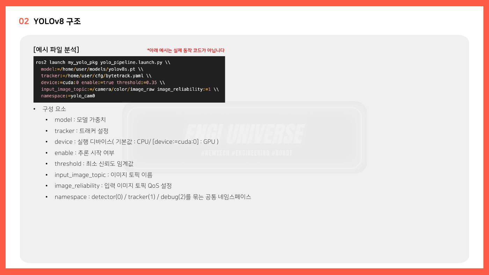{ width="700" }
    { width="700" }
    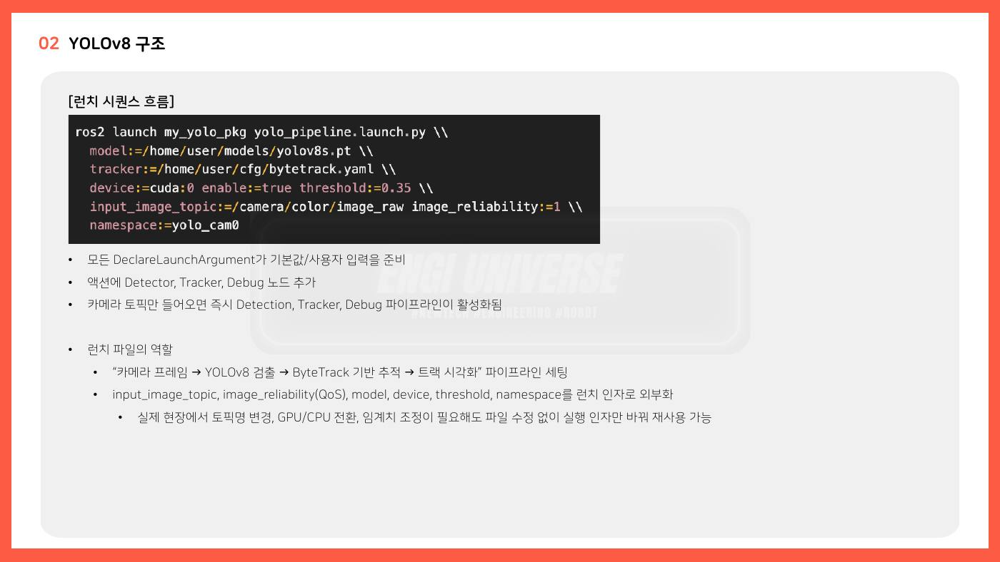{ width="700" }
    { width="700" }
    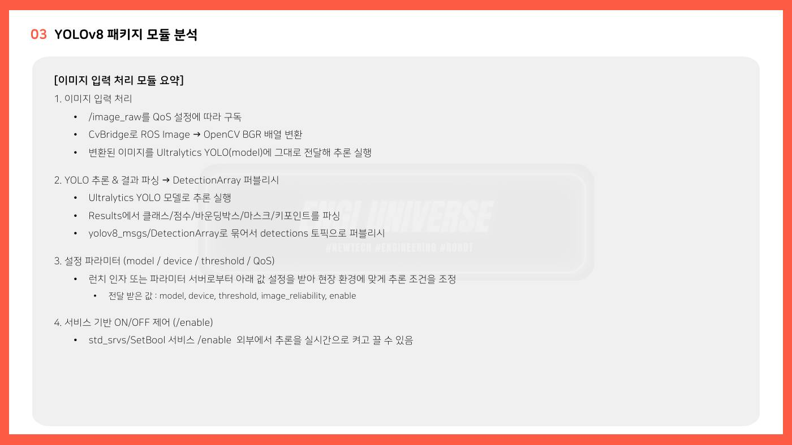{ width="700" }
    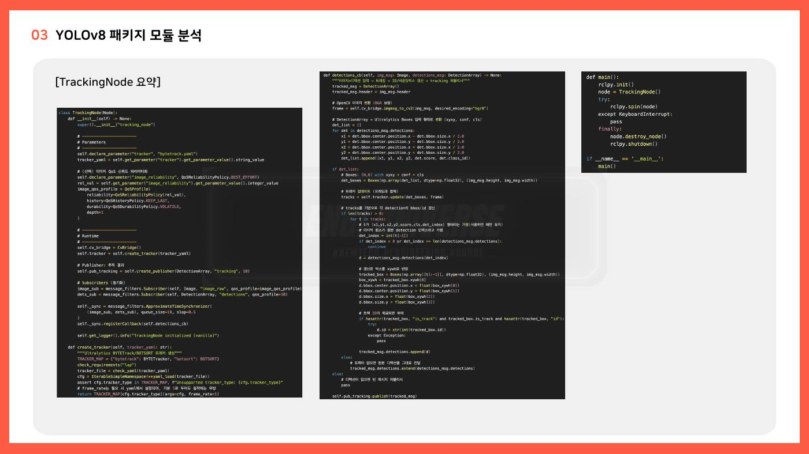{ width="700" }
    { width="700" }
    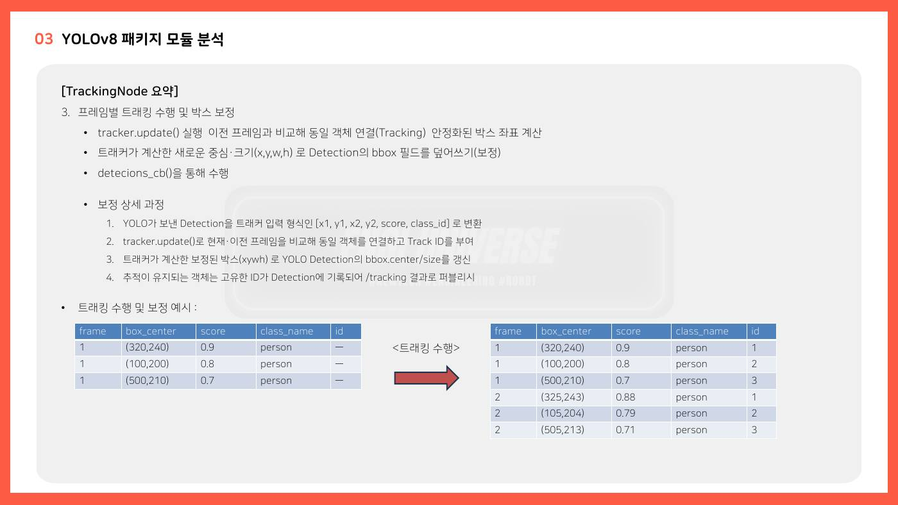{ width="700" }
    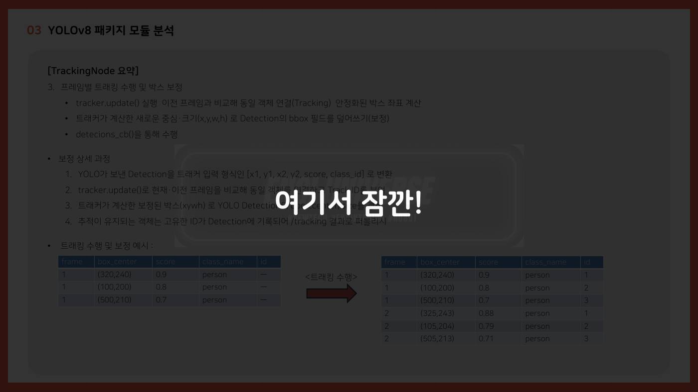{ width="700" }
    { width="700" }
    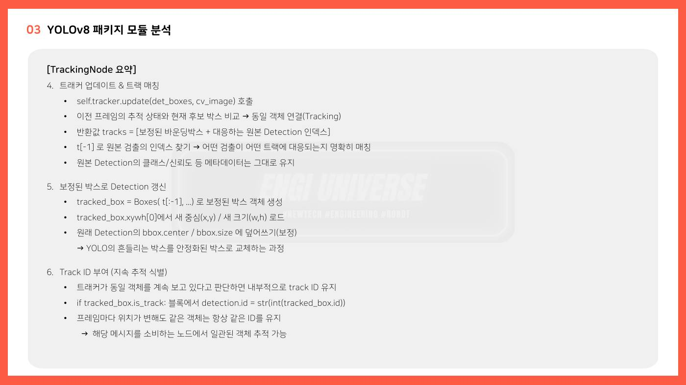{ width="700" }
    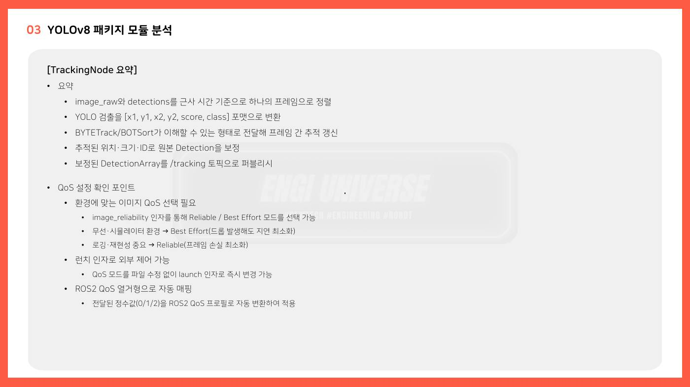{ width="700" }
    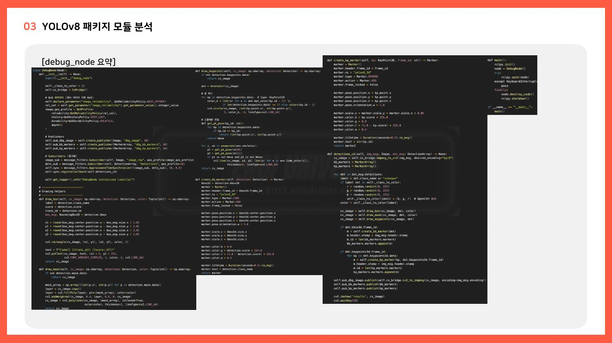{ width="700" }
    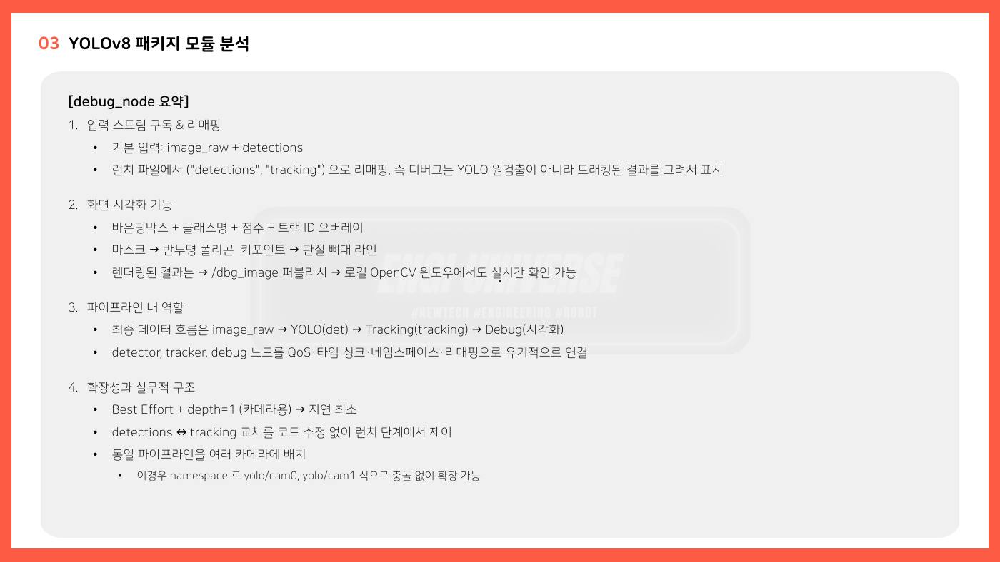{ width="700" }
    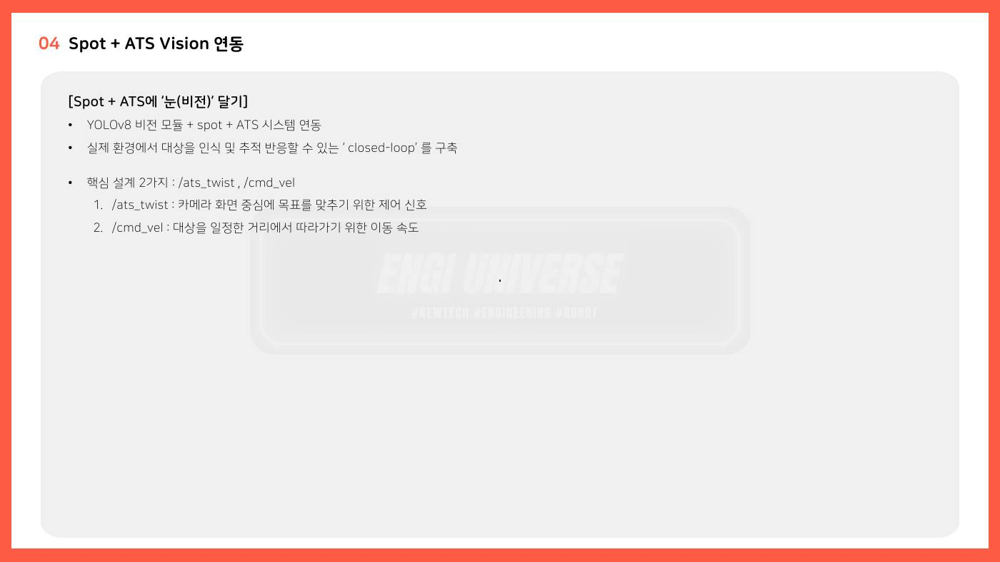{ width="700" }
    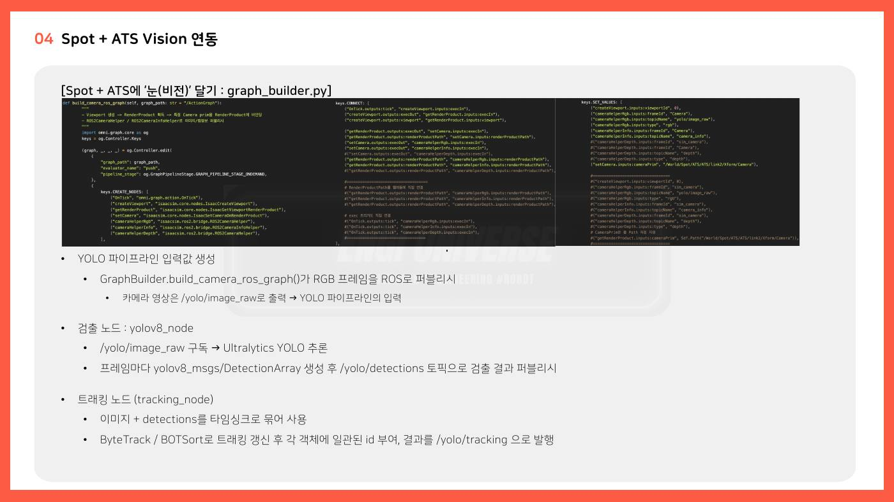{ width="700" }
    { width="700" }
    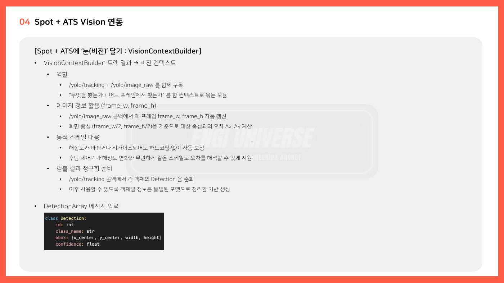{ width="700" }
    { width="700" }
    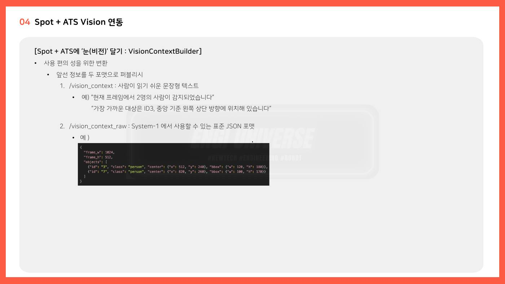{ width="700" }
    { width="700" }
    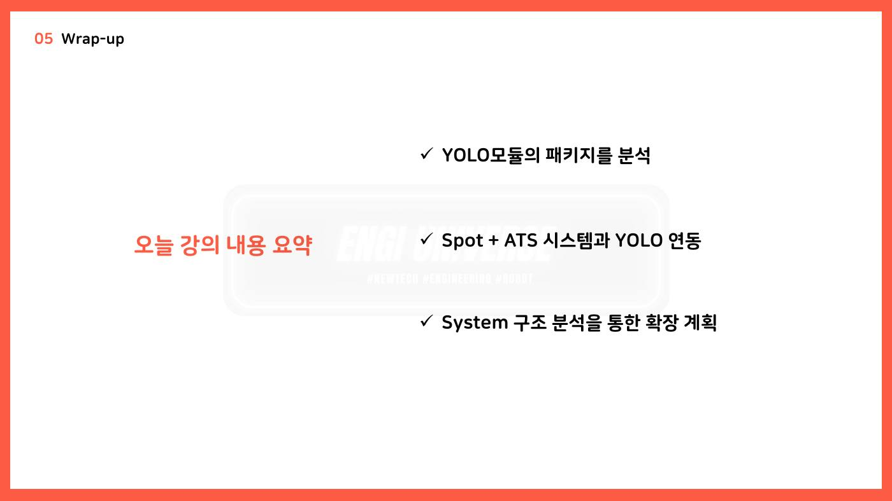{ width="700" }
    { width="700" }
