# 11주차 — System-1 Executor Node 설계

!!! abstract "학습목표"
    Spot+ATS 시스템을 **생각하는 두뇌(System-2)** 와 **실행하는 몸(System-1)** 의 두 계층으로 나누는 아키텍처를 이해하고, System-2가 내려준 고수준 플랜을 실제 물리 행동으로 바꾸는 **단위 액션(Unit Action)** 의 개념을 익힌다. 나아가 플랜을 검증·실행·모니터링하는 핵심 컴포넌트인 **System1ExecutorNode** 의 설계 철학과 내부 구조를 분석한다.

!!! quote "출처 (Source)"
    본 자료의 그림·예제는 교안 **「System-1 Executor Node 설계」**(제작: *ENGI UNIVERSE*)를 바탕으로 재구성하였습니다. 코드는 교안의 설명을 충실히 따른 **재구성 예제**입니다(원본 소스 비공개).

!!! note "강의 흐름 (FLOW)"
    `Plan JSON` → `Executor` → `Unit Action` → `Robot APIs` → `Status Report`

## ⏱️ 3시간 구성

| 교시 | 시간 | 내용 | 근거 교안 |
| --- | --- | --- | --- |
| 1교시 | 50분 | Spot+ATS 아키텍처 개요와 System-1 Executor의 역할 | §01 |
| 2교시 | 50분 | 단위 액션 설계 (Unit Action Design) — 6개 액션 | §02 |
| 3교시 | 50분 | System1ExecutorNode 설계 (검증·실행·동시성) & Wrap-up | §03~04 |

---

## 🧭 1교시. Spot+ATS 아키텍처 개요와 System-1 Executor의 역할

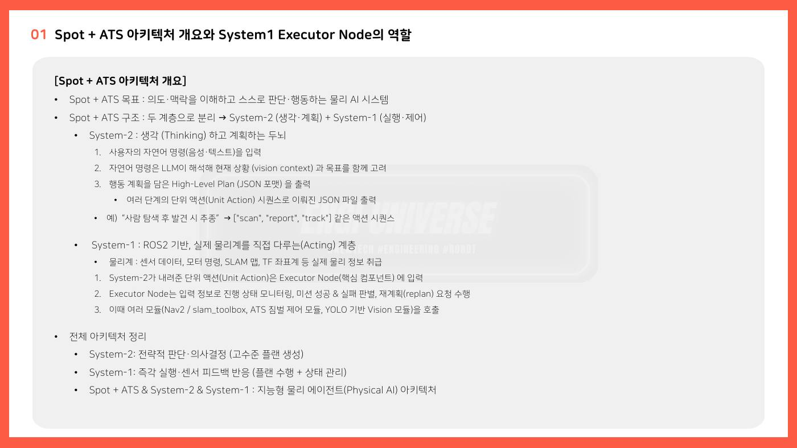{ width="720" }
/// caption
System-1 Executor Node 설계 — 슬라이드 03 (출처: ENGI UNIVERSE)
///

**Spot+ATS의 목표** 는 의도·맥락을 이해하고 스스로 판단·행동하는 **물리 AI(Physical AI) 시스템** 입니다. 이를 위해 시스템을 두 계층으로 분리합니다.

| 계층 | 역할 | 키워드 |
| --- | --- | --- |
| **System-2** | 생각(Thinking)하고 계획하는 두뇌 | 전략적 판단·의사결정, 고수준 플랜 생성 |
| **System-1** | 실제 물리계를 직접 다루는(Acting) 계층 | 즉각 실행·센서 피드백 반응, 플랜 수행 + 상태 관리 |

### System-2 — 생각하고 계획하는 두뇌

**Step 1 —** 사용자의 자연어 명령(음성·텍스트)을 입력받는다.
**Step 2 —** LLM이 명령을 해석해 현재 상황(vision context)과 목표를 함께 고려한다.
**Step 3 —** 행동 계획을 담은 **High-Level Plan(JSON 포맷)** 을 출력한다.

- 여러 단계의 단위 액션(Unit Action) 시퀀스로 이뤄진 JSON 파일을 출력
- 예) "사람 탐색 후 발견 시 추종" → `["scan", "report", "track"]` 같은 액션 시퀀스

### System-1 — 실제 물리계를 다루는 ROS2 계층

System-1은 ROS2 기반으로 센서 데이터, 모터 명령, SLAM 맵, TF 좌표계 등 **실제 물리 정보** 를 취급합니다.

**Step 1 —** System-2가 내려준 단위 액션을 **Executor Node(핵심 컴포넌트)** 에 입력한다.
**Step 2 —** Executor Node가 입력 정보로 진행 상태 모니터링, 미션 성공·실패 판별, 재계획(replan) 요청을 수행한다.
**Step 3 —** 이때 여러 모듈(**Nav2/slam_toolbox, ATS 짐벌 제어 모듈, YOLO 기반 Vision 모듈**)을 호출한다.

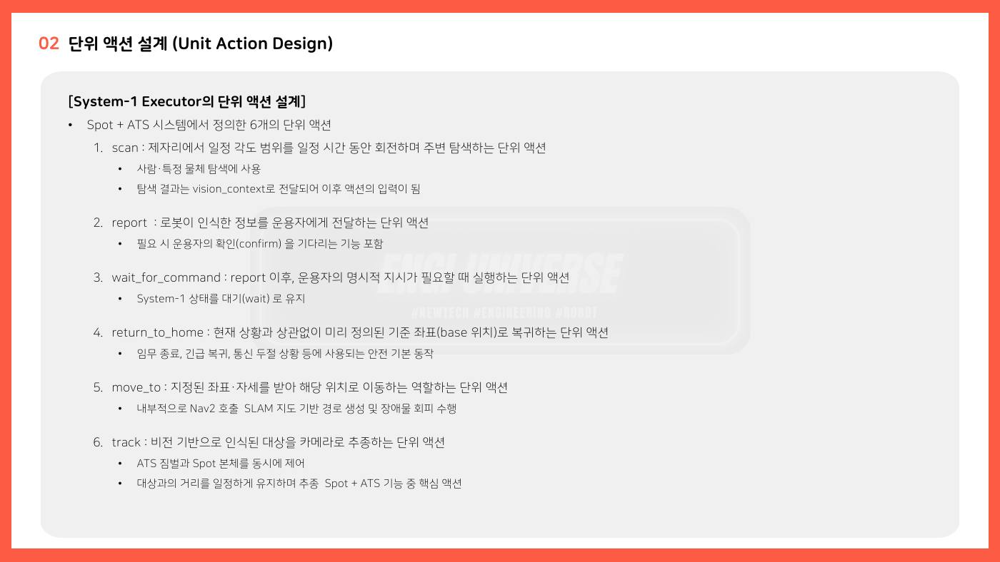{ width="720" }
/// caption
System-1 Executor Node 설계 — 슬라이드 05 (출처: ENGI UNIVERSE)
///

!!! note "전체 아키텍처 정리"
    - **System-2**: 전략적 판단·의사결정 (고수준 플랜 생성)
    - **System-1**: 즉각 실행·센서 피드백 반응 (플랜 수행 + 상태 관리)
    - **Spot+ATS & System-2 & System-1**: 지능형 물리 에이전트(Physical AI) 아키텍처

---

## 🧩 2교시. 단위 액션 설계 (Unit Action Design)

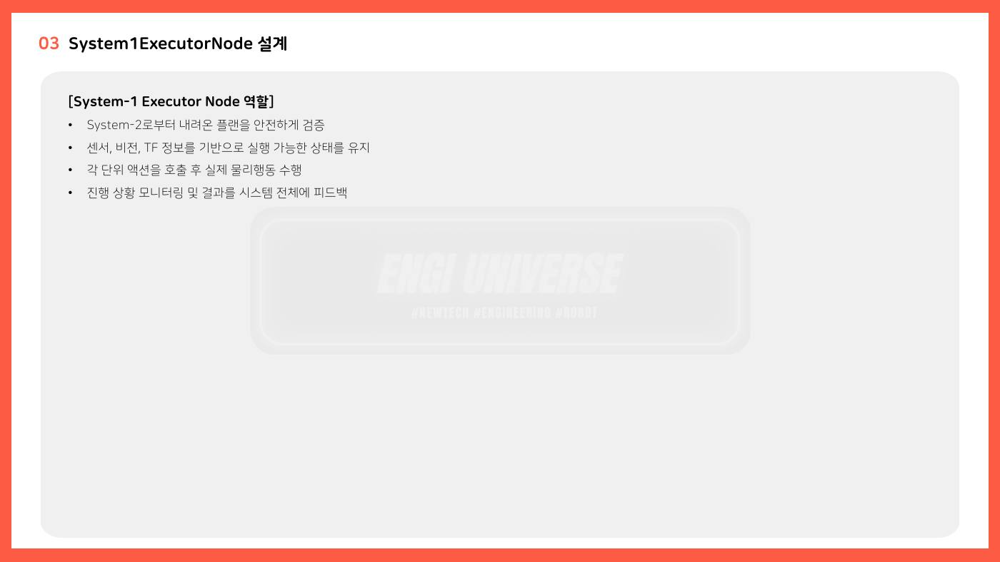{ width="720" }
/// caption
System-1 Executor Node 설계 — 슬라이드 07 (출처: ENGI UNIVERSE)
///

### 단위 액션(Unit Action)이란?

- **더 이상 쪼갤 수 없는 최소 실행 단위** — 하나의 액션이 끝나야 다음 액션으로 진행하는 구조
- System-2가 만든 고수준 플랜을 **실제 물리 행동으로 바꾸는 핵심 요소**
- 단위 액션의 원칙: **"하나의 액션 = 하나의 명확한 목적"**

!!! tip "왜 단위 액션이 중요할까?"
    - 복잡한 액션을 **레고처럼 조합** 해 사용 가능하며, 쉽게 시나리오 생성 가능
    - 실행 중 오류 발생 시 **디버깅·재계획(replan)이 쉬움**
    - 전체 행동 파이프라인이 **모듈형(Modular)** 으로 유지됨

### Spot+ATS 시스템에서 정의한 6개의 단위 액션

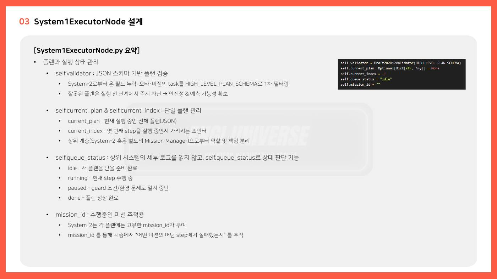{ width="720" }
/// caption
System-1 Executor Node 설계 — 슬라이드 09 (출처: ENGI UNIVERSE)
///

| # | 액션 | 설명 |
| --- | --- | --- |
| 1 | `scan` | 제자리에서 일정 각도 범위를 일정 시간 동안 회전하며 주변을 탐색. 결과는 `vision_context` 로 전달되어 이후 액션의 입력이 됨 |
| 2 | `report` | 로봇이 인식한 정보를 운용자에게 전달. 필요 시 운용자의 확인(confirm)을 기다리는 기능 포함 |
| 3 | `wait_for_command` | report 이후 운용자의 명시적 지시가 필요할 때 실행. System-1 상태를 **대기(wait)** 로 유지 |
| 4 | `return_to_home` | 현재 상황과 무관하게 미리 정의된 기준 좌표(base 위치)로 복귀. 임무 종료·긴급 복귀·통신 두절 등에 쓰는 **안전 기본 동작** |
| 5 | `move_to` | 지정된 좌표·자세로 이동. 내부적으로 **Nav2를 호출** 해 SLAM 지도 기반 경로 생성 및 장애물 회피 수행 |
| 6 | `track` | 비전 기반으로 인식된 대상을 카메라로 추종. **ATS 짐벌과 Spot 본체를 동시에 제어**, 대상과의 거리를 일정하게 유지 — Spot+ATS의 핵심 액션 |

!!! success "단위 액션 구조를 명확히 정의하는 이유"
    1. **명확한 분리** 로 System-2의 플랜 생성이 쉬워짐
    2. System-1에서 **유지·관리·디버깅이 쉬움**
    3. **확장성** 이 매우 높아짐

---

## ⚙️ 3교시. System1ExecutorNode 설계

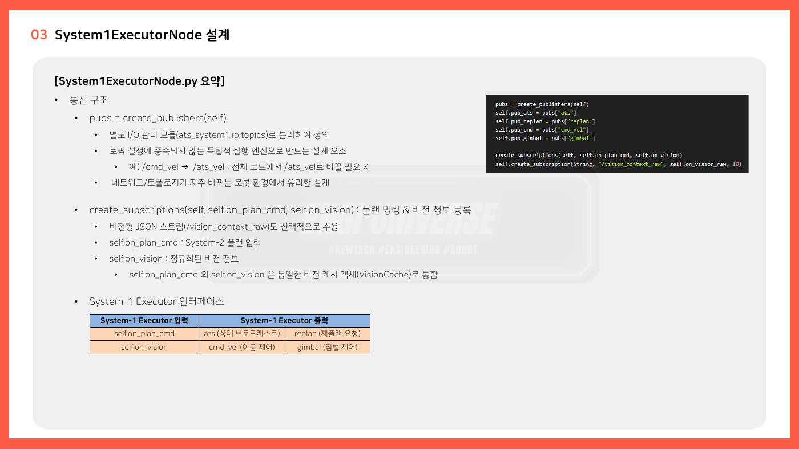{ width="720" }
/// caption
System-1 Executor Node 설계 — 슬라이드 12 (출처: ENGI UNIVERSE)
///

### System-1 Executor Node의 역할

- System-2로부터 내려온 플랜을 **안전하게 검증**
- 센서, 비전, TF 정보를 기반으로 **실행 가능한 상태를 유지**
- 각 단위 액션을 호출 후 **실제 물리 행동 수행**
- 진행 상황 모니터링 및 결과를 **시스템 전체에 피드백**

### TF 초기화 — "자기 위치를 모르는 위험"을 조기 감지

```python
# TF 초기화: 다른 노드에 의존하지 않아도 바로 최신 Pose 사용 가능
self.tf_listener      # TF 변환 리스너
self._last_pose       # 최신 Pose 캐시 (ok: 신뢰 가능 여부 포함)

# 1초마다 map → body 변환을 조회
self.create_timer(1.0, self._log_tf_pose)
```

- 변환 **성공** → `_last_pose` 갱신
- 변환 **실패** → `_last_pose["ok"] = False` 설정 + 경고 출력

!!! note "TF 초기화의 설계 의도"
    실행 중인 모든 단위 액션이 **신뢰 가능한 최신 포즈** 를 참조하도록 유지하고, TF 체인 이상·시뮬레이터/실기 셋업 오류를 즉시 감지한다. → Executor는 **'자기 위치를 모르는 상태에서 행동하는 위험'을 조기에 감지·회피** 하도록 설계된 실행기다.

### 플랜과 실행 상태 관리

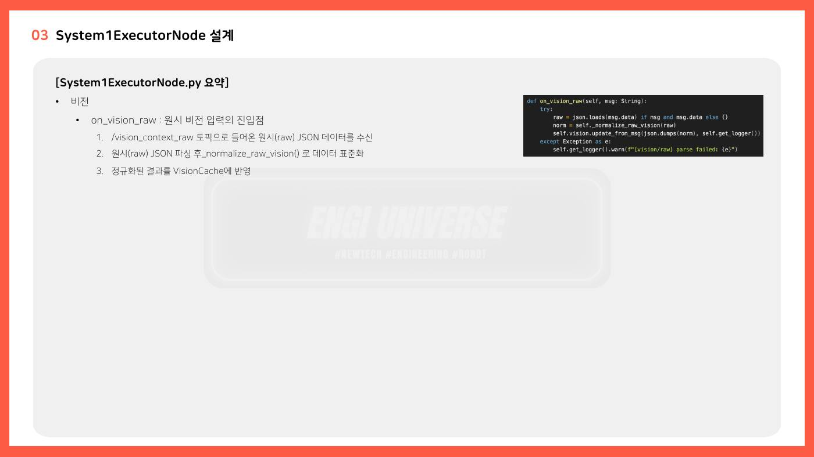{ width="720" }
/// caption
System-1 Executor Node 설계 — 슬라이드 14 (출처: ENGI UNIVERSE)
///

| 변수 | 역할 |
| --- | --- |
| `self.validator` | JSON 스키마 기반 플랜 검증. System-2의 필드 누락·오타·미정의 task를 **`HIGH_LEVEL_PLAN_SCHEMA`** 로 1차 필터링 → 잘못된 플랜은 실행 전 즉시 차단 |
| `self.current_plan` | 현재 실행 중인 전체 플랜(JSON) |
| `self.current_index` | 몇 번째 step을 실행 중인지 가리키는 포인터 |
| `self.queue_status` | 상세 로그를 읽지 않고 상태를 판단하게 하는 상태값 |
| `mission_id` | 수행 중인 미션 추적용. 각 플랜에 고유 ID 부여 → "어떤 미션의 어떤 step에서 실패했는지" 추적 |

**`queue_status` 의 상태 값**

- `idle` — 새 플랜을 받을 준비 완료
- `running` — 현재 step 수행 중
- `paused` — guard 조건/환경 문제로 일시 중단
- `done` — 플랜 정상 완료

### Guard 조건과 실행 제약

```python
# eval_guard(): 플랜 실행 전 동작 변수를 평가하는 관리 함수
ROU_OK          # 사용자 규칙 충족 여부
SAFE_BACKSTOP   # 안전구역 확보 여부
BATTERY_SOC     # 배터리 잔량
MAX_SPEED       # 동작 속도 제한
```

!!! warning "Guard 조건이 False인 경우 (예: 배터리 부족 / 안전 구역 미확보)"
    - 해당 step 실행을 중단하고 상태를 **`paused` / `error`** 로 전환
    - 필요 시 상위 시스템(System-2)에 **재계획 요청**

### 파라미터로 분리된 환경 의존 값

```python
# launch 파일 또는 YAML 파일로 외부에서 입력
self.declare_parameter(...)   # 카메라 기본 해상도, Home 좌표 등
```

- Executor의 **이식성과 확장성** 향상
- 환경이나 base 위치 변경 시 **재빌드 필요 없음**
- 환경 의존 값을 코드와 분리 → **어떤 로봇 플랫폼에서도 그대로 재활용** 가능한 핵심 설계

### 통신 구조

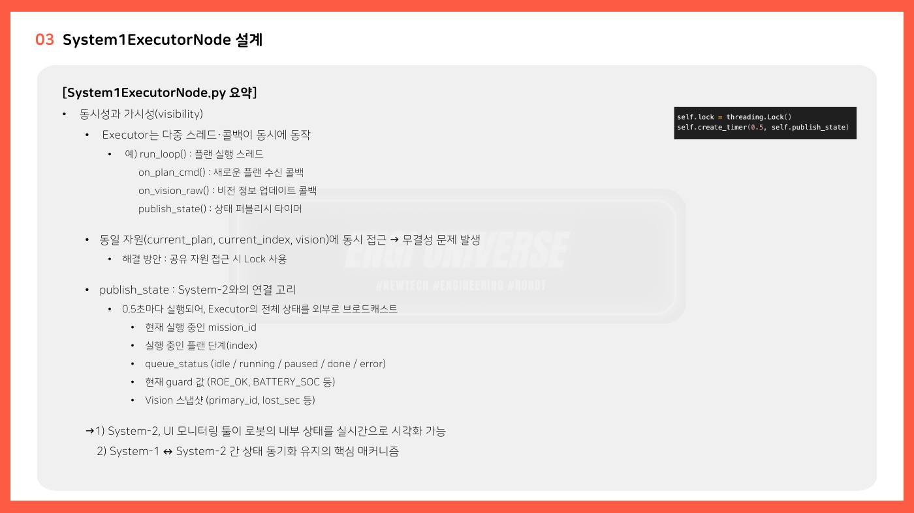{ width="720" }
/// caption
System-1 Executor Node 설계 — 슬라이드 17 (출처: ENGI UNIVERSE)
///

```python
# 별도 I/O 관리 모듈(ats_system1.io.topics)로 분리 → 토픽 설정에 종속되지 않는 독립 실행 엔진
pubs = create_publishers(self)

# 플랜 명령 & 비전 정보 등록
create_subscriptions(self, self.on_plan_cmd, self.on_vision)
#   self.on_plan_cmd : System-2 플랜 입력
#   self.on_vision   : 정규화된 비전 정보 (동일한 VisionCache로 통합)
#   비정형 JSON 스트림(/vision_context_raw)도 선택적으로 수용
```

- 토픽명이 바뀌어도(예: `/cmd_vel` → `/ats_vel`) 전체 코드를 고칠 필요 없음 → **네트워크/토폴로지가 자주 바뀌는 로봇 환경에 유리**

**System-1 Executor 인터페이스**

| 입력 | 출력 |
| --- | --- |
| `self.on_plan_cmd` (System-2 플랜) | `ats` (상태 브로드캐스트) |
| `self.on_vision` (비전 정보) | `replan` (재플랜 요청) |
| | `cmd_vel` (이동 제어) |
| | `gimbal` (짐벌 제어) |

### 비전 — VisionCache와 정규화

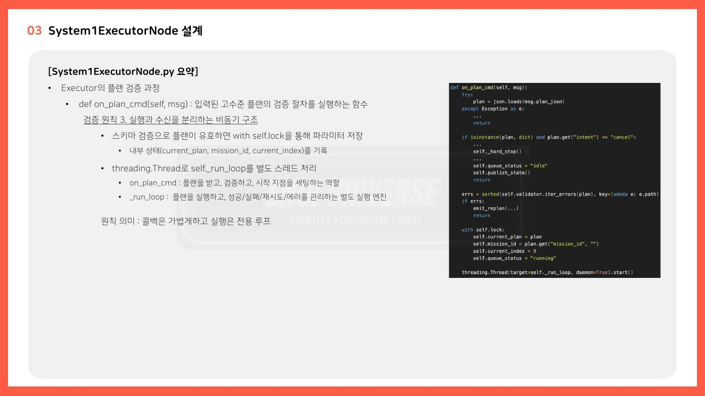{ width="720" }
/// caption
System-1 Executor Node 설계 — 슬라이드 19 (출처: ENGI UNIVERSE)
///

```python
# 표준화된 비전 상태 저장소: 단순 버퍼가 아니라 감지 객체 상태를 정규화해 저장하는 중앙 저장소
VisionCache(self._frame_w_default, self._frame_h_default)

# 다양한 비전 출력 포맷을 하나의 표준 구조로 통합하는 핵심 함수
def _normalize_raw_vision(self, raw): ...

# 원시 비전 입력의 진입점
def on_vision_raw(self, msg):
    # 1) /vision_context_raw 토픽의 원시(raw) JSON 수신
    # 2) 파싱 후 _normalize_raw_vision()으로 표준화
    # 3) 정규화 결과를 VisionCache에 반영
    ...
```

**정규화 데이터 구조**

| 필드 | 의미 |
| --- | --- |
| `targets` | 감지된 모든 객체 리스트. 요소는 `id`(식별자), `class`(YOLO class name), `bbox`([x,y,w,h] 중심기준), `range`(거리 z, 선택) |
| `primary_id` | 가장 먼저 감지된 주요 객체. `center`(cx, cy) 포함 → track/report의 "주 대상" |
| `lost_sec` | 아무 객체도 감지되지 않은 누적 시간. 값이 커지면 **"타깃 손실"** 판단 → 다음 액션 전환 트리거 |

!!! success "비전 모듈 설계 핵심 의도"
    1. **모델 독립성(Model Independence)** — YOLOv8 → YOLOv10 교체 시 `_normalize_raw_vision()` 만 수정하면 됨
    2. **데이터 일관성·해석 가능성** — 비전 데이터가 불안정하면 System-2의 플랜 품질도 저하됨
    → `_normalize_raw_vision` 와 `on_vision_raw` 덕분에 Executor가 특정 비전 알고리즘에 종속되지 않고 **범용 실행 엔진** 으로 유지된다.

### 추적(Tracking)과 이동(Navigation)의 위임

```text
# 책임 위임: Executor는 "언제 시작·성공/실패 판단·재시도/재플랜 시점"만 결정
track    -> Tracker          # 카메라 중심 기준 타깃 추적: 짐벌(pitch, yaw) + 본체(vx, wz) 동시 계산
move_to  -> Nav2Navigator    # Nav2를 직접 호출, 내부 상태(goal_reached, aborted)는 Navigator가 처리
DepthBuffer                  # 깊이 센서 데이터 실시간 관리 → "현재 타깃까지 거리" 즉시 조회
```

- **위임 이유 1** — Executor는 시작 시점·성공/실패 판단·재시도/재플랜 시점만 결정
- **위임 이유 2** — 기능 업데이트가 발생해도 **플랜 실행 로직은 수정 불필요**
- Executor는 Navigator가 제공하는 최소 상태(`_nav_feedback`: `distance_remaining`, `stamp` 등)만 참조 → **"도달/실패/재시도/재플랜" 판단에만 집중** 해 복잡도 최소화

### 동시성과 가시성(Visibility)

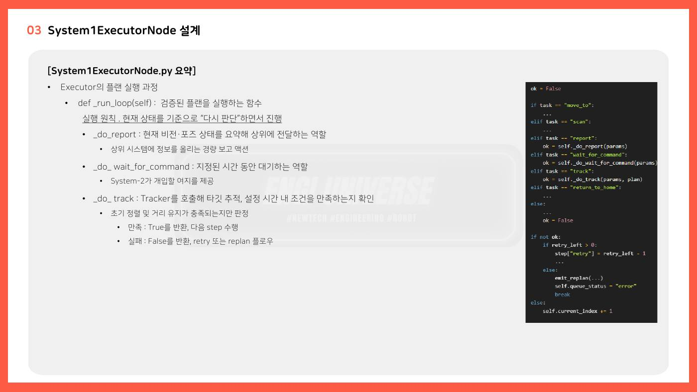{ width="720" }
/// caption
System-1 Executor Node 설계 — 슬라이드 22 (출처: ENGI UNIVERSE)
///

```python
# Executor는 다중 스레드·콜백이 동시에 동작
run_loop()         # 플랜 실행 스레드
on_plan_cmd()      # 새로운 플랜 수신 콜백
on_vision_raw()    # 비전 정보 업데이트 콜백
publish_state()    # 상태 퍼블리시 타이머
```

- 동일 자원(`current_plan`, `current_index`, `vision`)에 동시 접근 → **무결성 문제** 발생
- 해결: 공유 자원 접근 시 **Lock 사용**

!!! note "publish_state — System-2와의 연결 고리"
    **0.5초마다** 실행되어 Executor 전체 상태를 외부로 브로드캐스트한다: 현재 `mission_id`, 실행 중인 플랜 단계(`index`), `queue_status`, 현재 guard 값, Vision 스냅샷(`primary_id`, `lost_sec`).
    → System-2·UI 모니터링 툴이 로봇 내부 상태를 실시간 시각화하고, **System-1 ↔ System-2 상태 동기화** 를 유지하는 핵심 메커니즘.

### Executor의 플랜 검증 과정 — `on_plan_cmd`

```python
def on_plan_cmd(self, msg):
    # 원칙 1. 플랜의 신뢰성을 코드 수준에서 강제
    plan = json.loads(msg.plan_json)               # 파싱 실패 → 실패 로그 반환
    for err in self.validator.iter_errors(plan):   # HIGH_LEVEL_PLAN_SCHEMA 검증
        self.emit_replan(...)                      # 오류 시 재계획 요청 + 플랜 제거
        return

    # 원칙 2. cancel을 최우선 인터럽트로 취급
    if isinstance(plan, dict) and plan.get("intent") == "cancel":
        self._hard_stop()        # 프로세스 종료 X, 상태만 idle로 → 제어권 회수
        return

    # 원칙 3. 실행과 수신을 분리하는 비동기 구조
    with self.lock:
        self.current_plan = plan        # current_plan, mission_id, current_index 기록
        ...
    threading.Thread(target=self._run_loop).start()   # 실행은 전용 루프로
```

| 검증 원칙 | 의미 |
| --- | --- |
| 1. 스키마 검증 | **"LLM이 생성해도, 규격을 만족하지 않으면 실행하지 않는다"** → 물리 시스템의 첫 번째 안전장치 |
| 2. cancel 인터럽트 | 상위 시스템이 중단을 요청할 때 즉각 반응 → **제어권 회수** |
| 3. 비동기 분리 | **콜백은 가볍게, 실행은 전용 루프**(`_run_loop`)로 |

### Executor의 플랜 실행 과정 — `_run_loop`

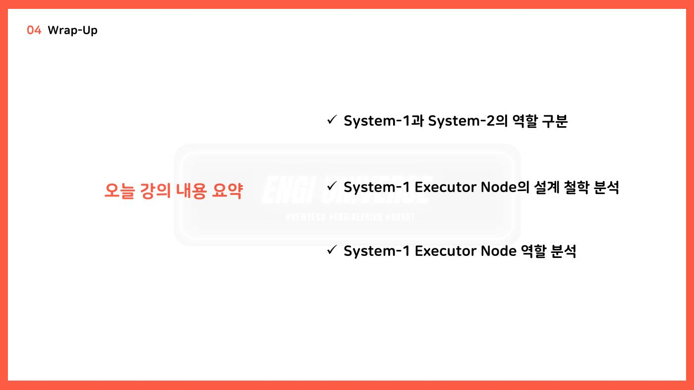{ width="720" }
/// caption
System-1 Executor Node 설계 — 슬라이드 24 (출처: ENGI UNIVERSE)
///

```python
def _run_loop(self):
    with self.lock:               # 이중 검증: current_plan, current_index, queue_status 로드
        ...
    if plan is None or status != "running":   # 플랜 없거나 running 아니면 즉시 종료
        return
    if idx >= len(steps):         # step 배열 범위 초과 → 종료
        self.queue_status = "done"
        return

    ok = False                    # 초기화 후 task 분기
    # move_to -> exec_move_to() | scan -> exec_scan() | report -> _do_report()
    # wait_for_command -> _do_wait_for_command() | track -> _do_track()
    # return_to_home -> home 좌표 goal로 변환 후 exec_move_to()
```

**각 Step의 4요소 — System-2와 System-1 사이의 최소 실행 단위 계약**

| 요소 | 의미 |
| --- | --- |
| `task` | 수행할 단위 액션 이름 |
| `params` | 해당 액션에 필요한 인자 |
| `guard` | 안전 조건 체크 (`BATTERY_SOC`, `SAFE_BACKSTOP` 등) — 불만족 시 `paused` |
| `retry` | 실패 재시도 횟수 |

**True/False 계약에 따른 플로우 제어**

- `True` → `current_index += 1` 후 다음 step 실행
- `False` → retry 확인 후 남은 재시도가 있으면 같은 step 반복 → retry 소진 시 `emit_replan(...)` 호출 + `queue_status = "error"`

!!! success "플랜 실행 설계의 보장 사항"
    - 안전 조건을 만족할 때까진 해당 step을 **절대 실행하지 않는다**
    - 일시 정지 상태를 상위에서 해석·재개할 수 있도록 남겨둔다
    - **설계 장점**: ① 단위 액션이 늘어나도 `_run_loop` 로직은 고정 ② 액션 내부 구현이 바뀌어도 True/False 계약만 맞으면 재사용 ③ 실패·재시도·재플랜이 모든 액션에 **일관된 방식** 으로 동작

**개별 액션 동작 요약**

- `_do_report` — 현재 비전·포즈 상태를 요약해 상위에 전달하는 **경량 보고 액션**
- `_do_wait_for_command` — 지정된 시간 동안 대기 → System-2가 개입할 여지 제공
- `_do_track` — Tracker를 호출해 추적, 설정 시간 내 **초기 정렬·거리 유지** 충족 여부만 판정 (만족 → True, 실패 → False)

### 상태 문자열과 publish_state

```python
def state_string(self) -> str:
    # running 상태 + 유효 플랜/인덱스 → 현재 task 반환 (move_to / track ...)
    # 미실행 or No 플랜 or 무효 인덱스 → queue_status 반환 (idle/paused/done/error)
    ...

def publish_state(self):
    # 다음 항목을 하나의 상태 메시지로 통합 발송:
    #   state_string(), _last_pose(위치·yaw), mission_id,
    #   queue_status, guard 심볼(BATTERY_SOC 등), vision_snapshot
    ...
```

---

## 🧷 Wrap-up

{ width="720" }
/// caption
System-1 Executor Node 설계 — 슬라이드 25 (출처: ENGI UNIVERSE)
///

- **System-1과 System-2의 역할 구분** — 두뇌(생각·계획)와 몸(실행·제어)의 분리
- **System-1 Executor Node 역할** — 플랜 검증 → 실행 가능 상태 유지 → 단위 액션 호출 → 결과 피드백
- **설계 철학** — 환경 의존 값 분리(이식성), 비전·추적·내비게이션 위임(독립성), True/False 계약(일관성), Lock·guard(안전성·무결성)

## ✅ 체크포인트

- [ ] System-2(두뇌)와 System-1(몸)의 역할 구분을 설명할 수 있는가
- [ ] 단위 액션의 정의와 6개 액션(scan/report/wait_for_command/return_to_home/move_to/track)을 설명할 수 있는가
- [ ] `queue_status` 의 상태값(idle/running/paused/done/error)과 전환 조건을 이해했는가
- [ ] `on_plan_cmd` 의 3가지 검증 원칙(스키마·cancel·비동기 분리)을 설명할 수 있는가
- [ ] 각 Step의 4요소(task/params/guard/retry)와 True/False 실행 계약을 이해했는가

## 📊 평가 루브릭

| 항목 | 배점 | 기준 |
| --- | --- | --- |
| 아키텍처 이해 | 20 | System-2/System-1 2계층 분리와 Executor의 위치를 정확히 설명 |
| 단위 액션 설계 | 20 | 6개 단위 액션의 목적과 "1액션=1목적" 원칙·모듈성을 설명 |
| 플랜 검증·실행 | 25 | `on_plan_cmd` 검증 원칙과 `_run_loop`의 True/False 계약·재시도/재플랜 흐름 이해 |
| 비전·위임 설계 | 20 | VisionCache 정규화, Tracker·Nav2Navigator 위임의 설계 의도 설명 |
| 동시성·안전성 | 15 | Lock·guard·`publish_state`를 통한 무결성·상태 동기화 메커니즘 설명 |

## 🔗 출처 및 참고자료

- 교안 **「System-1 Executor Node 설계」** (제작: ENGI UNIVERSE) — 강의 슬라이드 원본
- ROS 2 Documentation — <https://docs.ros.org>
- Nav2 (Navigation2) — <https://docs.nav2.org>
- Ultralytics YOLO — <https://docs.ultralytics.com>

## 📖 핵심 용어 설명

### System-2 / System-1 (2계층 아키텍처)
- **정의**: 로봇 지능을 **생각하는 두뇌(System-2)** 와 **실행하는 몸(System-1)** 으로 나눈 2계층 구조. System-2는 LLM 기반으로 명령을 해석해 고수준 플랜을 만들고, System-1은 ROS2 기반으로 그 플랜을 실제 물리 행동으로 수행한다.
- **역할/왜 중요한가**: 느리지만 신중한 판단(System-2)과 빠르고 즉각적인 실행(System-1)을 분리하면, 각 계층을 독립적으로 개발·교체·디버깅할 수 있고 전체 시스템의 안정성이 높아진다. 인간 인지의 "느린 사고/빠른 사고"에서 따온 개념이다.
- **맥락·예시**: 1교시에서 "사람 탐색 후 추종" 명령이 System-2에서 `["scan", "report", "track"]` 시퀀스로 바뀌어 System-1의 Executor로 전달되는 흐름으로 설명된다.

### 단위 액션 (Unit Action)
- **정의**: **더 이상 쪼갤 수 없는 최소 실행 단위** 로, "하나의 액션 = 하나의 명확한 목적" 원칙을 따르는 행동 블록. 하나가 끝나야 다음으로 진행한다.
- **역할/왜 중요한가**: 복잡한 임무를 레고처럼 조합해 만들 수 있고, 오류 발생 시 어느 액션에서 실패했는지 추적·재계획(replan)하기 쉽다. 전체 행동 파이프라인을 모듈형으로 유지하는 핵심 개념이다.
- **맥락·예시**: 2교시의 6개 액션(`scan`/`report`/`wait_for_command`/`return_to_home`/`move_to`/`track`)이 모두 단위 액션이며, System-2의 플랜은 이들의 시퀀스로 구성된다.

### System1ExecutorNode (Executor)
- **정의**: System-2가 내려준 플랜(JSON)을 **검증 → 실행 가능 상태 유지 → 단위 액션 호출 → 결과 피드백** 하는 System-1의 핵심 ROS2 노드.
- **역할/왜 중요한가**: 플랜을 그대로 믿고 실행하지 않고, 스키마 검증·guard 조건·TF 신뢰성 등을 점검해 "물리 시스템의 안전장치" 역할을 한다. 비전·추적·내비게이션 기능을 직접 구현하지 않고 위임하므로 범용 실행 엔진으로 유지된다.
- **맥락·예시**: 3교시 전체가 이 노드의 내부 구조(`on_plan_cmd`, `_run_loop`, `publish_state` 등) 분석이다.

### TF (Transform, 좌표 변환)
- **정의**: ROS2에서 서로 다른 좌표계(예: `map`, `body`) 사이의 위치·자세 관계를 시간에 따라 추적·변환해 주는 시스템.
- **역할/왜 중요한가**: 로봇이 "지도상 자기 위치"를 알아야 안전하게 행동할 수 있다. Executor는 1초마다 `map → body` 변환을 조회해 최신 Pose를 캐시하고, 변환 실패 시 `_last_pose["ok"]=False`로 표시해 **'자기 위치를 모르는 위험'을 조기에 감지** 한다.
- **맥락·예시**: 3교시 "TF 초기화" 절의 `self.tf_listener`, `_last_pose`, `create_timer(1.0, self._log_tf_pose)` 코드 참조.

### Guard 조건 (실행 제약)
- **정의**: 각 step을 실행하기 전에 평가하는 안전·환경 조건 묶음. 대표 변수로 `ROU_OK`(사용자 규칙 충족), `SAFE_BACKSTOP`(안전구역 확보), `BATTERY_SOC`(배터리 잔량), `MAX_SPEED`(속도 제한)가 있다.
- **역할/왜 중요한가**: 조건이 하나라도 `False`면 step 실행을 중단하고 상태를 `paused`/`error`로 전환하며, 필요 시 System-2에 재계획을 요청한다. 안전 조건을 만족할 때까지 행동을 **절대 실행하지 않도록** 보장한다.
- **맥락·예시**: `eval_guard()` 함수와 각 step의 4요소 중 `guard` 항목에서 사용된다.

### queue_status (실행 상태값)
- **정의**: Executor의 현재 실행 상태를 한눈에 나타내는 상태 변수. 값은 `idle`(새 플랜 대기), `running`(step 수행 중), `paused`(일시 중단), `done`(완료), `error`(재시도 소진 등 실패)가 있다.
- **역할/왜 중요한가**: 상세 로그를 일일이 읽지 않고도 외부(System-2·UI)가 로봇 상태를 즉시 판단하게 해 준다. 상태 동기화의 기본 단위다.
- **맥락·예시**: `_run_loop`의 True/False 결과와 guard 평가에 따라 값이 전환되며, `publish_state`로 0.5초마다 브로드캐스트된다.

### True/False 계약 (실행 계약)
- **정의**: 모든 단위 액션 핸들러가 성공이면 `True`, 실패면 `False`만 반환하기로 정한 약속. `True`면 `current_index += 1`로 다음 step, `False`면 retry 확인 후 재시도하거나 소진 시 `emit_replan` + `error`로 처리한다.
- **역할/왜 중요한가**: 액션이 늘어나거나 내부 구현이 바뀌어도 `_run_loop` 로직은 고정되며, 실패·재시도·재플랜이 모든 액션에 **일관된 방식** 으로 동작한다.
- **맥락·예시**: `_run_loop`의 task 분기(`exec_move_to`, `exec_scan`, `_do_track` 등)가 모두 이 계약을 따른다.

### VisionCache / 정규화 (Normalization)
- **정의**: 다양한 비전 모델의 서로 다른 출력 포맷을 `_normalize_raw_vision()`으로 하나의 표준 구조(`targets`, `primary_id`, `lost_sec`)로 통합해 저장하는 중앙 비전 상태 저장소.
- **역할/왜 중요한가**: 비전 모델을 교체(YOLOv8→YOLOv10)해도 정규화 함수만 고치면 되어 **모델 독립성** 을 확보한다. 비전 데이터가 일관되어야 System-2의 플랜 품질도 유지된다.
- **맥락·예시**: `on_vision_raw`가 `/vision_context_raw` 원시 JSON을 받아 정규화 후 `VisionCache`에 반영한다.

### Lock (동시성 제어)
- **정의**: 여러 스레드·콜백이 동시에 같은 자원에 접근할 때 한 번에 하나만 접근하도록 막는 잠금 장치(`threading.Lock`).
- **역할/왜 중요한가**: Executor는 `run_loop`(실행), `on_plan_cmd`(플랜 수신), `on_vision_raw`(비전), `publish_state`(상태 발행)가 동시에 돈다. `current_plan`·`current_index`·`vision` 같은 공유 자원의 **무결성** 을 지키려면 Lock이 필수다.
- **맥락·예시**: `on_plan_cmd`와 `_run_loop`가 `with self.lock:` 블록 안에서 공유 상태를 읽고 쓴다.

### 책임 위임 (Tracker / Nav2Navigator / DepthBuffer)
- **정의**: Executor가 추적·내비게이션 같은 세부 기능을 직접 구현하지 않고 전담 모듈에 맡기는 설계. `track`은 Tracker(짐벌 pitch·yaw + 본체 vx·wz 계산), `move_to`는 Nav2Navigator(경로·장애물 회피), 거리 조회는 DepthBuffer가 담당한다.
- **역할/왜 중요한가**: Executor는 "언제 시작·성공/실패 판단·재시도/재플랜할지"만 결정해 복잡도를 최소화한다. 기능이 업데이트돼도 플랜 실행 로직은 수정할 필요가 없다.
- **맥락·예시**: Executor는 Navigator의 최소 상태(`_nav_feedback`: `distance_remaining`, `stamp`)만 참조한다.

### 주요 약어·구성요소

| 용어 | 설명 |
| --- | --- |
| `HIGH_LEVEL_PLAN_SCHEMA` | System-2 플랜(JSON)의 필수 필드·형식을 정의한 검증 스키마. `validator`가 이를 기준으로 필드 누락·오타·미정의 task를 실행 전에 1차 차단 |
| Nav2 (Navigation2) | ROS2 표준 자율주행 스택. SLAM 지도 기반으로 경로를 생성하고 장애물을 회피. `move_to`/`return_to_home`가 내부적으로 호출 |
| `slam_toolbox` | ROS2의 SLAM(동시적 위치추정·지도작성) 패키지. 로봇이 맵을 만들고 그 안에서 자기 위치를 추정하게 함 |
| YOLO (You Only Look Once) | 실시간 객체 탐지 딥러닝 모델. Vision 모듈이 객체의 `class`·`bbox`를 산출하며, 결과는 정규화되어 VisionCache로 들어감 |
| ATS 짐벌 (Gimbal) | 카메라 자세를 pitch·yaw로 제어하는 장치. `track` 액션에서 Spot 본체와 **동시에** 제어되어 대상을 화면 중심에 유지 |
| `mission_id` | 각 플랜에 부여되는 고유 ID. "어떤 미션의 어떤 step에서 실패했는지" 추적하는 데 사용 |
| `publish_state` | 0.5초마다 Executor 전체 상태(`mission_id`, `index`, `queue_status`, guard 값, vision 스냅샷)를 브로드캐스트해 System-1↔System-2 상태를 동기화하는 메커니즘 |

---

## 📝 11주차 과제

!!! example "과제 11 — System-1 Executor 골격 설계"
    **목표**: System-2의 Plan(JSON)을 한 줄씩 실행하는 Executor의 골격을 설계한다. TF 추적·vision 캐시·guard 판단·단위 액션 디스패치 구조를 코드/의사코드로 표현한다.

**과제 흐름도**


```mermaid
graph LR
  A[Plan 수신] --> B[Executor 순회] --> C[guard 판단] --> D[액션 디스패치] --> E[📦 코드+흐름도]
```

**수행 단계**

1. Plan(step 시퀀스) 수신·순회 루프 설계
2. TF로 현재 pose 추적, vision 컨텍스트 캐시
3. guard(실행 가능 여부) 판단 로직
4. 단위 액션 5종 디스패치 표 작성

**제출물**

- [ ] Executor 골격 코드/의사코드
- [ ] 상태 전이·디스패치 흐름도
- [ ] 단위 액션↔핸들러 매핑 표
- [ ] 설계 설명 보고서(1쪽)

**평가 (배점 100)**

| 항목 | 배점 | 기준 |
| --- | --- | --- |
| Executor 구조 | 40 | Plan 순회·디스패치 |
| guard·상태관리 | 35 | TF/vision/guard 설계 |
| 문서화 | 25 | 흐름도·설명 |

**제출 형식·마감**: 다음 주차 강의 시작 전까지 LMS 업로드 — ① 코드/설정 `zip` ② 보고서 `PDF`(표지: 학번·이름·과제명) ③ 실행 결과 스크린샷/영상. 코드는 재현 가능해야 하며, 외부 코드를 사용하면 출처를 명시한다(미표기 시 감점).

<!-- FULLDECK -->
## 🖼️ 원본 강의 슬라이드

??? note "원본 강의 슬라이드 전체 (25매)"
    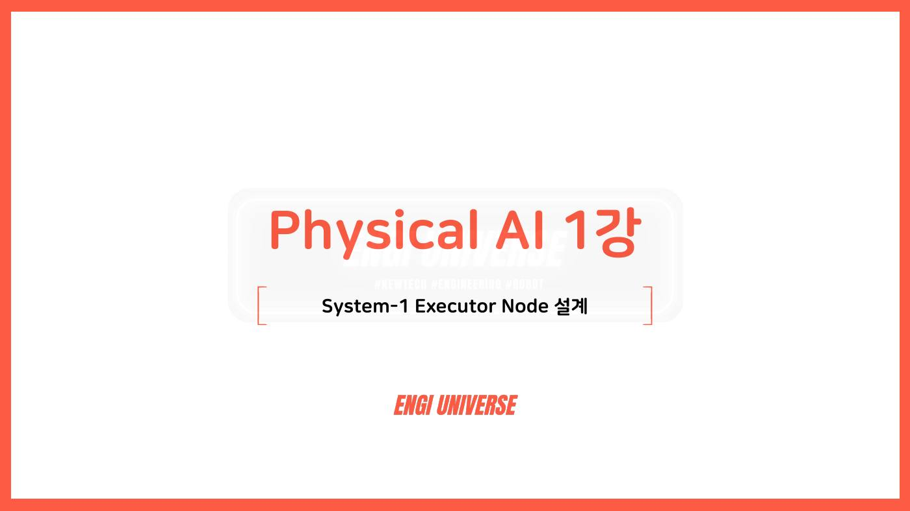{ width="700" }
    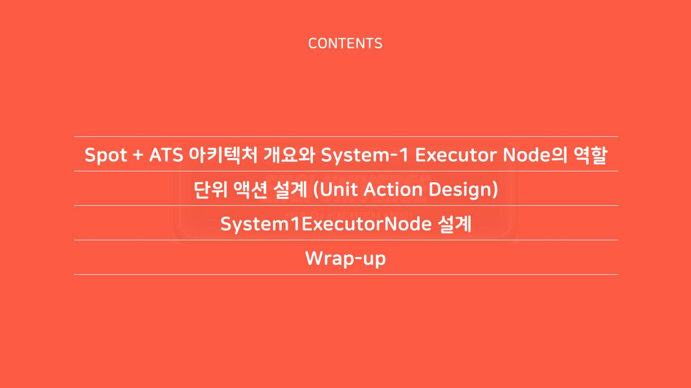{ width="700" }
    { width="700" }
    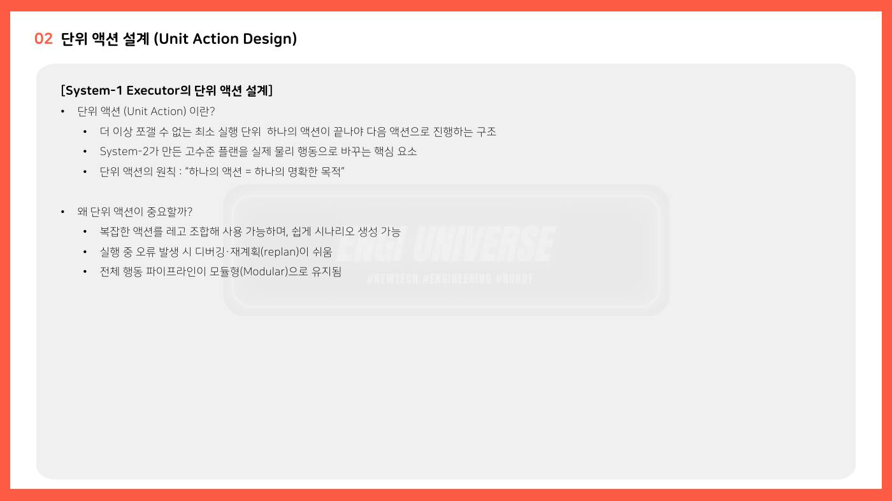{ width="700" }
    { width="700" }
    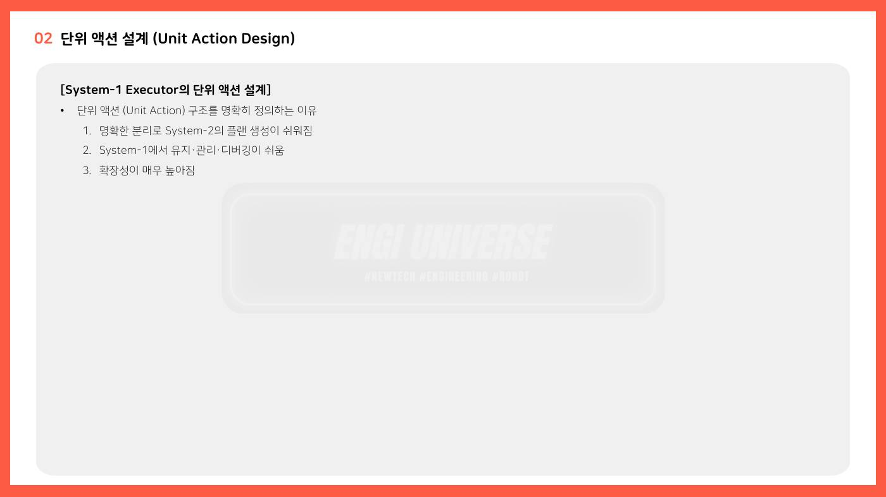{ width="700" }
    { width="700" }
    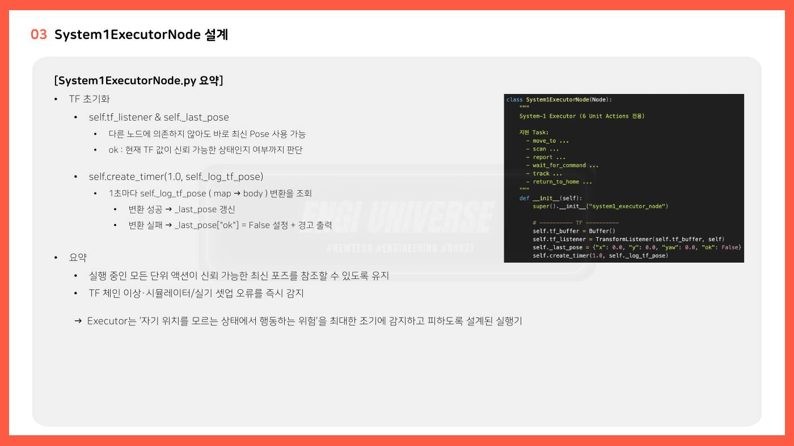{ width="700" }
    { width="700" }
    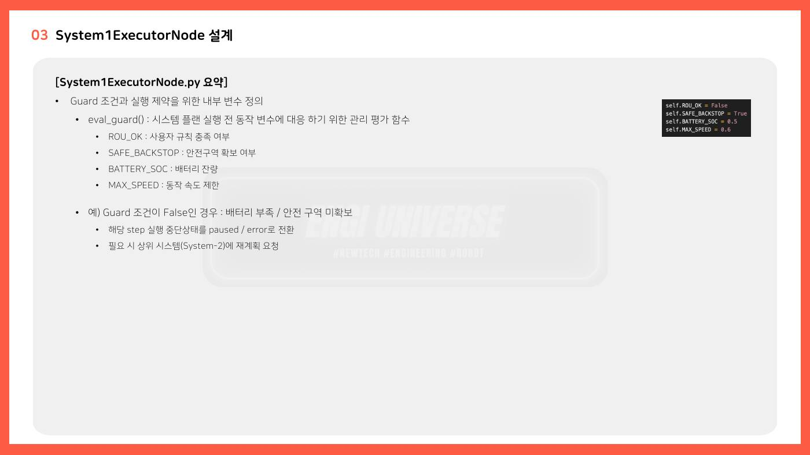{ width="700" }
    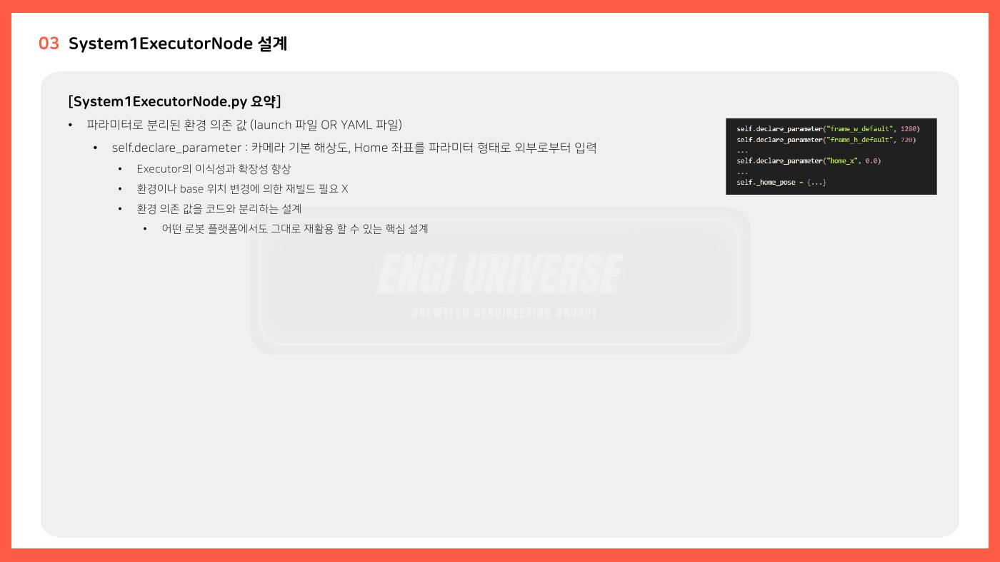{ width="700" }
    { width="700" }
    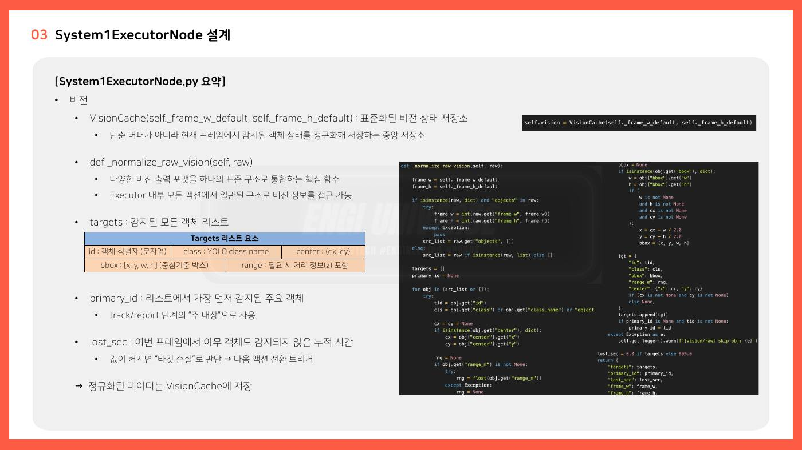{ width="700" }
    { width="700" }
    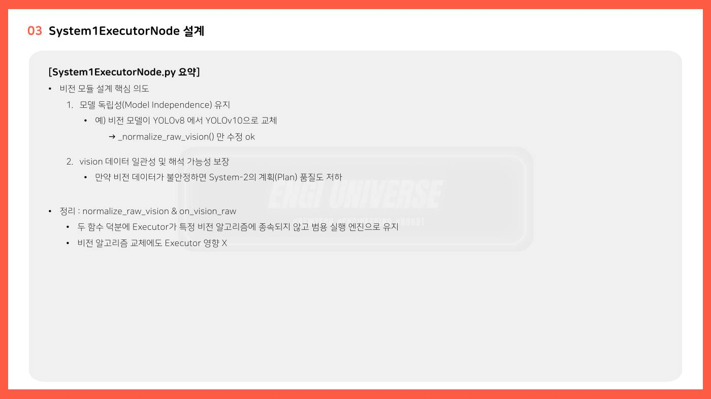{ width="700" }
    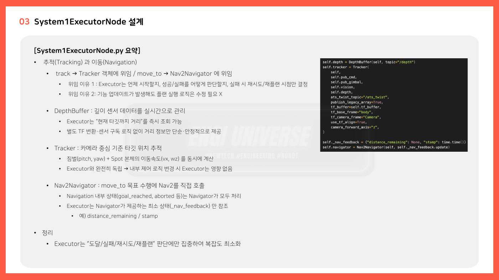{ width="700" }
    { width="700" }
    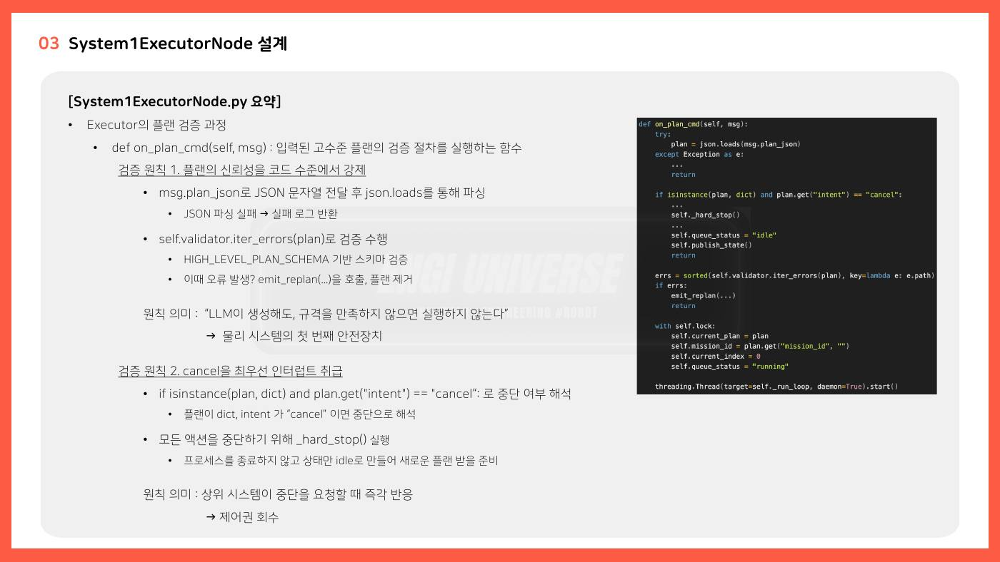{ width="700" }
    { width="700" }
    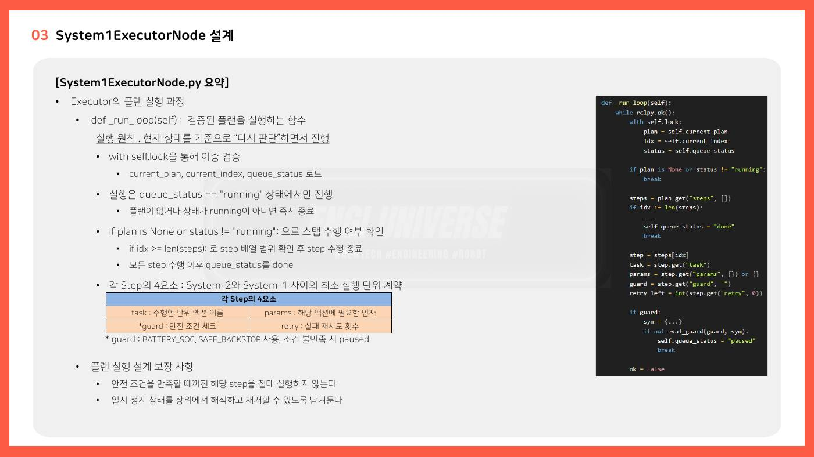{ width="700" }
    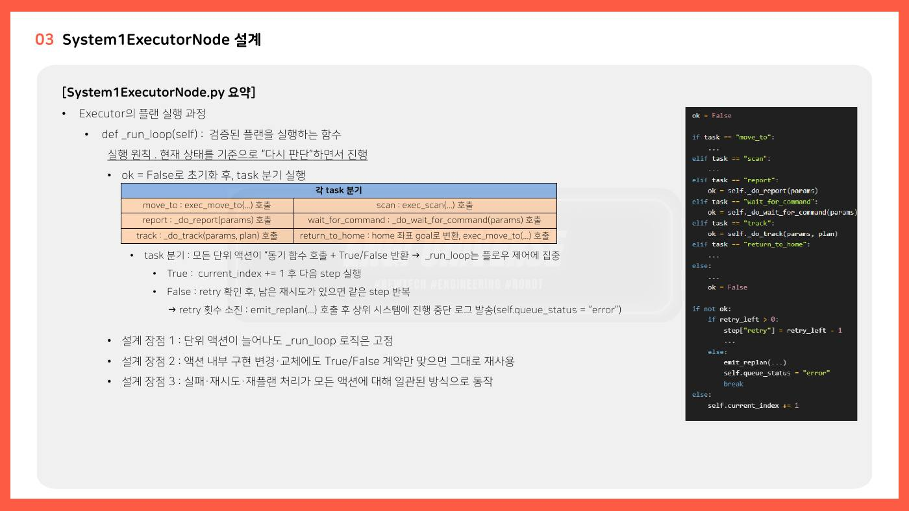{ width="700" }
    { width="700" }
    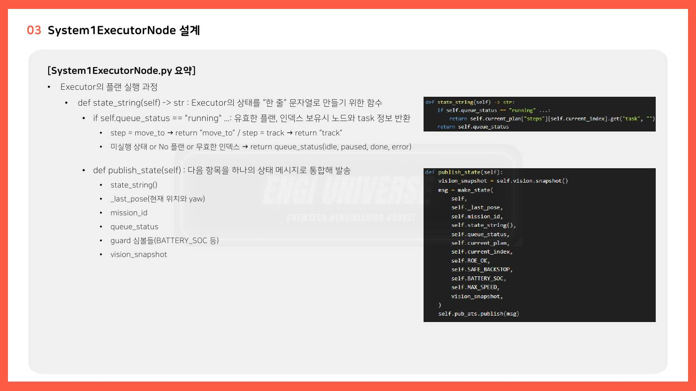{ width="700" }
    { width="700" }
    { width="700" }
