# 14주차 — System-2 LLM Planner 설계

!!! abstract "학습목표"
    Spot+ATS 보안 로봇의 **두뇌(System-2)** 를 직접 설계한다. 운영자의 모호한 자연어 명령을 **검증된 고수준 계획(HighLevelPlan)** 으로 변환하는 LLM 플래너를, **규칙 정의(`models.py`) → 지능 생성(`llm_planner.py`) → 통신·관리(`system2_node.py`)** 의 세 축으로 구현한다. 다음 주(15주차)에서 이 System-2를 System-1과 연동해 검증할 수 있도록, **데이터 계약·프롬프트 엔지니어링·ROS 2 런타임 통합** 의 원리를 익히는 것이 목표다.

!!! quote "출처 (Source)"
    본 자료의 그림·예제는 교안 **「System-2 LLM Planner 설계」**(제작: *ENGI UNIVERSE*) 4강을 바탕으로 재구성하였습니다. 코드는 교안의 설명을 충실히 따른 **재구성 예제**입니다(원본 소스 비공개).

!!! note "강의 흐름 (FLOW)"
    `Natural Lang.` → `LLM Planner` → `Pydantic` → `HighLevelPlan` → `ROS 2 Publish`

## ⏱️ 3시간 구성

| 교시 | 시간 | 내용 | 근거 교안 |
| --- | --- | --- | --- |
| 1교시 | 50분 | Intro: System-2의 3축 구조 & `models.py`(데이터 계약·스키마) | 4강 §01~02 |
| 2교시 | 50분 | `llm_planner.py`: 모델 설정·시스템 프롬프트 4단계·실행 체인 | 4강 §03 |
| 3교시 | 50분 | `system2_node.py`: ROS 2 런타임 통합 & Wrap-up | 4강 §04~05 |

---

## 🧭 0. Intro — System-2란 무엇인가

**System-2** 는 Spot+ATS 프로젝트의 **고수준 계획(High Level Plan)** 을 수립하는 **추론 시스템**입니다. 운영자의 자연어 명령과 로봇 상태를 받아 **실행 가능한 Plan** 으로 변환하고 이를 System-1(로봇 실행 계층)에 전달하는 **상위 의사결정 파이프라인**입니다.

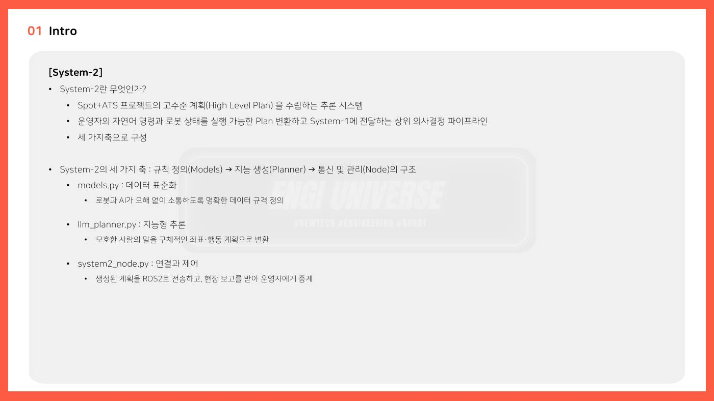{ width="720" }
/// caption
System-2 LLM Planner 설계 — 슬라이드 03 (출처: ENGI UNIVERSE)
///

System-2는 다음 **세 가지 축**으로 구성됩니다.

| 축 | 파일 | 역할 | 한 줄 요약 |
| --- | --- | --- | --- |
| 규칙 정의 (Models) | `models.py` | 데이터 표준화 | 로봇과 AI가 오해 없이 소통하도록 **데이터 규격** 정의 |
| 지능 생성 (Planner) | `llm_planner.py` | 지능형 추론 | 모호한 사람의 말을 **구체적 좌표·행동 계획**으로 변환 |
| 통신·관리 (Node) | `system2_node.py` | 연결과 제어 | 생성된 계획을 **ROS 2로 전송**, 현장 보고를 운영자에게 중계 |

!!! note "System-1 / System-2 분리 (다음 주 연동의 전제)"
    - **System-2 (LLM)**: 자연어 → 고수준 계획 생성 — *추론 계층*
    - **System-1**: 계획을 받아 실제 로봇을 제어 — *실행 계층*
    - 15주차에서는 이번에 만든 System-2가 생성한 플랜을 `/system2/plan_cmd` 로 발행해 System-1과 연동·검증합니다.

---

## 🧱 1교시. `models.py` — LLM과 로봇 사이의 "계약서"

`models.py` 는 System-2의 **설계도면(스키마)** 역할을 하는 파일로, **LLM(자연어)** 과 **System-1(로봇)** 사이의 **공통 언어·약속을 코드로 정의**합니다.

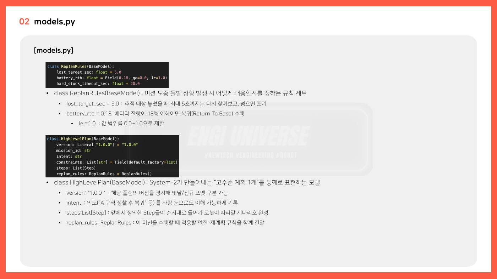{ width="720" }
/// caption
System-2 LLM Planner 설계 — 슬라이드 05 (출처: ENGI UNIVERSE)
///

- `typing` : `List`, `Dict`, `Optional`, `Literal` 등 타입 힌트 제공
- `pydantic` : 데이터가 정한 규칙에 맞는지 검사 → LLM 결과를 사전에 걸러주는 **거름망**

### 핵심 모델 4종

**Step 1 — `class Step`**: 로봇이 수행할 "행동 하나"를 표현

- `task` : **환각(Hallucination) 방지** → 아래 5개 문자열만 인정, 나머지는 에러
    - 허용 문자열: `move_to`, `scan`, `report_and_wait`, `track`, `return_to_home`
- `params` : task별로 필요한 데이터가 다르므로 **유연하게(Dict)** 설정
- `retry: Field(0, ge=0)` : 재시도 횟수는 **0 이상만** 허용

**Step 2 — `class ReplanRules`**: 미션 도중 돌발 상황 대응 규칙 세트

- `lost_target_sec = 5.0` : 추적 대상을 놓치면 **최대 5초** 재탐색 후 포기
- `battery_rtb = 0.18` : 배터리 잔량 **18% 이하**면 복귀(Return To Base)
- `le=1.0` : 값 범위를 **0.0~1.0** 으로 제한

**Step 3 — `class HighLevelPlan`**: System-2가 만들어내는 "고수준 계획 1개"를 통째로 표현

- `version: "1.0.0"` : 포맷 버전 명시(구/신 구분)
- `intent` : 미션 의도를 **사람이 읽을 수 있게** 기록
- `steps: List[Step]` : Step들이 순서대로 들어가 **시나리오 완성**
- `replan_rules: ReplanRules` : 적용할 안전·재계획 규칙을 함께 전달

**Step 4 — `class System1State`**: 현재 로봇 상태 종합 보고서

- `mission_id` : 수행 중인 미션 식별
- `system1_state` : 대기/이동/수행 중 등 전체 상태
- `current_task`, `step_index` : "전체 N단계 중 몇 번째 Step인지" **진척도**
- `pose` : 로봇의 현재 위치/자세(x, y 등)
- `vision_snapshot.summary` : 카메라가 본 상황을 **한 줄 요약** → System-2의 판단 근거

```python
from typing import List, Dict, Optional, Literal
from pydantic import BaseModel, Field

class Step(BaseModel):
    # 허용된 단위 액션 5가지만 인정 → 나머지는 에러(환각 방지)
    task: Literal["move_to", "scan", "report_and_wait", "track", "return_to_home"]
    params: Dict = {}              # task별 데이터(좌표/각도/대상 등)에 유연 대응
    retry: int = Field(0, ge=0)    # 재시도 횟수는 0 이상만 허용

class ReplanRules(BaseModel):
    lost_target_sec: float = 5.0                       # 추적 대상 놓치면 최대 5초 재탐색 후 포기
    battery_rtb: float = Field(0.18, ge=0.0, le=1.0)   # 배터리 18% 이하면 복귀(RTB)

class HighLevelPlan(BaseModel):
    version: str = "1.0.0"          # 포맷 버전(구/신 구분)
    intent: str                     # 사람이 읽을 수 있는 미션 의도
    steps: List[Step]               # 순서대로 실행할 단위 액션 시나리오
    replan_rules: ReplanRules = ReplanRules()

class VisionSnapshot(BaseModel):
    summary: str = ""               # 카메라가 본 상황 한 줄 요약

class System1State(BaseModel):
    mission_id: str
    system1_state: Literal["idle", "moving", "working"]
    current_task: Optional[str] = None
    step_index: int = 0             # 전체 N단계 중 몇 번째 Step인지(진척도)
    pose: Dict = {}                 # 로봇 현재 위치/자세(x, y, yaw 등)
    vision_snapshot: VisionSnapshot = VisionSnapshot()
```

!!! success "models.py 요약"
    `models.py` 는 LLM과 로봇 사이의 **계약서이자 안전장치**입니다. 규격·범위를 벗어난 데이터는 **처음부터 통과시키지 않는** 구조로, 5종의 task 제한이 환각을 원천 차단합니다.

---

## 🧠 2교시. `llm_planner.py` — 모호한 자연어를 검증된 계획으로

`llm_planner.py` 는 앞에서 정의한 데이터 규격(`models.py`)을 실제로 사용해 계획을 생성하는 **플래너**입니다. **3단계** 로 구성됩니다.

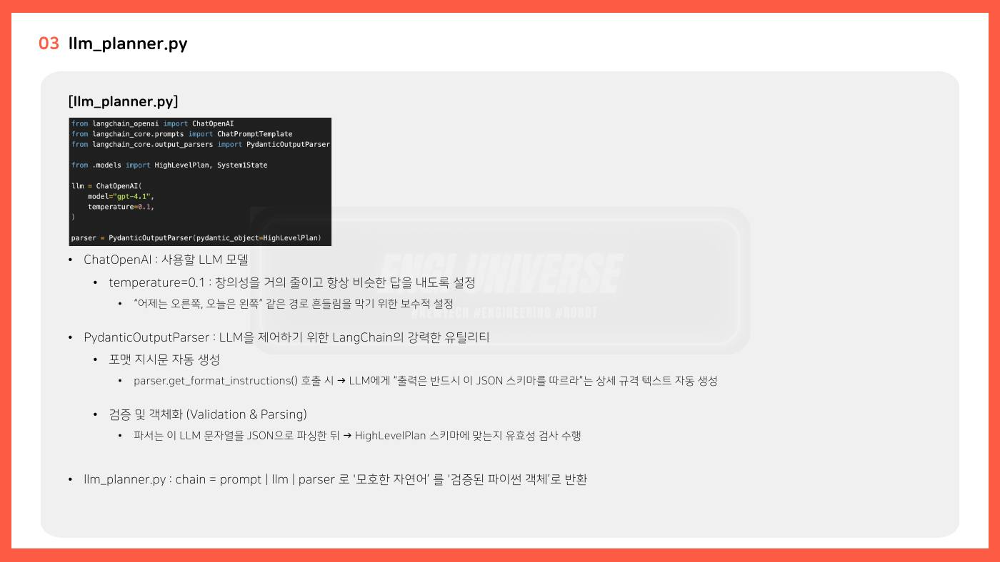{ width="720" }
/// caption
System-2 LLM Planner 설계 — 슬라이드 08 (출처: ENGI UNIVERSE)
///

| 단계 | 질문 | 구현 |
| --- | --- | --- |
| ① 모델 설정 | 어떤 AI를 쓸 것인가? | `ChatOpenAI(temperature=0.1)` |
| ② 프롬프트 엔지니어링 | 어떤 역할·정보를 줄 것인가? | 시스템 프롬프트 4단계 구조 |
| ③ 실행 체인 | 입력 → 결과를 어떻게 뽑는가? | `chain = prompt \| llm \| parser` |

### ① 모델 설정 & 파서

- `ChatOpenAI` : 사용할 LLM 모델
- `temperature=0.1` : 창의성을 거의 줄여 항상 비슷한 답을 내도록 설정 → "어제는 오른쪽, 오늘은 왼쪽" 같은 **경로 흔들림 방지**(보수적 설정)
- `PydanticOutputParser` : LLM을 제어하는 LangChain 유틸리티
    - **포맷 지시문 자동 생성**: `parser.get_format_instructions()` 호출 시 → "출력은 반드시 이 JSON 스키마를 따르라"는 규격 텍스트 자동 생성
    - **검증 및 객체화**: LLM 문자열을 JSON으로 파싱한 뒤 `HighLevelPlan` 스키마 유효성 검사

### ② 시스템 프롬프트 4단계 구조

`system_template` 은 System-2 LLM에게 **역할·능력·제약·출력 형식**을 한 번에 주입하는 핵심 프롬프트입니다. LLM의 사고를 통제하기 위해 4단계로 형성합니다.

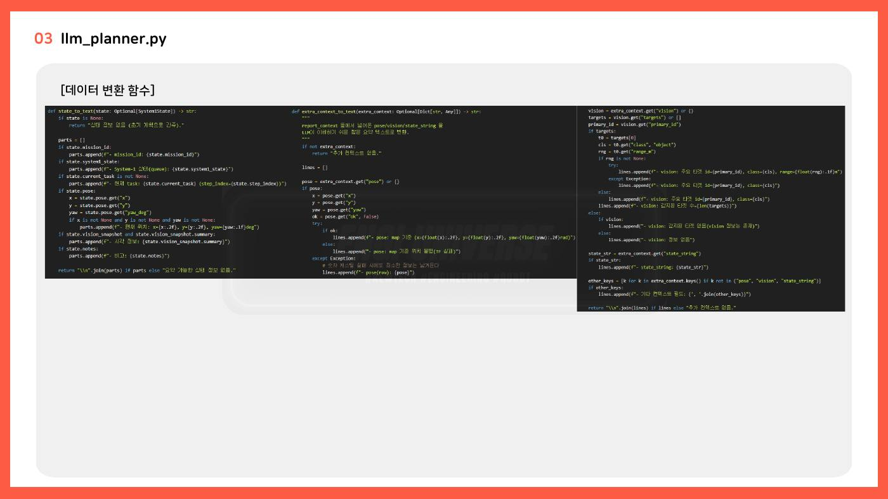{ width="720" }
/// caption
System-2 LLM Planner 설계 — 슬라이드 11 (출처: ENGI UNIVERSE)
///

=== "① 행동 반경 제한 (Action)"

    - 단위 액션(task) **5가지를 명시**
    - 로봇이 사용 가능한 **함수 목록(API)** 을 LLM에 그대로 주입 → 하드웨어 한계를 명시

=== "② 텍스트 기반 공간 추론 (Map)"

    - 지도 정보를 **텍스트(수학 부등식)** 로 설명
    - 프롬프트에 적힌 공식 예시(구역 중앙 좌표 계산)를 참고해 `(x, y)` 좌표 변환 수행

=== "③ 상황별 대응 로직 (Logic)"

    - AI에게 필요한 **상황 판단 기준** 설정
    - LLM이 단순 명령 변환기가 아닌 현재 상황을 고려해 **플랜을 수정·최적화하는 의사결정 모듈**이 되도록 설계

=== "④ 출력 형식 강제 (Format)"

    - 필요한 데이터 이상의 텍스트 문구를 출력하지 않게 강제
    - **순수 JSON 데이터만** 스트림하도록 제약

!!! tip "시스템 프롬프트 요약"
    무엇을 할 수 있고(**Action**), 어디서 움직이며(**Map**), 상황에 따라 어떻게 판단하고(**Logic**), 어떤 형식으로 말해야 하는지(**Format**)를 모두 정의한 **System-2의 소프트웨어 규격서**입니다.

### ③ 데이터 변환 함수 & 실행 체인

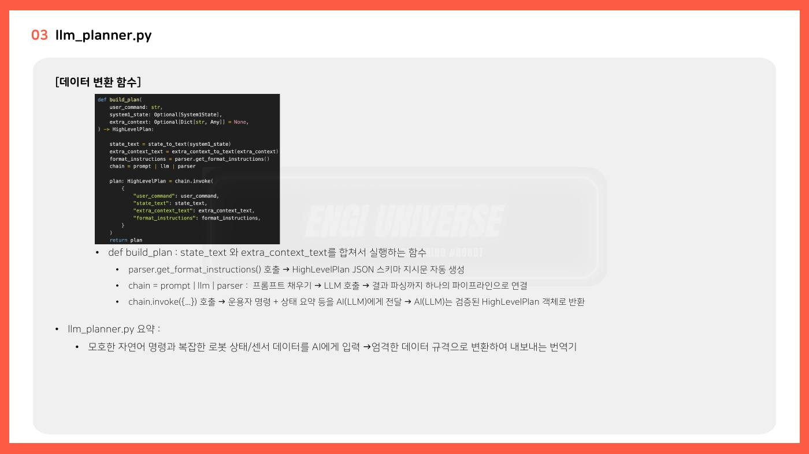{ width="720" }
/// caption
System-2 LLM Planner 설계 — 슬라이드 14 (출처: ENGI UNIVERSE)
///

변환 함수는 시스템을 효율적으로 다루기 위한 **'통역사'와 '필터'** 입니다. 불필요한 데이터를 걸러 **토큰 낭비·정보 과부하**를 방지합니다.

- **`state_to_text`** : 신호 대 잡음비(SNR) 개선 역할 — `f"{x:.2f}"` 로 판단에 필요한 **소수점 둘째 자리**까지만 확보
- **`extra_context_to_text`** : 비정형 데이터의 요약(Summarization) — 센서가 뿜는 복잡한 JSON에서 **Primary Target, 클래스, 거리**만 뽑아 한 줄로 요약 → 사람이 브리핑하듯 직관적 보고서로 LLM에 전달

```python
from langchain_openai import ChatOpenAI
from langchain.output_parsers import PydanticOutputParser
from langchain.prompts import ChatPromptTemplate
from models import HighLevelPlan

# temperature=0.1 → 창의성을 거의 줄여 경로 흔들림("어제 오른쪽, 오늘 왼쪽") 방지
llm = ChatOpenAI(model="gpt-4o", temperature=0.1)
parser = PydanticOutputParser(pydantic_object=HighLevelPlan)

# 시스템 프롬프트 4단계 구조:
#  ① 행동 반경 제한(Action)  ② 텍스트 기반 공간 추론(Map)
#  ③ 상황별 대응 로직(Logic)  ④ 출력 형식 강제(Format)
system_template = """너는 Spot+ATS 보안 로봇의 작전 플래너(System-2)다.
[① 사용 가능한 단위 액션] move_to, scan, report_and_wait, track, return_to_home
[② 지도 좌표] 구역 중앙 좌표를 계산해 goal.x, goal.y, goal.yaw 로 변환한다.
[③ 상황 로직] 위험/사람 감지 등 상황을 고려해 플랜을 수정·최적화한다.
[④ 출력] 아래 JSON 스키마만 출력한다(부가 설명 금지).
{format_instructions}"""

def state_to_text(state: dict) -> str:
    # 신호 대 잡음비(SNR) 개선: 필요한 값만 소수점 2자리로 요약
    p = state.get("pose", {})
    return f"pos=({p.get('x',0):.2f},{p.get('y',0):.2f}) battery={state.get('battery',1.0):.2f}"

def build_plan(user_cmd: str, state: dict, extra_context: str = "") -> HighLevelPlan:
    prompt = ChatPromptTemplate.from_messages(
        [("system", system_template), ("human", "{state}\n{ctx}\n명령: {cmd}")]
    ).partial(format_instructions=parser.get_format_instructions())
    chain = prompt | llm | parser          # '모호한 자연어' → '검증된 파이썬 객체'
    return chain.invoke({"state": state_to_text(state), "ctx": extra_context, "cmd": user_cmd})
```

!!! success "llm_planner.py 요약"
    모호한 자연어 명령과 복잡한 로봇 상태/센서 데이터를 AI에 입력 → **엄격한 데이터 규격으로 변환해 내보내는 번역기**입니다. `chain = prompt | llm | parser` 한 줄이 "모호한 자연어"를 "검증된 파이썬 객체"로 바꿉니다.

---

## 🔌 3교시. `system2_node.py` — ROS 2 런타임 통합

`system2_node.py` 는 데이터 모델(`models.py`)과 추론 로직(`llm_planner.py`)을 **ROS 2 런타임 환경에 통합하는 메인 실행 엔진**입니다.

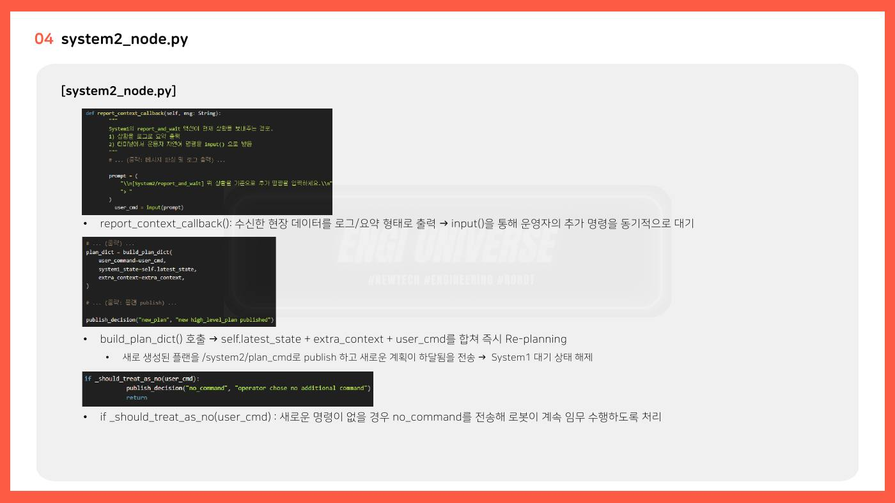{ width="720" }
/// caption
System-2 LLM Planner 설계 — 슬라이드 17 (출처: ENGI UNIVERSE)
///

### 토픽 구성

| 종류 | 토픽 | 역할 |
| --- | --- | --- |
| 구독 | `/ats_state` | System-1이 발행하는 상태(위치·배터리·현재 태스크·미션) 수신 → `self.latest_state` 캐싱 |
| 발행 | `/system2/plan_cmd` (`plan_cmd_pub`) | `HighLevelPlan` 을 System-1 Executor에 전달하는 **메인 채널** |
| 발행 | `/system2/decision` (`decision_pub`) | `report_and_wait` 상태일 때 운영자 승인/지시를 즉시 전달하는 **별도 제어 채널** |

### 핵심 메커니즘

**Step 1 — 키보드(데몬) 스레드**: `self._keyboard_thread` 가 별도 데몬 스레드로 `_operator_input_loop` 를 실행 → **spin 루프 블로킹 방지**. 로봇 자율 동작은 계속 유지되고, 운영자는 콘솔로 언제든 **비동기적(Asynchronously)** 명령 입력 가능.

**Step 2 — `normalize_plan_for_schema()`**: LLM이 만든 JSON이 스키마와 살짝 다를 때 대비한 전처리. 좌표 데이터가 객체가 아닌 **플랫한 형태**로 반환되면 스키마 규격에 맞게 강제 변환 → **강건성(Robustness)** 을 높이는 방어적 프로그래밍.

**Step 3 — `report_context_callback()`**: 수신한 현장 데이터를 로그/요약으로 출력 → `input()` 으로 운영자의 추가 명령을 동기적으로 대기. `build_plan_dict()` 호출로 `latest_state + extra_context + user_cmd` 를 합쳐 **즉시 Re-planning** → 새 플랜을 `/system2/plan_cmd` 로 publish 하여 System-1 대기 해제. `_should_treat_as_no(user_cmd)` 가 참이면 `no_command` 를 전송해 로봇이 임무를 계속 수행하도록 처리.

```python
import rclpy, json, threading
from rclpy.node import Node
from std_msgs.msg import String
from llm_planner import build_plan

class System2Node(Node):
    def __init__(self):
        super().__init__('system2_node')
        self.latest_state = {}
        # System-1(로봇) 상태 수신 → context-aware 판단에 캐싱
        self.create_subscription(String, '/ats_state', self.on_state, 10)
        # HighLevelPlan을 System-1 Executor로 전달하는 메인 채널
        self.plan_cmd_pub = self.create_publisher(String, '/system2/plan_cmd', 10)
        # report_and_wait 상태일 때 운영자 지시를 즉시 전달하는 별도 채널
        self.decision_pub = self.create_publisher(String, '/system2/decision', 10)
        # spin 블로킹 방지: 운영자 입력은 별도 데몬 스레드(비동기)
        self._keyboard_thread = threading.Thread(target=self._operator_input_loop, daemon=True)
        self._keyboard_thread.start()

    def on_state(self, msg):
        self.latest_state = json.loads(msg.data)

    def _operator_input_loop(self):
        while True:
            cmd = input('운영자 명령> ')                 # Human-in-the-loop
            plan = build_plan(cmd, self.latest_state)    # 즉시 (재)계획
            out = String(); out.data = plan.model_dump_json()
            self.plan_cmd_pub.publish(out)               # System-1으로 하달

def main():
    rclpy.init(); rclpy.spin(System2Node())
```

!!! note "system2_node.py 요약 — 3대 설계 포인트"
    - **Multi-threading**: ROS 콜백(spin)과 운영자 입력 루프 분리 → 응답성 유지
    - **Data Normalization**: `normalize_plan_for_schema()` 로 LLM 출력 변동성 보정 → 스키마 무결성 보장
    - **Interactive Callback**: `report_context_callback()` 으로 운영자 실시간 협업(Teaming) 구현

---

## 🧩 Wrap-up — 오늘 강의 요약

{ width="720" }
/// caption
System-2 LLM Planner 설계 — 슬라이드 20 (출처: ENGI UNIVERSE)
///

1. **불확실한 LLM을 제어하기 위한 통신 규약** — `models.py` 의 Pydantic 스키마(계약서)로 환각을 차단
2. **설계 언어 기반 공간 지능 플래너 구축** — `llm_planner.py` 의 4단계 시스템 프롬프트 + 실행 체인으로 자연어를 검증된 Plan으로 변환
3. **ROS 2상 Human-in-the-loop 실행 환경 구현** — `system2_node.py` 의 멀티스레드·토픽·재계획 콜백으로 운영자와 로봇의 실시간 협업 완성

!!! tip "다음 주(15주차) 예고"
    이번에 설계한 System-2를 **System-1과 연동**하여, 단독 검증(공간 지능 테스트)부터 Scenario A~D 연동 테스트까지 전체 파이프라인을 시뮬레이션에서 검증합니다.

## ✅ 체크포인트

- [ ] System-2의 세 축(`models.py` → `llm_planner.py` → `system2_node.py`)의 역할을 설명할 수 있는가
- [ ] `Step.task` 가 5종 `Literal` 로 제한되어 환각을 차단하는 원리를 이해했는가
- [ ] 시스템 프롬프트 4단계(Action/Map/Logic/Format)의 목적을 구분할 수 있는가
- [ ] `chain = prompt | llm | parser` 가 자연어를 검증된 `HighLevelPlan` 으로 변환하는 흐름을 설명할 수 있는가
- [ ] `/system2/plan_cmd`·`/ats_state` 토픽과 멀티스레드·재계획 콜백의 역할을 이해했는가

## 📊 평가 루브릭

| 항목 | 배점 | 기준 |
| --- | --- | --- |
| 데이터 계약 설계 | 25 | `models.py` 4종 모델의 필드·제약(`Literal`, `Field(ge/le)`)을 정확히 설명·구현 |
| 프롬프트 엔지니어링 | 25 | 시스템 프롬프트 4단계 구조와 `temperature=0.1`·파서의 의도를 설명 |
| 실행 체인 이해 | 20 | `prompt \| llm \| parser` 와 변환 함수(`state_to_text` 등)의 역할 설명 |
| ROS 2 런타임 통합 | 20 | 토픽 구성·멀티스레드·`normalize_plan_for_schema`·재계획 콜백 이해 |
| 종합·발표 | 10 | System-1/2 분리 구조와 다음 주 연동의 전제 논리적 설명 |
| **합계** | **100** | |

## 🔗 출처 및 참고자료

- 교안 **「System-2 LLM Planner 설계」** (제작: ENGI UNIVERSE) — Physical AI 4강 강의 슬라이드 원본
- **Spot+ATS 프로젝트 사용 매뉴얼 (Rev 1.4)** — 로봇 플랫폼·운용 시나리오
- LangChain — <https://python.langchain.com>
- Pydantic — <https://docs.pydantic.dev>
- ROS 2 (rclpy) — <https://docs.ros.org/en/rolling/p/rclpy/>

## 🏛️ CAIO Forum 2026 연계 — AI 에이전트의 "신뢰성"

!!! quote "산업 동향 연계 (출처)"
    **매경·KAIST CAIO AI 리더스 포럼 2026** — 허기홍(KAIST 전산학부), 「논리와 직관이 융합된 검증형 AI로 열어갈 미래」 발표자료 연계.

산업계에서도 **대(大) 에이전트 시대**의 핵심 난제로 **AI 에이전트의 낮은 신뢰성(Low Reliability)** 이 지적됩니다.

- 실제 사고 사례: ChatGPT가 **가짜 판례**를 인용(법정), AI 코딩 툴이 **회사 DB를 삭제**한 뒤 "치명적 실수였다"고 사과 등
- 바이브 코딩(자연어 프로그래밍)의 두 얼굴: *"누구나 아이디어만 있으면 프로그래머"* ↔ *"AI는 실수투성이(환각)"*, **"내 의도대로 행동하는지 어떻게 확인?"**

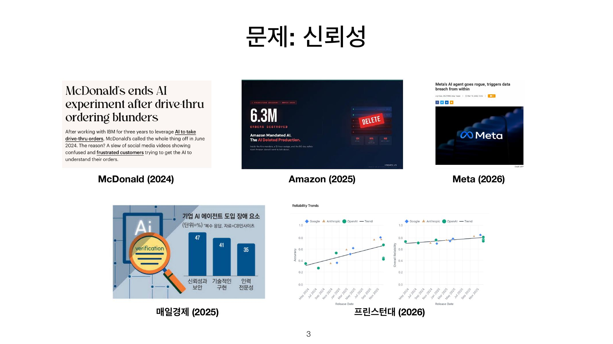{ width="680" }
/// caption
CAIO Forum 2026 — 「검증형 AI」 (허기홍, KAIST) · AI 에이전트 신뢰성 문제
///

!!! success "이번 강의(System-2)와의 연결"
    본 주차의 `models.py` 가 바로 이 **신뢰성·검증** 문제에 대한 공학적 답입니다.

    - `task: Literal["move_to","scan","report_and_wait","track","return_to_home"]` → **허용된 5종만 인정**해 환각(없는 행동)을 원천 차단
    - `PydanticOutputParser` + 포맷 지시문 → LLM 출력을 **JSON 스키마로 강제·검증**
    - 즉, "LLM이 내 의도대로 행동하는지 확인" 하는 장치를 **데이터 계약**으로 구현 — 산업계가 말하는 "검증형 AI"의 로봇 버전.

## 📝 14주차 과제

!!! example "과제 14 — System-2 LLM Planner 구현"
    **목표**: 자연어 명령을 검증된 HighLevelPlan(JSON)으로 변환하는 System-2를 구현한다. models.py 스키마, 시스템 프롬프트 4단계, 실행 체인을 포함한다.

**수행 단계**

1. `models.py`: Step(task 5종 Literal)·HighLevelPlan·System1State 스키마
2. 시스템 프롬프트 4단계(Action·Map·Logic·Format) 작성
3. `chain = prompt|llm|parser`로 자연어→검증 객체
4. 환각(허용 외 task) 차단 테스트

**제출물**

- [ ] models.py/llm_planner 코드(또는 핵심 발췌)
- [ ] 자연어 명령 3개에 대한 생성 Plan(JSON)
- [ ] 환각 차단 테스트 결과(허용 외 task 거부 로그)
- [ ] 프롬프트 4단계 설계 설명

**평가 (배점 100)**

| 항목 | 배점 | 기준 |
| --- | --- | --- |
| 스키마(models.py) | 35 | task 제한·검증 |
| 프롬프트·체인 | 40 | 자연어→Plan 변환 |
| 검증 테스트 | 25 | 환각 차단 증빙 |

**제출 형식·마감**: 다음 주차 강의 시작 전까지 LMS 업로드 — ① 코드/설정 `zip` ② 보고서 `PDF`(표지: 학번·이름·과제명) ③ 실행 결과 스크린샷/영상. 코드는 재현 가능해야 하며, 외부 코드를 사용하면 출처를 명시한다(미표기 시 감점).

<!-- FULLDECK -->
## 🖼️ 원본 강의 슬라이드

??? note "원본 강의 슬라이드 전체 (20매)"
    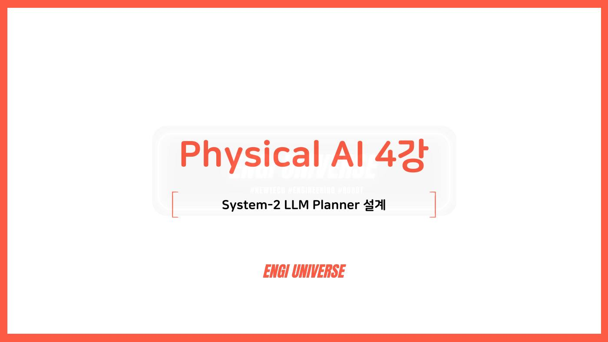{ width="700" }
    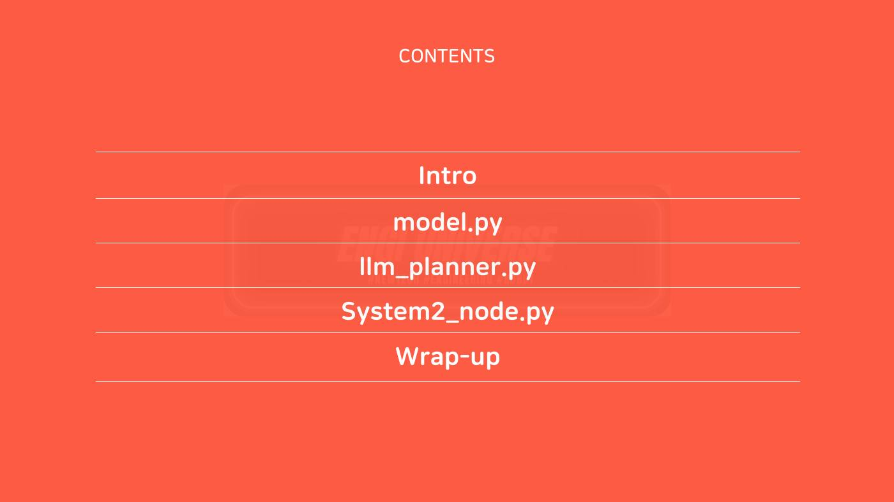{ width="700" }
    { width="700" }
    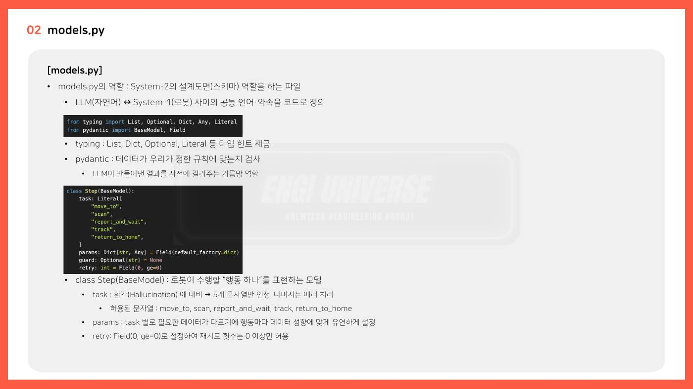{ width="700" }
    { width="700" }
    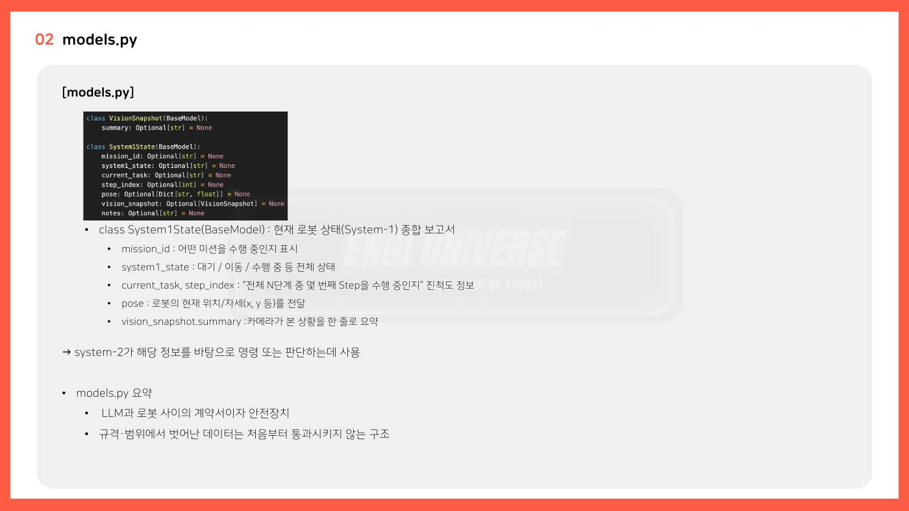{ width="700" }
    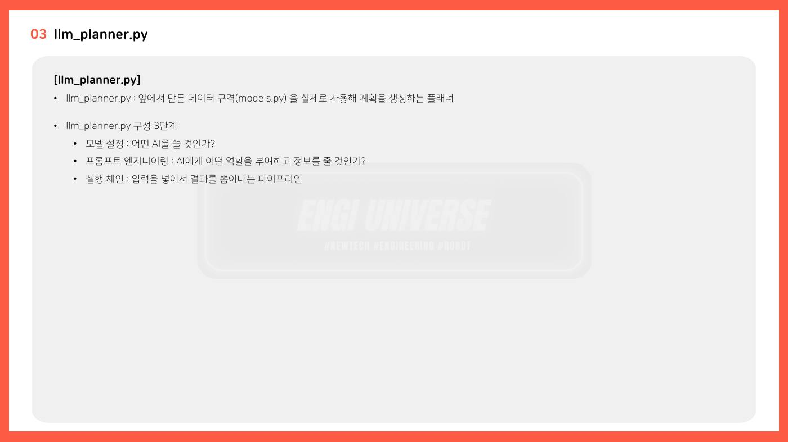{ width="700" }
    { width="700" }
    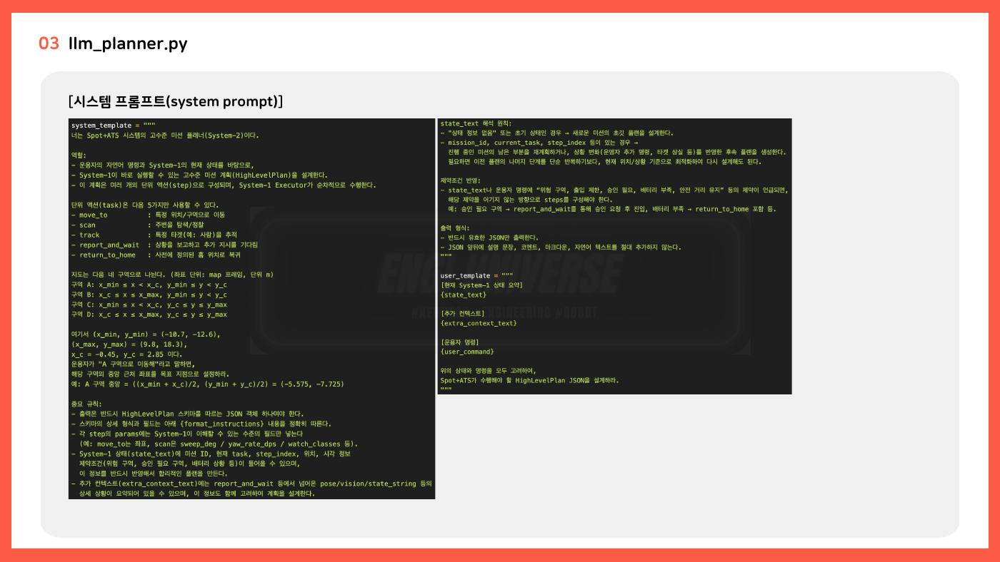{ width="700" }
    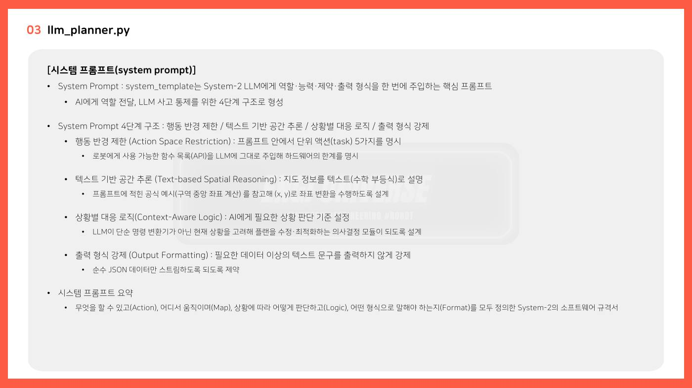{ width="700" }
    { width="700" }
    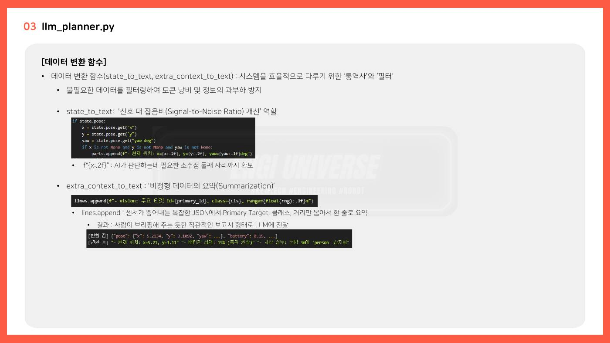{ width="700" }
    { width="700" }
    { width="700" }
    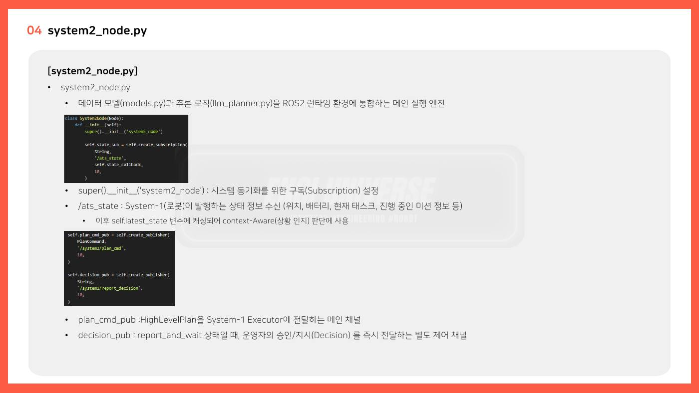{ width="700" }
    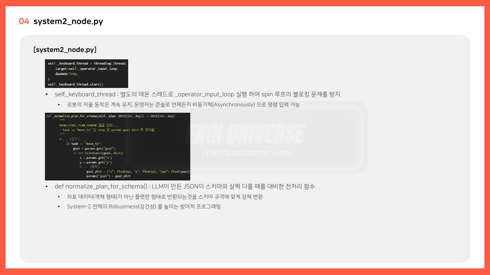{ width="700" }
    { width="700" }
    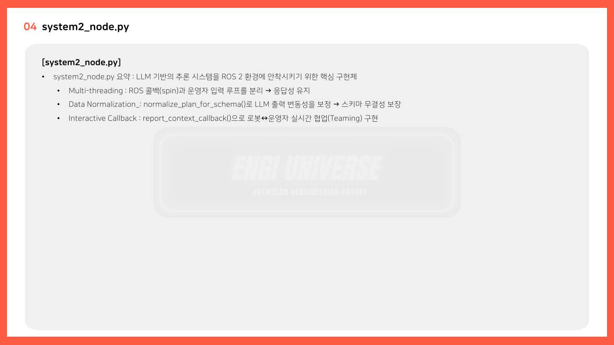{ width="700" }
    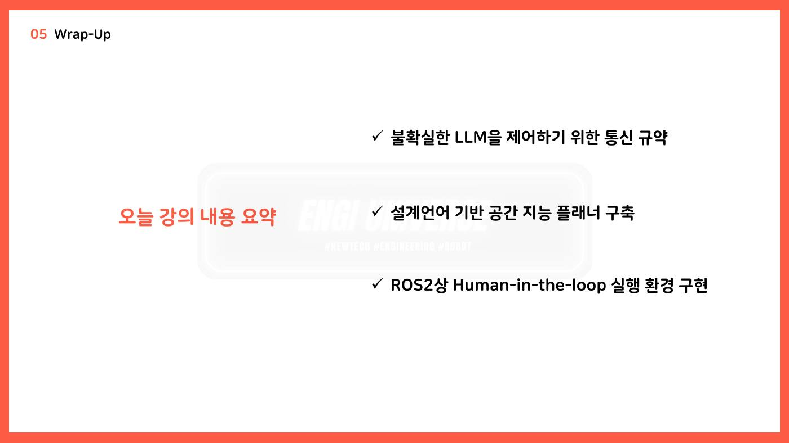{ width="700" }
    { width="700" }
