# 15주차 — System-2 테스트 및 검증 (종합 프로젝트)

!!! abstract "학습목표"
    한 학기 동안 구축한 **Spot+ATS 보안 로봇**의 두뇌(System-2, LLM 플래너)와 몸(System-1, 로봇 제어)을 연결하여, 자연어 명령이 **계획 생성 → 실행 → 현장 대응**으로 이어지는 전체 파이프라인을 시뮬레이션에서 검증하고, 최신 Physical AI(VLA) 관점에서 고도화 방향을 논의한다.

!!! quote "출처 (Sources)"
    본 주차의 그림과 예제는 강의 교안 **『Physical AI』 5강 「System-2 테스트 및 검증」**, **4강 「System-2 LLM Planner 설계」**(제작: *ENGI UNIVERSE*)와 **Spot+ATS 프로젝트 사용 매뉴얼(Rev 1.4)** 을 바탕으로 재구성하였습니다. 코드는 교안의 설명을 충실히 따른 **재구성 예제**입니다(원본 소스 비공개).

!!! note "강의 흐름 (FLOW)"
    `Natural Lang.` → `LLM Planner` → `Pydantic` → `HighLevelPlan` → `ROS 2 Publish`

## ⏱️ 3시간 구성

| 교시 | 시간 | 내용 | 근거 교안 |
| --- | --- | --- | --- |
| 1교시 | 50분 | System-2 단독 검증 (공간 지능 테스트) | 5강 §02 |
| 2교시 | 50분 | System-2 & System-1 연동 테스트 (시나리오 A~D) | 5강 §03 |
| 3교시 | 50분 | 고도화 방향(VLA·멀티에이전트) & Wrap-up | 5강 §04~05 |

---

## 🧭 0. 프로젝트 전체 그림 — System-1 / System-2

이 프로젝트의 핵심은 **"추론(Brain)"과 "실행(Controller)"의 분리**입니다. 최신 VLA 시스템 아키텍처와 동일한 **모듈러(modular)** 구조입니다.

- **System-2 (LLM)**: 자연어 명령 → 고수준 계획(High Level Plan) 생성 — *추론 계층*
- **System-1**: 계획을 받아 실제 로봇을 제어하여 동작 수행 — *실행 계층*

System-2는 **규칙 정의(`models.py`) → 지능 생성(`llm_planner.py`) → 통신·관리(`system2_node.py`)** 의 세 축으로 구성됩니다.

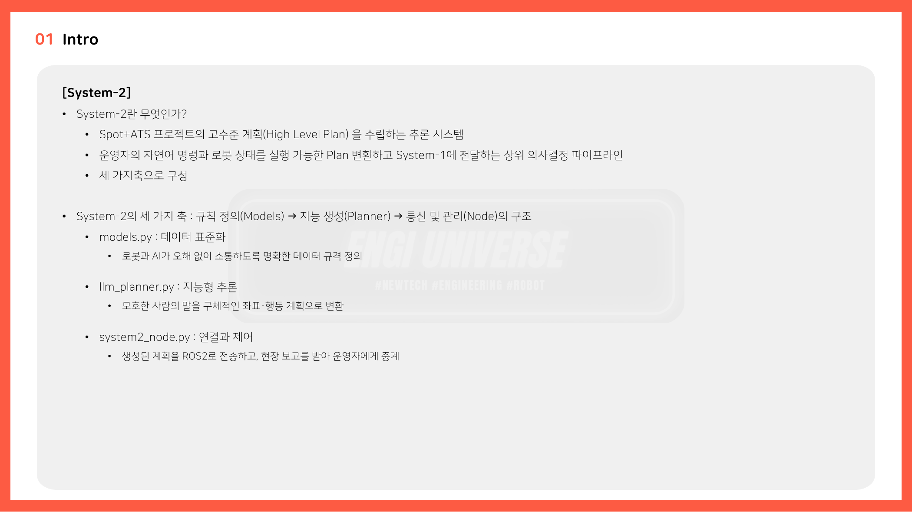{ width="720" }
/// caption
교안 4강 §01 — System-2의 3축 구조 (출처: ENGI UNIVERSE)
///

---

## 🛰️ 1교시. System-2 단독 검증 (공간 지능 테스트)

로봇(System-1) 없이 **System-2만 실행**해 계획 품질을 먼저 검증합니다. → *"로봇 제어 문제"인지 "계획 생성 문제"인지 원인을 분리*합니다.

### 테스트 지도 좌표계 (A/B/C/D 4구역)

| 구역 | x | y |
| --- | --- | --- |
| A | −10.7 | −12.6 |
| B | +9.8 | −12.6 |
| C | −10.7 | −18.3 |
| D | +9.8 | −18.3 |

LLM은 이 좌표로 구역 **중앙 좌표를 계산**해 `goal.x, goal.y, goal.yaw` 를 채웁니다.

### 테스트 명령

=== "쉬움 (단일 액션)"

    명령: **"A 구역으로 이동해줘"**

    - 핵심: LLM이 A 구역 중앙 좌표를 계산해 `goal` 을 올바르게 채우는지
    - 검증: JSON에서 `task: move_to` 확인, `params.goal.{x,y,yaw}` 가 A 구역 좌표로 출력 → 성공

=== "어려움 (복합 + 조건)"

    명령: **"A, C, D 구역을 순서대로 이동하면서 주변을 스캔하고, 만약 사람이 발견되면 보고하고 대기해줘."**

    - 핵심: 여러 단위 액션을 순서대로 생성하고, 특정 액션에 붙은 **조건**(사람 발견 시 `report_and_wait`)을 지키는지 확인

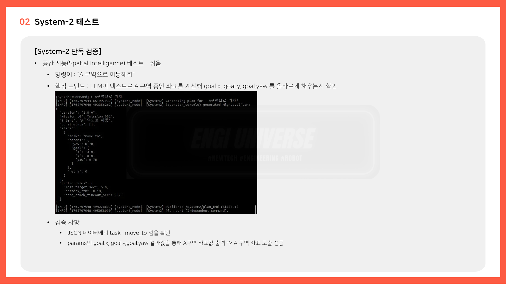{ width="720" }
/// caption
교안 5강 §02 — System-2 단독 검증(공간 지능 테스트) 콘솔 출력 (출처: ENGI UNIVERSE)
///

### `models.py` — LLM과 로봇 사이의 "계약서" (4강 §02 재구성)

규격·범위를 벗어난 데이터는 **처음부터 통과시키지 않는** 안전장치입니다. `task` 는 **5개 문자열만** 허용해 LLM 환각(hallucination)을 차단합니다.

```python
from typing import List, Dict, Optional, Literal
from pydantic import BaseModel, Field

class Step(BaseModel):
    # 허용된 단위 액션 5가지만 인정 → 나머지는 에러(환각 방지)
    task: Literal["move_to", "scan", "report_and_wait", "track", "return_to_home"]
    params: Dict = {}              # task별 데이터(좌표/각도/대상 등)에 유연 대응
    retry: int = Field(0, ge=0)    # 재시도 횟수는 0 이상만 허용

class ReplanRules(BaseModel):
    lost_target_sec: float = 5.0                       # 추적 대상 놓치면 최대 5초 재탐색 후 포기
    battery_rtb: float = Field(0.18, ge=0.0, le=1.0)   # 배터리 18% 이하면 복귀(RTB)

class HighLevelPlan(BaseModel):
    version: str = "1.0.0"          # 포맷 버전(구/신 구분)
    intent: str                     # 사람이 읽을 수 있는 미션 의도
    steps: List[Step]               # 순서대로 실행할 단위 액션 시나리오
    replan_rules: ReplanRules = ReplanRules()

class VisionSnapshot(BaseModel):
    summary: str = ""               # 카메라가 본 상황 한 줄 요약

class System1State(BaseModel):
    mission_id: str
    system1_state: Literal["idle", "moving", "working"]
    current_task: Optional[str] = None
    step_index: int = 0             # 전체 N단계 중 몇 번째 Step인지(진척도)
    pose: Dict = {}                 # 로봇 현재 위치/자세(x, y, yaw 등)
    vision_snapshot: VisionSnapshot = VisionSnapshot()
```

!!! success "검증 사항"
    System-2가 모호한 자연어 명령을 **구조화된 `HighLevelPlan` JSON으로 안정적으로 변환**하는 추론 엔진임을 확인 → 이후 System-1과 연결해도 될 만큼 신뢰할 수 있는 상태임을 검증.

---

## 🤝 2교시. System-2 & System-1 연동 테스트

System-2가 생성한 플랜을 `/system2/plan_cmd` 로 발행하면 System-1이 해당 단위 액션 서버를 호출합니다. 4가지 시나리오로 통신 파이프라인과 자율 동작을 검증합니다.

### Scenario A — 기초 기동 ("D 구역으로 가줘")

- 체크포인트: System-2가 `move_to` 플랜 생성 후 `/system2/plan_cmd` 로 전송 → System-1이 `move_to` 액션 서버 호출
- 검증: 통신 파이프라인과 내비게이션 스택이 손실 없이 연동되는지

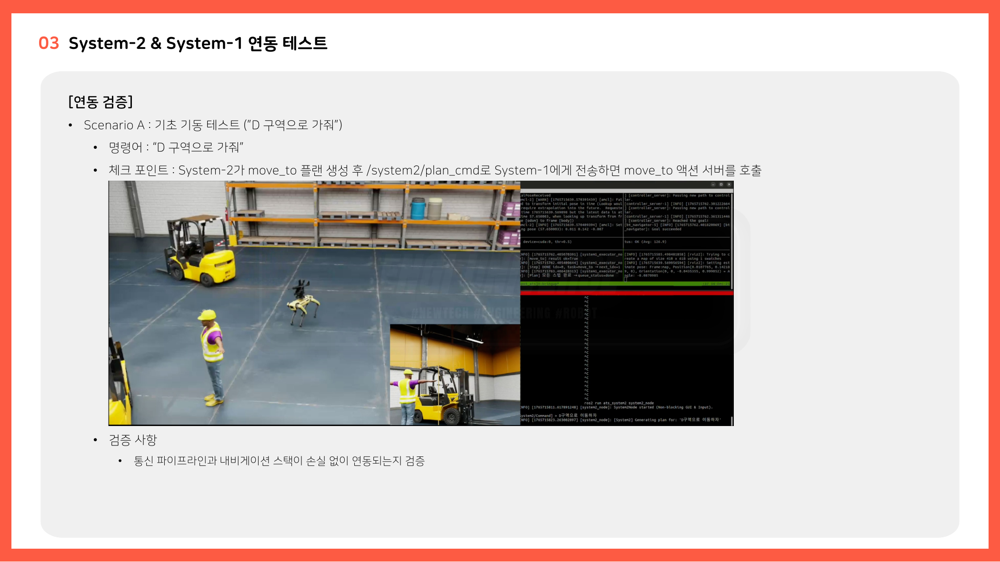{ width="720" }
/// caption
교안 5강 §03 — Scenario A: 기초 기동 테스트 (출처: ENGI UNIVERSE)
///

### Scenario B — 인터랙티브 미션 (이동·스캔·보고)

명령: **"지도의 중앙으로 이동해서 사람이 있는지 120도 반경 살펴보고 있다면 보고해줘"**

- 별도 코딩 없이 추상 표현("중앙")을 `move_to` 목표 좌표·방향으로 변환하는지
- 스캔 중 사람 감지 시 System-1이 System-2에게 `Vision.snapshot` 을 전달하는지 → **이동 → 스캔 → 보고 → 운용자 응답** 인터랙티브 루프

??? tip "Scenario B 고도화 — 맥락을 이해하는 비전(Context-aware Vision)"
    - **기존**: YOLO 기반 고정 클래스(Closed-set) — "사람", "소화기" 등만 인식
    - **확장**: Grounding Vision / VLM(**Grounding DINO, YOLO-World, LLaVA**) 접목 → 상태·행동까지 자연어로 질의·탐지
    - **현실적 설계 — 엣지·서버 하이브리드**
        - 엣지(Spot 내장 컴퓨터/Jetson): 가벼운 모델로 1차 이벤트(사람·움직임)만 감지 → 짧은 클립 전송
        - 서버(고성능 GPU + 대형 VLM, GPT-4o 등): 정밀 판단 후 행동 지침 회신
        - → 로봇 자원(배터리·연산)을 아끼면서 고성능 연산이 가능한 **지능형 보안 관제 솔루션**

### Scenario C — 장기 순찰 (D, C, B, A 순차 정찰)

명령: **"D, C, B, A 구역 순서대로 이동하면서 정찰해줘."**

- System-2가 긴 전체 계획(Full Plan) 생성 → System-1은 **메모리(Task Queue)** 에 저장 후 단위 액션에 참고
- 중간 `report_and_wait` 도달 → 운용자 명령 하달 → System-1은 기존 계획 폐기, **재계획** 저장·실행

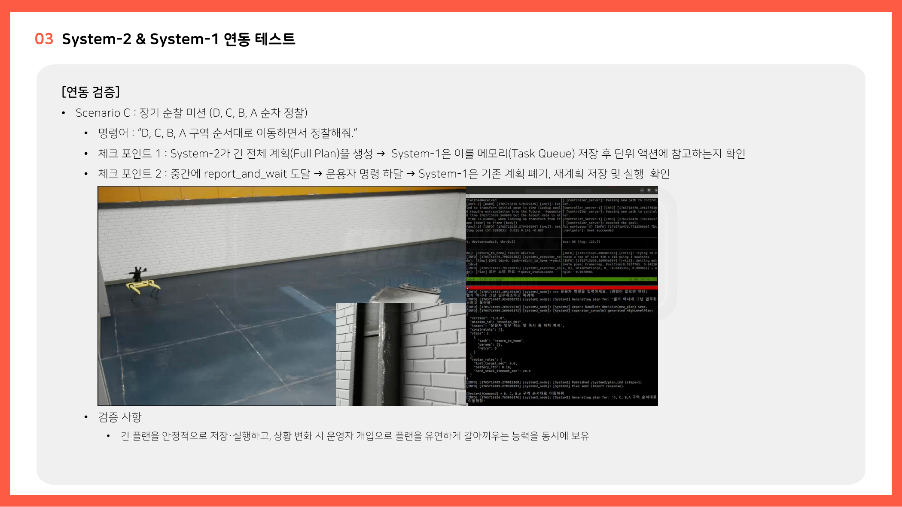{ width="720" }
/// caption
교안 5강 §03 — Scenario C: 장기 순찰 미션 (출처: ENGI UNIVERSE)
///

### Scenario D — 객체 인식 및 동적 추적

명령: **"주변 60도 반경을 스캔하고, 만약 트럭이 발견되면 추적해줘."**

- 지정 범위(약 60도) 안에서 `scan` task 수행 → 타겟 클래스 감지 시 즉시 중단하고 `track` 으로 전환
- 대상이 이동해도 시선을 고정하고 일정 거리를 유지하는 **Visual Servoing** 동작 유지

### `llm_planner.py` — 자연어를 검증된 계획으로 (4강 §03 재구성)

```python
from langchain_openai import ChatOpenAI
from langchain.output_parsers import PydanticOutputParser
from langchain.prompts import ChatPromptTemplate
from models import HighLevelPlan

# temperature=0.1 → 창의성을 거의 줄여 경로 흔들림("어제 오른쪽, 오늘 왼쪽") 방지
llm = ChatOpenAI(model="gpt-4o", temperature=0.1)
parser = PydanticOutputParser(pydantic_object=HighLevelPlan)

# 시스템 프롬프트 4단계 구조:
#  ① 행동 반경 제한(Action)  ② 텍스트 기반 공간 추론(Map)
#  ③ 상황별 대응 로직(Logic)  ④ 출력 형식 강제(Format)
system_template = """너는 Spot+ATS 보안 로봇의 작전 플래너(System-2)다.
[① 사용 가능한 단위 액션] move_to, scan, report_and_wait, track, return_to_home
[② 지도 좌표] A:(-10.7,-12.6) B:(9.8,-12.6) C:(-10.7,-18.3) D:(9.8,-18.3)
   구역 중앙 좌표를 계산해 goal.x, goal.y, goal.yaw 로 변환한다.
[③ 상황 로직] 위험/사람 감지 등 상황을 고려해 플랜을 수정·최적화한다.
[④ 출력] 아래 JSON 스키마만 출력한다(부가 설명 금지).
{format_instructions}"""

def state_to_text(state: dict) -> str:
    # 신호 대 잡음비(SNR) 개선: 필요한 값만 소수점 2자리로 요약
    p = state.get("pose", {})
    return f"pos=({p.get('x',0):.2f},{p.get('y',0):.2f}) battery={state.get('battery',1.0):.2f}"

def build_plan(user_cmd: str, state: dict) -> HighLevelPlan:
    prompt = ChatPromptTemplate.from_messages(
        [("system", system_template), ("human", "{state}\n명령: {cmd}")]
    ).partial(format_instructions=parser.get_format_instructions())
    chain = prompt | llm | parser          # '모호한 자연어' → '검증된 파이썬 객체'
    return chain.invoke({"state": state_to_text(state), "cmd": user_cmd})
```

### `system2_node.py` — ROS 2 런타임 통합 (4강 §04 재구성)

```python
import rclpy, json, threading
from rclpy.node import Node
from std_msgs.msg import String
from llm_planner import build_plan

class System2Node(Node):
    def __init__(self):
        super().__init__('system2_node')
        self.latest_state = {}
        # System-1(로봇) 상태 수신 → context-aware 판단에 캐싱
        self.create_subscription(String, '/ats_state', self.on_state, 10)
        # HighLevelPlan을 System-1 Executor로 전달하는 메인 채널
        self.plan_pub = self.create_publisher(String, '/system2/plan_cmd', 10)
        # report_and_wait 상태일 때 운영자 지시를 즉시 전달하는 별도 채널
        self.decision_pub = self.create_publisher(String, '/system2/decision', 10)
        # spin 블로킹 방지: 운영자 입력은 별도 데몬 스레드(비동기)
        threading.Thread(target=self._operator_input_loop, daemon=True).start()

    def on_state(self, msg):
        self.latest_state = json.loads(msg.data)

    def _operator_input_loop(self):
        while True:
            cmd = input('운영자 명령> ')                 # Human-in-the-loop
            plan = build_plan(cmd, self.latest_state)    # 즉시 (재)계획
            out = String(); out.data = plan.model_dump_json()
            self.plan_pub.publish(out)                   # System-1으로 하달

def main():
    rclpy.init(); rclpy.spin(System2Node())
```

!!! note "강건성을 높이는 방어적 프로그래밍"
    - `normalize_plan_for_schema()` : LLM 출력이 스키마와 살짝 다를 때(좌표가 평평한 형태로 올 때 등) 스키마 규격으로 강제 변환 → **무결성 보장**
    - **Multi-threading**: ROS 콜백(spin)과 운영자 입력 루프 분리 → 응답성 유지
    - **Interactive Callback**: `report_context_callback()` 으로 운영자 실시간 협업(Teaming)

---

## 🚀 3교시. 고도화 방향 (최신 Physical AI 연구 동향)

### Physical AI / VLA와의 연결

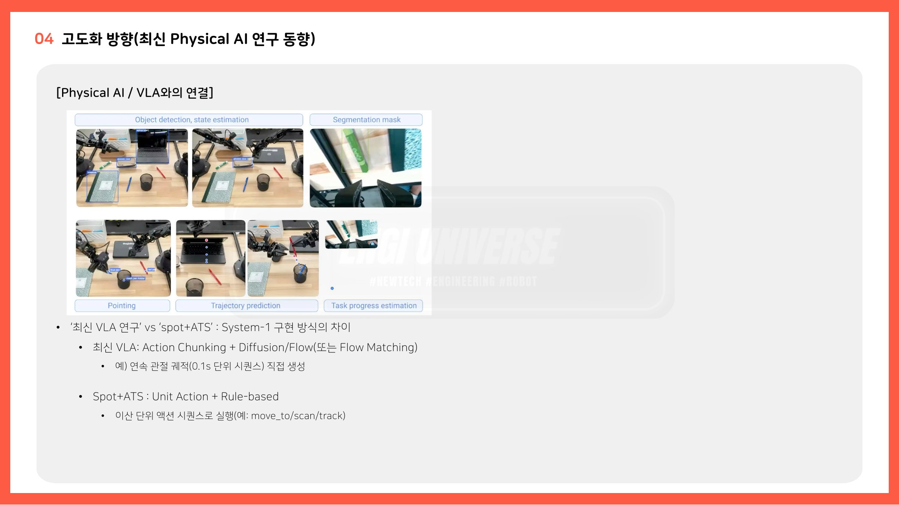{ width="720" }
/// caption
교안 5강 §04 — 최신 VLA와 Spot+ATS의 System-1 구현 방식 비교 (출처: ENGI UNIVERSE)
///

| 구분 | 최신 VLA | Spot+ATS (본 프로젝트) |
| --- | --- | --- |
| 아키텍처 | 초기 End-to-end → 모듈러 | 모듈러 (System-2 + System-1) |
| System-1 구현 | Action Chunking + Diffusion/Flow Matching (연속 관절 궤적 0.1s 단위) | **Unit Action + Rule-based** (이산 단위 액션: move_to/scan/track …) |

**왜 Unit Action + Rule-based 인가?**

1. **다양한 폼팩터에 즉각 대응** — Diffusion 정책은 로봇별 관절/기구학이 달라 이식·재학습 부담이 큼. ROS2 표준 인터페이스 기반이라 System-1만 로봇별 단위 액션으로 교체/추가(**Plug & Play**).
2. **데이터·인프라 장벽 회피** — 최신 VLA는 대규모 시연/합성 데이터와 학습 인프라 요구. 단위 액션은 기능을 작게 쪼개 라이브러리화하고, LLM은 **오케스트레이션(배치·순서·조건)** 에 집중 → 적은 리소스로 구현.

### 우리 프로젝트의 확장안

=== "① 멀티 에이전트 (Multi-Agent System)"

    - System-2를 **관제 서버**로 만들어 Spot/드론/UGV를 동시 스케줄링(누가·언제·어디를)
    - 추가 모듈: **Robot Registry**(능력/상태) + **Task Allocator**(임무 분배) + **Conflict Resolver**(충돌/우선순위)
    - 결과: "A는 Spot 순찰, B는 드론 확인" 같은 **팀 전술 플랜** 자동 생성·조정

=== "② System-1 진화 — Policy Head(하이브리드)"

    - 단위 액션은 유지하되 실행부 일부(수학적 규칙)를 **학습 정책**으로 교체(상위는 안전/제약 관리)
    - 후보 1) **DRL 자율주행 정책** — Nav2 로컬 플래너 대체/보완 → Social Navigation(사람 흐름 예측·좁은 통로 양보)
    - 후보 2) **End-to-End Visual Servoing 정책** — 폐색(Occlusion) 상황에서도 예측 기반 추적 유지

!!! quote "결론"
    System-2는 "**전술·협업·재계획**"을 담당하고, System-1은 "**안전하게 실행**"하면서 일부를 Policy로 고도화 → **확장성(멀티로봇) + 유연성(학습형 제어)** 를 동시에 얻는 다음 단계 로드맵.

---

!!! tip "🤗 실습으로 이어가기 — LeRobot 모듈"
    위 **Policy Head(학습형 System-1)** 와 **VLA** 를 직접 실습하려면 심화 모듈 **[LeRobot로 배우는 모방학습 & VLA](lerobot.md)** 를 참고하세요. 시연 데이터 수집 → ACT 학습, SmolVLA 평가까지 따라 할 수 있습니다.

## 🧩 Wrap-up — 한 학기 풀스택 정리

이번 강의 커리큘럼은 **시뮬레이션–미들웨어–자율주행–AI 추론**까지 현대 로봇 소프트웨어 풀스택을 하나의 파이프라인으로 연결했습니다.

1. **Isaac Sim 기초 및 환경 구축** — URDF 임포트 → 물리/센서 설정 → 고정밀 가상 검증 환경
2. **Isaac Sim ↔ ROS 2 연동** — ROS 2 Bridge로 센서 송신 + 제어 명령 수신(양방향 파이프라인)
3. **SLAM 및 자율주행(Navigation)** — SLAM으로 지도 생성 → Nav2로 위치추정·경로계획·장애물 회피
4. **Physical AI (LLM 기반 고수준 제어)** — System-2(자연어→Plan) + System-1(Plan→실행) 결합으로 텍스트 미션 수행·검증

## ✅ 체크포인트

- [ ] System-2 단독으로 자연어 명령이 `HighLevelPlan` JSON으로 변환되는가
- [ ] Scenario A(기초 기동)에서 `/system2/plan_cmd` → `move_to` 연동이 되는가
- [ ] Scenario C에서 `report_and_wait` → 운영자 재계획이 반영되는가
- [ ] Scenario D에서 `scan` → `track`(Visual Servoing) 전환이 되는가

## 📊 평가 루브릭 (기말 프로젝트)

| 항목 | 비중 | 평가 기준 |
| --- | --- | --- |
| 계획 생성 정확성 | 30% | 자연어 → `HighLevelPlan`(좌표·조건) 변환의 정확성 |
| System-1/2 연동 | 25% | `/system2/plan_cmd` 파이프라인이 손실 없이 동작 |
| 시나리오 수행 | 20% | A~D 시나리오(기동·인터랙티브·순찰·추적) 시연 |
| 재계획·협업 | 15% | `report_and_wait` + 운영자 개입 재계획 동작 |
| 고도화 제안·발표 | 10% | VLA·멀티에이전트·Policy Head 확장안의 타당성 |

## 🏛️ CAIO Forum 2026 연계 — Agentic AI 산업 동향과 응용

!!! quote "산업 동향 연계 (출처)"
    **매경·KAIST CAIO AI 리더스 포럼 2026** ("AX ROI의 분기점: 에이전트 시대, 도입을 넘어 성과 실현으로") 발표자료 연계.

우리가 구축한 Spot+ATS는 **LLM(System-2)이 계획을 세우고 실행 계층(System-1)이 수행**하는 **Agentic AI** 의 한 형태입니다. 같은 패러다임이 산업 전반으로 확산되고 있습니다.

| 발표 | 핵심 메시지 | 본 강의와의 접점 |
| --- | --- | --- |
| The Age of Agentic AI · 도메인 특화 AX (김동환, 42Maru) | 에이전트가 "도구"를 넘어 **도메인 특화** 작업 수행 | System-2 프롬프트에 보안 순찰 도메인 규칙 주입 |
| Agentic OS for AI-First Enterprise (황성주) | 에이전트가 워크플로우를 자동화하는 **"디지털 인력"** | 15주차 고도화 §의 **멀티 에이전트**(관제 서버) 확장 |
| AX ROI · Agentic AI NOW (정재헌) | 도입을 넘어 **성과(ROI) 실현** | 단위 액션 + 룰 기반의 **저비용·실용** 설계 철학 |

**에이전트형 AI 응용 시연 사례(CAIO 10기)**

=== "12조 · Blending Master"

    경유 제품 **블렌딩 전문가의 암묵지(노하우)** 를 구조화해 검색·재사용 가능한 **AI 자산**으로 전환 → 배합식 설계·첨가제 최적화에 활용.

    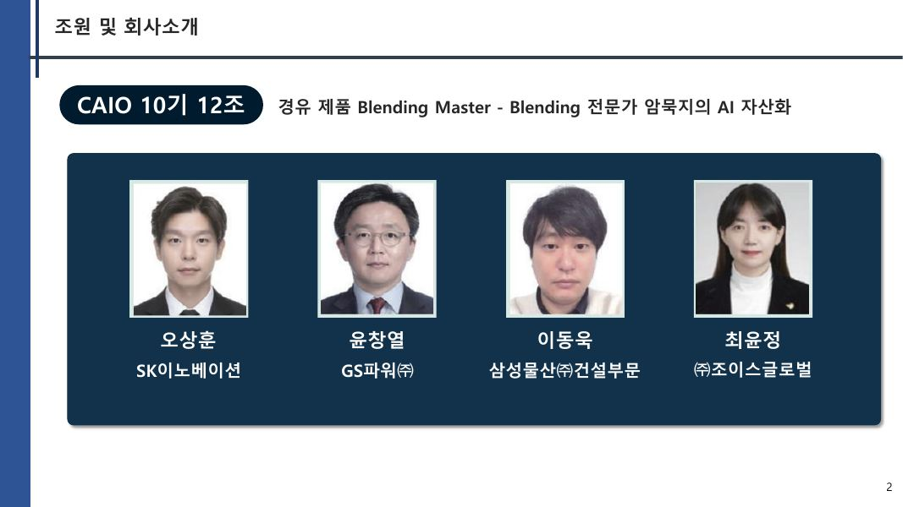{ width="640" }
    /// caption
    CAIO Forum 2026 시연 — 전문가 암묵지의 AI 자산화 (12조)
    ///

=== "14조 · HookMatch AI"

    **콘텐츠 IP를 분석**해 성과형 광고 크리에이티브로 전환하는 에이전트 → 분석·생성·전환을 자동화.

    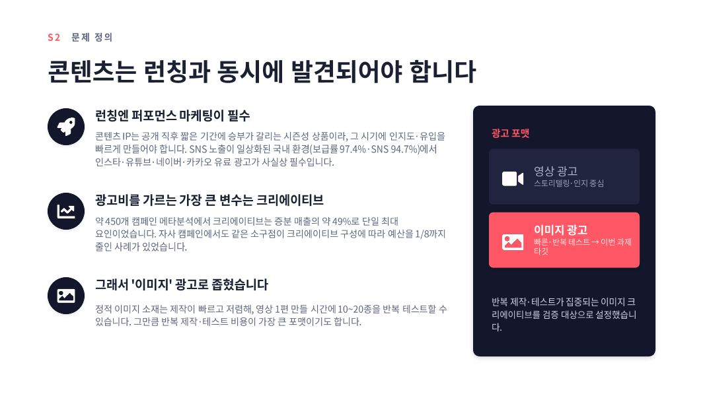{ width="640" }
    /// caption
    CAIO Forum 2026 시연 — 콘텐츠 IP 분석·광고 전환 에이전트 (14조)
    ///

!!! note "한 줄 정리"
    **Physical AI 로봇 에이전트(System-2)** 와 기업의 **Agentic AI** 는 *"추론(계획) – 실행의 분리 + 출력 검증"* 이라는 **동일한 설계 원리**를 공유합니다. 이 수업에서 만든 구조가 곧 산업 표준 패러다임의 임베디드(로봇) 버전입니다.

!!! note "🔬 NVIDIA Isaac 워크샵 연계 (DLI)"
    본 프로젝트의 고도화는 DLI 워크샵으로 직접 이어집니다. **매니퓰레이션**은 SIL의 `isaac_moveit`(Panda MoveIt)처럼 확장하고, **학습형 System-1**은 SMMG의 **합성데이터 + 모방학습**(GR00T-Mimic → BC-RNN, Cosmos 영상 증강)으로 강화할 수 있습니다.
    → 관련: [DLI · SIL](dli-sil.md) · [DLI · SMMG](dli-smmg.md) · [LeRobot 모듈](lerobot.md)

## 📖 핵심 용어 설명

이번 주차 본문에 등장한 핵심 용어를 학부생 눈높이로 정리합니다.

### System-1 / System-2

- **정의**: 로봇 지능을 **추론 계층(System-2)** 과 **실행 계층(System-1)** 으로 나눈 2계층 아키텍처. 인지과학의 "느리고 신중한 사고(System-2) vs 빠르고 반사적인 행동(System-1)" 비유에서 따온 이름입니다.
- **역할/왜 중요한가**: System-2(LLM)는 자연어 명령을 받아 무엇을 어떤 순서로 할지 **고수준 계획**을 세우고, System-1은 그 계획을 받아 **실제 로봇을 제어**합니다. 둘을 분리하면 "계획이 틀렸는지, 제어가 틀렸는지"를 따로 검증할 수 있어 디버깅과 확장이 쉬워집니다.
- **맥락·예시**: 본문 1교시에서는 로봇 없이 System-2만 돌려 계획 품질을 먼저 검증하고, 2교시에서 둘을 `/system2/plan_cmd` 토픽으로 연결합니다.

### HighLevelPlan (고수준 계획)

- **정의**: System-2가 출력하는 **미션 계획서**로, 의도(`intent`)와 순서대로 실행할 단위 액션 목록(`steps`)을 담은 구조화된 JSON 객체입니다.
- **역할/왜 중요한가**: 모호한 사람 말을 로봇이 곧바로 실행할 수 있는 **명확한 형식**으로 바꿔 줍니다. LLM과 로봇 사이의 "공통 언어" 역할을 합니다.
- **맥락·예시**: 본문 `models.py`의 `HighLevelPlan` 클래스가 `version`, `intent`, `steps`, `replan_rules` 필드로 이를 정의합니다.

### Pydantic / 스키마 검증

- **정의**: 파이썬에서 데이터의 **형식과 범위**를 정의하고, 그 규격을 벗어난 값을 자동으로 걸러내는 데이터 검증 라이브러리입니다.
- **역할/왜 중요한가**: LLM은 가끔 존재하지 않는 동작을 지어내는 **환각(hallucination)** 을 일으킵니다. Pydantic으로 미리 "허용된 형식"을 못박아두면 잘못된 계획이 로봇에 전달되기 전에 차단됩니다 — 일종의 "계약서"입니다.
- **맥락·예시**: 본문에서 `task: Literal["move_to", "scan", ...]` 처럼 **5개 액션 문자열만** 허용해 환각을 막고, `retry: Field(0, ge=0)` 으로 음수 재시도를 거부합니다.

### 단위 액션 (Unit Action)

- **정의**: `move_to`, `scan`, `track`, `report_and_wait`, `return_to_home` 처럼 **작게 쪼갠 이산(discrete) 동작** 하나하나를 가리킵니다.
- **역할/왜 중요한가**: 복잡한 미션을 미리 만들어 둔 액션 블록의 **조합**으로 표현하므로, LLM은 새 동작을 학습할 필요 없이 "어떤 블록을 어떤 순서·조건으로 배치할지"만 결정하면 됩니다(오케스트레이션). 학습 데이터·연산 부담이 적어 적은 리소스로 구현할 수 있습니다.
- **맥락·예시**: 3교시 비교표에서 최신 VLA의 "연속 관절 궤적(Diffusion)" 방식과 대비되는 **Unit Action + Rule-based** 방식으로 설명됩니다.

### report_and_wait / Human-in-the-loop

- **정의**: 로봇이 특정 상황(예: 사람 발견)에서 스스로 판단하지 않고 **운영자에게 보고한 뒤 지시를 기다리는** 단위 액션. 사람이 의사결정 루프에 끼어드는 방식을 Human-in-the-loop라 합니다.
- **역할/왜 중요한가**: 보안·안전이 중요한 임무에서 위험한 행동을 자동 실행하지 않고 **사람의 승인**을 거치게 해 안전성과 협업(Teaming)을 보장합니다.
- **맥락·예시**: Scenario C에서 순찰 중 `report_and_wait`에 도달하면 운영자가 새 명령을 내리고, System-1은 기존 계획을 폐기하고 **재계획**합니다. `system2_node.py`의 `_operator_input_loop`(별도 스레드 `input()`)가 이 입력을 받습니다.

### Visual Servoing (시각 기반 제어)

- **정의**: 카메라로 본 대상의 위치를 실시간 피드백으로 사용해 로봇의 움직임을 제어하는 기법. 대상이 움직여도 시선·거리를 유지하도록 동작을 계속 보정합니다.
- **역할/왜 중요한가**: 추적(`track`) 임무에서 목표가 이동하더라도 놓치지 않고 따라가게 합니다.
- **맥락·예시**: Scenario D에서 트럭 감지 후 `scan`→`track`으로 전환하며 "일정 거리를 유지하는 Visual Servoing 동작"을 수행합니다.

### VLA (Vision-Language-Action 모델)

- **정의**: 카메라 영상(Vision)과 언어 명령(Language)을 입력받아 로봇 행동(Action)을 직접 출력하는 최신 Physical AI 모델 계열입니다.
- **역할/왜 중요한가**: 인식–판단–제어를 하나로 통합해 범용성이 높지만, 로봇마다 재학습이 필요하고 대규모 데이터·인프라를 요구합니다. 본 프로젝트의 모듈러 설계와 비교 대상으로 다룹니다.
- **맥락·예시**: 3교시 비교표에서 VLA의 "초기 End-to-end → 모듈러" 추세와 Spot+ATS의 모듈러 구조를 견줍니다. 심화 실습은 `lerobot.md`(ACT·SmolVLA)로 이어집니다.

### 그 밖의 용어

| 용어 | 설명 |
| --- | --- |
| `temperature` | LLM 출력의 무작위성(창의성) 조절 파라미터. 본문은 `0.1`로 낮춰 경로가 매번 흔들리는 것을 방지합니다. |
| Action Chunking + Diffusion/Flow Matching | 최신 VLA의 System-1 구현 방식. 연속 관절 궤적을 0.1초 단위 묶음(chunk)으로 생성하는 학습형 정책입니다. |
| Grounding Vision / VLM | 고정 클래스만 보는 YOLO와 달리, 자연어로 대상·상태를 질의·탐지하는 개방형 비전(예: Grounding DINO, YOLO-World, LLaVA). |
| 엣지·서버 하이브리드 | 로봇(엣지)은 가벼운 1차 감지만, 서버의 대형 VLM이 정밀 판단하는 분업 구조. 배터리·연산을 아낍니다. |
| Task Queue (메모리) | System-1이 긴 전체 계획을 저장해 두고 단위 액션 실행 시 참고하는 작업 대기열. Scenario C 장기 순찰에 사용. |
| 멀티 에이전트 (Multi-Agent System) | System-2를 관제 서버로 만들어 Spot·드론·UGV 여러 로봇을 동시 스케줄링하는 확장안(Robot Registry·Task Allocator·Conflict Resolver). |
| `/system2/plan_cmd` | System-2가 만든 `HighLevelPlan`을 System-1 실행부로 전달하는 ROS 2 메인 토픽. |

## 📝 15주차 과제

!!! example "과제 15 — 기말 종합 프로젝트 — End-to-End 에이전트"
    **목표**: 한 학기 기술(인식·SLAM·System-1·System-2)을 통합해, 자연어 명령으로 계획→실행→현장 대응하는 Spot+ATS 에이전트를 시뮬레이션에서 완성·시연한다(팀 프로젝트).

**과제 흐름도**


```mermaid
graph LR
  A[시나리오 정의] --> B[System-2 계획] --> C[System-1 실행] --> D[통합 시연] --> E[📦 영상+발표]
```

**수행 단계**

1. 시나리오 정의(예: 구역 순찰·발견 시 보고/추적)
2. System-2(LLM Plan)+System-1(단위 액션) 통합
3. 최소 2개 시나리오(A 기초기동, C/D 순찰·추적) 시연
4. 실패 처리·재계획·고도화(VLA/LeRobot) 방향 논의

**제출물**

- [ ] 동작 시연 영상(2~3분) 또는 라이브
- [ ] 시스템 아키텍처 다이어그램(노드/토픽)
- [ ] 소스코드+launch(재현 가능)
- [ ] 발표 슬라이드(문제·설계·결과·한계·개선)
- [ ] 팀 기여도 표

**평가 (배점 100)**

| 항목 | 배점 | 기준 |
| --- | --- | --- |
| 시스템 완결성 | 30 | 명령→동작 전 구간 |
| 기술 통합도 | 25 | 인식·판단·제어 연결 |
| 강건성·재현성 | 15 | 실패 처리·launch |
| 발표·문서화 | 15 | 설계·다이어그램 |
| 창의성·확장 | 15 | 시나리오·고도화 |

**제출 형식·마감**: 다음 주차 강의 시작 전까지 LMS 업로드 — ① 코드/설정 `zip` ② 보고서 `PDF`(표지: 학번·이름·과제명) ③ 실행 결과 스크린샷/영상. 코드는 재현 가능해야 하며, 외부 코드를 사용하면 출처를 명시한다(미표기 시 감점).

## 🖼️ 원본 강의 슬라이드

??? note "Physical AI 5강 — System-2 테스트 및 검증 (전체 19매)"
    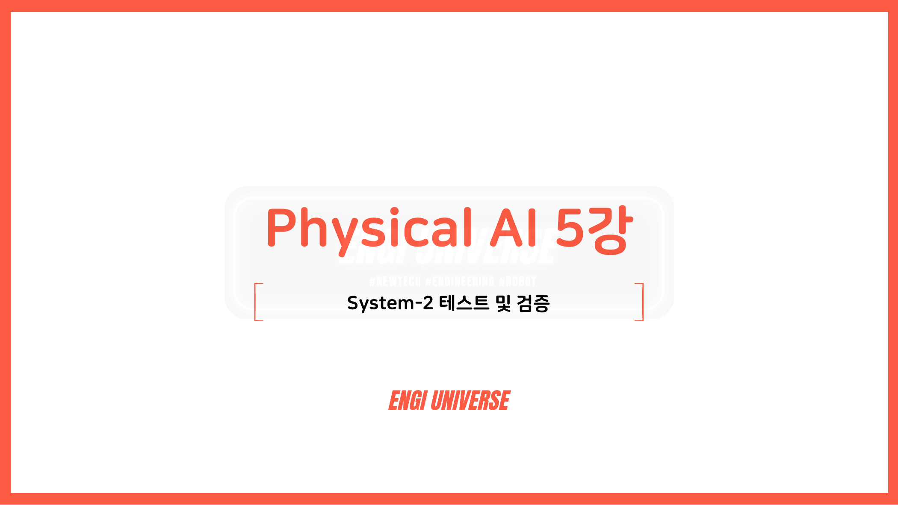{ width="700" }
    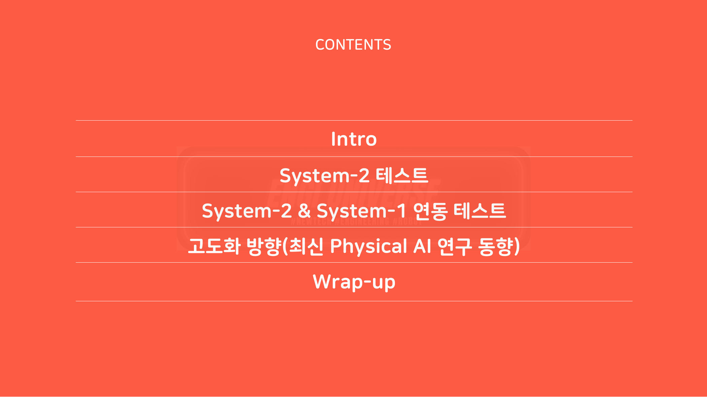{ width="700" }
    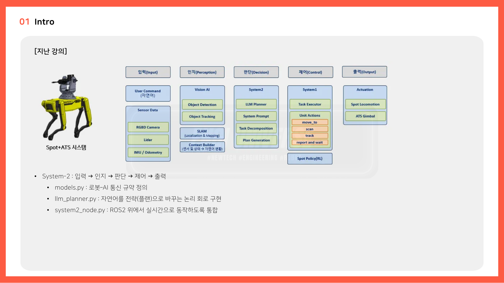{ width="700" }
    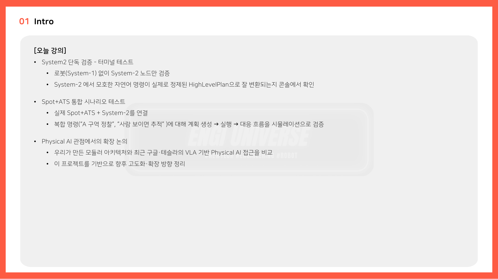{ width="700" }
    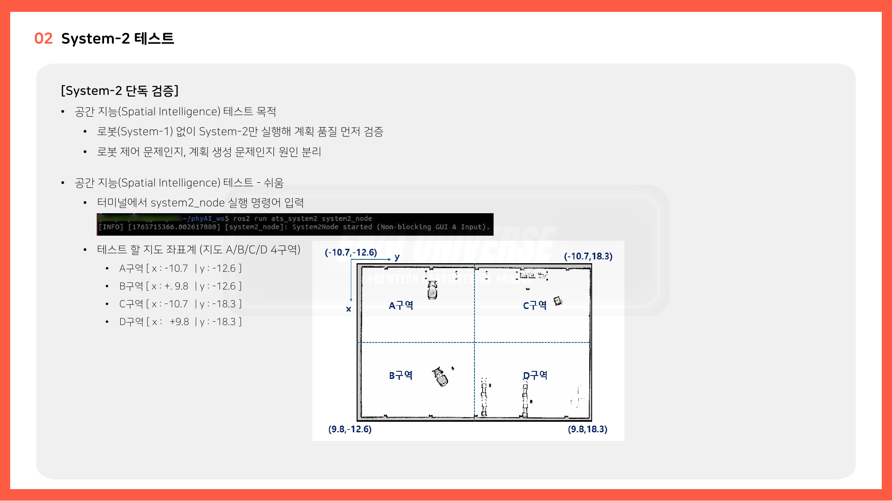{ width="700" }
    { width="700" }
    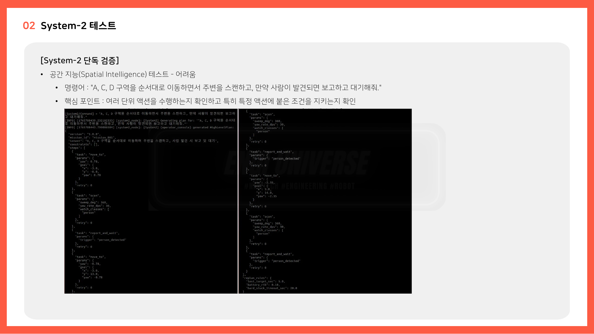{ width="700" }
    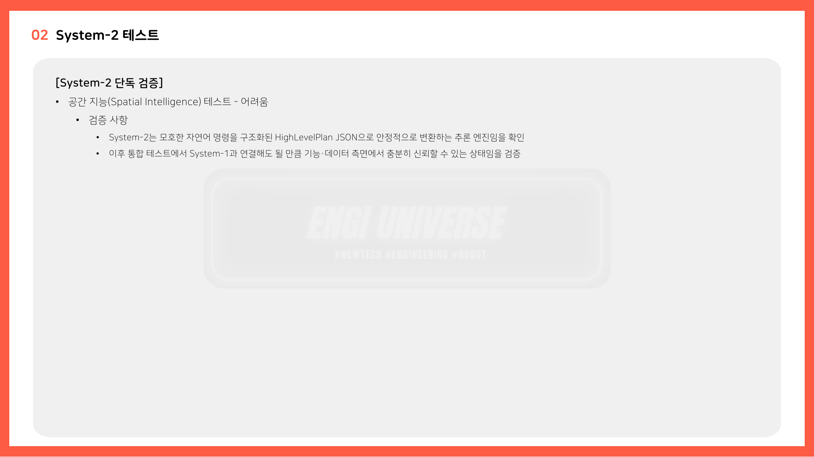{ width="700" }
    { width="700" }
    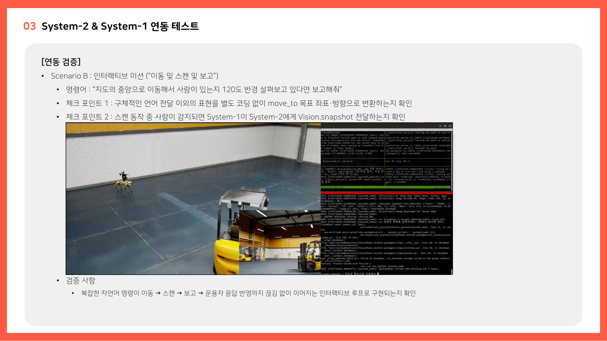{ width="700" }
    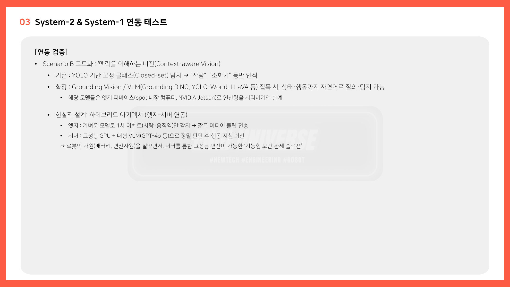{ width="700" }
    { width="700" }
    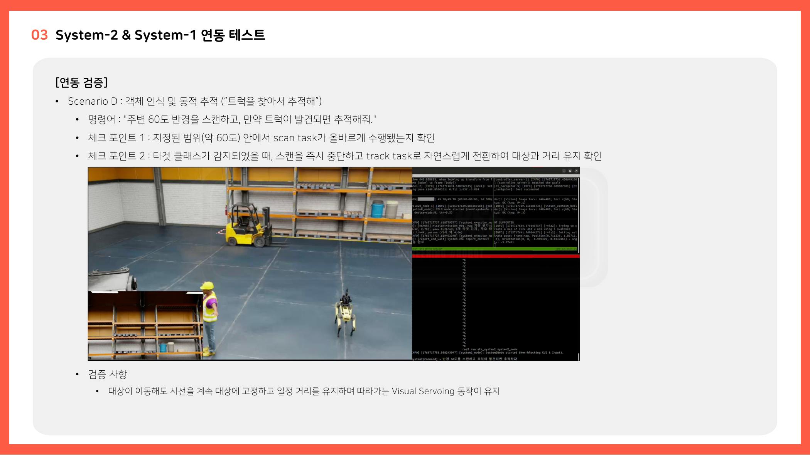{ width="700" }
    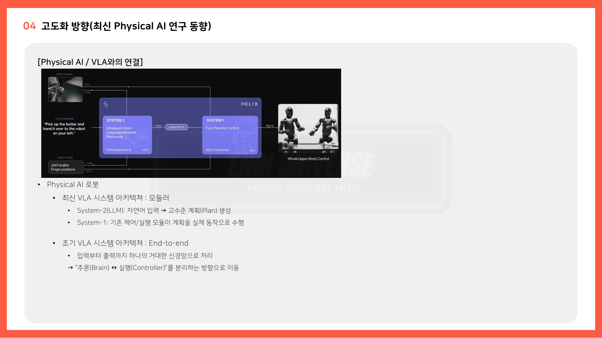{ width="700" }
    { width="700" }
    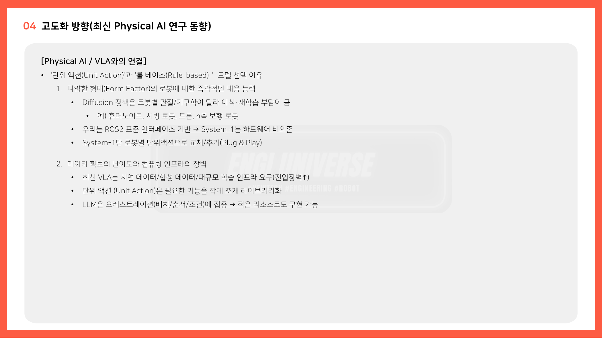{ width="700" }
    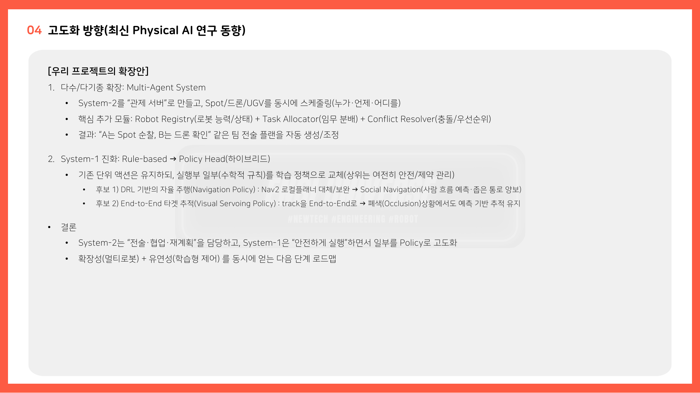{ width="700" }
    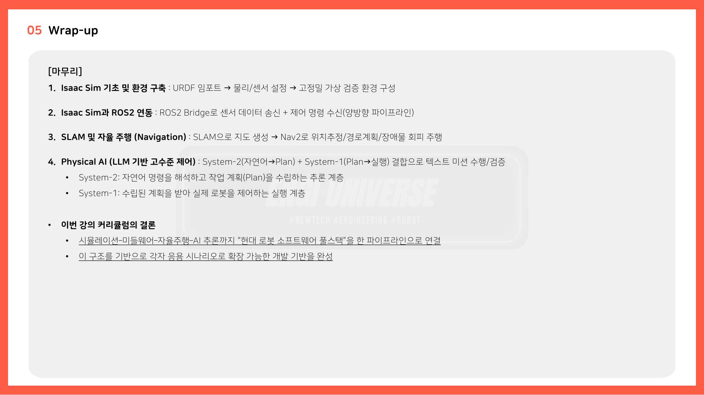{ width="700" }
    { width="700" }

??? note "Physical AI 4강 — System-2 LLM Planner 설계 (핵심)"
    { width="700" }
    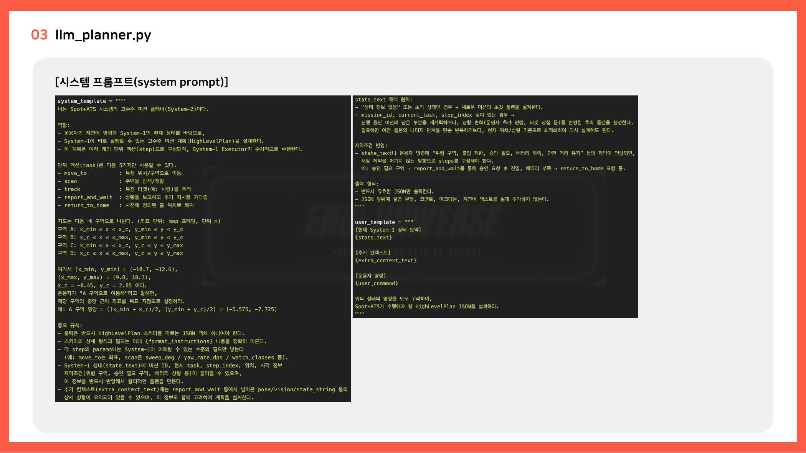{ width="700" }
    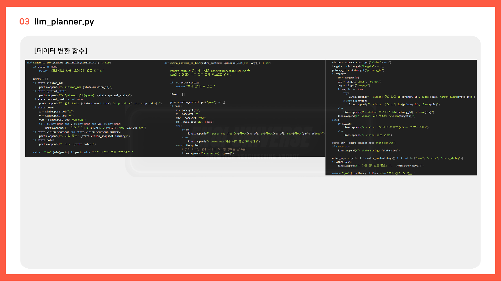{ width="700" }
    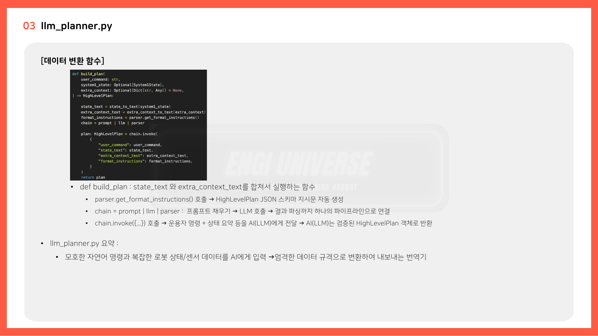{ width="700" }
    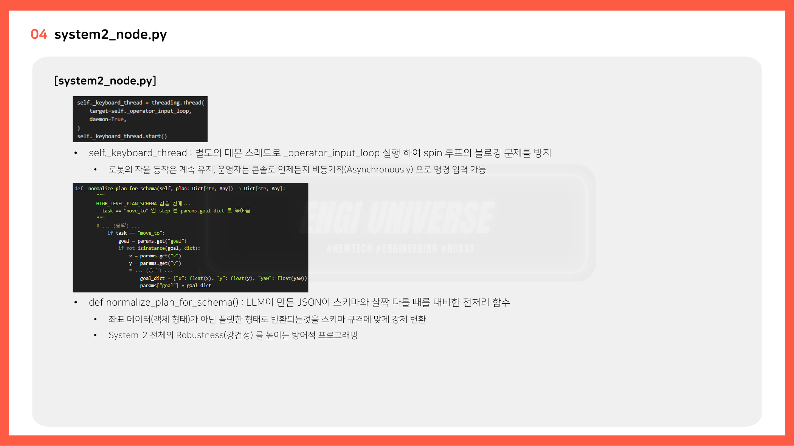{ width="700" }

## 🔗 출처 및 참고자료

- 교안: **『Physical AI』 4강·5강** (제작: ENGI UNIVERSE) — 강의 슬라이드 원본
- **Spot+ATS 프로젝트 사용 매뉴얼 (Rev 1.4)** — 로봇 플랫폼·운용 시나리오
- LangChain — <https://python.langchain.com>
- Pydantic — <https://docs.pydantic.dev>
- Grounding DINO — <https://github.com/IDEA-Research/GroundingDINO> · YOLO-World — <https://github.com/AILab-CVC/YOLO-World>
