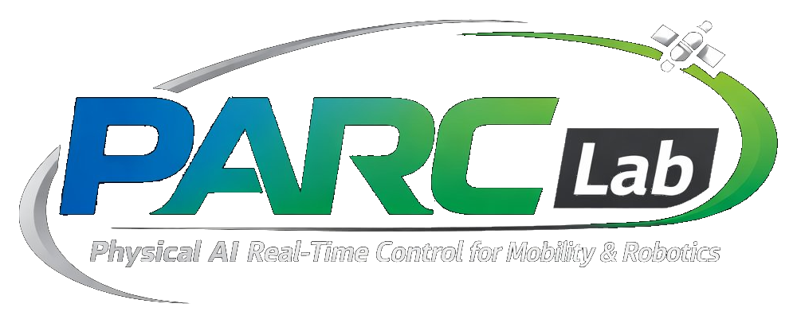

---
hide:
  - navigation
  - toc
---

한성대학교 · 미래모빌리티학과

<h1 class="parc-visually-hidden">PARC Lab — Physical AI Real-Time Control for Mobility & Robotics</h1>

PARC Lab은 Physical AI, EtherCAT 기반 실시간 제어, 모빌리티 플랫폼, 그리고 첨단 로보틱스를 연결하는
지능형 실시간 시스템을 연구합니다. 시뮬레이션에서 실제 배포까지 — 완전한 엔지니어링 파이프라인을 구축합니다.

<a class="primary" href="research/">연구분야 보기</a>
<a class="ghost" href="contact/">함께 연구하기</a>

<strong>Physical AI</strong>Embodied Intelligence

<strong>EtherCAT</strong>Real-Time Control

<strong>Mobility</strong>Robotics Deployment

<strong>Digital Twin</strong>Sim-to-Real

Research Areas

## 핵심 연구 분야

AI 지능, 결정론적 통신, 제어 아키텍처, 로봇 배포를 하나의 연속적인 엔지니어링 파이프라인으로 통합합니다.

-   :material-robot-outline:{ .lg .middle } __Physical AI Systems__

    ---

    체화 지능(Embodied Intelligence), 인식-계획-제어 통합, 로봇 시스템의 실세계 자율성 연구.

-   :material-flash:{ .lg .middle } __Real-Time Control__

    ---

    결정론적 제어 루프, 모션 동기화, 안전 핵심 시스템을 위한 산업용 제어 아키텍처.

-   :material-lan-connect:{ .lg .middle } __EtherCAT Network__

    ---

    EtherCAT 마스터/슬레이브 통합, 고속 통신, 분산 I/O, 동기화 필드버스 제어.

-   :material-car-electric:{ .lg .middle } __Mobility Platforms__

    ---

    자율 모빌리티, 스마트 보조 이동, 실용 환경을 위한 지능형 차량 플랫폼 제어.

-   :material-robot-industrial:{ .lg .middle } __Robotics__

    ---

    매니퓰레이터, 수술 로봇, 서비스 로봇, 고정밀·안전 다축 모션 시스템.

-   :material-cube-scan:{ .lg .middle } __Digital Twin & HILS__

    ---

    시뮬레이션-현실 검증, 하드웨어 인 더 루프 통합, 디지털 트윈 검증 워크플로우.

[전체 연구분야 →](research.md){ .md-button }

Projects

## 진행 중인 프로젝트

-   __:material-rocket-launch: 달 탐사 로봇 디지털 트윈 플랫폼__

    Isaac Sim + OmniLRS 기반 달 탐사 로버 HILS-RL 디지털 트윈 플랫폼 개발. ROS2 통합 및 KASA 연계 연구.

    `Isaac Sim` · `OmniLRS` · `ROS2` · `HILS`

-   __:material-sine-wave: EtherCAT 실시간 제어 시스템__

    EtherCAT 마스터 기반 고속 실시간 제어 시스템 개발. 산업용 로봇 및 모빌리티 플랫폼 적용.

    `EtherCAT` · `RTOS` · `C/C++` · `Linux`

[전체 프로젝트 →](projects.md){ .md-button }

Latest News

## 최신 소식

2026 · APR
#### PARC Lab 공식 출범
한성대학교 미래모빌리티학과 내 PARC Lab(Physical AI Real-Time Control for Mobility & Robotics)이 공식 출범하였습니다.

2026 · MAR
#### 대학원생 / 학부 연구생 모집
로보틱스, EtherCAT 제어, 임베디드 시스템, AI 기반 모빌리티에 관심 있는 학생을 모집합니다.

[전체 소식 →](news.md){ .md-button }
