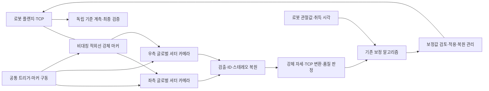
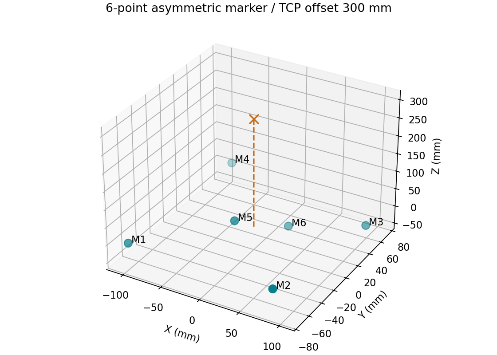
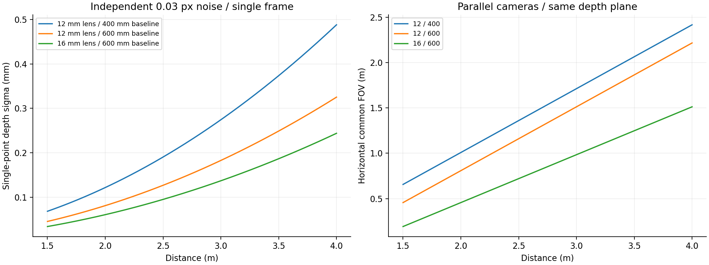
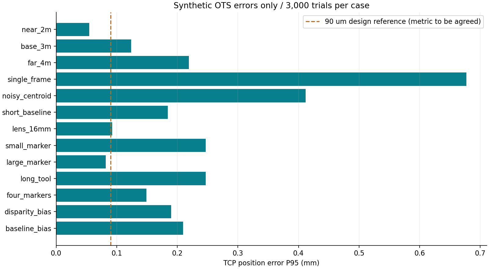
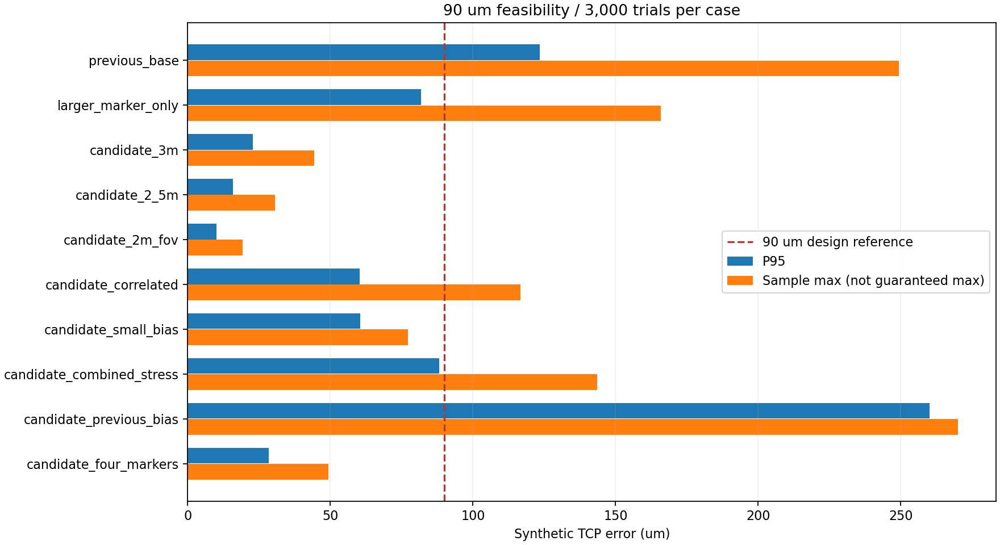

# HD로보틱스 — 개발 컨셉·세부 사양·설계 시뮬레이션

**계획 중 · 설계 후보 및 수치 시뮬레이션** · 검토일 2026-09-07

[개발 계획서](hd-robotics-ots-calibration.md) · [핵심 논문·기술 동향](hd-robotics-ots-literature.md)

!!! abstract "설계 방향"
    **정지 측정용 적외선 스테레오 헤드 + 비대칭 6점 강체 마커 + 자동 보정 SW**를 기본 구조로 제안한다. 2~3 m 거리, 600 mm 카메라 기준선, 12 mm 렌즈를 출발점으로 삼고, **90 μm 지향 설계는 16 mm 렌즈·확대 마커·TCP 이격 150 mm·60프레임 평균 조합**을 추가 검토한다. 실측 센서 데이터가 없는 단계이므로 아래 결과는 설계 민감도 분석이며, OTS 또는 로봇의 달성 성능이 아니다.

## 1. 시스템 개발 컨셉



초기 시제품은 검증된 산업용 카메라·렌즈를 활용하고, 스테레오 하우징, 마커 툴, 트리거·구동 회로, 교정·추적·연동 SW를 개발하는 안이다. 이미지 센서 및 카메라 전자회로 자체 설계는 별도 범위로 둔다. 2대 구성으로 가시성과 정확도를 먼저 확인하고, 추가 카메라 도입은 가려짐 시험 결과에 따라 판단한다.

측정 헤드는 로봇 베이스와 독립된 강성 지지대에 설치한다. 카메라 사이의 상대 위치·각도가 유지되도록 초점·조리개·체결을 고정하고 온도를 기록한다. 마커가 보이지 않는 구간에서는 측정을 중단·재시도하며, 추정값을 검수용 실측값으로 대체하지 않는다.

## 2. 카메라·광학·동기화 사양안

다음은 구매 확정 사양이 아닌 **시제품 설계 요구안**이다. 제품의 공개 사양과 본 과제의 설계 목표를 구분한다.

| 항목 | 1차 설계 후보 | 선정·검증 기준 |
|---|---|---|
| 카메라 | 흑백 글로벌 셔터 2대, 2448 × 2048급 | 두 카메라 동시 노출, 영상 누락·노출 편차 확인 |
| 픽셀 크기 | 계산 기준 3.45 μm | 센서 교체 시 픽셀 단위 초점거리와 시야 재계산 |
| 렌즈 | C-mount, 2/3인치 센서 대응, 12 mm 기본·16 mm 비교 | 선택 파장에서 초점·투과율·왜곡·주변부 중심 검출 성능 평가 |
| 기준선 | 600 mm 기본, 400 mm 비교 | 기준선을 늘리면 깊이 민감도는 개선되지만 공통 시야가 감소 |
| 측정 거리 | 초기 2~3 m, 4 m는 확장 시험 | 마커 전체의 공통 시야·유효 계측률로 영역 판정 |
| 촬영·출력 | 촬영 60 fps 목표, 정지 측정 30프레임 평균 후보 | 평균화 취득만 약 0.5초; 이동·안정화·ID·연산 시간은 별도 |
| 노출 | 0.2~2 ms 탐색 범위 | 광량 시험으로 확정; 포화·번짐·잔류 진동 억제 |
| 영상 | 원시 흑백, 지원되는 10/12 bit 취득 모드 검토 | 감마·자동 노출·자동 게인은 계측 시 고정, 유효 비트수 확인 |
| 파장·필터 | 850 nm 능동 마커 우선 검토, 대역폭 20~40 nm 후보 | LED 스펙트럼·필터 입사각·렌즈 투과율·센서 감도를 함께 실측 |
| 중심 검출 | 단일 프레임·각 영상축 잡음 σ = 0.03 px를 설계 가정 | 실제 달성 여부 미확인; σ = 0.10 px 조건도 계산 |
| 동기화 | 공통 하드웨어 트리거, 노출 시작 차이 10 μs 이하 목표 | 오실로스코프·노출 신호로 지터와 지연 검증; PC 수신시각으로 대체하지 않음 |
| 전송 | 카메라별 독립 USB3 경로 또는 동등 대역폭 | 5 MP × 2대 × 60 fps × 8 bit ≈ 602 MB/s 원시 데이터; 16 bit 저장 시 약 1.20 GB/s, 오버헤드 별도 |
| 열·기구 안정성 | 카메라·프레임 온도 기록, 워밍업 후 교정 | 온도 변화·재체결 후 기준 길이·기준 자세로 재확인 |

하드웨어급 비교 사례로 Basler acA2440-75um은 공식 문서에 5 MP, 기본 2448 × 2048, 3.45 μm 픽셀, 글로벌 셔터, 기본 75 fps 및 하드웨어 트리거를 제시한다. **해당 문서의 Spectrum 표기는 Visible**이므로, 이 모델을 850 nm OTS용으로 선정한 것은 아니다. 근적외선 감도·광량·중심 검출 시험을 통과하는 센서와 광학계를 최종 선정한다. [제조사 사양](https://docs.baslerweb.com/aca2440-75um)

60 fps 목표는 데이터 전송·노출·처리 시간을 포함해 검증한다. LED의 연속·펄스 전류, 발열, 구동 듀티는 부품 선정 후 결정한다. 광출력 수치나 0.03 px 성능을 부품 사양만으로 확정하지 않는다.

## 3. 마커 툴 상세 설계

| 항목 | 설계 후보 | 개발 항목 |
|---|---|---|
| 기본 형상 | 비대칭·비공면 6점, 중심점 배치 외곽 약 210 × 145 × 90 mm | 유사 거리 패턴·좌우 대응 모호성·가려짐 검사 |
| 크기 비교 | 기본의 0.5배 / 1배 / 1.5배 | 확대안 외곽 약 315 × 217.5 × 135 mm; 충돌·관성·장착 공간과 비교 |
| 발광부 | 850 nm LED와 확산부, 유효 발광 지름 6~10 mm 후보 | 12 mm 렌즈에서 2~3 m 거리의 이상적 투영 지름 약 7~17 px; 실제 광점은 광학계·포화에 따라 변함 |
| ID | 강체의 비대칭 기하 패턴 기본, 점멸 코드 보조 후보 | 코드 길이에 따른 재인식 지연·동기·잘못된 ID 비율 검증 |
| 관측 점수 | 정상 6점, 검수용 최소 4점 제안 | 점 수와 함께 배치·잔차·공분산 확인; 3점 이하이면 제안 정책상 재측정 |
| TCP 이격 | 마커 중심에서 300 mm 이하 우선, 가능한 한 단축 | 실제 툴 형상 기준; 회전 오차에 따른 TCP 오차를 별도 평가 |
| 장착 | 위치결정 핀·강성 체결, 케이블 하중 분리 | 반복 장착과 부하별 휨 측정, 마커–TCP 재정합 |
| 형상 교정 | 각 발광 중심의 3차원 좌표를 실측해 모델 저장 | CAD 좌표를 참값으로 사용하지 않음; 중심의 관측각 의존성 평가 |
| 질량·무게중심 | 대상 로봇과 툴의 잔여 허용 하중으로 결정 | 구조 설계 후 질량·관성·처짐 계산; 현 단계 확정 질량 없음 |

대응 관계를 알고 있는 비공선 3점으로도 강체 자세를 구할 수 있지만, 이 계획은 중복 관측과 품질 판단을 위해 **검수용 4점 이상**을 제안한다. 4점 관측만으로 정확도가 보장되지는 않는다. 카메라별 관측 가능 점과 강체 조건을 함께 확인한다.



그림의 점은 발광 중심이며 제작 도면이 아니다. 시뮬레이션은 코드에 공개한 6개 좌표를 무게중심 원점으로 옮겨 사용한다. 4점 조건은 M1~M4만 남기는 한 가지 누락 패턴이다. 모든 가려짐 조합이나 실제 로봇 구조물의 차폐를 계산한 결과는 아니다.

능동 마커를 우선 검토하되, 수동 반사 마커와의 비교시험도 수행한다. 능동형은 전원·동기·발열·발광각을, 수동형은 카메라 근접 조명·입사각·주변 반사체 오검출을 평가한다. 확산부·반사구의 크기가 곧 중심 위치 정확도를 의미하지 않는다.

## 4. 정밀도와 오차 예산 설계

최종 로봇 목표는 기존 계획의 **위치 0.5 mm, 자세 0.1° 이하**이다. OTS에는 별도의 초기 설계 배분안이었던 TCP 위치 P95 0.15 mm에서 강화하여 **90 μm(0.09 mm) 이내를 핵심 설계 지향값**으로 둔다. 적용 대상·최대값/P95의 최종 합의 전에는 OTS의 실제 TCP 위치 오차를 대상으로 P95와 표본 최대값을 모두 검토한다. 자세 P95 0.03°는 기존 내부 검토 기준이다. 이는 논문 실적이나 확정 검수 규격이 아니며, 아래 합성 데이터 민감도 분석과 실측 오차 예산을 바탕으로 조정할 내부 설계 기준이다.

| 오차 항목 | 관리 방법 |
|---|---|
| 영상 중심 검출 잡음 | 거리·광량·마커 각도별 반복 측정, 시간 상관 확인 |
| 카메라 내부·외부 교정 | 독립 기준물로 공간 오차 검사; 재투영 잔차만으로 합격 판정하지 않음 |
| 기준선·초점거리 변화 | 온도·진동·장착 상태 추적, 교정 파라미터 버전 관리 |
| 마커 자세와 TCP 이격 | 실제 TCP에서 오차 계산; 위치와 회전의 상관 포함 |
| 마커 형상·체결·TCP 교정 | 실측 형상, 반복 장착, 기준 TCP 교정 |
| 로봇 모델·베이스 정합 | 별도 검증 자세, 최종 도달 시험과 분리 보고 |

P95는 표본의 95백분위수이며 최대 오차 보증이 아니다. 각 항목의 P95를 단순 더하거나 제곱합하여 최종 최대값을 보증하지 않는다. 상관·편향·불확도를 포함한 실측 평가가 필요하다. **0.05 mm 공간 분해능 목표도 잡음 시뮬레이션만으로 검증되지 않는다.**

## 5. 시뮬레이션 방법과 재현 조건

### 기하학적 민감도

평행·정류된 핀홀 카메라를 가정한다. `f_px = 초점거리 / 픽셀 크기`, `B = 기준선`, `d = 좌우 시차`, `Z = 깊이`일 때 다음 관계를 사용한다.

```text
Z = f_px × B / d
σ_Z ≈ Z² / (f_px × B) × √2 × σ_pixel
σ_Z,mean ≈ σ_Z / √N        (프레임 잡음이 독립일 때만)
공통 수평 시야 ≈ max(0, 영상폭_px × Z / f_px − B)
TCP 회전 기여 ≈ 수직 이격 거리 × 작은 회전 오차_rad
```

12 mm / 3.45 μm의 `f_px`는 약 3478 px이다. 기준선 600 mm, σ_pixel = 0.03 px이면 단일 점의 깊이 표준편차는 2 m에서 약 **0.081 mm**, 3 m에서 약 **0.183 mm**이다. 독립 30프레임 평균 시 3 m 값은 약 **0.033 mm**로 감소하지만, 이는 3차원 TCP 오차나 분해능을 의미하지 않는다. 핀홀 투영·교정·삼각측량의 구현 기준은 [OpenCV 공식 문서](https://docs.opencv.org/4.13.0/d9/d0c/group__calib3d.html)를 참고하였다. 본 계산 코드는 해당 특수 기하의 식을 직접 구현한다.



12 mm / 600 mm 구성의 2 m 평면 공통 시야는 약 **0.808 × 1.178 m**, 3 m에서는 **1.511 × 1.766 m**이다. 16 mm 렌즈로 바꾸면 2 m의 공통 수평 시야가 약 **0.456 m**로 줄어든다. 마커 크기·회전·시야 여유를 제외하기 전 값이므로 그대로 로봇 작업 체적으로 사용하지 않는다.

### 몬테카를로 계산

- 시나리오별 3,000회, 난수 시드 `20260907`; 비교 조건에는 같은 난수열을 사용한다.
- 강체 원점은 카메라 기준선 중점 기준 X·Y 각각 ±100 mm, Z는 시나리오 거리로 고정한다. xyz 오일러 각을 각각 ±30°에서 균등 추출한다. 전체 SO(3) 균등 분포나 로봇 가동 영역을 의미하지 않는다.
- 6점 형상을 좌우 카메라에 투영하고, 각 영상 좌표에 독립 가우시안 잡음을 더한다. 정지 30프레임 평균은 `σ/√30`인 잡음으로 계산한다.
- 좌우 영상에서 삼각측량 후 **가중치 없는 SVD 강체 정합**으로 자세를 추정한다. TCP = 마커 좌표의 `[0, 0, 300] mm`를 변환하고 참 TCP와 3차원 거리·상대 회전각을 비교한다.
- 영상 경계 10 px 여유를 검사하며, 선택 점이 모두 시야에 있고 4점 이상인 경우만 계산한다. 3점 조건은 정책에 따라 거부한다.
- 고정 시차 편향 +0.03 px, 기준선 교정값 +50 ppm 오류를 각각 별도 시나리오로 추가한다. 편향은 평균화로 줄이지 않는다.

**포함하지 않은 항목:** 광원·센서의 영상 생성과 광자 잡음, 렌즈 왜곡 잔차의 공간 분포, 잘못된 ID, 실제 차폐·발광각, 마커 제작 오차, 열 변형의 시간 변화, 베이스 정합, 로봇 기구학·제어기·진동·충돌. 따라서 이번 작업은 **OTS 기하·잡음 설계 시뮬레이션**이며 로봇 보정 성능의 디지털 트윈 검증은 아니다. 실제 알고리즘에서는 삼각측량의 방향별 불확도를 반영한 가중 정합 또는 영상 재투영 기반 자세 추정도 비교한다.

## 6. 실행 결과

기본 조건은 **3 m / 12 mm / 기준선 600 mm / 6점 / 30프레임 / σ 0.03 px / TCP 300 mm**이다. 각 행은 표시된 조건만 바꾼다. 위치·자세 통계는 유효 표본 기준이며, CSV에는 표본 최대값·원점 오차·유효 표본 수도 포함한다.

| 변경 조건 | TCP 위치 RMS (mm) | TCP 위치 P95 (mm) | 자세 P95 (°) | 유효 / 전체 |
|---|---|---|---|---|
| 거리 2 m | 0.031 | 0.055 | 0.011 | 3000 / 3000 |
| 기본 조건 3 m | 0.071 | 0.124 | 0.024 | 3000 / 3000 |
| 거리 4 m | 0.126 | 0.219 | 0.043 | 3000 / 3000 |
| 평균화 없음, 1프레임 | 0.387 | 0.677 | 0.131 | 3000 / 3000 |
| 중심 검출 σ 0.10 px | 0.236 | 0.412 | 0.080 | 3000 / 3000 |
| 기준선 400 mm | 0.106 | 0.184 | 0.036 | 3000 / 3000 |
| 렌즈 16 mm | 0.053 | 0.093 | 0.018 | 3000 / 3000 |
| 마커 0.5배 | 0.140 | 0.247 | 0.048 | 3000 / 3000 |
| 마커 1.5배 | 0.048 | 0.082 | 0.016 | 3000 / 3000 |
| TCP 이격 600 mm | 0.140 | 0.247 | 0.024 | 3000 / 3000 |
| M1~M4만 관측 | 0.084 | 0.149 | 0.029 | 3000 / 3000 |
| 3점 관측, 정책상 거부 | — | — | — | 0 / 3000 |
| 고정 시차 편향 +0.03 px | 0.146 | 0.190 | 0.024 | 3000 / 3000 |
| 기준선 교정값 +50 ppm | 0.166 | 0.209 | 0.024 | 3000 / 3000 |



### 설계에 반영할 결론

1. **기본 조건의 합성 TCP 위치 P95는 약 0.124 mm**로 강화된 90 μm 지향값을 초과한다. 기존 기본안을 90 μm 설계안으로 채택하지 않는다. 표본 최대값도 약 0.249 mm이므로 P95를 최대값으로 해석하면 안 된다.
2. **마커 크기와 TCP 이격이 중요하다.** 마커를 절반으로 줄이거나 TCP 이격을 600 mm로 늘리면 P95가 약 0.247 mm로 커진다. 마커 확대안과 툴 가까이 배치하는 구조를 함께 검토한다.
3. **단일 프레임 또는 중심 검출 악화는 성능을 크게 낮춘다.** 단일 프레임의 P95는 약 0.677 mm이다. 정지 안정화와 영상 품질을 먼저 확보하고, 평균화 효과는 시간 상관을 측정해 검증한다.
4. **평균화로 교정 편향을 해결할 수 없다.** 고정 시차 0.03 px 또는 기준선 50 ppm 오류를 주면 P95가 각각 약 0.190 / 0.209 mm로 증가한다. 기준선 600 mm의 50 ppm은 0.03 mm에 해당한다.
5. **4 m를 기본 성능 영역으로 확정하지 않는다.** 4 m의 P95는 약 0.219 mm이며, 우선 2~3 m에서 실측 검증한다. 16 mm 렌즈는 오차를 낮추지만 근거리 공통 시야를 줄인다.

표의 100% 유효율은 제한된 합성 자세가 시야·점 수 검사에 모두 통과했다는 뜻이다. 실제 추적 성공률, 인라인 자동 완료율 또는 가려짐 대응률이 아니다. 3점 조건의 0%는 실패 확률의 추정이 아니라 명시한 거부 정책의 결과다.

## 7. 90 μm 목표를 위한 추가 설계 검토

!!! important "90 μm의 적용 기준"
    사용자가 제시한 핵심 지향값은 **90 μm 이내**이다. 현재 추가 계산은 **OTS가 측정하는 실제 TCP 위치의 3차원 거리 오차**를 대상으로 한다. 최종 로봇 도달 오차인지 OTS 계측 오차인지, 최대값인지 P95인지에 대한 확정은 별도이며, 기존 로봇 도달 목표 0.5 mm를 임의로 0.09 mm로 바꾸지 않는다. 아래 표본 최대값은 시험한 합성 표본 중 최대값이며 전 작업 공간의 보증 상한이 아니다.

### 강화 설계 후보

| 항목 | 기존 계산 기준 | 90 μm 검토 후보 |
|---|---|---|
| 측정 거리 | 2~3 m | 우선 2.5~3 m; 근거리는 공통 시야 재검토 |
| 렌즈·기준선 | 12 mm / 600 mm | 16 mm / 600 mm |
| 마커 중심 배치 외곽 | 210 × 145 × 90 mm | 315 × 217.5 × 135 mm |
| TCP 이격 | 300 mm | 150 mm 이하를 우선 검토 |
| 평균화 | 30프레임 | 60프레임, 60 fps에서 취득만 약 1초 |
| 중심 검출 잡음 | 0.03 px 가정 | 동일 가정; 프레임 상관을 추가 검토 |
| 교정 편향 | 이상적 교정 또는 개별 큰 편향 | 시차 −0.005 px·기준선 +10 ppm의 동시 편향도 계산 |

마커 확대·TCP 근접 배치가 실제 툴에 가능한지는 기구 설계로 확인한다. 16 mm 렌즈와 큰 마커의 조합은 근거리 시야가 좁다. 2 m 조건에서는 합성 자세 3,000개 중 1,953개만 시야 검사에 통과했으므로, 낮은 오차만으로 2 m 사용을 승인하지 않는다.

### 추가 계산 결과

아래 수치는 μm 단위이다. 모든 행은 3,000회 계산하며, 유효 표본에서 통계를 낸다. 기존 기본안과 마커만 확대하는 행을 제외하면 위 강화 후보를 사용한다.

| 조건 | TCP P95 (μm) | TCP 표본 최대 (μm) | 유효 / 전체 |
|---|---|---|---|
| 기존 기본안 | 123.5 | 249.4 | 3000 / 3000 |
| 기존안에서 마커만 1.5배 | 81.8 | 166.0 | 3000 / 3000 |
| 강화 후보 3 m, 독립 잡음 | 23.0 | 44.4 | 3000 / 3000 |
| 강화 후보 2.5 m, 독립 잡음 | 15.9 | 30.6 | 3000 / 3000 |
| 강화 후보 2 m, 시야 제한 | 10.1 | 19.4 | 1953 / 3000 |
| 강화 후보 3 m, 프레임 상관 0.1 | 60.3 | 116.7 | 3000 / 3000 |
| 강화 후보 3 m, 작은 동시 편향 | 60.5 | 77.2 | 3000 / 3000 |
| 강화 후보 3 m, 상관 + 작은 동시 편향 | 88.1 | 143.7 | 3000 / 3000 |
| 강화 후보 3 m, 시차 −0.03 px + 기준선 50 ppm | 260.1 | 270.0 | 3000 / 3000 |
| 강화 후보 3 m, M1~M4 관측 | 28.5 | 49.4 | 3000 / 3000 |



프레임 상관 조건은 각 영상 좌표의 시간 잡음에 동일 상관계수 ρ = 0.1을 가정한다. 평균 잡음은 `σ × sqrt(ρ + (1−ρ)/N)`로 계산한다. 서로 다른 점·영상축·카메라 사이의 상관은 모델링하지 않는다. 상관계수는 실측값이 아닌 민감도 시험 입력이다. ρ = 1이면 평균화 이득이 사라져 단일 프레임 결과와 일치하는지 코드에서 검사했다.

### 판단과 필요한 여유

- **이상적인 강화 후보는 검토할 가치가 있다.** 3 m에서 P95 약 23.0 μm, 표본 최대 약 44.4 μm이다. 그러나 모델에 없는 형상·장착·베이스 정합 오차가 남아 있어 90 μm 달성을 의미하지 않는다.
- **P95만으로 통과시키면 안 된다.** 상관과 작은 교정 편향을 함께 넣은 조건은 P95 약 88.1 μm지만 표본 최대 약 143.7 μm이다.
- **평균화보다 편향과 시간 상관 관리가 우선이다.** 시차 −0.005 px·기준선 +10 ppm 조건에서도 표본 최대가 약 77.2 μm로 증가한다. 잔여 오차와 기준 계측 불확도를 위한 여유가 작다. 이 편향 값을 허용 공차로 확정하지 않는다.
- **넓은 공간과 모든 자세의 보증에는 추가 검증이 필요하다.** 합성 자세 ±100 mm, 각도 ±30°의 제한된 결과를 전체 작업 공간으로 확대하지 않는다. 최종 평가 공간과 자세를 사전에 고정하고 독립 표본으로 확인한다.

90 μm를 최대 허용 오차로 확정하는 경우, 별도 기준 계측의 불확도를 포함한 판정 규칙을 수립한다. 예를 들어 적용 가능한 조건에서 `측정 오차 + 해당 오차의 확장불확도 ≤ 90 μm`의 가드밴드 방식을 검토할 수 있다. 이를 사용하려면 좌표계 정합·기준물·반복성의 불확도와 포함확률을 먼저 평가해야 한다. 단순히 이번 표본 최대값에 임의의 불확도를 더해 합격 처리하지 않는다.

[90 μm 추가 계산 코드](../assets/ots/study_90um.py) · [결과 CSV](../assets/ots/results-90um.csv) · [조건·결과 JSON](../assets/ots/results-90um.json)

`study_90um.py`와 `simulate_ots.py`를 같은 폴더에 두고 `python study_90um.py`로 실행한다. 본 계산은 설계 후보를 찾기 위한 동일 난수 표본 비교이며, 후보 선정 후 별도 난수·공간 경계·실측 데이터 검증이 필요하다.

## 8. 시제품 시험과 다음 시뮬레이션

| 단계 | 수행 내용 | 의사결정 기준 |
|---|---|---|
| 광학 벤치 | 카메라·12/16 mm 렌즈·LED·필터 조합 시험, 거리·노출·각도별 중심 검출 | 0.03 px 가정의 타당성, 포화·편향·프레임 상관 측정 |
| 스테레오 교정 | 기준선·내부 파라미터 교정, 별도 기준물 검증 | 깊이별 편향·열 변화 확인, 공통 시야와 유효 영역 확정 |
| 마커 비교 | 기본·축소·확대 형상, 모든 4점 부분집합, 반복 체결 | 실제 TCP 오차·ID 모호성·가려짐·충돌 여유 |
| 시뮬레이션 확장 | 실측 잡음·왜곡·온도 데이터를 입력, 카메라 배치·시야 최적화 | 합성 가정을 계측 데이터로 교체하고 모델 예측과 실측 비교 |
| 로봇 연동 | 대상 로봇 DH/URDF·툴 CAD·관절 범위·API 확보 후 자세 생성 | 가시성·충돌·식별성·경로와 소요시간 검증 |
| 최종 성능 | 기존 보정 연동 후 별도 지령·독립 기준 계측 | 개발 계획서에 합의한 위치·자세·자동화 기준으로 판정 |

현재는 대상 로봇 모델·셀 CAD·실측 카메라 교정값이 제공되지 않아 물리 로봇 동작·충돌·보정 전후 성능 시뮬레이션까지 수행하지 않았다. 해당 입력을 확보하면 이번 기하 모델을 실제 셀 설계와 연결한다.

## 9. 다운로드와 재현

[실행 코드](../assets/ots/simulate_ots.py) · [전체 결과 CSV](../assets/ots/results.csv) · [조건·마커 좌표·검증 결과 JSON](../assets/ots/results.json)

```bash
python simulate_ots.py --out results
```

Python과 NumPy·SciPy·Matplotlib이 필요하다. 실행에 사용한 라이브러리 버전은 JSON에 기록했다. 코드는 잡음이 없는 경우 TCP 복원 오차가 1e-7 mm 미만인지, 독립 20만 표본의 깊이 표준편차가 해석식과 1% 이내로 일치하는지 자동 검사한 후 결과와 그래프를 생성한다. 이 검사는 수치 구현의 일관성 검사이며 실제 계측 성능 검증은 아니다.

---

[개발 계획서로 돌아가기](hd-robotics-ots-calibration.md) · [프로젝트 목록](../projects.md)
