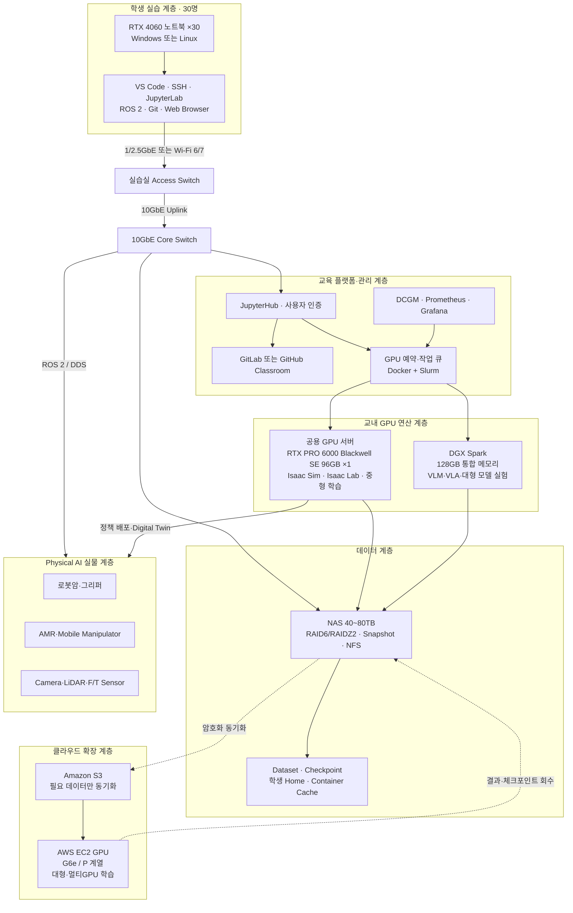
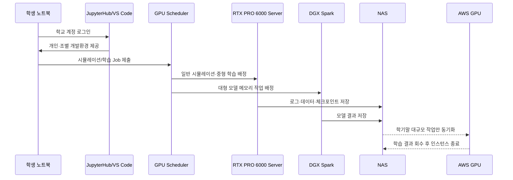
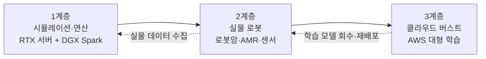

# 한성대학교 Physical AI 교육·연구 플랫폼 (HSU-PAC)

:material-circle-outline:{ style="color:#e0a800" } **구축 제안** · Hansung University Physical AI Computing Platform

!!! abstract "프로젝트 한눈에 보기"
    HSU-PAC는 **30명 규모(6명 × 5개 조)**의 Physical AI 교육을 위해 학생 노트북, 교내 GPU
    서버, NVIDIA DGX Spark, 10GbE 네트워크, 공용 스토리지, AWS GPU를 하나의 개발
    파이프라인으로 연결하는 하이브리드 교육·연구 플랫폼입니다.

    학생의 RTX 4060급 노트북은 코드 작성, ROS 2 실습, 데이터 확인과 원격 접속을 담당합니다.
    고성능 GPU가 필요한 Isaac Sim, Isaac Lab, 합성데이터 생성, 강화학습, 비전·로봇 모델
    학습은 교내 RTX PRO 6000 서버에서 처리합니다. 96GB GPU 메모리보다 큰 모델을 로드하거나
    메모리 중심의 파인튜닝·추론이 필요한 경우 DGX Spark를 사용하고, 학기말 캡스톤처럼 짧은
    기간에만 필요한 대규모 멀티GPU 학습은 AWS로 확장합니다.

> **핵심 운영 원칙** — 상시 수업은 온프레미스, 대형 모델 실험은 DGX Spark, 일시적 최대부하는 AWS가 담당합니다.

<figure markdown>
  { loading=lazy }
  <figcaption>시스템 구축 방안 전체 요약 (클릭하여 확대)</figcaption>
</figure>

---

## 왜 필요한가

Physical AI 교육은 일반적인 Python·AI 실습보다 훨씬 많은 연산자원을 요구합니다. Isaac Sim의 고해상도 시뮬레이션, 다중 환경 병렬 실행, 강화학습, 로봇 파운데이션 모델은 학생 개인 노트북만으로 안정적으로 운영하기 어렵습니다.

| 구분 | 학생 노트북 RTX 4060 | 교내 GPU 플랫폼 |
|---|---:|---:|
| 주요 역할 | 코드 작성, ROS 2, 원격 접속 | 시뮬레이션, 학습, 추론, 렌더링 |
| 일반 GPU 메모리 | 약 8GB | RTX PRO 6000: 96GB |
| 대형 모델 메모리 | 제한적 | DGX Spark: 128GB 통합 메모리 |
| 다중 사용자 운영 | 개인 단말 | 계정·컨테이너·작업 큐 기반 공유 |
| 대규모 확장 | 불가 | AWS 멀티GPU 버스트 |

30명의 교육환경에서는 다음 네 가지 문제를 함께 해결해야 합니다.

1. **동시성** — 30명이 로그인하더라도 모든 학생이 동시에 고사양 시뮬레이션을 실행하지 않도록 개인·조·공용 자원을 계층화해야 합니다.
2. **재현성** — 학생마다 CUDA, ROS 2, Python 버전이 달라 발생하는 환경 문제를 컨테이너로 제거해야 합니다.
3. **경제성** — 매주 반복되는 수업을 모두 AWS로 운영하면 사용시간에 따라 비용이 계속 증가합니다.
4. **확장성** — 학기말 대규모 학습만 클라우드로 확장하고, 평상시에는 교내 자원을 우선 활용해야 합니다.

---

## 권장 시스템 아키텍처

### 네트워크 설계 원칙

학생 노트북 30대 모두에 10GbE를 제공할 필요는 없습니다. 학생 단말은 코드, 명령, 원격 화면을 주고받기 때문에 1GbE 또는 2.5GbE로 충분합니다. 실제 대용량 데이터가 이동하는 **GPU 서버–DGX Spark–NAS–Core Switch 구간**을 10GbE 이상으로 구성하는 것이 비용 효율적입니다.

- 학생 단말: 1GbE/2.5GbE 또는 Wi-Fi 6/7
- Access Switch 업링크: 10GbE 2회선 이상 권장
- RTX 서버: 10GbE 2포트 권장
- DGX Spark: 10GbE 연결 (노드 간 분산학습은 내장 ConnectX-7 200G 직결 활용)
- NAS: 10GbE 2포트 LACP 또는 25GbE 확장 고려
- 서버 관리망, 학생망, 로봇망, 스토리지망 VLAN 분리

---

## 구성 요소별 역할

### 1. RTX PRO 6000 공용 GPU 서버

교과목에서 가장 자주 사용하는 핵심 연산 노드입니다.

- Isaac Sim 원격 실행 및 스트리밍
- Isaac Lab 강화학습, 합성데이터 생성
- 비전 모델 학습·평가, 디지털 트윈 렌더링
- 조별 중형 학습 작업, 교수 시연 및 과제 자동평가

RTX PRO 6000 Blackwell Server Edition은 96GB GDDR7 메모리와 최대 4개의 MIG 인스턴스를 지원합니다. 다만 MIG 4분할이 곧바로 "30명 동시 Isaac Sim"을 의미하지는 않습니다. 고해상도 그래픽 세션, 학습 작업, 컨테이너 오버헤드를 고려해 **5개 조 중심의 예약·큐 방식**으로 운영해야 합니다.

#### 권장 서버 사양

| 항목 | 권장 사양 |
|---|---|
| GPU | RTX PRO 6000 Blackwell Server Edition 96GB ×1 |
| 확장성 | 향후 동일 GPU 2~4장 장착 가능한 4U급 섀시 |
| CPU | AMD EPYC 또는 Intel Xeon, 32코어 이상 |
| 시스템 메모리 | ECC RAM 256GB 이상, 권장 512GB |
| OS 스토리지 | NVMe RAID1 2TB 이상 |
| Scratch | NVMe 4~8TB |
| 네트워크 | 10GbE 2포트 이상 |
| 전원 | 이중화 PSU 및 UPS 권장 |
| 운영체제 | Ubuntu Server LTS |

!!! warning "조달 시 유의"
    조달 사양서에는 반드시 **Server Edition**을 명시해야 합니다. Workstation Edition과
    냉각구조 및 서버 적용조건이 다릅니다.

### 2. DGX Spark

DGX Spark는 128GB 통합 메모리를 제공하는 소형 Grace Blackwell 시스템입니다. 처리량 중심의 대규모 학습 서버라기보다, 일반 GPU 메모리에 들어가지 않는 모델을 로드하고 검증하는 **대형 모델 개발·실험 노드**로 사용하는 것이 적절합니다.

- GR00T, VLM, VLA, LLM 기반 로봇지능 모델 로드
- LoRA·QLoRA 등 메모리 효율형 파인튜닝, 대형 모델 양자화 및 추론
- AWS 학습 전 코드·데이터 파이프라인 사전 검증
- 교수자·대학원생·캡스톤 프로젝트 예약형 사용
- Arm 기반 소프트웨어 호환성 검증

초기 구축은 DGX Spark 1대를 공용 예약 노드로 운영합니다. 향후 사용률이 높아지면 조별 전용 노드로 단계적으로 증설합니다.

### 3. NAS 및 공용 스토리지

Physical AI는 이미지, 영상, 포인트클라우드, 시뮬레이션 로그, 체크포인트가 빠르게 누적됩니다.

- 원본 60~80TB, 실사용 40TB 이상 권장, RAID6 또는 RAIDZ2
- 학생 Home 및 조별 프로젝트 NFS 제공, 데이터셋 읽기 전용 영역 분리
- 조별 저장공간 Quota, 일일 Snapshot, 주간 별도 백업
- AWS 동기화 영역 분리, 기업과제·개인정보 데이터 외부 반출 통제

---

## 30명 동시교육 운영 모델

30명의 학생을 6명씩 5개 조로 편성하고, 개인·조·공용 작업을 구분합니다.

| 실습 유형 | 운영 단위 | 권장 운영 방식 |
|---|---:|---|
| Python·ROS 2·Git | 개인 30명 | 노트북 또는 경량 컨테이너 |
| JupyterLab·코드 편집 | 개인 30명 | CPU/RAM 중심, GPU 미점유 |
| Isaac Sim 기본 조작 | 2~3인 또는 조별 | 5~10개 세션, 시간 분할 |
| Isaac Lab 강화학습 | 조별 5개 작업 | GPU 작업 큐 및 예약제 |
| GR00T·VLA 실습 | 조별 순환 | DGX Spark 예약 사용 |
| 대규모 파인튜닝 | 프로젝트별 | AWS 버스트 |

### 수업 시간의 권장 흐름

### 현실적인 동시성 기준

RTX PRO 6000 한 장으로 30개의 완전 독립된 고해상도 Isaac Sim 세션을 동시에 제공하는 것은 어렵습니다. 따라서 다음 중 하나를 적용해야 합니다.

1. 조별 대표 세션 운영
2. 2~3인 페어 실습
3. Headless 학습과 3D 뷰포트 세션 분리
4. 실습 시간을 순환형으로 설계
5. 사용률 측정 후 RTX PRO 6000 추가 증설

### 자원 분배·회수 정책

- MIG 인스턴스 단위 세션 예약제 — VRAM은 하드웨어 격리로 독점 원천 차단
- 컨테이너별 CPU·RAM 쿼터(cgroup), GPU-hour 일일 상한
- **유휴 세션 자동 회수**: 2시간 유휴 시 종료 예고 알림 → 3시간 유휴 시 자원 회수
- 실시간 사용량 대시보드 제공, 과도 사용 시 관리자 알림

---

## 소프트웨어 플랫폼

| 계층 | 권장 구성 | 역할 |
|---|---|---|
| 사용자 인증 | 학교 계정 연동, LDAP/OIDC | 학생·조교·교수 권한 분리 |
| 개발환경 | JupyterHub, VS Code Remote SSH | 웹·원격 통합 개발환경 |
| 컨테이너 | Docker, NVIDIA Container Toolkit | 수업환경 표준화 |
| 스케줄링 | 초기 예약제, 이후 Slurm | GPU 작업 큐·우선순위 관리 |
| 시뮬레이션 | NVIDIA Isaac Sim | 디지털 트윈·합성데이터 |
| 로봇학습 | Isaac Lab, PyTorch, LeRobot | 강화학습·모방학습 |
| 미들웨어 | ROS 2 | 실물 로봇 연계 |
| 모델 관리 | MLflow 또는 W&B | 실험·체크포인트 추적 |
| 형상 관리 | GitLab 또는 GitHub Classroom | 과제·프로젝트 협업 |
| 모니터링 | DCGM, Prometheus, Grafana | GPU·서버·스토리지 상태 |
| 클라우드 | AWS CLI, S3, EC2, Budget | 버스트·비용통제 |

RTX 서버는 x86-64, DGX Spark는 Arm 기반이므로 컨테이너 이미지는 가능한 범위에서 multi-architecture로 관리해야 합니다. x86 전용 패키지는 DGX Spark에서 실행되지 않을 수 있으므로 학기 시작 전에 호환성 검증이 필요합니다.

---

## 온프레미스와 AWS 비교

| 항목 | 교내 RTX 서버 | DGX Spark | AWS GPU |
|---|---|---|---|
| 핵심 목적 | 상시 수업·시뮬레이션·중형 학습 | 대형 모델 로드·추론·메모리 중심 실험 | 단기 대형·멀티GPU 학습 |
| 초기비용 | 높음 | 중간 | 낮음 |
| 운영비 | 전기·유지관리 중심 | 전기·유지관리 중심 | 사용시간·스토리지·전송량 과금 |
| 수업 안정성 | 항상 확보 | 항상 확보 | 리전 용량·기동시간 영향 |
| 지연시간 | 교내망으로 낮음 | 교내망으로 낮음 | 인터넷 품질 영향 |
| 데이터 보안 | 교내 저장 | 교내 저장 | 외부 반출·S3 정책 필요 |
| 확장성 | GPU 증설 필요 | 장비 추가 | 즉시 다중 GPU 확장 |
| 권장 사용 | 매주 반복되는 실습 | 심화 프로젝트 | 학기말 피크·연구과제 |

**온프레미스가 유리한 경우** — 학기마다 반복되는 정규수업, 매주 정해진 시간에 반드시 사용할 자원, 대용량 데이터 외부 전송이 부담되는 경우, 기업·의료·로봇 실험 데이터의 교내 보관이 필요한 경우, 방학·야간 연구 활용률이 높은 경우

**AWS가 유리한 경우** — 학기말 1~2주에만 연산 수요가 급증하는 경우, 여러 GPU가 필요한 대규모 분산학습, 신규 모델의 단기 벤치마크, 장비 구매 전 성능 검증, 일시적인 연구과제 최대부하 처리

AWS Spot은 비용을 크게 낮출 수 있지만 중단 가능성이 있으므로 체크포인트 저장, 자동 재시작, 인스턴스 자동 종료가 전제되어야 합니다.

---

## 권장 하이브리드 운영전략

=== "상시 수업"

    - RTX PRO 6000 서버 중심 운영
    - JupyterHub 및 컨테이너 상시 제공
    - 조별 GPU 예약 또는 작업 큐
    - Isaac Sim·Isaac Lab 공통 이미지 사전 배포
    - 과제 결과·체크포인트 NAS 저장

=== "대형 모델 실습"

    - DGX Spark 공용 예약 운영
    - VLM·VLA·GR00T 모델 로드
    - 양자화, LoRA, QLoRA 기반 실습
    - AWS 실행 전 파이프라인 검증

=== "학기말 캡스톤·연구과제"

    1. 교내 서버에서 소형 데이터로 코드 검증
    2. 필요한 데이터만 NAS에서 S3로 동기화
    3. AWS GPU 인스턴스 자동 생성
    4. 동일 Docker 이미지로 학습 실행
    5. 체크포인트 주기 저장
    6. 학습 완료 후 인스턴스 자동 종료
    7. 결과를 NAS로 회수

    AWS 계정에는 조별 예산 상한, 태그 기반 비용관리, 자동 종료, 이상비용 알림을 적용합니다.

---

## 교육환경 3계층 구조

| 계층 | 구성 | 교육 목표 |
|---|---|---|
| 1계층 | RTX 서버, DGX Spark, Isaac Sim | 안전한 반복실험과 정책학습 |
| 2계층 | 조별 로봇암, AMR, 센서 | Sim-to-Real 격차 분석 |
| 3계층 | AWS GPU | 대형 모델·멀티GPU 학습 |

---

## 15주 커리큘럼 매핑

| 주차 | 교육 내용 | 주요 자원 |
|---|---|---|
| 1~3주 | Linux, Git, Docker, ROS 2 기초 | 학생 노트북·JupyterHub |
| 4~5주 | USD/URDF, Isaac Sim, 센서 시뮬레이션 | RTX 서버 |
| 6~8주 | Isaac Lab 강화학습, 병렬 환경 | RTX 서버 |
| 9~10주 | LeRobot·모방학습, 데이터 수집 | RTX 서버·실물 로봇 |
| 11~12주 | VLM/VLA·GR00T 구조와 추론 | DGX Spark |
| 13주 | Sim-to-Real 정책 이전 | RTX 서버·실물 로봇 |
| 14주 | 대형 파인튜닝·AWS 버스트 | DGX Spark·AWS |
| 15주 | 캡스톤 시연 및 성능평가 | 전체 플랫폼 |

---

## 보안 및 운영정책

- 학생에게 GPU 서버 관리자 권한을 부여하지 않음
- 학생별 계정, 조별 Linux Group, 저장공간 Quota 분리
- 외부 접속은 VPN 또는 Zero Trust 방식으로 제한
- 서버망·학생망·로봇망·스토리지망 VLAN 분리
- CPU·RAM·GPU·스토리지 사용량 제한
- 기업과제·개인정보 데이터의 AWS 업로드 승인제
- AWS Access Key를 학생 PC에 직접 저장하지 않음
- 학기별 컨테이너 이미지 버전 고정
- 학기 종료 후 홈디렉터리 보관기간과 삭제정책 운영
- GPU 사용률·온도·오류·스토리지 용량 통합 모니터링

---

## 구축 단계 및 일정

장비 발주 후 납품까지 **2~3개월의 리드타임**이 일반적이므로, 전체 기간은 **6~9개월**로 보수적으로 계획합니다. 납기 대기 기간에는 AWS 파일럿 환경으로 선행 교육·개발을 진행할 수 있습니다.

| 단계 | 구축 내용 | 완료 기준 |
|---|---|---|
| Phase 1 | RTX 서버 1대, DGX Spark 1대, 10GbE, NAS | 30명 계정·접속 시험 |
| Phase 2 | JupyterHub, 컨테이너, 모니터링, 예약제 | 5개 조 동시 수업 파일럿 |
| Phase 3 | AWS S3·EC2 버스트 자동화 | 학습 후 자동 종료·결과 회수 |
| Phase 4 | 로봇암·AMR·센서 연동 | Sim-to-Real 캡스톤 수행 |
| Phase 5 | GPU 또는 DGX Spark 추가 증설 | 사용률 기반 확장 |

### 증설 판단 기준

다음 조건 중 하나가 반복되면 GPU 증설을 검토합니다.

- 수업 중 GPU 평균 사용률 80% 이상
- VRAM 부족으로 작업 실패 반복
- 조별 대기시간이 수업 운영을 방해
- 연구과제와 정규수업 시간 충돌
- 수강인원 30명 초과

---

## 기대 효과

- 30명이 동일한 표준 개발환경에서 Physical AI 실습
- 개인 노트북 성능 차이로 인한 교육격차 완화
- 시뮬레이션–학습–실물배포의 전체 파이프라인 경험
- Docker, GPU Scheduler, MLOps, 클라우드 운영역량 확보
- 정규수업 외 캡스톤·대학원·산학과제에 공동 활용
- 반복 워크로드의 클라우드 비용 누적 방지, 일시적 최대부하만 AWS로 처리하여 과잉투자 방지

---

## 자주 묻는 질문

??? question "학생이 따로 준비할 것이 있나요?"
    없습니다. 브라우저와 교내망 접속만 있으면 됩니다. 개발환경은 전부 서버 쪽 컨테이너로
    제공되며, 첫 수업에서 계정만 배부받으면 바로 실습을 시작합니다.

??? question "왜 클라우드로만 운영하지 않나요?"
    학기 내내 상시 사용하는 교육 워크로드는 종량제 클라우드에 매우 불리한 사용 패턴입니다.
    수업 시간에 인스턴스 회수·기동 지연 리스크도 있습니다. 반대로 학기말에만 필요한 대형
    학습은 클라우드가 유리하므로, 그 부분만 버스트로 처리하는 하이브리드가 최적입니다.

??? question "수강 인원이 늘어나면 어떻게 되나요?"
    공유 서버가 다중 GPU 확장형(4U 섀시)이므로 GPU 증설로 동시 세션이 늘어나고, DGX Spark도
    대수 추가로 선형 확장됩니다. 증설 판단 기준(사용률 80% 등)에 따라 단계적으로 확장합니다.

??? question "다른 수업·연구에도 쓸 수 있나요?"
    네. 수업 시간 외(야간·주말·방학)에는 연구용 학습 큐로 전환할 수 있고, 캡스톤·대학원·
    산학과제에 공동 활용합니다.

---

## 최종 권고안

초기 구축은 다음 구성을 권장합니다.

- RTX PRO 6000 Blackwell Server Edition 96GB GPU 서버 1대 (향후 GPU 2~4장 확장 가능한 섀시)
- NVIDIA DGX Spark 1대 (공용 예약 노드 — 사용률 기반 조별 증설)
- 10GbE Core Network + VLAN 분리
- 40~80TB급 NAS
- 30명용 JupyterHub·Docker·GPU 작업 큐
- AWS GPU 버스트 환경
- ROS 2 기반 실물 로봇 연계망

HSU-PAC는 단순한 GPU 장비 구매가 아니라 **학생 노트북–교내 GPU–대형 모델 노드–스토리지–클라우드–실물 로봇을 연결하는 Physical AI 교육·연구 운영체계**로 구축해야 합니다.

---

`RTX PRO 6000 Blackwell Server Edition` · `DGX Spark` · `Isaac Sim` · `Isaac Lab` · `LeRobot` · `GR00T` · `MIG` · `JupyterHub` · `ROS 2` · `10GbE` · `AWS Hybrid`

[:octicons-arrow-left-24: 프로젝트 목록으로](../projects.md)
