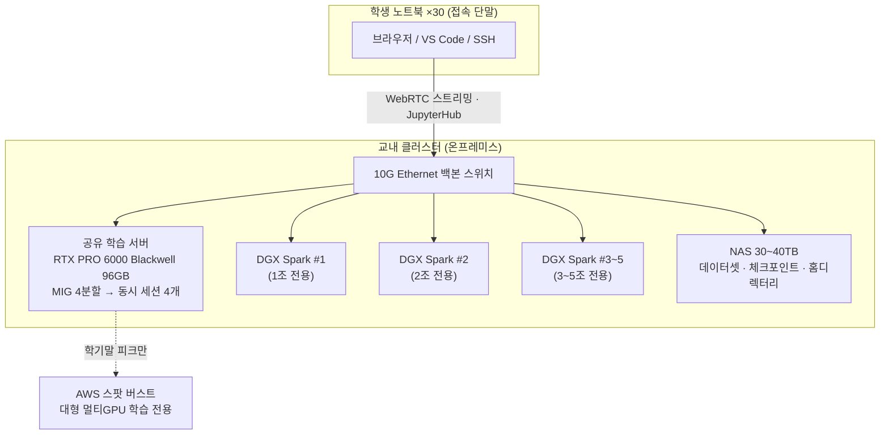
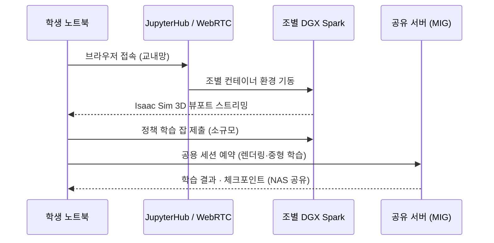

# 한성대 Physical AI 교육 클러스터 (HSU-PAC)

:material-circle-outline:{ style="color:#e0a800" } **계획중** · Hansung University Physical AI Cluster

!!! abstract "프로젝트 한눈에 보기"
    30명 규모(6인 × 5조) Physical AI 실습 교육을 위한 한성대 전용 GPU 클러스터.
    학생 노트북은 **접속 단말**로만 쓰고, 시뮬레이션·AI 학습 등 모든 GPU 연산은 교내
    클러스터가 수행하는 **서버 실행 + 씬클라이언트** 모델입니다. 상시 워크로드는
    온프레미스가 담당하고 학기말 대형 학습만 클라우드로 처리하는 **하이브리드 운영**으로,
    클라우드 전면 운영 대비 수년 운영 시 총비용을 큰 폭으로 절감하도록 설계했습니다.

---

## 왜 필요한가

Physical AI 교육의 핵심 도구인 NVIDIA Isaac Sim(로봇 시뮬레이터)과 로봇 파운데이션 모델
(GR00T 등)은 고사양 GPU를 요구합니다. 학생 개인 장비로는 실습 자체가 불가능합니다.

| 구분 | 학생 노트북 (RTX 4060 Laptop) | Isaac Sim 요구 사양 |
|---|---|---|
| GPU 메모리(VRAM) | 8GB | **최소 16GB, 권장 32GB+** |
| 판정 | :material-close-circle:{ style="color:#c62828" } 실행 불가 | — |

여기에 세 가지 제약이 더해집니다.

- **동시성** — 수업 시간에는 30명이 동시에 실습해야 하므로, 고성능 장비 1~2대로는 부족하고 "조별 전용 + 공용 풀"의 이중 구조가 필요합니다.
- **비용** — 클라우드 GPU를 학기 내내 상시 사용하면 비용이 누적되어 수년 운영 시 자체 구축 대비 크게 불리합니다. 반대로 학기말에만 필요한 대형 학습을 위해 고가 서버를 보유하면 가동률이 낮아 역시 비효율적입니다.
- **생태계** — 실습 도구(Isaac Sim/Isaac Lab · LeRobot · GR00T)가 모두 NVIDIA 생태계이므로, 공식 지원되는 플랫폼으로 구성해야 수업 중 호환성 문제를 피할 수 있습니다.

이 세 제약을 동시에 푸는 답이 **"조별 전용 소형 AI 노드 + 공유 학습 서버 + 클라우드 버스트"** 구조입니다.

## 시스템 아키텍처

### 구성 요소별 역할

=== "공유 학습 서버"

    **NVIDIA RTX PRO 6000 Blackwell 96GB × 1** (다중 GPU 확장형 섀시)

    - GPU 가상 분할(MIG)로 **24GB 인스턴스 4개**를 만들어 Isaac Sim 동시 세션 4개 제공 — 권장 사양(VRAM 24GB급)을 만족하는 독립 세션
    - RT 코어 탑재로 시뮬레이션 **렌더링**까지 담당 (연산 전용 데이터센터 GPU와의 차별점)
    - 공용 학습 큐, 교수 시연, 과제 채점용 예약제 운영
    - 섀시는 2~4 GPU 베이 확보 — 수강 확대 시 **GPU 증설만으로 처리량 2~4배**

=== "조별 노드 (DGX Spark ×5)"

    **NVIDIA DGX Spark** — GB10 Grace Blackwell, 128GB 통합 메모리, DGX OS

    - 조당 1대 **학기 내내 고정 배정** — 조별 Isaac Sim/Isaac Lab 실습, 데이터 전처리, 소규모 파인튜닝
    - Isaac Sim · Isaac Lab · GR00T 파인튜닝 **공식 지원 플랫폼** — 수업 중 호환성 리스크 최소화
    - 128GB 통합 메모리로 로봇 파운데이션 모델 로드 가능 — 조 단위 개발·디버깅에 최적
    - 대규모 고속 학습은 메모리 대역폭 한계로 부적합 → 공유 서버·클라우드로 위임 (역할 분담 설계)

=== "네트워크 · 스토리지"

    네트워크는 용도별로 **이원화**합니다 — 분산학습 트래픽이 접속망을 막지 않도록 하는 설계입니다.

    - **접속/관리망: 10G Ethernet 백본** — WebRTC 스트리밍, JupyterHub, NAS I/O 전용
    - **학습망: DGX Spark 내장 ConnectX-7 (200G RDMA) 직결 페어링** — 조별 분산학습 실습은 10G를 거치지 않음. 멀티노드 수요 실증 시 100G/200G RoCE 스위치 레이어 증설(로드맵)
    - **NAS 30~40TB (RAID)** — 학생 홈디렉터리(NFS), 공용 데이터셋, 스냅샷 백업
    - **UPS** — 서버·NAS 정전 보호
    - 전력 상시 3kW 이하 · 일반 냉방으로 충분 · 12U 랙 1개 — **기존 실습실에 그대로 수용, 전력 증설·항온항습 등 별도 시설 공사 불요** (H100급 클러스터 대비 숨은 공사비를 원천 제거한 설계)

=== "클라우드 버스트 (AWS)"

    - 학기말 프로젝트의 **대형 멀티GPU 학습만** 스팟 인스턴스로 처리
    - 데이터셋은 NAS→S3 동기화 스크립트로 이동, 학습 완료 후 자동 종료
    - 조별 예산 상한 부여로 비용 통제
    - 가동률 낮은 고가 학습 서버를 보유하지 않기 위한 **가성비 설계의 핵심 장치**

## 학생은 이렇게 사용합니다

1. 노트북 브라우저로 JupyterHub에 로그인 — 개인 설치 없이 즉시 실습 시작
2. 조별 Spark의 컨테이너 환경에서 코드 작성·시뮬레이션 실행, 3D 화면은 WebRTC로 스트리밍
3. 더 큰 렌더링·학습이 필요하면 공유 서버 MIG 세션을 예약제로 사용
4. 학기말 대형 학습은 정리된 잡을 클라우드로 버스트 — 결과는 NAS로 회수

## 소프트웨어 스택

| 계층 | 구성 | 비고 |
|---|---|---|
| 접속 | JupyterHub · SSH · VS Code Remote | 학생 계정별 격리 컨테이너 |
| 시뮬레이션 | Isaac Sim (WebRTC 스트리밍 모드) | 노트북 사양 무관 |
| 로봇 학습 | Isaac Lab · LeRobot · PyTorch · GR00T 파인튜닝 | 모방학습(ACT/디퓨전)·강화학습 |
| 미들웨어 | ROS 2 | 실물 로봇 연동 |
| 컨테이너 | Docker + NVIDIA Container Toolkit, NGC 이미지 | x86(서버)/aarch64(Spark) 이원 관리 — **이미지 태그가 곧 교재 버전** |
| 자원 관리 | 조 단위 고정 배정 + MIG 예약제 (1차) → Slurm (2차) | MIG로 VRAM 하드웨어 격리, 컨테이너별 CPU/RAM 쿼터(cgroup) — 특정 학생의 자원 독점 원천 차단 |
| 모니터링 | DCGM + Prometheus/Grafana | GPU 사용률·온도 대시보드 |

## 교육환경 3계층 구조

HSU-PAC(연산 계층)은 필요조건이고, 실물 로봇 계층을 보강해 **개발 파이프라인 완주형**
교육환경을 완성하는 것이 최종 그림입니다.

| 계층 | 구성 | 역할 | 상태 |
|---|---|---|---|
| 1계층 · 시뮬/연산 | HSU-PAC | 전원이 안전하게·병렬로 무제한 시행착오 | 계획 확정 |
| 2계층 · 실물 로봇 | 조별 로봇암 5세트(LeRobot 생태계, 리더+팔로워) + 공용 쿼드러페드/휴머노이드 1대 | sim-to-real 격차(마찰·지연·노이즈)를 실물로 체감·검증 | 보강 제안 |
| 3계층 · 클라우드 | AWS 스팟 | 학기말 대형 파인튜닝 피크 흡수 | 계획 확정 |

- 조별 로봇암은 조별 Spark와 **1:1 대응** — 조의 노드에서 학습한 정책을 조의 로봇에 배포하는 완결 루프
- 저가·부품 교체형 플랫폼 선택이 교육용으로 오히려 적합 — 학생이 부담 없이 실험하고 파손 시 부품 단위 수리

## 15주 커리큘럼 매핑

| 주차 | 내용 | 사용 계층 |
|---|---|---|
| 1~4주 | 로봇·시뮬 기초: ROS 2, USD/URDF, Isaac Sim 조작 | 1계층 |
| 5~8주 | 정책 학습: Isaac Lab 강화학습, 모방학습 개념, LeRobot 입문 | 1계층 |
| 9~11주 | 실물 데이터: 텔레오퍼레이션 수집 → ACT/디퓨전 정책 학습 | 2계층 + 1계층 |
| 12~13주 | sim-to-real: 시뮬 검증 정책의 실물 이전, 격차 분석 | 2계층 |
| 14~15주 | 심화·캡스톤: GR00T 파인튜닝, 공용 플랫폼 데모 | 3계층 + 전 계층 |

!!! tip "조달 리스크 완화"
    학기 전반(1~8주)은 시뮬레이션만 사용하므로, 실물 로봇(2계층)은 9주차 전 납품이면
    학기 운영에 지장이 없습니다.

## 운영 원칙

1. **교재의 컨테이너화** — 모든 실습을 NGC 기반 컨테이너 이미지로 배포. "내 환경에선 안 돼요"를 구조적으로 제거.
2. **조 단위 소유권** — 조당 Spark 1대 + 로봇암 1세트 고정 배정. 공유 자원 경합보다 단순하고, 장비에 대한 책임·애착이 학습 동기가 됨.
3. **인프라 자체가 교육** — 클러스터 모니터링·잡 스케줄링·이미지 빌드를 조교·학생 스태프가 담당 → 운영 부담을 줄이며 MLOps 역량 교육을 겸함.

## 추진 로드맵

| 단계 | 시점 | 내용 |
|---|---|---|
| Phase 1 | 예산 확정 후 ~6개월 | HSU-PAC 구축: 발주 → 납기 대기(장비 리드타임 2~4개월, 이 기간에 교재·계정 체계 선행 준비) → 설치 → 플랫폼 구성 → 동시 30접속 파일럿 → 정식 운영 |
| Phase 2 | 학기 중반 | 조별 로봇암 5세트 도입 — 파이프라인 완주형 커리큘럼 완성 |
| Phase 3 | 2년차 | 공용 고급 플랫폼(쿼드러페드/휴머노이드) 도입, 캡스톤·대외 시연 |
| Phase 4 | 2~3년차 | GPU 증설(수강 확대 대응), Spark 페어링 분산학습 실습, 타 학과 개방 검토 |

## 기대 효과

- **교육** — 30명 전원이 산업 표준 도구로 "시뮬레이션 → 정책 학습 → 실물 배포"의 전체 Physical AI 개발 파이프라인을 한 학기에 완주
- **재정** — 클라우드 전면 운영 대비 수년 운영 시 총비용 대폭 절감, 1회 시설비 + 소액 경상비의 예측 가능한 예산 구조
- **안정성** — 전용 자원으로 수업 시간 보장(클라우드 인스턴스 회수·기동 지연 리스크 제거), 교내 10G 스트리밍으로 지연 최소화
- **확장** — 방학·야간 유휴 시간 연구 활용, GPU 증설형 설계, 타 교과·타 학과 개방 여력
- **특성화** — Physical AI 전용 실습 환경을 보유한 대학으로서 학과 경쟁력·홍보 자산

## 자주 묻는 질문

??? question "학생이 따로 준비할 것이 있나요?"
    없습니다. 브라우저와 교내망 접속만 있으면 됩니다. 개발환경은 전부 서버 쪽 컨테이너로
    제공되며, 첫 수업에서 계정만 배부받으면 바로 실습을 시작합니다.

??? question "왜 클라우드로만 운영하지 않나요?"
    학기 내내 상시 사용하는 교육 워크로드는 종량제 클라우드에 매우 불리한 사용 패턴입니다.
    수년 운영 시 총비용이 자체 구축 대비 수 배가 되며, 수업 시간에 인스턴스 회수·기동 지연
    리스크도 있습니다. 반대로 학기말에만 필요한 대형 학습은 클라우드가 유리하므로, 그 부분만
    버스트로 처리하는 하이브리드가 최적입니다.

??? question "수강 인원이 늘어나면 어떻게 되나요?"
    공유 서버가 다중 GPU 확장형이므로 GPU 1장을 증설하면 동시 세션이 4→8개로 늘어납니다.
    조별 노드도 대수 추가만으로 선형 확장됩니다. 초기 구축을 다시 할 필요가 없습니다.

??? question "다른 수업·연구에도 쓸 수 있나요?"
    네. 수업 시간 외(야간·주말·방학)에는 연구용 학습 큐로 전환할 수 있고, 로드맵 Phase 4에서
    타 교과·타 학과 개방을 검토합니다.

---

`RTX PRO 6000` · `DGX Spark ×5` · `Isaac Sim` · `Isaac Lab` · `LeRobot` · `GR00T` · `MIG` · `JupyterHub` · `ROS 2` · `10G Ethernet` · `AWS Hybrid`

[:octicons-arrow-left-24: 프로젝트 목록으로](../projects.md)
