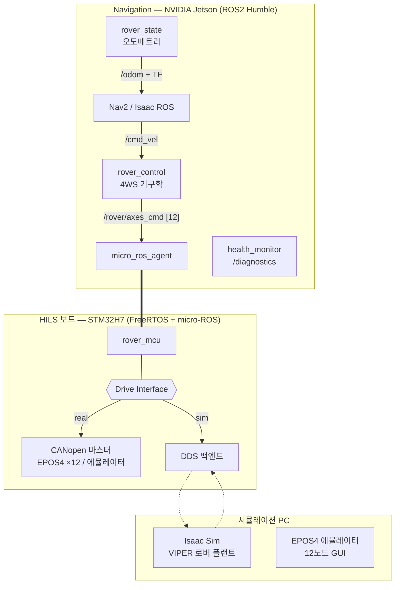

# 현대자동차 L-Project — 달 탐사 로버 12축 HILS 시스템

:material-circle:{ style="color:#2e9e44" } **진행중** · Hyundai Motor L-Project — Lunar Rover 12-Axis HILS Platform

!!! abstract "프로젝트 한눈에 보기"
    현대자동차 L-Project팀 과제로 개발 중인 **달 탐사 로버 구동계 HILS(Hardware-In-the-Loop
    Simulation) 시스템**입니다. 4륜 독립조향(4WS) + 액티브 서스펜션의 **12축 로버**를
    Navigation(NVIDIA Jetson) — HILS 보드(STM32H7, micro-ROS) — 시뮬레이션 PC(Isaac Sim)의
    3계층 폐루프로 검증합니다.

    실물 모터드라이버(maxon EPOS4 ×12) 없이도 동일한 CANopen 프로토콜로 개발·검증할 수
    있도록 **드라이버 에뮬레이터**를 자체 개발했으며, 실물과의 프로토콜 정합을 12축 전체
    자동 시험으로 유지합니다.

> **핵심 설계 원칙** — HILS 보드가 항상 루프 안에 있다. 실 구동/시뮬레이션 어느 모드든 Navigation의 명령은 보드의 Drive Interface 추상 계층을 거치므로, 제어 주기·안전 로직·인터페이스가 두 모드에서 동일하게 검증됩니다.

---

## 시스템 구성 — 3계층 XRCE-DDS 아키텍처

- **통신**: Ethernet Hub 단일망(UDP) — MCU는 XRCE-DDS(W5300 커스텀 UDP 전송), Linux 간은 Fast DDS
- **12축 계약**: 구동 4축(속도, PVM) + 조향 4축(±90°, PPM) + 서스펜션 4축(±30°, PPM)
- **4WS 기구학**: 스워브 정/역기구학(강체 최소자승) — 제자리 회전·crab 주행 지원
- **안전**: 계층별 워치독(Jetson·보드·드라이버) + 노드 헬스 모니터링(`/diagnostics` 표준)

## EPOS4 드라이버 에뮬레이터 — 실물 대체 검증 환경

maxon EPOS4 Compact 50/8의 CANopen 프로토콜(NMT/SDO/PDO/CiA402 상태머신/PVM/PPM/EMCY)을
12노드 전부 에뮬레이션하는 PySide6 GUI입니다. 실물 드라이버를 구매하지 않고도 마스터
소프트웨어(ROS2·STM32 펌웨어)를 동일 프로토콜로 검증합니다.

<figure markdown>
  { loading=lazy }
  <figcaption>12축 게이지 패널 — 구동(PVM, rpm)·조향/서스펜션(PPM, deg)의 Cmd/Act·트렌드·CiA402 상태·폴트 주입</figcaption>
</figure>

<figure markdown>
  { loading=lazy }
  <figcaption>수신 명령만으로 적분한 4WS 자세 — 휠별 조향각과 주행 궤적(직진 → 곡선 → 제자리 회전)</figcaption>
</figure>

## 검증 현황

| 시험 | 결과 |
|---|---|
| 에뮬레이터 프로토콜 자체 시험 (SDO/PDO/402/PPM/EMCY) | **20 PASS / 0 FAIL** |
| 12축 전체 프로토콜 시험 (실물 대체 판정) | **11 PASS / 0 FAIL** — 속도 1% 이내, 위치 ±1 count, 세트포인트 핸드셰이크 정확 |
| ROS2 12축 폐루프 (cmd_vel → 4WS → 플랜트 → /odom) | 명령 복원 오차 < 0.1% |
| 노드 헬스 모니터링 | 컴포넌트 강제 종료 시 3 s 내 원인 지목(ERROR) |
| 펌웨어 (FreeRTOS + micro-ROS + 12축 CANopen 마스터) | 빌드 461 KB, 3경로(mcu/can/sim) 시험 통과 |

## 기술 스택

`ROS2 Humble` · `micro-ROS (XRCE-DDS)` · `STM32H7 / FreeRTOS` · `CANopen (CiA 301/402)` ·
`Isaac Sim` · `Python / PySide6` · `4WS Kinematics` · `Jetson Orin`

## 저장소 · 문서

| 저장소 | 내용 | 접근 |
|---|---|---|
| `parclab-hsu/l-project-hils-ros2` | ROS2 패키지, 에뮬레이터, Isaac/Nav2 설정, 문서(SRS·SDP·아키텍처·시험 절차 15종) | 비공개 (승인제) |
| `parclab-hsu/l-project-hils` | STM32 펌웨어(로버 제어·캘리브레이션 지그·부트로더), PC 도구 | 비공개 (승인제) |

문서 체계: SRS(요구사항) · SDP(개발 계획) · AD(아키텍처) · TP(시험 절차) · DP(배포) ·
IG(연동 가이드) · AN(자산 분석) · RR(검토 보고) · OP(운용 정책) — 저장소 `docs/`에서 형상 관리.

---

[:octicons-arrow-left-24: 프로젝트 목록으로](../projects.md)
