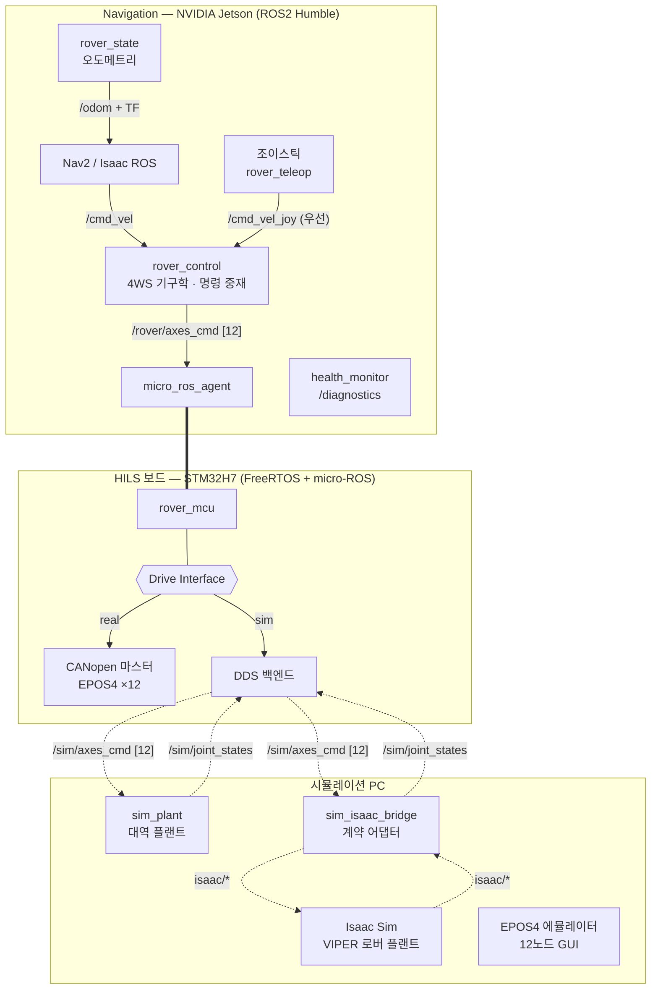
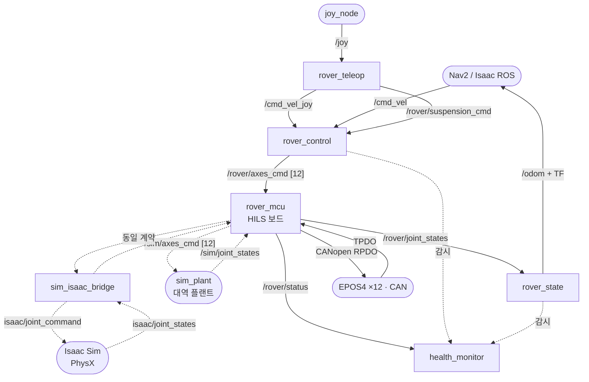
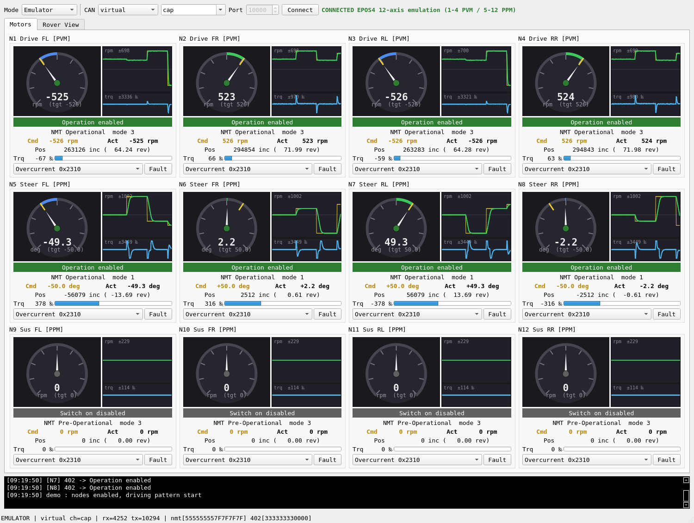
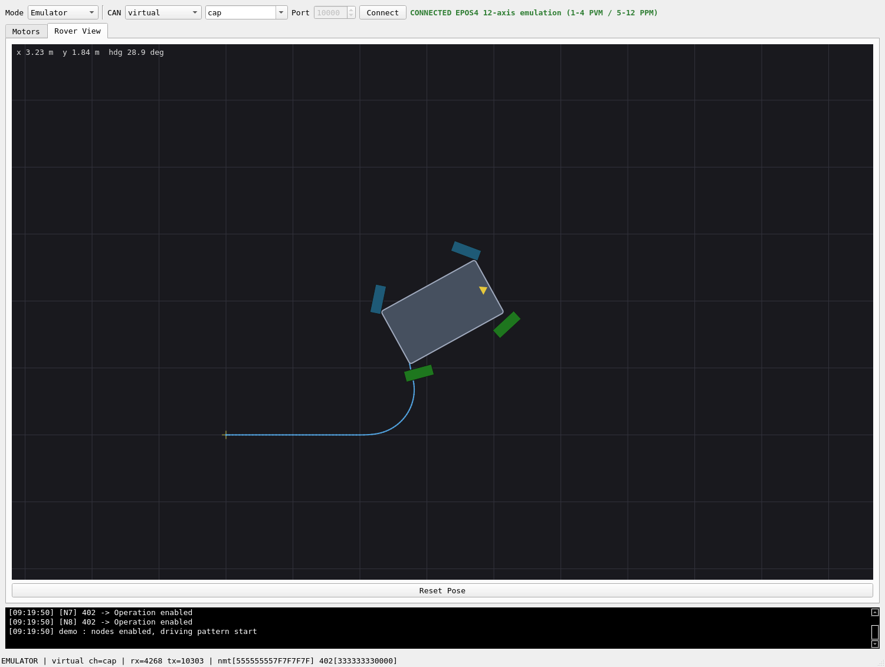

# 현대자동차 L-Project — 달 탐사 로버 12축 HILS 시스템

:material-circle:{ style="color:#2e9e44" } **진행중** · Hyundai Motor L-Project — Lunar Rover 12-Axis HILS Platform

!!! abstract "프로젝트 한눈에 보기"
    현대자동차 L-Project팀 과제로 개발 중인 **달 탐사 로버 구동계 HILS(Hardware-In-the-Loop
    Simulation) 시스템**입니다. 4륜 독립조향(4WS) + 액티브 서스펜션의 **12축 로버**를
    Navigation(NVIDIA Jetson) — HILS 보드(STM32H7, micro-ROS) — 시뮬레이션 PC(Isaac Sim)의
    3계층 폐루프로 검증합니다.

    실물 모터드라이버(maxon EPOS4 ×12) 없이도 CANopen 마스터 소프트웨어를 개발·검증할 수
    있도록 **드라이버 에뮬레이터**를 자체 개발했으며, EPOS4 펌웨어 사양서 기준의 프로토콜
    동작을 12축 자동 시험으로 확인합니다. 실물 드라이버의 전기적 특성·응답 타이밍 검증은
    이 시험 범위에 포함되지 않습니다.

!!! success "현재 상태 (2026-08-22) — 3계층 폐루프가 실기에서 성립"

    아래 본문의 시험 실적 표에는 **Isaac Sim 실행 전, 대역 노드로 검증하던 시점의 기록**이
    함께 남아 있습니다. 그 뒤 다음이 확인되었습니다.

    **Isaac Sim 실행 차단 해소** — GPU 드라이버 595.xx 분기의 Blackwell 결함이 원인이었고
    580.173.02-open 으로 내려 해결했습니다. 지형을 무한 평면에서 **월면토(OmniLRS lunaryard)**
    로 옮겼고, 자산의 질량 특성이 전부 플레이스홀더였던 것을 NASA VIPER 공개 제원(450 kg)
    참조로 채웠습니다 — **실측이 아닌 추정치이며 기구 제원 확정 시 교체 대상입니다.**

    **`rover_control → HILS 보드 → Isaac Sim → 보드 → rover_state` 폐루프가 값까지 일치합니다.**
    정상상태 구동 4축 `+2.318/+2.346/+2.332/+2.332` rad/s 대 시뮬레이터 실측
    `+2.319/+2.346/+2.333/+2.337`, `/cmd_vel` 0.5 m/s → `/odom` +0.465 m/s.
    Jetson 실기 배포와 조이패드 수동 주행까지 명령 경로 전 구간이 실기에서 동작합니다.

    **기구학 모델을 두 가지 정정했습니다.** 동위상·역위상 조향 모드를 지원하고, 기구학이
    무시하고 있던 **조향축 오프셋(스크럽 반경 0.1271 m)** 을 자산 실측으로 반영했습니다 —
    선회에서 조향각 최대 8.2°·휠 속도 9.3 % 어긋나고 있었고, **직진에서는 차이가 정확히 0**
    이라 직진 시험만으로는 드러나지 않는 종류였습니다. 선회 포락선도 로버 구속
    (휠 각속도 한계·횡가속 0.55 m/s²)에서 새로 유도했습니다.

    **아직 확인되지 않은 것** — 월면토 마찰을 명시 바인딩했으나 **슬립이 마찰로 설명되지
    않습니다**(계수를 80 % 올려도 측정값이 소수점까지 동일). 원인 규명 전까지 이 플랜트의
    주행·슬립 수치는 설계 입력으로 쓰지 않습니다. 실물 모터드라이버는 여전히 버스에 없으며,
    조종 패드 링크 두절 감지는 열린 안전 항목입니다.

    상세는 [SRS](l-project-srs.md) v1.17 · [SDP](l-project-sdp.md) v1.45 개정 이력을 참조하십시오.

> **핵심 설계 원칙** — HILS 보드가 항상 루프 안에 있다. 실 구동/시뮬레이션 어느 모드든 Navigation의 명령은 보드의 Drive Interface 추상 계층을 거치므로, 제어 주기·안전 로직·인터페이스를 두 모드에서 동일하게 검증할 수 있도록 설계했습니다. 3머신 통합 검증은 A6 시험으로 남아 있습니다.

<div class="grid cards" markdown>

-   :material-file-document-outline:{ .lg .middle } __SRS — 요구사항 명세서__

    ---

    IEEE 830 준용. 기능·비기능·인터페이스 요구사항 전체와 요구사항별 검증 상태.

    [:octicons-arrow-right-24: 전문 보기](l-project-srs.md)

-   :material-clipboard-text-outline:{ .lg .middle } __SDP — 개발 계획서__

    ---

    개발 환경·형상 관리·개발 단계(P/A/N)·위험 관리·검증 전략 및 시험 실적.

    [:octicons-arrow-right-24: 전문 보기](l-project-sdp.md)

-   :material-progress-check:{ .lg .middle } __중간 보고 (2026-08-22)__

    ---

    3계층 폐루프 성립·실기 배포·기구학 정정과 **아직 확인되지 않은 것**을 구분해 정리.

    [:octicons-arrow-right-24: 보고서 보기](l-project-interim.md)

</div>

---

## 목표 시스템 구성 — 3계층 XRCE-DDS 아키텍처



`rover_control`, `rover_state`, 보드의 Drive Interface와 `drv_sim` 경로는 구현되어 있습니다.
위 그림 전체를 Jetson·시뮬레이션 PC·보드로 연결하는 A6 시험과 실물 EPOS4 경로는 아직
완료되지 않았습니다.

- **통신**: Ethernet Hub 단일망(UDP) — MCU는 XRCE-DDS(W5300 커스텀 UDP 전송), Linux 간은 Fast DDS(도메인 통일)
- **12축 계약(v3)**: 구동 4축(속도, PVM) + 조향 4축(±90°, PPM) + 서스펜션 4축(±30°, PPM)
- **4WS 기구학**: 스워브 정/역기구학(강체 최소자승) — 제자리 회전·crab 주행 지원
- **주행 입력**: 자율(Nav2)과 수동(조이스틱) 이중 경로 — 수동이 자율을 선점
- **안전**: `rover_control`·보드 drive 계층 워치독 + 노드 헬스 모니터링. EPOS4 RPDO 타임아웃과 STO는 N5 실기 과제

### ROS2 노드·토픽 그래프

위 그림이 **어느 기계에서 무엇이 도는가**를 보여준다면, 아래는 기계 경계를 지우고 노드와
토픽의 연결만 남긴 그래프입니다. 실선이 실 구동(real), 점선이 시뮬레이션(sim) 경로입니다.



**플랜트는 둘 중 하나만 돕니다** — 대역 모델(`sim_plant`)과 Isaac Sim은 같은 `/sim/*` 계약을
갖는 대체 경로이고, `isaac/*`는 시뮬레이션 PC 안에서만 쓰이는 내부 토픽이라 보드와 Jetson은
존재를 모릅니다.

**모드 전환 지점은 HILS 보드 안**입니다 — Jetson 쪽 노드는 실 구동인지 시뮬레이션인지
구분하지 않고 같은 `/rover/*` 인터페이스만 봅니다. `health_monitor`는 구독만 하며 제어에
개입하지 않습니다. 지그 경로(`hils_bridge` → `/hils/*`)는 구동계와 독립이라 위 그래프에는
포함하지 않았습니다.

발행·구독 전체 매트릭스는 저장소 아키텍처 문서(AD-002 3a절)에 있습니다.

### 미들웨어 선택 — 왜 MCU는 XRCE-DDS인가

MCU에서 **완전 DDS(RTPS)를 직접 구동**하는 방안(Cyclone DDS의 FreeRTOS 포트, embeddedRTPS)을
검토한 뒤 기각하고, XRCE-DDS + 에이전트 구조를 확정했습니다. 판단 근거는 세 가지입니다.

| 관점 | 검토 결과 |
|---|---|
| **인터페이스** | 보드는 성능을 위해 W5300(하드웨어 TCP/IP 오프로드)을 쓰는데, DDS 스택이 요구하는 것은 BSD 소켓 시맨틱입니다. 두 요구는 한 칩에서 양립하지 않습니다 — 멀티캐스트 조인이 그룹당 하드웨어 소켓 하나를 소모하고(8개 중 4개 이미 사용), iovec `sendmsg`·`select()` 웨이트셋·`getifaddrs`가 없습니다. lwIP로 내려가면 시맨틱은 얻지만 오프로드가 사라져 W5300 채택 근거가 소멸합니다. |
| **자원** | micro-ROS 클라이언트 + rclc + FreeRTOS 전체가 **78 KB**(381 → 459 KB)인 반면, 디스커버리·QoS 매칭·히스토리 캐시를 갖춘 완전 RTPS 스택은 규모가 자릿수 단위로 다르고 공식 MCU 풋프린트가 공개되어 있지 않습니다. 현재 잔여 433 KB, RAM 77.7% 사용 중입니다. |
| **성능** | 실제 부하는 12축 명령·피드백을 50 Hz로 주고받는 **수십 KB/s** 수준이라 링크가 병목이 아닙니다. 오히려 RTPS의 주기적 디스커버리(SPDP/SEDP)와 QoS 매칭이 MCU와 링크 부하를 늘려, W5300을 채택한 목적과 상충합니다. |

> **이 결정은 선택지를 닫지 않습니다.** RMW 경계는 micro-ROS 에이전트이므로, Nav2 통합 과정에서
> CycloneDDS가 필요해지면 **에이전트와 Linux 노드의 RMW만 교체**하면 됩니다. 보드 펌웨어는 그대로입니다.

상세 근거와 재검토 조건은 아키텍처 문서(AD-002 5.2a절)에 결정 기록으로 남겨 두었습니다.

### 수동 주행 — 조이스틱 텔레옵과 명령 중재

자율 주행(Nav2)과 별개로 **조이스틱 수동 주행**을 지원합니다. 4WS 로버라 스워브 관례를 따라
**왼쪽 스틱은 병진(전후 + 게걸음), 오른쪽 스틱은 제자리 회전**에 대응하고, 버튼으로 서스펜션
자세 프리셋(level/lift/drop)을 함께 조작합니다.

**게걸음(crab) 주행** — 네 바퀴가 모두 같은 방향으로 90° 조향해 차체 방향을 유지한 채 옆으로
이동하는 기동입니다. 4WS 로버만 할 수 있고 비홀로노믹 자율 주행 스택은 명령하지 않으므로,
사실상 수동 주행에서만 쓰이는 능력입니다.

| 항목 | 설계 |
|---|---|
| **명령 중재** | 별도 mux 노드 없이 `rover_control` 한 곳에서 처리 — 기구학 소유자가 명령 입구도 소유합니다. 조이스틱 명령이 1초 내에 들어오면 자율 주행 명령을 버립니다. |
| **데드맨** | 지정 버튼을 **누르고 있는 동안에만** 주행 명령이 나갑니다. 손을 떼면 즉시 0을 발행합니다. |
| **복귀 정책** | 데드맨을 떼도 우선권은 유지해 정지 상태를 지키고, 자율 주행 복귀는 **별도 release 버튼으로 명시 반납**할 때만 일어납니다 — 장애물을 피하려 조종간을 잡았다가 손을 뗀 순간 자율 주행이 다시 모는 상황을 막기 위한 설계입니다. |
| **두절 대응** | 조이스틱·노드가 죽으면 명령 발행이 끊기고, 구동축 정지는 기존 워치독(0.5초)이 담당합니다. |

조종석은 로버와 같은 기계에 있을 필요가 없습니다 — 명령이 DDS 토픽으로 흐르므로 **별도 PC에서
원격 조종**할 수 있고, 이를 위한 추가 코드는 없습니다(조종석 전용 런치만 제공).

조종간은 **Xbox 무선 컨트롤러**로 정했습니다(2026-08-14). XInput 배치가 커널 `xpad` 드라이버로
그대로 노출되어 노드의 기본 축·버튼 번호를 손댈 필요가 없고, 데드맨을 계속 쥔 채 조작하는
운용 방식에 그립이 맞습니다. Jetson에 직접 붙일 때는 헤드리스 페어링을 피해 유선이나 전용
무선 동글을 권장하며, 블루투스로 붙이면 축·버튼 번호가 달라질 수 있어 실측 확인이 필요합니다.

한 가지 실무적인 함정도 절차서에 남겨 두었습니다 — 런치 기본값은 `/dev/input/js0`이지만 다른
HID 장치가 먼저 그 번호를 점유하면 패드가 `js1` 이후로 잡혀 아무 반응이 없는 것처럼 보입니다.
개발 PC에서 실제로 KVM 장치가 `js0`을 쓰고 있어, 장치 정체를 확인하는 방법과 `by-id` 고정 경로
사용법을 함께 기록했습니다.

검증은 **합성 조이스틱 입력**으로 자동화되어 있어 실물 패드 없이도 회귀 확인이 가능합니다
(`tools/test_teleop.py` — 5항목 전부 통과). 다만 이 시험의 범위는 **노드 로직(중재·데드맨·게걸음·
프리셋)** 까지이며, 실물 패드 인식·버튼 매핑·무선 지연은 컨트롤러 입고 후에 확인합니다.

### 시뮬레이터 연동 — 계약을 먼저 검증한다

시뮬레이션 PC의 플랜트는 대역 모델(`sim_plant`)에서 **Isaac Sim**으로 교체할 수 있습니다. 교체
조건은 `/sim/*` 토픽 계약 하나뿐이라 제어·펌웨어 쪽은 손대지 않습니다. 어댑터가 배열과
JointState를 오가며 **조인트 이름으로 필터·재정렬**하고, Isaac 쪽은 기본 OmniGraph 노드만 씁니다.

Isaac Sim 실행은 현재 개발 PC의 GPU 드라이버 문제로 대기 중입니다. 그래서 **거기에 막히지 않는
범위를 먼저 떼어 자동 검증**해 두었습니다 — Isaac 자리에 대역 노드를 세우고 계약만 시험하는
방식입니다(구동계 쪽에서 보드 대역 노드를 썼던 것과 같은 접근).

대역 노드는 시뮬레이터가 아닙니다. 물리도 접촉도 없고, 어댑터가 실제로 감당해야 하는 두 가지
성질만 재현합니다 — 피드백이 **USD 아티큘레이션 순서**로 나온다는 것, 그리고 **제어하지 않는
링키지 조인트가 함께 실려 온다**는 것입니다. 후자는 추측이 아니라 정식 USD 자산을 파싱해
실재를 확인한 뒤 재현했습니다.

이 시험에서 **12축 조인트명이 정식 USD에 전부 존재하는지**를 처음으로 자동 대조했습니다. 그동안
연동 문서에 "일치하는지 확인할 것"이라고만 적혀 있던 항목입니다.

!!! note "검증 범위"
    위 15항목은 **연동 계약 계층**까지입니다. Isaac Sim 구동, PhysX 물리와 지형 접촉·슬립,
    Action Graph 실제 배선, 조향 드라이브 추종 지연은 포함되지 않으며 시뮬레이터를 실제로
    띄운 뒤에 확인합니다.

---

## 저장소 구성

개발 자산은 **ROS2·도구·문서 저장소**와 **펌웨어 저장소** 두 개로 분리해 형상 관리합니다.
두 저장소 모두 **PRIVATE(승인제)** — 소유자가 초대·승인한 콜라보레이터만 접근합니다.

| 저장소 | 내용 | 규모 |
|---|---|---|
| `parclab-hsu/l-project-hils-ros2` | ROS2 패키지, EPOS4 에뮬레이터, Isaac/Nav2 설정, 배포 도구, 문서 17종 | 추적 파일 85개 · 커밋 70 (2026-08-14 기준) |
| `parclab-hsu/l-project-hils` | STM32 펌웨어 3종(로버 제어·캘리브레이션 지그·부트로더), PC 도구(GUI/로더) | 추적 파일 3,887개 (STM32Cube HAL 포함, 2026-08-14 기준) |

### ROS2 · 도구 저장소 (`l-project-hils-ros2`)

```
l-project-hils-ros2/
├── hils_rover_control/          # ROS2 패키지 — 구동 제어·상태·진단
│   ├── hils_rover_control/
│   │   ├── axes.py              #   12축 계약 단일 정의 (USD 조인트명·제원)
│   │   ├── kinematics.py        #   4WS 스워브 정/역기구학 (강체 최소자승)
│   │   ├── rover_control_node.py#   Twist → 12축 명령 + 워치독
│   │   ├── rover_state_node.py  #   JointState(12) → /odom + TF
│   │   ├── health_monitor_node.py#  토픽·노드·축 상태 → /diagnostics
│   │   ├── rover_teleop_node.py #   조이스틱 → /cmd_vel_joy (crab·서스 프리셋)
│   │   ├── epos_master.py       #   EPOS4 CANopen 마스터 (벤치용)
│   │   └── can_protocol.py      #   CANopen 프레임 헬퍼 (순수 함수)
│   ├── config/                  #   rover_params.yaml, nav2/nav2_params.yaml
│   └── launch/                  #   rover_control.launch.py, nav2_hils.launch.py
├── hils_bridge/                 # ROS2 패키지 — 캘리브레이션 지그 UDP 브리지
├── tools/
│   ├── epos_rover_emulator/     #   EPOS4 12노드 에뮬레이터 GUI (PySide6)
│   │   ├── lib/epos_node.py     #     CiA 301/402 노드 모델 (PVM·PPM·EMCY)
│   │   ├── lib/emu_core.py      #     버스·12노드 관리, 4WS 자세 적분
│   │   ├── ui/ui_main.py        #     12축 게이지·트렌드·로버 탑뷰
│   │   └── test_*.py            #     자체 시험 / SIL / 12축 프로토콜 시험
│   ├── epos_bench.py            #   실기 벤치 CLI (PVM 구동축)
│   ├── suspension_cmd.py        #   서스펜션 자세 프리셋 CLI (OP-001)
│   ├── test_teleop.py           #   조이스틱 텔레옵 자동 시험 (합성 /joy)
│   ├── sim_plant.py             #   시뮬레이터 대역 플랜트 (1차 지연, 50 Hz)
│   ├── isaac/                   #   Isaac Sim 브리지 어댑터
│   ├── jetson/ · simpc/         #   배포 스크립트 + systemd 유닛
│   └── systemd/                 #   vcan0 가상 CAN 영구화
├── config/dds/                  # Fast DDS/CycloneDDS 프로파일, 도메인 설정
└── docs/                        # 문서 17종 (아래 표)
```

### 펌웨어 저장소 (`l-project-hils`)

```
firmware/
├── hils-rover-fw/               # 로버 제어 펌웨어 (STM32H723, FreeRTOS)
│   └── src/ap/modules/
│       ├── drive/
│       │   ├── drive.c/.h       #   Drive Interface 추상 계층 + 12축 계약·제원 단일 정의
│       │   ├── drv_epos.c       #   백엔드 ① CANopen → EPOS4 ×12
│       │   └── drv_sim.c        #   백엔드 ② DDS → 시뮬레이션 PC
│       ├── epos/epos.cpp/.h     # CANopen 마스터 (12노드 PVM/PPM 혼합, PDO 재매핑)
│       └── micro_ros/
│           ├── rover_mcu.c      #   micro-ROS 노드 (/rover/* 토픽)
│           ├── uros_transport.c #   W5300 UDP 커스텀 XRCE 전송
│           └── microros_support.c
├── hils-fw/ · hils-boot/        # 캘리브레이션 지그 펌웨어 · 부트로더
└── stm32cube/                   # STM32H7 HAL (벤더 SDK)
software/
├── hils-gui/                    # 지그 운용 GUI (PySide6)
└── hils-loader/                 # 펌웨어 다운로더 (UDP/USB CDC)
```

### 개발 이력 — 주요 마일스톤

| 단계 | 내용 | 대표 커밋 |
|---|---|---|
| P2 | ROS2 구동 구조 설계 (제어·상태 노드, 기구학) | `811aa0c` |
| P4·P5 | EPOS4 프로토콜 3중 구현(ROS2·펌웨어·에뮬레이터) + SIL 검증 | `e989183` |
| P7 | 에뮬레이터 GUI 게이지·모니터 모드·트렌드 그래프 | `f833878` · `0ad2519` |
| A1~A4 | FreeRTOS+micro-ROS 골격 → W5300 UDP 전송 → Drive Interface 추상화 → drv_sim 백엔드 *(펌웨어)* | `d013e3d` · `7730dec` · `4e5394f` · `8ccaf54` |
| A5 | Jetson 노드 개편 (`/rover/*` 계약, rover_state 신설) | `1689cb3` |
| v3 | **12축 전면 개정** (4WS + 액티브 서스펜션, 전 계층 동시 개정) | `9c765c7` |
| B1·B2 | 에뮬레이터 12노드·PPM 지원, 시험 절차서 12축 개정 | `dd293d2` · `8a37c90` |
| QA | 전체 정합성 검토 → 흐름 검증 → 검토 보고서(RR-001) | `43d65f0` · `2c2f76d` · `421f240` |
| — | 노드 헬스 모니터링, 서스펜션 정책(OP-001), 벤치 에뮬레이터 프로토콜 시험 | `45b219f` · `d756c3e` · `7c08ce4` |

**개발 규칙** — 기능 단위 커밋(영문 요약 + 상세 불릿), `main` 단일 브랜치,
`build/`·`archive/` 등 산출물 제외, 문서와 코드를 같은 커밋에서 함께 갱신.

---

## 문서 체계

요구사항부터 운용 정책까지 문서 번호 체계로 관리하며, 코드 변경 시 관련 문서를 함께 개정합니다.

| 구분 | 문서 | 내용 |
|---|---|---|
| 요구사항 | **[SRS-001](l-project-srs.md)** | 소프트웨어 요구사항 명세서 (IEEE 830 준용) |
| 계획 | **[SDP-001](l-project-sdp.md)** | 소프트웨어 개발 계획서 |
| 설계 | AD-002 | 시스템 아키텍처 v2 — XRCE-DDS 3계층, Drive Interface, 헬스 모니터링 |
| 분석 | AN-001 | VIPER v4 USD 자산 분석 (제원 실측·조인트 계약) |
| 시험 | TP-001 / TP-002 | EPOS4 벤치 시험 절차 / 3머신 통합 시험 절차 |
| 배포 | DP-001 / DP-002 | Jetson 배포 절차 / 시뮬레이션 PC 배포 절차 |
| 연동 | IG-001 / IG-002 / IG-003 | Isaac Sim / Nav2 / NVIDIA Isaac ROS Navigation |
| 검토 | RR-001 | 검토 보고서 — 결함 11건 목록·수정·검증 및 재발 방지 |
| 운용 | OP-001 | 서스펜션 제어 정책 (운영자 프리셋·안전 규칙) |
| 공유 | SG-001 | 협력팀 대상 자료 공유 안내 — 문서 지도·재현 절차·검증 범위 |
| 공개 운영 | PG-001 | 홈페이지 공개 범위·갱신 절차·작성 규칙·게시 후 검증 |
| 인터페이스 | ND-001 | 노드별 파라미터·토픽과 데이터 필드별 의미(12축 인덱스·statusword·CANopen 프레임) |
| 운용 | OP-002 | 조이패드 원격 조종 — 패드 선정(Xbox 무선 컨트롤러)·조종석 구성·안전 규칙 |

---

## EPOS4 드라이버 에뮬레이터 — 소프트웨어 프로토콜 시험 환경

maxon EPOS4 Compact 50/8의 CANopen 프로토콜(NMT/SDO/PDO/CiA402 상태머신/PVM/PPM/EMCY)을
12노드 전부 에뮬레이션하는 PySide6 GUI입니다. 현재 자동 시험은 저장소의 PC 벤치 마스터와
에뮬레이터 사이의 프로토콜 일관성을 확인합니다. STM32 펌웨어와 에뮬레이터의 보드 포함 N2
시험, 실제 EPOS4 호환성 시험은 아직 완료되지 않았습니다.

<figure markdown>
  { loading=lazy }
  <figcaption>12축 게이지 패널 — 구동(PVM, rpm)·조향/서스펜션(PPM, deg)의 Cmd/Act·트렌드·CiA402 상태·폴트 주입</figcaption>
</figure>

<figure markdown>
  { loading=lazy }
  <figcaption>수신 명령만으로 적분한 4WS 자세 — 휠별 조향각과 주행 궤적(직진 → 곡선 → 제자리 회전)</figcaption>
</figure>

**대체 범위와 한계** — 12축 전체 자동 시험은 저장소 내 벤치 마스터와 에뮬레이터 사이의
프레임·상태머신·명령/피드백 동작을 확인합니다. 이는 EPOS4 사양서 기반의 소프트웨어
일관성 시험이며 실물 호환성 확정 시험은 아닙니다. 실제 모터 전류/토크 물리, 드라이버 튜닝,
STO 하드웨어, 실시간 타이밍은 에뮬레이터로 확인할 수 없으므로 위험 등록부에 명시하고,
실물 도입 시 원 벤치 절차(TP-001)를 재수행하도록 계획했습니다.

---

## 검증 현황

아래 결과는 저장소에 기록된 2026-08-04 기준 시험 실적입니다. 소프트웨어 시험 결과와
실기 검증 상태를 구분해 표시합니다.

| 시험 | 결과 |
|---|---|
| 에뮬레이터 프로토콜 자체 시험 (SDO/PDO/402/PPM/EMCY) | **20 PASS / 0 FAIL** |
| 12축 전체 프로토콜 시험 (벤치 마스터 ↔ 에뮬레이터) | **11 PASS / 0 FAIL** — 에뮬레이터 기준 속도 1% 이내, 위치 ±1 count |
| SIL — PC 벤치 EposMaster ↔ 에뮬레이터 | **ALL PASS** (4구동 벤치 + PPM 조향 수렴) |
| ROS2 12축 폐루프 (cmd_vel → 4WS → 플랜트 → /odom) | 명령 복원 오차 < 0.1% |
| 노드 헬스 모니터링 | 컴포넌트 강제 종료 시 3 s 내 원인 지목(ERROR) |
| 조이스틱 수동 주행 (합성 입력) | **5 PASS / 0 FAIL** — 자율 주행 선점, 게걸음 시 네 축 조향 90.0°, 데드맨 해제 시 정지 유지, 반납 후 자율 복귀 |
| 3머신 통합 시험 사전 리허설 (보드 대역) | **15 PASS / 0 FAIL** — 토픽 주기·형식, 4WS 전달과 `/odom` 복원, 두절 시 구동축만 정지·폴트 진단. 보드 자리는 Linux 대역 노드이며 펌웨어·통신은 범위 밖 |
| Nav2 자율 주행 스모크 (무맵 1단계) | **10 PASS / 0 FAIL** — 목표 (3.0, 1.0)에 오차 **0.12 m** 수렴·SUCCEEDED, 12축 경로 동작 |
| Isaac Sim 연동 계약 리허설 | **15 PASS / 0 FAIL** — 정식 USD에 12축 조인트명 전부 실재, 명령·피드백 양방향 변환, 역순·잡조인트 피드백에서 12조인트 복원(60.0 Hz), 폐루프 `/odom` 0.500·0.200, 게걸음 네 축 +90.0°. **Isaac 자리는 대역 노드이며 물리·접촉·슬립·GPU는 범위 밖** |
| 통합 회귀 시험 (`run_all_tests.sh`) | 위 시험 **7종 일괄 통과** (약 110초) — 인터프리터 자동 선택·잔존 노드 정리 포함 |
| 펌웨어 (FreeRTOS + micro-ROS + 12축 CANopen 마스터) | 2026-08-03 Arm GNU 13.3.Rel1 빌드 통과 — FLASH 461,460 B / 894 KB; 실기 HILS 검증은 A6 대기 |
| 3머신 A6 · 실물 EPOS4 · STO | **미실시** — 실물 드라이버 미구매, 전기·타이밍·안전 기능 검증 범위 밖 |

---

## 기술 스택

`ROS2 Humble` · `micro-ROS (XRCE-DDS)` · `STM32H7 / FreeRTOS` · `CANopen (CiA 301/402)` ·
`Isaac Sim` · `Python / PySide6` · `4WS Kinematics` · `Jetson Orin` · `Fast DDS` · `Nav2` · `Joy Teleop`

---

[:octicons-arrow-left-24: 프로젝트 목록으로](../projects.md){ .md-button }
[:octicons-file-16: SRS 전문](l-project-srs.md){ .md-button }
[:octicons-file-16: SDP 전문](l-project-sdp.md){ .md-button }
