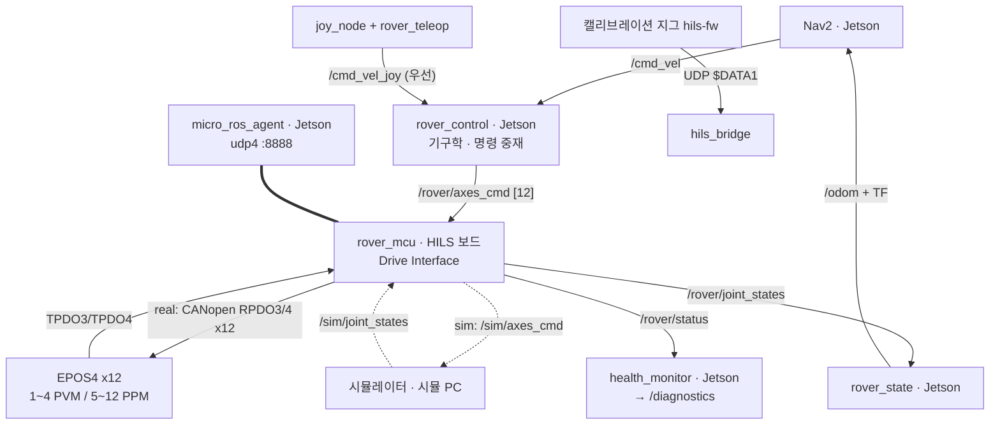

# SRS — 소프트웨어 요구사항 명세서 (LPJ-HILS-SRS-001)

!!! abstract "문서 정보"
    IEEE 830 준용. 12축 로버 HILS 시스템의 기능·비기능·인터페이스 요구사항 전체를 정의하며, 각 요구사항에는 검증 방법(I/T/D/A)과 현재 검증 상태가 부여되어 있습니다.

    이 페이지는 저장소 `l-project-hils-ros2`의 `docs/SRS.md`를 그대로 게재한 것입니다
    (저장소는 비공개·승인제이며, 본 문서는 연구 성과 공개용으로 발췌 없이 수록).
    상위 프로젝트 개요는 [현대차 L-Project 12축 HILS 시스템](l-project-hils.md)을 참조하세요.

---

**L-Project HILS 시스템 — 12축(4륜 독립조향 + 액티브 서스펜션) 로버 구동 제어 및 시뮬레이션 소프트웨어**

| 항목 | 내용 |
|---|---|
| 문서 번호 | LPJ-HILS-SRS-001 |
| 버전 | 1.20 |
| 작성일 | 2026-07-28 (개정 2026-08-04) |
| 과제 | 현대자동차 L-Project팀 과제 — HILS 시스템 개발 |
| 적용 표준 | IEEE 830 준용 |

**개정 이력**

| 버전 | 일자 | 내용 |
|---|---|---|
| 1.0 | 2026-07-28 | 최초 작성 |
| 1.1 | 2026-07-29 | 아키텍처 v2(LPJ-HILS-AD-002) 반영 — 3계층 토폴로지(Ethernet Hub/UDP), XRCE-DDS(micro-ROS), HILS 보드 Drive Interface 추상화, `/rover/*` 토픽 계약, 3.6절·5.3a절 신설 |
| 1.2 | 2026-07-30 | 최종 검토 반영 — SRS-FR-050~056 상태를 구현완료(A1~A5)로 갱신, 검토 결함 수정 반영(MCU DDS 도메인 42 명시, drive 계층 공통 명령 타임아웃 500ms — FR-055 충족), 제원 갱신 지점 전체 목록화(펌웨어 drive.h 단일 정의) |
| 1.3 | 2026-07-30 | **12축 개정(v3 계약)** — 실기 로버 = 4륜 독립조향+액티브 서스펜션(AN-001). `/rover/axes_cmd` 12ch, 4WS(swerve) 기구학, 펌웨어 EPOS 12노드 혼합모드(1-4 PVM/5-12 PPM), 제원 갱신(r0.213/트랙1.26/축거1.5). 8륜 스키드 계약·PC 직결 CAN 백엔드 폐지(벤치는 tools/epos_bench.py) |
| 1.4 | 2026-07-31 | 전체 검토 — 1.3에서 개정 이력만 반영되고 본문에 남아 있던 8륜/wheel_cmd 잔재를 12축 계약으로 전면 정합화 (2·3·5·6장, NF-004 FreeRTOS 반영, cmd 프로토콜 0x0031/0x0034 12축 페이로드) |
| 1.5 | 2026-07-31 | **노드 헬스 모니터링 신설** — health_monitor 노드(CSCI-10), 3.7절 SRS-FR-060~064, `/diagnostics` 인터페이스 (AD-002 v2.3 6a절 연계) |
| 1.6 | 2026-08-03 | **조이스틱 수동 주행 신설** — rover_teleop 노드(CSCI-11), 3.8절 SRS-FR-070~075, `/cmd_vel_joy` 우선권 중재, 4WS crab(linear.y) 지원 (FR-001 개정) |
| 1.7 | 2026-08-03 | 2.1절 구성도에 rover_teleop·health_monitor 반영, 노드·토픽 그래프(AD-002 3a) 참조 추가, 5.1절 `/hils/raw` 누락 보완 |
| 1.8 | 2026-08-04 | **검증 상태 용어 정의 추가**(3장 서두) 및 3.2절 검증 범위 명시 — CANopen 요구사항의 '검증완료'가 에뮬레이터 기준임을 분명히 하여 실물 검증으로 오독될 여지를 제거 |
| 1.9 | 2026-08-20 | 6장 제원 갱신 지점을 **4곳**으로 정정(D-17) — `rover_params.yaml`이 빠져 있었고 경로도 저장소 루트 기준으로 오해될 표기였다. 런치가 적재하는 yaml이 코드 상수를 덮어쓴다는 점 명시 |
| 1.10 | 2026-08-21 | 6장 정식 플랜트를 **`final_rover_HH`** 로 교체(AN-001 8절), 자산별 토픽 계약은 플랜트 프로파일이 담당함을 명시(AD-002 3d) |
| 1.11 | 2026-08-21 | 6장에 플랜트 **물리 특성** 정의 위치와 한계 명시 — `config/isaac/final_rover_HH_physics.yaml`(VIPER 참조 추정치, 실측 아님)·`tools/isaac/apply_asset_physics.py`. 지형·마찰 미반영이므로 주행 수치를 Nav2 근거로 쓰지 않는다 |
| 1.12 | 2026-08-22 | **FR-074 범위 정정과 FR-076 신설(안전 공백)** — 패드 링크 두절은 `autorepeat_rate` 때문에 `/cmd_vel_joy` 가 끊기지 않아 FR-005 워치독이 걸리지 않는다. FR-074 를 rover_teleop 프로세스 두절로 한정하고, 패드 링크 두절 감지를 FR-076 으로 분리해 **미구현**으로 등재했다. Jetson 실기 확인에서 드러났다 |
| 1.13 | 2026-08-22 | **FR-078 신설(구동 백엔드 런타임 전환)·FR-077 신설(조이 우선권 결함)** — 보드가 EPOS(CAN)로 부팅해 CAN 에 아무것도 없는 동안 HILS 를 못 돌리던 것을 `/rover/drive_mode` 토픽 전환으로 해결했고, 이로써 `rover_control → 보드 → Isaac → 보드 → rover_state` **폐루프가 값까지 성립함을 확인**했다. 같은 실기 확인에서 FR-072 우선권이 **데드맨을 놓아도 유지되어 `/cmd_vel` 을 영구 차단**함이 드러나 FR-077 로 분리했다 (RR-001 D-28) |
| 1.14 | 2026-08-22 | **FR-077 철회 — 신설 자체가 오진이었다.** 조이 우선권은 FR-072·FR-073 대로 정상 동작하며 Start 버튼으로 반납된다. 등재 근거였던 "`/cmd_vel` 영구 차단" 은 **문서에 있는 반납 조작을 수행하지 않은 채** 측정한 결과였다(RR-001 D-28 철회). FR-072 상태를 검증완료로 원복하고, FR-073 에 반납 동작과 실측 근거를 명시했다 |
| 1.15 | 2026-08-22 | **FR-079·FR-080 신설 — 동위상/역위상 조향 모드와 조종 배치 변경.** 조종간을 **왼쪽 = 방향 / 오른쪽 = 스로틀**로 바꾸고, 좌우 입력을 요레이트(역위상)로 읽을지 이동 방향각(동위상)으로 읽을지 X 버튼으로 전환한다. **기구학은 손대지 않았다** — 두 모드 모두 기존 `FourWheelSteering` 이 표현한다. 참조 코드 `VehicleKinematicsCode` 와 기본 식이 일치함을 확인했고, **조향축 오프셋(WHEELOFFSET) 보정이 우리 기구학에 없다**는 차이를 백로그로 등재했다 |
| 1.16 | 2026-08-22 | **조향축 오프셋(스크럽 반경 0.1271 m)을 기구학에 반영.** 참조 코드 `VehicleKinematicsCode` 의 WHEELOFFSET 에 해당하며, 기구 도면이 없어 `final_rover_HH` 자산의 조인트 좌표에서 실측했다. 조향각은 **조향축 위치**에서 정하고 휠 속도는 조향각만큼 돌아간 **휠 접지점**에서 다시 구한다. 직진·동위상은 결과가 같고, 선회에서 조향각 최대 8.2°·휠속도 9.3 % 달라진다. 6장 제원과 FR-007 에 반영했고, TP-002·ND-001·BRINGUP 의 기대값(cmd_vel 0.5/0.2 → 구동 [1.884, 3.026] · 조향 [0.359, 0.245])을 함께 갱신했다 |
| 1.17 | 2026-08-22 | **FR-081 신설 — 선회 포락선.** 참조 코드의 `Vr ≤ 0.339·Vl + 0.0205` 는 **쓰지 않는다** — 조향각이 제한된 애커먼 차량의 최소 선회반경 식이라 속도에 비례해 커지는데, 우리 로버는 조향 ±90°(자산 실측)라 최소 선회반경이 없고 포락선이 속도에 따라 **좁아진다**. 구속은 ① 휠 각속도 한계(저속에서 구속, 제자리 회전 2.07 rad/s) ② 횡가속 한계(중속에서 구속, 0.55 m/s² — 견인 μ 0.70×g 1.62 의 절반. 전도 한계 3.24 m/s² 보다 엄격하다). 6장에 무게중심 높이 0.3153 m 를 등재했다 |
| 1.18 | 2026-08-23 | **6장 제원을 정식 자산 `final_rover_HH` 실측으로 갱신하고 주요 치수표를 신설.** 종전 값은 **구 자산 viper_v4 에서 온 반올림값**이었고, 플랜트 교체(2026-08-20) 때 재측정이 누락돼 있었다(RR-001 D-34). 윤거 1.26 → **1.2867**(+2.1 %), 축거 1.50 → **1.4910**, 휠 반경 0.213 → **0.2133**. 전장·전폭·전고·지상고·서스펜션 암 길이를 표로 추가했다. 하류 기대값도 함께 갱신 — `cmd_vel(0.5, 0.2)` → 구동 `[1.868, 3.032]` · 조향 `[0.359, 0.242]` |
| 1.19 | 2026-08-24 | **FR-082 신설(URDF 는 자산에서 생성)·FR-006 서스펜션 한계 정정.** URDF 를 만들면서 대조하니 **서스펜션 클램프가 자산 조인트 한계보다 50 % 넓었다** — 계약 ±π/6(±30°) 인데 자산은 네 모서리 모두 **±0.35 rad(±20.05°)** 다. 주석에는 "(USD 조인트 한계)" 라고 적혀 있었으나 사실이 아니었다(RR-001 D-35). 최대 지령이 조인트 스톱을 밀고 있었고, 수직 스트로크도 0.245 m 가 아니라 **0.168 m** 다. 5장 축 배치와 6장 제원표도 함께 정정했다 |
| 1.20 | 2026-08-25 | **FR-076 구현·검증 — 안전 공백을 닫았다.** 판정 신호로 적어 두었던 「헤더 타임스탬프 정체」는 **실측으로 기각**했다(autorepeat 중에도 스탬프가 정상 갱신된다). 대신 **페이로드 정체**를 쓴다 — 같은 실측에서 111 표본의 axes·buttons 가 전부 bit-identical 이었다. `pad_link_timeout`(기본 2.0 s) 동안 한 비트도 안 바뀐 채 주행 지령이 나가면 구동을 세우고, 입력이 바뀌면 자동 해제한다. 알려진 오검출(스틱 끝까지 밀어 붙인 채 유지)을 명시했다. 회귀 `tools/test_pad_link_watchdog.py` 신설 |
| 1.18 | 2026-08-22 | **Navigation 머신 플랫폼 요건을 6장 설계 제약에 등재** — DP-001·IG-003 에만 있던 온보드 컴퓨터 전제(Orin 계열 + JetPack 6.x = Ubuntu 22.04)를 요구사항 쪽에 명시했다. Humble 이 22.04 를 요구하므로 **구형 Jetson Nano(JetPack 4.6.x = 18.04)는 제외**되며 Isaac ROS 지원 대상도 아니다. 무맵 1단계는 Orin Nano 8 GB 로도 되지만 비전 2단계는 Orin NX 16 GB 이상이다 |

---

## 1. 서론

### 1.1 목적

본 문서는 L-Project 12축 로버(4륜 독립조향 + 액티브 서스펜션)의 HILS(Hardware-In-the-Loop Simulation) 시스템을 구성하는
소프트웨어 전체(펌웨어, ROS2 노드, 시뮬레이션/모니터링 도구)의 요구사항을 정의한다.

### 1.2 범위

- Navigation 스택의 주행 명령(Twist)을 12축(구동 4·조향 4·서스펜션 4)으로 전달하는 실 구동/시뮬레이션 이중 경로
- maxon EPOS4 모터드라이버의 CANopen 제어 및 모터 상태(속도·토크·위치) 피드백 루프
- 모터드라이버 에뮬레이션 및 실 버스 모니터링 GUI
- 로봇 TCP 캘리브레이션 지그 측정 데이터의 ROS2 연동

### 1.3 용어 및 약어

| 용어 | 정의 |
|---|---|
| HILS | Hardware-In-the-Loop Simulation |
| TCP | Tool Center Point (로봇 툴 끝단 기준점) |
| PVM | Profile Velocity Mode (CiA 402 속도 프로파일 모드 — 구동축) |
| PPM | Profile Position Mode (CiA 402 위치 프로파일 모드 — 조향·서스펜션축) |
| 4WS | Four Wheel Steering — 4륜 독립조향(swerve) 구동 |
| SDO / PDO / NMT / EMCY | CANopen 서비스 (CiA 301) |
| RPDO3 / RPDO4 / TPDO3 / TPDO4 | 본 시스템에서 사용하는 PDO 채널 (5.3절) |
| SIL | Software-In-the-Loop |

### 1.4 참조 문서

- EPOS4 Firmware Specification (maxon, rel12772) — `Driver/EPOS4-Firmware-Specification-En.pdf`
- EPOS4 Compact 50/8 CAN Hardware Reference — `Driver/` 폴더
- CiA 301 V4.2, CiA 402 V4.0

---

## 2. 전체 시스템 개요

### 2.1 시스템 구성 (목표 아키텍처 v2 — 상세는 LPJ-HILS-AD-002)

Ethernet Hub 단일망(UDP)에 3노드: Navigation(NVIDIA Jetson, Humble), 시뮬레이션 PC(Ubuntu 22.04, Humble), HILS 보드(STM32H7, micro-ROS/XRCE-DDS). **HILS 보드가 Drive Interface 추상 계층을 소유**하여 실 구동(drv_epos: CANopen→EPOS4)과 시뮬레이션(drv_sim: DDS→시뮬 PC)을 백엔드 교체로 전환하고, Navigation은 모드와 무관하게 동일한 `/rover/*` 인터페이스를 본다.



노드·토픽 전체 연결(발행·구독 매트릭스 포함)은 **LPJ-HILS-AD-002 3a절**을 참조한다.

구 v1 구성(PC 직결 CAN 백엔드)은 12축 개정으로 폐지되었다 — 벤치 시험은 `tools/epos_bench.py`(EposMaster 단독 CLI, LPJ-HILS-TP-001 v1.1)로 수행한다.

### 2.2 소프트웨어 형상 항목 (CSCI)

| CSCI | 저장소/경로 | 언어/플랫폼 | 역할 |
|---|---|---|---|
| CSCI-1 rover_control | `hils_rover_control/` | Python/ROS2 Humble | Twist→12축 4WS 명령 분배 (real/sim 모드), 서스펜션 명령 병합 |
| CSCI-2 rover_state (구 sim_feedback) | `hils_rover_control/` | Python/ROS2 Humble | `/rover/joint_states`→4WS 정기구학→`/odom`+TF |
| CSCI-3 epos_master | `hils_rover_control/` | Python (python-can) | EPOS4 CANopen 마스터 |
| CSCI-4 hils_bridge | `hils_bridge/` | Python/ROS2 Humble | 지그 UDP 측정→ROS2 토픽 |
| CSCI-5 epos_rover_emulator | `tools/epos_rover_emulator/` | Python/PySide6 | EPOS4 12노드(PVM/PPM 혼합) 에뮬레이션·모니터링 GUI |
| CSCI-6 hils-rover-fw | `../l-project-hils/firmware/hils-rover-fw/` | C/C++ (STM32H723) | 온보드 CANopen 마스터 펌웨어 → v2에서 `rover_mcu`(micro-ROS)로 확장 |
| CSCI-7 hils-fw / hils-boot | `../l-project-hils/firmware/` | C/C++ (STM32H723) | 캘리브레이션 지그 펌웨어·부트로더 |
| CSCI-8 rover_mcu | CSCI-6 확장 | C (micro-ROS/FreeRTOS) | XRCE-DDS 노드 + Drive Interface 추상화 (drv_epos/drv_sim) — 구현완료(A1~A4) |
| CSCI-9 rover_state | — | — | CSCI-2로 병합 (A5에서 sim_feedback을 rover_state로 개명·일반화) |
| CSCI-10 health_monitor | `hils_rover_control/` | Python/ROS2 Humble | 노드·토픽·축 상태 헬스 모니터링 → `/diagnostics` |
| CSCI-11 rover_teleop | `hils_rover_control/` | Python/ROS2 Humble | 조이스틱 수동 주행 (`/joy` → `/cmd_vel_joy`, 서스펜션 프리셋) |

---

## 3. 기능 요구사항

표기: `SRS-FR-xxx`, 검증(V) — I: 검사, T: 시험, D: 시연, A: 분석

**상태 용어** — 무엇을 상대로 검증했는지를 구분한다:

| 상태 | 의미 |
|---|---|
| 검증완료 | 자동 시험으로 반복 확인됨. **대상이 실물이 아닌 경우 괄호로 명시**(예: 에뮬레이터 기준) |
| 구현완료 | 코드·빌드까지 완료. 해당 기능의 동작 시험은 아직 |
| 부분검증 | 일부 조건에서만 확인 (예: 8노드 구성) |

**실물 하드웨어(보드·EPOS4·센서)가 있어야 확인 가능한 항목은 어느 것도 '검증완료'가 아니다** —
현재 실물 검증 실적은 없으며, 하드웨어 입고 후 TP-001·TP-002로 수행한다(SDP 3.2·3.2b절).

### 3.1 주행 명령 처리 (CSCI-1)

| ID | 요구사항 | V | 상태 |
|---|---|---|---|
| SRS-FR-001 | `/cmd_vel`(geometry_msgs/Twist)을 구독하여 4WS(swerve) 역기구학으로 12축 명령(구동 rad/s ×4 + 조향 rad ×4 + 서스펜션 rad ×4)을 산출한다. 조향각은 ±π/2 랩(속도 부호 반전)하며, **linear.y(crab)를 지원**한다(자율 주행 소스는 0, 수동 주행에서만 사용) | T | 검증완료 |
| SRS-FR-002 | 구동 모드는 `real`(CAN 실 구동)과 `sim`(시뮬레이터 전달) 2종을 제공하며 런타임 파라미터로 전환 가능하다 | T | 검증완료 |
| SRS-FR-003 | `sim` 모드에서 12축 명령을 `/sim/axes_cmd`(Float64MultiArray×12)로 발행한다 | T | 검증완료 |
| SRS-FR-004 | `real` 모드에서 12축 명령을 `/rover/axes_cmd`로 HILS 보드에 전달한다 (rpm·counts 변환은 보드 drv_epos가 수행) | T | 검증완료 |
| SRS-FR-005 | cmd_vel이 `cmd_timeout`(기본 0.5s) 내 미수신 시 구동축(0~3) 명령만 0으로 강제한다 — 조향·서스펜션 각은 유지 (급정지 중 조향 복귀 금지) | T | 검증완료 |
| SRS-FR-006 | 구동 휠 속도는 `max_wheel_speed`로, 조향각은 **±π/2(±90°)**, 서스펜션각은 **±0.35 rad(±20.05°)** 로 제한(클램프)한다. 두 값 모두 **자산 조인트 한계 실측값**이며 클램프가 조인트 스톱을 넘지 않는다 | T | **검증완료** — `tools/test_urdf_contract.py` U4 |
| SRS-FR-007 | 기구학 파라미터(휠 반경, 트랙 폭, 축거, **조향축 오프셋**)는 ROS 파라미터로 설정 가능하다 (기본값은 `axes.py` 단일 정의) | I | 검증완료 |

### 3.2 EPOS4 CANopen 제어 (CSCI-3, CSCI-6)

> **검증 범위** — 본 절의 '검증완료'는 **PC 벤치 마스터 ↔ 자체 EPOS4 에뮬레이터** 기준이다.
> EPOS4 사양서에 따라 구현한 양측이 같은 프로토콜 해석을 공유하는지를 확인한 것이며,
> **STM32 펌웨어(`epos.cpp`) 실행이나 실물 EPOS4와의 전기·타이밍 호환성은 포함하지 않는다.**
> 실물 조합 검증은 N2(보드↔에뮬레이터 CAN)와 실물 도입 시 TP-001로 수행한다.

| ID | 요구사항 | V | 상태 |
|---|---|---|---|
| SRS-FR-010 | 노드 ID 1~12의 EPOS4를 축 역할별 모드로 설정한다 — 구동 1~4: PVM(0x6060=3), 조향 5~8·서스펜션 9~12: PPM(0x6060=1) | T | 검증완료 |
| SRS-FR-011 | TPDO4(0x480+id, statusword+실제속도)를 SDO로 활성화한다 | T | 검증완료 |
| SRS-FR-012 | 구동 노드는 TPDO3을 statusword+토크실제값(0x6077, 4바이트)으로 재매핑 후 활성화하고, 위치 노드는 기본 매핑(statusword+위치실제값, 6바이트)을 그대로 활성화한다. 수신 측은 프레임 길이로 구분한다 | T | 검증완료 |
| SRS-FR-013 | CiA 402 시동 시퀀스(Shutdown 0x06 → Enable 0x0F)를 statusword 확인 기반으로 수행하고, Fault 상태이면 Fault Reset(0x80)을 선행한다 | T | 검증완료 |
| SRS-FR-014 | 속도 명령은 RPDO4(0x500+id, controlword+목표속도[rpm]), 위치 명령은 RPDO3(0x400+id, controlword+목표위치[counts])으로 주기 전송한다 (펌웨어 10ms). PPM 세트포인트는 CW bit4 상승엣지+bit5(immediate)로 래치한다 | T | 검증완료 |
| SRS-FR-015 | SDO는 응답 타임아웃(100~200ms)과 재시도(3회)를 가지며, abort 수신 시 오류를 보고한다 | T | 검증완료 |
| SRS-FR-016 | EMCY 프레임 수신 시 오류 코드를 기록·보고한다 | T | 검증완료 |
| SRS-FR-017 | (펌웨어) TPDO 1초 무수신 노드는 offline 처리 후 재초기화한다 | T | 구현완료 |
| SRS-FR-018 | (펌웨어) PC와의 명령/피드백은 기존 cmd 프로토콜 ROVER 명령(0x0030~0x0034)으로 제공한다 | T | 구현완료 |

### 3.3 피드백 및 오도메트리 (CSCI-1, CSCI-2)

| ID | 요구사항 | V | 상태 |
|---|---|---|---|
| SRS-FR-020 | 모터 피드백은 `/rover/joint_states`(JointState 12조인트, USD 조인트명 — 구동: velocity·effort, 조향·서스: position)로 일원화하여 발행한다 | T | 검증완료 |
| SRS-FR-021 | joint_states(12조인트)를 구독해 4WS 강체 최소자승 정기구학(vx·vy·wz)으로 오도메트리를 적분한다 | T | 검증완료 |
| SRS-FR-022 | 오도메트리를 `/odom`(nav_msgs/Odometry)과 TF(odom→base_link)로 발행한다 (TF는 파라미터로 비활성화 가능) | T | 검증완료 |

### 3.4 모터드라이버 에뮬레이터 / 모니터 GUI (CSCI-5)

| ID | 요구사항 | V | 상태 |
|---|---|---|---|
| SRS-FR-030 | EPOS4 12노드의 NMT/SDO(expedited)/PDO(기본 매핑·재매핑·COB 활성화)/하트비트/EMCY를 에뮬레이션한다 | T | 검증완료 |
| SRS-FR-031 | CiA 402 상태머신과 모터 동역학(사다리꼴 프로파일+1차 지연, 토크 모델)을 모사한다. PPM은 세트포인트 핸드셰이크(CW bit4 래치→SW bit12 ack)와 프로파일 속도 제한 위치 루프를 모사한다 | T | 검증완료 |
| SRS-FR-032 | 노드별 인디케이터로 게이지(명령 마커+실제 바늘 — PVM: rpm, PPM: deg), Cmd/Act, 위치(inc·rev), 토크(‰), 축 역할·모드([PVM]/[PPM]) 라벨을 표시한다 | D | 검증완료 |
| SRS-FR-033 | 노드별 트렌드 그래프(rpm Cmd/Act, 토크, 10s 창, 자동 스케일)를 표시한다 | D | 검증완료 |
| SRS-FR-034 | GUI에서 폴트(과전류/저전압/과열) 주입이 가능하며 EMCY 송신·Fault 상태 천이를 수행한다 | T | 검증완료 |
| SRS-FR-035 | Emulator/Monitor 2개 모드를 제공한다. Monitor 모드는 실 버스를 수동 청취하여 마스터 명령(RPDO4)과 드라이버 피드백(TPDO1~4, EMCY, 하트비트)을 해석·표시한다 | D | 검증완료 |
| SRS-FR-036 | CAN 인터페이스로 socketcan(vcan/can), udp_multicast, virtual을 지원한다 | T | 검증완료 |
| SRS-FR-037 | 로버 탑뷰(4WS 최소자승 자세 적분, 휠별 조향각·상태 색상 표시)를 보조 탭으로 제공한다 | D | 검증완료 |

### 3.5 캘리브레이션 지그 연동 (CSCI-4, CSCI-7)

| ID | 요구사항 | V | 상태 |
|---|---|---|---|
| SRS-FR-040 | 지그의 UDP 측정 문장(`$DATA1,...*HH`, XOR 체크섬)을 수신·검증한다 | T | 검증완료 |
| SRS-FR-041 | 측정값을 `/hils/tcp_position`(PointStamped, m)과 `/hils/joint_state`(rad·m)로 발행한다 | T | 검증완료 |
| SRS-FR-042 | 체크섬 오류 문장은 폐기하고 스로틀된 경고를 출력하며, 무수신 시 주기 경고를 출력한다 | T | 검증완료 |

---

### 3.6 아키텍처 v2 — XRCE-DDS / Drive Interface (A1~A5 구현 완료, 실기 검증은 A6)

| ID | 요구사항 | V | 상태 |
|---|---|---|---|
| SRS-FR-050 | HILS 보드는 micro-ROS(XRCE-DDS) 클라이언트 노드 `rover_mcu`로 ROS2 그래프에 참여한다 | T | 구현완료(A1, 도메인 42) |
| SRS-FR-051 | XRCE 전송은 Ethernet Hub 경유 UDP(W5300 커스텀 전송)를 1차로, USB CDC 시리얼을 폴백으로 지원한다 | T | 구현완료(A2) |
| SRS-FR-052 | 보드는 Drive Interface 추상 계층을 통해 `drv_epos`(CANopen 실 구동)·`drv_sim`(DDS 시뮬 연동) 백엔드를 런타임 전환한다. 전환 시 정지 명령을 선행한다 | T | 구현완료(A3·A4) |
| SRS-FR-053 | 보드는 `/rover/axes_cmd`(12축)를 구독하고 `/rover/joint_states`(12조인트)·`/rover/status`(모드·402상태·EMCY)를 발행한다 | T | 구현완료(A1, 12축 개정) |
| SRS-FR-054 | Navigation은 구동 모드와 무관하게 동일한 `/rover/*`·`/odom` 인터페이스만 사용한다 (모드 비인지) | I | 구현완료(A5) |
| SRS-FR-055 | 보드는 XRCE 세션/에이전트 두절과 무관하게 로컬 명령 타임아웃(0.5s)으로 안전 정지를 보장한다 | T | 구현완료(drive 계층 공통) |
| SRS-FR-056 | Linux 노드는 전 머신 동일 RMW·`ROS_DOMAIN_ID`를 사용하며 설정 파일은 저장소로 형상 관리한다 | I | 구현완료(config/dds) |

### 3.7 노드 헬스 모니터링 (CSCI-10)

| ID | 요구사항 | V | 상태 |
|---|---|---|---|
| SRS-FR-060 | health_monitor는 모드별 필수 토픽(sim: `/sim/joint_states`·`/odom` / real: `/rover/joint_states`·`/rover/status`·`/odom`)의 수신 주기와 최종 수신 시각을 감시한다 | T | 검증완료 |
| SRS-FR-061 | 판정 규칙: 미수신 이력 STALE, 두절(기본 1s 초과) ERROR, 주기 저하(기대의 70% 미만) WARN, 그 외 OK. 문턱은 파라미터로 조정 가능하다 | T | 검증완료 |
| SRS-FR-062 | 필수 노드(rover_control, rover_state) 부재를 ERROR로 보고하고, real 모드에서는 `/rover/status`를 해석해 축별 402 Fault·EMCY를 ERROR, Operation-enabled 미달을 WARN으로 보고한다 | T | 검증완료(SIL — 합성 status로 Fault/EMCY 판정 확인, 실기는 TP-002 IT-1) |
| SRS-FR-063 | 진단 결과를 ROS2 표준 `/diagnostics`(DiagnosticArray, 기본 1Hz)로 발행하며, 종합 항목(`rover/system`)은 최악 레벨과 원인 목록을 포함한다 | T | 검증완료 |
| SRS-FR-064 | health_monitor는 제어 루프에 개입하지 않는다(감시·보고 전용) — 명령 경로 토픽은 정보성으로만 보고하고, 안전 정지는 FR-005/FR-055 워치독이 전담한다 | I | 검증완료 |

### 3.8 조이스틱 수동 주행 (CSCI-11)

| ID | 요구사항 | V | 상태 |
|---|---|---|---|
| SRS-FR-070 | rover_teleop은 `/joy`(sensor_msgs/Joy)를 구독해 스틱 입력을 Twist로 변환하고 `/cmd_vel_joy`로 발행한다. 좌스틱=병진(전후 + crab), 우스틱=제자리 회전이며 축·버튼 배치와 속도 스케일은 파라미터로 조정한다 | T | 검증완료 |
| SRS-FR-071 | **데드맨(enable) 버튼을 누르고 있는 동안에만** 주행 명령을 발행한다. 버튼을 떼면 즉시 0을 발행한다 | T | 검증완료 |
| SRS-FR-072 | rover_control은 `joy_priority_timeout`(기본 1s) 내에 `/cmd_vel_joy`를 수신하면 `/cmd_vel`(자율 주행)을 무시한다 — **수동 주행이 자율 주행을 선점**한다 | T | 검증완료 |
| SRS-FR-073 | 데드맨 해제 시 우선권을 유지하여 정지 상태를 지키고, 자율 주행 복귀는 release 버튼(Start, `button_release`=7)으로 명시적으로 반납할 때만 이루어진다 (손을 떼자마자 자율 주행이 재개되는 것을 방지). 반납 시 `rover_teleop` 은 `/cmd_vel_joy` **발행 자체를 멈추고**, `rover_control` 은 FR-072 타임아웃 만료 후 `/cmd_vel` 을 다시 받는다 | T | **검증완료 (2026-08-22 실기 실측)** — 반납 전 `/cmd_vel` 무시(로그 `cmd_vel ignored - joystick has priority`), Start 발행 후 `/cmd_vel_joy` 중단·`/cmd_vel` 0.5 m/s → `/rover/axes_cmd` 2.347 |
| SRS-FR-074 | **rover_teleop 프로세스** 두절 시 `/cmd_vel_joy` 발행이 끊기며, 구동축 정지는 FR-005 워치독이, 자율 주행 복귀는 FR-072 타임아웃이 담당한다 | A | 검증완료 (범위 한정 — 아래 FR-076 참조) |
| SRS-FR-076 | **패드 링크 두절**(절전·무선 단절·케이블 분리)을 감지해 구동축을 정지시킨다. 판정 신호는 **`/joy` 페이로드 정체**이며, 정지는 **주행 지령이 나가고 있을 때만** 건다. 입력이 하나라도 바뀌면 자동 해제된다 | T | **검증완료 (2026-08-25)** — `tools/test_pad_link_watchdog.py` |
| SRS-FR-075 | 버튼으로 서스펜션 프리셋(level/lift/drop)을 `/rover/suspension_cmd`로 발행한다 (OP-001 정책 준수, 상승 엣지에서만 1회) | T | 검증완료 |
| SRS-FR-078 | 보드는 `/rover/drive_mode`(std_msgs/UInt8, 0=EPOS·1=sim)를 구독해 **런타임에 구동 백엔드를 전환**한다. 범위를 벗어난 값과 현재 모드와 같은 값은 무시한다. 기본 부팅 모드는 EPOS 다 | T | 검증완료 |
| SRS-FR-079 | rover_teleop 은 **동위상(in-phase)·역위상(anti-phase) 조향 모드**를 지원한다. 역위상은 조종간 좌우를 **요레이트**로 읽어 앞뒤 바퀴를 반대로 꺾고(선회), 동위상은 **이동 방향각**으로 읽어 네 바퀴를 같은 각으로 꺾는다(자세 유지 사선 이동). 두 모드 모두 `FourWheelSteering` 이 이미 표현하며(각각 `angular_z`·`linear_y`) **기구학은 바뀌지 않는다** | T | **검증완료** — `tools/check_steer_modes.py` |
| SRS-FR-080 | 조종 배치는 **왼쪽 스틱 좌우 = 방향, 오른쪽 스틱 상하 = 스로틀**이다. 모드 전환은 X 버튼이며, 전환 즉시 명령을 0 으로 떨어뜨린다 — 같은 스틱 입력이 모드에 따라 회전과 사선 이동으로 전혀 다르게 해석되므로 이어가면 의도하지 않은 방향으로 튄다. 현재 모드는 `rover/steer_mode`(UInt8)로 낸다 | T | 검증완료 |
| SRS-FR-081 | rover_control 은 **선회 포락선**으로 요레이트를 제한한다 — ① 바깥쪽 휠이 `max_wheel_speed` 를 넘지 않을 것 ② 횡가속 `|v|·|wz|` 가 `lat_accel_limit` 를 넘지 않을 것. **축별 클램프보다 먼저** 적용해 강체 정합을 지킨다(클램프는 휠마다 따로 잘라 지령과 다른 운동을 만든다). 병진 속도는 줄이지 않고 요레이트만 줄이며, 정지 근처에서는 횡가속 조건이 구속하지 않아 제자리 회전이 막히지 않는다 | T | **검증완료** — `tools/check_turn_envelope.py`, 회귀 K7 |
| SRS-FR-082 | 로버 기술서(URDF)는 **정식 자산에서 생성**한다(`tools/isaac/make_rover_urdf.py`) — 손으로 관리하면 자산 교체 시 조용히 낡는다(D-34 가 그 사례다). 생성물은 12축 계약 조인트명·영점 기하·축 한계가 `axes.py` 와 일치해야 하며, **서스펜션 4절 링크는 URDF(트리)로 표현할 수 없어 루프를 끊는다** — 그 결과 RViz 에서 서스펜션 구동 시 휠이 함께 기우는 것은 시각화 한계이지 결함이 아니다 | T | **검증완료** — `check_urdf` + `tools/test_urdf_contract.py` |

> **FR-074 의 범위를 좁히고 FR-076 을 신설한 이유 (2026-08-22 실기 확인).**
> FR-074 는 원래 "조이스틱 **또는** rover_teleop 두절"을 한 항목으로 묶고 검증완료로 두었으나,
> **두 실패 모드는 다르고 하나만 덮여 있다.**
>
> - **rover_teleop 프로세스가 죽으면** `/cmd_vel_joy` 발행이 실제로 끊긴다 → FR-005 워치독이 동작한다. 검증된 것은 이쪽이다.
> - **패드 링크만 끊기면**(절전·무선 단절·케이블 분리) `joy_node` 는 살아 있고, 런치가 주는
>   `autorepeat_rate`(20 Hz) 때문에 **마지막 `/joy` 값을 계속 재발행한다.** rover_teleop 은 그것을
>   정상 입력으로 보고 `/cmd_vel_joy` 를 계속 낸다. **명령이 끊기지 않으므로 FR-005 워치독은 영원히
>   걸리지 않는다.** 데드맨을 쥔 채 끊기면 마지막 주행 명령이 무한 반복된다.
>
> `autorepeat_rate` 는 링크 지연에 대비해 의도적으로 넣은 값이라 그냥 끄면 다른 문제가 생긴다.
> 링크 생존을 명령 흐름과 **별개 신호로** 판정해야 한다.
>
> **구현 (2026-08-25).** 후보로 적어 두었던 **「헤더 타임스탬프 정체 감시」는 성립하지 않는다** —
> 실측하니 autorepeat 중에도 스탬프가 정상 갱신됐다(7.935 s / 7.935 s 벽시계). 그 자리에서
> 같이 잰 것이 답이었다: **페이로드가 111 표본 내내 bit-identical** 이었다. 살아 있는 아날로그
> 스틱은 LSB 가 흔들려 이렇게 되지 않는다.
>
> `rover_teleop` 이 `/joy` 의 `(axes, buttons)` 가 마지막으로 **바뀐** 시각을 들고 있다가,
> `pad_link_timeout`(기본 2.0 s) 동안 한 비트도 안 바뀐 채 **주행 지령이 나가고 있으면**
> 구동을 세운다. **굳었어도 지령이 0 이면 개입하지 않는다** — 아무 일도 안 일어나므로
> 정지시킬 이유가 없다. 입력이 하나라도 바뀌면 **자동 해제**된다.
>
> **알려진 오검출 하나.** 스틱을 **끝까지 밀어 붙인 채** 2 s 넘게 두면 raw 값이 상한에 고정돼
> bit-identical 이 되어 정지가 걸린다. 스틱을 조금만 움직이면 즉시 풀린다. 무한 폭주를 남겨
> 두는 것보다 이쪽이 낫다고 판단했다 — **정지는 되돌릴 수 있고 폭주는 되돌릴 수 없다.**
>
> 운용 규칙은 유지한다 — OP-002 2.4절(구동계 연결 시 유선 사용, 비상 정지 상비,
> **토픽이 흐르는 것을 조종이 살아 있다는 근거로 쓰지 않기**). 워치독은 마지막 방어선이지
> 첫 방어선이 아니다.

## 4. 비기능 요구사항

| ID | 요구사항 | V | 상태 |
|---|---|---|---|
| SRS-NF-001 | CAN 비트레이트 1 Mbit/s (EPOS4 기본값과 일치) | I | 검증완료 |
| SRS-NF-002 | 속도 명령 주기 ≥ 50 Hz (펌웨어 10ms 주기) | A | 구현완료 |
| SRS-NF-003 | 12노드 시동 시퀀스 완료 시간 ≤ 5 s (8노드 구성 실측 1.2 s — 12노드는 TP-002에서 실측) | T | 부분검증 |
| SRS-NF-004 | 펌웨어는 FreeRTOS 태스크 구조로 동작하며(A1), 기존 슈퍼루프 모듈은 저우선순위 태스크로 수용한다 | I | 구현완료 |
| SRS-NF-005 | 펌웨어 이미지 크기 ≤ 894 KB (앱 영역, micro-ROS 포함 실측 461 KB) | I | 검증완료 |
| SRS-NF-006 | 기존 코드베이스의 코딩 스타일(chcbaram C 스타일, hils-gui Qt 스타일)을 유지한다 | I | 검증완료 |

---

## 5. 인터페이스 요구사항

### 5.1 ROS2 토픽

| 토픽 | 타입 | 방향 | 단위 |
|---|---|---|---|
| `/cmd_vel` | geometry_msgs/Twist | 구독 | m/s, rad/s (자율 주행) |
| `/cmd_vel_joy` | geometry_msgs/Twist | 발행(teleop)·구독(control) | m/s, rad/s — linear.y(crab) 포함, `/cmd_vel`보다 우선 |
| `/joy` | sensor_msgs/Joy | 구독 (rover_teleop) | 축·버튼 |
| `/sim/axes_cmd` | std_msgs/Float64MultiArray[12] | 발행 | 구동 rad/s ×4 + 조향 rad ×4 + 서스 rad ×4 |
| `/sim/joint_states` | sensor_msgs/JointState (12조인트, USD 이름) | 구독 | rad/s·Nm(구동), rad(조향·서스) |
| `/rover/suspension_cmd` | std_msgs/Float64MultiArray[4] | 구독 | 서스펜션 rad |
| `/odom` | nav_msgs/Odometry (+TF) | 발행 | m, rad |
| `/hils/tcp_position` | geometry_msgs/PointStamped | 발행 | m |
| `/hils/joint_state` | sensor_msgs/JointState | 발행 | rad, m |
| `/hils/raw` | std_msgs/String | 발행 | 지그 원문 문장(디버그) |
| `/diagnostics` | diagnostic_msgs/DiagnosticArray | 발행 (health_monitor, 1 Hz) | 표준 진단 |

### 5.2 축 배치 (v3 계약 — 순서 FL, FR, RL, RR)

```
노드ID :  1~4  구동(drive)  PVM — 모터 rpm      (휠 반경 0.213 m, 감속비 15:1 가정)
          5~8  조향(steer)  PPM — 조인트 rad ±90°
          9~12 서스(sus)    PPM — 조인트 rad ±0.35 (±20.05°, 자산 실측)
축 인덱스: axes_cmd[0..3]=구동 rad/s, [4..7]=조향 rad, [8..11]=서스 rad
```

### 5.3 CANopen (EPOS4, CiA 301/402)

| 채널 | COB-ID | 내용 | 단위 |
|---|---|---|---|
| RPDO4 (구동) | 0x500+id | controlword(u16) + 목표속도(i32) | rpm |
| RPDO3 (위치축) | 0x400+id | controlword(u16) + 목표위치(i32, 0x607A) | counts |
| TPDO4 | 0x480+id | statusword(u16) + 실제속도(i32) | rpm |
| TPDO3 — 구동(재매핑) | 0x380+id | statusword(u16) + 토크(i16) — 4바이트 | 정격의 ‰ |
| TPDO3 — 위치축(기본) | 0x380+id | statusword(u16) + 실제위치(i32) — 6바이트 | counts |
| SDO | 0x600/0x580+id | expedited | — |
| NMT / EMCY / HB | 0x000 / 0x080+id / 0x700+id | CiA 301 표준 | — |

### 5.3a `/rover/*` 토픽 계약 (v2)

| 토픽 | 타입 | 발행→구독 | 주기 | QoS |
|---|---|---|---|---|
| `/rover/axes_cmd` | Float64MultiArray[12] (구동 rad/s + 조향·서스 rad) | rover_control→rover_mcu | 20~50 Hz | Best-effort, depth 1 |
| `/rover/joint_states` | JointState ×12 (USD 조인트명) | rover_mcu→rover_state 외 | 50 Hz | Best-effort, depth 1 |
| `/rover/status` | UInt16MultiArray[24] (sw ×12 + emcy ×12) | rover_mcu→health_monitor·진단 | 2 Hz | Reliable |

네트워크(제안): 192.168.10.0/24 — Jetson .10(agent :8888/udp), 시뮬 PC .20, HILS 보드 .30(W5300 정적 IP)

### 5.4 지그 측정 스트림 (UDP :9000)

`$DATA1,<posX>,<posY>,<posZ>,<degX>,<degY>,<mmZ>,*<HH>\n` — mm/deg, HH = `$`~`*` 구간 XOR

### 5.5 cmd 프로토콜 ROVER 명령 (펌웨어 ↔ PC, USB CDC 1Mbaud)

패킷: `[0x02][0xFD][type][cmd:2LE][err:2][len:2][data][cksum]`
| CMD | 이름 | 페이로드 |
|---|---|---|
| 0x0030 | INFO | resp `{u8 enable, u8 node_max, u8 ready_count}` |
| 0x0031 | AXES | `i32[12]` — 구동 모터 rpm ×4 + 조향·서스 조인트 mrad ×8 |
| 0x0032 | TWIST | `i32 mm/s, i32 mrad/s` (보드 내 4WS 변환) |
| 0x0033 | ENABLE | `u8` |
| 0x0034 | FEEDBACK | resp 12×`{u8 online, u8 state402, u16 sw, i32 vel_rpm, i32 pos_mrad, i16 torque‰, u16 emcy}` |

---

## 6. 설계 제약

- **로버 주요 치수 — `final_rover_HH` 자산 실측 (2026-08-23)**

| 항목 | 값 | 근거 |
|---|---|---|
| 전장 × 전폭 × 전고 | 1.918 × 1.440 × 0.581 m | 외형 bbox (휠 포함, 접지면 기준) |
| 윤거(트랙) | **1.2867 m** | 좌우 휠 중심 y ±0.643343 |
| 축거(휠베이스) | **1.4910 m** | 전후 휠 중심 x ±0.745500 |
| 휠 지름 / 반경 | **0.4267 / 0.2133 m** | 그라우저 팁. bbox 0.213339·접지면 0.213350 일치 |
| 휠 폭 | 0.159 m | |
| 차체 링크 | 1.775 × 1.020 × 0.453 m | 휠·서스 제외 |
| 지상고 | 0.213 m | 휠 중심 z − 접지면 z |
| 무게중심 높이 | 0.3153 m | 질량 분포 실측(총 450 kg) |
| 조향축 오프셋(스크럽 반경) | 0.1271 m | 킹핀 경사 10.0°, 캐스터 트레일 0 |
| 서스펜션 암 길이 | 0.247 m | 중립 6.71°, **±20.05° 에서 수직 +0.082/−0.086 m** (총 0.168) |

  **종전 값(r 0.213 · 트랙 1.26 · 축거 1.50)은 구 자산 `HSU_Rover_viper_v4` 의 반올림값이었다.**
  2026-08-20 에 정식 플랜트를 `final_rover_HH` 로 교체하면서 제원을 다시 재지 않아,
  기구학이 **쓰지 않는 자산의 치수**로 돌고 있었다(RR-001 D-34). 트랙이 2.1 % 어긋나
  선회에서 휠 속도 1.4 % 오차를 만들었고, **직진에서는 차이가 정확히 0** 이라 직진
  시험으로는 드러나지 않았다. **이 값들도 시뮬레이션 자산 기준이며 기구 도면 실측 대체 대상이다.**
  **조향축 오프셋(스크럽 반경) 0.1271 m** — `final_rover_HH` 자산 조인트 좌표 실측(2026-08-22).
  휠 접지점이 조향축 접지점보다 **바깥쪽**에 있어, 조향하면 휠이 조향축 둘레로 돈다.
  캐스터 트레일 0, 킹핀 경사 10.0°(기구학 미사용 — 차고·캠버 변화만 만든다).
  **합성 무게중심 높이 0.3153 m**(접지면 기준) — 자산 질량 분포 실측(총 450 kg, CG z 1.7503).
  전도 한계 `(t/2)/h = 1.998` → 횡가속 3.237 m/s²(달 중력 1.62). 견인 한계 μ·g = 1.134 m/s² 가
  더 엄격하므로 **선회 포락선의 횡가속 한계는 견인 기준 0.55 m/s²** 로 둔다(마찰 타원 절반 배분).
  기구 도면이 없어 자산 USD 에서 쟀다 — **이 자산이 시뮬레이션 기하의 정본이다.**
  **가정값(실측 필요)**:
  감속비 15:1, 정격토크 0.5 Nm, 위치축 65188.9 counts/rad (백로그 B3).
  갱신 지점(전체) **4곳**: ① 펌웨어 `drive.h`(단일 정의 — epos/rover_mcu가 참조)
  ② ROS2 `hils_rover_control/hils_rover_control/axes.py` ③ ROS2 파라미터
  `hils_rover_control/config/rover_params.yaml` — **`/rover_control`과 `/rover_state` 두 블록에
  각각 있다** ④ 에뮬레이터 `tools/epos_rover_emulator/lib/emu_core.py`.
  ③을 빠뜨리면 코드 상수만 바뀌고 **실행 중인 노드는 옛 제원 그대로 돈다** — 런치 3종
  (`rover_control`·`nav2_hils`·`teleop_remote`)이 모두 이 yaml을 적재하며, yaml 값이
  `axes.py` 기본값을 덮어쓴다. `tools/isaac/rover.urdf`(8륜)은 레거시 — **정식 플랜트는 `final_rover_HH` USD**
  (2026-08-21 채택, AN-001 8절). 구 `HSU_Rover_viper_v4` 도 레거시이며, 자산별 Isaac 토픽 계약은
  플랜트 프로파일 `config/isaac/<자산>.yaml` 로 지정한다(AD-002 3d절)
- 플랜트의 **물리 특성**(링크 질량·관성·중력·구동 드라이브)은 위 기구 제원과 별개로
  `config/isaac/final_rover_HH_physics.yaml` 에 있고 `tools/isaac/apply_asset_physics.py` 로
  자산에 반영한다. **현재 값은 NASA VIPER 공개 제원(총질량 450 kg)을 참조한 추정치이며 실측이
  아니다** — 기구팀 제원이 오면 이 yaml 만 교체한다. 기구학(위 4곳)과 달리 이 값들은 ROS2
  소프트웨어 동작에 직접 들어가지 않지만, **시뮬레이션 주행 결과의 대표성을 좌우한다.**
  달 지형·마찰은 아직 미반영이므로(IG-001 2e, D-24) 이 플랜트의 주행·슬립 수치를 Nav2
  파라미터 근거로 쓰지 않는다
- **Navigation 머신 플랫폼 요건** — Nav2·`rover_control`·`rover_state`·micro-ROS 에이전트가
  올라가는 온보드 컴퓨터는 **NVIDIA Jetson Orin 계열 + JetPack 6.x(Ubuntu 22.04)** 를 전제한다.
  ROS 2 Humble 이 Ubuntu 22.04 배포판을 요구하기 때문이며, JetPack 5.x(20.04)는 네이티브 설치가
  불가해 컨테이너 대안이 필요하다(DP-001 부록 B). **구형 Jetson Nano(Maxwell, JetPack 4.6.x =
  Ubuntu 18.04)는 제외한다** — Humble 네이티브 설치가 불가하고 Isaac ROS(cuVSLAM·nvblox) 지원
  대상도 아니라 IG-003 2단계 경로가 성립하지 않는다. 무맵 1단계(IG-002)는 Orin Nano 8 GB 로도
  되지만, 카메라 인지를 얹는 2단계는 **Orin NX 16 GB 이상(AGX Orin 권장)** 이다(IG-003 2절)
- EPOS4 측 모터/센서 튜닝은 EPOS Studio에서 별도 수행·저장(0x1010) 전제
- CAN 종단저항: 버스 양 끝 노드 DIP7 ON
- 개발 PC ufw가 UDP 멀티캐스트를 차단 → 프로세스 간 테스트는 vcan(socketcan) 사용


---

[:octicons-arrow-left-24: 프로젝트 개요로](l-project-hils.md){ .md-button }
[:octicons-file-16: SDP (개발 계획서) 보기](l-project-sdp.md){ .md-button }
