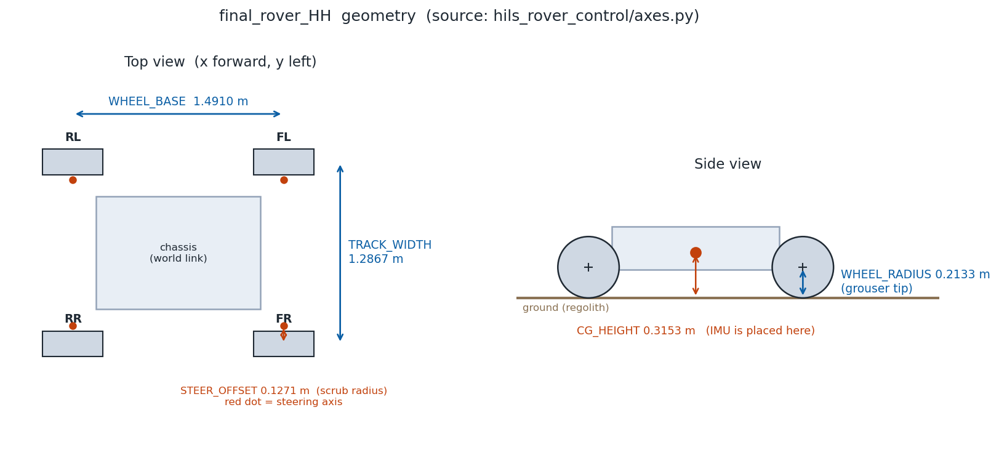
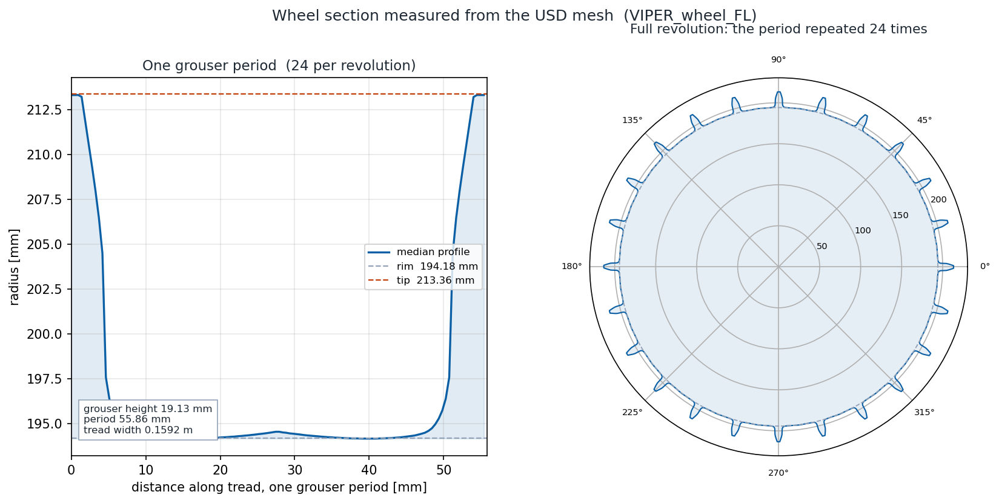
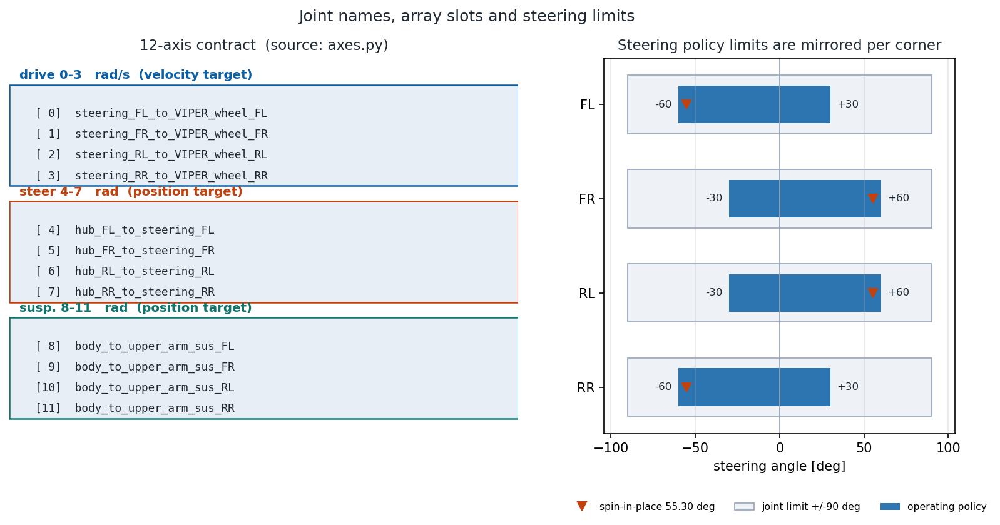

# 달 탐사 로버 USD 자산 매뉴얼 { #usd }

:material-circle:{ style="color:#2e9e44" } **기술 매뉴얼** · 현대자동차 L-Project · 기준일 **2026-09-29** (최초 2026-09-22)

!!! abstract "목적 및 적용 범위"
    NVIDIA Isaac Sim + OmniLRS 환경에서 사용하는 `final_rover_HH` USD 자산의 구성,
    설정 파일, 재생성 절차 및 검증 기준을 설명합니다. 자산을 변경하거나 플랜트 설정을
    점검하는 개발자와 시험 담당자를 대상으로 합니다.

    실행 시 적용되는 설정은 **자산·물리·마찰·장면의 네 계층**으로 구성됩니다.
    변경할 항목의 기준 파일을 먼저 확인하고, 자산 생성 → 물리 설정 적용 → 런타임 설정
    확인 → 동작 검증 순서로 진행하십시오.

    수치는 **자산에서 추출한 값**, **설정값**, **시뮬레이션 측정값**, **계산 추정값**을
    구분하여 제시합니다. 본 문서의 시뮬레이션 결과는 실제 로버 하드웨어의 검증 결과가 아닙니다.

**문서 사용 순서**

1. 처음 사용하는 경우: 1~2절에서 자산 구조와 설정 파일을 확인합니다.
2. 제원과 제어 인터페이스를 확인하는 경우: 3~6절을 참조합니다.
3. 접촉·지형·암석 설정을 변경하는 경우: 7~9절을 참조합니다.
4. 자산을 재생성하는 경우: 10절의 절차와 완료 기준을 따릅니다.
5. 시험 결과를 해석하는 경우: 11절의 미확정 항목과 검증 범위를 함께 확인합니다.

---

## 1. 자산 구조 { #1 }

```text
World0.usd                      defaultPrim /World · Z-up · metersPerUnit 1.0
└ /World/Rover_hyundai          ← SubUSDs/Rover_hyundai.usd 참조
  └ world                       ← ArticulationRoot
    ├ IMU_sensor/…/Imu_Sensor   IsaacImuSensor
    └ stereo_camera/…           Camera
SubUSDs/  Rover_hyundai{,_base,_physics,_robot,_sensor}.usd · IMU_sensor.usd · stereo_camera.usd
```

로버의 articulation root 링크 이름은 `world`입니다. 단위는 m, 상향축은 Z입니다.
원본 구조의 2026-08-20 분석에서는 revolute joint **24개**, drive 보유 조인트 **20개**가
보고되었습니다. 2026-09-29 정식 플랜트의 합성 stage에서 확인한 drive 보유 조인트는
**12개**입니다(6절). 두 기록은 검사 시점과 대상이 다르므로, 현재 파일을 점검할 때는
파일 경로와 버전을 기록하고 합성 stage의 조인트 구성을 확인하십시오.

OmniLRS용 자산은 생성기가 `World0.usd`를 참조하여 만든
`Rover_hyundai_omnilrs.usd`입니다. 원본에 직접 변경 사항을 누적하지 않고,
생성된 자산에 필요한 override를 적용합니다. 센서 배치와 Action Graph 등 반복 적용할
변경은 생성기에 반영해야 재생성 후에도 유지됩니다.

---

## 2. 설정 계층 및 기준 파일 { #2 }

아래 경로는 `l-project-hils-ros2` 저장소 기준입니다. 자산 경로는 실제 설치 위치를 사용합니다.

| 계층 | 기준 파일 | 설정 대상 | 적용 시점 |
|---|---|---|---|
| 자산 | `final_rover_HH/Rover_hyundai_omnilrs.usd` | 링크·조인트·메시·센서 배치·Action Graph | 자산 생성 |
| 물리 | `config/isaac/final_rover_HH_physics.yaml` | 중력·질량·관성·구동 drive | 자산 파일에 기록 |
| 마찰 | `config/isaac/lunar_regolith_friction.yaml` | 접촉 재질·material binding | 런타임 |
| 장면 | `config/isaac/lunaryard_lproject.yaml` | 지형·로봇 배치·변형·wheel tracks·암석 | 런타임 |

물리 설정은 `tools/isaac/apply_asset_physics.py`로 적용하며, 자산을 재생성한 뒤에는
다시 적용해야 합니다. 마찰과 장면 설정은 실행 중인 stage에 적용됩니다.
절차적으로 생성되는 지형은 프림이 교체될 수 있으므로 material binding의 상속 관계도
확인해야 합니다(7절).

ROS 2 bridge 설정은 `config/isaac/final_rover_HH.yaml`에서 관리합니다.
이 파일은 12축 명령 배열과 자산 Action Graph의 토픽을 연결합니다.

---

## 3. 기하 제원 및 센서 배치 { #3 }



| 항목 | 값 | 적용 기준 |
|---|---|---|
| 휠 반경 | **0.2133 m** | grouser tip 기준 |
| Track width | **1.2867 m** | 좌우 휠 중심 간 거리 |
| Wheelbase | **1.4910 m** | 전후 휠 중심 간 거리 |
| Scrub radius | **0.1271 m** | 조향축 오프셋, 바깥쪽이 양수 |
| 기준 무게중심 높이 | **0.3153 m** | 접지면 기준, IMU 배치에 사용하는 기준값 |
| 총질량 | **450.0 kg** | 참조 제원 기반 설정값, 링크별 배분은 6절 |

4WS 역기구학에서는 조향각을 **조향축 위치**에서 계산하고, 휠 속도는 조향 후의
**휠 접지점 위치**에서 계산합니다. Scrub radius를 생략한 계산과 비교하면 기존 분석
조건에서 조향각 최대 **8.2°**, 휠 속도 **9.3 %**의 차이가 보고되었습니다.

IMU는 기존 지붕 위치(접지면 위 **0.579 m**)에서 기준 무게중심 높이로 이동했습니다.
이는 기준점과 센서 사이의 lever arm에 따른 회전 가속도 성분을 줄이기 위한 배치입니다.
질량 분포를 변경한 경우에는 자동 계산된 실제 모델의 무게중심과 IMU 위치를 다시
대조하십시오. 고정된 배치 높이가 모든 자세와 질량 조건의 무게중심을 보장하지는 않습니다.

---

## 4. 휠 단면 및 추출 기준 { #4 }



| 항목 | 자산 메시에서 추출한 값 |
|---|---|
| Grouser tip 반경 | **213.36 mm** |
| Rim 반경 | **194.18 mm** |
| Grouser 높이 | **19.13 mm** |
| Grouser 수 | **24** |
| Wheel track 주기 | **55.86 mm** |
| Tread 폭 | **0.1592 m** |

왼쪽 도식은 grouser 한 주기, 오른쪽 도식은 해당 주기를 24회 배치한 단면입니다.
고해상도 wheel tracks는 이 단면과 휠의 회전 위상을 사용하여 생성합니다.

!!! warning "단면 추출 시 표본 밀도 확인"
    메시 정점만으로 반경을 계산하면 넓은 면 내부의 표본이 누락됩니다. 기존 분석에서는
    이 방식으로 grouser 높이가 약 **90 mm**로 과대 추정되었습니다. 단면 추출 시에는
    외측 삼각형 내부를 추가 sampling한 뒤 bin별 최대 반경을 계산하십시오.
    현재 추출 방식은 bounding box의 가장 얇은 축을 차축으로 사용하므로, 휠 형상이
    변경되면 축 선택 결과도 확인해야 합니다.

!!! note "참조 자산과의 구분"
    프로젝트에서 참조한 NASA VIPER 제원의 grouser 높이는 **26 mm**입니다.
    본 자산 메시에서 추출한 **19.13 mm**와 구분하여 사용하십시오. 메시 추출값은
    실제 제작 휠의 치수 측정값을 의미하지 않습니다.

---

## 5. 12축 인터페이스 및 운용 한계 { #5-12 }



제어 인터페이스는 **구동 4축 + 조향 4축 + 서스펜션 4축**으로 구성됩니다.
각 축군의 코너 순서는 **FL → FR → RL → RR**입니다. 제어기·bridge·시뮬레이터의
조인트 이름과 배열 순서를 일치시키십시오. 이름이 일치하지 않으면 해당 축에 명령이
전달되지 않을 수 있으므로 명령과 피드백을 축별로 대조해야 합니다.

조향 한계는 다음 두 기준을 별도로 적용합니다.

- **자산 joint limit:** ±90°.
- **운용 한계:** FL·RR은 −60°~+30°, FR·RL은 −30°~+60°.

제자리 회전의 기준 조향각은 kingpin(조향축) 위치에서 계산한 **55.30°**입니다.
휠 중심 위치에서 계산한 **49.21°**와는 scrub radius 때문에 차이가 있습니다.
서스펜션 joint limit은 **±0.35 rad(±20.05°)**, 구동 휠 각속도 한계는 **10.0 rad/s**입니다.

---

## 6. 물리 설정 및 joint drive { #6 }

### 6.1 중력·질량·관성

| 항목 | 설정값 | 적용 기준 |
|---|---|---|
| 중력 | **1.62 m/s², −Z** | 달 중력 명시 적용 |
| 관성 텐서 | **자동 계산** | `diagonalInertia = (0,0,0)` |
| 무게중심 | **자동 계산** | `centerOfMass = (-inf,-inf,-inf)` |
| 차체 ×1 | **302.0 kg/링크** | 섀시·전장·페이로드 |
| 휠 ×4 | **12.0 kg/링크** | 휠·구동 액추에이터 |
| 조향 너클 ×4 | **6.0 kg/링크** | 조향부 |
| 허브 ×4 | **5.0 kg/링크** | 허브 |
| 상부 서스펜션 암 ×4 | **8.0 kg/링크** | 상부 암 |
| 하부 서스펜션 암 ×4 | **6.0 kg/링크** | 4절 링크의 종동 링크 |
| 구동 drive stiffness | **0.0** | 속도 제어에서 위치 복원 항 제거 |

총질량은 `302 + 4 × (12 + 6 + 5 + 8 + 6) = 450 kg`입니다.
링크별 질량은 참조 제원에 따른 **추정 배분**이며, 이동계 합계는 **148 kg(약 33 %)**입니다.
실제 질량 자료를 확보하면 기준 YAML을 갱신하고 물리 설정을 재적용하십시오.

!!! warning "자동 계산 sentinel과 명시값 구분"
    관성 `(0,0,0)`과 무게중심 `(-inf,-inf,-inf)`는 자동 계산을 위한 sentinel입니다.
    초기 자산의 21개 강체에는 질량 1~2 kg과 관성 `(1e-4,1e-4,1e-4)`가 명시되어
    있었으며, 중력은 기본값 **9.81 m/s²**가 적용되는 상태였습니다.
    이들 초기 설정과 구동 위치 복원 항은 기존 구동 이상 분석에서 수정 대상이었습니다.
    재생성 후에는 합성 stage와 런타임의 최종 적용값을 확인하십시오.

자동 계산 후 보고된 휠 축방향 관성은 **0.403 kg·m²**입니다.
비교 모델인 solid disk **0.272 kg·m²**와 thin drum **0.544 kg·m²** 사이의 값이지만,
이 비교만으로 실제 휠의 관성이 검증된 것은 아닙니다.
자동 계산 속성의 정의는 [OpenUSD MassAPI](https://openusd.org/dev/api/class_usd_physics_mass_a_p_i.html)를 참조하십시오.

### 6.2 Drive gain 및 단위 { #2026-09-29 }

아래 값은 **2026-09-29 합성 stage에서 확인한 12개 angular drive**의 설정입니다.
하부 암 `under_arm_sus_*`에는 drive가 없습니다.

| 축군 | stiffness | damping | maxForce | 제어 목표 |
|---|---|---|---|---|
| 구동 ×4 | **0.0** | **20.0** | FL 1.0e6 · 나머지 1.0e14 | 속도 |
| 조향 ×4 | **50.0** | **20.0** | FL 1.0e4 · 나머지 1.0e5 | 위치 |
| 서스펜션 ×4 | **50.0** | **20.0** | 네 축 모두 1.0e3 | 위치 |

<span id="stiffness-damping"></span>

회전축의 force drive는 다음 PD 관계로 설명할 수 있습니다. 각도와 gain의 단위를
동일한 기준으로 변환하여 사용하십시오.

```text
τ = kp × (목표각 − 현재각) + kd × (목표각속도 − 현재각속도)
τ = clamp(τ, −maxForce, +maxForce)
```

| 속성 | 의미 | 회전축 단위 |
|---|---|---|
| stiffness | 위치 오차에 대한 비례 gain | N·m/deg(USD) → N·m/rad(엔진) |
| damping | 각속도 오차에 대한 비례 gain | N·m/(deg/s)(USD) → N·m/(rad/s)(엔진) |
| maxForce | 토크 포화 한계 | N·m |

USD의 degree 기준 gain을 radian 기준으로 변환할 때는 **180/π**를 곱합니다.
따라서 stiffness 50은 **kp 2864.79**, damping 20은 **kd 1145.92**에 해당합니다.
단위 정의는 [NVIDIA UsdPhysics 문서](https://docs.omniverse.nvidia.com/kit/docs/omni_physics/107.3/dev_guide/schemas/usdphysics.html)를 참조하십시오.

- **구동축:** stiffness를 0으로 설정하여 위치 복원 항을 제거합니다. 초기값 10은
  radian 기준 kp **572.96**에 해당하며, 목표 위치가 0인 경우 속도 명령과 동시에
  원점 복원 토크를 발생시킵니다. damping 20은 속도 추종 gain으로 유지합니다.
- **조향·서스펜션:** stiffness와 damping을 함께 사용하여 목표 각도 추종과 감쇠를 설정합니다.

`kd/kp = 20/50 = 0.400 s`는 관성 항을 무시한 1차 근사에서의 시간 상수입니다.
실제 응답은 유효 관성, 접촉, joint constraint 및 물리 시간 간격의 영향을 받으므로
이 값을 측정된 응답 시간으로 사용하지 마십시오. 감쇠비를 산정하려면 런타임에서
확인한 유효 관성을 사용해야 합니다.

### 6.3 토크 한계 및 응답 추정 { #_1 }

비교 조건은 균등 코너 하중 **182.25 N**(450 × 1.62 ÷ 4), 정지 마찰계수 **0.90**,
휠 반경 **0.2133 m**, scrub radius **0.1271 m**, 서스펜션 lever arm **0.4908 m**입니다.

| 축군 | 계산 추정값 | 해석 범위 |
|---|---|---|
| 구동 | `J/kd ≈ 0.352 ms` | 관성 0.403 kg·m²의 단일 축 연속시간 근사 |
| 구동 | 마찰 토크 약 **35.0 N·m**, FL maxForce 대비 약 **28,582배** | 단순 마찰 한계와 설정 상한의 비 |
| 조향 | 저항 토크 약 **20.8 N·m**, FL maxForce 대비 약 **480배** | `μ × N × scrub radius`에 의한 개략 추정 |
| 서스펜션 | 상부 암 토크 약 **50.3 N·m**, maxForce 대비 약 **19.9배** | 기존 하중 환산 조건에서의 비교 |

이 비율은 실제 액추에이터의 안전율이나 동적 토크 여유가 아닙니다.
구동 응답은 지령·피드백·물리 시간 간격을 함께 측정하고, 조향 저항은 접촉면 비틀림 등을
포함하여 확인하십시오. 착지·경사·페이로드 변경 시험에서는 서스펜션 토크와 포화 여부를
별도로 기록해야 합니다.

!!! warning "코너별 maxForce 비대칭"
    FL과 나머지 코너의 maxForce는 조향에서 **10배**, 구동에서 **1e8배** 차이가 있습니다.
    설정 차이의 의도는 확인되지 않았습니다. 단순 정적 추정에서 상한이 충분히 크더라도
    모든 운용 조건에서 영향이 없다고 단정할 수 없습니다. 값을 변경할 경우 근거와
    전후 비교 결과를 기록하십시오.

---

## 7. 마찰계수 및 material binding { #7 }

| 항목 | 설정값 | 모델링 근거 |
|---|---|---|
| 정지 마찰계수 | **0.90** | tan(42°) 근사, 첨두 내부 마찰각 참조 |
| 운동 마찰계수 | **0.70** | tan(35°) 근사, 잔류·한계상태 참조 |
| 반발계수 | **0.0** | 비탄성 접촉 가정 |

현재 설정은 월면토의 내부 마찰각을 참조한 **유효 접촉계수**입니다.
토양 내부 전단과 강체 접촉의 마찰계수는 동일한 물성이 아니므로, 실제 휠–토양 접촉을
재현하는 계수로 사용하려면 별도 교정이 필요합니다.

**적용 및 점검 절차**

1. 휠의 physics material을 해당 링크 내부에 정의합니다. 로버 subtree만 참조하는
   합성 과정에서 외부 material 경로가 누락되지 않도록 합니다.
2. 지형 material은 메시의 부모 `Xform`에 binding합니다. 지형 메시가 재생성되어도
   상속이 유지되는지 확인합니다.
3. 실행 중인 stage에서 binding 경로와 최종 resolved material을 확인합니다.
   설정 파일의 계수만 변경한 것으로 적용 여부를 판단하지 마십시오.

!!! note "기존 비교 시험의 해석"
    동일 조건에서 정지/운동 마찰계수 `0.50/0.50`과 `0.90/0.70`을 비교한 슬립은
    각각 **49.0 %**, **49.1 %**였습니다. 해당 시험에서는 변화가 작았으나,
    이 결과만으로 슬립 원인을 확정하거나 마찰의 영향을 일반적으로 배제할 수 없습니다.

---

## 8. 지형 변형 및 wheel tracks { #8 }

현재 구성에서는 다음 두 표현 방식을 동시에 사용하지 않습니다.

| 방식 | 구성 | 적용 범위 |
|---|---|---|
| DEM 변형 | **0.05 m** 격자의 높이 갱신 | 기본 지형 변형 표현 |
| 고해상도 track tiles | 휠 주변 **1 m** 타일, 표본 간격 **1.49 cm** | 메시 단면과 회전 위상 기반 wheel tracks |

Track tiles를 활성화하면 DEM 변형 경로의 설정은 사용되지 않습니다.
고해상도 자국은 **render-only**이며 collision mesh를 변경하지 않습니다.
이는 collision mesh recooking 과정에서 관찰된 물리 step 정지를 회피하기 위한 구성입니다.

자국 깊이는 채택한 근사 모델에서 하중의 **W^(2/3)**에 비례하도록 설정됩니다.
하중은 서스펜션 joint torque로 환산합니다. 4절 평행링크의 하부 암이 전달하는 힘을
상부 암 토크만으로 모두 관측할 수 없으므로, 기존 시뮬레이션 교정 계수 **1.78**을
사용합니다. 보고된 산포는 **±18 %**입니다. 기구 형상이나 질량을 변경하면 다시 교정하십시오.
상세 조건과 모델 한계는 [지형 변형 분석](l-project-deformation.md)을 참조하십시오.

---

## 9. 암석 충돌 설정 및 검증 { #9 }

기존 시뮬레이션에서는 암석 메시의 `CollisionAPI`와 `MeshCollisionAPI`가 활성화되어
있어도 `PointInstancer` 배치에서 로버가 암석을 통과했습니다. 개별 프림 생성 방식으로
변경한 뒤 충돌에 의한 이동 제한이 확인되었습니다. 이는 **해당 프로젝트 환경의 관찰 결과**이며,
모든 PhysX 버전의 `PointInstancer` 동작으로 일반화하지 않습니다.

`config/isaac/lunaryard_lproject.yaml`의 암석 배치 설정을 확인하십시오.

```yaml
use_point_instancer: False
class: rock
```

**검증 절차**

1. 합성 stage에서 암석 collider의 존재와 활성화 상태를 확인합니다.
2. 암석 배치·로버 시작 위치·지령·시험 시간을 동일하게 유지하여 배치 방식을 비교합니다.
3. 실제 이동 거리와 무슬립 이론 거리(`지령 각속도 × 휠 반경 × 시뮬레이션 시간`)의
   비율을 기록합니다. 접촉 상태와 궤적을 함께 확인하여 다른 이동 제한 요인과 구분합니다.
4. RTF(시뮬레이션 시간 / 실제 경과 시간)와 물리 step 정지 여부를 기록합니다.

| 기존 시험의 배치 방식 | 이론 거리 대비 이동 비율 | 관찰 결과 |
|---|---|---|
| PointInstancer | **0.84** | 암석 통과 |
| 개별 프림 | 0.55 · 0.70 · **0.09** | 충돌에 따른 이동 제한; 지령 2.339 rad/s 조건에서 이동 3 cm 사례 |

동일 비교에서 RTF는 **0.4993 → 0.4953**, 약 **0.8 % 감소**했으며 물리 step 정지는
관찰되지 않았습니다. 이 수치는 해당 장면의 결과로, 암석 수와 배치가 다른 환경의 성능을 보장하지 않습니다.

!!! warning "검증 대상"
    소스 코드의 collider 생성 호출 유무만으로 충돌 설정을 판단하지 마십시오.
    collider가 자산에 이미 정의되어 있을 수 있습니다. 코드·합성 자산·런타임 접촉 결과를
    함께 확인해야 하며, 성능 변화가 없다는 사실만으로 기능 적용 여부를 판단할 수 없습니다.

---

## 10. 자산 재생성 및 적용 절차 { #10 }

### 10.1 준비 사항

- Isaac Sim Python 환경과 원본 `World0.usd` 및 참조 `SubUSDs/`에 대한 접근을 준비합니다.
- 원본 자산 버전, 생성기 버전, 물리·마찰·장면 설정 버전을 기록합니다.
- 기존 출력 USD와 보고서를 보존하고, 원본과 다른 출력 경로를 지정합니다.
- 아래 명령은 `l-project-hils-ros2` 저장소 루트에서 실행합니다. 경로는 설치 환경에 맞게 바꿉니다.

### 10.2 OmniLRS용 USD 생성

다음은 Isaac Sim이 설치된 Linux 환경의 Bash 예시입니다.

```bash
ISAAC_PYTHON=/path/to/isaac-sim/python.sh
SOURCE_USD=/path/to/final_rover_HH/World0.usd
OUTPUT_USD=/path/to/final_rover_HH/Rover_hyundai_omnilrs.usd

"$ISAAC_PYTHON" tools/isaac/make_omnilrs_robot_usd.py \
  --stage "$SOURCE_USD" \
  --out "$OUTPUT_USD" \
  --report /path/to/generation-report.json
```

생성기는 기본 프림·단위·상향축, 로버 참조, Action Graph 5종, 경로 치환, 센서 배치,
loop-closure joint 교정, 카메라 해상도 및 **ground-truth odometry** 그래프를 처리합니다.
Action Graph는 기존 연결 수정 14건을 유지하기 위해 원본에서 복사합니다.
해상도를 명시하려면 지원 옵션 `--camera-resolution`을 사용하고 출력 보고서를 확인하십시오.

생성 후 센서와 그래프 검사가 성공했는지 확인합니다. 기본 센서 검사 항목은 11개이며,
카메라 해상도를 지정하면 추가 검사가 수행됩니다. 옵션으로 센서·odometry·loop-closure
처리를 생략한 결과를 전체 기능 검증 완료로 기록하지 마십시오.

### 10.3 물리 설정 확인 및 기록

먼저 `--write` 없이 변경 예정값과 경고를 확인합니다.

```bash
"$ISAAC_PYTHON" tools/isaac/apply_asset_physics.py \
  --config config/isaac/final_rover_HH_physics.yaml \
  --stage "$OUTPUT_USD" \
  --report /path/to/physics-dry-run.json
```

대상 파일과 설정값을 확인한 후 `--write`로 적용합니다. 도구는 적용 전에 대상 USD의
백업을 생성합니다. 참조 자산 전체의 백업을 대신하지는 않습니다.

```bash
"$ISAAC_PYTHON" tools/isaac/apply_asset_physics.py \
  --config config/isaac/final_rover_HH_physics.yaml \
  --stage "$OUTPUT_USD" \
  --write \
  --report /path/to/physics-applied.json
```

### 10.4 런타임 점검 및 완료 기준

| 점검 대상 | 확인 기준 |
|---|---|
| 자산 참조 | 생성 USD와 모든 참조 레이어가 정상적으로 열림 |
| 센서·그래프 | 전후 카메라 위치·높이·시선, IMU 기준 위치, 후방 그래프 대상 및 토픽 검사 통과 |
| Loop-closure joints | 연결 대상이 유효한 rigid body이며 생성 보고서에 실패 항목이 없음 |
| 물리 설정 | 달 중력, 총질량, 자동 관성 및 drive gain이 최종 stage에 반영됨 |
| 12축 연동 | 조인트 이름·순서·운용 한계가 일치하고 축별 명령·피드백이 확인됨 |
| 마찰 | 휠과 지형의 material binding이 유효하며 지형 재생성 후에도 유지됨 |
| 지형·암석 | 선택한 변형 모드, 암석 접촉, 이동 거리 및 RTF가 기록됨 |
| 형상 변경 시 | 휠 단면 재추출, 기하 제원 재확인, lever arm 재계산 및 하중 교정 완료 |

생성 보고서 통과는 자산 구조 검증입니다. 센서 데이터 수신과 로버 동작은 시뮬레이션에서
별도로 확인하고, 시험 조건·관찰 결과·미확인 항목을 함께 기록하십시오.

### 10.5 증상별 점검 순서

| 증상 | 우선 점검 항목 |
|---|---|
| 특정 축이 응답하지 않음 | 조인트 이름·배열 순서 → bridge 토픽 → Action Graph → joint drive |
| 구동 휠이 목표 속도를 추종하지 않음 | 구동 stiffness → 속도 명령·피드백 → 질량·관성 → 접촉·토크 포화 |
| 마찰 변경 후 결과가 동일함 | 런타임 resolved material → binding 경로·상속 → 시험 조건·슬립 산정 |
| 로버가 암석을 통과함 | 자산 collider → 배치 방식 → 런타임 접촉 → 이동 궤적 |
| 재생성 후 거동이 달라짐 | 물리 설정 재적용 → 생성 옵션 → 참조 버전 → 런타임 설정 |

---

## 11. 미확정 항목 및 사용상 제한 { #11 }

다음 항목은 추가 확인이 필요합니다.

- **코너별 maxForce 비대칭:** FL 설정이 다른 이유와 통일 여부가 확정되지 않았습니다.
- **카메라 수직 FOV 및 채택 해상도:** 자산에서 계산한 수평 FOV는 **108.05°**입니다.
  조리개 비 **3.27:1**과 렌더 해상도 비 **1.78:1**이 달라 수직 FOV는 renderer의
  aperture fitting 정책 확인이 필요합니다. 기존 수신율은 1280×720에서 **22.3 Hz**,
  640×360에서 **29.3 Hz**이며 최종 채택 해상도는 미정입니다.
- **카메라 pitch:** 전후 카메라 시선의 내적은 **−0.747**이며 순수한 ±x 방향이 아닙니다.
  하향 pitch 각도의 명시적 기록이 필요합니다.
- **질량·관성:** 실제 기구의 측정값으로 대체하거나 대조해야 합니다.
- **Traction solver:** 계수의 근거가 확보되지 않아 비활성화되어 있습니다.
- **PointInstancer 충돌 원인:** 배치 방식에 따른 차이는 시뮬레이션 A/B 시험에서
  확인했지만, 해당 환경의 내부 처리 원인은 확정되지 않았습니다.
- **중복 상수:** 기준 무게중심 높이와 휠 반경이 인터페이스 정의와 생성기에 중복되어 있습니다.
  변경 시 양쪽을 대조하십시오. 도식 생성 스크립트는 인터페이스 기준값과 자산 추출값을 사용합니다.
- **조인트 수의 기록 차이:** 2026-08-20과 2026-09-29 분석의 drive 수가 다릅니다.
  버전 간 변경 원인은 별도 추적 대상이며, 운용 대상의 합성 stage를 기준으로 점검해야 합니다.

---

!!! info "관련 문서"
    - 내부 기준: `l-project-hils-ros2/docs/viper-asset-analysis.md`(AN-001, 9절)
    - [프로젝트 요약](l-project-hils.md) · [중간 보고](l-project-interim.md)
    - [지형 변형 분석](l-project-deformation.md)
    - [차년도 과제 제안](l-project-terramechanics.md)
