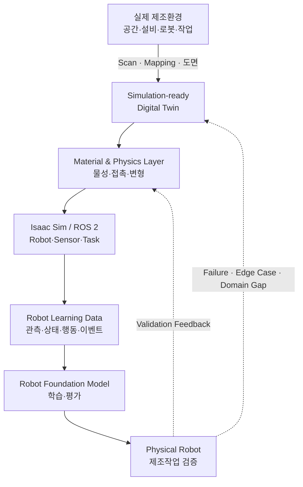
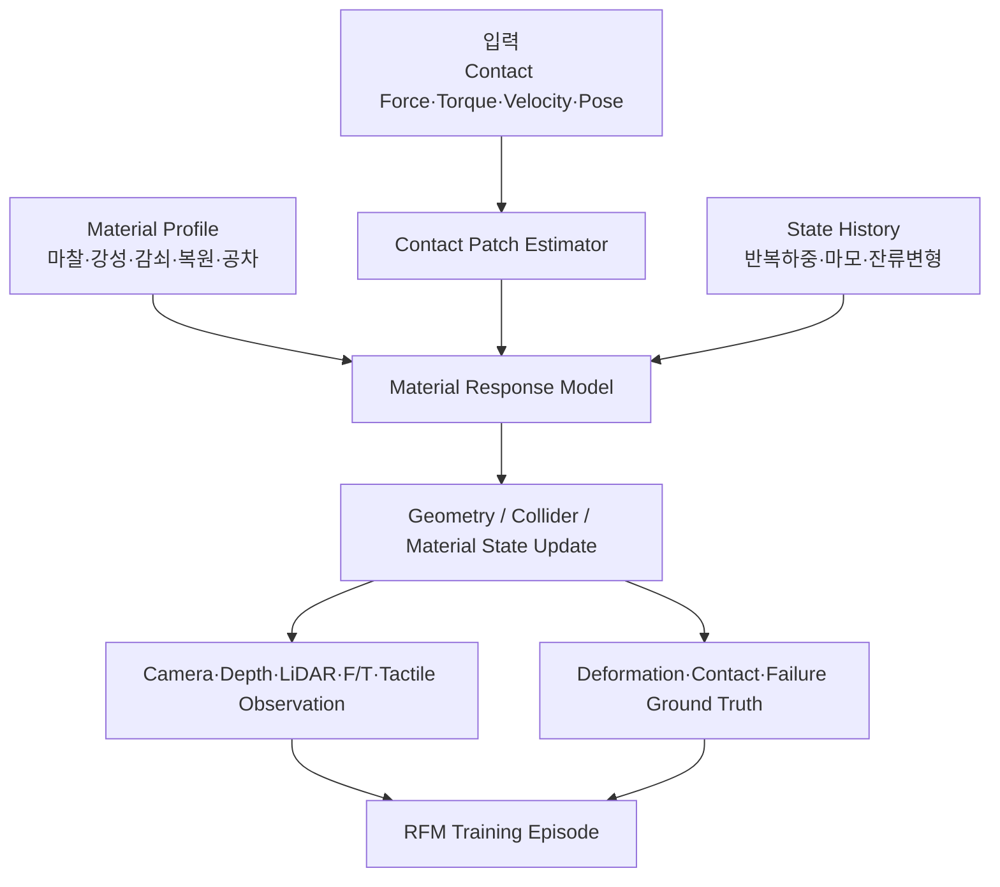
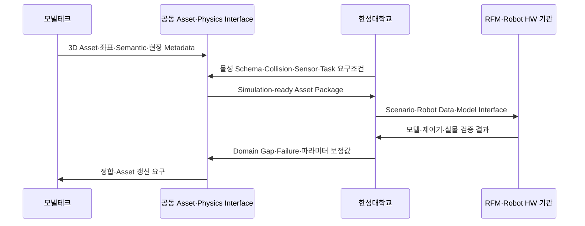
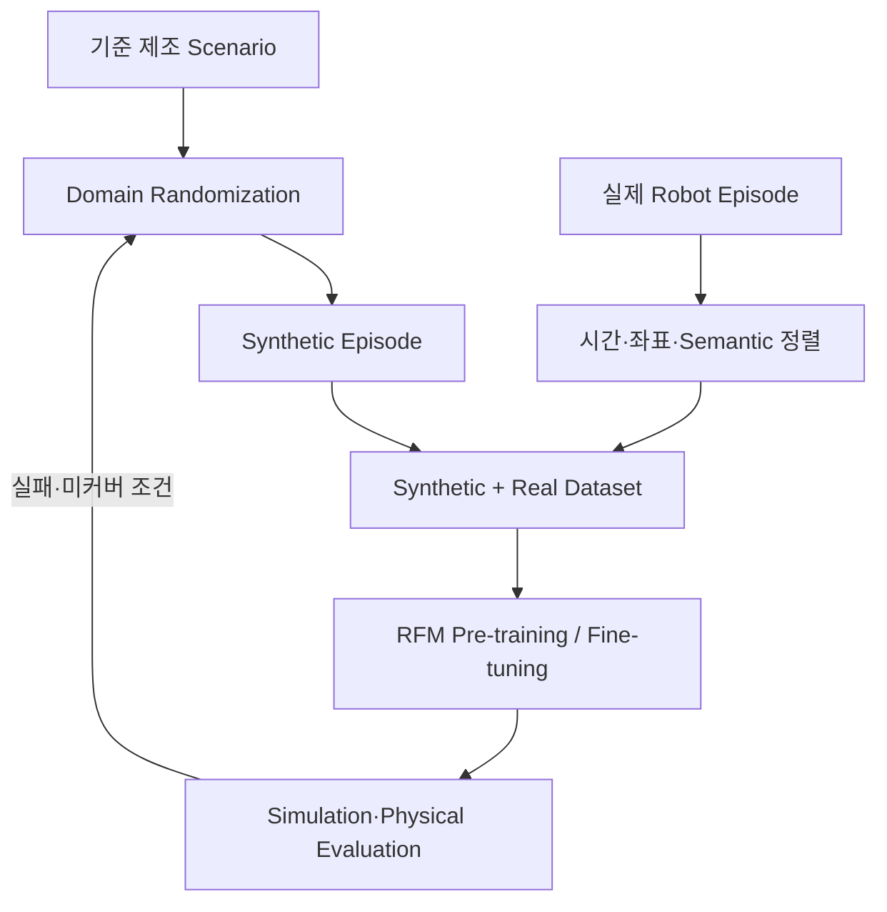
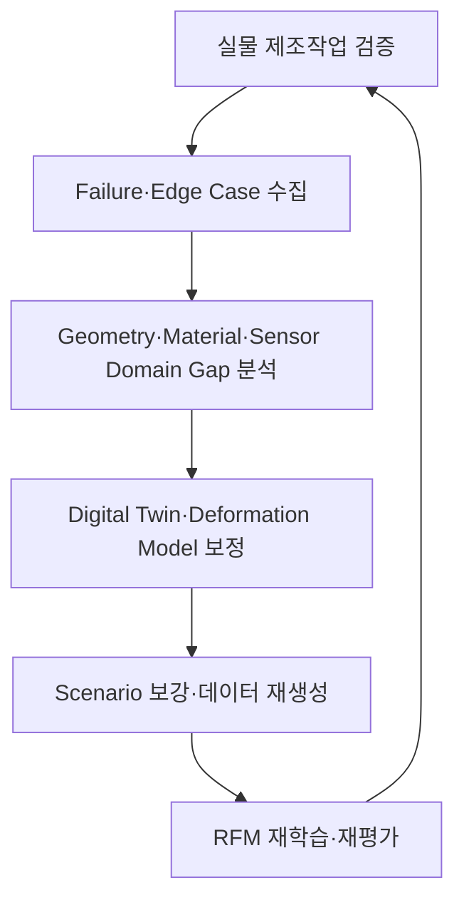

# 제조환경 Digital Twin·Deformation Engine 기반 Robot RFM 데이터팩토리

:material-circle-outline:{ style="color:#e0a800" } **컨소시엄 제안** · Manufacturing Physical AI Data Factory & Robot Foundation Model

!!! abstract "프로젝트 한눈에 보기"
    본 프로젝트는 실제 제조공간을 **Simulation-ready Digital Twin**으로 전환하고, 로봇의 접촉으로
    발생하는 물리 상태 변화를 재현하는 **Manufacturing Deformation Engine**을 개발하여, 제조 로봇
    파운데이션모델(RFM)의 학습·평가·Sim-to-Real 검증에 필요한 데이터를 지속적으로 생산하는 것을
    목표로 합니다.

    모빌테크는 현장 취득과 정밀 3D Asset·공간 Digital Twin을 담당하고, 한성대학교는 OmniLRS 활용
    연구에서 축적한 변형지형·접촉물리 경험을 제조환경으로 확장해 물성 모델, 로봇 시뮬레이션,
    합성데이터 생성, RFM 연계 및 실물 검증을 수행합니다.

> **핵심 제안** — 정적인 제조공간의 시각화에 머물지 않고, **형상·물성·상태·행동·검증 데이터가 함께 순환하는 제조 Physical AI Digital Twin**을 구축합니다.

!!! info "사업·역할 상태"
    이 페이지는 컨소시엄 제안 단계의 한성대학교–모빌테크 공동 R&R과 기술구조를 정리한 것입니다.
    제조 Use Case, 대상 설비·로봇, 정량 KPI와 기관별 최종 책임범위는 컨소시엄 협의와 실증환경
    확정 후 기준선(Baseline)으로 관리합니다.

---

## 왜 제조환경에는 물리적으로 반응하는 Digital Twin이 필요한가

제조 로봇의 성능은 3D 형상만으로 결정되지 않습니다. 같은 공간과 작업이라도 바닥 마찰,
부품 공차, 포장재 강성, 그리퍼 접촉, 설비 진동, 센서 노이즈, 작업 순서와 누적 사용 상태에 따라
로봇의 관측과 행동 결과가 달라집니다. 따라서 RFM 학습용 제조 Digital Twin은 다음 세 계층을
동시에 표현해야 합니다.

| 계층 | 표현 대상 | RFM 학습에서의 의미 |
|---|---|---|
| Geometry Twin | 공간, 설비, 치구, 부품, 로봇의 형상·좌표·Semantic | 인식, 위치추정, 경로계획의 기준 |
| Physics Twin | 질량·관성, 마찰, 강성, 감쇠, 접촉, 변형·복원 특성 | 접촉행동과 실패조건의 재현 |
| Behavior Twin | 공정 순서, 로봇 행동, 정상·실패·복구 시나리오 | Task–Observation–Action 학습 데이터 생성 |

---

## 핵심 기술: OmniLRS에서 Manufacturing Deformation Engine으로

[OmniLRS](https://github.com/OmniLRS/OmniLRS)는 NVIDIA Isaac Sim 기반의 오픈소스 달 탐사
로봇 시뮬레이터로, 절차적·무작위 지형 생성, ROS 2 연계, 합성데이터 생성과 함께 로버 주행에
따른 지형 변형을 지원합니다. 한성대학교는 OmniLRS 기반 달 로버 시뮬레이션과 HILS 연구에서
확보한 경험을 토대로, 변형지형 엔진의 개념을 제조 로봇의 **접촉–물성–상태 변화** 문제로
파생·고도화합니다.

### OmniLRS 기반 기술의 제조환경 전환

| OmniLRS 변형지형 개념 | 제조환경 Deformation Engine으로의 확장 |
|---|---|
| Wheel Footprint | 바퀴·그리퍼·공구·부품의 Contact Patch |
| 접촉력–변형깊이 회귀 | 힘·토크·접촉시간·속도에 따른 변위·변형 응답 |
| 반복 통과 시 변형 누적·감쇠 | 반복 하중, 마찰, 마모, 히스테리시스, 영구변형 상태 |
| Depth·Boundary Distribution | 접촉부 변형 형상과 영향영역 분포 |
| 지형·조명·Asset Randomization | 재질·공차·마찰·강성·배치·센서·작업조건 Randomization |
| ROS 2와 합성데이터 | 로봇 상태·행동·접촉·성공/실패가 시간 동기화된 학습 Episode |

OmniLRS의 기존 Deformation Engine은 접촉력으로부터 변형 깊이를 계산하는 비교적 단순한
모델을 사용합니다. 제조환경 확장에서는 소재·형상·온도·속도·시간 의존성과 접촉 이력을
포함할 수 있도록 모델을 모듈화하고, 실제 계측 데이터로 파라미터를 보정합니다.

### Manufacturing Deformation Engine의 구성

개발 대상은 특정 단일 물리모델에 고정하지 않고 다음과 같이 계층화합니다.

- **Material Profile** — 마찰, 반발, 밀도, 강성, 감쇠, 복원, 파손·변형 임계값과 불확실성 범위
- **Contact Model** — 로봇 바퀴·그리퍼·공구와 대상물 사이의 접촉면·힘·토크·미끄럼 추정
- **Response Model** — 탄성·점탄성·소성·마모 등 Use Case별 변형 응답 모듈
- **State Update** — 변형된 형상, Collision, 표면 상태와 누적 이력의 실시간 또는 준실시간 갱신
- **Data Labeler** — 접촉, 변형량, 물성 파라미터, 정상·실패·복구 이벤트의 자동 Ground Truth 생성
- **Calibration Interface** — 실제 센서·시험 결과를 이용한 파라미터 식별과 Sim-to-Real 오차 보정

---

## 한성대학교–모빌테크 공동개발 구조

### 기관별 주도 역할

| 구분 | 모빌테크 — Real → Digital | 한성대학교 — Digital → Physical AI |
|---|---|---|
| 요구사항 | 현장 취득범위·정밀도·갱신주기 정의 | Robot·Sensor·Task·물리모델 요구조건 정의 |
| 공간 취득 | LiDAR·MMS·Camera·도면 기반 Scan·Mapping | 로봇 작업영역·센서 가시성·접촉영역 검토 |
| 3D Asset | 설비·공간·부품의 정밀 3D 모델과 LOD 구성 | USD 계층, Articulation, Collision, Joint 요구조건 정의 |
| 물성정보 | 현장 재질·설비·자산 Metadata 조사와 Asset 연결 | 물성 Schema, 파라미터 식별, Deformation Model 개발 |
| 시뮬레이션 | Simulation-ready Asset·좌표·Semantic 제공 | Isaac Sim·ROS 2 환경과 Robot·Sensor·Task 구성 |
| 데이터 | Asset·공간 Metadata와 버전·출처 관리 | Domain Randomization, Synthetic Data와 자동 Annotation |
| 검증 | Real–Digital 공간·Asset 정합 지원 | RFM·Robot HW 실증, Domain Gap 분석과 Feedback |

### 공동 Hand-off Interface

모빌테크의 3D Asset이 시뮬레이터에서 보이는 것만으로는 충분하지 않습니다. 다음 정보를 하나의
버전으로 묶어 전달하는 **Simulation-ready Asset Package**를 공동 정의합니다.

| Interface | 필수 정보 | 검증 관점 |
|---|---|---|
| Geometry | Mesh, LOD, 단위, 원점, 좌표계, Scale | 공간 치수·배치·정합 오차 |
| Semantic | Asset ID, 설비·부품 분류, 공정·작업 태그 | 데이터 검색과 Task 연결성 |
| Visual | PBR Material, Texture, 조명 반응, 표면 상태 | Camera 기반 인식의 사실성 |
| Collision | 단순화 Collider, Contact 영역, Self-collision | 충돌 안정성과 계산성능 |
| Dynamics | 질량, 무게중심, 관성, Joint, 구동·제약조건 | 로봇 행동과 설비 운동 재현성 |
| Material | 마찰, 반발, 강성, 감쇠, 복원·변형·마모 파라미터 | 실제 시험 응답과 Physics 오차 |
| Sensor | Camera·LiDAR·F/T·Tactile 기준좌표와 Noise | 관측 데이터의 실·가상 정합 |
| Provenance | 취득일, 출처, 보정조건, 버전, 유효범위 | 재현성·변경관리·데이터 거버넌스 |

---

## 한성대학교 세부 R&R

한성대학교는 전체 컨소시엄에서 제조환경 Digital Twin을 데이터와 RFM, 실제 Robot HW로 연결하는
**Simulation & Sim-to-Real 기술 인터페이스**를 담당합니다.

| Work Package | 한성대학교 주도 업무 | 주요 산출물 |
|---|---|---|
| HSU-1. Use Case·Interface 설계 | 제조 Task·Process·Failure Case와 Robot·Sensor 요구조건 정의 | Use Case 명세, 공통 Interface·Dataset Schema |
| HSU-2. Deformation Engine | 물성 Profile, 접촉·변형·누적상태 모델과 파라미터 보정 | Engine Module, Material Library, Calibration Tool |
| HSU-3. 제조 로봇 시뮬레이션 | Isaac Sim·ROS 2 기반 Robot·Sensor·Task·Scenario 구성 | Simulation Package, Scenario Library |
| HSU-4. 학습데이터 생성 | Domain Randomization, Synthetic/Real Data 정렬, 자동 Annotation | RFM용 Dataset·Metadata·품질 리포트 |
| HSU-5. RFM 연계 | RFM 기관과 Observation·Action·Task·Model Interface 및 평가기준 협의 | RFM Adapter, Benchmark·Evaluation Protocol |
| HSU-6. Physical Validation | 실제 Robot HW 적용, Domain Gap·Failure·Edge Case 분석 | Sim-to-Real 검증결과, Feedback Data |

### 제조 Task·Scenario Library

초기 대상은 컨소시엄 제조 Use Case와 로봇 구성이 확정된 뒤 기준선으로 동결합니다.

- **이송·물류** — AMR 이동, 적재·하역, 도킹, 통로 폐색과 미끄럼 조건
- **조작** — Pick & Place, Bin Picking, 파지 실패, 대상물 변형·미끄럼·낙하
- **조립** — 삽입, 체결, 정렬, 공차와 접촉력 변화, 치구 위치 편차
- **검사** — Camera·Depth·LiDAR·F/T 기반 외관·치수·접촉 품질검사
- **예외·복구** — 설비 정지, 센서 열화, 부품 누락, 충돌 위험, 작업 재계획

각 Task는 **정상–경계–실패–복구** 상태를 포함하고, 환경·설비·부품·로봇·센서 조건을
독립적으로 변화시킬 수 있도록 구성합니다.

---

## RFM 학습데이터 설계

### Episode 단위 데이터

| 데이터 계층 | 주요 항목 |
|---|---|
| Task | 자연어·Task ID, 공정 단계, 성공조건, 안전 제약 |
| Observation | RGB/RGB-D, LiDAR, Robot State, F/T, Tactile, 설비·환경 상태 |
| Action | Joint·Cartesian 명령, Gripper, Mobile Base, 고수준 Skill |
| Physics | 접촉점·힘·토크, 마찰·강성, 변형량·복원·마모 상태 |
| Ground Truth | 6D Pose, Segmentation, Depth, Velocity, Collision, Event Label |
| Outcome | 성공·실패·복구, Cycle Time, 품질·안전 지표 |
| Provenance | Asset·Material·Scenario 버전, Random Seed, 생성·실측 조건 |

### 데이터 생성 전략

Randomization 대상에는 조명·시점·배치·공차·마찰·강성·감쇠·변형 임계값·센서 노이즈·작업
속도·로봇 초기상태가 포함됩니다. 모든 변화조건을 Metadata로 보존하여 모델 성능의 원인을
추적하고 같은 Episode를 재생성할 수 있도록 합니다.

### RFM 기관과의 연계 범위

한성대학교가 RFM 전체 모델을 단독 개발하는 구조가 아니라, RFM 주관기관과 다음 Interface를
공동 정의하고 제조환경 학습·평가를 지원합니다.

- 로봇별 Observation·Action Space와 Embodiment Metadata
- 자연어 Task·공정 단계와 저수준 Robot Action의 연결
- Synthetic·Real Dataset의 혼합비, Curriculum과 Fine-tuning 조건
- Offline Benchmark와 Simulation Rollout 평가
- 실물 Robot 성공률·안전·복구성능 및 Sim-to-Real Gap 분석
- Failure·Edge Case의 재시뮬레이션과 재학습 데이터 생성

---

## Validation Feedback Loop

검증은 단순한 영상 유사도가 아니라 다음 관점에서 수행합니다.

| 검증영역 | 평가항목 예시 |
|---|---|
| Geometry Fidelity | 위치·치수·좌표 정합, Sensor 가시성, Collision 일치도 |
| Physics Fidelity | 접촉력, 변위·복원, 미끄럼, Cycle Time, 실패 발생조건 |
| Data Quality | Schema 완전성, 시간동기, Label 정확도, 재현성, 조건 Coverage |
| Model Performance | Task 성공률, OOD 강건성, 실패복구, Sim-to-Real 성능차 |
| Operational Quality | Asset·Dataset 버전 추적, 자동화율, 재생성 시간, 자원 사용량 |

정량 목표값은 대상 Use Case와 실제 제조환경의 기준 데이터를 확보한 뒤 컨소시엄 공통 KPI로
확정합니다.

---

## 단계별 추진안

| 단계 | 핵심 활동 | 완료 기준 |
|---|---|---|
| 1. 기준선 설계 | 제조 Use Case, 실증조건, Asset·Material·Data Interface 합의 | 공동 Interface Specification 승인 |
| 2. Digital Twin 구축 | 현장 취득, 3D Asset, 좌표·Semantic·물성정보 연결 | Simulation-ready Asset Package 검수 |
| 3. Physics·Scenario 개발 | Deformation Engine, Robot·Sensor·Task Scenario 구현 | 기준 물성시험·시뮬레이션 재현 |
| 4. Data·RFM 연계 | Domain Randomization, Dataset 생성, RFM Adapter·평가 | 학습·평가 Pipeline 재현 가능 |
| 5. Physical Validation | 실제 Robot 적용, Domain Gap 분석, 반복 보정 | 공통 KPI 기반 Sim-to-Real 검증 |
| 6. 데이터팩토리 운영 | 실패·Edge Case 수집, 자동 재생성·재학습 | Validation Feedback Loop 운영 |

---

## 컨소시엄 공통 Interface

| 참여영역 | 한성대학교와 주고받는 정보 |
|---|---|
| 제조환경·수요기업 | 공정, Task, 안전조건, 품질기준, 실증 데이터 |
| Digital Twin·모빌테크 | 3D Asset, 좌표·Semantic, 물성 Metadata, 정합 결과 |
| Data 기관 | Dataset Schema, 저장·검색·품질관리, Synthetic/Real 연결 |
| RFM 기관 | Model Interface, 학습·평가 조건, 모델·Checkpoint·결과 |
| SI 기관 | 데이터팩토리 서비스·워크플로·운영 API 통합 |
| Robot HW 기관 | URDF/USD, 제어·센서 Interface, 실물 검증과 Failure Data |
| 연구기관 | 시험기준, Benchmark, 성능·안전 검증 협력 |

한성대학교는 기관별 기능을 대체하지 않고, 각 산출물이 다음 단계에서 바로 사용될 수 있도록
**Asset–Physics–Data–Model–Validation Hand-off**를 연결합니다.

---

## 기대 산출물

- 제조환경 **Simulation-ready Digital Twin Asset Package**와 검수 기준
- 물성·접촉·변형 파라미터 **Material & Physics Schema**
- OmniLRS 경험을 제조환경으로 파생한 **Manufacturing Deformation Engine**
- Isaac Sim·ROS 2 기반 **Robot·Sensor·Task Scenario Library**
- 정상·실패·Edge Case를 포함한 **RFM 학습·평가 Dataset**
- RFM·Robot HW 연계를 위한 **Model·Control·Validation Interface**
- 실물 검증 기반 **Domain Gap Report와 Calibration Data**
- 반복적인 데이터 생성–학습–검증을 위한 **Validation Feedback Pipeline**

---

## HSU-PAC과의 연계

[HSU-PAC](../hsu-pac.md)은 Isaac Sim·Isaac Lab·ROS 2·GPU·NAS·실물 로봇을 연결하는
한성대학교 Physical AI 교육·연구 플랫폼입니다. 본 프로젝트에서는 HSU-PAC을 초기
알고리즘·Scenario·Dataset 검증 기반으로 활용하고, 컨소시엄의 제조 데이터 규모와 다기관
운영 요구에 맞춰 연산·스토리지·보안·실증환경을 확장합니다.

> HSU-PAC은 **개발·검증 Seed Platform**, 컨소시엄 데이터팩토리는 **제조환경 공동운영 Production Platform**으로 구분합니다.

---

## 기술 참고

- [OmniLRS — Omniverse Lunar Robotics Simulator](https://github.com/OmniLRS/OmniLRS)
- [OmniLRS Deformation Engine](https://github.com/OmniLRS/OmniLRS/wiki/deformation_engine)
- [한성대학교 Physical AI 교육·연구 플랫폼 HSU-PAC](../hsu-pac.md)

---

`Manufacturing Digital Twin` · `Deformation Engine` · `Simulation-ready Asset` · `Material Physics` · `Synthetic Data` · `Robot Foundation Model` · `Isaac Sim` · `ROS 2` · `Sim-to-Real`

[:octicons-arrow-left-24: 프로젝트 목록으로](../../projects.md)
