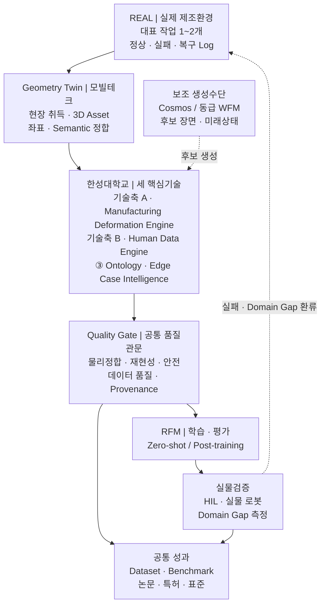
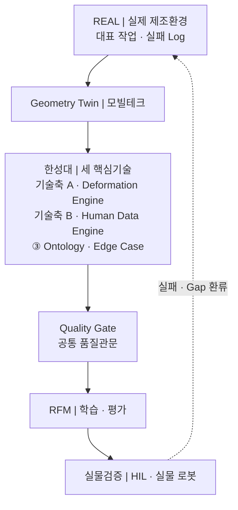

<style>
.md-typeset h1,
.md-typeset table {
  word-break: keep-all;
  overflow-wrap: normal;
}

@media screen and (max-width: 29.99rem) {
  .md-typeset h1 {
    font-size: 1.45rem;
    line-height: 1.35;
  }
}
</style>

# 제조환경 Digital Twin·Deformation Engine 기반 로봇 파운데이션 모델(RFM) 데이터팩토리

:material-circle-outline:{ style="color:#e0a800" } **컨소시엄 제안** · 산업통상부 공고 제2026-549호
연구개발과제 1 「로봇 데이터팩토리 구축 및 로봇파운데이션모델(RFM) 개발」

> **실물 제조환경의 Geometry Twin 을 측정 기반 Deformation·Physics Twin 으로 고도화하고,
> 실패·복구 데이터를 자동 검수해 RFM 학습·평가·실물 재검증으로 환류하는 제조 데이터팩토리입니다.**

!!! info "이 문서의 내용은 세 가지 상태가 섞여 있습니다"
    | 상태 | 해당 내용 |
    |---|---|
    | **2026-09-01 R&R 반영** | 담당 분야, 확정 4대 역할, 연차별 개발 산출물·대표 정량목표·연구성과 |
    | **제안·잠정** | 대표 정량목표의 기준선·시험조건, 연차 완료 Gate, 연구개발비 금액 환산 |
    | **확인 필요** | 대표 제조 작업·소재·로봇, RFM 인터페이스, 실증환경, 예산 5 % 의 모수, 모빌테크 협약 형태 |

    제안·잠정 수치는 협약 목표로 인용하지 않습니다.

---

## 1. 과제 정의

### 무엇을 만드는 과제인가

한성대학교는 **대표 제조 작업 1~2개**를 선정하고, 그 작업 하나를 다음 순환으로 끝까지
관통시킵니다. 세 기술축을 각각 범용 제조 플랫폼으로 개발하는 과제가 아닙니다.

```
실제 데이터 수집 → 가상환경 물리 보정 → RFM 취약조건과 실패·복구 데이터 생성
   → 자동 검수 → RFM 재학습 → 실제 로봇 재검증 → 실패·Domain Gap 환류
```

요약하면 **실제 로봇의 실패를 가상환경에서 재현하고, 학습 가능한 데이터로 바꾸는 일**입니다.
대표 작업을 정해 한 바퀴를 완주해야 각 단계의 수치가 서로 연결되어 검증됩니다.

### 공고 정합성

| 항목 | 공고 기준 |
|---|---|
| 내역사업 | 로봇산업기술개발 (로봇산업핵심기술개발) |
| 주관연구개발기관 | 제한없음 |
| 지원규모 | 7,500백만원 |
| 수행기간 | 43개월 — 1차 9개월 · 2차 10개월 · 3차 12개월 · 4차 12개월 |
| 과제유형 | 일반 · **원천기술형** · **품목지정형** |
| 과제특징 | 초격차 (R&D자율성트랙(일반) 신청 가능) |
| 접수 | 2026. 8. 21.(금) ~ **9. 11.(금) 18:00**, 범부처통합연구지원시스템(IRIS) |
| 평가 배점 | 기술성 60 / 연구역량 20 / 사업화·경제성 20 — 종합 70점 미만 지원제외 |
| 대학 지원비율 | 정부지원연구개발비 **연구개발비의 100% 이하**, 기관부담 현금은 필요시 |

### 대학 참여기관으로서의 적합성

| 평가 관점 | 본 제안의 대응 근거 |
|---|---|
| RFP·품목 부합성 | 데이터팩토리(데이터 생성·정제·관리)와 RFM(학습·평가) 사이의 **제조 물리·의미 계층**을 담당 |
| 목표의 도전성 | 시각 중심 Digital Twin 을 **접촉·변형·누적상태가 반영되는 Physics Twin** 으로 전환 |
| 연구조직 역량 | OmniLRS 기반 Isaac Sim·ROS 2 시뮬레이션과 변형지형·HILS 수행실적, HSU-PAC 인프라 |
| 연구 인프라 | GPU·Isaac Sim·ROS 2·NAS·실물 로봇을 갖춘 [HSU-PAC](../hsu-pac.md) 을 **참여기업 공동 Testbed** 로 개방 |
| 지역·인력 파급 | Physical AI 마이크로디그리 과정으로 데이터 생산과 인력양성을 동시 수행 |

---

## 2. 기관 역할

### 컨소시엄 안에서의 기관 위계

> **한성대학교는 실환경–가상환경 연계형 데이터 증강 분야의 책임기관으로서 4대 연구개발
> 역할을 총괄하며, 모빌테크는 한성대학교가 정의한 요구규격에 따라 현장 공간정보 취득과
> Simulation-ready Geometry Twin 구축을 지원합니다.**

| 공식 역할 | 한성대학교 핵심기술 | 모빌테크 지원내용 |
|---|---|---|
| **① Real-to-Sim-to-Real 고도화** | Manufacturing Deformation Engine · Physics Calibration · Domain Gap 평가 | 현장 Scan · Geometry Twin · Simulation-ready Asset |
| **② Zero-shot Transfer 기반 도메인 적응** | 미학습조건 평가 · Transferability Score · Transfer Decision · 경량 적응 | 공간·설비·배치 변화 Asset · Asset Version |
| **③ 엣지 케이스 시뮬레이션** | Human Data Engine · Ontology·Edge Case Intelligence · Quality Gate | 실패·경계조건 재현을 위한 Geometry·Semantic Metadata 보완 |
| **④ 학술 연구 및 기술 자문** | 논문·특허·표준·벤치마크·인터페이스 자문 | 산업현장 사례 · Asset 구축·적용자료 제공 |

두 기관의 경계는 **형상까지가 모빌테크, 물리 반응부터가 한성대학교**입니다.
세 기술축은 위 네 역할 **아래에** 놓입니다 — ① 아래 Deformation Engine,
③ 아래 Human Data Engine 과 Ontology·Edge Case Intelligence 입니다.

!!! note "「책임기관」과 「대표기관」은 다릅니다"
    책임기관은 **담당 분야의 책임**을 뜻하며 전체 컨소시엄의 주관기관을 뜻하지 않습니다.
    모빌테크의 법적 참여형태가 확정되기 전까지 **「한성대 책임 · 모빌테크 세부지원」** 으로
    표기를 통일합니다.

### 확정된 담당 분야와 4대 역할

**담당 분야 — 실환경–가상환경 연계형 데이터 증강.**
실환경에서 얻기 어려운 조건을 가상에서 만들어내고, 그것이 실환경에서도 통하는지 확인해
되먹이는 일입니다. 데이터의 양을 부풀리는 작업이 아닙니다.

| # | 주요 역할 | 무엇을 하는가 | 이 역할이 없으면 |
|:--:|---|---|---|
| ① | **Real-to-Sim-to-Real 고도화(디지털 트윈)** | 실제 공정을 물리적으로 반응하는 Twin 으로 옮기고, 그 결과를 실환경에서 검증해 파라미터를 되먹인다 | 가상에서 만든 데이터가 실제와 다른지 확인할 방법이 없다 |
| ② | **Zero-shot Transfer 기반 도메인 적응** | 실환경–가상환경 격차를 요인별로 정의·측정하고, 증강으로 좁혀 **추가 학습 없이** 실물에서 동작하게 한다 | 현장마다 다시 학습해야 하고, 데이터팩토리의 값어치가 떨어진다 |
| ③ | **엣지 케이스 시뮬레이션** | 실제로는 드물게 나타나는 실패·경계·복구 상황을 의도적으로 생성해 학습 가능한 데이터로 만든다 | 정상 동작만 축적되고, 위험한 상황은 학습되지 않는다 |
| ④ | **학술 연구 및 기술 자문** | 위 세 가지를 논문·특허·표준 제안으로 정리하고 컨소시엄 기술 판단에 근거를 제공한다 | 결과가 과제 안에만 남고 검증·재사용 경로가 없다 |

---
## 3. 세 핵심기술

한성대학교의 고유 성과는 아래 세 축과 공통 계층입니다. 우선순위는 다음 순서로 고정합니다.

| 순위 | 핵심기술 | 무엇을 하는가 |
|:--:|---|---|
| **①** | **Manufacturing Deformation Engine** | 대표 작업의 접촉·변형·잔류상태를 실측으로 보정하고 검증한다 |
| **②** | **Human Data Engine** | 실패 직전 상태를 저장·복원해 복구 행동을 여러 갈래로 늘린다 |
| **③** | **Manufacturing Ontology·Edge Case Intelligence** | 작업–상태–실패–복구를 구조화해 RFM 의 취약조건을 찾는다 |
| **공통** | **Quality Gate · RFM Interface · 실물검증** | 생성 데이터를 공통 품질관문으로 거른 뒤 RFM 에 공급하고 실물로 되검증한다 |

### 기술축 A · Manufacturing Deformation Engine

**물리엔진을 새로 개발하지 않습니다.** Isaac Sim 과 OmniLRS 위에서 동작하는
**제조 변형·물성 보정 모듈**을 개발합니다. OmniLRS 변형지형 연구에서 축적한 접촉·변형 구동과
계측 경험을 제조환경의 Contact–Material–State 모델로 파생시키는 작업입니다.

범용 엔진이 아니라 **대표 작업 1~2개의 접촉력·변형·잔류상태를 실측과 대조해 검증하는
범위로 한정**합니다. 소재군을 넓히면 물성시험 횟수가 그만큼 늘어나므로, 범위 확장은
예산·기간과 함께 결정합니다.

| 구성물 | 내용 |
|---|---|
| 물리 특성 보정 기능 | 실제 센서·영상에서 마찰·접촉·강성값을 추정해 가상환경 파라미터를 맞춘다 |
| 제조 변형 모사 기능 | 삽입·압입에서 생기는 압축·복원·잔류변형을 가상환경에서 재현한다 |
| Material Library | 대표 소재의 마찰·강성·감쇠·복원·임계값과 불확실성 범위 |
| 실제–가상 비교 리포트 | 동일 조건에서 실물과 가상의 접촉력·변형 차이를 수치로 제시 |

### 기술축 B · Human Data Engine

사람이 만든 시연·복구 데이터를 로봇 학습 데이터로 바꾸는 축입니다. 핵심 기능은 다음
네 단계입니다.

```
실패상태 저장·복원 → 복구행동 분기 → 자동검수 → 실로봇 Grounding
```

실패 직전의 로봇 관절각·물체 위치·접촉 상태를 저장해 두고 그 지점으로 되돌아가면,
**하나의 실패에서 여러 복구 데이터**를 얻습니다. 실제 로봇으로 실패 상황을 매번 처음부터
만들 필요가 없습니다. 생성된 복구 행동은 자동 검수를 거쳐 소량의 실로봇 시험으로
Grounding 합니다.

수행 인력과 마이크로디그리 과정은 **7절 수행인력·교육체계**에 있습니다.

### 기술축 C · Manufacturing Ontology·Edge Case Intelligence

`Asset → Process → Task → State → Event → Failure → Recovery` 구조로 **어떤 설비와 작업에서
어떤 상태 변화로 실패했고, 어떤 복구 행동이 효과적이었는지**를 연결해 저장합니다.

이 구조 위에서 물체 위치·각도·마찰·물성·센서오차를 조금씩 바꿔가며 **실패가 시작되는
경계조건**을 찾고, 그 조건을 가상환경에서 다시 만들어 복구 데이터 생성과 재학습에 씁니다.

### 공통 — Quality Gate · RFM Interface · 실물검증

**Quality Gate 는 세 기술축 뒤, RFM 공급 앞에 놓입니다.** Human Data Engine 전용 검수가
아니라 **생성 데이터 전체가 통과하는 공통 품질관문**입니다.

| 검수 항목 | 무엇을 보는가 |
|---|---|
| **물리정합** | 관통·비물리 가속·불가능한 접촉이 없는가 |
| **재현성** | 동일 입력조건에서 같은 결과가 다시 나오는가 |
| **안전** | 실물 적용 시 위험한 궤적·힘이 포함되지 않았는가 |
| **데이터 품질** | 규격·라벨·결측·중복이 기준을 만족하는가 |
| **Provenance** | 어느 Asset·시나리오·버전에서 나왔는지 추적되는가 |

RFM Interface 는 Observation·Action·Task·Embodiment 규약과 평가기준을 RFM 기관과 맞추는
공통 계층이고, 실물검증은 HSU-PAC 과 실증환경에서 Domain Gap 을 측정해 앞 단계로
되돌리는 계층입니다.

!!! note "NVIDIA Cosmos 와 World Foundation Model 의 위치"
    Cosmos 를 비롯한 WFM 은 **핵심기술이 아니라 후보 장면·미래상태를 생성하는 보조수단**입니다.
    한성대학교의 고유 성과는 **Deformation Engine, 실패·복구 데이터 증강, 취약조건 탐색,
    Quality Gate** 네 가지이며, 생성 도구는 교체 가능한 구성요소로 다룹니다.
    특정 모델에 종속되지 않도록 생성 조건 명세와 검수 절차를 도구와 분리해 정의합니다.

---

## 4. 폐루프 — 데이터가 도는 경로

<div class="concept-diagram concept-diagram--desktop" markdown>



</div>

<div class="concept-diagram concept-diagram--mobile" markdown>



</div>

**차별화 지점은 생성이 아니라 폐루프입니다.** Quality Gate 를 통과한 데이터만 RFM 에
공급하고, 실물검증에서 확인된 Domain Gap 을 다시 현장·Twin·시나리오에 반영합니다.

세부 아키텍처(Work Package HSU-1~7, Versioned Episode Factory, HSU-PAC 구성)는
**[기술 상세](technical.md)** 에 있습니다.

---
## 5. 핵심 KPI

아래 목표는 **2026-09-01 R&R의 대표 정량목표**입니다. 기준선 확정 전 잠정치이며,
Use Case·소재군·Robot·실증환경을 확정한 뒤 컨소시엄 공통 KPI로 동결합니다.

| 차년도 | 검증 단계 | 대표 정량목표 |
|:--:|---|---|
| **1차** | 생성 재현성 · 스키마 왕복 정합 | 동일 조건 재실행 결과 동일 **100 %** · 손실 없는 전달 **≥ 95 %** |
| **2차** | 비물리 결과 자동 검출 · 접촉력 재현 | 검출률 **≥ 85 %**(오검출 **≤ 15 %**) · NRMSE **≤ 20 %** · 조건 준수율 **≥ 70 %** |
| **3차** | Zero-shot · 전이 판정 | 기준환경 대비 **≥ 70 %**(경량 적응 후 **≥ 90 %**) · 판정 일치 **≥ 80 %** · OOD 탐지 **≥ 85 %** |
| **4차** | Edge Case Coverage · 절차 재현성 | 커버리지 **≥ 80 %** · 제3자 재현 **≥ 90 %** · 재학습–재검증 Loop **1회 완주** |

KPI별 분모·산식·증빙과 기관 책임은 **[연차별 목표](roadmap.md)** 에서 관리합니다.

---

## 6. 연차 계획과 예산

기간은 **43개월 · 4개 차년도** — 1차 9개월 · 2차 10개월 · 3차 12개월 · 4차 12개월입니다.
차년도별 목표·완료 Gate·완료 판정과 결과물 20건은 **[연차별 목표](roadmap.md)** 에 있습니다.

| 차년도 | 개발 단계 | 대표 결과물 |
|---|---|---|
| **1차 (9개월)** | 기준 시스템 | WFM–Physics Twin Reference Architecture · Scene–Action–State–Event 표준 v1 · Geometry–Physics Interface·Reference Asset |
| **2차 (10개월)** | 제조 변형·데이터 증강 엔진 | Manufacturing Deformation Engine 기본형 · Physics Consistency Evaluator v1 · Domain Variation·Edge Case Compiler |
| **3차 (12개월)** | 전이 검증 | Transfer Decision Manager · Multi-stage Validation Gate · 상태 복원·Recovery 다중분기 증강 Dataset |
| **4차 (12개월)** | 표준화 | Closed-loop RoboOps Toolchain · Cross-domain Physical AI Benchmark · Geometry–Physics Twin 최종 기준모델·기술백서 |

### 연구개발비 (2026-09-01 R&R 기준)

한성대학교 연구개발비는 **전체 정부지원연구개발비의 5 % 수준**으로 제시됐습니다.
금액은 5 %의 모수와 모빌테크 참여 형태가 확정된 뒤 환산합니다.

| 차년도 | 기간 | 한성대 연구개발비 내 배분 | 중점 |
|---|---:|---:|---|
| **1차** | 9개월 | **18 %** | 환경 구축·Interface·Schema 설계 |
| **2차** | 10개월 | **26 %** | Compiler·Evaluator·Library 개발 |
| **3차** | 12개월 | **29 %** | HIL 검증과 Zero-shot 전이 평가 |
| **4차** | 12개월 | **27 %** | Closed-loop 고도화·표준화 |
| **합계** | **43개월** | **100 %** | |

!!! warning "기관별 금액은 아직 확정값이 아닙니다"
    현재 R&R에는 한성대·모빌테크의 기관별 금액이 제시되지 않았습니다.
    제안서에는 위 **연차 비중**만 반영하고, 5 %의 모수와 모빌테크의 한성대 몫 포함 여부가
    확정된 뒤 금액표를 작성합니다.

### 성과지표 (4년 누계)

| 구분 | 1차 | 2차 | 3차 | 4차 | 누계 |
|---|:--:|:--:|:--:|:--:|:--:|
| SCI(E)급 논문 | — | 1 | 1 | 1 | **3** |
| 국내외 학술발표 | 1 | 2 | 2 | 2 | **7** |
| 특허 출원 / 등록 | — | 1 | 1 | 1 / 1 | **3 / 1** |
| SW 프로그램 등록 | — | 1 | 1 | 1 | **3** |
| 표준 제안 · 기술 백서 | — | — | — | 1 | **1** |

확정 역할 ④가 학술 연구 및 기술 자문인 만큼, 논문·특허는 부수 성과가 아니라
**협약 시 확정된 성과지표**로 관리합니다.

---

## 7. 수행인력과 교육체계

데이터 생산 인력은 **Physical AI 마이크로디그리(MD) 과정**에서 공급합니다. 교육과 데이터
생산을 한 체계 안에 두어, 검수 기준을 아는 인력이 데이터를 만들도록 합니다.

| 트랙 | 대상 | 하는 일 |
|---|---|---|
| **교과 실습** | MD 과정 수강생 30명 · 5개 조 | 표준 Protocol 학습, 실습 데이터 생성 |
| **유급 연구참여** | MD-3 이수자 중 선발 6~9명 · 3개 조 | 과제 Dataset 생산, 복구 시연, 1차 검수 |

연구개발 Dataset 에 편입되는 데이터는 별도 계약·동의를 거친 유급 참여자가 생산합니다.
과정 구성과 운영 절차는 **[기술 상세](technical.md)** 에 있습니다.

이 체계는 기술축 B · Human Data Engine 의 **수행 인력 경로**이며, 기술축 자체의 명칭은
**Human Data Engine** 으로 통일합니다.

---

## 8. 확인이 필요한 사항

| # | 확인할 것 | 왜 필요한가 |
|:--:|---|---|
| 1 | **대표 제조 작업 1~2개 선정** | 이 과제 전체가 여기서 출발합니다 — 1차년도 최우선 |
| 2 | **5 % 의 모수** — 정부지원연구개발비 총액 | 금액 환산의 기준 |
| 3 | **모빌테크 협약 형태** | 공동연구개발기관 참여를 우선 검토 — 최종 위치·금액은 협약에서 확정 |
| 4 | **실제 로봇·실증환경의 소재** | 원격조작 수집과 실물 재검증을 수행할 설비 |
| 5 | **RFM 기관의 모델 Interface** | Zero-shot·Transfer Decision·OOD 평가 대상 |
| 6 | 정량 KPI 기준선과 측정 정의 | 위 항목이 닫힌 뒤 동결 |

---

## 더 읽을 것

- **[연차별 목표](roadmap.md)** — 차년도별 목표·완료 Gate·결과물 20건·KPI 측정 정의
- **[기술 상세](technical.md)** — Work Package HSU-1~7 · Deformation Engine 상세 ·
  Ontology·Edge Case · MD 과정 운영 · Cosmos·LeRobot 구축 최적화 · 검증 체계
- [한성대학교 Physical AI 교육·연구 플랫폼 HSU-PAC](../hsu-pac.md)

---

`Manufacturing Digital Twin` · `Deformation Engine` · `Human Data Engine` · `Manufacturing Ontology` · `Quality Gate` · `Robot Foundation Model` · `Isaac Sim` · `ROS 2` · `Sim-to-Real`
