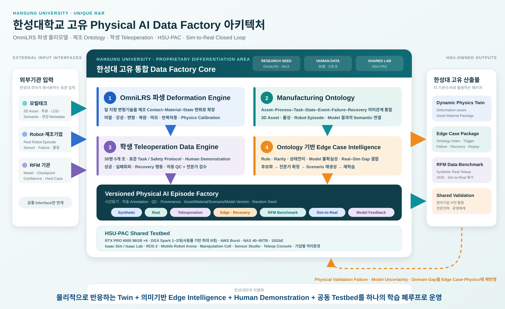
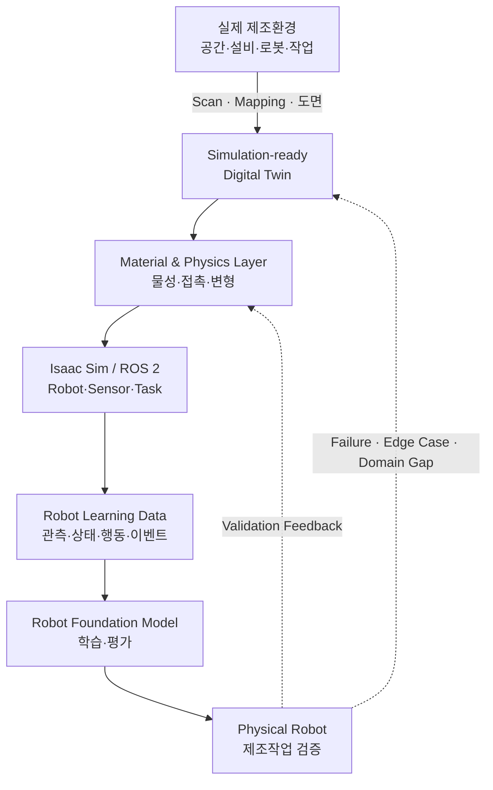
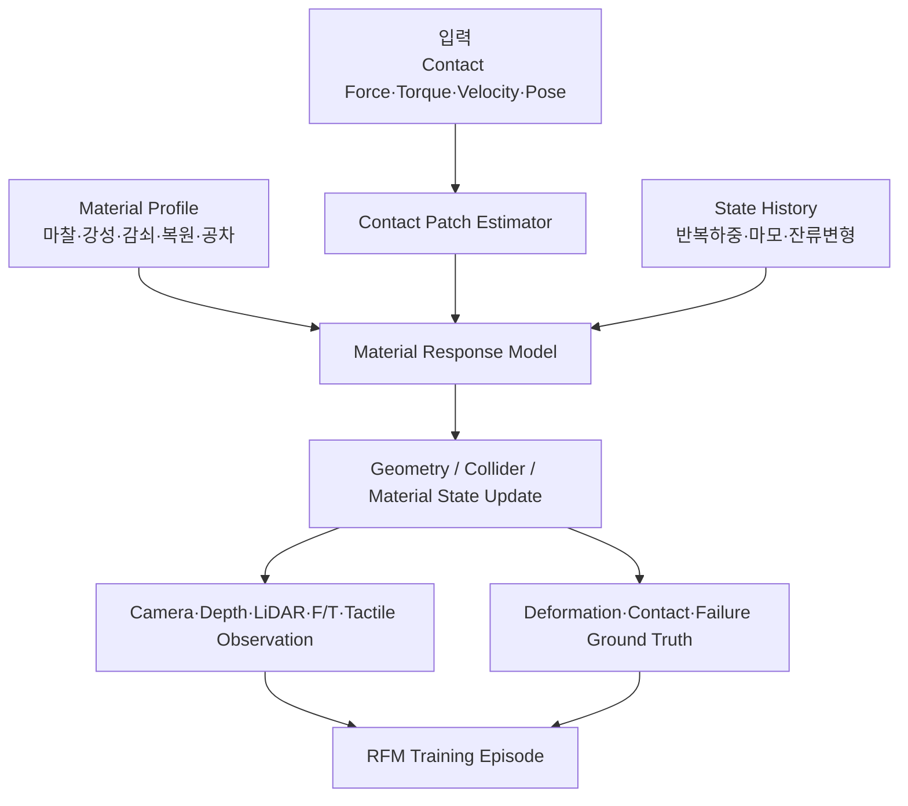
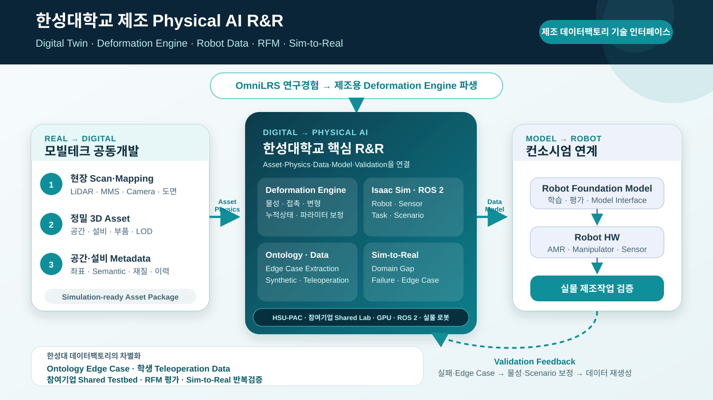
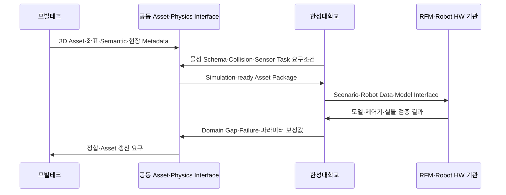
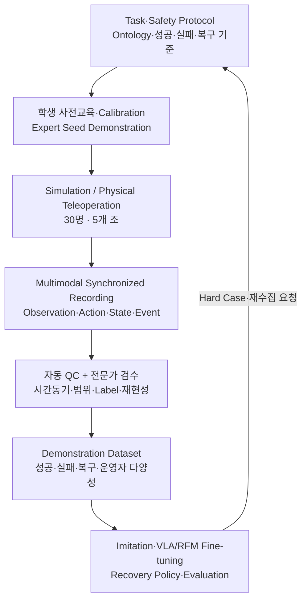
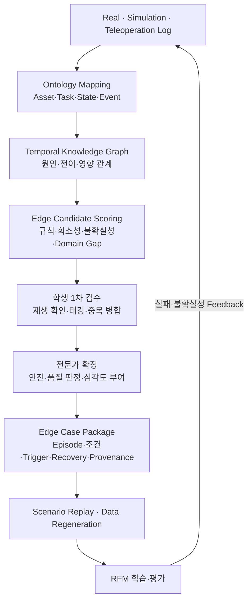
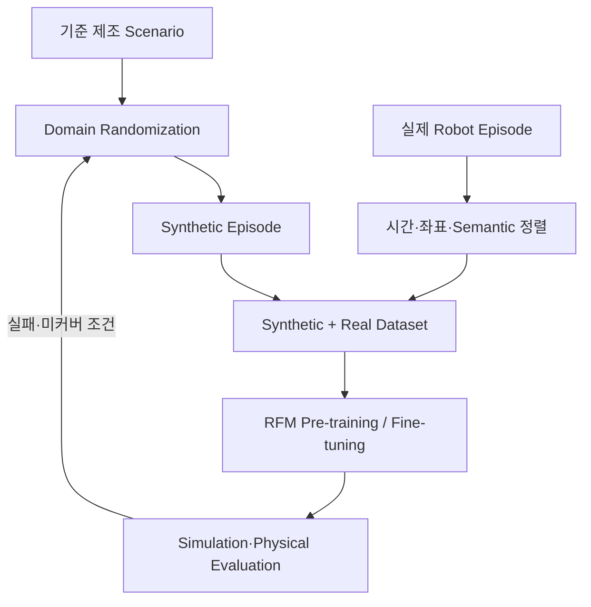
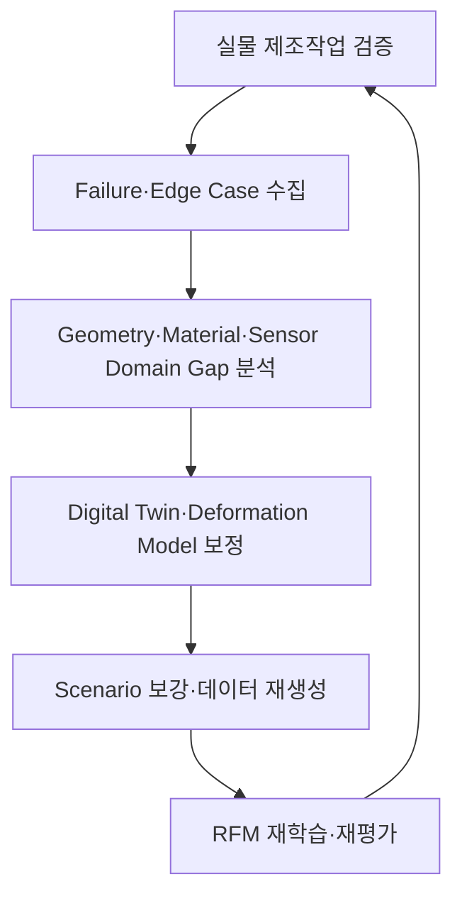

# 제조환경 Digital Twin·Deformation Engine 기반 Robot RFM 데이터팩토리

:material-circle-outline:{ style="color:#e0a800" } **컨소시엄 제안** · Manufacturing Physical AI Data Factory & Robot Foundation Model

!!! abstract "프로젝트 한눈에 보기"
    본 프로젝트는 실제 제조공간을 **Simulation-ready Digital Twin**으로 전환하고, 로봇의 접촉으로
    발생하는 물리 상태 변화를 재현하는 **Manufacturing Deformation Engine**을 개발하여, 제조 로봇
    파운데이션모델(RFM)의 학습·평가·Sim-to-Real 검증에 필요한 데이터를 지속적으로 생산하는 것을
    목표로 합니다.

    모빌테크는 현장 취득과 정밀 3D Asset·공간 Digital Twin을 담당하고, 한성대학교는 OmniLRS 활용
    연구에서 축적한 변형지형·접촉물리 경험을 제조환경으로 확장해 물성 모델, 로봇 시뮬레이션,
    합성데이터 생성, Ontology 기반 Edge Case 추출, 학생 Teleoperation Demonstration Data 구축,
    RFM 연계 및 실물 검증을 수행합니다. HSU-PAC 실습실은 참여기업의 Asset·Model·Robot을
    사전 통합·검증하는 공동 Testbed로 운영합니다.

> **핵심 제안** — 정적인 제조공간의 시각화에 머물지 않고, **형상·물성·상태·행동·검증 데이터가 함께 순환하는 제조 Physical AI Digital Twin**을 구축합니다.

!!! success "한성대학교의 대표 성과 — 무엇으로 평가받을 것인가"
    본 과제에서 한성대학교가 **직접 개발해 소유하는 성과**는 다음 세 가지이며, 우선순위가 있습니다.

    **① Manufacturing Deformation Engine (대표 성과)**
    로봇의 접촉으로 대상물의 형상·표면·잔류상태가 바뀌는 과정을 물리적으로 재현하는 엔진입니다.
    한성대가 OmniLRS 변형지형 연구에서 직접 구동·계측해 본 코드를 제조 접촉물리로 파생·재설계하며,
    **다른 참여기관 어디에도 대체 주체가 없는 유일한 항목**입니다. 이 엔진이 있어야 3D Digital Twin이
    비로소 로봇 학습에 쓸 수 있는 Physics Twin이 됩니다.

    **② 학생 주도 Human Data Engine**
    30명·5개 조가 표준 Protocol 아래에서 Teleoperation Demonstration을 생산하고, Edge Case를
    발견·태깅·재현까지 수행합니다. 데이터 생산과 Physical AI 인력양성이 같은 활동에서 나옵니다.

    **③ Manufacturing Ontology·Edge Case Intelligence**
    ①과 ②가 만든 데이터를 의미로 연결해 검색·재현·재학습이 가능한 자산으로 만듭니다.

    ②와 ③은 ①이 만든 물리 반응 위에서 작동합니다. **엔진이 이 제안의 중심축입니다.**

!!! info "사업·역할 상태"
    이 페이지는 컨소시엄 제안 단계의 한성대학교–모빌테크 공동 R&R과 기술구조를 정리한 것입니다.
    제조 Use Case, 대상 설비·로봇, 정량 KPI와 기관별 최종 책임범위는 컨소시엄 협의와 실증환경
    확정 후 기준선(Baseline)으로 관리합니다.

<figure markdown>
  { loading=lazy }
  <figcaption>한성대학교 고유 아키텍처 — 외부기관은 표준 입력·활용 Interface로 두고, 한성대가 보유·개발·운영하는 Physics·Ontology·Human Demonstration·Edge Intelligence·Shared Testbed를 중앙에 배치했습니다.</figcaption>
</figure>

---

!!! tip "이 문서의 구성"
    **본문** 여섯 절이면 협의·검토에 충분합니다. 근거·수치·운영 규약이 필요할 때
    뒤의 **상세 근거**를 보시면 됩니다.

## 과제 개요와 공고 정합성

본 제안은 산업통상부 공고 **제2026-549호**(2026. 8. 13.) 「2026년도 제2차 로봇산업기술개발사업
신규지원 대상과제」의 **연구개발과제 1 — 로봇 데이터팩토리 구축 및 로봇파운데이션모델(RFM) 개발**을
대상으로 합니다.

| 항목 | 공고 기준 |
|---|---|
| 내역사업 | 로봇산업기술개발 (로봇산업핵심기술개발) |
| 주관연구개발기관 | 제한없음 |
| 지원규모 | 7,500백만원 |
| 수행기간 | 43개월 |
| 과제유형 | 일반 · **원천기술형** · **품목지정형** |
| 과제특징 | 초격차 (R&D자율성트랙(일반) 신청 가능) |
| 접수 | 2026. 8. 21.(금) ~ **9. 11.(금) 18:00**, 범부처통합연구지원시스템(IRIS) |
| 평가 배점 | 기술성 60 / 연구역량 20 / 사업화·경제성 20 — 종합 70점 미만 지원제외 |
| 대학 지원비율 | 정부지원연구개발비 **연구개발비의 100% 이하**, 기관부담 현금은 필요시 |

!!! info "본 자료의 기준"
    일정·예산은 **공고문 기준(수행기간 43개월 · 지원규모 7,500백만원)** 으로 통일해 작성했습니다.
    사업기간은 4개 차년도로 나누며 1차년도는 공고에 따라 9개월 기준입니다.

    컨소시엄 협의 과정에서 이와 다른 총사업비가 공유된 바 있으나, 공식 근거가 확인되기 전까지
    본문에서는 사용하지 않습니다. 해당 사항과 상세 RFP/품목서 확보 여부는
    [OPEN-ITEMS](https://github.com/parclab-hsu/rfm-hansung-rr/blob/main/OPEN-ITEMS.md) 에서 별도로 추적합니다.

### 대학 참여기관으로서의 적합성

| 평가 관점 | 본 제안의 대응 근거 |
|---|---|
| RFP/품목 부합성 | 데이터팩토리(데이터 생성·정제·관리)와 RFM(학습·평가) 사이의 **제조 물리·의미 계층**을 담당 |
| 목표의 도전성 | 시각 중심 Digital Twin을 **접촉·변형·누적상태가 반영되는 Physics Twin**으로 전환 |
| 연구조직 역량 | OmniLRS 기반 Isaac Sim·ROS 2 시뮬레이션과 변형지형·HILS 수행실적, HSU-PAC 인프라 |
| 연구 인프라 | GPU·Isaac Sim·ROS 2·NAS·실물 로봇을 갖춘 [HSU-PAC](../hsu-pac.md)을 **참여기업 공동 Testbed**로 개방 |
| 지역·인력 파급 | 30명·5개 조 Teleoperation 체계로 데이터 생산과 Physical AI 인력양성을 동시 수행 |

---

## 한성대학교 고유 Physical AI Data Factory 아키텍처

한성대의 차별성은 개별 기술을 보유하는 데 그치지 않고, **OmniLRS 파생 Deformation Engine**,
**Manufacturing Ontology**, **30명·5개 조 Teleoperation Data Engine**, **Ontology 기반 Edge Case
Intelligence**를 Versioned Episode Factory와 HSU-PAC 안에서 하나의 학습 폐루프로 운영하는 데
있습니다. 결과물은 Dynamic Physics Twin, 재생 가능한 Edge Case·Recovery Package, RFM Dataset·
Benchmark와 참여기업 공동검증 체계로 제공됩니다.

---

## 한성대학교 세부 R&R

한성대학교는 전체 컨소시엄에서 제조환경 Digital Twin을 데이터와 RFM, 실제 Robot HW로 연결하는
**Ontology–Simulation–Data–Sim-to-Real 기술 인터페이스**를 담당합니다.

| Work Package | 한성대학교 주도 업무 | 주요 산출물 |
|---|---|---|
| HSU-1. Use Case·Interface 설계 | 제조 Task·Process·Failure Case와 Robot·Sensor 요구조건 정의 | Use Case 명세, 공통 Interface·Dataset Schema |
| **HSU-2. Deformation Engine** | **[대표 성과]** 물성 Profile, 접촉·변형·누적상태 모델과 파라미터 보정, 실계측 기반 검증 | **Manufacturing Deformation Engine**, Material Library, Calibration Tool, 검증 리포트 |
| HSU-3. 제조 로봇 시뮬레이션 | Isaac Sim·ROS 2 기반 Robot·Sensor·Task·Scenario 구성 | Simulation Package, Scenario Library |
| HSU-4. Ontology·Edge Case | 제조 자산·공정·상태·이벤트·실패·복구 Ontology와 Edge Case 후보 추출, **학생 1차 검수 체계 운영** | Manufacturing Ontology, Knowledge Graph, Edge Case Extractor |
| HSU-5. 학습데이터 생성 | Domain Randomization, Synthetic/Real/Teleoperation Data 정렬, 자동 Annotation, **학생 30명·5개 조의 Demonstration·Edge Case 수집 운영** | RFM용 Dataset·Metadata·품질 리포트, Demonstration Corpus |
| HSU-6. RFM 연계 | RFM 기관과 Observation·Action·Task·Model Interface 및 평가기준 협의 | RFM Adapter, Benchmark·Evaluation Protocol |
| HSU-7. 공동 Testbed·Physical Validation | HSU-PAC 참여기업 공동활용, 실제 Robot HW 적용, Domain Gap 분석 | 사전 통합환경, Sim-to-Real 검증결과, Feedback Data |

### 한성대학교가 기여하는 핵심 가치

| 기여영역 | 한성대학교의 차별적 기여 | 컨소시엄 효과 |
|---|---|---|
| **Dynamic Physics Twin** **[대표]** | OmniLRS 변형지형 연구경험을 제조용 접촉·물성·변형 모델로 파생 — **컨소시엄 내 대체 주체 없음** | 정적인 3D 시각화를 로봇 행동이 가능한 Physics Twin으로 전환 |
| Asset–Physics 표준 | 3D Asset에 Collision, Joint, 질량·관성, 물성·Sensor Metadata를 결합 | 모빌테크 산출물을 Isaac Sim·RFM·Robot HW가 재사용 |
| Ontology·Edge Case | 자산–공정–상태–이벤트–실패–복구 관계를 구조화하고 규칙·희소성·모델 불확실성으로 후보 추출 | 흩어진 실패 로그를 재현 가능한 학습 Scenario로 전환 |
| 제조 데이터 생성 | 정상·경계·실패·복구 Scenario, Domain Randomization, Teleoperation, 자동 Annotation | Synthetic·Real·Human Demonstration이 결합된 RFM 학습데이터 확보 |
| 학생 Human Data Engine | 30명·5개 조가 Demonstration 생산부터 **Edge Case 1차 검수·재현 조건 탐색·복구 시연**까지 수행 | 학습데이터와 Edge Case가 한 팀에서 나오고, Physical AI 실무인력이 함께 양성됨 |
| RFM 평가 Interface | Observation·Action·Task·Embodiment Schema와 Benchmark 설계 | 기관별 모델을 동일 제조조건에서 비교·평가 |
| Sim-to-Real 검증 | 실물 Robot의 Domain Gap·Failure·Edge Case를 물성·Scenario에 재반영 | 데이터 생성–재학습–재검증의 지속 개선 Loop 구축 |
| HSU-PAC 공동활용 | GPU·Isaac Sim·ROS 2·NAS·실물 로봇과 기업별 격리환경 제공 | 참여기업이 Asset·Model·Robot을 반입해 본 실증 전 사전 통합·검증 |

### 제조 Task·Scenario Library

초기 대상은 컨소시엄 제조 Use Case와 로봇 구성이 확정된 뒤 기준선으로 동결합니다.

- **이송·물류** — AMR 이동, 적재·하역, 도킹, 통로 폐색과 미끄럼 조건
- **조작** — Pick & Place, Bin Picking, 파지 실패, 대상물 변형·미끄럼·낙하
- **조립** — 삽입, 체결, 정렬, 공차와 접촉력 변화, 치구 위치 편차
- **검사** — Camera·Depth·LiDAR·F/T 기반 외관·치수·접촉 품질검사
- **예외·복구** — 설비 정지, 센서 열화, 부품 누락, 충돌 위험, 작업 재계획

각 Task는 **정상–경계–실패–복구** 상태를 포함하고, 환경·설비·부품·로봇·센서 조건을
독립적으로 변화시킬 수 있도록 구성합니다.

---

## 차년도별 예상 예산(가안)

!!! info "산정 기준"
    **공고문 기준(수행기간 43개월 · 지원규모 7,500백만원)을 공식 기준으로 삼습니다.**
    사업기간은 4개 차년도로 나누며, 1차년도는 공고에 따라 9개월 기준입니다.

    아래 금액에는 모빌테크의 Simulation-ready Digital Twin·3D Asset 공동개발이 포함됩니다.
    500평 상생공간의 건축·인테리어, 컨소시엄 공용 대형 GPU Cluster, RFM 주관기관의 모델개발비,
    타 기관 Robot HW 구매비는 포함하지 않습니다. 기관별 정부지원금·현금·현물·간접비 배분을
    의미하는 확정예산이 아닙니다.

### 기관별 수행예산

현재 공유된 참여기관은 11곳입니다 — 모빌테크 · 한성대 · 컨피그 · 투모로로보틱스 · 리얼월드 ·
플라잎 · 로보티즈 · 로보로스 · 홀리데이로보틱스 · 블루로빈 · 로봇융합연구원(KIRO).
지원규모 75억 기준 기관 평균은 약 6.8억입니다.

| 구분 | 금액 | 총액 대비 |
|---|---:|---:|
| **한성대학교 직접 수행예산** | **11.0억** | 14.7% |
| 모빌테크 공동개발 예산 | 3.5억 | 4.7% |
| **공동 패키지 합계** | **14.5억** | **19.3%** |

### 한성대학교 Work Package별 배분

| Work Package | 금액(억원) | 비중 |
|---|---:|---:|
| **HSU-2. Deformation Engine** — 대표 성과 | **3.4** | 31% |
| HSU-4. Ontology·Edge Case | 1.8 | 16% |
| HSU-5. 학습데이터 생성 (학생 운영 포함) | 1.7 | 15% |
| HSU-3. 제조 로봇 시뮬레이션 | 1.5 | 14% |
| HSU-7. 공동 Testbed·Physical Validation | 1.0 | 9% |
| HSU-1. Use Case·Interface 설계 | 0.8 | 7% |
| HSU-6. RFM 연계 | 0.8 | 7% |
| **합계** | **11.0** | 100% |

대표 성과인 Deformation Engine 에 가장 큰 비중을 두었습니다. 물성시험·계측장비·박사후연구원
인건비가 여기에 집중됩니다.

### 차년도별 배분

| 차년도 | 한성대 | 모빌테크 | 합계 | 주요 수행내용 |
|---|---:|---:|---:|---|
| 1차년도 (9개월) | 2.6 | 0.9 | 3.5 | Use Case·공통 Interface, Pilot Scan, 기준 3D Asset·물성 Schema, Ontology v1, Teleoperation·안전 Protocol |
| 2차년도 | 3.3 | 1.2 | 4.5 | Digital Twin 본 구축, Material Library, **Deformation Engine v1**, Edge Case Extractor v1, 수집환경 가동 |
| 3차년도 | 3.1 | 0.9 | 4.0 | **Engine v2**, Dataset 1차 릴리스, RFM Adapter·Benchmark, Robot HW 실증·Domain Gap 측정 |
| 4차년도 | 2.0 | 0.5 | 2.5 | **Engine v3**, Edge·Recovery Corpus 고도화, 재학습–재검증, 표준화, 최종 실증 |
| **합계** | **11.0** | **3.5** | **14.5** | |

### 비용구조

| 비용영역 | 금액(억원) | 주요 내용 |
|---|---:|---|
| 한성대 연구인력 | 4.2 | 교수·박사후연구원·대학원생, 물리모델·Ontology·Simulation·Data·검증 |
| 모빌테크 공동개발 | 3.5 | 현장 취득, 정밀 3D Asset, Digital Twin, 공간·재질 Metadata |
| 연구시설·장비 | 2.0 | Teleoperation Console, **Engine 검증용 F/T·Tactile·형상계측 Sensor**, Storage·Network, Calibration 장비 |
| 간접비 등 | 1.8 | 대학 간접비와 사업 운영비 — 최종 규정에 따라 재산정 |
| 연구재료·물성시험 | 1.2 | **Deformation Engine 파라미터 식별용 시편·치구·부품, 접촉·반복하중·마모 시험** |
| Cloud·Software·Data | 1.0 | GPU Burst, Ontology·Edge Case Repository, License·Storage·Backup |
| 현장실증·연구활동 | 0.8 | 설치·Calibration·성능시험, 공동활용 운영, 표준·성과확산 |
| **합계** | **14.5** | |

### 총사업비가 상향될 경우의 확장안

!!! note "확장안 26.0억"
    컨소시엄 협의 과정에서 **총사업비가 공고문 지원규모를 크게 상회하는 것으로 확정**되면
    (해당 값은 [OPEN-ITEMS](https://github.com/parclab-hsu/rfm-hansung-rr/blob/main/OPEN-ITEMS.md) 2번에서 추적), 아래 규모로 확장합니다.
    현재 공식 기준이 아니므로 참고안으로만 둡니다.

| 구분 | 공식안 | 확장안 |
|---|---:|---:|
| 한성대학교 | 11.0 | 19.5 |
| 모빌테크 | 3.5 | 6.5 |
| **합계** | **14.5** | **26.0** |
| 차년도 (1/2/3/4) | 3.5 / 4.5 / 4.0 / 2.5 | 6.0 / 8.5 / 7.5 / 4.0 |

**확장으로 늘어나는 것은 인건비 단가가 아니라 수행범위입니다.**

| 항목 | 공식안 14.5억 | 확장안 26.0억 |
|---|---|---|
| Digital Twin 대상 | 단일 Cell 단위 | 제조 Line 단위 |
| Deformation Engine 소재군 | 2개 이상, v3 이력·마모는 개념검증 | v3 시점 4개 이상 |
| 제조 Use Case | Pilot 1건 + 확장 1건 | 다중 Use Case |
| Teleoperation 운용 | 3개 조, 학기 단위 | 5개 조 상시 |
| 참여기업 Shared Testbed | 분기 단위 Sprint | 상시 운영 |
| Sim-to-Real 반복 검증 | 1회 | 2회 이상 |

두 안 모두 **대표 성과 세 축은 유지**하며, KPI 는 **목표치만 조정하고 지표 정의와 측정 방법은
바꾸지 않습니다.**

### 예산 조정 변수

두 안 모두 아래 변수에 따라 조정됩니다.

- Digital Twin 대상 면적, 설비·부품 Asset 수, 요구 정밀도와 LOD
- 물성시험 대상 소재 수와 탄성·소성·마모 등 Deformation Model의 복잡도
- 제조 Use Case와 Robot 종류, Sensor Modality, Scenario·Episode 목표 규모
- Ontology 범위와 Edge Case 규칙·전문가 검수량, Teleoperation 유효 Episode 목표
- 참여기업 수, 공동 Testbed 사용시간과 보안·격리환경 수준
- 현장 변경에 따른 Asset 갱신주기와 실증 횟수
- 공용 GPU·Storage·Robot HW를 컨소시엄이 제공하는지 여부

제안서 예산편성 시에는 주관기관의 기관별 배분안과 국가연구개발비 사용기준에 맞춰 인건비,
연구시설·장비비, 연구재료비, 연구활동비, 간접비 및 기관별 현금·현물 분담을 다시 산정합니다.

### 연구인력 구성(잠정)

공식안 인건비 4.2억에 대응하는 구성입니다. 확장안(7.0억)에서는 참여교수 2명, 석사과정
연구원 6명까지 확대합니다. 최종 인원과 참여율은 확정 예산과 학사일정에 맞춰 산정합니다.

| 구분 | 인원(잠정) | 주 담당 Work Package |
|---|---|---|
| 연구책임자 | 1 | 전체 총괄, HSU-1 Interface, HSU-6 RFM 연계 협의 |
| 참여교수 | 1 (확장안 2) | HSU-2 물리모델, HSU-4 Ontology |
| 박사후연구원 | 1 | HSU-2 Deformation Engine, 파라미터 식별·보정 |
| 석사과정 연구원 | 3 (확장안 6) | HSU-3 Simulation, HSU-4 Edge Case, HSU-5 Dataset |
| 학부연구생·조교 | 순환 | HSU-5 Teleoperation 수집·검수, HSU-7 Testbed 운영지원 |
| 연구근접지원인력 | 1 | 연구비 관리·연구행정 |

!!! note "연구근접지원인력은 조건부 의무다"
    공고 기준으로 **대학은 연구책임자(교수) 단위로 산업부 소관 국가연구개발사업의 연차별
    정부지원연구개발비 합계가 5억원 이상이면 연구근접지원인력을 1명 이상 활용**해야 합니다.
    한성대 차년도 몫은 공식안 기준 2.0~3.3억이라 이 기준에 미치지 않으나, 확장안(4.4~6.2억)에서는 넘습니다. 협약 형태와 배분이 확정돼야 판단되므로
    협약 형태와 배분이 확정돼야 판단되므로, 인건비에 조건부로 반영해 두었습니다.

    학생 참여는 [학생 주도 Human Data Engine](#human-data-engine-demonstration-edge-case) 절의 교육·안전·품질
    Protocol을 따르며, 학생인건비는 기관 지급기준에 따라 계상합니다.

---

## 단계별 추진안

| 단계 | 핵심 활동 | 완료 기준 |
|---|---|---|
| 1. 기준선 설계 | 제조 Use Case, 실증조건, Asset·Material·Ontology·Data Interface와 Teleoperation Protocol 합의 | 공동 Interface Specification 승인 |
| 2. Digital Twin 구축 | 현장 취득, 3D Asset, 좌표·Semantic·물성정보 연결 | Simulation-ready Asset Package 검수 |
| 3. Physics·Scenario 개발 | Deformation Engine, Robot·Sensor·Task Scenario 구현 | 기준 물성시험·시뮬레이션 재현 |
| 4. Data·RFM 연계 | Ontology Edge Case 추출, Synthetic·Real·Teleoperation Dataset, RFM Adapter·평가 | 학습·평가 Pipeline 재현 가능 |
| 5. Physical Validation | 실제 Robot 적용, Domain Gap 분석, 반복 보정 | 공통 KPI 기반 Sim-to-Real 검증 |
| 6. 데이터팩토리 운영 | 참여기업 공동활용, 실패·Edge Case 후보화, Scenario 재생성·재학습 | Shared Testbed와 Validation Feedback Loop 운영 |

### 차년도 매핑과 마일스톤

6개 단계는 4개 차년도에 걸쳐 중첩 수행합니다. 1단계는 전 기간에 걸쳐 개정되고, 5·6단계는
3차년도부터 반복 Loop로 운영됩니다.

| 차년도 | 주 수행 단계 | 마일스톤(완료 판정 대상) |
|---|---|---|
| 1차년도 | 1 기준선 설계, 2 착수 | **M1** 공동 Interface Specification 승인 · **M2** Pilot Scan과 기준 3D Asset 검수 · **M3** Ontology v1과 Teleoperation·안전 Protocol 승인 |
| 2차년도 | 2 완료, 3 주력 | **M4** 제조공간 Digital Twin 본 구축 검수 · **M5** Deformation Engine 1차와 Material Library · **M6** Edge Case Extractor 1차, Teleoperation 수집환경 가동 |
| 3차년도 | 4 주력, 5 착수, 6 개시 | **M7** Synthetic·Real·Demonstration Dataset 1차 릴리스 · **M8** RFM Adapter·Benchmark 합의 · **M9** 실물 Robot Domain Gap 1차 측정 · **M10** 참여기업 Shared Testbed 운영 개시 |
| 4차년도 | 5·6 반복, 표준화 | **M11** Edge Case·Recovery Corpus 고도화 · **M12** 재학습–재검증 Loop 2회 이상 완주 · **M13** Ontology·Interface·Asset·Dataset 표준화 · **M14** 상생공간·현장 연계 최종 실증 |

| 단계 | 1차년도 | 2차년도 | 3차년도 | 4차년도 |
|---|:--:|:--:|:--:|:--:|
| 1. 기준선·Interface 설계 | ● | ◐ | ◐ | ◐ |
| 2. Digital Twin 구축 | ◐ | ● | ○ | ○ |
| 3. Physics·Scenario 개발 | ○ | ● | ◐ | ○ |
| 4. Data·RFM 연계 | ○ | ◐ | ● | ◐ |
| 5. Physical Validation | ○ | ○ | ● | ● |
| 6. 데이터팩토리 운영 | ○ | ○ | ◐ | ● |

<small>● 주 수행 · ◐ 병행·개정 · ○ 준비 또는 해당 없음</small>

!!! note "일정 가정"
    위 구간은 **4개 차년도·약 44개월 가정**에 따른 상대 일정입니다. 공고문 기준(43개월)으로 확정될
    경우 1차년도(9개월 기준) 범위를 우선 조정하고, 마일스톤 순서는 유지합니다.

---

## 기대 산출물

### 대표 산출물 — Manufacturing Deformation Engine

| 구성물 | 내용 |
|---|---|
| Engine 본체 | Contact Patch Estimator, Material Response Model, State Update, Data Labeler — Isaac Sim 연동 모듈 |
| Material Library | 소재군별 마찰·강성·감쇠·복원·변형/파손 임계값과 불확실성 범위 |
| Calibration Tool | 실계측 데이터로 파라미터를 식별·보정하는 도구와 절차서 |
| 검증 리포트 | v1~v3 각 단계의 시험 조건, 실측 대조 결과, 오차와 적용 한계 |
| 공개 성과 | 논문·특허와 Engine 규격 문서 — 컨소시엄 참여기관이 재현할 수 있는 수준의 기술문서 |

### 학생 주도 Human Data Engine 산출물

| 구성물 | 내용 |
|---|---|
| Demonstration Corpus | 성공·경계·실패회피·복구 행동, 작업자·전략 다양성이 확보된 Episode 집합 |
| Edge Case 검수 결과 | 재생 확인·태깅·병합·기각 이력과 학생 신고(flag) 기반 신규 후보 |
| 복구 시연 Set | 확정된 실패 상황별 사람의 복구 행동 기록 |
| 운영 Protocol | Task·안전·품질 SOP, 6인 역할 순환 체계, 교육·검수 절차서 |
| 인력 성과 | 6개 역할을 모두 경험한 Physical AI 실무인력 |

### 그 밖의 산출물

- 제조환경 **Simulation-ready Digital Twin Asset Package**와 검수 기준
- 물성·접촉·변형 파라미터 **Material & Physics Schema**
- 제조 자산·공정·상태·실패·복구를 연결하는 **Manufacturing Ontology·Knowledge Graph**
- 규칙·희소성·불확실성·Domain Gap 기반 **Edge Case Extractor와 Scenario Package**
- Isaac Sim·ROS 2 기반 **Robot·Sensor·Task Scenario Library**
- 정상·실패·복구·Edge Case를 포함한 **Synthetic·Real·Teleoperation RFM Dataset**
- RFM·Robot HW 연계를 위한 **Model·Control·Validation Interface**
- 참여기업 Asset·Model·Robot의 **HSU-PAC 공동 사전검증 운영체계**
- 실물 검증 기반 **Domain Gap Report와 Calibration Data**
- 반복적인 데이터 생성–학습–검증을 위한 **Validation Feedback Pipeline**
- 지표 정의·산정식·측정절차를 담은 **정량 KPI 정의서와 기준선(Baseline) Report**
- 기간·범위·기술 리스크의 **리스크 관리대장과 완화 이력**

---

# 상세 근거

본문의 주장을 뒷받침하는 근거·수치·운영 규약입니다.

---

## 왜 제조환경에는 물리적으로 반응하는 Digital Twin이 필요한가

제조 로봇의 성능은 3D 형상만으로 결정되지 않습니다. 같은 공간과 작업이라도 바닥 마찰,
부품 공차, 포장재 강성, 그리퍼 접촉, 설비 진동, 센서 노이즈, 작업 순서와 누적 사용 상태에 따라
로봇의 관측과 행동 결과가 달라집니다. 따라서 RFM 학습용 제조 Digital Twin은 다음 세 계층을
동시에 표현해야 합니다.

| 계층 | 표현 대상 | RFM 학습에서의 의미 |
|---|---|---|
| Geometry Twin | 공간, 설비, 치구, 부품, 로봇의 형상·좌표·Semantic | 인식, 위치추정, 경로계획의 기준 |
| Physics Twin | 질량·관성, 마찰, 강성, 감쇠, 접촉, 변형·복원 특성 | 접촉행동과 실패조건의 재현 |
| Behavior Twin | 공정 순서, 로봇 행동, 정상·실패·복구 시나리오 | Task–Observation–Action 학습 데이터 생성 |

---

## 핵심 기술: OmniLRS에서 Manufacturing Deformation Engine으로

[OmniLRS](https://github.com/OmniLRS/OmniLRS)는 NVIDIA Isaac Sim 기반의 오픈소스 달 탐사
로봇 시뮬레이터로, 절차적·무작위 지형 생성, ROS 2 연계, 합성데이터 생성과 함께 로버 주행에
따른 지형 변형을 지원합니다. 한성대학교는 OmniLRS 기반 달 로버 시뮬레이션과 HILS 연구에서
확보한 경험을 토대로, 변형지형 엔진의 개념을 제조 로봇의 **접촉–물성–상태 변화** 문제로
파생·고도화합니다.

### OmniLRS 기반 기술의 제조환경 전환

| OmniLRS 변형지형 개념 | 제조환경 Deformation Engine으로의 확장 |
|---|---|
| Wheel Footprint | 바퀴·그리퍼·공구·부품의 Contact Patch |
| 접촉력–변형깊이 회귀 | 힘·토크·접촉시간·속도에 따른 변위·변형 응답 |
| 반복 통과 시 변형 누적·감쇠 | 반복 하중, 마찰, 마모, 히스테리시스, 영구변형 상태 |
| Depth·Boundary Distribution | 접촉부 변형 형상과 영향영역 분포 |
| 지형·조명·Asset Randomization | 재질·공차·마찰·강성·배치·센서·작업조건 Randomization |
| ROS 2와 합성데이터 | 로봇 상태·행동·접촉·성공/실패가 시간 동기화된 학습 Episode |

OmniLRS의 기존 Deformation Engine은 접촉력으로부터 변형 깊이를 계산하는 비교적 단순한
모델을 사용합니다. 제조환경 확장에서는 소재·형상·온도·속도·시간 의존성과 접촉 이력을
포함할 수 있도록 모델을 모듈화하고, 실제 계측 데이터로 파라미터를 보정합니다.

### 파생의 근거가 되는 OmniLRS 수행실적

Deformation Engine 파생은 개념 차용이 아니라, 한성대학교가 직접 구동·계측·확장해 본 환경에서
출발합니다. 아래는 확보된 수행실적이며, 그대로 제조환경 요소로 치환할 대상입니다.

| 수행 항목 | 확보된 실적 | 제조환경 전환 대상 |
|---|---|---|
| 실행환경 | **Isaac Sim 5.0.0 + OmniLRS + ROS 2 Humble** Docker 통합 구동 | 제조 Cell·Line Simulation 실행환경 |
| 환경 구성 | Hydra 기반 단일 yaml로 환경·모드·렌더링·물리엔진 통합 제어 | 설비·공정·Robot·Sensor 조건의 Scenario 파라미터화 |
| 환경 종류 | `lunalab`(Digital Twin) · `lunaryard_20m/40m`(절차생성) · `largescale`, 각각 `_deformable` 변형지형 | 실측 기반 제조 Cell Twin과 절차생성 Layout, 변형 대상물 |
| 실시간 제어 | 조명·태양광·렌즈·렌더·지형·로봇 6개 카테고리 **ROS 2 토픽 제어** (조명 on/off·세기, 광원 위치·자세, 암석 배치 랜덤화, 로봇 Spawn·Reset·Teleport) | 조명·설비·부품 배치·로봇 초기상태의 Randomization 제어면 |
| 합성데이터 | 조명·지형 자동 변화 + 카메라 랜덤 시점, **1회 Run당 약 1,000 프레임 자동 생성 후 종료** | 제조 Task Episode의 자동 대량 생성 |
| 자동 Annotation | Bounding Box · Instance Segmentation · Pixel-level Labeling | 6D Pose·Collision·접촉·변형·이벤트 Ground Truth |
| Sim-to-Real 효과 | 합성데이터 사전학습 시 암석 분류 **mAP 약 14% 향상** | 제조 부품·결함 인식의 사전학습 기여도 검증 |
| 접촉물리 | Grouser Wheel 지형변형 모델 이식 — 슬립·침하, Mesh 실시간 변형, 접촉력·저항력 모델링 | 그리퍼·공구·부품 접촉의 변형·미끄럼·잔류변형 |

!!! note "무엇이 새로 개발되는가"
    OmniLRS의 변형 모델은 **접촉력에서 변형 깊이를 얻는 단일 경로**이며, 대상 물성이 월면토로
    고정되어 있습니다. 제조환경에서는 대상이 금속·수지·포장재·탄성체로 바뀌고 온도·속도·반복이력에
    따라 응답이 달라지므로, **물성 Profile 분리 · 응답 모델 교체 가능 구조 · 실계측 파라미터 보정**이
    새로 개발되어야 할 범위입니다.

    변형지형 참조 구현: Kamohara, J., Ares, V. E., Hurrell, J., Takehana, K., Richard, A., Santra, S.,
    Uno, K., Rohmer, E., & Yoshida, K. (2024). *Modeling of terrain deformation by a grouser wheel for
    lunar rover simulation.* Proc. 21st Int'l & 12th Asia-Pacific Regional Conf. of the ISTVS, 283–289.

### Manufacturing Deformation Engine의 구성

개발 대상은 특정 단일 물리모델에 고정하지 않고 다음과 같이 계층화합니다.

- **Material Profile** — 마찰, 반발, 밀도, 강성, 감쇠, 복원, 파손·변형 임계값과 불확실성 범위
- **Contact Model** — 로봇 바퀴·그리퍼·공구와 대상물 사이의 접촉면·힘·토크·미끄럼 추정
- **Response Model** — 탄성·점탄성·소성·마모 등 Use Case별 변형 응답 모듈
- **State Update** — 변형된 형상, Collision, 표면 상태와 누적 이력의 실시간 또는 준실시간 갱신
- **Data Labeler** — 접촉, 변형량, 물성 파라미터, 정상·실패·복구 이벤트의 자동 Ground Truth 생성
- **Calibration Interface** — 실제 센서·시험 결과를 이용한 파라미터 식별과 Sim-to-Real 오차 보정

---

### 기존 물리엔진과 무엇이 다른가

"Isaac Sim 에 이미 Soft-body 가 있지 않은가"는 반드시 나오는 질문입니다. 기존 엔진은 **보이는
변형을 만드는 것**이 목적이고, 본 과제가 필요로 하는 것은 **학습에 쓸 수 있는 물리량과 정답**입니다.

| 관점 | 기존 물리엔진 (PhysX Soft-body·Deformable 등) | Manufacturing Deformation Engine |
|---|---|---|
| 목적 | 시각적으로 그럴듯한 변형 거동 | **실측과 대조 가능한 접촉·변형 응답** |
| 물성 | 엔진이 요구하는 파라미터를 임의 설정 | **실계측으로 식별·보정한 Material Profile** |
| 이력 | 상태를 매 프레임 새로 계산, 누적 없음 | **반복하중·마모·히스테리시스·영구변형 누적** |
| 응답 모델 | 엔진 내장 모델 고정 | **탄성·점탄성·소성·마모 모듈 교체 가능** |
| 정답 데이터 | 별도 생성 필요 | **접촉점·힘·변형량·이벤트 Ground Truth 자동 생성** |
| 검증 | 시각 비교 | **NRMSE·잔류변형량 등 정량 오차로 판정** |

| 구분 | OmniLRS 원형 | 본 과제 신규 개발 |
|---|---|---|
| 대상 물성 | 월면토 고정 | **제조 소재군 Profile (금속·수지·포장재·탄성체)** |
| 응답 경로 | 접촉력 → 변형깊이 단일 경로 | **교체형 Response Model, 온도·속도·이력 의존** |
| 파라미터 | 논문값 고정 | **Calibration Tool 로 실계측 보정** |
| 산출 | 지형 변형 | **Engine Module · Material Library · Calibration Tool · Data Labeler** |

### 개발 단계와 버전별 검증목표

엔진은 한 번에 완성되지 않습니다. **재현할 수 있는 물리현상의 범위를 단계적으로 넓히고, 각 단계마다
실측으로 검증**합니다. 아래 소재군·현상은 Use Case 확정 시 대상에 맞춰 교체될 수 있습니다.

| 버전 | 시기 | 재현 범위 | 검증 방법 | 완료 판정 |
|---|---|---|---|---|
| **v0** 기준선 | 1차년도 | OmniLRS 원형 이식 — 단일 접촉력→변형깊이 | 월면토 조건 재현 재확인 | 기존 결과와 동일 재현 |
| **v1** 탄성·강체 접촉 | 2차년도 | 마찰·반발·강성·감쇠, 그리퍼 파지와 미끄럼 | 기준 시편 접촉력–변위 시험 | 접촉력 NRMSE ≤ 20 % |
| **v2** 소성·잔류변형 | 3차년도 | 영구변형, 반복하중, 히스테리시스, 포장재·연성부품 | 반복하중 시험, 형상 스캔 대조 | 잔류변형량 오차 ≤ 25 % |
| **v3** 이력·마모 | 4차년도 | 누적 사용상태, 표면 마모, 공차 변화의 장기 영향 | 장시간 반복운전 로그 대조 | 상태변화 추세 일치 |

각 버전은 **Material Profile을 교체하면 다른 소재군으로 확장되는 구조**로 만듭니다. 특정 소재에
맞춘 수식을 하드코딩하지 않는 것이 설계 원칙입니다.

### 왜 이 항목을 한성대가 맡아야 하는가

| 관점 | 근거 |
|---|---|
| 코드 수준 경험 | OmniLRS 변형지형 엔진을 **직접 구동·수정·계측**해 봤다. 논문 구현을 이식해 슬립·침하와 Mesh 실시간 변형을 재현한 이력이 있다 |
| 대체 주체 부재 | 컨소시엄 내 다른 기관은 3D Asset 제작(모빌테크), 데이터 플랫폼, 모델 학습, Robot HW 를 맡는다. **접촉물리 모델링을 담당하는 기관이 없다** |
| 검증 수단 보유 | HSU-PAC 의 Manipulation Cell·F/T·Tactile 센서로 시뮬레이션 값과 실측을 같은 자리에서 대조할 수 있다 |
| 확장 경로 | 달 지형이라는 극단 조건에서 출발했기 때문에, 물성 범위를 넓히는 방향의 일반화가 자연스럽다 |

!!! warning "이 엔진이 없으면 무엇이 무너지는가"
    Deformation Engine 은 장식이 아니라 **다른 산출물의 전제**입니다. 접촉으로 상태가 변하지 않는
    Twin 에서는 파지 실패·미끄럼·변형 같은 사건이 애초에 발생하지 않습니다. 그러면
    Edge Case Extractor 가 걸러낼 실패가 없고, 학생 Demonstration 의 복구 행동은 재현할 대상을
    잃으며, Sim-to-Real Gap 분석은 형상 오차만 남습니다. **이 제안의 나머지가 이 엔진 위에 서 있습니다.**

---

## 한성대학교–모빌테크 공동개발 구조

<figure markdown>
  { loading=lazy }
  <figcaption>한성대학교 제조 Physical AI R&R — Asset·Physics·Ontology·Teleoperation Data·Model·Validation을 연결하는 Real–Digital–Physical AI 인터페이스</figcaption>
</figure>

### 기관별 주도 역할

| 구분 | 모빌테크 — Real → Digital | 한성대학교 — Digital → Physical AI |
|---|---|---|
| 요구사항 | 현장 취득범위·정밀도·갱신주기 정의 | Robot·Sensor·Task·물리모델 요구조건 정의 |
| 공간 취득 | LiDAR·MMS·Camera·도면 기반 Scan·Mapping | 로봇 작업영역·센서 가시성·접촉영역 검토 |
| 3D Asset | 설비·공간·부품의 정밀 3D 모델과 LOD 구성 | USD 계층, Articulation, Collision, Joint 요구조건 정의 |
| 물성정보 | 현장 재질·설비·자산 Metadata 조사와 Asset 연결 | 물성 Schema, 파라미터 식별, Deformation Model 개발 |
| 시뮬레이션 | Simulation-ready Asset·좌표·Semantic 제공 | Isaac Sim·ROS 2 환경과 Robot·Sensor·Task 구성 |
| 데이터 | Asset·공간 Metadata와 버전·출처 관리 | Domain Randomization, Synthetic Data와 자동 Annotation |
| 검증 | Real–Digital 공간·Asset 정합 지원 | RFM·Robot HW 실증, Domain Gap 분석과 Feedback |

### 모빌테크 수행 레퍼런스

모빌테크는 실공간을 정밀 공간데이터로 변환하고 이를 다수의 상용 시뮬레이터로 넘겨 본 실적을
보유합니다. 본 과제에서 요구되는 것은 **보기 좋은 3D**가 아니라 **다음 단계로 넘어가는 Asset**이며,
아래 실적은 그 Hand-off가 이미 반복 수행되었음을 보여줍니다.

| 구분 | 내용 |
|---|---|
| 산업·물류 Digital Twin | **인천신항 콜드체인 특화구역 물류센터**(한국초저온인천, 2023.11~2024.12) — 건설 전 도면(조감도·평면도) 기반 실외 전경·랜드스케이프, 창고 Layout과 층별 호실 팝업, **자동화 창고 입출고 시나리오 애니메이션**, Unreal Project 일체 납품 |
| 제조환경 참고사례 | **현대제철소 Visual 구현** — Unreal 기반, 개발기간 약 5개월, 중·상급 품질 기준 약 4억원 규모(모빌테크 공유 참고 견적) |
| 실공간 정밀 디지털화 | LiDAR · MMS · HD Map · 3D Modeling 기반 고정밀 공간데이터 변환 |
| 시뮬레이터 호환 | NVIDIA Omniverse · Unreal · Unity · dSPACE Aurelion · Blender · PC-Crash 연계 |
| 이기종 결과 통합 | Omniverse · VISSIM · dSPACE 시뮬레이션 결과의 통합 처리 경험 |
| 공간 레퍼런스 | 강남 스마트시티, 여의도 UAM·교통, 판교 제로시티, 태백 스피드웨이, 샤르자 공항(UAE), K-City, 새만금 PG |
| HD맵 공급 | SWM · MORAI · dSPACE · 42dot · Phantom AI 및 연구기관 다수 |
| 대외 지위 | NVIDIA 시뮬레이션 인증 파트너, 서울시 XR 서비스 플랫폼 MOU |

!!! warning "참고 견적을 본 과제 예산으로 읽지 말 것"
    현대제철소 사례의 **5개월·약 4억원**은 *Visual 구현* 기준의 참고치입니다. 본 과제가 요구하는
    Asset은 여기에 **Collision·질량/관성·Joint·마찰/강성 등 물성·Sensor 기준좌표·Provenance**가
    결합된 Simulation-ready Package이므로, 대상 면적·설비 수·요구 LOD·물성시험 범위에 따라
    비용 구조가 달라집니다. 아래 「차년도별 예상 예산(가안)」은 이 차이를 반영해 별도로 산정한 값입니다.

### 공동 Hand-off Interface

모빌테크의 3D Asset이 시뮬레이터에서 보이는 것만으로는 충분하지 않습니다. 다음 정보를 하나의
버전으로 묶어 전달하는 **Simulation-ready Asset Package**를 공동 정의합니다.

| Interface | 필수 정보 | 검증 관점 |
|---|---|---|
| Geometry | Mesh, LOD, 단위, 원점, 좌표계, Scale | 공간 치수·배치·정합 오차 |
| Semantic | Asset ID, 설비·부품 분류, 공정·작업 태그 | 데이터 검색과 Task 연결성 |
| Visual | PBR Material, Texture, 조명 반응, 표면 상태 | Camera 기반 인식의 사실성 |
| Collision | 단순화 Collider, Contact 영역, Self-collision | 충돌 안정성과 계산성능 |
| Dynamics | 질량, 무게중심, 관성, Joint, 구동·제약조건 | 로봇 행동과 설비 운동 재현성 |
| Material | 마찰, 반발, 강성, 감쇠, 복원·변형·마모 파라미터 | 실제 시험 응답과 Physics 오차 |
| Sensor | Camera·LiDAR·F/T·Tactile 기준좌표와 Noise | 관측 데이터의 실·가상 정합 |
| Provenance | 취득일, 출처, 보정조건, 버전, 유효범위 | 재현성·변경관리·데이터 거버넌스 |

---

## 학생 주도 Human Data Engine — Demonstration과 Edge Case 수집

HSU-PAC의 30명·5개 조 실습체계를 활용해 학생이 실제 또는 시뮬레이션 Robot을 원격 조작하고,
성공 행동뿐 아니라 경계조건·실패회피·복구 행동을 포함한 Human Demonstration을 수집합니다.
**수집에서 끝나지 않습니다** — 같은 조가 Edge Case 파이프라인의 1차 검수·재현 조건 탐색·복구
시연까지 담당해, 학습데이터와 Edge Case가 한 팀에서 함께 만들어집니다.
이는 학생을 단순 반복작업 인력으로 사용하는 방식이 아니라, 표준 교육·안전·품질 Protocol 아래에서
**RFM 학습데이터 생산과 Physical AI 인력양성**을 함께 수행하는 산학협력 구조입니다.

### 수집 데이터와 활용

| 데이터군 | 수집 항목 | RFM 활용 |
|---|---|---|
| Observation | RGB/RGB-D, LiDAR, Robot State, F/T, Tactile, 설비상태 | Multimodal 인식·상태추정 |
| Action | Joint·Cartesian 명령, Gripper·Mobile Base, Teleoperation 입력 | Behavior Cloning·Action Token 학습 |
| Task·Language | Task 지시, 공정 단계, 성공조건, 작업자 판단 | Vision–Language–Action 정렬 |
| Event·Outcome | 접촉, 실패·Near-miss, 개입, 복구, 성공·품질 결과 | 실패예측·Recovery Policy 학습 |
| Provenance | Robot·Asset·Material·Scenario·Operator Group·Session 버전 | 재현성·편향분석·데이터 분할 |

운영자 식별정보는 최소화·가명화하고, 모델 평가 시에는 작업자 단위로 학습·검증 Set을 분리해
특정 조작자의 습관을 외운 성능을 배제합니다.

### 6인 역할과 담당 산출물

각 6인 조는 아래 역할을 순환하며, 동일 Task를 여러 숙련도·전략으로 반복합니다. 역할은 명칭이
아니라 **책임지는 산출물**로 정의합니다.

| 역할 | 학습데이터 수집에서 | Edge Case 수집에서 | 책임 산출물 |
|---|---|---|---|
| Operator | Teleoperation 조작, 성공·실패회피·복구 시연 | 조작 중 이상 감지 시 **Edge Case 신고(flag)**, 복구 행동 시연 | Demonstration Episode |
| Safety Observer | 속도·힘·작업영역 감시, 비상정지 | 위험 사건의 상황·전조 기록 | Near-miss Log |
| Scenario Controller | 환경·설비·부품·센서 조건 변경 | **재현 조건 범위 탐색, 인접 Edge Case 생성** | Scenario 조건표 |
| Data Steward | 시간동기·버전·Provenance 관리 | Edge Case Package 메타데이터 정합 | Dataset·Provenance |
| Quality Reviewer | 자동 QC 결과 확인, 결측·범위 이탈 판정 | **후보 재생 확인, 중복 병합, 기각** | QC 리포트 |
| Analyst | 조별 Coverage·작업자 분산 분석 | **Ontology 태깅, 실패–복구 관계 정리** | Coverage·태깅 결과 |

한 학기 안에 6개 역할을 모두 경험하도록 순환시키므로, 학생은 **데이터를 만드는 쪽과 검증하는 쪽을
모두 겪게 됩니다.** 이것이 단순 수집 인력과 다른 지점입니다.

### 품질·안전 운영 원칙

| 관리항목 | 적용 원칙 |
|---|---|
| 작업 표준화 | Task별 SOP, Expert Seed Demonstration, 성공·실패·중단조건 사전 정의 |
| 데이터 품질 | 센서 시간동기, Action 범위검사, 결측·Outlier 탐지, 자동 QC 후 전문가 표본검수 |
| 안전 | Simulation 선행, 속도·힘·작업영역 제한, 충돌감시, 비상정지와 Safety Observer 배치 |
| 보안·윤리 | NDA·권한분리, 제조 데이터 격리, 개인정보 최소수집·가명화 |
| 연구윤리 | 참여 동의·철회 절차, 학업과 분리된 자발적 참여, 인건비 지급기준 준수, 사람 대상 데이터 수집에 해당하는 범위는 IRB 심의 여부를 사전 확인 |
| 평가 | 유효 Demonstration 시간, QC 통과율, 성공/실패/복구 Coverage, 작업자 간 분산, 재현 성공률 |

최종 수집량은 Use Case와 Robot별 Cycle Time을 실측한 뒤 확정합니다. 제안 단계에서는 단순 시간
목표보다 **QC를 통과한 Episode 수, Edge Case·Recovery Coverage, 작업자 다양성**을 핵심 KPI로 둡니다.

### 교과 실습과 연구참여는 분리합니다

30명 전원을 연구인력으로 간주하지 않습니다. **교과 실습**과 **유급 연구참여**는 근거·대가·데이터
활용범위가 다르므로 처음부터 두 트랙으로 나눕니다.

| 구분 | 교과 실습 트랙 | 유급 연구참여 트랙 |
|---|---|---|
| 대상 | 수강생 전원 | 지원·선발된 일부 (연구보조원) |
| 근거 | 교과 운영계획 | **참여계약 · 별도 동의서** |
| 대가 | 없음 (학점) | **학생인건비 — 기관 지급기준** |
| 데이터 성격 | 실습 산출물 | **연구개발 Dataset 편입 대상** |
| 성적 연계 | 데이터 생산량과 **무관** | 해당 없음 |
| 연구 활용 | 동의한 범위에서 익명 통계로만 | 동의 범위 내 Dataset 편입 |
| IRB | 해당 시 검토 | **착수 전 필요 여부 확인** |

**철회 시점을 명확히 둡니다.** Dataset 편입 전에는 개인 단위로 데이터를 삭제하고, 편입·익명화
이후에는 개인 식별이 불가능해 개별 삭제가 어렵다는 점을 사전 고지합니다. 참여 철회는 언제든
가능하며 교육과정상 불이익이 없도록 대체 과제를 둡니다.

!!! warning "표현에 주의할 것"
    "학생이 데이터를 생산한다"는 서술은 **유급 연구참여 트랙에 한정**해 씁니다. 교과 실습 산출물을
    과제 성과로 계상하려면 별도 동의와 근거가 필요합니다. 조작자 식별정보는 가명화하고, 수집
    목적·보관기간·활용범위를 사전 고지합니다.

---

## Ontology 기반 Edge Case Data Factory

제조현장의 Edge Case는 단순히 발생 빈도가 낮은 영상이 아니라, 특정 **자산·공정·상태·행동·물성·
안전제약의 조합**에서 정상 경로를 벗어난 사건입니다. 한성대학교는 Digital Twin과 실제 Robot에서
수집된 로그를 공통 Ontology에 연결하고, 규칙·희소성·상태전이·Domain Gap·모델 불확실성을 함께
분석하여 Edge Case를 **자동 후보화한 뒤 전문가가 확정**하는 구조를 제안합니다.

### Manufacturing Ontology의 기준 구조

| 계층 | 핵심 Entity·Relation | 활용 목적 |
|---|---|---|
| Factory·Line·Cell | 공간, 설비, 안전구역, 좌표계, 포함·인접 관계 | 사건이 발생한 제조 Context 고정 |
| Process·Task·Step | 공정, 작업, 선·후행조건, 성공·중단조건 | 정상 작업경로와 이탈지점 판별 |
| Asset·Material | 설비·치구·부품 ID, 형상·물성·버전 | Digital Twin Asset과 실제 자산 연결 |
| Robot·Sensor·Skill | Embodiment, 관측·행동공간, 제어기, Calibration | 모델·로봇·센서 조건별 성능 비교 |
| State·Event | Pose, 접촉, 변형, 품질, 안전상태와 시간전이 | Episode 내 원인–결과 추적 |
| Failure·Recovery | 실패유형, Trigger, 심각도, 복구행동, 결과 | 실패 재현·복구정책 학습 |

### 공개 표준과의 매핑

자체 Ontology 로 닫히지 않도록, 기존 제조·자산 표준에 매핑해 설계합니다. 컨소시엄 Data 기관과
협의해 최종 확정합니다.

| 계층 | 매핑 대상 표준 | 사용 목적 |
|---|---|---|
| Factory·Line·Cell / Process·Task | **ISA-95** (IEC 62264) | 제조 계층구조와 공정·작업 정의의 공통 어휘 |
| Asset·Material | **Asset Administration Shell** (IEC 63278) | 설비·자산의 디지털 표현과 속성 교환 |
| 실시간 상태·이벤트 | **OPC UA** (IEC 62541) | 설비 상태·이벤트 수집 인터페이스 |
| 관계·추론·제약 | **RDF/OWL + SHACL** | 관계 표현, 제약 검증, Edge Case 규칙 기술 |
| 로봇 Embodiment | URDF/USD, ROS 2 인터페이스 | Robot·Sensor·Skill 계층 연결 |

### Edge Case 추출 기준

| 추출 관점 | 후보화 기준 예시 | 생성되는 학습·검증 항목 |
|---|---|---|
| 규칙·제약 위반 | 안전영역 침범, 허용 접촉력 초과, 공정 순서 이탈 | Constraint Violation·Near-miss Scenario |
| 희소 조합 | 재질×공차×조명×Sensor×Pose의 저빈도 조합 | OOD·Long-tail Evaluation Set |
| 비정상 상태전이 | 정상→미끄럼→파지실패, 정지→복구실패 | Failure Transition·Recovery Episode |
| Real–Sim 불일치 | 접촉력·Cycle Time·센서분포·실패조건의 편차 | Domain Gap Calibration Set |
| 모델 불확실성 | RFM Confidence 저하, 모델 간 행동 불일치, 반복 진동 | Hard Example·Active Learning Queue |
| 데이터 이상 | 시간동기 오류, Ontology 관계 누락, Label 충돌 | Data Quality Issue·재취득 요청 |

Edge Case Package에는 `EdgeCase ID`, 제조 Context, Trigger 전·후 시계열, 관련 Asset·Robot·Sensor,
물성·Scenario·Model 버전, 심각도, 실패·복구 Label과 데이터 출처를 함께 저장합니다. 이 구조를 통해
검색된 사건을 동일 Digital Twin에서 재생하고 조건을 변화시켜 추가 학습데이터로 확장할 수 있습니다.

### 학생이 Edge Case 파이프라인에서 하는 일

Edge Case 추출을 "자동화했다"고만 쓰면 실제로 누가 판단하는지가 비게 됩니다. 본 제안에서
**Human-in-the-loop의 실체는 학생 5개 조**이며, 전문가는 최종 확정만 맡습니다.

| 단계 | 담당 | 구체적인 작업 |
|---|---|---|
| 후보 생성 | 자동 | 규칙·희소성·상태전이·Domain Gap·모델 불확실성 점수화 |
| **1차 검수** | **학생 (Quality Reviewer · Analyst)** | 후보 Episode를 Digital Twin에서 **재생해 실제로 사건이 일어나는지 확인**, 중복 병합, Ontology 태그 부여, 재현 불가 후보 기각 |
| **재현 조건 탐색** | **학생 (Scenario Controller)** | 사건이 재현되는 조건 범위를 좁히고, 파라미터를 흔들어 **인접 Edge Case를 추가로 만들어냄** |
| **복구 시연** | **학생 (Operator · Safety Observer)** | 확정된 실패 상황에서 사람이 어떻게 복구하는지 Teleoperation으로 시연·기록 |
| 최종 확정 | 제조 전문가 · RFM·Robot HW 기관 | 안전·품질 판정, 심각도 부여, 현장 타당성 검토 |
| 재생성·재학습 | 자동 + 학생 검수 | Scenario Replay로 데이터 확장, QC 통과 여부 확인 |

이 구조에서 학생은 **찾아진 Edge Case를 확인만 하는 것이 아니라 새로 만들어내는 쪽**입니다.
자동 점수화가 잡아내지 못하는 사건은 조작 중에 사람이 먼저 느끼기 때문에, Operator가 세션 중
직접 **Edge Case 신고(flag)** 를 남기는 경로를 별도로 둡니다. 신고 건은 자동 후보와 같은 큐로
들어가 동일한 검수를 거칩니다.

!!! note "자동화의 책임범위"
    Ontology와 규칙은 Edge Case의 **탐색·정렬·재현을 자동화**하지만, 재현 여부 확인과 태깅은
    학생 검수 단계가, 안전·품질과 관련된 최종 판정은 제조 전문가와 RFM·Robot HW 기관이 맡습니다.
    자동 후보화 → 학생 1차 검수 → 전문가 확정의 3단 구조로 누락과 오탐을 관리합니다.

---

## RFM 학습데이터 설계

### Episode 단위 데이터

| 데이터 계층 | 주요 항목 |
|---|---|
| Task | 자연어·Task ID, 공정 단계, 성공조건, 안전 제약 |
| Observation | RGB/RGB-D, LiDAR, Robot State, F/T, Tactile, 설비·환경 상태 |
| Action | Joint·Cartesian 명령, Gripper, Mobile Base, 고수준 Skill |
| Physics | 접촉점·힘·토크, 마찰·강성, 변형량·복원·마모 상태 |
| Ground Truth | 6D Pose, Segmentation, Depth, Velocity, Collision, Event Label |
| Outcome | 성공·실패·복구, Cycle Time, 품질·안전 지표 |
| Provenance | Asset·Material·Scenario 버전, Random Seed, 생성·실측 조건 |

### 데이터 생성 전략

Randomization 대상에는 조명·시점·배치·공차·마찰·강성·감쇠·변형 임계값·센서 노이즈·작업
속도·로봇 초기상태가 포함됩니다. 모든 변화조건을 Metadata로 보존하여 모델 성능의 원인을
추적하고 같은 Episode를 재생성할 수 있도록 합니다.

### RFM 기관과의 연계 범위

한성대학교가 RFM 전체 모델을 단독 개발하는 구조가 아니라, RFM 주관기관과 다음 Interface를
공동 정의하고 제조환경 학습·평가를 지원합니다.

- 로봇별 Observation·Action Space와 Embodiment Metadata
- 자연어 Task·공정 단계와 저수준 Robot Action의 연결
- Synthetic·Real Dataset의 혼합비, Curriculum과 Fine-tuning 조건
- Offline Benchmark와 Simulation Rollout 평가
- 실물 Robot 성공률·안전·복구성능 및 Sim-to-Real Gap 분석
- Failure·Edge Case의 재시뮬레이션과 재학습 데이터 생성

---

## 정량 KPI 정의와 기준선 확정 절차

"확정 후 정한다"만으로는 제안이 성립하지 않으므로, **무엇을 어떤 식으로 잴 것인가**는 제안
단계에서 고정하고, **목표 수치만** 기준선 확정 시점에 동결합니다. 아래 표의 잠정 목표는 수행실적에서
유추한 제안단계 값이며 산정근거를 함께 표기합니다. **Engine** 과 **학생 Data** 로 표기한 항목이
한성대 대표 성과에 직접 대응하는 지표입니다.

| 구분 | 지표 | 산정 방식 | 잠정 목표 | 산정근거 |
|---|---|---|---|---|
| Geometry | Asset 정합 오차 | 실측 기준점 대비 위치·치수 RMS 편차 | 주요 설비·치구 기준 **≤ 20 mm** | 모빌테크 도면·MMS 기반 물류센터 구축 실적 |
| Geometry | Sensor 가시성 일치 | 동일 Pose에서 실·가상 Depth 유효화소 비율 차 | **≤ 10 %p** | 실·가상 카메라 정합 검수 관행 |
| **Engine** | **재현 가능 소재군 수** | Material Profile 로 검증 완료된 소재군 개수 | v3 시점 **4개 이상** | 버전별 단계 확장 계획 |
| **Engine** | **접촉력 재현오차** | 기준 물성시험 대비 접촉력·변위 곡선 NRMSE | 대상 소재군별 **≤ 20 %** | 물성 파라미터 식별 후 보정 전제 |
| **Engine** | **잔류변형 재현오차** | 반복하중 후 형상 스캔 대조 | v2 시점 **≤ 25 %** | 소성 거동은 탄성보다 오차 허용 |
| **Engine** | **Calibration 소요** | 신규 소재 1종의 파라미터 식별에 드는 시험 횟수·시간 | 절차서 기준 **재현 가능** | 도구·절차서 제공 전제 |
| Physics | Cycle Time 편차 | 동일 Task의 실물–시뮬레이션 소요시간 차 | **≤ 15 %** | Task별 SOP 고정 시 달성 가능 범위 |
| Physics | 실패 발생조건 일치 | 실물에서 관측된 실패조건의 시뮬레이션 재현율 | **≥ 70 %** | Edge Case 재생 구조 전제 |
| Data | Episode 생성 처리량 | **GPU-hour당 유효 Episode 수**와 프레임 수 (Scenario·해상도·Sensor 구성 고정 조건) | 기준 구성에서 **GPU-hour당 Episode 수 기준선 대비 유지** | OmniLRS에서 1 Run ≈ 1,000 프레임 자동 생성·종료 확인 |
| Data | Schema 완전성 | 필수 필드(Task·Observation·Action·Physics·GT·Outcome·Provenance) 충족률 | **100 %** | 자동 검증 Gate로 강제 |
| Data | 재현성 | 동일 Seed·버전 재생성 시 일치율 — **Robot State·Physics 값은 상대오차 1e-3 이내, 렌더 영상은 PSNR 40dB 이상을 동일로 판정** | **≥ 99 %** | Versioned Asset·Material·Seed 관리 전제 |
| Data | QC 통과율 | 자동 QC + 전문가 표본검수 통과 Episode 비율 | **≥ 90 %** | 시간동기·범위검사·결측 탐지 자동화 |
| Edge Case | 후보 정밀도 | 자동 후보 중 전문가가 확정한 비율 — **분기당 무작위 표본 100건 이상, 판정 기준은 Ontology 규칙 위반·재현 가능성·안전 영향 3항목 합의** | **≥ 50 %** | Human-in-the-loop 검수 전제, 오탐 허용 설계 |
| Edge Case | Recovery Coverage | 실패유형 대비 복구 Episode 보유 비율 | **≥ 80 %** | 실패–복구 쌍 수집 Protocol 적용 |
| Model | Sim-to-Real Gap | 동일 Task의 시뮬레이션–실물 성공률 차 | **≤ 20 %p** | 합성 사전학습 + 소량 실데이터 Fine-tuning 전략 |
| Model | 합성데이터 기여도 | 합성 사전학습 유무에 따른 **ΔmAP(인식) · Δ성공률(조작)** — 동일 평가 Dataset·동일 학습예산 조건 | **ΔmAP ≥ +5 %p 또는 Δ성공률 ≥ +5 %p** | OmniLRS 실적에서 mAP 약 14% 향상 확인 |
| **학생 Data** | **유효 Demonstration** | QC 통과 Episode 수, 작업자 다양성, 조별 Coverage | 조·Task별 **균등 분포 유지** | 30명·5개 조, 6인 역할 순환 체계 |
| **학생 Data** | **Edge Case 검수 처리량** | 자동 후보 대비 학생이 재생 확인·판정한 비율 | **≥ 90 %** | 5개 조 순환으로 큐 적체 방지 |
| **학생 Data** | **학생 신고 기여도** | 전체 확정 Edge Case 중 학생 flag 에서 출발한 비율 | **추세 관리** | 자동 점수화가 놓치는 사건의 포착률 지표 |
| **학생 Data** | **역할 순환 이수율** | 6개 역할을 모두 경험한 학생 비율 | 학기당 **≥ 80 %** | 인력양성 성과 지표 |
| 운영 | 공동활용 성과 | 참여기업 수, Asset 재사용률, Onboarding 소요, 검증 Turnaround | 분기 단위 추세관리 | HSU-PAC Shared Testbed 운영 |

**측정 규약** — 각 지표에는 다음을 함께 정의해 기준선과 함께 동결합니다.

| 항목 | 내용 |
|---|---|
| 담당기관 | 지표별 측정 주체 (Engine·학생 Data 는 한성대, Model 은 RFM 기관과 공동, Geometry 는 모빌테크와 공동) |
| 평가 Dataset | 학습에 쓰지 않은 고정 평가셋. 버전과 해시를 기록 |
| 표본 수 | 지표별 최소 표본과 측정 주기 (분기 또는 마일스톤 단위) |
| 측정 조건 | Robot·Sensor 구성, 해상도, GPU 사양 등 비교 가능성을 좌우하는 조건 |

!!! warning "잠정 목표의 취급"
    위 수치는 **제안 단계의 잠정치**입니다. 대상 Use Case, 소재군, Robot·Sensor 구성, 실증환경이
    확정되면 기준 데이터를 실측한 뒤 컨소시엄 공통 KPI로 동결하며, 확정 전에는 협약 목표로 인용하지
    않습니다. 특히 접촉력·Cycle Time·Sim-to-Real Gap은 **대상 소재와 Task 난이도에 강하게 의존**하므로
    Use Case별로 별도 목표를 둡니다.

**기준선 동결 절차** — ① Use Case·Robot·소재군 확정 → ② 실물 기준시험(물성·Cycle Time·실패조건)
계측 → ③ 지표별 현재값(Baseline) 산출 → ④ 차년도별 목표값 합의 → ⑤ Interface Specification에
포함해 승인 → ⑥ 변경 시 개정이력으로 관리.

---

## Validation Feedback Loop

검증은 단순한 영상 유사도가 아니라 다음 관점에서 수행합니다.

| 검증영역 | 평가항목 예시 |
|---|---|
| Geometry Fidelity | 위치·치수·좌표 정합, Sensor 가시성, Collision 일치도 |
| Physics Fidelity | 접촉력, 변위·복원, 미끄럼, Cycle Time, 실패 발생조건 |
| Data Quality | Schema 완전성, 시간동기, Label 정확도, 재현성, 조건 Coverage |
| Model Performance | Task 성공률, OOD 강건성, 실패복구, Sim-to-Real 성능차 |
| Operational Quality | Asset·Dataset 버전 추적, 자동화율, 재생성 시간, 자원 사용량 |

정량 목표값은 대상 Use Case와 실제 제조환경의 기준 데이터를 확보한 뒤 컨소시엄 공통 KPI로
확정합니다.

---

## 참여기업 공동활용 Physical AI 실습실

[HSU-PAC](../hsu-pac.md)은 AI 실습공간, Mobile Robot Arena, Manipulation Cell, Sensor & Perception
환경, 제작·Prototype 공간과 GPU·NAS·ROS 2 인프라를 연결합니다. 참여기업은 각자의 Asset·Dataset·
Model·Robot Interface를 가져와 본 실증에 들어가기 전 사전 통합·재현·성능검증을 수행할 수 있습니다.

### 공동활용 가능한 연구 인프라

자원은 **현재 보유 / 과제 착수 시 구축 / 사용률 기반 선택 증설** 세 단계로 구분합니다.
제안 시점에 이미 있는 것과 앞으로 만들 것을 섞어 적지 않기 위함입니다.

| 단계 | 구성 | 본 과제에서의 용도 |
|---|---|---|
| **현재 보유** | 교내 GPU 서버(RTX PRO 6000 Blackwell 96GB급 다중 구성), NAS, 10GbE 코어망, Isaac Sim·Isaac Lab·ROS 2 환경, 실습실과 로봇 실증공간 | Isaac Sim 원격 실행·스트리밍, Isaac Lab 학습, 합성데이터 생성 |
| **착수 시 구축** | Teleoperation Console(3개 조 기준), Engine 검증용 F/T·Tactile·형상계측 Sensor, Calibration 지그, 기업별 격리환경(VLAN·Namespace·Quota) | Demonstration 수집, Deformation Engine 실계측 보정, 참여기업 반입 |
| **선택 증설** | DGX Spark 추가 노드, NAS 증설, AWS G6e/P 버스트 | 대형 모델 적재·검증, Dataset 증가 대응, 피크 학습 |

| 구분 | 내용 |
|---|---|
| 소프트웨어 | Isaac Sim · Isaac Lab · ROS 2 · PyTorch · LeRobot · Docker/NVIDIA Container Toolkit · Slurm · MLflow/W&B · DCGM/Prometheus/Grafana |
| 실물 실증공간 | Mobile Robot Arena, Robot Manipulation Cell(협동로봇·F/T), Sensor & Perception Studio(RGB-D·LiDAR·캘리브레이션), Wearable·HRI, Maker 공간 |
| 인력 운영 | 6인 5개 조 순환, 계정·Quota·권한 분리, 예약제 운영 |

!!! warning "GPU 메모리 합산은 그대로 쓸 수 있는 용량이 아니다"
    GPU 여러 장의 메모리를 더한 값은 **단일 모델이 곧바로 쓸 수 있는 용량이 아닙니다.** 그 용량을
    쓰려면 모델·파이프라인 병렬화 같은 분산학습 구성이 필요하고, 통신 대역폭과 구현 비용이 따릅니다.
    단일 GPU 메모리를 넘는 모델의 **적재·검증**은 통합 메모리를 쓰는 DGX Spark 계열이 적합하며,
    이것이 두 자원을 함께 두는 이유입니다.

!!! note "정확한 보유 사양은 확정 후 기재합니다"
    HSU-PAC 문서 안에서 GPU 서버 대수와 모델명 표기가 일치하지 않는 부분이 확인되어
    ([OPEN-ITEMS](https://github.com/parclab-hsu/rfm-hansung-rr/blob/main/OPEN-ITEMS.md) 7번), 본 문서에서는 단정적 수치 대신 구성 단계로 기술했습니다.
    확정되는 대로 정확한 사양으로 교체합니다.

    HSU-PAC은 **교육·연구 규모**로 설계된 플랫폼입니다. 컨소시엄의 제조 데이터 규모와 다기관
    동시 운영을 감당하려면 연산·스토리지·보안 격리·실증환경의 확장이 필요하며, 그 증설분은
    「차년도별 예상 예산(가안)」의 *연구시설·장비* 항목에 반영했습니다.

| 참여 주체 | HSU-PAC 공동활용 내용 | 공동 산출물 |
|---|---|---|
| 모빌테크 | 3D Asset 반입, USD·좌표·LOD·Collision 검수, 현장–가상 정합 | Simulation-ready Asset Package |
| Data 기관 | Ontology·Schema·Metadata·품질규칙·검색 Interface 검증 | Data Contract·Edge Case Index |
| RFM 기관 | Checkpoint·Adapter 탑재, Offline·Simulation Rollout 평가 | Benchmark Report·Hard Case Queue |
| SI 기관 | 데이터 생성–학습–평가 Workflow와 API 연동 | 통합 Pipeline·운영 Interface |
| Robot HW 기관 | URDF/USD·제어·Sensor 연동, Teleoperation·안전·복구 검증 | Robot Adapter·Physical Validation Data |
| 제조·수요기업 | Use Case·안전·품질 기준 제공, 시나리오 검수·인수평가 | Acceptance Scenario·현장 Feedback |

기업별 Project Namespace·Container·Dataset 권한을 분리하고, 예약·GPU/Robot 사용량·접근 Log·Asset
버전을 관리합니다. 주간에는 공동개발·교육·실물검증을, 야간에는 Simulation·학습 Queue를 운영하는
방식으로 장비 활용률을 높일 수 있습니다. 공동활용 KPI는 참여기업 수, Asset 재사용률, Onboarding
소요시간, 검증 Turnaround Time, 시설 활용률과 Scenario 재현 성공률로 관리합니다.

!!! info "상생공간과 HSU-PAC의 역할 구분"
    HSU-PAC은 소규모·신속한 **사전 통합과 인력양성 Testbed**, LG전자 500평 상생공간은 컨소시엄
    전체 시스템의 **대규모 통합·운영·실증공간**으로 구분합니다. 동일 Interface와 Version을 사용해
    대학에서 검증한 결과를 상생공간과 실제 제조현장으로 이관합니다.

---

## 리스크와 대응

제안 단계에서 이미 드러난 위험을 감추지 않고, 완화 수단과 판단 시점을 함께 둡니다.

| 구분 | 리스크 | 영향 | 대응 |
|---|---|---|---|
| 범위 | **기관 간 역할 중첩** — Simulation·Data·검증 영역에서 타 기관과 업무가 겹칠 수 있음 | 중복투자, 산출물 소유 불명확 | 기능이 아니라 **Hand-off 산출물 단위**로 책임을 정의하고 Interface Specification에 명시 |
| 범위 | **Use Case 확정 지연** | Asset·물성·Scenario 착수 지연 | 1차년도에 Pilot Use Case 1건을 먼저 동결해 Interface를 검증하고, 확장은 2차년도로 분리 |
| 기술 | **제조 Use Case·Data Schema 구체화 부족** | Dataset 재작업 | Schema를 버전화하고 최소 필수 필드부터 강제, 확장 필드는 선택으로 시작 |
| 기술 | **물성 파라미터 식별 실패** — 소재군이 넓거나 시험 데이터 부족 | Physics Fidelity 미달 | 응답 모델을 교체 가능한 모듈로 설계하고, 소재군을 단계적으로 확대. 미확보 소재는 불확실성 범위로 표기 |
| 기술 | **Deformation 계산비용** — 실시간 요구와 충돌 | Episode 생성 처리량 저하 | 실시간·준실시간 2개 모드 운영, 학습데이터 생성은 준실시간 배치로 분리 |
| 실적 | **제조 로봇 실물검증 레퍼런스 부족** — 기존 실적이 달·야외 주행 중심 | 연구역량 평가 감점 | HSU-PAC Manipulation Cell·Mobile Robot Arena에서 선행 검증하고, Robot HW 기관과 조기 공동시험 |
| 자산 | **제조 특화 Asset·Scenario 축적 부족** | 초기 데이터 다양성 부족 | 모빌테크 산업·물류 Asset 실적을 기반선으로 사용하고, Scenario Library를 재사용 단위로 설계 |
| 운영 | **Teleoperation 데이터 편향** — 특정 조작자 습관 학습 | 모델 일반화 실패 | 작업자 단위로 학습·검증 Set 분리, 숙련도·전략 다양성 확보, 조별 Coverage 관리 |
| 운영 | **참여기업 데이터 보안** | 반입 거부, 실증 축소 | 기업별 Namespace·권한 분리, NDA, 접근 Log와 Asset 버전 관리 |
| 사업 | **기간 확정치 변동** (43개월 vs 44개월) | 계획 재작성 | 차년도 구조를 단계 중첩으로 설계해 기간 변동 시 마일스톤 순서를 유지한 채 구간만 조정 |
| 사업 | **총사업비 해석 차이** — 공고문 75억과 협의 공유값 340억이 4배 이상 벌어짐 | 예산 재작성 | 공고문 기준 **공식안 14.5억**을 본안으로 하고, 상향 확정 시 적용할 **확장안 26.0억**을 함께 준비 |
| 사업 | **RFP/품목서 정량목표와의 불일치** | 목표 미달 판정 | 품목서 확보 즉시 KPI 표와 대조해 기준선 동결 전에 정렬 |

---

## 성과 귀속과 데이터 이용 원칙

컨소시엄 제안 단계에서 가장 늦게 합의되면서 가장 많이 다투게 되는 항목이라, 원칙을 먼저 둡니다.
최종 조건은 협약과 컨소시엄 협약서(공동 연구개발 협약)로 확정합니다.

| 대상 | 귀속·이용 원칙(제안) |
|---|---|
| Manufacturing Deformation Engine | 한성대학교 개발분은 한성대 귀속. 컨소시엄 참여기관에 과제 목적 범위의 실시권 부여 |
| Manufacturing Ontology·Schema | **공개 표준을 지향** — 컨소시엄 공통 자산으로 두고 과제 종료 후 규격 공개를 원칙으로 함 |
| Simulation-ready Asset | 모빌테크 원저작물 기반. 한성대가 부가한 물성·Collision·Sensor Metadata는 공동 성과로 관리 |
| 제조현장 원본 데이터 | 제조·수요기업 소유. 반출·가공·공개 범위를 별도 이용조건으로 정함 |
| Synthetic·Teleoperation Dataset | 생성기관 귀속, 컨소시엄 내 학습·평가 목적 이용 허용. 외부 공개는 제조기업 동의 전제 |
| RFM 모델·Checkpoint | RFM 주관기관 귀속. 한성대는 평가·검증 목적 이용 |
| Benchmark·Evaluation Protocol | 공통 자산 — 기관별 모델을 동일 조건에서 비교하려면 중립이어야 함 |

!!! note "기술료와 영리기관 참여"
    공고의 「기술료 징수」 과제는 **영리기관이 반드시 연구개발기관으로 참여**해야 합니다. 한성대학교는
    비영리기관이므로, 기술료·사업화 경로는 모빌테크를 포함한 참여 영리기관의 구성에 따라 정해집니다.
    비영리기관 성과의 중소기업 실시 허락 관련 조항도 협약 시 함께 검토합니다.

---

## 컨소시엄 공통 Interface

| 참여영역 | 한성대학교와 주고받는 정보 |
|---|---|
| 제조환경·수요기업 | 공정, Task, 안전조건, 품질기준, 실증 데이터 |
| Digital Twin·모빌테크 | 3D Asset, 좌표·Semantic, 물성 Metadata, 정합 결과 |
| Data 기관 | Manufacturing Ontology, Dataset Schema, Edge Case Index, 저장·검색·품질관리 |
| RFM 기관 | Model Interface, 학습·평가 조건, 모델·Checkpoint·불확실성·Hard Case 결과 |
| SI 기관 | 데이터팩토리 서비스·워크플로·운영 API 통합 |
| Robot HW 기관 | URDF/USD, 제어·센서·Teleoperation Interface, 실물 검증과 Failure·Recovery Data |
| 연구기관 | 시험기준, Benchmark, 성능·안전 검증 협력 |

한성대학교는 기관별 기능을 대체하지 않고, 각 산출물이 다음 단계에서 바로 사용될 수 있도록
**Asset–Physics–Data–Model–Validation Hand-off**를 연결합니다.

---

## 시스템 강점

| 강점 | 구현 방식 | 사업 기여 |
|---|---|---|
| Real–Digital–Physical Closed Loop | 모빌테크 현장 Digital Twin→한성대 Physics·Data→RFM→실물검증 Feedback | 일회성 구축이 아닌 지속개선 데이터팩토리 |
| Ontology 기반 의미 일관성 | Asset·Process·Task·State·Failure·Recovery를 공통 관계로 연결 | 기관 간 데이터 검색·결합·원인분석 가능 |
| Edge Case 능동 발굴 | 규칙·희소성·상태전이·Domain Gap·모델 불확실성 결합 | 희귀·위험조건의 재현·학습·평가 비용 절감 |
| Synthetic–Real–Teleoperation 융합 | Simulation 자동생성, 실물 Log, 학생 Human Demonstration 정렬 | 데이터 규모·현실성·행동 다양성 동시 확보 |
| Deformation-aware Physics | 접촉·물성·변형·누적상태를 Scenario와 Ground Truth에 반영 | 조작·이송 실패조건과 Domain Gap 정밀 재현 |
| 참여기업 Shared Testbed | 기업별 격리환경에서 Asset·Model·Robot을 사전 통합 | 본 실증 전 시행착오·통합기간·장비 중복투자 절감 |
| 재현성과 확장성 | Versioned Asset·Material·Scenario·Model·Random Seed와 Hybrid GPU | 동일 Episode 재생성, 기관·Robot·Use Case 확장 |
| 데이터–인재 선순환 | 30명·5개 조 Teleoperation·분석·검수 교육 | 과제 수행인력과 제조 Physical AI 전문인력 동시 양성 |

!!! tip "한 문장 차별화"
    **모빌테크가 제조현장을 정밀 Digital Twin으로 만들고, 한성대학교가 Ontology·Deformation·
    Teleoperation·Sim-to-Real을 연결하여, 모든 참여기관이 반복 활용하는 제조 Physical AI
    Data Factory와 공동 검증 플랫폼으로 고도화합니다.**

---

## HSU-PAC과의 연계

[HSU-PAC](../hsu-pac.md)은 Isaac Sim·Isaac Lab·ROS 2·GPU·NAS·실물 로봇을 연결하는
한성대학교 Physical AI 교육·연구 플랫폼입니다. 본 프로젝트에서는 HSU-PAC을 초기
Ontology·Algorithm·Scenario·Teleoperation Dataset 검증과 참여기업 사전 통합 기반으로 활용하고,
컨소시엄의 제조 데이터 규모와 다기관 운영 요구에 맞춰 연산·스토리지·보안·실증환경을 확장합니다.

> HSU-PAC은 **개발·검증 Seed Platform**, 컨소시엄 데이터팩토리는 **제조환경 공동운영 Production Platform**으로 구분합니다.

---

## 기술 참고

- [OmniLRS — Omniverse Lunar Robotics Simulator](https://github.com/OmniLRS/OmniLRS)
- [OmniLRS Deformation Engine](https://github.com/OmniLRS/OmniLRS/wiki/deformation_engine)
- [OmniLRS 설치·실행 매뉴얼](https://github.com/OmniLRS/OmniLRS/wiki)
- [NVIDIA Isaac Sim Container 설치 문서](https://docs.isaacsim.omniverse.nvidia.com/latest/installation/install_container.html)
- Kamohara, J., Ares, V. E., Hurrell, J., Takehana, K., Richard, A., Santra, S., Uno, K., Rohmer, E., & Yoshida, K. (2024). *Modeling of terrain deformation by a grouser wheel for lunar rover simulation.* Proc. 21st Int'l & 12th Asia-Pacific Regional Conf. of the ISTVS, 283–289.
- [산업통상부 공고 제2026-549호 — 2026년도 제2차 로봇산업기술개발사업 신규지원 대상과제](https://www.motir.go.kr/kor/article/ATCLc01b2801b/71273/view)
- [한성대학교 Physical AI 교육·연구 플랫폼 HSU-PAC](../hsu-pac.md)

---

`Manufacturing Digital Twin` · `Deformation Engine` · `Manufacturing Ontology` · `Edge Case Extraction` · `Teleoperation Data` · `Shared Testbed` · `Robot Foundation Model` · `Isaac Sim` · `ROS 2` · `Sim-to-Real`

[:octicons-arrow-left-24: 프로젝트 목록으로](https://parclab-hsu.github.io/projects/)

---
