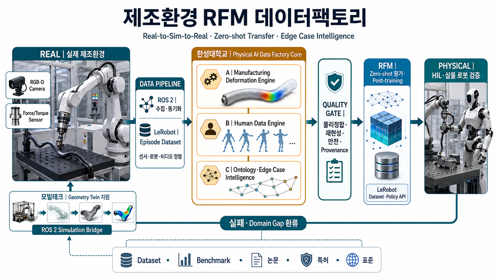
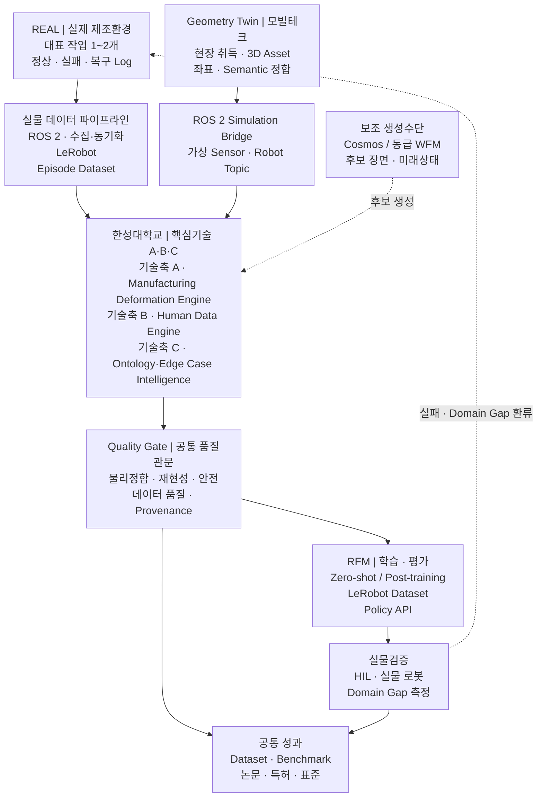
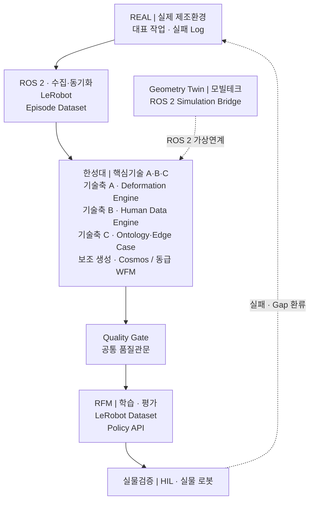

<style>
.md-typeset h1,
.md-typeset table {
  word-break: keep-all;
  overflow-wrap: normal;
}
.nowrap {
  white-space: nowrap;
}
@media screen and (max-width: 29.99rem) {
  .md-typeset h1 {
    font-size: 1.45rem;
    line-height: 1.35;
  }
}
</style>

# 제조환경 Digital Twin·Deformation Engine 기반 로봇 파운데이션 모델(RFM) 데이터팩토리

:material-circle-outline:{ style="color:#e0a800" } **컨소시엄 제안** · 산업통상부 공고 제2026-549호
연구개발과제 1 「로봇 데이터팩토리 구축 및 로봇파운데이션모델(RFM) 개발」

> **실물 제조환경의 Geometry Twin 을 측정 기반 Deformation·Physics Twin 으로 고도화하고,
> 실패·복구 데이터를 자동 검수해 RFM 학습·평가·실물 재검증으로 환류하는 제조 데이터팩토리입니다.**

!!! info "이 문서의 내용은 세 가지 상태가 섞여 있습니다"
    | 상태 | 해당 내용 |
    |---|---|
    | **2026-09-01 R&R 반영** | 담당 분야, 확정 4대 역할, 연차별 개발 산출물·대표 정량목표·연구성과 |
    | **제안·잠정** | 대표 정량목표의 기준선·시험조건, 연차 완료 Gate, 연구개발비 금액 환산 |
    | **확인 필요** | 대표 제조 작업·소재·로봇, RFM 인터페이스, 실증환경, 예산 5 % 의 모수, 모빌테크 협약 형태 |

    제안·잠정 수치는 협약 목표로 인용하지 않습니다.

---

## 1. 과제 정의

### 무엇을 만드는 과제인가

대상 범위는 **2단 구조**입니다. RFP 의 **6대 대표공정**(토트 박스 옮기기 · 토트 박스 쌓기 ·
비전 활용 불량 검사 · 박스 포장 패키징 마감 · Bin Picking · Kitting)에 대해서는 **디지털
트윈을 연차별 누적으로 전량 구축**합니다 — 1차 2개 → 2차 누계 4개 → 3차 누계 6개 →
4차 버전 동결·이관. 그중 **대표 제조 작업 1~2개**를 심화 대상으로 선정하고, 그 작업 하나를
다음 순환으로 끝까지 관통시킵니다. 세 기술축을 각각 범용 제조 플랫폼으로 개발하는
과제가 아닙니다.

```
실제 데이터 수집 → 가상환경 물리 보정 → RFM 취약조건과 실패·복구 데이터 생성
   → 자동 검수 → RFM 재학습 → 실제 로봇 재검증 → 실패·Domain Gap 환류
```

요약하면 **실제 로봇의 실패를 가상환경에서 재현하고, 학습 가능한 데이터로 바꾸는 일**입니다.
6대 대표공정의 트윈은 전량 구축하되, 심화 대상 작업을 정해 한 바퀴를 완주해야 각 단계의
수치가 서로 연결되어 검증됩니다.

### 공고 정합성

| 항목 | 공고 기준 |
|---|---|
| 내역사업 | 로봇산업기술개발 (로봇산업핵심기술개발) |
| 주관연구개발기관 | 제한없음 |
| 지원규모 | 7,500백만원 |
| 수행기간 | 43개월 — 1차 9개월 · 2차 10개월 · 3차 12개월 · 4차 12개월 |
| 과제유형 | 일반 · **원천기술형** · **품목지정형** |
| 과제특징 | 초격차 (R&D자율성트랙(일반) 신청 가능) |
| 접수 | 2026. 8. 21.(금) ~ **9. 11.(금) 18:00**, 범부처통합연구지원시스템(IRIS) |
| 평가 배점 | 기술성 60 / 연구역량 20 / 사업화·경제성 20 — 종합 70점 미만 지원제외 |
| 대학 지원비율 | 정부지원연구개발비 **연구개발비의 100% 이하**, 기관부담 현금은 필요시 |

### 대학 참여기관으로서의 적합성

| 평가 관점 | 본 제안의 대응 근거 |
|---|---|
| RFP·품목 부합성 | 데이터팩토리(데이터 생성·정제·관리)와 RFM(학습·평가) 사이의 **제조 물리·의미 계층**을 담당 |
| 목표의 도전성 | 시각 중심 Digital Twin 을 **접촉·변형·누적상태가 반영되는 Physics Twin** 으로 전환 |
| 연구조직 역량 | OmniLRS 기반 Isaac Sim·ROS 2 시뮬레이션과 변형지형·HILS 수행실적, HSU-PAC 인프라 |
| 연구 인프라 | GPU·Isaac Sim·ROS 2·NAS·실물 로봇을 갖춘 [HSU-PAC](../hsu-pac.md) 을 **참여기업 공동 Testbed** 로 개방 |
| 지역·인력 파급 | Physical AI 마이크로디그리 과정으로 데이터 생산과 인력양성을 동시 수행 |

---

## 2. 기관 역할

### 컨소시엄 안에서의 기관 위계

> **한성대학교는 실환경–가상환경 연계형 데이터 증강 분야의 책임기관으로서 4대 연구개발
> 역할을 총괄하며, 모빌테크는 한성대학교가 정의한 요구규격에 따라 현장 공간정보 취득과
> Simulation-ready Geometry Twin 구축을 지원합니다.**

| 공식 역할 | 한성대학교 핵심기술 | 모빌테크 지원내용 |
|---|---|---|
| **① Real-to-Sim-to-Real 고도화** | Manufacturing Deformation Engine · Physics Calibration · Domain Gap 평가 | 현장 Scan · Geometry Twin · Simulation-ready Asset |
| **② Zero-shot Transfer 기반 도메인 적응** | 미학습조건 평가 · Transferability Score · Transfer Decision · 경량 적응 | 공간·설비·배치 변화 Asset · Asset Version |
| **③ 엣지 케이스 시뮬레이션** | Human Data Engine · Ontology·Edge Case Intelligence · Quality Gate | 실패·경계조건 재현을 위한 Geometry·Semantic Metadata 보완 |
| **④ 학술 연구 및 기술 자문** | 논문·특허·표준·벤치마크·인터페이스 자문 | 산업현장 사례 · Asset 구축·적용자료 제공 |

두 기관의 경계는 **형상까지가 모빌테크, 물리 반응부터가 한성대학교**입니다.
세 기술축은 위 네 역할 **아래에** 놓입니다 — ① 아래 Deformation Engine,
③ 아래 Human Data Engine 과 Ontology·Edge Case Intelligence 입니다.

!!! note "「책임기관」과 「대표기관」은 다릅니다"
    책임기관은 **담당 분야의 책임**을 뜻하며 전체 컨소시엄의 주관기관을 뜻하지 않습니다.
    모빌테크의 법적 참여형태가 확정되기 전까지 **「한성대 책임 · 모빌테크 세부지원」** 으로
    표기를 통일합니다.

### 확정된 담당 분야와 4대 역할

**담당 분야 — 실환경–가상환경 연계형 데이터 증강.**
실환경에서 얻기 어려운 조건을 가상에서 만들어내고, 그것이 실환경에서도 통하는지 확인해
되먹이는 일입니다. 데이터의 양을 부풀리는 작업이 아닙니다.

| # | 주요 역할 | 무엇을 하는가 | 이 역할이 없으면 |
|:--:|---|---|---|
| ① | **Real-to-Sim-to-Real 고도화(디지털 트윈)** | 실제 공정을 물리적으로 반응하는 Twin 으로 옮기고, 그 결과를 실환경에서 검증해 파라미터를 되먹인다 | 가상에서 만든 데이터가 실제와 다른지 확인할 방법이 없다 |
| ② | **Zero-shot Transfer 기반 도메인 적응** | 실환경–가상환경 격차를 요인별로 정의·측정하고, 증강으로 좁혀 **추가 학습 없이** 실물에서 동작하게 한다 | 현장마다 다시 학습해야 하고, 데이터팩토리의 값어치가 떨어진다 |
| ③ | **엣지 케이스 시뮬레이션** | 실제로는 드물게 나타나는 실패·경계·복구 상황을 의도적으로 생성해 학습 가능한 데이터로 만든다 | 정상 동작만 축적되고, 위험한 상황은 학습되지 않는다 |
| ④ | **학술 연구 및 기술 자문** | 위 세 가지를 논문·특허·표준 제안으로 정리하고 컨소시엄 기술 판단에 근거를 제공한다 | 결과가 과제 안에만 남고 검증·재사용 경로가 없다 |

---
## 3. 세 핵심기술

한성대학교의 고유 성과는 아래 세 축과 공통 계층입니다. 우선순위는 다음 순서로 고정합니다.

| 순위 | 핵심기술 | 무엇을 하는가 |
|:--:|---|---|
| **①** | **Manufacturing Deformation Engine** | 대표 작업의 접촉·변형·잔류상태를 실측으로 보정하고 검증한다 |
| **②** | **Human Data Engine** | 실패 직전 상태를 저장·복원해 복구 행동을 여러 갈래로 늘린다 |
| **③** | **Manufacturing Ontology·Edge Case Intelligence** | 작업–상태–실패–복구를 구조화해 RFM 의 취약조건을 찾는다 |
| **공통** | **Quality Gate · RFM Interface · 실물검증** | 생성 데이터를 공통 품질관문으로 거른 뒤 RFM 에 공급하고 실물로 되검증한다 |

### 기술축 A · Manufacturing Deformation Engine

**물리엔진을 새로 개발하지 않습니다.** Isaac Sim 과 OmniLRS 위에서 동작하는
**제조 변형·물성 보정 모듈**을 개발합니다. OmniLRS 변형지형 연구에서 축적한 접촉·변형 구동과
계측 경험을 제조환경의 Contact–Material–State 모델로 파생시키는 작업입니다.

6대 대표공정 트윈에는 공정별 기본 물리 프로파일을 적용하되, 실측 대조를 통한 정밀 검증은
범용 엔진이 아니라 **대표 작업 1~2개의 접촉력·변형·잔류상태를 실측과 대조해 검증하는
범위로 한정**합니다. 소재군을 넓히면 물성시험 횟수가 그만큼 늘어나므로, 범위 확장은
예산·기간과 함께 결정합니다.

| 구성물 | 내용 |
|---|---|
| 물리 특성 보정 기능 | 실제 센서·영상에서 마찰·접촉·강성값을 추정해 가상환경 파라미터를 맞춘다 |
| 제조 변형 모사 기능 | 삽입·압입에서 생기는 압축·복원·잔류변형을 가상환경에서 재현한다 |
| Material Library | 대표 소재의 마찰·강성·감쇠·복원·임계값과 불확실성 범위 |
| 실제–가상 비교 리포트 | 동일 조건에서 실물과 가상의 접촉력·변형 차이를 수치로 제시 |

### 기술축 B · Human Data Engine

사람이 만든 시연·복구 데이터를 로봇 학습 데이터로 바꾸는 축입니다. 핵심 기능은 다음
네 단계입니다.

```
실패상태 저장·복원 → 복구행동 분기 → 자동검수 → 실로봇 Grounding
```

실패 직전의 로봇 관절각·물체 위치·접촉 상태를 저장해 두고 그 지점으로 되돌아가면,
**하나의 실패에서 여러 복구 데이터**를 얻습니다. 실제 로봇으로 실패 상황을 매번 처음부터
만들 필요가 없습니다. 생성된 복구 행동은 자동 검수를 거쳐 소량의 실로봇 시험으로
Grounding 합니다.

수행 인력과 마이크로디그리 과정은 **7절 수행인력·교육체계**에 있습니다.

### 기술축 C · Manufacturing Ontology·Edge Case Intelligence

`Asset → Process → Task → State → Event → Failure → Recovery` 구조로 **어떤 설비와 작업에서
어떤 상태 변화로 실패했고, 어떤 복구 행동이 효과적이었는지**를 연결해 저장합니다.

이 구조 위에서 물체 위치·각도·마찰·물성·센서오차를 조금씩 바꿔가며 **실패가 시작되는
경계조건**을 찾고, 그 조건을 가상환경에서 다시 만들어 복구 데이터 생성과 재학습에 씁니다.

### 공통 — Quality Gate · RFM Interface · 실물검증

**Quality Gate 는 세 기술축 뒤, RFM 공급 앞에 놓입니다.** Human Data Engine 전용 검수가
아니라 **생성 데이터 전체가 통과하는 공통 품질관문**입니다.

| 검수 항목 | 무엇을 보는가 |
|---|---|
| **물리정합** | 관통·비물리 가속·불가능한 접촉이 없는가 |
| **재현성** | 동일 입력조건에서 같은 결과가 다시 나오는가 |
| **안전** | 실물 적용 시 위험한 궤적·힘이 포함되지 않았는가 |
| **데이터 품질** | 규격·라벨·결측·중복이 기준을 만족하는가 |
| **Provenance** | 어느 Asset·시나리오·버전에서 나왔는지 추적되는가 |

RFM Interface 는 Observation·Action·Task·Embodiment 규약과 평가기준을 RFM 기관과 맞추는
공통 계층이고, 실물검증은 HSU-PAC 과 실증환경에서 Domain Gap 을 측정해 앞 단계로
되돌리는 계층입니다.

!!! note "NVIDIA Cosmos 와 World Foundation Model 의 위치"
    Cosmos 를 비롯한 WFM 은 **핵심기술이 아니라 후보 장면·미래상태를 생성하는 보조수단**입니다.
    한성대학교의 고유 성과는 **Deformation Engine, 실패·복구 데이터 증강, 취약조건 탐색,
    Quality Gate** 네 가지이며, 생성 도구는 교체 가능한 구성요소로 다룹니다.
    특정 모델에 종속되지 않도록 생성 조건 명세와 검수 절차를 도구와 분리해 정의합니다.

---

## 4. 폐루프 — 데이터가 도는 경로

<figure markdown>
  { width="1672" height="941" loading=lazy decoding=async }
  <figcaption markdown>전체 과제 개념도 — **한성대학교가 Physical&nbsp;AI&nbsp;Data&nbsp;Factory&nbsp;Core를 대표 수행**하고, 모빌테크는 Geometry Twin을 지원합니다. 실물 데이터는 ROS 2로 수집·동기화하여 LeRobot&nbsp;Episode&nbsp;Dataset으로 표준화하고, 가상환경은 ROS&nbsp;2&nbsp;Simulation&nbsp;Bridge로 연결합니다.</figcaption>
</figure>

위 이미지는 과제의 역할·기술·데이터 흐름을 한눈에 보여주는 요약이며, 아래 도식은 같은
폐루프를 텍스트 기반으로 제공합니다.

<div class="concept-diagram concept-diagram--desktop" markdown>



</div>

<div class="concept-diagram concept-diagram--mobile" markdown>



</div>

**차별화 지점은 생성이 아니라 폐루프입니다.** Quality Gate 를 통과한 데이터만 RFM 에
공급하고, 실물검증에서 확인된 Domain Gap 을 다시 현장·Twin·시나리오에 반영합니다.

세부 아키텍처(Work Package HSU-1~7, Versioned Episode Factory, HSU-PAC 구성)는
**[기술 상세](technical.md)** 에 있습니다.

---
## 5. 핵심 KPI

!!! note "이 목표값의 성격"
    본 목표값은 **제안 기준**이며, 1차년도에 대표 작업·소재·실증환경의 **기준선을 실측해
    세부 시험조건과 통계설계를 확정**합니다. **KPI 의 평가방향과 최소 목표수준은 유지합니다.**
    분모·반복횟수·산식·통계 기준은 **[연차별 목표](roadmap.md)** 의 측정 정의표에 있습니다.

!!! info "세계 최고·국내 수준 비교의 해석 기준 — 2026-09-04 공개자료 기준"
    동일 분모·시험조건·산식의 국제 공인 순위가 없어 `세계 최고 공개수준`에는 각 KPI와 가장
    가까운 최신 공개 연구를 기재했습니다. 다른 지표의 수치를 억지로 환산하지 않고 차이를 함께
    표시했습니다. 국내의 `공개치 미확인`은 기술 부재가 아니라 **동일 프로토콜의 비교 가능한
    정량값이 공개되지 않았음**을 뜻하며, 1차년도 기준선 실측 후 수치로 대체합니다.

### 물리 재현 — 기술축 A · Deformation Engine

| # | KPI | 목표 | 세계 최고 공개수준<br><small>보유국·기관/기업</small> | 연구개발 전 국내 수준<br><small>공개 확인 기준</small> | 측정 방법 |
|:--:|---|---|---|---|---|
| 1 | 대표 작업의 접촉력 재현오차 | **≤ 20 %** | **미국** · Columbia Univ.·SceniX·Google DeepMind — 연성체 물성 보정 공개, 동일 NRMSE는 미공개 | 동일 F/T 곡선 NRMSE 공개치 미확인 | 동일 물체·자세·속도에서 실제 힘 센서값과 가상환경값 비교 |
| 2 | 대표 소재의 잔류변형 재현오차 | **≤ 25 %** | **미국** · Columbia Univ.·SceniX·Google DeepMind — 영상 기반 연성체 물리 보정 공개, 동일 정규화오차는 미공개 | 반복하중 잔류변형 공개치 미확인 | 반복하중 조건에서 작업 전후 실제 형상과 가상 형상 비교 |
| 3 | 실제–가상 작업 성공률 차이 | **≤ 20 %p** | **미국** · Columbia Univ.·SceniX·Google DeepMind — 성공률 상관 **r = 0.901~0.944**<br><small>절대 %p 차이와 다른 지표</small> | 짝지은 Sim–Real 성공률 차이 공개치 미확인 | 같은 작업·조건에서 가상환경과 실제 로봇의 성공률 차이 |

### 데이터 생산과 검수 — 기술축 B · Human Data Engine · 공통 Quality Gate

| # | KPI | 목표 | 세계 최고 공개수준<br><small>보유국·기관/기업</small> | 연구개발 전 국내 수준<br><small>공개 확인 기준</small> | 측정 방법 |
|:--:|---|---|---|---|---|
| 4 | 주요 실패유형별 복구 데이터 확보율 | **≥ 80 %** | **중국·캐나다** · Current Robotics·Tsinghua·Peking·Toronto — Hi-WM 성공률 **+37.9 %p**<br><small>실패유형 coverage는 미공개</small> | Failure Taxonomy별 Recovery Coverage 공개치 미확인 | 사전 정의된 실패유형 중 유효한 복구 시나리오·데이터가 확보된 비율 |
| 5 | 엣지 케이스 데이터 검수 완료율 | **≥ 90 %** | **중국** · Shanghai AI Lab 연구팀 — SIM1 궤적 품질 필터링 공개, 동일 완료율은 미공개 | 생성 전체 대비 검수 완료율 공개치 미확인 | 생성 데이터 중 검수 절차가 완료된 비율 |

### 전이 성능 — ② Zero-shot Transfer

**Zero-shot 결과와 Post-training 결과를 분리해 보고합니다.** 두 값을 합쳐 제시하면
추가 학습 없이 얻은 성능인지 구분되지 않습니다.

| # | KPI | 목표 | 세계 최고 공개수준<br><small>보유국·기관/기업</small> | 연구개발 전 국내 수준<br><small>공개 확인 기준</small> | 측정 방법 |
|:--:|---|---|---|---|---|
| 7-a | **Zero-shot** — 미학습 물체·배치·물성조건 성능 유지율 | **≥ 70 %** | **중국** · Shanghai Jiao Tong Univ.·Horizon Robotics·Style3D — SimWeaver 5개 변형 작업 실물 성공률 **91.30 %**<br><small>유지율과 다른 지표</small> | 미학습 물체·배치·물성 유지율 공개치 미확인 | 추가 학습 없이 미학습 조건에서 기준환경 대비 작업성공률 |
| 7-b | **경량 적응·Post-training 후** 성능 유지율 | **≥ 90 %** | **중국·캐나다** · Current Robotics·Tsinghua·Peking·Toronto — Hi-WM base 대비 성공률 **+37.9 %p** | 동일 로봇·Task의 경량 적응 전후 공개치 미확인 | 소량 적응 학습 뒤 같은 조건에서 측정한 값 — 7-a 와 별도로 보고 |

### 최종 효과

| # | KPI | 목표 | 세계 최고 공개수준<br><small>보유국·기관/기업</small> | 연구개발 전 국내 수준<br><small>공개 확인 기준</small> | 측정 방법 |
|:--:|---|---|---|---|---|
| 6 | **실제 주요 실패의 가상환경 재현율** | **≥ 70 %** | **미국** · Columbia Univ.·SceniX·Google DeepMind — 실제–가상 정책 성능 상관 **r > 0.9**<br><small>실패 재현율과 다른 지표</small> | 실제 실패목록 대비 가상 재현율 공개치 미확인 | 실제 발생한 주요 실패를 가상환경에서 다시 만들어 낸 비율 |
| 8 | **엣지 케이스·복구 데이터 적용 후 실제 성공률 향상** | **+ 10 %p 이상** | **중국·캐나다** · Hi-WM 성공률 **+37.9 %p** · **중국** · SIM1 일반화 **+50 %** | 동일 실물시험의 재학습 전후 개선 공개치 미확인 | 생성 데이터로 재학습한 모델의 실제 로봇 성공률 변화 |

**국제 공개수준 근거:** [Real-to-Sim Robot Policy Evaluation](https://real2sim-eval.github.io/) ·
[Hi-WM](https://hi-wm.github.io/) · [SIM1](https://internrobotics.github.io/sim1.github.io/) ·
[SimWeaver](https://simweaver.github.io/)

**6번과 8번이 최종 효과 지표입니다.** 실제 실패를 가상에서 되살릴 수 있는지(6), 그렇게 만든
데이터가 실제 성능 개선으로 이어졌는지(8)를 봅니다.

---

## 6. 연차 계획과 예산

기간은 **43개월 · 4개 차년도** — 1차 9개월 · 2차 10개월 · 3차 12개월 · 4차 12개월입니다.
차년도별 목표·완료 Gate·완료 판정과 결과물 24건은 **[연차별 목표](roadmap.md)** 에 있습니다.

| 차년도 | 개발 단계 | 대표 결과물 |
|---|---|---|
| **1차 (9개월)** | 기준 시스템 | 6대 대표공정 트윈 구축계획·인수규격 v1(대상 2개 공정) · 대표 작업·실패유형 확정 · WFM–Physics Twin Reference Architecture · Domain Gap 프로토콜 v1 |
| **2차 (10개월)** | 증강 엔진 | 대표공정 트윈 누계 4개 · Physics Consistency Evaluator v1 · 제조 Domain Variation Library v1 · Edge Case Compiler v1 |
| **3차 (12개월)** | 전이 검증 | 대표공정 트윈 전량 6개 구축 완료 · Transfer Decision Manager · Multi-stage Validation Gate · Edge/Recovery 증강 Dataset |
| **4차 (12개월)** | 표준화 | 6대 대표공정 트윈 버전 동결·이관 · Closed-loop RoboOps Toolchain · Cross-domain Physical AI Benchmark · 기술 백서 |

### 연구개발비 (검토안)

**현재 총 17.0억 배분안을 검토 중입니다** — 한성대학교 13.0억, 모빌테크 4.0억.
정부지원연구개발비 5 % 의 모수가 확정되기 전까지 금액을 확정값으로 표시하지 않습니다.

| 차년도 | 기간 | 한성대 | 모빌테크 | 합계 | 근거 |
|---|---:|---:|---:|---:|---|
| 1차년도 | 9개월 | 2.3억 | 1.0억 | 3.3억 | 대상 선정·규격 확정 · Pilot Scan |
| 2차년도 | 10개월 | 3.4억 | 1.0억 | 4.4억 | 물리 가상환경 구축 · 공간 Twin 본 구축 |
| 3차년도 | 12개월 | 3.8억 | 1.0억 | 4.8억 | 데이터 생성·검수 · Asset 보완 |
| 4차년도 | 12개월 | 3.5억 | 1.0억 | 4.5억 | 순환 완주·실물 재검증 · Asset 갱신 |
| **합계** | **43개월** | **13.0억** | **4.0억** | **17.0억** | |

| 주요 역할 | 비중 | 금액 | 근거 |
|---|---:|---:|---|
| ① Real-to-Sim-to-Real 고도화 | 36 % | 4.7억 | 물성시험·보정·실물 대조가 이 항목에 몰림 |
| ② Zero-shot Transfer 도메인 적응 | 24 % | 3.1억 | 증강 조건 구성과 전이 평가 |
| ③ 엣지 케이스 시뮬레이션 | 25 % | 3.3억 | 실패 재현·복구 데이터 생성과 검증 |
| ④ 학술 연구·기술 자문 | 15 % | 1.9억 | 논문·특허·표준 제안과 자문 |
| **합계** | **100 %** | **13.0억** | |

!!! warning "통보 문구와 금액의 모수가 다릅니다 — 협약 전 확인 필요"
    2026-08-29 통보는 **「전체 정부지원연구개발비 기준 5 %」** 였습니다. 총액 17억은
    총사업비 340억의 5 % 에 해당하며, 공고문상 정부지원연구개발비(75억)의 5 %(3.75억)와는
    다릅니다. 협약서 근거 문구와 금액을 함께 확인해야 합니다.

!!! note "범위를 줄이면 금액이 따라 줄어드는 구조입니다"
    비중은 기관 수 균등배분이 아니라 수행범위와 투입인력에서 쌓아 올린 값입니다.
    범위 조정 순서는 **① 소재군 ② Use Case ③ Digital Twin 대상 ④ 반복 검증 횟수** 입니다.
    소재군을 2종에서 4종으로 늘리면 물성시험이 30회에서 60회 이상으로 늘어납니다.

### 성과지표 (4년 누계)

| 구분 | 1차 | 2차 | 3차 | 4차 | 누계 |
|---|:--:|:--:|:--:|:--:|:--:|
| SCI(E)급 논문 | — | 1 | 1 | 1 | **3** |
| 국내외 학술발표 | 1 | 2 | 2 | 2 | **7** |
| 특허 출원 / 등록 | — | 1 | 1 | 1 / 1 | **3 / 1** |
| SW 프로그램 등록 | — | 1 | 1 | 1 | **3** |
| 표준 제안 · 기술 백서 | — | — | — | 1 | **1** |

확정 역할 ④가 학술 연구 및 기술 자문인 만큼, 논문·특허는 부수 성과가 아니라
**협약 시 확정된 성과지표**로 관리합니다.

---

## 7. 수행인력과 교육체계

총 60,000시간 데이터 구축목표 중 한성대학교의 책임물량은 **Tele-operation 실로봇 데이터
<span class="nowrap">7,000시간(약 11.7 %)입니다.</span>** 데이터 생산 인력은
**Physical AI MD 교육과정을 통해** 양성하여, 조작·안전·검수 기준을 아는 인력이 데이터를 만들도록 합니다.

| 트랙 | 대상 | 하는 일 |
|---|---|---|
| **교과 실습** | MD 과정 수강생 연 30명 규모 | 표준 Protocol·ROS 2·LeRobot·안전·QC 학습, 실습 데이터 생성 |
| **유급 연구참여** | MD-3 이수자 중 연차별 선발 6→12→18→6명 | 과제 Dataset 생산, 복구 시연, 1차 검수 |

| 구분 | 1차 | 2차 | 3차 | 4차 | 누계 |
|---|--:|--:|--:|--:|--:|
| **원격조작 데이터** | **1,000시간** | **2,000시간** | **3,000시간** | **1,000시간** | **7,000시간** |

연구개발 Dataset 에 편입되는 데이터는 별도 계약·동의를 거친 유급 참여자가 생산하며,
준비시간, 대기시간과 정비시간을 제외하고 Quality Gate를 통과한 실로봇 Episode 채널시간만 계상합니다.
과정 구성과 운영 절차는 **[기술 상세](technical.md)** 에 있습니다.

이 체계는 기술축 B · Human Data Engine 의 **수행 인력 경로**이며, 기술축 자체의 명칭은
**Human Data Engine** 으로 통일합니다.

---

## 8. 확인이 필요한 사항

| # | 확인할 것 | 왜 필요한가 |
|:--:|---|---|
| 1 | **6대 대표공정 트윈 구축 순서와 심화 대표 작업 1~2개 선정** | 이 과제 전체가 여기서 출발합니다 — 1차년도 최우선 |
| 2 | **5 % 의 모수** — 정부지원연구개발비 총액 | 금액 환산의 기준 |
| 3 | **모빌테크 협약 형태** | 공동연구개발기관 참여를 우선 검토 — 최종 위치·금액은 협약에서 확정 |
| 4 | **실제 로봇·실증환경의 소재** | 원격조작 수집과 실물 재검증을 수행할 설비 |
| 5 | **RFM 기관의 모델 Interface** | KPI 7·8 의 평가 대상 |
| 6 | 정량 KPI 기준선과 측정 정의 | 위 항목이 닫힌 뒤 동결 |

---

## 더 읽을 것

- **[연차별 목표](roadmap.md)** — 차년도별 목표·완료 Gate·결과물 24건·KPI 측정 정의
- **[기술 상세](technical.md)** — Work Package HSU-1~7 · Deformation Engine 상세 ·
  Ontology·Edge Case · MD 과정 운영 · Cosmos·LeRobot 구축 최적화 · 검증 체계
- [한성대학교 Physical AI 교육·연구 플랫폼 HSU-PAC](../hsu-pac.md)

---

`Manufacturing Digital Twin` · `Deformation Engine` · `Human Data Engine` · `Manufacturing Ontology` · `Quality Gate` · `Robot Foundation Model` · `Isaac Sim` · `ROS 2` · `Sim-to-Real`
