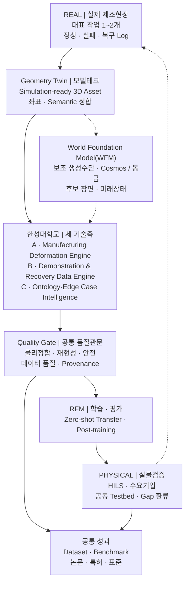
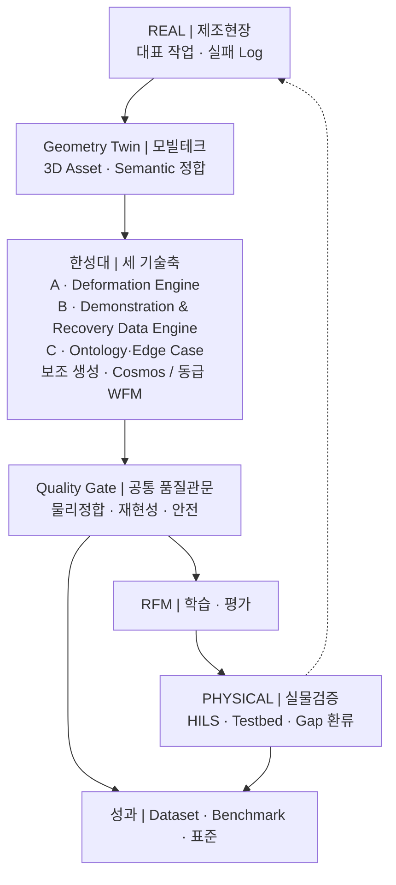
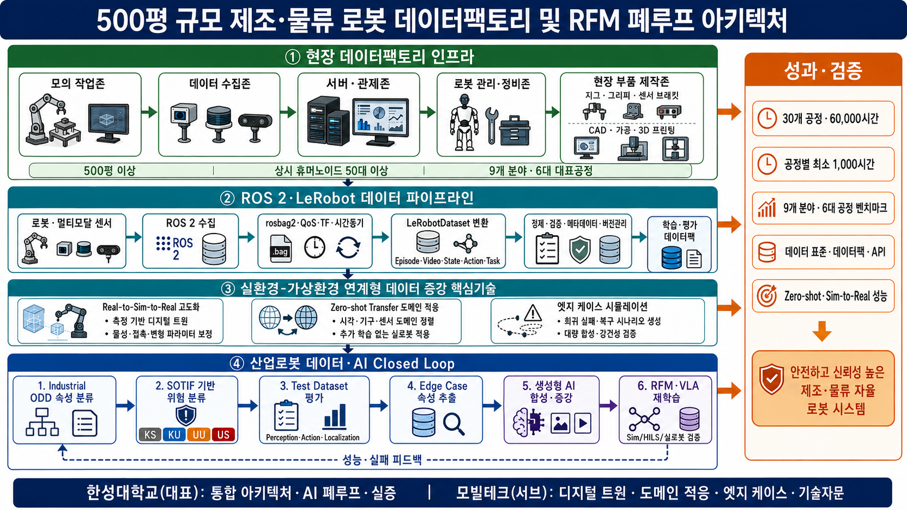
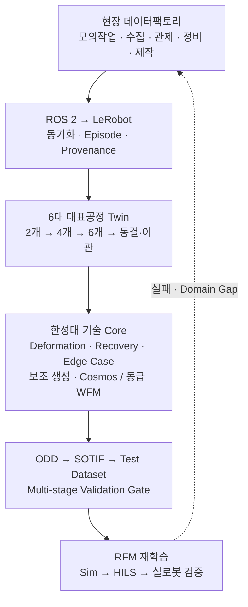

# 연차별 목표와 성과지표

**담당 분야 — 실환경–가상환경 연계형 데이터 증강**

산업통상부 공고 제2026-549호 · 연구개발과제 1
「로봇 데이터팩토리 구축 및 로봇파운데이션모델(RFM) 개발」

!!! info "2026-09-01 한성대 Physical AI R&R 최신본을 기준으로 정렬했습니다"
    | 상태 | 해당 내용 |
    |---|---|
    | **제안서 반영 기준** | 연차별 목표·연구내용·핵심 결과물·정량목표·성과지표, 담당 분야와 4대 역할 |
    | **측정설계·내부 관리** | KPI 분모·산식·반복·통계, 세부 완료판정, 연차별 자문 기록 |
    | **제안·잠정** | 대표 정량목표의 시험조건·기준선, 연구개발비 금액 환산 |
    | **확인 필요** | 대표 제조 작업·소재·로봇, RFM 인터페이스, 실증환경, 예산 5 % 의 모수, 모빌테크 협약 형태 |

    정량목표의 **목표값과 연차 귀속은 2026-09-01 R&R을 그대로 따릅니다.** 측정설계는
    목표값을 바꾸는 추가 KPI가 아니라, 협약 후 같은 방법으로 재현하기 위한 보조 정의입니다.
    대표 제조 작업·소재·실증환경이 확정되면 세부 시험조건을 컨소시엄 공통 기준으로 동결합니다.

    **제안·잠정 수치는 협약 목표로 인용하지 않습니다.** 대표 제조 작업·소재·실증환경이
    확정되고 기준 데이터를 실측한 뒤 **컨소시엄 공통 KPI 로 동결**합니다.

!!! info "함께 읽을 것"
    과제 개요·아키텍처·세부 R&R 은 **[대표 페이지](index.md)**,
    기술 근거와 수행 역량은 **[기술 상세](technical.md)** 에 있습니다.

기간은 **43개월 · 4개 차년도** — 1차 9개월 · 2차 10개월 · 3차 12개월 · 4차 12개월입니다.

---

## 한 줄로 말하면

> **한성대학교는 실제 로봇의 실패를 가상환경에서 재현하고, 학습 가능한 데이터로 바꾸는
> 일을 맡습니다.**

세 기술축을 각각 범용 플랫폼으로 개발하지 않습니다. **대표 제조 작업 1~2개**를 정하고,
그 작업 하나를 다음 순환으로 끝까지 관통시킵니다.

**차별화 포인트는 생성 자체가 아니라 폐루프입니다.** 물리·재현성·안전 Gate를 통과한
Episode만 RFM에 공급하고, 실물검증에서 확인된 Domain Gap을 다시 현장·Twin·Scenario에
반영합니다.

!!! note "왜 범위를 좁히는가"
    예산은 정부지원연구개발비의 **5 % 수준**이고 기간은 43개월입니다. 이 규모로 모든
    제조 소재와 공정을 다루는 범용 플랫폼을 만들면 어느 것도 끝까지 검증되지 않습니다.
    **대표 작업 1~2개를 골라 순환을 한 바퀴 완주하는 편이, 넓게 벌여 놓고 미완으로
    끝나는 것보다 컨소시엄에 쓸모가 있습니다.**

---

## 세 기술축의 구체화

**기존 개발 목표 항목은 그대로 유지합니다.** 세 기술축 — Manufacturing Deformation
Engine · Demonstration & Recovery Data Engine · Manufacturing Ontology·Edge Case Intelligence — 과
확정된 4대 역할(① Real‑to‑Sim‑to‑Real ② Zero-shot Transfer ③ Edge Case 시뮬레이션
④ 학술 연구·기술 자문)은 바뀌지 않았습니다.

바뀐 것은 **연차별 목표와 진행 내용**입니다. 각 축을 범용 플랫폼으로 개발하지 않고
**대표 제조 작업 1~2개**를 대상으로 구체화했습니다.

아래 표의 오른쪽 열은 그 기능이 **3절의 어느 개발 목표로 산출되는지**를 가리킵니다.
왼쪽이 한성대가 만드는 기능이고, 오른쪽이 그것이 컨소시엄에 전달되는 이름입니다.

### 기술축 A · Manufacturing Deformation Engine → 대표 작업의 물리 보정

모든 제조 소재를 다루지 않습니다. **대표 작업 1~2개**를 선정하고, 실제 센서와 영상으로
마찰·접촉·변형값을 추정해 가상환경을 보정하는 데 집중합니다.

| 개발하는 기능 | 무엇을 하는 기능인가 | 개발 목표로는 |
|---|---|---|
| **물리 특성 보정 기능** | 실제 센서·영상에서 마찰·접촉·강성값을 추정해 가상환경 파라미터를 맞춘다 | Physics Consistency Evaluator v1 · Physics Calibration |
| **제조 변형 모사 기능** | 삽입·압입에서 생기는 압축·복원·잔류변형을 가상환경에서 재현한다 | 제조 Domain Variation Library v1 |
| **대상 소재별 물성값** | 대표 소재를 실측해 시뮬레이션이 쓸 수 있는 물성 세트로 정리한다 | 제조 Domain Variation Library v1 |
| **실제–가상 비교결과** | 같은 조건에서 실물과 가상의 접촉력·변형 차이를 수치로 낸다 | Domain Gap 프로토콜 v1 · Transfer Decision Manager |

### 기술축 B · Demonstration & Recovery Data Engine → 실패상태 복원과 복구 행동 증강

학생이 먼저 실제 로봇을 원격조작해 정상 동작과 대표 실패·복구 사례를 수집합니다.
그다음이 핵심입니다 — **가상환경에서 실패 직전의 로봇 관절각·물체 위치·접촉 상태를
저장해 두고, 그 상태로 되돌아가 다른 복구 조작을 여러 번 시도합니다.**

실제 로봇으로 실패 상황을 매번 처음부터 만들지 않고도 **하나의 실패에서 여러 복구
데이터**를 얻습니다. 생성 데이터의 충돌·비정상 동작은 자동으로 걸러냅니다.

| 개발하는 기능 | 무엇을 하는 기능인가 | 개발 목표로는 |
|---|---|---|
| **원격조작 데이터 수집도구** | 학생이 실물 로봇을 조작해 정상·실패·복구를 규격대로 기록한다 | 데이터 수집환경 <small>(Edge Case Compiler 의 입력)</small> |
| **실패상태 저장·복원 기능** | 실패 직전의 관절각·물체 위치·접촉 상태를 저장해 그 지점으로 되돌린다 | Edge/Recovery 증강 Dataset |
| **복구 행동 증강 기능** | 되돌린 상태에서 다른 복구 조작을 반복 시도해 하나의 실패에서 여러 복구를 얻는다 | Edge/Recovery 증강 Dataset |
| **자동 데이터 검수 기능** | 충돌·관통·비정상 동작이 섞인 생성 결과를 자동으로 걸러낸다 | Multi-stage Validation Gate (다단계) |

### 기술축 C · Manufacturing Ontology·Edge Case Intelligence → RFM 취약조건 탐색

`Asset → Process → Task → State → Event → Failure → Recovery` 구조로 **어떤 설비와
작업에서, 어떤 상태 변화로 실패했고, 어떤 복구 행동이 효과적이었는지**를 연결해
저장합니다.

이후 실제 실패 사례나 RFM 평가결과를 기준으로 물체 위치·각도·마찰·물성·센서오차를
조금씩 바꿔가며 **실패가 시작되는 경계조건**을 찾고, 그 조건을 가상환경에서 다시 만들어
복구 데이터 생성과 재학습에 씁니다.

| 개발하는 기능 | 무엇을 하는 기능인가 | 개발 목표로는 |
|---|---|---|
| **작업·상태·실패·복구 관계 구조** | 어떤 작업의 어떤 상태 변화가 어떤 실패로 이어졌고 무엇이 복구에 통했는지 연결해 저장한다 | Scene–Action–State–Event 표준 v1 |
| **RFM 취약조건 탐색 기능** | 위치·각도·마찰·물성·센서오차를 조금씩 바꿔 RFM 이 실패하기 시작하는 경계를 찾는다 | Prompt·Condition Compiler v1 |
| **실제 실패 기반 가상 시나리오 생성 기능** | 찾아낸 경계조건을 실행 가능한 시뮬레이션 시나리오로 만든다 | Edge Case Compiler v1 |
| **실패유형별 복구 데이터** | 실패 유형을 나누고 유형마다 복구 데이터를 채운다 | Edge Case Taxonomy v1 · Edge/Recovery 증강 Dataset |

---

## 참고 연구 — 세 기술축이 서 있는 연구 흐름

최근 가상환경·시뮬레이션 기반 데이터 획득 연구는 **소량의 실제 데이터로 가상환경의 물리
특성을 보정하고, 현재 로봇 모델이 실패하기 쉬운 조건을 집중적으로 만들어 다시 학습하는**
방향으로 발전하고 있습니다. 또한 **생성한 데이터가 물리적으로 타당한지 자동으로 확인하고,
실제 환경에서 새롭게 발생한 실패를 다시 가상환경에 반영하는 반복 구조**에 대한 연구도
늘고 있습니다. 본 과제의 세 기술축은 이 흐름 위에 있습니다.

각 기술축이 **최근 연구 흐름 위에 있음**을 보이는 대표 연구입니다.
**본 과제에서 재현한 결과가 아니라 문헌으로 확인한 선행연구**이며, 우리가 무엇을
새로 만들 것인지는 각 세부 항목에 따로 적었습니다.

### 기술축 A — 물리 보정·Real-to-Sim 관련 연구

| 연구 | 검증된 핵심 결과 | 한계와 본 과제 반영 |
|---|---|---|
| **Real-to-Sim Robot Policy Evaluation with Gaussian Splatting Simulation of Soft-Body Interactions** (**ICRA 2026**, [arXiv:2511.04665](https://arxiv.org/abs/2511.04665)) | 실제 영상으로 외관과 soft-body 동역학을 식별해 twin을 구성했습니다. 3개 Task 각각에서 여러 정책·checkpoint 평가점의 시뮬레이션–실물 성공률 상관이 **Pearson r > 0.9**였습니다. | 실물학습 정책의 **평가 프록시**이며 Task별 초기조건도 16~27개입니다. 본 과제는 실물–가상 정책순위 상관과 신뢰구간을 먼저 검증합니다. |
| **Sim, Yet Same: Physics-Aligned Simulator as Zero-Shot Data Scaler in Deformable Worlds** (SIM1, **ECCV 2026**, [공식 프로그램](https://eccv.ecva.net/Conferences/2026/Videos), [arXiv:2604.08544](https://arxiv.org/abs/2604.08544)) | 제한된 시연으로 twin과 탄성 동역학을 보정한 뒤 합성 trajectory를 확장했습니다. **1:15 실데이터 등가비**, 실물 **zero-shot 90 %**, 미관측 의류 **20 %→70 %**를 보고합니다. | 소재별 전문가 수동 튜닝이 필요하고 의류 중심입니다. Material Profile 보정·비용대비 성능·미관측 소재 검증의 근거로만 사용합니다. |
| **SimWeaver: Zero-Shot RGB Sim-to-Real for Deformable Manipulation** ([arXiv:2606.15338](https://arxiv.org/abs/2606.15338), 2026-06 프리프린트) | 면밀도·굽힘강성·신장·마찰 같은 **측정 가능한 물성값**을 소재군 라이브러리로 관리하고 Task당 합성 시연 200개로 학습했습니다. 5개 연성작업×23회에서 평균 **91.30 %**(Wilson 95 % CI **84.7–95.2 %**)를 보고했으며, 광학 증강 제거 시 5개 Task가 모두 0 %였습니다. | 무보정이 아니라 **소재군 측정값을 정하고 Asset을 해당 class에 결합**하는 구조입니다. 실데이터와의 엄격한 정면 비교는 silk grasping 중심입니다. Material Profile 재사용·ISP 광학 증강·Task별 신뢰구간을 Gate로 반영합니다. |
| **Differentiable Physics‑based System Identification for Robotic Manipulation of Elastoplastic Materials** (DPSI, **IJRR 2025**, [DOI](https://doi.org/10.1177/02783649251334661), [arXiv:2411.00554](https://arxiv.org/abs/2411.00554)) | **한 번의 실제 상호작용과 불완전한 3D point cloud**로 Young’s modulus·Poisson ratio·yield stress·마찰 등 재료·환경 파라미터를 식별합니다. | 국소최적·비식별성·모델 불일치가 남고 체적형 탄소성 재료 범위입니다. 물성 추정값에 **식별 불확실성과 재현오차**를 함께 저장합니다. |
| **Scalable Real2Sim: Physics-Aware Asset Generation Via Robotic Pick‑and‑Place Setups** (**IROS 2025**, [DOI](https://doi.org/10.1109/IROS60139.2025.11246653), [arXiv:2503.00370](https://arxiv.org/abs/2503.00370)) | RGB-D와 joint torque로 **시각 mesh·충돌 geometry·관성 파라미터**를 자동 생성합니다. | 강체 pick‑and‑place·특정 setup 중심입니다. 모빌테크 Geometry Twin을 한성대 Physics Twin으로 잇는 **Geometry–Physics Hand-off** 근거로 사용합니다. |
| **Harnessing with Twisting: Single-Arm Deformable Linear Object Manipulation for Industrial Harnessing Task** (**IROS 2024**, [DOI](https://doi.org/10.1109/IROS58592.2024.10802801), [arXiv:2410.10729](https://arxiv.org/abs/2410.10729)) | FANUC/NIST ATB4에서 실제 trajectory 40개로 학습해 단일 전선 두 Task **각 10/10**, 순차 다중전선 **9/10 후 8/9**를 보고했습니다. | 제한된 workcell·소표본입니다. 본 과제는 **산업용 배선·삽입형 대표작업**에서 별도 재검증합니다. |

**본 과제와의 연결** — 이 연구들은 **① 평가 프록시 검증 ② 합성데이터 확장
③ 측정 물성 재사용 ④ asset 자동생성·물성 식별 ⑤ 산업 제조작업 검증**의 근거입니다.
본 과제는 대표 제조작업 1~2개에서 실물–가상 정책순위 상관을 확인하고, 접촉력·변위·
잔류변형의 재현오차와 식별 불확실성을 통과한 Episode만 학습데이터로 편입합니다.
Zero-shot과 보정·Post‑training 성능은 서로 다른 평가군으로 분리합니다.

### 기술축 B — 실패상태 복원·복구 증강 관련 연구

| 연구 | 검증된 핵심 결과 | 한계와 본 과제 반영 |
|---|---|---|
| **DreamGen: Unlocking Generalization in Robot Learning through Video World Models** (**CoRL 2025**, [PMLR](https://proceedings.mlr.press/v305/jang25a.html), [arXiv:2505.12705](https://arxiv.org/abs/2505.12705)) | 단일 pick‑and‑place 원격조작 데이터로 비디오 월드모델을 적응시키고 생성영상의 pseudo‑action을 복원했습니다. 논문은 **월드모델 2,884개**, 정책 미세조정 **2,885개** trajectory를 단계별로 표기하며 신규 행동 성공률 **11.2 %→43.2 %**를 보고합니다. | 상당량의 단일 Task seed data를 다양성으로 확장한 연구이며 실패·복구 전용은 아닙니다. 정상·경계 행동 생성과 pseudo‑action 검증 근거로 한정합니다. |
| **Hi-WM: Human-in-the-World-Model for Scalable Robot Post-Training** ([arXiv:2604.21741](https://arxiv.org/abs/2604.21741), 2026-04 프리프린트) | 실패 직전 상태를 cache해 **rollback·branching**한 뒤 사람이 짧은 교정행동을 입력합니다. 3개 실물 Task·2개 정책에서 base 대비 평균 **+37.9 %p**, 사람 교정 없는 WM 대비 **+19.0 %p**, 실물 상관 **r=0.953**을 보고합니다. | 평균의 **cell별 시행횟수와 신뢰구간이 제시되지 않아** 불확실성을 재계산하기 어렵습니다. 본 과제는 상태 재생오차와 Task별 표본수·신뢰구간을 Gate에 포함합니다. |
| **EgoRecovery: Acquiring Failure Recovery Ability Through Human Recovery Demonstration** ([arXiv:2607.19745](https://arxiv.org/abs/2607.19745), 2026-07 프리프린트) | 1인칭 인간 복구데이터를 trajectory 자체가 아닌 **교정 시점·크기의 compact corrective intent**로 정렬하고 recovery gate가 필요한 상태에서만 활성화합니다. 시간당 수용 데이터는 인간 **516.5건**, 로봇 **49.0건**이었고, 50 robot success+50 robot recovery+300 human recovery 조건에서 초기 성공률 **80.0 %**, 복구 성공률 **85.0 %**였습니다. | 인간 복구데이터만 쓴 경우 복구 성공률은 **8.8 %**였고 embodiment별 접촉·재파지에는 로봇 복구데이터가 필요했습니다. 같은 Task family의 관련 실패까지만 검증됐으므로 **소량 실로봇 grounding set과 전문가 안전판정**을 반드시 결합합니다. |
| **Set-Supervised Diffusion Policy: Learning Action-Chunking Diffusion through Corrections** (**RSS 2026**, [공식 논문](https://www.roboticsproceedings.org/rss22/p080.html), [arXiv:2606.01865](https://arxiv.org/abs/2606.01865)) | 교정 episode의 **로봇 부정 action chunk와 사람 긍정 chunk를 함께 보존**합니다. 50개 시연+40개 교정 episode의 Insert-T에서 **35/40**, 일반 Diffusion Policy는 **23/40**이었습니다. | 사람의 적시 교정과 특정 Task에 의존합니다. positive/negative chunk·개입시점·교정주체를 함께 저장하는 데이터 계약 근거로 사용합니다. |

**본 과제와의 연결** — DreamGen은 **행동·환경 확장**, Hi-WM은 **실패 직전 상태
저장·복원·분기 교정**, EgoRecovery는 **사람 복구 intent와 실로봇 grounding**,
Set-Supervised Diffusion Policy는 **부정·긍정 action chunk 보존**의 근거입니다.
Demonstration & Recovery Data Engine은 `실패상태 cache → 다중 교정 branch → 사람 복구 intent → 소량 실로봇 grounding
→ 실물 재검증`으로 정의합니다. 학생 데이터는 실로봇 복구데이터를 대체하지 않으며
유급 참여·안전 Protocol·전문가 최종판정을 전제로 합니다.

### 기술축 C — 실패 조건 탐색·재현 관련 연구

| 연구 | 검증된 핵심 결과 | 한계와 본 과제 반영 |
|---|---|---|
| **Fail2Progress: Learning from Real-World Robot Failures with Stein Variational Inference** (**CoRL 2025**, [PMLR](https://proceedings.mlr.press/v305/huang25d.html), [arXiv:2509.01746](https://arxiv.org/abs/2509.01746)) | 관측 실패와 유사한 조건을 시뮬레이션에서 병렬 생성해 targeted dataset을 만들고 재학습했습니다. 계층적 tabletop 정리 **86 %**(원본 11 %), 미관측 7객체 **71 %**를 보고합니다. | Sim2Real gap 보정은 다루지 않았고 상태가 pose 중심이라 마찰·질량중심·변형물성을 제외했습니다. 본 과제는 물성을 상태에 포함하고 재현오차를 검증합니다. |
| **From Reaction to Anticipation: Proactive Failure Recovery through Agentic Task Graph for Robotic Manipulation** (AgentChord, **RSS 2026**, [공식 논문](https://www.roboticsproceedings.org/rss22/p180.html), [arXiv:2605.11951](https://arxiv.org/abs/2605.11951)) | task graph에 예상 실패와 복구 분기를 실행 전에 붙입니다. 실물 6개 작업×20회 평균 **77.5 %**, 복구데이터 fine‑tuning에서 실패 시나리오 **39/50**을 보고합니다. | 예상하지 못한 실패모드와 IK 불가능 복구가 남습니다. graph 규칙뿐 아니라 RFM 취약조건 탐색을 병행합니다. |
| **ASPIRE: Agentic /Skills Discovery for Robotics** ([arXiv:2607.00272](https://arxiv.org/abs/2607.00272), 2026-07 프리프린트) | **실패 진단→수정→검증→스킬 축적** 순환에서 **LIBERO-Pro macro 평균 72 %**, 실로봇 soda-can Task **13/20→19/20**을 보고합니다. | 완전 자율 실세계 학습기가 아니며 frozen frontier LLM·사전정의 API·높은 연산비용에 의존합니다. 자동 검수는 물리·규칙 Gate로 둡니다. |
| **Predictive Red Teaming: Breaking Policies Without Breaking Robots** (RoboART, **CoRL 2025**, [PMLR](https://proceedings.mlr.press/v305/majumdar25a.html)) | 12개 off-nominal 조건과 500회 이상 hardware trial로 실패율을 예측했습니다. 성공률 예측오차 **0.19 미만**, 표적 데이터 효율 **2~7배**를 보고합니다. | 시각·환경 교란 중심이며 모든 접촉물리를 포괄하지 않습니다. RFM 취약조건의 **안전한 선별·우선순위화** 근거입니다. |
| **Geometric Red-Teaming for Robotic Manipulation** (GRT, **CoRL 2025**, [PMLR](https://proceedings.mlr.press/v305/goel25a.html)) | 실제 CrashShapes에서 성공률이 원래 형상 **90 %**에서 적대 형상 **22.5 %**로 낮아졌고 blue-team 재학습 후 최대 **90 %**로 회복됐습니다. | geometry-only 탐색이며 사용자 제약과 연산비용이 필요합니다. Geometry Twin에서 실패경계를 찾고 재학습하는 근거입니다. |

**본 과제와의 연결** — 기존 실패의 재현·graph 복구·스킬 수정에 더해 RoboART와 GRT는
**미관측 시각·환경·형상 취약조건을 능동 탐색**합니다. 본 과제는
`Asset → Process → Task → State → Event → Failure → Recovery`를 제조 Ontology로 기록하고,
발견 조건을 Edge Case Compiler로 재현해 재학습·실물 재검증까지 닫습니다.

### D 공통 검증·전이 판정·데이터 품질 관련 연구

| 연구 | 검증된 핵심 결과 | 한계와 본 과제 반영 |
|---|---|---|
| **Evaluating Real-World Robot Manipulation Policies in Simulation** (SIMPLER, **CoRL 2024**, [PMLR](https://proceedings.mlr.press/v270/li25c.html)) | 2개 robot embodiment·8개 Task family에서 **1,500회 이상** sim–real paired evaluation을 수행했습니다. | 강체·고정 camera·특정 system 중심입니다. Transfer Decision Manager의 **정책선별용 사전 Gate**로 쓰되 변형체 상관은 별도 검증합니다. |
| **Can We Detect Failures Without Failure Data? Uncertainty-Aware Runtime Failure Detection for Imitation Learning Policies** (FAIL‑Detect, **RSS 2025**, [공식 논문](https://www.roboticsproceedings.org/rss21/p073.html)) | failure data 없이 success-only uncertainty로 4개 simulation·2개 hardware Task를 평가해 최상 평균 balanced accuracy가 simulation 약 **78 %**, hardware 약 **72 %**였습니다. | ID-only calibration에서는 OOD true-negative rate가 0에 가까워질 수 있습니다. OOD·경계 실패를 별도 평가군으로 확보합니다. |
| **Curating Demonstrations using Online Experience** (Demo-SCORE, **RSS 2025**, [공식 논문](https://www.roboticsproceedings.org/rss21/p071.html)) | online 성공·실패 classifier를 교차검증하고 demonstration을 선별·재학습해 성공률을 **15~35 %p** 높였습니다. | rollout 비용과 Task별 classifier가 필요합니다. 데이터 Quality Gate를 **수집→선별→재학습→실물평가** 폐루프로 운영합니다. |

**본 과제와의 연결** — SIMPLER는 전이 전 정책선별, FAIL‑Detect는 runtime OOD·실패 Gate,
Demo-SCORE는 online 경험 기반 데이터 선별의 근거입니다. 합성데이터를 무조건 편입하지 않고
승인 순서는 **① 전이 가능성 ② 실패·OOD ③ 데이터 품질 ④ 실로봇 재검증**입니다.

!!! note "인용 원칙"
    위 수치는 **각 논문의 특정 Task·장비·표본에서 나온 보고값**이며 본 과제 KPI나 자체
    재현 결과가 아닙니다. 게재처·서지는 논문·학회·출판사 원문을 2026-09-02 기준으로
    확인했습니다. SimWeaver·Hi-WM·EgoRecovery·ASPIRE는 arXiv 프리프린트로, 나머지는
    확인된 학회·저널을 병기했습니다. 목표치는 제조작업 기준선 확정 후 별도 관리합니다.

---

## 2-2. 연구개발 목표 및 내용

<figure class="concept-diagram concept-diagram--desktop" markdown>
  { width="1672" height="941" loading=lazy decoding=async }
  <figcaption markdown>현장 데이터팩토리에서 수집한 데이터를 실환경–가상환경 연계형 증강과 RFM 재학습으로 환류하는 전체 구조 · [원본 이미지 열기](../../assets/manufacturing-rfm-data-factory-system-architecture-v6.png)</figcaption>
</figure>

<small>모바일에서는 상세 시스템 블록도를 핵심 데이터·검증 폐루프로 압축해 표시합니다. 전체 세부 항목은 위쪽의 원본 이미지 링크에서 확대해 확인할 수 있습니다.</small>

!!! note "제안서 작성 기준"
    본 절의 연차별 목표는 **상위과제 전체 통합 관점**으로 작성했습니다. 한성대학교는
    공동연구개발기관9로서 실환경–가상환경 연계형 데이터 증강, 디지털 트윈, 도메인 적응,
    Edge Case 생성, 데이터 품질·평가 및 RFM 환류 기술을 담당합니다. 모빌테크는
    한성대학교의 서브·협력기관으로 Geometry Twin, Simulation‑ready Asset, 공간 정합 및
    현장 갱신을 지원합니다.

    500평 이상 데이터팩토리, 상시 휴머노이드 50대 이상, 9개 분야·6대 대표공정,
    30개 공정·60,000시간 리얼데이터는 **상위과제 공동 목표**입니다. 한성대학교는 이
    상위목표에 필요한 디지털 트윈, 도메인 적응, Edge Case 생성, 데이터 품질·평가 및
    RFM 환류 기술을 담당합니다.

    본문에서 **Zero-shot Transfer**는 목표 로봇에서 **추가 정책학습 없이** 정책을 적용하는
    것으로 정의합니다. Zero-shot Transfer 성능이 기준에 미달할 때 수행하는 Few‑shot·LoRA는
    **Fallback Adaptation(후속 경량 적응)**으로 분리하고 별도 평가군과 지표로 관리합니다.
    Hardware‑in‑the‑Loop 관련 용어는 **HILS(Hardware‑in‑the‑Loop Simulation)**로 통일합니다.

### [1단계] (1) 1차년도 — 기준 시스템 및 연계 기반 확보

##### ① 개발 목표

**[공동연구개발기관9(한성대학교)]**

- **Real‑to‑Sim‑to‑Real 디지털 트윈 기술 고도화**: 6대 대표공정 디지털 트윈 구축에 착수하고 대상 2개 공정의 기준 Scene과 인수규격을 확정
- **Zero‑shot Transfer 기반 도메인 적응**: 추가 정책학습 없는 미학습조건 평가체계와 기준환경 성능 측정계획을 수립
- **Edge Case 시뮬레이션**: 작업–상태–실패–복구 관계와 정상·실패·복구 데이터 수집기반을 정의
- **학술 연구 및 기술 자문**: 실제·가상·RFM 연계규격, 재현성 관리체계 및 학술성과 추진기반을 확립

##### ② 개발 내용 및 범위

**[공동연구개발기관9(한성대학교)]**

**가. Real‑to‑Sim‑to‑Real 디지털 트윈 기술 고도화**

- **6대 대표공정 디지털 트윈 구축계획과 인수규격 확정**
    - 6대 대표공정(토트 박스 옮기기·토트 박스 쌓기·비전 활용 불량검사·박스 포장 패키징 마감·Bin Picking·Kitting)의 구축순서를 1차 2개, 2차 누계 4개, 3차 누계 6개로 확정하고 컨소시엄 승인을 획득
    - 공정별 작업 셀·대상물·로봇·센서 배치의 Scene 구성규격과 공정 트윈 인수검사 기준 수립
    - 공정별 ODD·Task Metadata 서식 v1 정의 및 9개 분야·30개 세부공정으로 확장 가능한 공통서식 마련
    - 1차년도 대상 2개 공정의 기준 Geometry Asset 인수와 Scene 구성·시나리오 실행 검증
- **대표 제조작업과 실제–가상 비교기준 확정**
    - 6대 대표공정 중 실측 물성 보정과 폐루프 완주의 심화대상 대표작업 1~2개, 소재 및 접촉현상을 선정하고 컨소시엄 승인을 획득
    - 실제 센서·F/T·영상·형상 측정항목과 취득조건 정의
    - Domain Gap Protocol v1 수립: 측정항목·조건·반복횟수·판정기준·통계방법 명시
- **Geometry–Physics Interface 정의 및 기준 Asset 인수**
    - 모빌테크 Pilot Scan·기준 Geometry Asset 인수규격과 검수기준 확정
    - 좌표계·축척·원점·Semantic Metadata 연계규격 합의 및 승인
    - Data Factory–Physics Twin–RFM Reference Architecture 수립과 실제·가상·RFM 데이터 흐름 정의

**나. Zero‑shot Transfer 기반 도메인 적응**

- **미학습조건 평가체계 설계**
    - 미학습 물체·배치·물성·복합조건의 구분정의 및 평가셋 설계
    - Zero‑shot Performance Retention 측정 Protocol 초안 작성과 적응 전 측정원칙 명시
    - 기준환경 작업성공률의 Baseline 측정계획 수립
    - Model Adapter v1의 실환경·가상환경·RFM 데이터 연계규격 정의

**다. Edge Case 시뮬레이션**

- **작업–상태–실패–복구 관계구조 정의**
    - Scene–Action–State–Event 표준 v1 수립
    - Edge Case Taxonomy v1 구축 및 대표작업 주요 실패유형 확정
- **Demonstration & Recovery Data Engine 수집기반 정의**
    - 정상·실패·복구 데이터의 수집항목과 상태변수 정의
    - 실패 직전 상태의 Checkpoint Schema 초안 작성

**라. 학술 연구 및 기술 자문**

- **RFM 연계규격 기술자문**
    - RFM 기관과 Observation·Action·Task·Model Interface 및 평가기준 협의
- **재현 가능한 기준환경 구축과 성과관리**
    - 모델버전·Seed·입력조건 기반 생성·검증 이력의 재현체계 확보
    - 국내외 학술발표 1건 및 기술문서·자문 의견서 1건

!!! success "1차년도 완료조건"
    **제안 목표(안)**: 6대 대표공정 트윈 구축계획·인수규격 및 대표작업·실패유형의 컨소시엄 승인, 대상 2개 공정 Scene 구성·시나리오 실행검증, 기준 Geometry Asset 인수검사, 좌표계·Semantic 규격 승인, Domain Gap 측정기준 확정을 완료합니다. 동일 Seed·Model·Asset·입력조건에서 주요 상태변수의 허용오차 내 재현율은 **95 % 이상**, 필수 Observation·Action·Task 필드 변환 성공률은 **99 % 이상**을 목표로 합니다.

**지원 산출물 인수조건(모빌테크)**: 좌표계·축척·Semantic 규격을 충족하고 1차년도 대상 2개 공정의 기준 Asset 인수검사를 통과해야 합니다.

### [2단계] (1) 2차년도 — Deformation·Data Engine v1 개발

##### ① 개발 목표

**[공동연구개발기관9(한성대학교)]**

- **Real‑to‑Sim‑to‑Real 디지털 트윈 기술 고도화**: 6대 대표공정 디지털 트윈을 누계 4개 공정으로 확장하고 Manufacturing Deformation Engine v1을 개발
- **Zero‑shot Transfer 기반 도메인 적응**: 미학습조건 성능유지율과 전이 가능성을 정량화하는 평가기준과 지표를 개발
- **Edge Case 시뮬레이션**: 실행 가능한 생성조건 Compiler와 실패·복구 데이터 수집환경을 구축
- **학술 연구 및 기술 자문**: 물리 보정·도메인 적응 방법론을 논문화하고 특허·SW·기술자문 성과를 확보

##### ② 개발 내용 및 범위

**[공동연구개발기관9(한성대학교)]**

**가. Real‑to‑Sim‑to‑Real 디지털 트윈 기술 고도화**

- **6대 대표공정 디지털 트윈 확장: 누계 4개 공정**
    - 추가 2개 공정의 Simulation‑ready Asset 인수와 작업 셀·대상물·로봇·센서 Scene 구성
    - 구축 공정별 기본 Physics Profile 적용 및 Material Profile의 공정 단위 Mapping
    - Manufacturing Domain Variation Library v1의 공정 단위 적용: 마찰·공차·재질·조명조건 변이
    - 공정 트윈 LOD·Collision·Metadata 인수검사와 공정별 버전 등록
- **Manufacturing Deformation Engine v1 개발**
    - 대표소재의 마찰·강성·감쇠·복원·임계값 실측 및 Material Profile 구축
    - 접촉·압축·복원·잔류변형 모사기능 개발: 범용 Physics Engine의 신규개발이 아니라 Isaac Sim 등 기존 Simulator 기반 제조특화 물리모듈로 구현
    - Manufacturing Domain Variation Library v1 구축
- **Physics Calibration 및 정합성 검증**
    - 실측 물성값의 Physics Twin 적용과 Parameter Identification·Calibration 절차 수립
    - Physics Consistency Evaluator v1 개발 및 생성결과의 물리적 가능성 자동판정
    - 모빌테크 Simulation‑ready Asset의 LOD·Collision·Metadata 인수검사 수행

**나. Zero‑shot Transfer 기반 도메인 적응**

- **전이 가능성 지표 개발**
    - Transferability Score v1 개발 및 미학습조건 성능유지율의 지표·측정법 정의
    - Zero‑shot Transfer 기준환경 Baseline과 미학습조건 평가셋 설계
    - 조건별 물체·배치·물성·복합조건 분리측정과 Macro‑average 산출방식 확정

**다. Edge Case 시뮬레이션**

- **생성조건 Compile 체계 구축**
    - Prompt·Condition Compiler v1 개발 및 생성조건을 Simulation 실행조건으로 변환
    - Edge Case Compiler v1 개발 및 RFM 취약·경계조건을 실행 가능한 Scenario로 변환
- **Demonstration & Recovery Data Engine 수집환경 가동**
    - 실패 직전 상태 Checkpoint 저장기능 v1 개발
    - 원격조작 기반 정상·실패·복구 데이터 수집환경 가동
    - Scene–Action–State–Event 규격에 따른 데이터 축적체계 운용

**라. 학술 연구 및 기술 자문**

- **방법론 성과화**
    - 물리 보정·도메인 적응 방법론 SCI(E) 논문 1편 및 학술발표 2건 추진
    - Manufacturing Deformation Engine SW 프로그램 등록 1건
    - 특허출원 1건 및 기술문서·자문 의견서 1건

!!! success "2차년도 완료조건"
    **제안 목표(안)**: 누계 4개 공정의 Geometry Asset LOD·Collision·Metadata 검수, 실측 물성 적용, 접촉력 재현오차 NRMSE **20 % 이하**, 물리 비정합 데이터 탐지 Recall **85 % 이상** 및 False Positive Rate **15 % 이하**, Checkpoint 저장과 정상·실패·복구 데이터 수집환경 가동을 완료합니다.

**지원 산출물 인수조건(모빌테크)**: 누계 4개 공정 Asset의 LOD·Collision·Metadata 검수를 통과하고 Simulation‑ready Asset이 Physics Twin에서 정상 구동해야 합니다.

### [3단계] (1) 3차년도 — Zero‑shot Transfer 및 Edge/Recovery 검증

##### ① 개발 목표

**[공동연구개발기관9(한성대학교)]**

- **Real‑to‑Sim‑to‑Real 디지털 트윈 기술 고도화**: 나머지 2개 공정을 추가해 6대 대표공정 디지털 트윈을 완성하고 실측 기반 재보정·실물연계 검증을 수행
- **Zero‑shot Transfer 기반 도메인 적응**: 추가 정책학습 없는 전이 판정과 Fallback Adaptation을 분리해 성능유지율·회복률을 검증
- **Edge Case 시뮬레이션**: 실패상태 복원·복구행동 다중분기·다단계 Validation Gate를 연결한 사전 폐루프를 완주
- **학술 연구 및 기술 자문**: 전이 평가·Edge Case 검증 방법론을 논문화하고 RFM 기관의 데이터셋·평가기준 수립을 지원

##### ② 개발 내용 및 범위

**[공동연구개발기관9(한성대학교)]**

**가. Real‑to‑Sim‑to‑Real 디지털 트윈 기술 고도화**

- **6대 대표공정 디지털 트윈 전체 구축: 누계 6개 공정**
    - 나머지 2개 공정 Asset 인수·Scene 구성으로 6대 대표공정 트윈 구축 완료
    - 공정별 세부 Scenario 실행 Script를 연계해 9개 분야·30개 세부공정 Scenario 확장 지원
    - 6개 공정 트윈의 Simulation–HILS–Real Robot Interface 적용성 점검: Domain Gap 정밀측정은 심화 대표작업을 우선 수행
- **실측 기반 재보정과 실물연계 검증**
    - Physics Calibration 수행 및 실측 물성값 기반 가상환경 물리 Parameter 재보정
    - Simulation–HILS–Real Robot 공통 Interface 구축
    - 동일 Asset Version 기준 실제–가상 성능차이 측정과 Domain Gap 분석

**나. Zero‑shot Transfer 기반 도메인 적응**

- **전이판정과 단계적 적응**
    - Transfer Decision Manager 개발: 직접 적용·경량 적응·추가학습·적용보류 판정
    - Zero‑shot 평가군은 추가 정책학습 없이 측정하고, 기준 미달 시에만 Few‑shot·LoRA 기반 Fallback Adaptation을 별도 평가
    - OOD·위험도 평가기능 개발과 미학습조건 평가셋 기반 탐지성능 확보
    - Zero‑shot Performance Retention과 Fallback Adaptation Recovery Rate의 분리 측정·보고체계 확립

**다. Edge Case 시뮬레이션**

- **복구 데이터 증강과 품질관문**
    - 상태 Restore·복구행동 다중분기 v1 개발 및 하나의 실패에서 복수 복구데이터 확보
    - Multi‑stage Validation Gate 구축: 물리정합·재현성·안전·데이터 품질·Provenance 다단계 검수
    - Edge/Recovery 증강 Dataset 구축: 정상·실패·복구·가상생성을 구분하고 학습·검증·평가 용도 표시
    - 대표 실패유형 1건 이상의 사전 폐루프 완주: 저장 → 복원 → 분기 → Gate → HILS

**라. 학술 연구 및 기술 자문**

- **전이 평가방법론 성과화**
    - 전이 평가·Edge Case 검증 방법론 SCI(E) 논문 1편 및 학술발표 2건 추진
    - Multi‑stage Validation Gate SW 프로그램 등록 1건
    - 특허출원 1건 및 기술문서·자문 의견서 1건
    - RFM 기관과 데이터셋 Schema·평가기준 협의 및 기술자문

!!! success "3차년도 완료조건"
    **제안 목표(안)**: Zero‑shot Performance Retention **70 % 이상**을 추가 정책학습 전에 측정하고, Fallback Adaptation Recovery Rate는 별도 산정합니다. 전이 판정 일치도 **80 % 이상**, OOD 탐지 Recall **85 % 이상**, 생성 데이터 검수 완료율 **90 % 이상**, 동일 Asset Version 기반 Simulation–HILS–Real 비교 및 6대 대표공정 트윈 구축을 완료합니다.

**지원 산출물 인수조건(모빌테크)**: 6대 대표공정 전체 Asset과 변동조건 Asset을 제공하고 공정별 Version Traceability를 확보해야 합니다.

### [4단계] (1) 4차년도 — Closed‑loop 완주 및 표준화

##### ① 개발 목표

**[공동연구개발기관9(한성대학교)]**

- **Real‑to‑Sim‑to‑Real 디지털 트윈 기술 고도화**: 6대 대표공정 디지털 트윈의 최종 Version을 동결·이관하고 제3자 재현성을 검증
- **Zero‑shot Transfer 기반 도메인 적응**: Robust Operating Envelope와 Cross‑domain Benchmark를 통해 강건성·일반화 성능을 종합검증
- **Edge Case 시뮬레이션**: 실패 재현–복구 생성–RFM 재학습–실물 재검증의 Closed‑loop를 자동화하고 1회 이상 완주
- **학술 연구 및 기술 자문**: 데이터·평가·Validation 절차의 표준안과 기술백서를 완성하고 최종 학술·지식재산 성과를 확보

##### ② 개발 내용 및 범위

**[공동연구개발기관9(한성대학교)]**

**가. Real‑to‑Sim‑to‑Real 디지털 트윈 기술 고도화**

- **6대 대표공정 디지털 트윈 Version 동결과 이관**
    - 6대 대표공정 Twin Asset·Scenario·Metadata의 최종 Version 동결과 재현성 검증
    - 공정별 Twin Package의 데이터팩토리 주관기관 이관과 활용절차 문서화
    - 제3자 재현절차에 6대 대표공정 Twin을 포함하고 절차만으로 재현 가능한 수준 확보
- **실물 재검증과 운용체계 확립**
    - 실제 실패의 가상환경 재현과 재학습 모델의 실물로봇 재검증
    - Real‑to‑Sim‑to‑Real 운용 Guideline 완성과 제3자 재현시험
    - 최종 Geometry·Physics Twin Version 동결과 재현성 검증

**나. Zero‑shot Transfer 기반 도메인 적응**

- **강건성 평가와 일반화 검증**
    - Robust Operating Envelope 평가모듈 개발 및 모델의 안정 동작조건 범위 측정
    - Cross‑domain Physical AI Benchmark 구축 및 작업·소재 변화에 공통 적용 가능한 비교기준 확립
    - Zero‑shot과 Fallback Adaptation의 적용조건·일반화 성능 검증 및 Model Version 변경 대응절차 수립

**다. Edge Case 시뮬레이션**

- **폐루프 완주와 자동화**
    - Closed‑loop RoboOps Toolchain 개발: 실패 재현 → 복구 생성 → RFM 재학습 → 재검증 자동화
    - 소량 실로봇 Grounding을 수행해 3차년도 기능을 실로봇·RFM과 연결
    - Real Failure → ODD/Edge Attribute Extraction → Simulation Reproduction → Recovery Generation → RFM Retraining → Sim/HILS/Real Validation 순환 1회 이상 완주
    - Edge/Recovery 데이터 적용 전후의 실제 성공률 변화, 안전위반 및 Recovery Rate 병행보고

**라. 학술 연구 및 기술 자문**

- **표준화와 최종 성과화**
    - 데이터·평가·Validation 절차 표준제안 1건
    - Engine 규격·측정정의·운용절차를 수록한 최종 기술백서 1건
    - SCI(E) 논문 1편, 학술발표 2건, 특허출원 1건·등록 1건 및 Closed‑loop RoboOps Toolchain SW 등록 1건 추진
    - 컨소시엄 기술 의사결정 지원과 기술문서·자문 의견서 1건

!!! success "4차년도 완료조건"
    **제안 목표(안)**: 실제 주요 실패 가상 재현율 **70 % 이상**, 복구 데이터 확보율 **80 % 이상**, Edge Case Coverage **80 % 이상**, 재학습–실물 재검증 순환 1회 이상, 증강 전 대비 대표 Edge Case 작업성공률 **10 %p 이상 향상**, 제3자 절차 재현율 **90 % 이상**, 6대 대표공정 Twin Version 동결·이관 완료를 목표로 합니다.

**지원 산출물 인수조건(모빌테크)**: 최종 실증공간 Asset 갱신을 완료하고 6대 대표공정 Geometry Twin Version을 동결해야 합니다.

---

## 2-3. 연구개발과제 수행일정 및 주요 결과물

### 가. 차년도별 수행일정

| 세부 연구개발 내용 | 1차년도 <small>9개월</small> | 2차년도 <small>10개월</small> | 3차년도 <small>12개월</small> | 4차년도 <small>12개월</small> |
|---|---|---|---|---|
| 6대 대표공정 Digital Twin | 구축계획·인수규격 확정, 대상 2개 공정 Scene 검증 | 추가 2개 공정 확장, 누계 4개 공정 인수 | 나머지 2개 공정 확장, 누계 6개 공정 완성 | 6개 공정 Twin Version 동결·이관 |
| Real‑to‑Sim‑to‑Real | 대표작업·Domain Gap Protocol·Geometry–Physics Interface 확정 | Manufacturing Deformation Engine·Physics Consistency Evaluator v1 | Physics Calibration·Simulation–HILS–Real 비교 | 실제 실패 재현·실물 재검증·운용 Guideline |
| Zero‑shot Transfer | 미학습조건 평가셋·Baseline 측정계획 | Transferability Score v1·조건별 평가기준 | Zero‑shot 판정과 Fallback Adaptation 분리검증 | Robust Operating Envelope·Cross‑domain Benchmark |
| Edge/Recovery Data | S‑A‑S‑E 표준·Taxonomy·Checkpoint Schema | Prompt·Condition/Edge Case Compiler v1·수집환경 | 상태 Restore·복구행동 분기·증강 Dataset | Closed‑loop RoboOps Toolchain·실로봇 Grounding |
| Validation·RFM 연계 | 재현성·Interface·평가기준 확정 | 물리 가능성 자동판정·품질검수 | Multi‑stage Validation Gate·사전 폐루프 | RFM 재학습·Sim/HILS/Real Validation 완전 폐루프 |
| 학술 연구·기술 자문 | 학술발표 1건·기술문서/자문 1건 | SCI(E) 1편·발표 2건·SW 1건·특허출원 1건 | SCI(E) 1편·발표 2건·SW 1건·특허출원 1건 | 표준제안·기술백서·논문·특허·SW 최종 성과화 |

### 나. 단계별 Milestone

| Milestone | 완료 시점 | 완료 조건 |
|---|:--:|---|
| **M1. 기준 시스템·연계규격 확정** | 1차년도 말 | 6대 공정 구축계획 승인, 2개 공정 Scene 검증, 대표작업·실패유형·Domain Gap Protocol·Geometry–Physics Interface 확정 |
| **M2. Deformation·Data Engine v1** | 2차년도 말 | 누계 4개 공정 Twin 인수, Deformation Engine·Physics Consistency Evaluator·Compiler v1 및 실패·복구 수집환경 가동 |
| **M3. Zero‑shot·Edge/Recovery 검증** | 3차년도 말 | 누계 6개 공정 Twin 완성, Zero‑shot/Fallback 분리평가, Multi‑stage Validation Gate 및 Sim–HILS–Real 비교 완료 |
| **M4. Closed‑loop 완주·표준화** | 4차년도 말 | 6개 공정 Twin Version 동결·이관, RFM 재학습–실물 재검증 순환 완주, Benchmark·Guideline·표준·백서 완성 |

### 다. 차년도별 주요 결과물 및 인수 기준

| 차년도 | 주요 결과물 | 주관·협력 | 주요 인수·완료 기준 |
|:--:|---|---|---|
| **1차** | 6대 공정 구축계획·인수규격, 대상 2개 공정 Scene, ODD·Task Metadata v1, Domain Gap Protocol v1, S‑A‑S‑E 표준 v1, Edge Case Taxonomy v1 | 한성대 기준·연계규격 총괄 모빌테크 기준 Asset 지원 | **제안 목표(안)**: 주요 상태변수 허용오차 내 재현율 ≥ 95 %, 필수 Observation·Action·Task 필드 변환 성공률 ≥ 99 % |
| **2차** | 누계 4개 공정 Twin, Manufacturing Deformation Engine v1, Material Profile, Domain Variation Library v1, Physics Consistency Evaluator·Compiler v1 | 한성대 Engine·평가 총괄 모빌테크 Simulation‑ready Asset 지원 | **제안 목표(안)**: 접촉력 NRMSE ≤ 20 %¹, 물리 비정합 탐지 Recall ≥ 85 %, False Positive Rate ≤ 15 %, 실패·복구 수집환경 가동 |
| **3차** | 누계 6개 공정 Twin, Transfer Decision Manager, Edge/Recovery 증강 Dataset, Multi‑stage Validation Gate, Simulation–HILS–Real Interface | 한성대 전이·폐루프 총괄 모빌테크 변동조건 Asset 지원 | **제안 목표(안)**: Zero‑shot Performance Retention² ≥ 70 %, 전이 판정 일치도 ≥ 80 %, OOD 탐지 Recall ≥ 85 %, 데이터 검수 완료율 ≥ 90 %. Fallback Adaptation Recovery Rate³ 별도 산정 |
| **4차** | 6개 공정 Twin 동결·이관, Robust Operating Envelope, Cross‑domain Benchmark, Closed‑loop RoboOps Toolchain, 운용 Guideline·표준·기술백서 | 한성대 통합·검증 총괄 모빌테크 최종 Asset 동결 지원 | **제안 목표(안)**: 실제 실패 재현율 ≥ 70 %, 복구 데이터 확보율 ≥ 80 %, Edge Case Coverage ≥ 80 %, 대표 Edge Case 성공률 +10 %p 이상, 제3자 절차 재현율 ≥ 90 % |

<small>¹ 대표 소재·접촉속도·힘 범위·반복횟수 및 NRMSE 정규화 분모는 시험평가계획서에서 정의합니다. ² Zero-shot Performance Retention = 미학습조건 작업성공률 ÷ 기준조건 작업성공률 × 100. ³ Fallback Adaptation Recovery Rate = 경량 적응 후 작업성공률 ÷ 기준조건 작업성공률 × 100.</small>

### 라. 연차별 개발목표 요약

| 구분 | 핵심 개발목표 | 핵심 키워드 |
|:--:|---|---|
| **1차년도** | 기준 시스템·연계규격 확정 및 대표공정 Twin 구축 착수 | 2 Processes / Protocol / Interface / Baseline |
| **2차년도** | Deformation·Data Engine v1 개발 및 대표공정 Twin 확장 | 4 Processes / Physics / Compiler / Data Engine |
| **3차년도** | Zero‑shot Transfer·Edge/Recovery 검증 및 대표공정 Twin 완성 | 6 Processes / Transfer / Recovery / HILS |
| **4차년도** | Closed‑loop 완주, Twin 동결·이관 및 표준화 | Freeze & Transfer / RoboOps / Benchmark / Standard |

### 마. 연차별 기술 발전 구조

1. **1차년도** — 6대 공정계획 승인 → 대상 2개 공정 Scene → Domain Gap Protocol → Geometry–Physics Interface → 평가 Baseline
2. **2차년도** — 누계 4개 공정 Twin → Deformation Engine v1 → Physics Consistency Evaluator → Compiler v1 → 데이터 수집환경
3. **3차년도** — 누계 6개 공정 Twin → Physics Calibration → Zero‑shot/Fallback 분리판정 → Edge/Recovery 증강 → HILS 검증
4. **4차년도** — Twin Version 동결·이관 → 실제 실패 재현 → 복구 생성 → RFM 재학습 → Sim/HILS/Real Validation → 표준화

### 바. 최종 산업로봇 데이터·AI Closed Loop

> **Industrial ODD 속성 분류 → SOTIF 기반 위험 분류 → Test Dataset 평가 → Edge Case 추출 → 생성형 AI 합성·증강 → RFM·VLA 재학습 → Sim/HILS/실로봇 검증 → ODD·데이터 수집조건 환류**

!!! warning "정량목표 사용 원칙"
    위 연차 완료 Gate는 **제안 단계의 잠정 관리기준**입니다. 상위과제의 필수 규모지표
    (500평 이상, 상시 휴머노이드 50대 이상, 9개 분야·6대 대표공정, 30개 공정·60,000시간,
    공정별 최소 1,000시간)와 구분하며, 대표 작업·로봇·소재·실증환경과 기준선이 확정된 뒤
    컨소시엄 공통 시험조건·분모·반복횟수·통계방법으로 동결합니다.

---

## 부록. 연차별 기술축·내부 완료 Gate 상세

### 한눈에 보기 — 핵심 기술 · 연차별 목표 · 핵심 결과물

차년도별 목표와 그 해에 내는 결과물입니다. 결과물 이름은 **2026-08-29 R&R 확정본의
개발 목표** 그대로이며, 아래에 **기술축 관점 매트릭스**와 **세부 20건 표**가 이어집니다.

| 차년도 | 연차별 목표 | 공식 역할 | 대표 결과물 |
|---|---|:--:|---|
| **1차년도** <small>9개월 · 기준 시스템</small> | 대표 작업·실패유형을 확정하고 **Real–Sim 비교 기준**을 문서로 고정 | ① Real‑to‑Sim‑to‑Real · ② Zero-shot 평가정의 · ③ Edge Case 기초 · ④ 인터페이스 자문 | Data Factory–Physics Twin–RFM Reference Architecture Domain Gap 프로토콜 v1 |
| **2차년도** <small>10개월 · 증강 엔진</small> | 대표 소재 물성을 실측해 **Physics Twin을 보정**하고 **Manufacturing Deformation Engine v1 · Edge Case Compiler v1 · 수집환경** 가동 | ① Physics 개발 · ② 전이평가 기반 · ③ 데이터 수집환경 | Physics Consistency Evaluator v1 Edge Case Compiler v1 |
| **3차년도** <small>12개월 · 전이 검증</small> | 추가 정책학습 없는 **Zero-shot 전이 여부를 판정**하고 실패 시 Fallback Adaptation을 분리 수행 | ② Zero-shot 전이판정·Fallback 분리 · ③ Edge/Recovery Dataset · ① Physics 재보정 · ④ 평가자문 | Transfer Decision Manager Edge/Recovery 증강 Dataset |
| **4차년도** <small>12개월 · 통합·실증</small> | **Real Failure → Simulation → Recovery → RFM Retraining → Sim/HILS/Real Validation 완전 폐루프**를 완주 | ①②③ 폐루프 통합 · ④ 표준화·학술성과 | Closed‑loop RoboOps Toolchain Cross-domain Physical AI Benchmark |

<small>핵심 기술 — **기술축 A · Manufacturing Deformation Engine**(대표 작업의 물리 보정) ·
**기술축 B · Demonstration & Recovery Data Engine**(시연·실패상태 복원과 복구 증강) ·
**기술축 C · Manufacturing Ontology·Edge Case Intelligence**(RFM 취약조건 탐색).
「핵심 기술」 열은 그 해에 관여하는 축을 비중 순으로 적은 것입니다.
차년도별 목표·완료 Gate·완료 판정은 아래 각 절에 있습니다.</small>

### 핵심기술 × 연차 — 세 축이 4년에 걸쳐 어떻게 개발되는가

같은 20건을 **기술축 관점**으로 다시 배열한 것입니다. 위 표가 「그 해에 무엇을 내는가」라면,
이 표는 「그 축이 4년 동안 어떻게 자라는가」를 봅니다.

| 핵심기술 | 1차 · 기준 시스템 | 2차 · 증강 엔진 | 3차 · 전이 검증 | 4차 · 표준화 |
|---|---|---|---|---|
| **① Manufacturing Deformation Engine** <small>대표 작업의 물리 보정</small> | **Domain Gap 프로토콜 v1** | Physics Consistency Evaluator v1 제조 Domain Variation Library v1 Transferability Score v1 | Transfer Decision Manager **Physics Calibration** | Robust Operating Envelope 평가모듈 <small>③ 과 공동</small> |
| **기술축 B · Demonstration & Recovery Data Engine** <small>시연·실패상태 복원과 복구 증강</small> | <small>수집 대상 실패유형과 정상·실패·복구 데이터 항목 정의</small> | **데이터 수집환경 가동** <small>Edge Case Compiler 의 입력</small> | Multi-stage Validation Gate <small>(주도)</small> **Edge/Recovery 증강 Dataset** | **Closed‑loop RoboOps Toolchain** <small>상태 저장·복원 · 복구 다중 분기 · 실로봇 Grounding</small> |
| **기술축 C · Manufacturing Ontology ·Edge Case Intelligence** <small>RFM 취약조건 탐색</small> | **Scene–Action–State– Event 표준 v1** Edge Case Taxonomy v1 | Prompt·Condition Compiler v1 **Edge Case Compiler v1** | Edge/Recovery 증강 Dataset <small>(취약조건 기반 생성 조건 제공)</small> | **Cross-domain Physical AI Benchmark** |
| **공통 · ④ 학술·자문** | **Data Factory–Physics Twin–RFM Reference Architecture** <small>평가방법론·공통 RFM Interface·표준화 자문</small> | — | HILS·실로봇 평가방법론 Multi-stage Validation Gate <small>(공통 Quality Gate)</small> | 운용 가이드라인 기술 백서 |

<small>굵게 표시한 것이 그 축·그 해의 대표 결과물입니다. 한 결과물이 두 축에 걸치는 경우
(Edge Case Compiler · Edge/Recovery Dataset · Validation Gate · RoboOps Toolchain)는
**주 담당 축에 두고 다른 축에 병기**했으므로, 표 전체의 항목 수는 20건보다 많아 보입니다.

**축 사이 선후관계** — ③ 이 관계 구조를 세워야 ② 가 무엇을 수집할지 정해지고,
① 이 물리를 맞춰야 3차년도 생성 데이터가 검증 대상이 됩니다.</small>

### 기관별 역할과 연차 완료조건

한성대학교가 각 연차의 목표를 총괄하고, 모빌테크는 그 목표에 필요한 Geometry Asset 을
요구규격에 맞춰 지원합니다. 완료조건은 **한성대 연차 완료조건**과 **모빌테크 지원 산출물
인수조건**으로 나누어 적고, 둘을 함께 만족한 상태를 **통합 검증조건**으로 봅니다.

| 차년도 | 한성대학교 대표 목표 | 모빌테크 세부 지원 | 한성대 연차 완료조건 | 지원 산출물 인수조건 |
|:--:|---|---|---|---|
| **1차** | 대표 작업·실패유형·평가절차·데이터 규격 확정 | Pilot Scan · 기준 Geometry Asset 제공 | Geometry Asset 을 인수하고 **Geometry–Physics Interface 승인** | 좌표계·축척·Semantic 규격 충족, 인수검사 통과 |
| **2차** | 실측 물성 기반 **Deformation Engine v1** 과 데이터 수집환경 가동 | Simulation‑ready Asset · LOD·Collision·Metadata 제공 | **Physics Twin 구동**과 접촉력 재현오차 기준 충족 | LOD·Collision·Metadata 검수 통과, Physics Twin 정상 구동 |
| **3차** | 미학습조건 Zero-shot 전이 판단 · Fallback Adaptation 분리 · Quality Gate · **Edge/Recovery Dataset** 구축 | 변동조건 Asset 과 Geometry 갱신 | 생성데이터 검수와 **Sim–HILS–실로봇 평가 완료** | 동일 Asset 버전 제공과 버전 추적성 확보 |
| **4차** | Real Failure–Simulation–Recovery–RFM 재학습–**Sim/HILS/실로봇 완전 폐루프 완주** | 최종 실증공간 Asset 갱신·지원 | **대표 Edge Case 작업성공률 향상**과 폐루프 1회 이상 완주 | 최종 Geometry Twin 버전 동결과 실증 지원 완료 |

### 기술축 B(Demonstration & Recovery Data Engine)의 연차 전개

핵심 기능은 **4차년도에 처음 개발하는 것이 아닙니다.** 3차년도에 상태 복원과 복구 분기를
완성하고, 4차년도에는 이를 실로봇·RFM 과 연결해 폐루프를 닫습니다.

| 차년도 | Demonstration & Recovery Data Engine 개발내용 |
|:--:|---|
| **1차** | 주요 실패유형, 정상·실패·복구 데이터 항목과 **상태변수 정의** |
| **2차** | 실패 직전 상태 **Checkpoint·저장 기능 v1**, Teleoperation 수집환경 가동 |
| **3차** | 상태 **Restore·복구행동 다중 분기 v1**, 자동검수, Edge/Recovery Dataset |
| **4차** | 소량 실로봇 **Grounding**, RFM 재학습, 실제 로봇 재검증 |

!!! note "3차년도 중간 완료조건"
    4차년도에 통합위험이 몰리지 않도록 **3차년도 말까지 대표 실패유형 1건 이상에 대해
    「실패상태 저장 → 복원 → 복구행동 분기 → Quality Gate → HILS 평가」 사전 폐루프를
    완주**합니다. 4차년도에는 이를 실로봇과 RFM 재학습까지 확장합니다.

### 산출물 귀속

| 산출물 | 주관 | 협력 | 입력 | 출력 | 인수기준 |
|---|:--:|---|---|---|---|
| 현장 Pilot Scan · 기준 3D Asset · Geometry Twin | 모빌테크 <small>(지원)</small> | 한성대 규격 정의 · 수요기업 | 현장 실측 | Asset Package | 좌표·축척 오차 규격 내 |
| 좌표계·Semantic 정합 규격 · LOD·Collision Mesh · Asset Metadata | 모빌테크 | 한성대 | 현장 Meta | 규격서·Mesh | Simulation‑ready 검수 통과 |
| Asset Version·Update Package | 모빌테크 | 한성대 | 변경 요청 | 버전 패키지 | 버전 추적 가능 |
| Manufacturing Deformation Engine · Material Profile · Physics Parameter | 한성대 | 소재·계측기관 | Geometry Twin, 물성 실측 | 보정 모듈·물성값 | 접촉력 재현오차 기준 충족 |
| Physics Consistency Evaluator · Physics Calibration Report | 한성대 | 모빌테크 | 생성 결과, 실측 | 판정기·리포트 | 비물리 검출률 기준 충족 |
| Demonstration & Recovery Data Engine · Edge/Recovery Dataset | 한성대 | 실로봇 기관 | 시연·실패 로그 | 데이터셋 | 검수 완료율 기준 충족 |
| Ontology·Edge Case Compiler · Multi-stage Validation Gate | 한성대 | 데이터·RFM 기관 | 실패 로그, 생성 조건 | 시나리오·품질관문 | Gate 통과 이력 재현 |
| Transfer Decision Manager · Closed‑loop RoboOps Toolchain | 한성대 | RFM·실로봇 기관 | 평가 결과 | 판정기·툴체인 | 전이 판정 일치도 기준 충족 |
| Geometry Twin–Physics Twin Interface · Sim–HILS–실로봇 Interface | **한성대 정의** <small>모빌테크 합의</small> | 전 기관 | 양측 규격 | 인터페이스 규약 | 컨소시엄 승인 |
| RFM Dataset Schema · Validation Feedback Package | **한성대 정의** <small>RFM·Data 기관 합의</small> | RFM·데이터 기관 | 데이터·검증 결과 | 스키마·환류 패키지 | RFM 기관 적용 확인 |
| 통합 실증 결과 · Real‑to‑Sim‑to‑Real 운용 가이드라인 | **한성대** | 전 기관 지원 | 순환 완주 결과 | 실증 리포트·가이드 | 제3자 재현 가능 |

<b>차년도별 세부 결과물 20건 전체 보기</b> — 핵심 기술 · 연차별 목표 · 핵심 결과물 · 수행 내용

<table>
  <thead><tr>
    <th>차년도</th><th>연차별 목표</th><th>기술축</th><th>핵심 결과물</th><th>그 안에서 수행하는 일</th>
  </tr></thead>
  <tbody>
  <tr>
    <td rowspan="5"><b>1차년도</b> <small>9개월 · 기준 시스템 3.3억</small></td>
    <td rowspan="5">대표 작업과 실패유형을 확정하고, <b>Real–Sim 비교의 측정 항목·조건·판정 기준</b>을 문서로 고정  <small><b>연차 완료 Gate · 제안 목표(안)</b> 주요 상태변수 허용오차 내 재현율 ≥ 95 % · 필수 Observation·Action·Task 필드 변환 성공률 ≥ 99 %</small></td>
    <td align="center">한성대 공통기반</td>
    <td><b>Data Factory–Physics Twin–RFM Reference Architecture</b> <small>Real–Sim–RFM을 잇는 기준 구조</small></td>
    <td><small>대표 제조 작업 1~2개와 주요 실패유형의 <b>컨소시엄 승인</b> · 실패–복구 순환 구조 정의</small></td>
  </tr>
  <tr>
    <td align="center">C</td>
    <td><b>Scene–Action–State–Event 표준 v1</b> <small>장면·행동·상태·사건 기록 표준</small></td>
    <td><small>작업·상태·실패·복구 관계 구조 v1</small></td>
  </tr>
  <tr>
    <td align="center">한성대 공통기반 <small>RFM Interface · C 연계</small></td>
    <td><b>Model Adapter v1</b> <small>RFM 이 변환 없이 읽는 연결 규격</small></td>
    <td><small>실환경·가상환경·RFM 데이터 연계규격</small></td>
  </tr>
  <tr>
    <td align="center">A</td>
    <td><b>Domain Gap 프로토콜 v1</b> <small>실제–가상 차이 측정 절차</small></td>
    <td><small>실제–가상 비교 평가절차 — <b>반복횟수·판정기준·통계방법</b> 포함</small></td>
  </tr>
  <tr>
    <td align="center">C</td>
    <td><b>Edge Case Taxonomy v1</b> <small>실패·경계 상황 분류 체계</small></td>
    <td><small>대표 작업의 실패유형 목록 확정 · <b>Demonstration & Recovery Data Engine이 수집할 정상·실패·복구 데이터 항목 정의</b></small></td>
  </tr>
  <tr>
    <td rowspan="5"><b>2차년도</b> <small>10개월 · 증강 엔진 4.4억</small></td>
    <td rowspan="5">물성을 실측해 가상환경에 반영하고, <b>증강 엔진 v1과 데이터 수집환경을 가동</b>  <small><b>연차 완료 Gate · 제안 목표(안)</b> 물리 비정합 탐지 Recall ≥ 85 % · False Positive Rate ≤ 15 % · 접촉력 재현오차 NRMSE ≤ 20 %</small></td>
    <td align="center">C</td>
    <td><b>Prompt·Condition Compiler v1</b> <small>생성 조건 → 시뮬레이션 실행조건 변환기</small></td>
    <td><small>실패 가능조건 추출기 v1</small></td>
  </tr>
  <tr>
    <td align="center">A</td>
    <td><b>Physics Consistency Evaluator v1</b> <small>물리적 가능성 자동 판정</small></td>
    <td><small>제조 변형·물성 보정 기술 v1</small></td>
  </tr>
  <tr>
    <td align="center">A</td>
    <td><b>제조 Domain Variation Library v1</b> <small>마찰·공차·재질 등 조건 변이 라이브러리</small></td>
    <td><small>대표 소재의 실측 물성값 · 대표 작업 물리 가상환경 구축</small></td>
  </tr>
  <tr>
    <td align="center">A</td>
    <td><b>Transferability Score v1</b> <small>실제 전이 가능성 지표</small></td>
    <td><small>미학습 조건 성능 유지율의 지표·측정법 정의</small></td>
  </tr>
  <tr>
    <td align="center">B · C</td>
    <td><b>Edge Case Compiler v1</b> <small>경계조건 → 실행 시나리오 자동 생성</small></td>
    <td><small>RFM 취약·경계조건을 실행 가능한 시나리오로 변환 · 시연·실패·복구 데이터 <b>수집환경 가동</b> · 실패 직전 상태 <b>Checkpoint·저장 기능 v1</b></small></td>
  </tr>
  <tr>
    <td rowspan="5"><b>3차년도</b> <small>12개월 · 전이 검증 4.8억</small></td>
    <td rowspan="5">추가 정책학습 없이 <b>Zero-shot 전이 가능성을 판정</b>하고, 실패 시 Fallback Adaptation을 별도 수행하며 생성 데이터를 자동 선별  <small><b>연차 완료 Gate · 제안 목표(안)</b> Zero-shot Performance Retention ≥ 70 % · Fallback Adaptation Recovery Rate 별도 산정 · 전이 판정 일치 ≥ 80 % · 생성 데이터 검수 완료 ≥ 90 %</small></td>
    <td align="center">A</td>
    <td><b>Transfer Decision Manager</b> <small>전이 가능 여부 판정·적응 필요성 결정</small></td>
    <td><small>실제–가상 성능차이 및 미학습조건 평가</small></td>
  </tr>
  <tr>
    <td align="center">한성대 공통기반 <small>Quality Gate · B 주도</small></td>
    <td><b>Multi-stage Validation Gate</b> <small>생성 데이터 다단계 품질 관문</small></td>
    <td><small>생성 데이터 자동 검수 기능</small></td>
  </tr>
  <tr>
    <td align="center">한성대 공통기반</td>
    <td><b>Sim–HILS–실로봇 Interface</b> <small>가상·HILS·실로봇 공통 규약</small></td>
    <td><small>RFM 연계도구 및 평가기준</small></td>
  </tr>
  <tr>
    <td align="center">B · C</td>
    <td><b>Edge/Recovery 증강 Dataset</b> <small>실패·복구 포함 증강 학습 데이터</small></td>
    <td><small>정상·실패·복구·가상 생성 데이터셋 배포 · <b>상태 Restore·복구행동 다중 분기 v1</b> · 자동검수</small></td>
  </tr>
  <tr>
    <td align="center">A</td>
    <td><b>Physics Calibration</b> <small>실측 기반 물리 파라미터 재보정</small></td>
    <td><small>실측 물성값으로 가상환경 재보정</small></td>
  </tr>
  <tr>
    <td rowspan="5"><b>4차년도</b> <small>12개월 · 표준화 4.5억</small></td>
    <td rowspan="5">Real Failure → ODD/Edge Attribute Extraction → Simulation Reproduction → Recovery Generation → RFM Retraining → <b>Sim/HILS/Real Validation 완전 폐루프를 완주</b>하고 절차·Benchmark를 표준화  <small><b>연차 완료 Gate · 제안 목표(안)</b> 실제 실패 재현율 ≥ 70 % · 완전 폐루프 1회 이상 완주 · 증강 전 대비 대표 Edge Case 작업성공률 +10 %p 이상 · 제3자 절차 재현 ≥ 90 %</small></td>
    <td align="center">한성대 공통기반</td>
    <td><b>Real‑to‑Sim‑to‑Real 운용 가이드라인</b> <small>제3자가 따라 하는 운용 문서</small></td>
    <td><small>통합 실증 및 활용 가이드</small></td>
  </tr>
  <tr>
    <td align="center">C</td>
    <td><b>Cross-domain Physical AI Benchmark</b> <small>작업 교차 공통 평가 기준</small></td>
    <td><small>실제 실패의 가상환경 재현 결과를 벤치마크로 공개</small></td>
  </tr>
  <tr>
    <td align="center">A · C</td>
    <td><b>Robust Operating Envelope 평가모듈</b> <small>안정 동작범위 측정</small></td>
    <td><small>RFM 재학습·실제 로봇 재검증</small></td>
  </tr>
  <tr>
    <td align="center">B <small>+ 한성대 공통기반</small></td>
    <td><b>Closed‑loop RoboOps Toolchain</b> <small>재현–재학습–재검증 자동화</small></td>
    <td><small>3차년도 기능을 실로봇·RFM 과 연결 — 소량 실로봇 <b>Grounding</b> · RFM 재학습 · 실제 로봇 재검증을 잇는 순환 도구 묶음</small></td>
  </tr>
  <tr>
    <td align="center">한성대 공통기반</td>
    <td><b>기술 백서</b> <small>데이터·평가절차 표준 제안</small></td>
    <td><small>데이터·평가절차 표준화</small></td>
  </tr>
  </tbody>
</table>

---

### 1차년도 (9개월) — 기준 시스템

> **목표** — 대표 제조 작업 1~2개와 주요 실패유형을 확정하고, 모빌테크의 Pilot Scan·기준
> Geometry Asset 을 기반으로 **Real–Sim 데이터 연계규격, 좌표·Semantic Interface,
> Domain Gap 평가절차**를 확정한다.

**연차 완료 Gate · 제안 목표(안)** — 동일 Seed·Model·Asset·입력조건에서 주요 상태변수 허용오차 내 재현율 **≥ 95 %** · 필수 Observation·Action·Task 필드 변환 성공률 **≥ 99 %**

**완료 판정** — 네 가지를 모두 만족해야 합니다.

- 대표 작업·실패유형 **컨소시엄 승인**
- 기준 Geometry Asset **인수검사 완료**
- **좌표계·Semantic 규격 승인**
- Domain Gap **측정 항목·반복횟수·판정기준 확정**

!!! tip "1차년도에 평가방법까지 고정합니다"
    관계 구조(온톨로지)는 **필요한 최소 관계만** 정의합니다. 대신 나중에 성능을 비교할
    **평가방법을 1차년도에 확정**합니다. 재는 방법이 정해지지 않으면 뒤의 수치가
    비교 대상을 잃습니다.

### 2차년도 (10개월) — 증강 엔진

> **목표** — 대표 소재의 물성을 실측하여 **Physics Twin 을 보정**하고, **Manufacturing
> Deformation Engine v1 · Edge Case Compiler v1 · 실패·복구 데이터 수집환경**을 가동한다.
> Geometry Twin 은 모빌테크가 요구규격에 따라 제공한다.

**연차 완료 Gate · 제안 목표(안)** — 물리 비정합 데이터 탐지 **Recall ≥ 85 %**, **False Positive Rate ≤ 15 %** · 접촉력 재현오차 **NRMSE ≤ 20 %** · 상태 Checkpoint 저장과 실패·복구 데이터 수집 가능

**완료 판정** — 네 묶음으로 나누어 판정합니다.

| 묶음 | 판정 기준 |
|---|---|
| **Geometry Asset 인수** | LOD·Collision·Metadata 검수 완료 |
| **Manufacturing Physics Module** | 접촉력 재현오차 **NRMSE ≤ 20 %**, 실측 물성값과 Robot–Object Contact 기반 Geometry·Material·State 변화가 Physics Twin에 적용 |
| **Physics Consistency Evaluator** | 물리 비정합 데이터 탐지 **Recall ≥ 85 %**, **False Positive Rate ≤ 15 %** |
| **Demonstration & Recovery Data** | 상태 **Checkpoint 저장**과 정상·실패·복구 데이터 수집 가능(S-A-S-E 규격) |

### 3차년도 (12개월) — 전이 검증

> **목표** — **버전 관리된 Geometry·Physics Twin** 에서 RFM 취약조건과 미학습조건을 생성하고,
> **Quality Gate 를 통과한** 정상·실패·복구·가상 데이터를 용도별로 배포하며
> **Sim–HILS–실로봇 전이 가능성을 판정**한다.

**연차 완료 Gate · 제안 목표(안)** — **Zero-shot Performance Retention ≥ 70 %**(추가 정책학습 없음) · 전이 판정 일치도 **≥ 80 %** · OOD 탐지 **≥ 85 %** · 검수 완료율 **≥ 90 %**. **Fallback Adaptation Recovery Rate**는 별도 평가

**완료 판정** — 목표 로봇에서 **추가 정책학습을 수행하지 않은 상태**의
**Zero-shot Performance Retention = 미학습조건 작업성공률 ÷ 기준조건 작업성공률 × 100**을
먼저 산정합니다. 기준 미달 시에만 Few‑shot·LoRA 기반 **Fallback Adaptation**을 수행하고,
**Adaptation Recovery Rate = 경량 적응 후 작업성공률 ÷ 기준조건 작업성공률 × 100**을 별도로
보고합니다. 전이 판정 일치도 **≥ 80 %**, 검수 완료율 **≥ 90 %**를 달성하고,
**동일 Asset 버전으로 HILS·실로봇 비교**를 마칩니다. 아래 네 가지 구분이 데이터셋에 드러납니다.

| 구분 | 값 |
|---|---|
| **데이터 구성** | 정상 / 실패 / 복구 / 가상 생성 |
| **데이터 용도** | 학습용 / 검증용 / 평가용 |
| **평가군** | Zero-shot Transfer(추가 정책학습 없음) / Fallback Adaptation(Few‑shot·LoRA) / Post‑training |
| **품질관문** | 물리정합 / 재현성 / 안전 / Provenance / RFM 유효성 |

### 4차년도 (12개월) — 표준화

> **목표** — **Real Failure → ODD/Edge Attribute Extraction → Simulation Reproduction →
> Recovery Generation → RFM Retraining → Sim/HILS/Real Validation** 전주기 자동 폐루프를
> 1회 이상 완주하고, 모빌테크의 최종 Asset Package와 함께 운용절차와 Benchmark를 표준화한다.

**연차 완료 Gate · 제안 목표(안)** — 실제 실패 재현율 **≥ 70 %** · 복구 데이터 확보율 **≥ 80 %** · Edge Case 커버리지 **≥ 80 %** · 완전 폐루프 **1회 이상 완주** · 증강 전 대비 대표 Edge Case 작업성공률 **+10 %p 이상** · 제3자 절차 재현 **≥ 90 %**

**완료 판정** — 실패 재현 → 복구 데이터 생성 → 재학습 → 실물 재검증 순환이 **1회 이상
완주**되고, Edge Case·복구 데이터 적용 후 **대표 Edge Case 조건의 실제 작업성공률이
+10 %p 이상** 향상된 것이 측정으로
제시됩니다. 실제 주요 실패의 **가상 재현율 ≥ 70 %**, 엣지 케이스 **커버리지 ≥ 80 %** 를
확보하고, **제3자가 운용 가이드라인만으로 기준 시나리오를 ≥ 90 % 재현**할 수 있습니다.
최종 **Geometry·Physics Twin 버전을 동결**합니다.

---

## 핵심 KPI

측정 대상과 방법이 드러나도록 정의했습니다. **본 목표값은 제안 기준**이며, 1차년도에
대표 작업·소재·실증환경의 **기준선을 실측해 세부 시험조건과 통계설계를 확정**합니다.
**KPI 의 평가방향과 최소 목표수준은 유지합니다.** 반복횟수(20·30·50회)는 실증기관의
시험시간·비용과 함께 협약 전에 확인합니다.

!!! note "「연차 완료 Gate」 와 「핵심 KPI」 는 다른 지표입니다"
    **연차 완료 Gate** 는 그 해의 작업이 끝났는지 판정하는 **진행 관리용 잠정 기준**이고,
    **핵심 KPI** 는 과제 전체의 성능을 재는 **성과 지표**입니다. 값이 겹치는 항목이
    있지만 같은 지표로 인용하지 않습니다.

| # | KPI | 목표 | 측정 방법 |
|:--:|---|---|---|
| 1 | **대표 작업의 접촉력 재현오차** | **≤ 20 %** | 동일한 물체·자세·속도에서 실제 힘 센서값과 가상환경값을 비교 |
| 2 | **대표 소재의 잔류변형 재현오차** | **≤ 25 %** | 선정한 소재와 반복하중 조건에서 작업 전후의 실제 형상과 가상 형상을 비교 |
| 3 | **실제–가상 작업 성공률 차이** | **≤ 20 %p** | 같은 작업·조건에서 가상환경과 실제 로봇의 성공률 차이 |
| 4 | **주요 실패유형별 복구 데이터 확보율** | **≥ 80 %** | 사전에 정한 주요 실패유형 중 유효한 복구 시나리오와 데이터가 확보된 비율 |
| 5 | **엣지 케이스 데이터 검수 완료율** | **≥ 90 %** | 생성 데이터 중 검수가 완료된 비율 |
| 6 | **실제 주요 실패의 가상환경 재현율** | **≥ 70 %** | 실제로 발생한 주요 실패를 가상환경에서 다시 만들어 낸 비율 |
| 7 | **학습하지 않은 물체·배치·물성조건 성능 유지율** | **≥ 70 %** | 미학습 조건에서 기준환경 대비 작업성공률 |
| 8 | **Edge Case·복구 데이터 적용 후 대표 Edge Case 작업성공률 향상** | **+10 %p 이상** | 동일한 대표 Edge Case 조건에서 증강 데이터 적용 전후의 실로봇 작업성공률 차이 |

**6·7·8번은 새로 제안하는 지표입니다.**
6번은 실환경–가상환경 연계와 엣지 케이스 생성 능력을 직접 보여주고,
7번은 확정 역할 ② **Zero-shot Transfer** 를 그대로 평가하며,
8번은 **만든 데이터가 실제 성능 개선으로 이어졌는지**를 보는 최종 성과지표입니다.

### KPI 측정 정의 — 분모 · 산식 · 반복 · 통계

목표값만으로는 같은 수치를 다르게 잴 수 있습니다. **무엇을 분모로 두고 몇 번 반복해
어떻게 계산하는지**를 함께 고정합니다. 아래 정의는 1차년도 평가절차 문서에서 확정합니다.

| # | 기준선 | 평가 대상 (분모) | 반복 | 산식 | 통계 | 측정 |
|:--:|---|---|:--:|---|---|:--:|
| 1 | 실물 F/T 계측 기준곡선 | 대표 작업의 **파지 / 삽입 / 압착 중 지정 구간** | 30회 이상 | NRMSE = RMSE ÷ (실측 최대–최소), 힘–변위 곡선 정렬방법 명시 — **Peak Force·Impulse 보조지표** 병기 | 평균 ± 95 % CI | 2·3차 |
| 2 | 작업 전후 실측 형상 | 대표 소재 시편 | 20회 이상 | **잔류변형 MAE ÷ 기준 시편 대표변형량** — 실측 변형이 0 에 가까울 때 값이 폭증하지 않도록 **최소 분모**를 설정 | 평균 ± 95 % CI | 2·3차 |
| 3 | 실물 로봇 성공률 | 동일 작업·조건 시행 | 각 50회 이상 | \|가상 성공률 − 실제 성공률\| — 실제·가상 **초기상태를 같은 분포에서 추출**하고 성공 판정자를 동일 적용 | Wilson 95 % CI — **차이의 상한이 20 %p 이하**인지로 판정 | 3·4차 |
| 4 | 1차년도 확정 실패유형 목록 | **사전 정의된 실패유형 수** | 유형당 10회 이상 | 유효 복구데이터 확보 유형 ÷ 전체 유형. **유효** = Quality Gate 통과 · 안전제약 위반 없음 · 동일 실패상태에서 복구 성공 · 최소 Episode 수 충족 · RFM 기관이 로드 가능한 형식 | 비율 | 3·4차 |
| 5 | 검수 절차 정의서 | **생성된 전체 데이터 건수** | 전수 | 검수 완료 건수 ÷ 생성 건수 | 비율 | 3·4차 |
| 6 | 실제 발생 실패 로그 | **1차년도에 고정한 실패유형 수·로그 수** 안의 승인된 주요 실패만 | 건별 5회 이상 | 가상 재현 성공 건수 ÷ 실제 실패 건수. **성공** = 동일 Failure Type 발생 · Trigger 조건 일치 · 핵심 물리량 허용오차 내 · 실패 발생 단계와 결과 일치 | 비율 | 4차 |
| 7 | 기준환경 작업성공률 | **미학습 물체 / 배치 / 물성 / 복합조건을 각각 분리** | 조건당 30회 이상 | 미학습 성공률 ÷ 기준환경 성공률 — **조건별 Macro-average 와 최소값을 함께 보고**, 측정은 경량 적응 **전** | 평균 ± 95 % CI | 3·4차 |
| 8 | 증강 전 대표 Edge Case 작업성공률 | 동일한 대표 Edge Case 실로봇 시험조건 | 전후 각 50회 이상 | 증강 적용 후 − 적용 전 (%p) — **동일 모델·초기 Checkpoint·학습예산·Epoch·Batch**, 바뀌는 것은 Edge/Recovery 증강 데이터뿐. 성공률과 함께 **안전위반·Recovery Rate** 보고 | Wilson 95 % CI | 4차 |

!!! warning "검수 완료율과 유효 데이터 비율은 다른 지표입니다"
    네 지표가 비슷해 보이지만 분모가 각각 다릅니다.

    | 지표 | 분모 | 뜻 |
    |---|---|---|
    | **복구 데이터 확보율 ≥ 80 %** | 사전 정의된 실패유형 | 유효한 복구 데이터가 확보된 **유형**의 비율 |
    | **Edge Case Coverage ≥ 80 %** | 정의된 엣지 조건 전체 | 시험·재현된 **조건**의 비율 |
    | **데이터 검수 완료율 ≥ 90 %** | 생성 데이터 전체 | 검수 **절차가 끝난** 건의 비율 |
    | **유효 데이터 통과율** | 검수 완료 데이터 | 그중 **실제로 쓸 수 있는** 건의 비율 |

    검수를 마쳤다고 모두 쓸 수 있는 것은 아닙니다. 통과율은 검수 완료율의 하위 지표입니다.

### KPI 별 주관·협력 기관

지표마다 책임 기관이 다릅니다. 측정에 다른 기관의 데이터가 필요한 항목은 협력 기관을
함께 적었습니다.

| KPI | 주관 | 필수 협력 |
|---|:--:|---|
| 1. 접촉력 재현오차 | 한성대 | 모빌테크 Asset · 실로봇 기관 F/T 데이터 |
| 2. 잔류변형 재현오차 | 한성대 | 모빌테크 Geometry · 소재·계측기관 |
| 3. 실제–가상 성공률 차이 | 한성대 | 모빌테크 Asset · RFM 기관 · 실로봇 기관 |
| 4. 복구 데이터 확보율 | 한성대 | 실로봇 기관 · 수요기업 |
| 5. 데이터 검수 완료율 <small>(+ 유효 데이터 통과율)</small> | **한성대** | 데이터·RFM 기관 |
| 6. 실제 실패의 가상 재현율 | 한성대 | 모빌테크 Geometry · 실로봇 기관 실패로그 |
| 7. 미학습조건 성능 유지율 | **한성대** | RFM 기관 모델·Checkpoint · 모빌테크 변동 Asset |
| 8. 실제 성공률 향상 | **한성대** | RFM 기관 재학습 · 실로봇 기관 검증 · 모빌테크 최종 Asset |

### KPI 와 4대 역할의 대응

| 공식 역할 | 핵심 KPI |
|---|---|
| **① Real‑to‑Sim‑to‑Real** | KPI 1 접촉력 **≤ 20 %** · KPI 2 잔류변형 **≤ 25 %** · KPI 3 실제–가상 성공률 차이 **≤ 20 %p** · KPI 6 실제 실패 재현율 **≥ 70 %** |
| **② Zero-shot Transfer** | KPI 7 Zero-shot Performance Retention **≥ 70 %**(추가 정책학습 없음) · 전이 판정 일치도 **≥ 80 %**. Fallback Adaptation Recovery Rate는 별도 관리지표 |
| **③ 엣지 케이스 시뮬레이션** | KPI 4 복구 데이터 확보율 **≥ 80 %** · KPI 5 검수 완료율 **≥ 90 %** · KPI 6 실패 재현율 **≥ 70 %** |
| **② + ③ 최종성과** | Edge/Recovery 데이터 적용 전 대비 대표 Edge Case 작업성공률 **+10 %p 이상** |
| **④ 학술·자문** | 논문·특허·SW·표준·기술문서와 제3자 절차 재현성 **≥ 90 %** |

!!! note "KPI 7·8 의 주관은 한성대학교입니다"
    한성대학교가 **증강 데이터의 성능기여도 평가를 주관**하고, RFM 기관은 **동일 학습예산과
    모델조건으로 재학습**을 수행하며, 실로봇 기관은 **실제 성공률을 검증**합니다.
    한성대학교가 RFM 모델 자체를 개발한다는 뜻이 아닙니다.

    KPI 6 은 역할 ① 과 ③ 의 공동 결과이지만 **한성대학교 내부 기술 간 공동**이며,
    모빌테크 공동주관을 뜻하지 않습니다.

### 모빌테크 지원지표 — 인수 기준

모빌테크 지표는 **과제 대표 KPI 가 아니라 한성대학교가 산출물을 인수하기 위한 지원지표**입니다.
목표값은 스캐너 성능·작업공간·대표 Use Case 가 확정된 뒤 컨소시엄 협의로 정합니다.

| 지원지표 | 무엇을 재는가 |
|---|---|
| Geometry 정합오차 | 실측 대비 형상·치수 오차 |
| 좌표·축척 정확도 | 현장 좌표계와 시뮬레이션 좌표계의 정합 |
| Semantic Metadata 완전성 | 설비·부품·영역에 의미정보가 부여된 비율 |
| LOD·Collision 규격 충족률 | Simulation‑ready 규격 충족 비율 |
| Asset Version 추적성 | 변경 이력이 추적 가능한 비율 |
| Geometry–Physics Interface 통과율 | 인수한 Asset 이 Physics Twin 에서 정상 구동하는 비율 |

---

## 성과지표 (4년 누계)

| 구분 | 1차 | 2차 | 3차 | 4차 | **누계** |
|---|:--:|:--:|:--:|:--:|:--:|
| SCI(E)급 논문 | — | 1 | 1 | 1 | **3** |
| 국내외 학술발표 | 1 | 2 | 2 | 2 | **7** |
| 특허 출원 | — | 1 | 1 | 1 | **3** |
| 특허 등록 **추진** | — | — | — | 1 | **1** |
| SW 프로그램 등록 | — | 1 | 1 | 1 | **3** |
| <small>등록 대상</small> | — | <small>Deformation Engine</small> | <small>Validation Gate</small> | <small>RoboOps Toolchain</small> | |
| 표준 제안 | — | — | — | 1 | **1** |
| 기술문서·자문 의견서 | 1 | 1 | 1 | 1 | **4** |

특허는 **3차년도 출원분을 4차년도에 등록**하는 일정입니다 — 심사 기간을 고려한 배치입니다.

확정 역할 ④가 **학술 연구 및 기술 자문**인 만큼, 논문·특허는 부수 성과가 아니라
**협약 시 확정된 논문·특허·SW·표준·기술문서 성과지표**로 관리합니다.

| 성과 | 귀속 기준 |
|---|---|
| 논문 | **한성대 주관**. 모빌테크는 자동 공동주관이 아니라 **실제 기여도**에 따라 공저 여부를 정함 |
| 특허 | **발명자 기준**으로 출원인·지분을 정함 — 지원 산출물 제공만으로 공동출원인이 되지 않음 |
| SW 등록 | **모듈별 소유기관** — Deformation Engine·Quality Gate 등은 한성대, 공동 인터페이스는 공동 |
| 표준 제안 | **한성대 주도, 컨소시엄 공동** 명의 |
| 기술문서·자문 의견서 | **한성대 책임 산출물** |

특허 **등록**은 심사 기간에 좌우되므로 **「출원 3건, 등록 1건 추진」** 으로 관리합니다 —
출원은 수행 범위 안에서 달성 가능하고, 등록은 심사 일정에 따른 위험이 있습니다. 지표 수준은 연구개발비 규모와 참여 인력을 전제로 한
값이며, 범위가 조정되면 함께 조정합니다.

---

---

## 연구개발비

**현재 검토안은 총 17.0억, 한성대학교 13.0억 · 모빌테크 4.0억 배분을 가정합니다.**
5 % 의 모수와 협약 형태가 확정된 뒤 동결합니다.

모빌테크는 한성대학교가 책임 수행하는 실환경–가상환경 연계형 데이터 증강 분야에서
**Geometry Twin 구축을 지원하는 세부 수행기관**으로 배치합니다. **법적 참여형태**
(공동연구개발기관 · 위탁연구개발기관 · 용역)는 협약기준에 따라 별도로 확정하되,
**기술적 역할은 「한성대 책임 · 모빌테크 세부지원」으로 유지**합니다.
아래 배분은 차년도별 1.0억 균등을 가정한 값입니다.

### 차년도별 배분 (검토안)

| 차년도 | 기간 | 한성대 | 모빌테크 | 합계 | 근거 |
|---|---:|---:|---:|---:|---|
| 1차년도 | 9개월 | **2.3억** | 1.0억 | **3.3억** | 대상 선정·규격 확정 · Pilot Scan·기준 Asset |
| 2차년도 | 10개월 | **3.4억** | 1.0억 | **4.4억** | 물리 가상환경 구축 · 공간 Twin 본 구축 |
| 3차년도 | 12개월 | **3.8억** | 1.0억 | **4.8억** | 데이터 생성·검수 · Asset 보완·정합 |
| 4차년도 | 12개월 | **3.5억** | 1.0억 | **4.5억** | 순환 완주·실물 재검증 · 실증 대상 Asset 갱신 |
| **합계** | **43개월** | **13.0억** | **4.0억** | **17.0억** | |

### 한성대 13.0억의 4대 역할별 배분 (검토안)

| 확정 역할 | 비중 | 금액 | 대응 기술축 |
|---|---:|---:|---|
| ① Real‑to‑Sim‑to‑Real 고도화 | 36 % | **4.7억** | 기술축 A — Manufacturing Deformation Engine |
| ② Zero-shot Transfer 도메인 적응 | 24 % | **3.1억** | 미학습 조건 평가 · Transfer Decision |
| ③ Edge Case 시뮬레이션 | 25 % | **3.3억** | 기술축 B · C — Demonstration & Recovery Data Engine · Ontology·Edge Case |
| ④ 학술 연구·기술 자문 | 15 % | **1.9억** | 논문·특허·표준 |
| **합계** | **100 %** | **13.0억** | |

!!! warning "모빌테크 4.0억을 유지하려면 물량 근거가 필요합니다"
    지원기관에 전체의 약 23.5 % 를 배정하는 것이 과다하다는 평가를 받지 않으려면
    아래 물량이 산정표로 뒷받침되어야 합니다. **1차년도 대표 작업 확정과 함께 확보합니다.**

    Scan 대상 면적 · 설비·치구·부품 Asset 수 · 요구 LOD 단계 · Collision Mesh 수 ·
    현장 방문·재취득 횟수 · Asset 갱신 주기 · 4년간 Version Package 수 ·
    인수검사와 수정 횟수

### 모빌테크 4.0억의 수행 범위

전체의 **약 23.5 %** 로, 공간 Digital Twin 을 전 기간에 걸쳐 담당하는 규모입니다.

| 차년도 | 수행 내용 |
|---|---|
| 1차 | 대표 작업 공간 **Pilot Scan 과 기준 Asset** 취득 · 좌표계·Semantic 규격 합의 |
| 2차 | **공간 Digital Twin 본 구축** — 설비·치구·작업공간의 정밀 3D Asset, Simulation‑ready 변환(LOD·Collision·Metadata) |
| 3차 | 대표 작업 확장에 따른 **Asset 보완·정합** · 물성·Semantic 메타 갱신 |
| 4차 | 실증 대상 공간 **Asset 갱신**과 최종 통합 실증 지원 |

**협약 형태** — 법적 형태는 협약기준에 따라 확정합니다(위탁·용역이면 3천만원 이상 내역 명시)
의무이고, 핵심공정 기술개발은 외주 대상이 될 수 없습니다.

!!! warning "통보 문구와 금액의 모수가 다릅니다 — 협약 전 확인 필요"
    2026-08-29 통보는 **「전체 정부지원연구개발비 기준 5 %」** 였습니다. 총액 17억은
    **총사업비 340억의 5 %** 에 해당하며, 공고문상 정부지원연구개발비(75억)의 5 %
    (3.75억)와는 다릅니다. **협약서 근거 문구와 금액을 함께 확인해야 합니다.**

---

<small>본 페이지는 컨소시엄 협의 단계의 자료이며, 확정 목표가 아닙니다.
한성대학교 AI로봇연구소</small>
