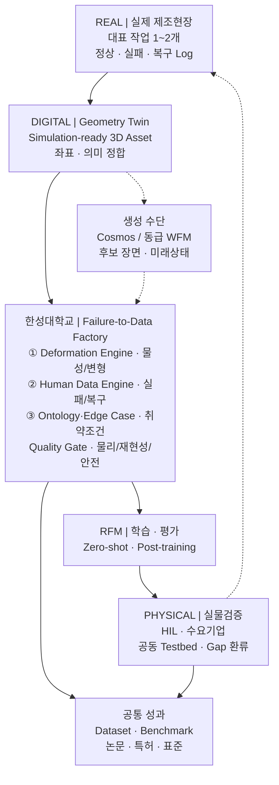
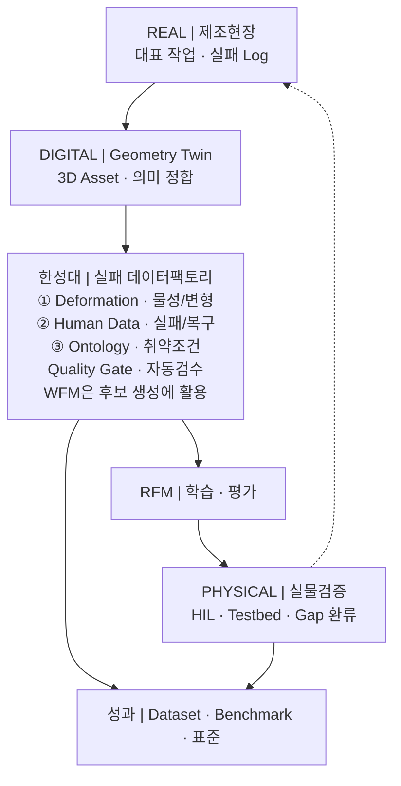

# 연차별 목표와 성과지표

**담당 분야 — 실환경–가상환경 연계형 데이터 증강**

산업통상부 공고 제2026-549호 · 연구개발과제 1
「로봇 데이터팩토리 구축 및 로봇파운데이션모델(RFM) 개발」

!!! info "이 문서의 내용은 세 가지 상태가 섞여 있습니다"
    | 상태 | 해당 내용 |
    |---|---|
    | **확정** | 담당 분야, 확정 4대 역할, 2026-08-29 R&R 확정본의 개발 목표 명칭 |
    | **제안·잠정** | 정량 KPI 기준값, 차년도별 완료 Gate, 연구개발비 배분안 |
    | **확인 필요** | 대표 제조 작업·소재·로봇, RFM 인터페이스, 실증환경, 예산 5 % 의 모수, 모빌테크 협약 형태 |

    **제안·잠정 수치는 협약 목표로 인용하지 않습니다.** 대표 제조 작업·소재·실증환경이
    확정되고 기준 데이터를 실측한 뒤 **컨소시엄 공통 KPI 로 동결**합니다.

!!! info "함께 읽을 것"
    과제 개요·아키텍처·세부 R&R 은 **[대표 페이지](index.md)**,
    기술 근거와 수행 역량은 **[기술 상세](technical.md)** 에 있습니다.

기간은 **43개월 · 4개 차년도** — 1차 9개월 · 2차 10개월 · 3차 12개월 · 4차 12개월입니다.

---

## 한 줄로 말하면

> **한성대학교는 실제 로봇의 실패를 가상환경에서 재현하고, 학습 가능한 데이터로 바꾸는
> 일을 맡습니다.**

세 기술축을 각각 범용 플랫폼으로 개발하지 않습니다. **대표 제조 작업 1~2개**를 정하고,
그 작업 하나를 다음 순환으로 끝까지 관통시킵니다.

**차별화 포인트는 생성 자체가 아니라 폐루프입니다.** 물리·재현성·안전 Gate를 통과한
Episode만 RFM에 공급하고, 실물검증에서 확인된 Domain Gap을 다시 현장·Twin·Scenario에
반영합니다.

!!! note "왜 범위를 좁히는가"
    예산은 정부지원연구개발비의 **5 % 수준**이고 기간은 43개월입니다. 이 규모로 모든
    제조 소재와 공정을 다루는 범용 플랫폼을 만들면 어느 것도 끝까지 검증되지 않습니다.
    **대표 작업 1~2개를 골라 순환을 한 바퀴 완주하는 편이, 넓게 벌여 놓고 미완으로
    끝나는 것보다 컨소시엄에 쓸모가 있습니다.**

---

## 세 기술축의 구체화

**기존 개발 목표 항목은 그대로 유지합니다.** 세 기술축 — Manufacturing Deformation
Engine · Human Data Engine · Manufacturing Ontology·Edge Case Intelligence — 과
확정된 4대 역할(① Real-to-Sim-to-Real ② Zero-shot Transfer ③ 엣지 케이스 시뮬레이션
④ 학술 연구·기술 자문)은 바뀌지 않았습니다.

바뀐 것은 **연차별 목표와 진행 내용**입니다. 각 축을 범용 플랫폼으로 개발하지 않고
**대표 제조 작업 1~2개**를 대상으로 구체화했습니다.

아래 표의 오른쪽 열은 그 기능이 **3절의 어느 개발 목표로 산출되는지**를 가리킵니다.
왼쪽이 한성대가 만드는 기능이고, 오른쪽이 그것이 컨소시엄에 전달되는 이름입니다.

### ① Manufacturing Deformation Engine → 대표 작업의 물리 보정

모든 제조 소재를 다루지 않습니다. **대표 작업 1~2개**를 선정하고, 실제 센서와 영상으로
마찰·접촉·변형값을 추정해 가상환경을 보정하는 데 집중합니다.

| 개발하는 기능 | 무엇을 하는 기능인가 | 개발 목표로는 |
|---|---|---|
| **물리 특성 보정 기능** | 실제 센서·영상에서 마찰·접촉·강성값을 추정해 가상환경 파라미터를 맞춘다 | Physics Consistency Evaluator v1 · Physics Calibration |
| **제조 변형 모사 기능** | 삽입·압입에서 생기는 압축·복원·잔류변형을 가상환경에서 재현한다 | 제조 Domain Variation Library v1 |
| **대상 소재별 물성값** | 대표 소재를 실측해 시뮬레이션이 쓸 수 있는 물성 세트로 정리한다 | 제조 Domain Variation Library v1 |
| **실제–가상 비교결과** | 같은 조건에서 실물과 가상의 접촉력·변형 차이를 수치로 낸다 | Domain Gap 프로토콜 v1 · Transfer Decision Manager |

### ② Human Data Engine → 실패상태 복원과 복구 행동 증강

학생이 먼저 실제 로봇을 원격조작해 정상 동작과 대표 실패·복구 사례를 수집합니다.
그다음이 핵심입니다 — **가상환경에서 실패 직전의 로봇 관절각·물체 위치·접촉 상태를
저장해 두고, 그 상태로 되돌아가 다른 복구 조작을 여러 번 시도합니다.**

실제 로봇으로 실패 상황을 매번 처음부터 만들지 않고도 **하나의 실패에서 여러 복구
데이터**를 얻습니다. 생성 데이터의 충돌·비정상 동작은 자동으로 걸러냅니다.

| 개발하는 기능 | 무엇을 하는 기능인가 | 개발 목표로는 |
|---|---|---|
| **원격조작 데이터 수집도구** | 학생이 실물 로봇을 조작해 정상·실패·복구를 규격대로 기록한다 | 데이터 수집환경 <small>(Edge Case Compiler 의 입력)</small> |
| **실패상태 저장·복원 기능** | 실패 직전의 관절각·물체 위치·접촉 상태를 저장해 그 지점으로 되돌린다 | Edge/Recovery 증강 Dataset |
| **복구 행동 증강 기능** | 되돌린 상태에서 다른 복구 조작을 반복 시도해 하나의 실패에서 여러 복구를 얻는다 | Edge/Recovery 증강 Dataset |
| **자동 데이터 검수 기능** | 충돌·관통·비정상 동작이 섞인 생성 결과를 자동으로 걸러낸다 | Multi-stage Validation Gate (6단계) |

### ③ Manufacturing Ontology·Edge Case Intelligence → RFM 취약조건 탐색

`Asset → Process → Task → State → Event → Failure → Recovery` 구조로 **어떤 설비와
작업에서, 어떤 상태 변화로 실패했고, 어떤 복구 행동이 효과적이었는지**를 연결해
저장합니다.

이후 실제 실패 사례나 RFM 평가결과를 기준으로 물체 위치·각도·마찰·물성·센서오차를
조금씩 바꿔가며 **실패가 시작되는 경계조건**을 찾고, 그 조건을 가상환경에서 다시 만들어
복구 데이터 생성과 재학습에 씁니다.

| 개발하는 기능 | 무엇을 하는 기능인가 | 개발 목표로는 |
|---|---|---|
| **작업·상태·실패·복구 관계 구조** | 어떤 작업의 어떤 상태 변화가 어떤 실패로 이어졌고 무엇이 복구에 통했는지 연결해 저장한다 | Scene–Action–State–Event 표준 v1 |
| **RFM 취약조건 탐색 기능** | 위치·각도·마찰·물성·센서오차를 조금씩 바꿔 RFM 이 실패하기 시작하는 경계를 찾는다 | Prompt·Condition Compiler v1 |
| **실제 실패 기반 가상 시나리오 생성 기능** | 찾아낸 경계조건을 실행 가능한 시뮬레이션 시나리오로 만든다 | Edge Case Compiler v1 |
| **실패유형별 복구 데이터** | 실패 유형을 나누고 유형마다 복구 데이터를 채운다 | Edge Case Taxonomy v1 · Edge/Recovery 증강 Dataset |

---

## 참고 연구 — 세 기술축이 서 있는 연구 흐름

최근 가상환경·시뮬레이션 기반 데이터 획득 연구는 **소량의 실제 데이터로 가상환경의 물리
특성을 보정하고, 현재 로봇 모델이 실패하기 쉬운 조건을 집중적으로 만들어 다시 학습하는**
방향으로 발전하고 있습니다. 또한 **생성한 데이터가 물리적으로 타당한지 자동으로 확인하고,
실제 환경에서 새롭게 발생한 실패를 다시 가상환경에 반영하는 반복 구조**에 대한 연구도
늘고 있습니다. 본 과제의 세 기술축은 이 흐름 위에 있습니다.

각 기술축이 **최근 연구 흐름 위에 있음**을 보이는 대표 연구입니다.
**본 과제에서 재현한 결과가 아니라 문헌으로 확인한 선행연구**이며, 우리가 무엇을
새로 만들 것인지는 각 세부 항목에 따로 적었습니다.

### ① 물리 보정 관련 연구

| 연구 | 검증된 핵심 결과 | 한계와 본 과제 반영 |
|---|---|---|
| **Real-to-Sim Robot Policy Evaluation with Gaussian Splatting Simulation of Soft-Body Interactions** (**ICRA 2026**, [arXiv:2511.04665](https://arxiv.org/abs/2511.04665), 2025-11 공개) | 실제 영상으로 3D Gaussian Splatting 외관과 PhysTwin 기반 spring–mass 동역학을 식별해 soft-body twin 을 구성했습니다. 3개 Task에서 ACT·Diffusion Policy·π0·SmolVLA의 시뮬레이션–실물 성공률 상관이 모두 **Pearson r > 0.9**였습니다. | 정책은 실물 데이터로만 학습했고 시뮬레이터는 **평가 프록시**로 사용했습니다. Task별 평가 초기조건도 16~27개로 작아 신뢰구간이 넓습니다. 본 과제는 **실물–가상 정책순위 상관과 신뢰구간을 먼저 검증**하는 근거로 사용합니다. |
| **SIM1: Physics-Aligned Simulator as Zero-Shot Data Scaler in Deformable Worlds** ([arXiv:2604.08544](https://arxiv.org/abs/2604.08544), 2026-04 프리프린트) | 제한된 시연으로 metric-consistent twin 을 만들고 탄성 동역학을 보정한 뒤 diffusion 궤적 생성·품질 필터로 합성데이터를 확장했습니다. 논문은 순수 합성 정책의 **1:15 실데이터 등가비**, 실물 **zero-shot 성공률 90 %**, 미관측 의류 일반화 **20 %→70 %**를 보고합니다. | 소재별 보정에 **전문가 수동 튜닝**이 필요하며 의류 중심 결과입니다. 수치를 전용하지 않고 Material Profile 보정·비용대비 성능·미관측 소재 검증의 실험설계 근거로 사용합니다. |
| **SimWeaver: Zero-Shot RGB Sim-to-Real for Deformable Manipulation** ([arXiv:2606.15338](https://arxiv.org/abs/2606.15338), 2026-06 프리프린트) | 면밀도·굽힘강성·신장·마찰 같은 **측정 가능한 물성값**을 소재군 라이브러리로 관리하고 Task당 합성 시연 200개로 학습했습니다. 5개 연성작업×23회에서 평균 **91.30 %**(Wilson 95 % CI **84.7–95.2 %**)를 보고했으며, 광학 증강 제거 시 5개 Task가 모두 0 %였습니다. | 무보정이 아니라 **소재군 측정값을 정하고 Asset을 해당 class에 결합**하는 구조입니다. 실데이터와의 엄격한 정면 비교는 silk grasping 중심입니다. Material Profile 재사용·ISP 광학 증강·Task별 신뢰구간을 Gate로 반영합니다. |

**본 과제와의 연결** — 세 연구는 각각 **① 실물정책 평가 프록시의 타당성 검증
② 실측 보정 후 합성데이터 확장 ③ 측정 가능한 물성 프로파일의 재사용**을 보여줍니다.
본 과제는 이를 **제조 대표 작업 1~2개**에 적용하되, 먼저 실물–가상 정책순위 상관을 확인하고,
접촉력·변위·잔류변형의 재현오차와 불확실성을 통과한 Episode만 학습데이터로 편입합니다.
Zero-shot 성능과 보정·Post-training 성능은 서로 다른 평가군으로 분리합니다.

### ② 실패상태 복원·복구 증강 관련 연구

| 연구 | 검증된 핵심 결과 | 한계와 본 과제 반영 |
|---|---|---|
| **DreamGen: Unlocking Generalization in Robot Learning through Video World Models** (**CoRL 2025**, [PMLR](https://proceedings.mlr.press/v305/jang25a.html), [arXiv:2505.12705](https://arxiv.org/abs/2505.12705)) | 단일 pick-and-place 작업·환경에서 수집한 **2,885개** 원격조작 trajectory로 비디오 월드모델을 로봇 embodiment에 적응시키고, 생성 영상에서 latent action 또는 inverse-dynamics model로 pseudo-action을 복원했습니다. 신규 행동 평균 성공률은 기준선 **11.2 %→43.2 %**, 완전 미관측 환경은 **28.5 %**였습니다. | “소량 데이터”보다는 **단일 Task의 상당량 seed data를 행동·환경 다양성으로 확장**한 연구이며 실패·복구 전용 방법은 아닙니다. 정상/경계 행동 생성과 pseudo-action 품질검증 근거로 한정합니다. |
| **Hi-WM: Human-in-the-World-Model for Scalable Robot Post-Training** ([arXiv:2604.21741](https://arxiv.org/abs/2604.21741), 2026-04 프리프린트) | action-conditioned world model 안에서 정책을 실행하고, 실패 직전 상태를 cache해 **rollback·branching**한 뒤 사람이 짧은 교정행동을 여러 갈래로 입력합니다. 3개 실물 Task·2개 정책에서 base 대비 평균 **+37.9 %p**, 사람 교정 없는 WM closed-loop 대비 **+19.0 %p**, 실물 성능과의 상관 **r=0.953**을 보고했습니다. | World model이 **실패근처 상태와 행동에도 정합**해야 하고 교정 입력을 정책과 같은 연속 action space로 변환해야 합니다. 상태저장·재생 오차와 실물 상관 Gate를 통과한 Scenario에만 적용합니다. |
| **EgoRecovery: Acquiring Failure Recovery Ability Through Human Recovery Demonstration** ([arXiv:2607.19745](https://arxiv.org/abs/2607.19745), 2026-07 프리프린트) | 1인칭 인간 복구데이터를 trajectory 자체가 아닌 **교정 시점·크기의 compact corrective intent**로 정렬하고 recovery gate가 필요한 상태에서만 활성화합니다. 시간당 수용 데이터는 인간 **516.5건**, 로봇 **49.0건**이었고, 50 robot success+50 robot recovery+300 human recovery 조건에서 초기 성공률 **80.0 %**, 복구 성공률 **85.0 %**였습니다. | 인간 복구데이터만 쓴 경우 복구 성공률은 **8.8 %**였고 embodiment별 접촉·재파지에는 로봇 복구데이터가 필요했습니다. 같은 Task family의 관련 실패까지만 검증됐으므로 **소량 실로봇 grounding set과 전문가 안전판정**을 반드시 결합합니다. |

**본 과제와의 연결** — 세 연구의 역할은 서로 다릅니다. DreamGen은 **행동·환경 확장**,
Hi-WM은 **실패 직전 상태의 저장·복원·분기 교정**, EgoRecovery는 **사람 복구데이터의 빠른
수집과 로봇-grounded 복구학습** 근거입니다. 본 과제의 Human Data Engine은 이를 합쳐
`실패상태 cache → 다중 교정 branch → 사람 복구 intent → 소량 실로봇 grounding → 실물 재검증`
파이프라인으로 정의합니다. 학생 데이터는 실로봇 복구데이터를 대체하지 않으며,
유급 참여·안전 Protocol·전문가 최종판정을 전제로 합니다.

### ③ 실패 조건 탐색·재현 관련 연구

| 연구 | 검증된 핵심 결과 | 한계와 본 과제 반영 |
|---|---|---|
| **Fail2Progress: Learning from Real-World Robot Failures with Stein Variational Inference** (**CoRL 2025**, [arXiv:2509.01746](https://arxiv.org/abs/2509.01746)) | 관측된 실패와 유사한 조건을 시뮬레이션에서 **병렬 생성**해 targeted 데이터셋을 만들고 skill effect model 을 재학습했습니다. 계층적 tabletop 정리에서 **86 %**(원본 11 %), 미관측 7객체 **71 %**, 미관측 시점 **83~85 %** 를 보고합니다. | 실물 성공률은 **약 80 %** 에 머물고, 저자들은 **Sim2Real gap 보정은 다루지 않았다**고 명시합니다. Real2Sim 이 복잡한 형상·**변형체**에서 불완전하고, 시뮬 상태로 **물체 pose 만** 두어 마찰·질량중심을 제외했습니다. 본 과제는 변형체가 대상이므로 **물성을 상태에 포함**하고 그 재현오차를 KPI 1·2 로 검증합니다. |
| **From Reaction to Anticipation: Proactive Failure Recovery through Agentic Task Graph** (AgentChord, **RSS 2026**, [arXiv:2605.11951](https://arxiv.org/abs/2605.11951)) | 작업을 task graph 로 두고 **예상 실패와 복구 분기를 실행 전에 붙여** 재계획 없이 대응합니다. 실물 6개 작업×20회 평균 **77.5 %**(베이스라인 59.2~72.5 %), 실행시간 92.2 s(베이스라인 107~143 s). 복구 데이터로 파인튜닝 시 실패 시나리오 **39/50**(베이스라인 26/50). | 그래프 구축 단계에서 **예상하지 못한 실패 모드가 남고**, 잘못된 노드로 복구할 수 있습니다. 교정 행동을 계획해도 **IK 가 불가능**한 경우(넘어진 물체 재파지)가 있고, 부정확한 마스크·노이즈 점군이 pose 추정을 흔듭니다. 예상 밖 실패가 남는다는 점이 Edge Case 탐색을 규칙만이 아니라 **RFM 취약조건 기반**으로 두는 근거입니다. |
| **ASPIRE: Agentic Skills Discovery for Robotics** ([arXiv:2607.00272](https://arxiv.org/abs/2607.00272), 2026-06 프리프린트) | 실행 트레이스에서 **실패 진단 → 수정 → 검증 → 재사용 가능한 스킬로 축적**하는 순환을 돌립니다. LIBERO-Pro 매크로 평균 **72 %**, Robosuite 양팔 인계 20 %→**92 %**, 미관측 장기 과제 zero-shot **31 %**(기존 4 %), 실로봇 13/20→**19/20**. | 저자들은 **완전 자율 실세계 학습기가 아니라고** 밝힙니다. **frozen frontier LLM 에 의존**하며 작은 모델로는 검증되지 않았고, 사전 정의 API 밖 능력은 사람이 확장해야 합니다. 스킬 라이브러리의 **장기 메모리 관리가 미해결**이고 **연산 비용이 큽니다**. 본 과제가 자동 검수를 LLM 판단이 아니라 **물리 정합성과 규칙 기반**으로 두는 근거입니다. |

**본 과제와의 연결** — 세 연구는 각각 「실패 조건 재현」, 「작업–실패–복구를 그래프로
연결」, 「진단·수정·검증의 순환」을 다룹니다. 본 과제의
`Asset → Process → Task → State → Event → Failure → Recovery` 구조와 RFM 취약조건 탐색은
이 흐름을 **제조 도메인과 RFM 평가에 맞춰 결합**한 것입니다.

!!! note "인용 원칙"
    위 수치(r > 0.9, 성공률 90 %·91.30 %, +37.9 %p, 시간당 10배 등)는 **각 논문의
    특정 Task·장비·표본에서 나온 보고값**이며 본 과제의 목표치나 재현 결과가 아닙니다.
    Real-to-Sim은 ICRA 2026, DreamGen은 CoRL 2025 게재 논문이고, SIM1·SimWeaver·Hi-WM·
    EgoRecovery는 2026-08-31 현재 arXiv 프리프린트입니다. 본 과제의 정량 목표는
    대표 제조작업의 기준선과 통계설계를 확정한 뒤 별도 KPI로 관리합니다.

---

## 연차별 목표와 예상 산출물

### 한눈에 보기 — 핵심 기술 · 연차별 목표 · 핵심 결과물

차년도별 목표와 그 해에 내는 결과물입니다. 결과물 이름은 **2026-08-29 R&R 확정본의
개발 목표** 그대로입니다. 세부 20건은 아래 접힌 표에 있습니다 —
**③ 이 관계 구조를 세워야 ② 가 무엇을 수집할지 정해지고, ① 이 물리를 맞춰야
3차년도 생성 데이터가 검증 대상이 됩니다.**

| 차년도 | 연차별 목표 | 핵심 기술 | 대표 결과물 |
|---|---|:--:|---|
| **1차년도** <small>9개월 · 기준 시스템</small> | 대표 작업·실패유형을 확정하고 **실제–가상 비교 기준**을 문서로 고정 | ③ · ① · 공통 | WFM–Physics Twin Reference Architecture Domain Gap 프로토콜 v1 |
| **2차년도** <small>10개월 · 증강 엔진</small> | 대표 소재 물성을 실측해 **Physics Twin 을 보정**하고 **증강 엔진 v1** 가동 | ① · ③ · ② | Physics Consistency Evaluator v1 Edge Case Compiler v1 |
| **3차년도** <small>12개월 · 전이 검증</small> | 가상 학습 결과의 **전이 여부를 판정**하고 생성 데이터를 자동 선별·공개 | ① · 공통 · ② | Transfer Decision Manager Edge/Recovery 증강 Dataset |
| **4차년도** <small>12개월 · 표준화</small> | **실물 재검증 순환 1회 이상 완주**하고 절차·벤치마크를 표준화 | ② · ③ · 공통 | Closed-loop RoboOps Toolchain Cross-domain Physical AI Benchmark |

<small>핵심 기술 — **① Manufacturing Deformation Engine**(대표 작업의 물리 보정) ·
**② Human Data Engine**(실패상태 복원과 복구 증강) ·
**③ Manufacturing Ontology·Edge Case Intelligence**(RFM 취약조건 탐색).
차년도별 목표·완료 Gate·완료 판정은 아래 각 절에 있습니다.</small>

<b>차년도별 세부 결과물 20건 전체 보기</b> — 핵심 기술 · 연차별 목표 · 핵심 결과물 · 수행 내용

<table>
  <thead><tr>
    <th>차년도</th><th>연차별 목표</th><th>핵심 기술</th><th>핵심 결과물</th><th>그 안에서 수행하는 일</th>
  </tr></thead>
  <tbody>
  <tr>
    <td rowspan="5"><b>1차년도</b> <small>9개월 · 기준 시스템 3.3억</small></td>
    <td rowspan="5">대표 작업과 실패유형을 확정하고, <b>실제–가상 비교의 측정 항목·조건·판정 기준</b>을 문서로 고정  <small><b>연차 완료 Gate (잠정)</b> 동일 조건 재실행 결과 동일 100 % · 손실 없는 전달 ≥ 95 %</small></td>
    <td align="center">공통</td>
    <td><b>WFM–Physics Twin Reference Architecture</b> <small>실제–가상–RFM 을 잇는 기준 구조</small></td>
    <td><small>대표 제조 작업 1~2개와 주요 실패유형의 <b>컨소시엄 승인</b> · 실패–복구 순환 구조 정의</small></td>
  </tr>
  <tr>
    <td align="center">③ 온톨로지·엣지</td>
    <td><b>Scene–Action–State–Event 표준 v1</b> <small>장면·행동·상태·사건 기록 표준</small></td>
    <td><small>작업·상태·실패·복구 관계 구조 v1</small></td>
  </tr>
  <tr>
    <td align="center">공통 RFM Interface <small>③ 연계</small></td>
    <td><b>Model Adapter v1</b> <small>RFM 이 변환 없이 읽는 연결 규격</small></td>
    <td><small>실환경·가상환경·RFM 데이터 연계규격</small></td>
  </tr>
  <tr>
    <td align="center">① 물리 보정</td>
    <td><b>Domain Gap 프로토콜 v1</b> <small>실제–가상 차이 측정 절차</small></td>
    <td><small>실제–가상 비교 평가절차 — <b>반복횟수·판정기준·통계방법</b> 포함</small></td>
  </tr>
  <tr>
    <td align="center">③ 온톨로지·엣지</td>
    <td><b>Edge Case Taxonomy v1</b> <small>실패·경계 상황 분류 체계</small></td>
    <td><small>대표 작업의 실패유형 목록 확정 · <b>Human Data Engine 이 수집할 정상·실패·복구 데이터 항목 정의</b></small></td>
  </tr>
  <tr>
    <td rowspan="5"><b>2차년도</b> <small>10개월 · 증강 엔진 4.4억</small></td>
    <td rowspan="5">물성을 실측해 가상환경에 반영하고, <b>증강 엔진 v1 과 데이터 수집환경을 가동</b>  <small><b>연차 완료 Gate (잠정)</b> 비물리 결과 검출률 ≥ 85 % · 접촉력 재현오차 NRMSE ≤ 20 %</small></td>
    <td align="center">③ 온톨로지·엣지</td>
    <td><b>Prompt·Condition Compiler v1</b> <small>생성 조건 → 시뮬레이션 실행조건 변환기</small></td>
    <td><small>실패 가능조건 추출기 v1</small></td>
  </tr>
  <tr>
    <td align="center">① 물리 보정</td>
    <td><b>Physics Consistency Evaluator v1</b> <small>물리적 가능성 자동 판정</small></td>
    <td><small>제조 변형·물성 보정 기술 v1</small></td>
  </tr>
  <tr>
    <td align="center">① 물리 보정</td>
    <td><b>제조 Domain Variation Library v1</b> <small>마찰·공차·재질 등 조건 변이 라이브러리</small></td>
    <td><small>대표 소재의 실측 물성값 · 대표 작업 물리 가상환경 구축</small></td>
  </tr>
  <tr>
    <td align="center">① 물리 보정</td>
    <td><b>Transferability Score v1</b> <small>실제 전이 가능성 지표</small></td>
    <td><small>미학습 조건 성능 유지율의 지표·측정법 정의</small></td>
  </tr>
  <tr>
    <td align="center">②③</td>
    <td><b>Edge Case Compiler v1</b> <small>경계조건 → 실행 시나리오 자동 생성</small></td>
    <td><small>① RFM 취약·경계조건을 실행 가능한 시나리오로 변환 ② 시연·실패·복구 데이터 <b>수집환경 가동</b></small></td>
  </tr>
  <tr>
    <td rowspan="5"><b>3차년도</b> <small>12개월 · 전이 검증 4.8억</small></td>
    <td rowspan="5">가상 학습 결과가 실제로 <b>얼마나 전이되는지 판정</b>하고, 생성 데이터를 자동 선별해 용도별 공개  <small><b>연차 완료 Gate (잠정)</b> 미학습 조건 성능 유지 ≥ 70 % · 경량 적응 후 ≥ 90 % · 전이 판정 일치 ≥ 80 % · 생성 데이터 검수 완료 ≥ 90 %</small></td>
    <td align="center">① 물리 보정</td>
    <td><b>Transfer Decision Manager</b> <small>전이 가능 여부 판정·적응 필요성 결정</small></td>
    <td><small>실제–가상 성능차이 및 미학습조건 평가</small></td>
  </tr>
  <tr>
    <td align="center">공통 Quality Gate <small>② 주도</small></td>
    <td><b>Multi-stage Validation Gate (6단계)</b> <small>생성 데이터 6단계 품질 관문</small></td>
    <td><small>생성 데이터 자동 검수 기능</small></td>
  </tr>
  <tr>
    <td align="center">공통</td>
    <td><b>Simulation–HIL–Real Robot 인터페이스</b> <small>가상·HIL·실물 공통 규약</small></td>
    <td><small>RFM 연계도구 및 평가기준</small></td>
  </tr>
  <tr>
    <td align="center">②③</td>
    <td><b>Edge/Recovery 증강 Dataset</b> <small>실패·복구 포함 증강 학습 데이터</small></td>
    <td><small>정상·실패·복구·가상 생성 데이터셋 1차 공개 · 실패상태 복원과 복구 행동 증강</small></td>
  </tr>
  <tr>
    <td align="center">① 물리 보정</td>
    <td><b>Physics Calibration</b> <small>실측 기반 물리 파라미터 재보정</small></td>
    <td><small>실측 물성값으로 가상환경 재보정</small></td>
  </tr>
  <tr>
    <td rowspan="5"><b>4차년도</b> <small>12개월 · 표준화 4.5억</small></td>
    <td rowspan="5">실패 재현–복구 생성–재학습–<b>실물 재검증 순환을 1회 이상 완주</b>하고 절차·벤치마크를 표준화  <small><b>연차 완료 Gate (잠정)</b> 실제 실패 재현율 ≥ 70 % · 재학습–실물 재검증 순환 1회 이상 완주 · 실제 성공률 +10 %p 이상 · 제3자 절차 재현 ≥ 90 %</small></td>
    <td align="center">공통</td>
    <td><b>Real-to-Sim-to-Real 운용 가이드라인</b> <small>제3자가 따라 하는 운용 문서</small></td>
    <td><small>통합 실증 및 활용 가이드</small></td>
  </tr>
  <tr>
    <td align="center">③ 온톨로지·엣지</td>
    <td><b>Cross-domain Physical AI Benchmark</b> <small>작업 교차 공통 평가 기준</small></td>
    <td><small>실제 실패의 가상환경 재현 결과를 벤치마크로 공개</small></td>
  </tr>
  <tr>
    <td align="center">①③</td>
    <td><b>Robust Operating Envelope 평가모듈</b> <small>안정 동작범위 측정</small></td>
    <td><small>RFM 재학습·실제 로봇 재검증</small></td>
  </tr>
  <tr>
    <td align="center">② 사람 데이터 <small>+ 공통</small></td>
    <td><b>Closed-loop RoboOps Toolchain</b> <small>재현–재학습–재검증 자동화</small></td>
    <td><small>실패 직전 상태 저장 · 실패상태 복원 · <b>복구행동 다중 분기</b> · 소량 실로봇 Grounding · RFM 재학습 · 실제 로봇 재검증을 잇는 순환 도구 묶음</small></td>
  </tr>
  <tr>
    <td align="center">공통</td>
    <td><b>기술 백서</b> <small>데이터·평가절차 표준 제안</small></td>
    <td><small>데이터·평가절차 표준화</small></td>
  </tr>
  </tbody>
</table>

---

### 1차년도 (9개월) — 기준 시스템

> **목표** — 대표 제조 작업과 실패유형을 확정하고, **실제–가상 비교의 측정 항목·조건·판정
> 기준**을 문서로 고정한다.

**연차 완료 Gate (잠정)** — 생성 재현성 · 스키마 왕복 정합: 동일 조건 재실행 결과 동일 **100 %** · 손실 없는 전달 **≥ 95 %**

**완료 판정** — **대표 작업 · 실패유형 · 데이터 규격 · Domain Gap 평가절차**가 컨소시엄
승인을 받고, 동일 입력조건의 생성·검증 이력이 재현됩니다.

!!! tip "1차년도에 평가방법까지 고정합니다"
    관계 구조(온톨로지)는 **필요한 최소 관계만** 정의합니다. 대신 나중에 성능을 비교할
    **평가방법을 1차년도에 확정**합니다. 재는 방법이 정해지지 않으면 뒤의 수치가
    비교 대상을 잃습니다.

### 2차년도 (10개월) — 증강 엔진

> **목표** — 대표 소재의 물성을 실측해 **Physics Twin 을 보정**하고, 조건 생성·물리정합
> 평가·도메인 변이·시연 데이터 수집을 포함한 **증강 엔진 v1 을 가동**한다.

**연차 완료 Gate (잠정)** — 비물리 결과 자동 검출 · 접촉력 재현오차: 검출률 **≥ 85 %**(오검출 ≤ 15 %) · **NRMSE ≤ 20 %** · 조건 준수율 **≥ 70 %**

**완료 판정** — 네 가지를 모두 만족해야 합니다.

- 대표 소재의 **실측 물성값이 가상환경에 실제로 적용**되었는가
- 접촉력–변위 시험 기준 **재현오차 NRMSE ≤ 20 %** 인가
- 물리적으로 불가능한 생성 결과의 **검출률 ≥ 85 %** 인가
- **Scene–Action–State–Event 규격**으로 데이터가 축적되는가

### 3차년도 (12개월) — 전이 검증

> **목표** — 가상에서 학습한 결과가 실제로 **얼마나 전이되는지 판정**하고, 생성 데이터를
> **품질 기준으로 자동 선별**한 뒤 용도별로 공개한다.

**연차 완료 Gate (잠정)** — 미학습 조건 성능 유지 **≥ 70 %**(경량 적응 후 ≥ 90 %) · 전이 판정 일치 **≥ 80 %** · OOD 탐지 **≥ 85 %** · **생성 데이터 검수 완료 ≥ 90 %**

**완료 판정** — 미학습 조건에서 **기준환경 대비 성능 유지율 ≥ 70 %**(경량 적응 후 ≥ 90 %)
가 측정되고, 전이 가능 여부 **판정 일치도 ≥ 80 %** 를 확보합니다. 생성 데이터의
**검수 완료율 ≥ 90 %** 를 달성하고, 아래 네 가지 구분이 데이터셋에 드러납니다.

| 구분 | 값 |
|---|---|
| **데이터 구성** | 정상 / 실패 / 복구 / 가상 생성 |
| **데이터 용도** | 학습용 / 검증용 / 평가용 |
| **평가군** | Zero-shot / 경량 적응 / Post-training |
| **품질관문** | 물리정합 / 재현성 / 안전 / Provenance / RFM 유효성 |

### 4차년도 (12개월) — 표준화

> **목표** — 실패 재현–복구 생성–재학습–**실물 재검증 순환을 1회 이상 완주**하고,
> 절차와 벤치마크를 **제3자가 재현할 수 있게 표준화**한다.

**연차 완료 Gate (잠정)** — 실제 실패 재현율 **≥ 70 %** · 재학습–실물 재검증 순환 **1회 이상 완주** · **실제 성공률 +10 %p 이상** · 엣지 커버리지 **≥ 80 %** · 제3자 절차 재현 **≥ 90 %**

**완료 판정** — 실패 재현 → 복구 데이터 생성 → 재학습 → 실물 재검증 순환이 **1회 이상
완주**되고, 엣지·복구 데이터 적용 후 실제 성공률이 **+10 %p 이상** 향상된 것이 측정으로
제시됩니다. 엣지 케이스 **커버리지 ≥ 80 %** 를 확보하고, **제3자가 운용 가이드라인만으로
기준 시나리오를 ≥ 90 % 재현**할 수 있습니다.

---

## 핵심 KPI

측정 대상과 방법이 드러나도록 정의했습니다. **모든 수치는 기준선 확정 전 잠정치**이며,
대표 작업·소재·실증환경이 확정되고 기준 데이터를 실측한 뒤 컨소시엄 공통 KPI 로
동결합니다. **확정 전에는 협약 목표로 인용하지 않습니다.**

!!! note "「연차 완료 Gate」 와 「핵심 KPI」 는 다른 지표입니다"
    **연차 완료 Gate** 는 그 해의 작업이 끝났는지 판정하는 **진행 관리용 잠정 기준**이고,
    **핵심 KPI** 는 과제 전체의 성능을 재는 **성과 지표**입니다. 값이 겹치는 항목이
    있지만 같은 지표로 인용하지 않습니다.

| # | KPI | 목표 | 측정 방법 |
|:--:|---|---|---|
| 1 | **대표 작업의 접촉력 재현오차** | **≤ 20 %** | 동일한 물체·자세·속도에서 실제 힘 센서값과 가상환경값을 비교 |
| 2 | **대표 소재의 잔류변형 재현오차** | **≤ 25 %** | 선정한 소재와 반복하중 조건에서 작업 전후의 실제 형상과 가상 형상을 비교 |
| 3 | **실제–가상 작업 성공률 차이** | **≤ 20 %p** | 같은 작업·조건에서 가상환경과 실제 로봇의 성공률 차이 |
| 4 | **주요 실패유형별 복구 데이터 확보율** | **≥ 80 %** | 사전에 정한 주요 실패유형 중 유효한 복구 시나리오와 데이터가 확보된 비율 |
| 5 | **엣지 케이스 데이터 검수 완료율** | **≥ 90 %** | 생성 데이터 중 검수가 완료된 비율 |
| 6 | **실제 주요 실패의 가상환경 재현율** | **≥ 70 %** | 실제로 발생한 주요 실패를 가상환경에서 다시 만들어 낸 비율 |
| 7 | **학습하지 않은 물체·배치·물성조건 성능 유지율** | **≥ 70 %** | 미학습 조건에서 기준환경 대비 작업성공률 |
| 8 | **엣지 케이스·복구 데이터 적용 후 실제 성공률 향상** | **+ 10 %p 이상** | 생성 데이터로 재학습한 모델의 실제 로봇 성공률 변화 |

**6·7·8번은 새로 제안하는 지표입니다.**
6번은 실환경–가상환경 연계와 엣지 케이스 생성 능력을 직접 보여주고,
7번은 확정 역할 ② **Zero-shot Transfer** 를 그대로 평가하며,
8번은 **만든 데이터가 실제 성능 개선으로 이어졌는지**를 보는 최종 성과지표입니다.

### KPI 측정 정의 — 분모 · 산식 · 반복 · 통계

목표값만으로는 같은 수치를 다르게 잴 수 있습니다. **무엇을 분모로 두고 몇 번 반복해
어떻게 계산하는지**를 함께 고정합니다. 아래 정의는 1차년도 평가절차 문서에서 확정합니다.

| # | 기준선 | 평가 대상 (분모) | 반복 | 산식 | 통계 | 측정 |
|:--:|---|---|:--:|---|---|:--:|
| 1 | 실물 F/T 계측 기준곡선 | 대표 작업의 삽입력–변위 구간 | 30회 이상 | NRMSE = RMSE ÷ (실측 최대–최소) | 평균 ± 95 % CI | 2·3차 |
| 2 | 작업 전후 실측 형상 | 대표 소재 시편 | 20회 이상 | 잔류변형 오차 ÷ 실측 잔류변형 | 평균 ± 95 % CI | 2·3차 |
| 3 | 실물 로봇 성공률 | 동일 작업·조건 시행 | 각 50회 이상 | \|가상 성공률 − 실제 성공률\| | Wilson 95 % CI | 3·4차 |
| 4 | 1차년도 확정 실패유형 목록 | **사전 정의된 실패유형 수** | 유형당 10회 이상 | 유효 복구데이터 확보 유형 ÷ 전체 유형 | 비율 | 3·4차 |
| 5 | 검수 절차 정의서 | **생성된 전체 데이터 건수** | 전수 | 검수 완료 건수 ÷ 생성 건수 | 비율 | 3·4차 |
| 6 | 실제 발생 실패 로그 | 실제 관측된 주요 실패 건수 | 건별 5회 이상 | 가상 재현 성공 건수 ÷ 실제 실패 건수 | 비율 | 4차 |
| 7 | 기준환경 작업성공률 | 미학습 물체·배치·물성 조건 | 조건당 30회 이상 | 미학습 성공률 ÷ 기준환경 성공률 | 평균 ± 95 % CI | 3·4차 |
| 8 | 재학습 전 실제 성공률 | 동일 실물 시험 조건 | 전후 각 50회 이상 | 재학습 후 − 재학습 전 (%p) | Wilson 95 % CI | 4차 |

!!! warning "검수 완료율과 유효 데이터 비율은 다른 지표입니다"
    네 지표가 비슷해 보이지만 분모가 각각 다릅니다.

    | 지표 | 분모 | 뜻 |
    |---|---|---|
    | **복구 데이터 확보율 ≥ 80 %** | 사전 정의된 실패유형 | 유효한 복구 데이터가 확보된 **유형**의 비율 |
    | **Edge Case Coverage ≥ 80 %** | 정의된 엣지 조건 전체 | 시험·재현된 **조건**의 비율 |
    | **데이터 검수 완료율 ≥ 90 %** | 생성 데이터 전체 | 검수 **절차가 끝난** 건의 비율 |
    | **유효 데이터 통과율** | 검수 완료 데이터 | 그중 **실제로 쓸 수 있는** 건의 비율 |

    검수를 마쳤다고 모두 쓸 수 있는 것은 아닙니다. 통과율은 검수 완료율의 하위 지표입니다.

### 확정 4대 역할과 KPI 의 대응

| 확정 역할 | 대응 KPI |
|---|---|
| ① Real-to-Sim-to-Real 고도화 | 1 · 2 · 3 |
| ② Zero-shot Transfer 도메인 적응 | 7 |
| ③ 엣지 케이스 시뮬레이션 | 4 · 5 · 6 · 8 |
| ④ 학술 연구·기술 자문 | 아래 성과지표 |

---

## 성과지표 (4년 누계)

| 구분 | 1차 | 2차 | 3차 | 4차 | **누계** |
|---|:--:|:--:|:--:|:--:|:--:|
| SCI(E)급 논문 | — | 1 | 1 | 1 | **3** |
| 국내외 학술발표 | 1 | 2 | 2 | 2 | **7** |
| 특허 출원 | — | 1 | 1 | 1 | **3** |
| 특허 등록 | — | — | — | 1 | **1** |
| SW 프로그램 등록 | — | 1 | 1 | 1 | **3** |
| 표준 제안 | — | — | — | 1 | **1** |
| 기술문서·자문 의견서 | 2 | — | 1 | 1 | **4** |

특허는 **3차년도 출원분을 4차년도에 등록**하는 일정입니다 — 심사 기간을 고려한 배치입니다.

확정 역할 ④가 **학술 연구 및 기술 자문**인 만큼, 논문·특허는 부수 성과가 아니라
**협약 시 확정된 논문·특허·SW·표준·기술문서 성과지표**로 관리합니다. 지표 수준은 연구개발비 규모와 참여 인력을 전제로 한
값이며, 범위가 조정되면 함께 조정합니다.

---

---

## 연구개발비

**현재 검토안은 총 17.0억, 한성대학교 13.0억 · 모빌테크 4.0억 배분을 가정합니다.**
5 % 의 모수와 협약 형태가 확정된 뒤 동결합니다. 모빌테크는 **공동연구개발기관 참여를
우선 검토**하고 있으며, 최종 위치와 금액은 협약 과정에서 확정합니다. 아래 배분은
차년도별 1.0억 균등을 가정한 값입니다.

### 차년도별 배분

| 차년도 | 기간 | 한성대 | 모빌테크 | 합계 | 근거 |
|---|---:|---:|---:|---:|---|
| 1차년도 | 9개월 | **2.3억** | 1.0억 | **3.3억** | 대상 선정·규격 확정 · Pilot Scan·기준 Asset |
| 2차년도 | 10개월 | **3.4억** | 1.0억 | **4.4억** | 물리 가상환경 구축 · 공간 Twin 본 구축 |
| 3차년도 | 12개월 | **3.8억** | 1.0억 | **4.8억** | 데이터 생성·검수 · Asset 보완·정합 |
| 4차년도 | 12개월 | **3.5억** | 1.0억 | **4.5억** | 순환 완주·실물 재검증 · 실증 대상 Asset 갱신 |
| **합계** | **43개월** | **13.0억** | **4.0억** | **17.0억** | |

### 한성대 13.0억의 확정 4대 역할별 배분

| 확정 역할 | 비중 | 금액 | 대응 기술축 |
|---|---:|---:|---|
| ① Real-to-Sim-to-Real 고도화 | 36 % | **4.7억** | Manufacturing Deformation Engine |
| ② Zero-shot Transfer 도메인 적응 | 24 % | **3.1억** | 미학습 조건 평가 |
| ③ 엣지 케이스 시뮬레이션 | 25 % | **3.3억** | Human Data Engine · Ontology·Edge Case |
| ④ 학술 연구·기술 자문 | 15 % | **1.9억** | 논문·특허·표준 |
| **합계** | **100 %** | **13.0억** | |

### 모빌테크 4.0억의 수행 범위

전체의 **약 23.5 %** 로, 공간 Digital Twin 을 전 기간에 걸쳐 담당하는 규모입니다.

| 차년도 | 수행 내용 |
|---|---|
| 1차 | 대표 작업 공간 **Pilot Scan 과 기준 Asset** 취득 · 좌표계·Semantic 규격 합의 |
| 2차 | **공간 Digital Twin 본 구축** — 설비·치구·작업공간의 정밀 3D Asset, Simulation-ready 변환(LOD·Collision·Metadata) |
| 3차 | 대표 작업 확장에 따른 **Asset 보완·정합** · 물성·Semantic 메타 갱신 |
| 4차 | 실증 대상 공간 **Asset 갱신**과 최종 통합 실증 지원 |

**협약 형태** — **공동연구개발기관**이 적합합니다. 위탁·용역이면 3천만원 이상 내역 명시
의무이고, 핵심공정 기술개발은 외주 대상이 될 수 없습니다.

!!! warning "통보 문구와 금액의 모수가 다릅니다 — 협약 전 확인 필요"
    2026-08-29 통보는 **「전체 정부지원연구개발비 기준 5 %」** 였습니다. 총액 17억은
    **총사업비 340억의 5 %** 에 해당하며, 공고문상 정부지원연구개발비(75억)의 5 %
    (3.75억)와는 다릅니다. **협약서 근거 문구와 금액을 함께 확인해야 합니다.**

---

<small>본 페이지는 컨소시엄 협의 단계의 자료이며, 확정 목표가 아닙니다.
한성대학교 AI로봇연구소</small>
