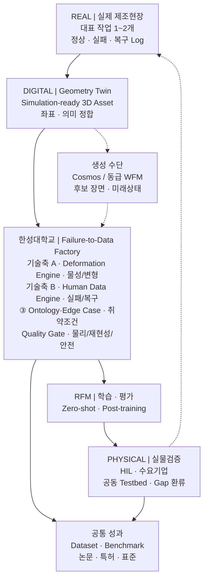
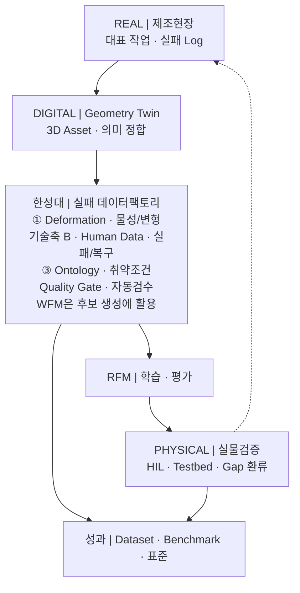

# 연차별 목표와 성과지표

**담당 분야 — 실환경–가상환경 연계형 데이터 증강**

산업통상부 공고 제2026-549호 · 연구개발과제 1
「로봇 데이터팩토리 구축 및 로봇파운데이션모델(RFM) 개발」

!!! info "2026-09-01 한성대 Physical AI R&R 최신본을 기준으로 정렬했습니다"
    | 상태 | 해당 내용 |
    |---|---|
    | **제안서 반영 기준** | 연차별 목표·연구내용·핵심 결과물·정량목표·성과지표, 담당 분야와 4대 역할 |
    | **측정설계·내부 관리** | KPI 분모·산식·반복·통계, 세부 완료판정, 연차별 자문 기록 |
    | **제안·잠정** | 대표 정량목표의 시험조건·기준선, 연구개발비 금액 환산 |
    | **확인 필요** | 대표 제조 작업·소재·로봇, RFM 인터페이스, 실증환경, 예산 5 % 의 모수, 모빌테크 협약 형태 |

    정량목표의 **목표값과 연차 귀속은 2026-09-01 R&R을 그대로 따릅니다.** 측정설계는
    목표값을 바꾸는 추가 KPI가 아니라, 협약 후 같은 방법으로 재현하기 위한 보조 정의입니다.
    대표 제조 작업·소재·실증환경이 확정되면 세부 시험조건을 컨소시엄 공통 기준으로 동결합니다.

!!! info "함께 읽을 것"
    과제 개요·아키텍처·세부 R&R 은 **[대표 페이지](index.md)**,
    기술 근거와 수행 역량은 **[기술 상세](technical.md)** 에 있습니다.

기간은 **43개월 · 4개 차년도** — 1차 9개월 · 2차 10개월 · 3차 12개월 · 4차 12개월입니다.

---

## 한 줄로 말하면

> **한성대학교는 실제 로봇의 실패를 가상환경에서 재현하고, 학습 가능한 데이터로 바꾸는
> 일을 맡습니다.**

세 기술축을 각각 범용 플랫폼으로 개발하지 않습니다. **대표 제조 작업 1~2개**를 정하고,
그 작업 하나를 다음 순환으로 끝까지 관통시킵니다.

**차별화 포인트는 생성 자체가 아니라 폐루프입니다.** 물리·재현성·안전 Gate를 통과한
Episode만 RFM에 공급하고, 실물검증에서 확인된 Domain Gap을 다시 현장·Twin·Scenario에
반영합니다.

!!! note "왜 범위를 좁히는가"
    예산은 정부지원연구개발비의 **5 % 수준**이고 기간은 43개월입니다. 이 규모로 모든
    제조 소재와 공정을 다루는 범용 플랫폼을 만들면 어느 것도 끝까지 검증되지 않습니다.
    **대표 작업 1~2개를 골라 순환을 한 바퀴 완주하는 편이, 넓게 벌여 놓고 미완으로
    끝나는 것보다 컨소시엄에 쓸모가 있습니다.**

---

## 세 기술축의 구체화

**기존 개발 목표 항목은 그대로 유지합니다.** 세 기술축 — Manufacturing Deformation
Engine · Human Data Engine · Manufacturing Ontology·Edge Case Intelligence — 과
확정된 4대 역할(① Real-to-Sim-to-Real ② Zero-shot Transfer ③ 엣지 케이스 시뮬레이션
④ 학술 연구·기술 자문)은 바뀌지 않았습니다.

바뀐 것은 **연차별 목표와 진행 내용**입니다. 각 축을 범용 플랫폼으로 개발하지 않고
**대표 제조 작업 1~2개**를 대상으로 구체화했습니다.

아래 표의 오른쪽 열은 그 기능이 **3절의 어느 개발 목표로 산출되는지**를 가리킵니다.
왼쪽이 한성대가 만드는 기능이고, 오른쪽이 그것이 컨소시엄에 전달되는 이름입니다.

### 기술축 A · Manufacturing Deformation Engine → 대표 작업의 물리 보정

모든 제조 소재를 다루지 않습니다. **대표 작업 1~2개**를 선정하고, 실제 센서와 영상으로
마찰·접촉·변형값을 추정해 가상환경을 보정하는 데 집중합니다.

| 개발하는 기능 | 무엇을 하는 기능인가 | 개발 목표로는 |
|---|---|---|
| **물리 특성 보정 기능** | 실제 센서·영상에서 마찰·접촉·강성값을 추정해 가상환경 파라미터를 맞춘다 | Physics Consistency Evaluator v1 · Physics Calibration |
| **제조 변형 모사 기능** | 삽입·압입에서 생기는 압축·복원·잔류변형을 가상환경에서 재현한다 | 제조 Domain Variation Library v1 |
| **대상 소재별 물성값** | 대표 소재를 실측해 시뮬레이션이 쓸 수 있는 물성 세트로 정리한다 | 제조 Domain Variation Library v1 |
| **실제–가상 비교결과** | 같은 조건에서 실물과 가상의 접촉력·변형 차이를 수치로 낸다 | Domain Gap 프로토콜 v1 · Transfer Decision Manager |

### 기술축 B · Human Data Engine → 실패상태 복원과 복구 행동 증강

학생이 먼저 실제 로봇을 원격조작해 정상 동작과 대표 실패·복구 사례를 수집합니다.
그다음이 핵심입니다 — **가상환경에서 실패 직전의 로봇 관절각·물체 위치·접촉 상태를
저장해 두고, 그 상태로 되돌아가 다른 복구 조작을 여러 번 시도합니다.**

실제 로봇으로 실패 상황을 매번 처음부터 만들지 않고도 **하나의 실패에서 여러 복구
데이터**를 얻습니다. 생성 데이터의 충돌·비정상 동작은 자동으로 걸러냅니다.

| 개발하는 기능 | 무엇을 하는 기능인가 | 개발 목표로는 |
|---|---|---|
| **원격조작 데이터 수집도구** | 학생이 실물 로봇을 조작해 정상·실패·복구를 규격대로 기록한다 | 데이터 수집환경 <small>(Edge Case Compiler 의 입력)</small> |
| **실패상태 저장·복원 기능** | 실패 직전의 관절각·물체 위치·접촉 상태를 저장해 그 지점으로 되돌린다 | Edge/Recovery 증강 Dataset |
| **복구 행동 증강 기능** | 되돌린 상태에서 다른 복구 조작을 반복 시도해 하나의 실패에서 여러 복구를 얻는다 | Edge/Recovery 증강 Dataset |
| **자동 데이터 검수 기능** | 충돌·관통·비정상 동작이 섞인 생성 결과를 자동으로 걸러낸다 | Multi-stage Validation Gate (6단계) |

### 기술축 C · Manufacturing Ontology·Edge Case Intelligence → RFM 취약조건 탐색

`Asset → Process → Task → State → Event → Failure → Recovery` 구조로 **어떤 설비와
작업에서, 어떤 상태 변화로 실패했고, 어떤 복구 행동이 효과적이었는지**를 연결해
저장합니다.

이후 실제 실패 사례나 RFM 평가결과를 기준으로 물체 위치·각도·마찰·물성·센서오차를
조금씩 바꿔가며 **실패가 시작되는 경계조건**을 찾고, 그 조건을 가상환경에서 다시 만들어
복구 데이터 생성과 재학습에 씁니다.

| 개발하는 기능 | 무엇을 하는 기능인가 | 개발 목표로는 |
|---|---|---|
| **작업·상태·실패·복구 관계 구조** | 어떤 작업의 어떤 상태 변화가 어떤 실패로 이어졌고 무엇이 복구에 통했는지 연결해 저장한다 | Scene–Action–State–Event 표준 v1 |
| **RFM 취약조건 탐색 기능** | 위치·각도·마찰·물성·센서오차를 조금씩 바꿔 RFM 이 실패하기 시작하는 경계를 찾는다 | Prompt·Condition Compiler v1 |
| **실제 실패 기반 가상 시나리오 생성 기능** | 찾아낸 경계조건을 실행 가능한 시뮬레이션 시나리오로 만든다 | Edge Case Compiler v1 |
| **실패유형별 복구 데이터** | 실패 유형을 나누고 유형마다 복구 데이터를 채운다 | Edge Case Taxonomy v1 · Edge/Recovery 증강 Dataset |

---

## 참고 연구 — 세 기술축이 서 있는 연구 흐름

최근 가상환경·시뮬레이션 기반 데이터 획득 연구는 **소량의 실제 데이터로 가상환경의 물리
특성을 보정하고, 현재 로봇 모델이 실패하기 쉬운 조건을 집중적으로 만들어 다시 학습하는**
방향으로 발전하고 있습니다. 또한 **생성한 데이터가 물리적으로 타당한지 자동으로 확인하고,
실제 환경에서 새롭게 발생한 실패를 다시 가상환경에 반영하는 반복 구조**에 대한 연구도
늘고 있습니다. 본 과제의 세 기술축은 이 흐름 위에 있습니다.

각 기술축이 **최근 연구 흐름 위에 있음**을 보이는 대표 연구입니다.
**본 과제에서 재현한 결과가 아니라 문헌으로 확인한 선행연구**이며, 우리가 무엇을
새로 만들 것인지는 각 세부 항목에 따로 적었습니다.

### A 물리 보정 관련 연구

| 연구 | 검증된 핵심 결과 | 한계와 본 과제 반영 |
|---|---|---|
| **Real-to-Sim Robot Policy Evaluation with Gaussian Splatting Simulation of Soft-Body Interactions** (**ICRA 2026**, [arXiv:2511.04665](https://arxiv.org/abs/2511.04665), 2025-11 공개) | 실제 영상으로 3D Gaussian Splatting 외관과 PhysTwin 기반 spring–mass 동역학을 식별해 soft-body twin 을 구성했습니다. 3개 Task에서 ACT·Diffusion Policy·π0·SmolVLA의 시뮬레이션–실물 성공률 상관이 모두 **Pearson r > 0.9**였습니다. | 정책은 실물 데이터로만 학습했고 시뮬레이터는 **평가 프록시**로 사용했습니다. Task별 평가 초기조건도 16~27개로 작아 신뢰구간이 넓습니다. 본 과제는 **실물–가상 정책순위 상관과 신뢰구간을 먼저 검증**하는 근거로 사용합니다. |
| **SIM1: Physics-Aligned Simulator as Zero-Shot Data Scaler in Deformable Worlds** ([arXiv:2604.08544](https://arxiv.org/abs/2604.08544), 2026-04 프리프린트) | 제한된 시연으로 metric-consistent twin 을 만들고 탄성 동역학을 보정한 뒤 diffusion 궤적 생성·품질 필터로 합성데이터를 확장했습니다. 논문은 순수 합성 정책의 **1:15 실데이터 등가비**, 실물 **zero-shot 성공률 90 %**, 미관측 의류 일반화 **20 %→70 %**를 보고합니다. | 소재별 보정에 **전문가 수동 튜닝**이 필요하며 의류 중심 결과입니다. 수치를 전용하지 않고 Material Profile 보정·비용대비 성능·미관측 소재 검증의 실험설계 근거로 사용합니다. |
| **SimWeaver: Zero-Shot RGB Sim-to-Real for Deformable Manipulation** ([arXiv:2606.15338](https://arxiv.org/abs/2606.15338), 2026-06 프리프린트) | 면밀도·굽힘강성·신장·마찰 같은 **측정 가능한 물성값**을 소재군 라이브러리로 관리하고 Task당 합성 시연 200개로 학습했습니다. 5개 연성작업×23회에서 평균 **91.30 %**(Wilson 95 % CI **84.7–95.2 %**)를 보고했으며, 광학 증강 제거 시 5개 Task가 모두 0 %였습니다. | 무보정이 아니라 **소재군 측정값을 정하고 Asset을 해당 class에 결합**하는 구조입니다. 실데이터와의 엄격한 정면 비교는 silk grasping 중심입니다. Material Profile 재사용·ISP 광학 증강·Task별 신뢰구간을 Gate로 반영합니다. |

**본 과제와의 연결** — 세 연구는 각각 **① 실물정책 평가 프록시의 타당성 검증
② 실측 보정 후 합성데이터 확장 ③ 측정 가능한 물성 프로파일의 재사용**을 보여줍니다.
본 과제는 이를 **제조 대표 작업 1~2개**에 적용하되, 먼저 실물–가상 정책순위 상관을 확인하고,
접촉력·변위·잔류변형의 재현오차와 불확실성을 통과한 Episode만 학습데이터로 편입합니다.
Zero-shot 성능과 보정·Post-training 성능은 서로 다른 평가군으로 분리합니다.

### ② 실패상태 복원·복구 증강 관련 연구

| 연구 | 검증된 핵심 결과 | 한계와 본 과제 반영 |
|---|---|---|
| **DreamGen: Unlocking Generalization in Robot Learning through Video World Models** (**CoRL 2025**, [PMLR](https://proceedings.mlr.press/v305/jang25a.html), [arXiv:2505.12705](https://arxiv.org/abs/2505.12705)) | 단일 pick-and-place 작업·환경에서 수집한 **2,885개** 원격조작 trajectory로 비디오 월드모델을 로봇 embodiment에 적응시키고, 생성 영상에서 latent action 또는 inverse-dynamics model로 pseudo-action을 복원했습니다. 신규 행동 평균 성공률은 기준선 **11.2 %→43.2 %**, 완전 미관측 환경은 **28.5 %**였습니다. | “소량 데이터”보다는 **단일 Task의 상당량 seed data를 행동·환경 다양성으로 확장**한 연구이며 실패·복구 전용 방법은 아닙니다. 정상/경계 행동 생성과 pseudo-action 품질검증 근거로 한정합니다. |
| **Hi-WM: Human-in-the-World-Model for Scalable Robot Post-Training** ([arXiv:2604.21741](https://arxiv.org/abs/2604.21741), 2026-04 프리프린트) | action-conditioned world model 안에서 정책을 실행하고, 실패 직전 상태를 cache해 **rollback·branching**한 뒤 사람이 짧은 교정행동을 여러 갈래로 입력합니다. 3개 실물 Task·2개 정책에서 base 대비 평균 **+37.9 %p**, 사람 교정 없는 WM closed-loop 대비 **+19.0 %p**, 실물 성능과의 상관 **r=0.953**을 보고했습니다. | World model이 **실패근처 상태와 행동에도 정합**해야 하고 교정 입력을 정책과 같은 연속 action space로 변환해야 합니다. 상태저장·재생 오차와 실물 상관 Gate를 통과한 Scenario에만 적용합니다. |
| **EgoRecovery: Acquiring Failure Recovery Ability Through Human Recovery Demonstration** ([arXiv:2607.19745](https://arxiv.org/abs/2607.19745), 2026-07 프리프린트) | 1인칭 인간 복구데이터를 trajectory 자체가 아닌 **교정 시점·크기의 compact corrective intent**로 정렬하고 recovery gate가 필요한 상태에서만 활성화합니다. 시간당 수용 데이터는 인간 **516.5건**, 로봇 **49.0건**이었고, 50 robot success+50 robot recovery+300 human recovery 조건에서 초기 성공률 **80.0 %**, 복구 성공률 **85.0 %**였습니다. | 인간 복구데이터만 쓴 경우 복구 성공률은 **8.8 %**였고 embodiment별 접촉·재파지에는 로봇 복구데이터가 필요했습니다. 같은 Task family의 관련 실패까지만 검증됐으므로 **소량 실로봇 grounding set과 전문가 안전판정**을 반드시 결합합니다. |

**본 과제와의 연결** — 세 연구의 역할은 서로 다릅니다. DreamGen은 **행동·환경 확장**,
Hi-WM은 **실패 직전 상태의 저장·복원·분기 교정**, EgoRecovery는 **사람 복구데이터의 빠른
수집과 로봇-grounded 복구학습** 근거입니다. 본 과제의 Human Data Engine은 이를 합쳐
`실패상태 cache → 다중 교정 branch → 사람 복구 intent → 소량 실로봇 grounding → 실물 재검증`
파이프라인으로 정의합니다. 학생 데이터는 실로봇 복구데이터를 대체하지 않으며,
유급 참여·안전 Protocol·전문가 최종판정을 전제로 합니다.

### ③ 실패 조건 탐색·재현 관련 연구

| 연구 | 검증된 핵심 결과 | 한계와 본 과제 반영 |
|---|---|---|
| **Fail2Progress: Learning from Real-World Robot Failures with Stein Variational Inference** (**CoRL 2025**, [arXiv:2509.01746](https://arxiv.org/abs/2509.01746)) | 관측된 실패와 유사한 조건을 시뮬레이션에서 **병렬 생성**해 targeted 데이터셋을 만들고 skill effect model 을 재학습했습니다. 계층적 tabletop 정리에서 **86 %**(원본 11 %), 미관측 7객체 **71 %**, 미관측 시점 **83~85 %** 를 보고합니다. | 실물 성공률은 **약 80 %** 에 머물고, 저자들은 **Sim2Real gap 보정은 다루지 않았다**고 명시합니다. Real2Sim 이 복잡한 형상·**변형체**에서 불완전하고, 시뮬 상태로 **물체 pose 만** 두어 마찰·질량중심을 제외했습니다. 본 과제는 변형체가 대상이므로 **물성을 상태에 포함**하고 그 재현오차를 KPI 1·2 로 검증합니다. |
| **From Reaction to Anticipation: Proactive Failure Recovery through Agentic Task Graph** (AgentChord, **RSS 2026**, [arXiv:2605.11951](https://arxiv.org/abs/2605.11951)) | 작업을 task graph 로 두고 **예상 실패와 복구 분기를 실행 전에 붙여** 재계획 없이 대응합니다. 실물 6개 작업×20회 평균 **77.5 %**(베이스라인 59.2~72.5 %), 실행시간 92.2 s(베이스라인 107~143 s). 복구 데이터로 파인튜닝 시 실패 시나리오 **39/50**(베이스라인 26/50). | 그래프 구축 단계에서 **예상하지 못한 실패 모드가 남고**, 잘못된 노드로 복구할 수 있습니다. 교정 행동을 계획해도 **IK 가 불가능**한 경우(넘어진 물체 재파지)가 있고, 부정확한 마스크·노이즈 점군이 pose 추정을 흔듭니다. 예상 밖 실패가 남는다는 점이 Edge Case 탐색을 규칙만이 아니라 **RFM 취약조건 기반**으로 두는 근거입니다. |
| **ASPIRE: Agentic Skills Discovery for Robotics** ([arXiv:2607.00272](https://arxiv.org/abs/2607.00272), 2026-06 프리프린트) | 실행 트레이스에서 **실패 진단 → 수정 → 검증 → 재사용 가능한 스킬로 축적**하는 순환을 돌립니다. LIBERO-Pro 매크로 평균 **72 %**, Robosuite 양팔 인계 20 %→**92 %**, 미관측 장기 과제 zero-shot **31 %**(기존 4 %), 실로봇 13/20→**19/20**. | 저자들은 **완전 자율 실세계 학습기가 아니라고** 밝힙니다. **frozen frontier LLM 에 의존**하며 작은 모델로는 검증되지 않았고, 사전 정의 API 밖 능력은 사람이 확장해야 합니다. 스킬 라이브러리의 **장기 메모리 관리가 미해결**이고 **연산 비용이 큽니다**. 본 과제가 자동 검수를 LLM 판단이 아니라 **물리 정합성과 규칙 기반**으로 두는 근거입니다. |

**본 과제와의 연결** — 세 연구는 각각 「실패 조건 재현」, 「작업–실패–복구를 그래프로
연결」, 「진단·수정·검증의 순환」을 다룹니다. 본 과제의
`Asset → Process → Task → State → Event → Failure → Recovery` 구조와 RFM 취약조건 탐색은
이 흐름을 **제조 도메인과 RFM 평가에 맞춰 결합**한 것입니다.

!!! note "인용 원칙"
    위 수치(r > 0.9, 성공률 90 %·91.30 %, +37.9 %p, 시간당 10배 등)는 **각 논문의
    특정 Task·장비·표본에서 나온 보고값**이며 본 과제의 목표치나 재현 결과가 아닙니다.
    Real-to-Sim은 ICRA 2026, DreamGen은 CoRL 2025 게재 논문이고, SIM1·SimWeaver·Hi-WM·
    EgoRecovery는 2026-09-01 현재 arXiv 프리프린트입니다. 본 과제의 정량 목표는
    대표 제조작업의 기준선과 통계설계를 확정한 뒤 별도 KPI로 관리합니다.

---

## 연차별 목표와 예상 산출물

### 한눈에 보기 — 핵심 기술 · 연차별 목표 · 핵심 결과물

차년도별 목표 명칭과 결과물 묶음은 **2026-09-01 한성대 Physical AI R&R**을 기준으로
정렬했습니다. 아래에 **기술축 관점 매트릭스**와 **세부 20건 표**가 이어집니다.

| 차년도 | 제안서 연차별 목표 | 공식 역할 | 결과물 묶음 |
|---|---|:--:|---|
| **1차년도** <small>9개월 · 기준 시스템</small> | **기준 시스템** <small>Interface·Schema·Asset 기준과 생성 재현성·왕복 정합 절차 확정</small> | ① Real-to-Sim-to-Real 주 수행 · ②③④ 병행 | **WFM–Physics Twin Reference Architecture** Geometry–Physics Interface · Reference Asset |
| **2차년도** <small>10개월 · 엔진 개발</small> | **제조 변형·데이터 증강 엔진** <small>Deformation Engine·Evaluator·Variation·Edge Compiler와 Checkpoint 수집환경 구축</small> | ①②③ 주 수행 · ④ 병행 | **Manufacturing Deformation Engine 기본형** Material Profile · Physics Evaluator · Edge Case Compiler |
| **3차년도** <small>12개월 · 전이 검증</small> | **전이 검증** <small>Zero-shot·Transfer Decision·OOD와 Simulation–HIL–Real·Recovery 통합 검증</small> | ②③ 주 수행 · ①④ 병행 | **Transfer Decision Manager** Multi-stage Validation Gate · Recovery 증강 Dataset |
| **4차년도** <small>12개월 · 표준화</small> | **표준화** <small>Failure 재현→Recovery 생성→RFM 재학습→실물 재검증 폐루프와 제3자 재현성 검증</small> | ③④ 주 수행 · ①② 병행 | **Closed-loop RoboOps Toolchain** Cross-domain Benchmark · 최종 기준모델·기술백서 |

<small>핵심 기술 — **기술축 A · Manufacturing Deformation Engine**(대표 작업의 물리 보정) ·
**기술축 B · Human Data Engine**(실패상태 복원과 복구 증강) ·
**기술축 C · Manufacturing Ontology·Edge Case Intelligence**(RFM 취약조건 탐색).
「핵심 기술」 열은 그 해에 관여하는 축을 비중 순으로 적은 것입니다.
차년도별 목표·완료 Gate·완료 판정은 아래 각 절에 있습니다.</small>

### 핵심기술 × 연차 — 세 축이 4년에 걸쳐 어떻게 개발되는가

같은 20건을 **기술축 관점**으로 다시 배열한 것입니다. 위 표가 「그 해에 무엇을 내는가」라면,
이 표는 「그 축이 4년 동안 어떻게 자라는가」를 봅니다.

| 핵심기술 | 1차 · 기준체계 | 2차 · 엔진 기본형 | 3차 · 통합 검증 | 4차 · 실증·표준화 |
|---|---|---|---|---|
| **기술축 A · Manufacturing Deformation Engine** <small>대표 작업의 물리 보정</small> | Geometry–Physics Interface · Domain Gap Protocol | **Deformation Engine 기본형** Material Profile · Physics Evaluator Variation Library · Transferability Score | Transfer Decision Manager **Physics Calibration** | Robust Operating Envelope 평가모듈 <small>기술축 C와 공동</small> |
| **기술축 B · Human Data Engine** <small>실패상태 복원과 복구 증강</small> | Checkpoint Schema <small>정상·실패·복구 데이터 항목 정의</small> | **Checkpoint 수집환경 가동** <small>Edge Case Compiler 의 입력</small> | Multi-stage Validation Gate <small>(주도)</small> **Edge/Recovery 증강 Dataset** | **Closed-loop RoboOps Toolchain** <small>상태 저장·복원 · 복구 다중 분기 · 실로봇 Grounding</small> |
| **기술축 C · Manufacturing Ontology ·Edge Case Intelligence** <small>RFM 취약조건 탐색</small> | **Scene–Action–State– Event 표준 v1** Edge Case Taxonomy v1 | Prompt·Condition Compiler v1 **Edge Case Compiler v1** | Edge/Recovery 증강 Dataset <small>(취약조건 기반 생성 조건 제공)</small> | **Cross-domain Physical AI Benchmark** |
| **공통 · ④ 학술·자문** | **WFM–Physics Twin Reference Architecture** Model Adapter v1 <small>공통 RFM Interface</small> | 물성 보정·데이터 품질 시험설계 자문 | Simulation–HIL–Real Robot 인터페이스 Multi-stage Validation Gate <small>(공통 Quality Gate)</small> | 운용 가이드라인 기술 백서 |

<small>굵게 표시한 것이 그 축·그 해의 대표 결과물입니다. 한 결과물이 두 축에 걸치는 경우
(Edge Case Compiler · Edge/Recovery Dataset · Validation Gate · RoboOps Toolchain)는
**주 담당 축에 두고 다른 축에 병기**했으므로, 표 전체의 항목 수는 20건보다 많아 보입니다.

**축 사이 선후관계** — ③ 이 관계 구조를 세워야 ② 가 무엇을 수집할지 정해지고,
① 이 물리를 맞춰야 3차년도 생성 데이터가 검증 대상이 됩니다.</small>

### 기관별 역할과 연차 완료조건

한성대학교가 PDF의 **공동기관 연구목표**를 책임 수행하고, 모빌테크는 그 목표에 필요한
Geometry Asset 을 요구규격에 맞춰 지원합니다. PDF 대표 정량목표와 모빌테크 지원 산출물의
인수조건을 함께 만족한 상태를 **통합 완료조건**으로 봅니다.

| 차년도 | 한성대학교 공동기관 연구목표 | 모빌테크 세부 지원 | PDF 대표 정량 완료조건 | 지원 산출물 인수조건 |
|:--:|---|---|---|---|
| **1차** | **기준 시스템** — Interface·Schema·Asset 기준 확정 | Pilot Scan · 기준 Geometry Asset 제공 | 동일 조건 재실행 결과 동일 **100 %** · 손실 없는 전달 **≥ 95 %** | 좌표계·축척·Semantic 규격 충족, 기준 Asset 인수검사 통과 |
| **2차** | **제조 변형·데이터 증강 엔진** — Deformation·Evaluator·Compiler 기본형 가동 | Simulation-ready Asset · LOD·Collision·Metadata 제공 | 비물리 결과 검출 **≥ 85 %**(오검출 **≤ 15 %**) · 접촉력 NRMSE **≤ 20 %** · 조건 준수 **≥ 70 %** | LOD·Collision·Metadata 검수 통과, Geometry–Physics Interface 정상 구동 |
| **3차** | **전이 검증** — Zero-shot·Transfer Decision·OOD·Recovery 통합 검증 | 변동조건 Asset 과 Geometry 갱신 | 기준환경 대비 **≥ 70 %**(경량 적응 후 **≥ 90 %**) · 판정 일치 **≥ 80 %** · OOD **≥ 85 %** | 동일 Asset 버전 제공, 변경 이력과 버전 추적성 확보 |
| **4차** | **표준화** — Closed-loop·Benchmark·제3자 재현성 확립 | 최종 실증공간 Asset 갱신·지원 | Edge Case Coverage **≥ 80 %** · 제3자 재현 **≥ 90 %** · 재학습–재검증 Loop **1회 완주** | 최종 Geometry Twin 버전 동결, 최종 인수검사와 실증 지원 완료 |

### 기술축 B(Human Data Engine)의 연차 전개

핵심 기능은 **4차년도에 처음 개발하는 것이 아닙니다.** 3차년도에 상태 복원과 복구 분기를
완성하고, 4차년도에는 이를 실로봇·RFM 과 연결해 폐루프를 닫습니다.

| 차년도 | Human Data Engine 개발내용 |
|:--:|---|
| **1차** | 주요 실패유형, 정상·실패·복구 데이터 항목과 **상태변수 정의** |
| **2차** | 실패 직전 상태 **Checkpoint·저장 기능 v1**, Teleoperation 수집환경 가동, 저장상태 재실행 기준선 확보 |
| **3차** | 상태 **Restore·복구행동 다중 분기 v1**, 자동검수, Edge/Recovery Dataset, 대표 실패유형 통합 실행 확인 |
| **4차** | 소량 실로봇 **Grounding**, RFM 재학습, 실제 로봇 재검증 |

!!! note "3차년도 통합 확인과 4차년도 Closed-loop 실증을 구분합니다"
    3차년도에는 대표 실패유형 1종 이상에 대해 **실패상태 저장 → 복원 → 복구행동 분기 →
    Quality Gate → Simulation–HIL–Real 비교**를 확인합니다. RFM 재학습과 실물 재검증까지
    포함한 **Closed-loop 1회 이상 완주**는 PDF와 같이 4차년도 정량목표로 관리합니다.

### 산출물 귀속

| 산출물 | 주관 | 협력 | 입력 | 출력 | 인수기준 |
|---|:--:|---|---|---|---|
| 현장 Pilot Scan · 기준 3D Asset · Geometry Twin | 모빌테크 <small>(지원)</small> | 한성대 규격 정의 · 수요기업 | 현장 실측 | Asset Package | 좌표·축척 오차 규격 내 |
| 좌표계·Semantic 정합 규격 · LOD·Collision Mesh · Asset Metadata | 모빌테크 | 한성대 | 현장 Meta | 규격서·Mesh | Simulation-ready 검수 통과 |
| Asset Version·Update Package | 모빌테크 | 한성대 | 변경 요청 | 버전 패키지 | 버전 추적 가능 |
| Manufacturing Deformation Engine · Material Profile · Physics Parameter | 한성대 | 소재·계측기관 | Geometry Twin, 물성 실측 | 보정 모듈·물성값 | 접촉력 재현오차 기준 충족 |
| Physics Consistency Evaluator · Physics Calibration Report | 한성대 | 모빌테크 | 생성 결과, 실측 | 판정기·리포트 | 접촉력·잔류변형·Failure/Edge 재현 기준 충족 |
| Human Data Engine · Edge/Recovery Dataset | 한성대 | 실로봇 기관 | 시연·실패 로그 | 데이터셋 | 생성·검수 완료율·유효 데이터 기준 충족 |
| Ontology·Edge Case Compiler · Multi-stage Validation Gate | 한성대 | 데이터·RFM 기관 | 실패 로그, 생성 조건 | 시나리오·품질관문 | Gate 통과 이력 재현 |
| Transfer Decision Manager · Closed-loop RoboOps Toolchain | 한성대 | RFM·실로봇 기관 | 평가 결과 | 판정기·툴체인 | 전이 판정 일치도 기준 충족 |
| Geometry Twin–Physics Twin Interface · Simulation–HIL–Real Interface | **한성대 정의** <small>모빌테크 합의</small> | 전 기관 | 양측 규격 | 인터페이스 규약 | 컨소시엄 승인 |
| RFM Dataset Schema · Validation Feedback Package | **한성대 정의** <small>RFM·Data 기관 합의</small> | RFM·데이터 기관 | 데이터·검증 결과 | 스키마·환류 패키지 | RFM 기관 적용 확인 |
| 통합 실증 결과 · Real-to-Sim-to-Real 운용 가이드라인 | **한성대** | 전 기관 지원 | 순환 완주 결과 | 실증 리포트·가이드 | 제3자 재현 가능 |

<b>차년도별 세부 결과물 20건 전체 보기</b> — 핵심 기술 · 연차별 목표 · 핵심 결과물 · 수행 내용

<table>
  <thead><tr>
    <th>차년도</th><th>연차별 목표</th><th>기술축</th><th>핵심 결과물</th><th>그 안에서 수행하는 일</th>
  </tr></thead>
  <tbody>
  <tr>
    <td rowspan="5"><b>1차년도</b> <small>9개월 · 기준 시스템 한성대 예산 내 18 %</small></td>
    <td rowspan="5"><b>기준 시스템</b> Interface·Schema·Asset 기준과 생성 재현성·왕복 정합 절차 확정  <small><b>PDF 대표 정량목표</b> 동일 조건 재실행 결과 동일 100 % · 손실 없는 전달 ≥ 95 %</small></td>
    <td align="center">한성대 공통기반</td>
    <td><b>WFM–Physics Twin Reference Architecture</b> <small>실제–가상–RFM 을 잇는 기준 구조</small></td>
    <td><small>대표 제조 작업 1~2개와 주요 실패유형의 <b>컨소시엄 승인</b> · 실패–복구 순환 구조 정의</small></td>
  </tr>
  <tr>
    <td align="center">C</td>
    <td><b>Scene–Action–State–Event 표준 v1</b> <small>장면·행동·상태·사건 기록 표준</small></td>
    <td><small>작업·상태·실패·복구 관계 구조 v1</small></td>
  </tr>
  <tr>
    <td align="center">한성대 공통기반 <small>RFM Interface · C 연계</small></td>
    <td><b>Model Adapter · Domain Gap Protocol 기술사양서</b> <small>RFM 연결 규격과 실제–가상 비교 절차</small></td>
    <td><small>실환경·가상환경·RFM 데이터 연계규격 · 반복횟수·판정기준·통계방법</small></td>
  </tr>
  <tr>
    <td align="center">B · C</td>
    <td><b>Edge Case Taxonomy · Checkpoint Schema</b> <small>실패 분류와 상태저장 규격</small></td>
    <td><small>대표 실패유형 · 정상·실패·복구 데이터 항목 · Human Data 상태변수 정의</small></td>
  </tr>
  <tr>
    <td align="center">한성대 공통기반 <small>A · 모빌테크 연계</small></td>
    <td><b>Geometry–Physics Interface 설계·연계 규격서</b> <small>Geometry Asset 과 Physics Twin 연결 규격</small></td>
    <td><small>좌표·축척·Semantic·물성 Parameter·Asset Version 연계조건 정의</small></td>
  </tr>
  <tr>
    <td rowspan="5"><b>2차년도</b> <small>10개월 · 제조 변형·데이터 증강 엔진 한성대 예산 내 26 %</small></td>
    <td rowspan="5"><b>제조 변형·데이터 증강 엔진</b> Deformation Engine·Evaluator·Variation·Edge Compiler와 Checkpoint 수집환경 가동  <small><b>PDF 대표 정량목표</b> 비물리 결과 검출 ≥ 85 %(오검출 ≤ 15 %) · NRMSE ≤ 20 % · 조건 준수 ≥ 70 %</small></td>
    <td align="center">A</td>
    <td><b>Manufacturing Deformation Engine 기본형 · Material Profile Library</b> <small>실측 물성 기반 제조 변형 시뮬레이션</small></td>
    <td><small>대표 소재 물성 보정 · 접촉력·잔류변형 재현 · Material Profile 구축</small></td>
  </tr>
  <tr>
    <td align="center">C</td>
    <td><b>Prompt–Condition Compiler SW 모듈</b> <small>생성 조건 → 시뮬레이션 실행조건 변환기</small></td>
    <td><small>실패 가능조건 추출과 조건 기반 시나리오 생성</small></td>
  </tr>
  <tr>
    <td align="center">A</td>
    <td><b>Physics Consistency Evaluator · 평가 지표체계</b> <small>실측 대비 물리 재현성 판정</small></td>
    <td><small>접촉력 NRMSE · 잔류변형 오차 · Failure/Edge 재현율 평가</small></td>
  </tr>
  <tr>
    <td align="center">A</td>
    <td><b>Domain Variation Library · Zero-shot Baseline · Transferability Score v1</b> <small>조건 변이와 미학습조건 전이 기준선</small></td>
    <td><small>마찰·공차·재질 변동 라이브러리 · 미학습 조건 평가 기준선</small></td>
  </tr>
  <tr>
    <td align="center">B · C</td>
    <td><b>Edge Case Compiler · 실패상태 Checkpoint 수집환경</b> <small>경계조건 실행과 상태저장·데이터 수집</small></td>
    <td><small>RFM 취약·경계조건을 실행 가능한 시나리오로 변환 · 시연·실패·복구 데이터 <b>수집환경 가동</b> · 실패 직전 상태 <b>Checkpoint·저장 기능 v1</b></small></td>
  </tr>
  <tr>
    <td rowspan="5"><b>3차년도</b> <small>12개월 · 전이 검증 한성대 예산 내 29 %</small></td>
    <td rowspan="5"><b>전이 검증</b> Zero-shot·Transfer Decision·OOD·상태복원·Recovery 다중분기와 Simulation–HIL–Real 검증  <small><b>PDF 대표 정량목표</b> 기준환경 대비 ≥ 70 %(경량 적응 후 ≥ 90 %) · 판정 일치 ≥ 80 % · OOD ≥ 85 %</small></td>
    <td align="center">A</td>
    <td><b>Transfer Decision Manager</b> <small>전이 가능 여부 판정·적응 필요성 결정</small></td>
    <td><small>실제–가상 성능차이 및 미학습조건 평가</small></td>
  </tr>
  <tr>
    <td align="center">한성대 공통기반 <small>Quality Gate · B 주도</small></td>
    <td><b>Multi-stage Validation Gate (6단계)</b> <small>생성 데이터 6단계 품질 관문</small></td>
    <td><small>생성 데이터 자동 검수 기능</small></td>
  </tr>
  <tr>
    <td align="center">한성대 공통기반</td>
    <td><b>Simulation–HIL–Real Robot 인터페이스</b> <small>가상·HIL·실물 공통 규약</small></td>
    <td><small>RFM 연계도구 및 평가기준</small></td>
  </tr>
  <tr>
    <td align="center">B · C</td>
    <td><b>상태 복원·Recovery 다중분기·증강 Dataset</b> <small>실패상태 복원과 여러 복구 행동을 포함한 학습데이터</small></td>
    <td><small>정상·실패·복구·가상 생성 데이터셋의 <b>컨소시엄 제공 및 공개 승인분 배포</b> · 상태 Restore·복구행동 다중 분기 v1 · 자동검수</small></td>
  </tr>
  <tr>
    <td align="center">A</td>
    <td><b>Physics Calibration · Simulation–Real 정합성 검증보고서</b> <small>실측 기반 물리 파라미터 재보정</small></td>
    <td><small>실측 물성값으로 가상환경을 재보정하고 정합성 결과 기록</small></td>
  </tr>
  <tr>
    <td rowspan="5"><b>4차년도</b> <small>12개월 · 표준화 한성대 예산 내 27 %</small></td>
    <td rowspan="5"><b>표준화</b> Failure 재현→Recovery 생성→RFM 재학습→실물 재검증과 최종 기준모델·표준 제안  <small><b>PDF 대표 정량목표</b> Edge Case Coverage ≥ 80 % · 제3자 재현 ≥ 90 % · 재학습–재검증 Loop 1회 완주</small></td>
    <td align="center">한성대 공통기반</td>
    <td><b>Real-to-Sim-to-Real 운용 가이드라인</b> <small>제3자가 따라 하는 운용 문서</small></td>
    <td><small>통합 실증 및 활용 가이드</small></td>
  </tr>
  <tr>
    <td align="center">C</td>
    <td><b>Cross-domain Physical AI Benchmark</b> <small>작업 교차 공통 평가 기준</small></td>
    <td><small>실제 실패의 가상환경 재현 결과를 벤치마크로 공개</small></td>
  </tr>
  <tr>
    <td align="center">A · C</td>
    <td><b>Robust Operating Envelope 평가모듈</b> <small>안정 동작범위 측정</small></td>
    <td><small>RFM 재학습·실제 로봇 재검증</small></td>
  </tr>
  <tr>
    <td align="center">B <small>+ 한성대 공통기반</small></td>
    <td><b>Closed-loop RoboOps Toolchain</b> <small>재현–재학습–재검증 자동화</small></td>
    <td><small>3차년도 기능을 실로봇·RFM 과 연결 — 소량 실로봇 <b>Grounding</b> · RFM 재학습 · 실제 로봇 재검증을 잇는 순환 도구 묶음</small></td>
  </tr>
  <tr>
    <td align="center">한성대 공통기반</td>
    <td><b>Geometry–Physics Twin 최종 기준모델·형상관리·표준 제안·기술백서</b> <small>제3자 재현 가능한 최종 기준 패키지</small></td>
    <td><small>데이터·평가절차 표준화</small></td>
  </tr>
  </tbody>
</table>

---

### 1차년도 (9개월) — 기준 시스템

> **목표** — 대표 제조 작업 1~2개와 주요 실패유형을 확정하고, 모빌테크의 Pilot Scan·기준
> Geometry Asset 을 기반으로 **실제–가상 데이터 연계규격, 좌표·Semantic Interface,
> Domain Gap 평가절차와 KPI 측정법**을 확정한다. Human Data 수집항목·Checkpoint Schema·
> Edge Case Taxonomy 와 **RFM 데이터·평가 인터페이스 기술사양**까지 동결한다.

**PDF 대표 정량목표** — 동일 조건 재실행 결과 동일 **100 %** · 스키마 왕복 과정의 손실 없는 전달 **≥ 95 %**

**완료 판정** — PDF 대표 목표와 아래 내부 승인 증빙을 함께 확인합니다.

- 대표 작업·실패유형 **컨소시엄 승인**
- 기준 Geometry Asset **인수검사 항목 100 % 충족**과 Geometry–Physics Interface 승인
- 좌표계·축척·Semantic 규격과 S-A-S-E Round-trip의 **손실 없는 전달 ≥ 95 %**
- 동일 Scene·Action·Seed 재실행 시 상태·판정·Provenance **재현 100 %**
- Domain Gap **분모·산식·반복횟수·판정기준·통계방법 확정**
- 기준 데이터와 학습용·검증용·평가용 **분할 원칙 동결**

!!! tip "1차년도에 평가방법까지 고정합니다"
    관계 구조(온톨로지)는 **필요한 최소 관계만** 정의합니다. 대신 나중에 성능을 비교할
    **평가방법을 1차년도에 확정**합니다. 재는 방법이 정해지지 않으면 뒤의 수치가
    비교 대상을 잃습니다.

### 2차년도 (10개월) — 제조 변형·데이터 증강 엔진

> **목표** — 모빌테크의 Simulation-ready Geometry Twin 에 대표 소재의 실측 물성을 결합해
> **Manufacturing Deformation Engine 기본형 · Material/Domain Variation Library ·
> Edge Case Compiler · Human Data 수집환경과 실패상태 Checkpoint 기능**을 가동한다.
> Zero-shot Transfer 기준성능(Baseline)과 미학습 조건 평가 데이터셋을 설계한다.

**PDF 대표 정량목표** — 비물리 결과 자동 검출률 **≥ 85 %**(오검출 **≤ 15 %**) · 접촉력 재현오차 **NRMSE ≤ 20 %** · 생성조건 준수율 **≥ 70 %**

**완료 판정** — PDF 대표 목표와 엔진 가동 여부를 함께 확인합니다.

| 묶음 | 판정 기준 |
|---|---|
| **Geometry Asset 인수** | LOD·Collision·Metadata 검수 및 Geometry–Physics Interface 정상 구동 |
| **Deformation Engine** | 접촉력 **NRMSE ≤ 20 %**, 잔류변형 **≤ 25 %**, 실측 Material Profile 적용 |
| **Failure/Edge 재현** | 사전 정의된 주요 조건의 가상환경 재현율 **≥ 70 %**, 실행조건과 판정 근거 저장 |
| **데이터 엔진** | Edge Case 학습데이터 생성·검수 완료율 **≥ 90 %**, Checkpoint 저장·재실행과 S-A-S-E 수집 가능 |

### 3차년도 (12개월) — 전이 검증

> **목표** — **버전 관리된 Geometry·Physics Twin** 에서 RFM 취약조건과 미학습조건을 생성하고,
> Zero-shot·적응·Post-training 평가군을 분리해 **Simulation–HIL–Real 전이 가능성을
> 판정**한다. Quality Gate 를 통과한 데이터는 **컨소시엄에 제공하고 공개 승인분만 배포**하며,
> 대표 실패유형 1종 이상에서 상태복원·복구행동 다중 분기와 사전 정의 정량지표를 검증한다.

**PDF 대표 정량목표** — 미학습 조건의 기준환경 대비 Zero-shot 성능 유지율 **≥ 70 %**(경량 적응 후 **≥ 90 %**) · Transfer Decision 판정 일치도 **≥ 80 %** · OOD 조건 탐지율 **≥ 85 %**

**완료 판정** — 적응하지 않은 상태에서 기준환경 대비 **Zero-shot 성능 유지율 ≥ 70 %** 를
측정하고, 경량 적응 후 성능 유지율 **≥ 90 %**, 판정 일치도 **≥ 80 %**, OOD **≥ 85 %** 를 각각 보고합니다. **동일 Asset 버전으로 Simulation–HIL–Real
비교**를 마치고, 대표 실패유형 1종 이상에서 상태 저장–복원–복구분기–Gate–HIL 통합 실행을
확인합니다. 아래 네 가지 구분이 데이터셋에 드러납니다.

| 구분 | 값 |
|---|---|
| **데이터 구성** | 정상 / 실패 / 복구 / 가상 생성 |
| **데이터 용도** | 학습용 / 검증용 / 평가용 |
| **평가군** | Zero-shot / 경량 적응 / Post-training |
| **품질관문** | 물리정합 / 재현성 / 안전 / Provenance / RFM 유효성 |

### 4차년도 (12개월) — 표준화

> **목표** — 실제 실패를 가상환경에서 재현하고, **실패상태 복원·복구행동 분기·RFM 재학습·
> 실물 재검증 폐루프를 1회 이상 완주**한다. 모빌테크의 최종 Asset Package 를 동결하고,
> 증강 데이터의 실제 성능기여도와 제3자 절차 재현성을 입증해 운용절차·벤치마크를 표준화한다.

**PDF 대표 정량목표** — Edge Case Coverage **≥ 80 %** · 제3자 기준절차 재현 성공률 **≥ 90 %** · 실패재현→Recovery 생성→RFM 재학습→실물 재검증 Loop **1회 완주**

**완료 판정** — 실패 재현 → 복구 데이터 생성 → 재학습 → 실물 재검증 순환을 **1회 완주**하고,
승인된 Taxonomy 기준 Edge Case Coverage **≥ 80 %** 를 확보합니다. 제3자는 최종 기준모델과
운용 가이드라인으로 기준 시나리오를 **≥ 90 % 재현**할 수 있어야 합니다. 최종
**Geometry·Physics Twin 버전과 평가용 RFM Checkpoint 를 동결**합니다.

---

## 핵심 KPI

2026-09-01 R&R은 연차별 개발 산출물과 함께 아래 **12개 대표 정량목표**를 제시합니다.
모두 기준선 확정 전 잠정치이며, 1차년도에 Use Case·소재군·Robot·실증환경과
분모·산식·반복·통계를 컨소시엄 공통 KPI 정의서로 동결합니다.

| # | 차년도 | KPI | 목표 | 측정·증빙 설계 |
|:--:|:--:|---|---|---|
| 1 | 1차 | 동일 조건 재실행 결과 동일률 | **100 %** | 같은 Scene·Action·Seed·Asset Version을 재실행해 상태·이벤트·판정 결과 비교 |
| 2 | 1차 | 스키마 왕복 무손실 전달률 | **≥ 95 %** | 데이터 직렬화→기관 간 전달→역직렬화 후 필드·값 보존 비율 |
| 3 | 2차 | 비물리 결과 자동 검출률 | **≥ 85 %** | 전문가가 물리 타당성을 판정한 표본의 Recall; 오검출률 **≤ 15 %** 병기 |
| 4 | 2차 | 접촉력 재현오차 | **NRMSE ≤ 20 %** | 동일 조건 실물 F/T 기준곡선과 시뮬레이션 접촉력 비교 |
| 5 | 2차 | 생성조건 준수율 | **≥ 70 %** | Prompt–Condition Compiler가 지정한 물성·공차·마찰·배치 조건을 충족한 결과 비율 |
| 6 | 3차 | Zero-shot 성능 유지율 | **≥ 70 %** | 미학습 조건 성공률 ÷ 기준환경 성공률; 추가 학습 전 측정 |
| 7 | 3차 | 경량 적응 후 성능 유지율 | **≥ 90 %** | 같은 평가군에서 소량 적응 후 별도 측정; Zero-shot 결과와 분리 보고 |
| 8 | 3차 | Transfer Decision 판정 일치도 | **≥ 80 %** | 전이 가능·경량 적응 필요·재학습 필요 판정과 실물 검증결과의 일치율 |
| 9 | 3차 | OOD 탐지율 | **≥ 85 %** | 사전 정의된 OOD 조건 중 탐지 성공 비율과 오탐을 함께 보고 |
| 10 | 4차 | Edge Case Coverage | **≥ 80 %** | 승인된 Edge Case Taxonomy 항목 중 시나리오·데이터·검증증빙이 완결된 비율 |
| 11 | 4차 | 제3자 절차 재현 성공률 | **≥ 90 %** | 독립 수행자가 최종 기준모델·가이드라인으로 기준절차를 재현한 비율 |
| 12 | 4차 | 재학습–재검증 Loop 완주 | **1회** | Failure 재현→Recovery 생성→RFM 재학습→실물 재검증 전체 실행로그 |

!!! note "공식 목표와 내부 보조지표를 구분합니다"
    잔류변형 오차, 실제–가상 성공률 차이, 데이터 검수 완료율, 실제 성공률 향상은
    Deformation·Quality Gate·실증 분석에 필요한 **내부 보조지표**로 계속 측정할 수 있습니다.
    다만 2026-09-01 R&R의 대표 정량목표로 인용하지 않습니다.

### KPI 성숙도 — 연차별 검증 목표

| 차년도 | PDF 대표 정량목표 | 필수 증빙 |
|:--:|---|---|
| **1차** | 재실행 동일 **100 %** · 무손실 전달 **≥ 95 %** | Reference Asset·Schema 버전, 재실행 비교로그, Round-trip 검증보고서 |
| **2차** | 검출 **≥ 85 %**(오검출 **≤ 15 %**) · NRMSE **≤ 20 %** · 조건 준수 **≥ 70 %** | Material Profile, Physics Evaluator 혼동행렬, F/T 비교곡선, 조건 준수로그 |
| **3차** | Zero-shot **≥ 70 %** · 적응 후 **≥ 90 %** · 판정 일치 **≥ 80 %** · OOD **≥ 85 %** | 평가군별 결과, Transfer Decision·OOD 로그, Simulation–HIL–Real 비교보고서 |
| **4차** | Coverage **≥ 80 %** · 제3자 재현 **≥ 90 %** · Loop **1회** | Edge Case Package, 독립 재현 결과, Closed-loop 전 과정 실행로그 |

### KPI별 주관·협력 기관

| KPI 묶음 | 주관 | 필수 협력 |
|---|:--:|---|
| 1–2. 재현성·스키마 | **한성대** | Data·RFM 기관 · 모빌테크 Asset |
| 3–5. Physics·조건 준수 | **한성대** | 실로봇·소재기관 · 모빌테크 Geometry |
| 6–9. Zero-shot·Transfer·OOD | **한성대 평가 주관** | RFM 기관 Model·Checkpoint · 실로봇 기관 |
| 10–12. Coverage·제3자 재현·Loop | **한성대 통합 주관** | RFM·Robot HW·실증기관 · 모빌테크 최종 Asset |

### KPI와 4대 역할의 대응

| 공식 역할 | 핵심 KPI |
|---|---|
| **① Real-to-Sim-to-Real** | 재실행 동일률 · 접촉력 NRMSE · 제3자 절차 재현 |
| **② Zero-shot Transfer** | Zero-shot·경량 적응 성능 유지율 · Transfer Decision 일치도 · OOD 탐지율 |
| **③ Edge Case Simulation** | 비물리 결과 검출 · 조건 준수 · Edge Case Coverage · Closed-loop 완주 |
| **④ 학술·자문** | SCI(E) 3편 · 학술발표 7건 · 특허 출원 3건/등록 1건 · SW 3건 · 표준 제안·기술백서 1건 |

한성대학교는 증강 데이터의 **전이·검증 평가를 주관**합니다. RFM 기관은 동일 모델조건으로
평가·재학습에 협력하고, 실로봇 기관은 현장 유효성을 검증합니다. 이는 한성대학교가
RFM 모델 자체를 단독 개발한다는 뜻이 아닙니다.

### 모빌테크 지원지표 — 인수 기준

모빌테크 지표는 **과제 대표 KPI 가 아니라 한성대학교가 산출물을 인수하기 위한 지원지표**입니다.
목표값은 스캐너 성능·작업공간·대표 Use Case 가 확정된 뒤 컨소시엄 협의로 정합니다.

| 지원지표 | 무엇을 재는가 |
|---|---|
| Geometry 정합오차 | 실측 대비 형상·치수 오차 |
| 좌표·축척 정확도 | 현장 좌표계와 시뮬레이션 좌표계의 정합 |
| Semantic Metadata 완전성 | 설비·부품·영역에 의미정보가 부여된 비율 |
| LOD·Collision 규격 충족률 | Simulation-ready 규격 충족 비율 |
| Asset Version 추적성 | 변경 이력이 추적 가능한 비율 |
| Geometry–Physics Interface 통과율 | 인수한 Asset 이 Physics Twin 에서 정상 구동하는 비율 |

---

## 성과지표 (2026-09-01 R&R · 4년 누계)

아래 건수는 최신 R&R과 동일합니다. 기준선·범위 조정 시 함께 조정하며,
확정 전 정량목표를 협약 목표로 인용하지 않습니다.

| 구분 | 1차 | 2차 | 3차 | 4차 | **누계** |
|---|:--:|:--:|:--:|:--:|:--:|
| SCI(E)급 논문 | — | 1 | 1 | 1 | **3** |
| 국내외 학술발표 | 1 | 2 | 2 | 2 | **7** |
| 특허 출원 / 등록 | — | 1 | 1 | 1 / 1 | **3 / 1** |
| SW 프로그램 등록 | — | 1 | 1 | 1 | **3** |
| 표준 제안 · 기술 백서 | — | — | — | 1 | **1** |

특허는 **출원 3건·등록 1건**을 분리 관리합니다.

### 역할 ④의 연차별 자문·기술 기록

| 차년도 | 내부 관리 문서·자문 기록 | 연결되는 기술성과 |
|:--:|---|---|
| **1차** | Geometry–Physics–RFM 인터페이스·KPI 시험설계 자문 | Reference Architecture · Domain Gap 프로토콜 |
| **2차** | 물성 보정·Failure/Edge 재현·Human Data 수집 시험 자문 | Deformation Engine · Physics Consistency Evaluator |
| **3차** | Zero-shot 전이판정·상태복원·Simulation–HIL–Real 통합 평가 자문 | Transfer Decision Manager · Validation Gate |
| **4차** | 실물 폐루프 운용·벤치마크·표준화 자문 | RoboOps Toolchain · 운용 가이드라인 · 기술 백서 |

따라서 역할 ④는 마지막 연차의 논문·표준 작업만을 뜻하지 않습니다. 매년 그 연차의 핵심
기술 Gate를 검토하고, 검토결과를 다음 연차 입력으로 남기는 **연속 수행 역할**입니다.
위 표는 수행 연속성을 남기는 **내부 관리 산출물**이며, PDF 성과지표 건수에 추가하지 않습니다.

역할 ④의 정량성과는 최신 R&R에 따라 **SCI(E) 논문 3편 · 국내외 학술발표 7건 ·
특허 출원 3건/등록 1건 · SW 프로그램 등록 3건 · 표준 제안·기술백서 1건**으로 관리합니다.

| 성과 | 귀속 기준 |
|---|---|
| 논문 | **한성대 주관**. 모빌테크는 자동 공동주관이 아니라 **실제 기여도**에 따라 공저 여부를 정함 |
| 특허 | **발명자 기준**으로 출원인·지분을 정함 — 지원 산출물 제공만으로 공동출원인이 되지 않음 |
| SW 등록 | **모듈별 소유기관** — Deformation Engine·Quality Gate 등은 한성대, 공동 인터페이스는 공동 |
| 표준 제안 | **한성대 주도, 컨소시엄 공동** 명의 |
| 기술문서·자문 의견서 | **한성대 책임 산출물** |

성과지표 건수는 최신 PDF 기준이며, 컨소시엄 협의나 협약 과정에서 값이 바뀌면
연차별 표와 누계를 함께 갱신합니다.

---

## 연구개발비·연차 수행강도

한성대학교 연구개발비는 **전체 정부지원연구개발비의 5 % 수준**으로 제시됐습니다.
5 %의 모수와 모빌테크의 참여 형태·한성대 몫 포함 여부가 확정된 뒤 금액으로 환산합니다.

| 차년도 | 기간 | 한성대 연구개발비 내 배분 | 주요 마일스톤 | 4대 역할 수행강도 |
|:--:|---:|---:|---|---|
| **1차** | 9개월 | **18 %** | Geometry–Physics Interface · Pilot Scan·Reference Asset · Schema·Domain Gap Protocol | ① **주 수행** · ②③④ 병행 |
| **2차** | 10개월 | **26 %** | Deformation·Material Library · Physics Evaluator·Variation · Edge Compiler·Checkpoint 수집 | ①②③ **주 수행** · ④ 병행 |
| **3차** | 12개월 | **29 %** | Zero-shot·Transfer Decision · Simulation–HIL–Real 검증 · Recovery·Physics Calibration | ②③ **주 수행** · ①④ 병행 |
| **4차** | 12개월 | **27 %** | Failure–Recovery Closed-loop · Cross-domain Benchmark · Robust Envelope·제3자 재현성 | ③④ **주 수행** · ①② 병행 |
| **합계** | **43개월** | **100 %** | | |

!!! warning "기관별 절대금액은 아직 확정값이 아닙니다"
    최신 R&R은 연차별 비중만 제시합니다. 이전 검토안의 한성대·모빌테크 절대금액을
    제안서 확정값으로 사용하지 않고, 모수와 협약 형태가 확정된 뒤 금액표를 작성합니다.

### 모빌테크 세부 지원범위

모빌테크는 한성대학교가 책임 수행하는 실환경–가상환경 연계형 데이터 증강 분야에서
**Real → Geometry 구간을 지원**합니다. 법적 참여형태는 협약에서 확정합니다.

| 차년도 | 지원 내용 |
|---|---|
| **1차** | 대표 작업 공간 Pilot Scan · 기준 Geometry Asset · 좌표계·Semantic 규격 합의 |
| **2차** | Simulation-ready Geometry Twin · LOD·Collision·Asset Metadata |
| **3차** | 변동조건 Asset 보완 · Version·정합 이력 제공 |
| **4차** | 최종 실증공간 Asset 동결·갱신 · 제3자 재현 지원 |

<small>본 페이지는 컨소시엄 협의 단계의 자료이며, 확정 목표가 아닙니다.
한성대학교 AI로봇연구소</small>
